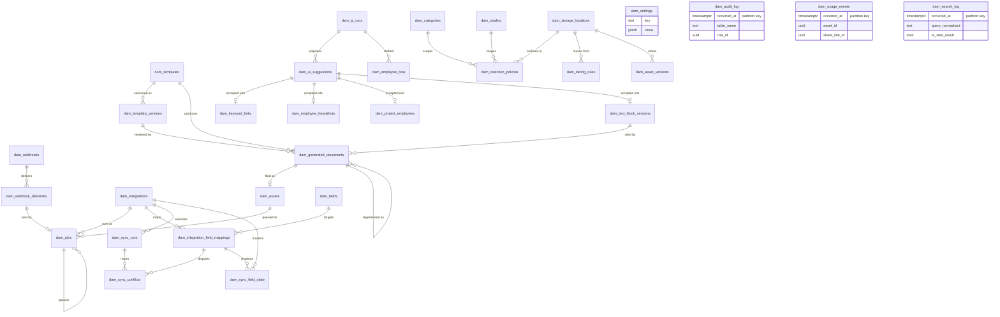

# SPEC — Project-Based DAM (OpenAsset-equivalent)

**Status:** Draft for review — 2026-09-15 — produced from the build brief. Nothing in this document is implemented, and SCHEMA.sql has not been applied to any database.
**Companions:** `SCHEMA.sql` (proposed Postgres schema), `ROADMAP.md` (phased build plan).
**Reference implementation consulted:** the existing dwp-dam repository (Next.js 15, Supabase, Google Drive, dwp auth broker) — its facts are cited where they constrain this design.

**Abstract.** A project-based digital asset management platform for a multi-studio architecture and interior design firm, functionally equivalent to OpenAsset. Projects are the organising unit; assets, employees, text blocks, rights and albums hang off them; metadata cascades from project to asset; search is faceted, full-text and semantic over a denormalised search row designed for 500,000 assets; output is on-the-fly derivatives, smart crops, watermarking, ZIPs and template-driven documents including CVs; governance is a six-tier role model with named access levels enforced in Postgres row-level security. Part 1 frames scope and decisions, parts 2 and 2B define every table, part 3 the permission model, part 4 the API, part 5 every functional module, part 6 architecture and operations. Appendices index the defaults, open questions, entities and endpoints.

> **Status of decisions.** The five items in brief §10 (storage of originals, RFP module, permission matrix, migrate-or-rebuild, target scale) and the additional questions Q6–Q10 are **OPEN — awaiting decision**. They are presented with options, a recommendation and consequences in §1 and are never treated as decided elsewhere. Every other choice is a recorded default tagged **[D-nnn]** and collected in Appendix A.

## Contents

- [1. Overview, scope and open decisions](#1-overview-scope-and-open-decisions)
  - [1.1 Purpose and positioning](#11-purpose-and-positioning)
  - [1.2 Users and their jobs](#12-users-and-their-jobs)
  - [1.3 Scope](#13-scope)
  - [1.4 Technology stack](#14-technology-stack)
  - [1.5 Design system](#15-design-system)
  - [1.6 Conventions and how each is enforced](#16-conventions-and-how-each-is-enforced)
  - [1.7 Relationship to the existing dwp-dam](#17-relationship-to-the-existing-dwp-dam)
  - [1.8 Glossary](#18-glossary)
  - [1.9 How to read this specification](#19-how-to-read-this-specification)
  - [1.10 Assumptions used until decisions land](#110-assumptions-used-until-decisions-land)
  - [1.11 Open decisions](#111-open-decisions)
- [2. Domain model — core](#2-domain-model-core)
  - [2.0 Conventions applied to every table in this part](#20-conventions-applied-to-every-table-in-this-part)
  - [2.1 `dam_studios`](#21-damstudios)
  - [2.2 `dam_clients`](#22-damclients)
  - [2.3 `dam_projects`](#23-damprojects)
  - [2.4 `dam_project_aliases`](#24-damprojectaliases)
  - [2.5 `dam_project_studios`](#25-damprojectstudios)
  - [2.6 `dam_project_assets`](#26-damprojectassets)
  - [2.7 `dam_categories`](#27-damcategories)
  - [2.8 `dam_keyword_categories`](#28-damkeywordcategories)
  - [2.9 `dam_keywords`](#29-damkeywords)
  - [2.10 `dam_keyword_aliases`](#210-damkeywordaliases)
  - [2.11 `dam_keyword_links`](#211-damkeywordlinks)
  - [2.12 `dam_category_keyword_categories`](#212-damcategorykeywordcategories)
  - [2.13 `dam_field_categories`](#213-damfieldcategories)
  - [2.14 `dam_fields`](#214-damfields)
  - [2.15 `dam_field_options`](#215-damfieldoptions)
  - [2.16 `dam_category_fields`](#216-damcategoryfields)
  - [2.17 `dam_field_values`](#217-damfieldvalues)
  - [2.18 `dam_storage_locations`](#218-damstoragelocations)
  - [2.19 `dam_assets`](#219-damassets)
  - [2.20 `dam_asset_versions`](#220-damassetversions)
  - [2.21 `dam_derivatives`](#221-damderivatives)
  - [2.22 `dam_render_cache`](#222-damrendercache)
  - [2.23 `dam_asset_search`](#223-damassetsearch)
  - [2.24 `dam_asset_embeddings`](#224-damassetembeddings)
  - [2.25 `dam_asset_ocr_text`](#225-damassetocrtext)
  - [2.26 `dam_asset_duplicates`](#226-damassetduplicates)
  - [2.27 `dam_ingest_sources`](#227-damingestsources)
  - [2.28 `dam_ingest_batches`](#228-damingestbatches)
  - [2.29 `dam_external_ids`](#229-damexternalids)
  - [2.30 Relationships and diagram](#230-relationships-and-diagram)
- [2B. Domain model — supporting](#2b-domain-model-supporting)
  - [2B.0 Conventions for this part](#2b0-conventions-for-this-part)
  - [2B.1 dam_users](#2b1-damusers)
  - [2B.2 dam_groups](#2b2-damgroups)
  - [2B.3 dam_group_members](#2b3-damgroupmembers)
  - [2B.4 dam_user_studios](#2b4-damuserstudios)
  - [2B.5 dam_access_levels](#2b5-damaccesslevels)
  - [2B.6 dam_access_grants](#2b6-damaccessgrants)
  - [2B.7 dam_api_keys](#2b7-damapikeys)
  - [2B.8 dam_employees](#2b8-damemployees)
  - [2B.9 dam_employee_bios](#2b9-damemployeebios)
  - [2B.10 dam_employee_headshots](#2b10-damemployeeheadshots)
  - [2B.11 dam_employee_education](#2b11-damemployeeeducation)
  - [2B.12 dam_employee_registrations](#2b12-damemployeeregistrations)
  - [2B.13 dam_employee_languages](#2b13-damemployeelanguages)
  - [2B.14 dam_project_employees](#2b14-damprojectemployees)
  - [2B.15 dam_albums](#2b15-damalbums)
  - [2B.16 dam_album_items](#2b16-damalbumitems)
  - [2B.17 dam_album_collaborators](#2b17-damalbumcollaborators)
  - [2B.18 dam_text_blocks](#2b18-damtextblocks)
  - [2B.19 dam_text_block_versions](#2b19-damtextblockversions)
  - [2B.20 dam_photographers](#2b20-damphotographers)
  - [2B.21 dam_copyright_holders](#2b21-damcopyrightholders)
  - [2B.22 dam_copyright_policies](#2b22-damcopyrightpolicies)
  - [2B.23 dam_asset_rights](#2b23-damassetrights)
  - [2B.24 dam_sizes](#2b24-damsizes)
  - [2B.25 dam_aspect_ratios](#2b25-damaspectratios)
  - [2B.26 dam_saved_searches](#2b26-damsavedsearches)
  - [2B.27 dam_share_links](#2b27-damsharelinks)
  - [2B.28 dam_share_link_items](#2b28-damsharelinkitems)
  - [2B.29 dam_upload_requests](#2b29-damuploadrequests)
  - [2B.30 dam_upload_request_files](#2b30-damuploadrequestfiles)
  - [2B.31 dam_comments](#2b31-damcomments)
  - [2B.32 dam_review_decisions](#2b32-damreviewdecisions)
  - [2B.33 dam_notifications](#2b33-damnotifications)
  - [2B.34 dam_ratings](#2b34-damratings)
  - [2B.35 dam_favourites](#2b35-damfavourites)
  - [2B.36 dam_audit_log](#2b36-damauditlog)
  - [2B.37 dam_usage_events](#2b37-damusageevents)
  - [2B.38 dam_search_log](#2b38-damsearchlog)
  - [2B.39 dam_jobs](#2b39-damjobs)
  - [2B.40 dam_webhooks](#2b40-damwebhooks)
  - [2B.41 dam_webhook_deliveries](#2b41-damwebhookdeliveries)
  - [2B.42 dam_integrations](#2b42-damintegrations)
  - [2B.43 dam_integration_field_mappings](#2b43-damintegrationfieldmappings)
  - [2B.44 dam_sync_runs](#2b44-damsyncruns)
  - [2B.45 dam_sync_conflicts](#2b45-damsyncconflicts)
  - [2B.46 dam_templates](#2b46-damtemplates)
  - [2B.47 dam_template_versions](#2b47-damtemplateversions)
  - [2B.48 dam_generated_documents](#2b48-damgenerateddocuments)
  - [2B.49 dam_ai_suggestions](#2b49-damaisuggestions)
  - [2B.50 dam_ai_runs](#2b50-damairuns)
  - [2B.51 dam_retention_policies](#2b51-damretentionpolicies)
  - [2B.52 dam_tiering_rules](#2b52-damtieringrules)
  - [2B.53 dam_settings](#2b53-damsettings)
  - [2B.54 Relationships and diagrams](#2b54-relationships-and-diagrams)
- [3. Identity, permissions and security](#3-identity-permissions-and-security)
  - [3.1 Principals and trust boundaries](#31-principals-and-trust-boundaries)
  - [3.2 Identity (DQ4)](#32-identity-dq4)
  - [3.3 Roles](#33-roles)
  - [3.4 Permission matrix — PROPOSED — OPEN §10.3](#34-permission-matrix-proposed-open-103)
  - [3.5 Access levels (DQ3)](#35-access-levels-dq3)
  - [3.6 Worked examples](#36-worked-examples)
  - [3.7 RLS design](#37-rls-design)
  - [3.8 API tokens](#38-api-tokens)
  - [3.9 Share-link and upload-request security (DQ15)](#39-share-link-and-upload-request-security-dq15)
  - [3.10 Secrets handling](#310-secrets-handling)
  - [3.11 Audit requirements](#311-audit-requirements)
  - [3.12 Threat model](#312-threat-model)
- [4. API surface](#4-api-surface)
  - [4.1 Conventions](#41-conventions)
  - [4.2 Resource index](#42-resource-index)
  - [4.3 Studios and clients](#43-studios-and-clients)
  - [4.4 Projects](#44-projects)
  - [4.5 Categories, keyword categories, keywords](#45-categories-keyword-categories-keywords)
  - [4.6 Custom fields](#46-custom-fields)
  - [4.7 Storage locations](#47-storage-locations)
  - [4.8 Assets](#48-assets)
  - [4.9 Uploads, ingest batches, ingest sources, duplicates](#49-uploads-ingest-batches-ingest-sources-duplicates)
  - [4.10 Identity and access: me, users, groups, access levels, grants, API keys](#410-identity-and-access-me-users-groups-access-levels-grants-api-keys)
  - [4.11 Employees](#411-employees)
  - [4.12 Albums](#412-albums)
  - [4.13 Text blocks](#413-text-blocks)
  - [4.14 Rights: photographers, copyright holders, policies, asset rights](#414-rights-photographers-copyright-holders-policies-asset-rights)
  - [4.15 Output: sizes, aspect ratios, templates, documents, exports](#415-output-sizes-aspect-ratios-templates-documents-exports)
  - [4.16 Saved searches](#416-saved-searches)
  - [4.17 Sharing: share links, public share endpoints, upload requests, public deposit endpoints](#417-sharing-share-links-public-share-endpoints-upload-requests-public-deposit-endpoints)
  - [4.18 Collaboration: comments, reviews, notifications, ratings, favourites, activity](#418-collaboration-comments-reviews-notifications-ratings-favourites-activity)
  - [4.19 Governance: audit log, usage events, search log, retention, tiering, settings](#419-governance-audit-log-usage-events-search-log-retention-tiering-settings)
  - [4.20 Jobs and background work](#420-jobs-and-background-work)
  - [4.21 Webhooks](#421-webhooks)
  - [4.22 Integrations and sync](#422-integrations-and-sync)
  - [4.23 AI: suggestions and runs](#423-ai-suggestions-and-runs)
  - [4.24 Analytics](#424-analytics)
  - [4.25 Health, readiness and the OpenAPI document](#425-health-readiness-and-the-openapi-document)
  - [4.26 OpenAsset → v2 mapping](#426-openasset-v2-mapping)
  - [4.27 Compatibility with the existing `/api/v1`](#427-compatibility-with-the-existing-apiv1)
- [5. Functional modules](#5-functional-modules)
  - [5.1 Ingest and upload (brief §4.1)](#51-ingest-and-upload-brief-41)
  - [5.2 Organisation and metadata (brief §4.2)](#52-organisation-and-metadata-brief-42)
  - [5.3 Search and discovery (brief §4.3)](#53-search-and-discovery-brief-43)
  - [5.4 Collaboration and sharing (brief §4.4)](#54-collaboration-and-sharing-brief-44)
  - [5.5 Output and document creation (brief §4.5)](#55-output-and-document-creation-brief-45)
  - [5.6 Employee module (brief §4.6)](#56-employee-module-brief-46)
  - [5.7 Rights and DRM (brief §4.7)](#57-rights-and-drm-brief-47)
  - [5.8 Admin and governance (brief §4.8)](#58-admin-and-governance-brief-48)
  - [5.9 Integrations (brief §4.9)](#59-integrations-brief-49)
  - [5.10 AI layer (brief §4.10)](#510-ai-layer-brief-410)
  - [5.11 Screens (brief §5)](#511-screens-brief-5)
- [6. Architecture, operations and non-functional requirements](#6-architecture-operations-and-non-functional-requirements)
  - [6.0 Conventions applied in this part](#60-conventions-applied-in-this-part)
  - [6.1 System context](#61-system-context)
  - [6.2 Services and runtime](#62-services-and-runtime)
  - [6.3 The `StorageProvider` abstraction](#63-the-storageprovider-abstraction)
  - [6.4 Derivatives, rendering and delivery](#64-derivatives-rendering-and-delivery)
  - [6.5 Background jobs](#65-background-jobs)
  - [6.6 The AI provider adapter](#66-the-ai-provider-adapter)
  - [6.7 Performance: budget, query shapes and the index plan](#67-performance-budget-query-shapes-and-the-index-plan)
  - [6.8 Observability](#68-observability)
  - [6.9 Backups, restore and disaster recovery](#69-backups-restore-and-disaster-recovery)
  - [6.10 Seed data and the performance harness](#610-seed-data-and-the-performance-harness)
  - [6.11 Accessibility and responsive behaviour](#611-accessibility-and-responsive-behaviour)
  - [6.12 Security operations and configuration](#612-security-operations-and-configuration)
  - [6.13 Environment variable inventory (names only)](#613-environment-variable-inventory-names-only)
  - [6.14 Repository layout, contracts and migrations](#614-repository-layout-contracts-and-migrations)
  - [6.15 Testing strategy](#615-testing-strategy)
  - [6.16 File format support matrix](#616-file-format-support-matrix)
  - [6.17 Appendix — migration from the existing dwp-dam](#617-appendix-migration-from-the-existing-dwp-dam)
- [Appendix A — Sensible defaults register](#appendix-a--sensible-defaults-register)
- [Appendix B — Open questions](#appendix-b--open-questions)
- [Appendix C — Entity index](#appendix-c--entity-index)
- [Appendix D — Endpoint index](#appendix-d--endpoint-index)

---

## 1. Overview, scope and open decisions

Decision ids minted in this part: **[D-100]** to **[D-149]**. Ids **[D-001]** to **[D-025]** and DQ1 to DQ18 refer to `context/DECISIONS.md`. Items marked **OPEN — awaiting decision** are not decided anywhere in this specification; §1.11 lists every one of them with options, a recommendation and the consequences of choosing otherwise.

### 1.1 Purpose and positioning

The platform is a project-based digital asset management system for a multi-studio international architecture and interior design firm, functionally equivalent to OpenAsset (Axomic), the incumbent product in the AEC niche. It replaces or absorbs the existing internal `dwp-dam` library (§1.7) and serves the firm's marketing and bid teams first.

What separates it from a generic DAM (Bynder, Canto, Brandfolder) is the organising unit. **The project, not the folder, is the spine.** Assets hang off projects through a many-to-many link that carries a per-link `rank` and `is_hero` flag; project metadata cascades to linked assets and asset-level values override it (DQ6); employees are first-class records linked to the projects they worked on with a role and a date range (DQ13); and search is expected to answer questions that span all three.

The guiding example from the brief (§1):

> "Show me hero images of completed hospitality projects in Vietnam over 4,000 sqm where Somchai was project architect."

How the data model answers it, in one paragraph. "Hospitality" is a keyword in the **project** namespace (Sector tree, `dam_keywords` with `namespace = 'project'`, DQ2), linked to the project through `dam_keyword_links`; "completed" is `dam_projects.status = 'completed'` (`dam_project_status`); "Vietnam" is `dam_projects.country_code = 'VN'` (with `dam_studios` supplying the studio when the query is by studio rather than by country); "over 4,000 sqm" is `dam_projects.size_sqm >= 4000`; "Somchai was project architect" is a `dam_project_employees` row joining the employee to the project with `role_keyword_id` pointing at the "Project Architect" keyword in the **employee** namespace (Project Role category, DQ13); and "hero images" is `dam_project_assets.is_hero = true` — exactly one per project (**[D-004]**). At query time none of this is joined row by row: the denormalised search row `dam_asset_search` (DQ5) already carries `project_ids[]`, `project_keyword_ids[]`, `country_code`, project status and size as facet fields, and `is_hero_anywhere`, so the whole query is a set of array-containment and range predicates on one GIN- and btree-indexed table, plus a single join to `dam_project_employees` for the role clause. That is what makes the 500 ms p95 target (brief §4.11) plausible at 500,000 assets.

### 1.2 Users and their jobs

| User group | Priority | Top jobs the platform must make fast |
|---|---|---|
| Marketing | Primary | Find the right imagery for a story or channel; curate albums; set hero and rank per project; share selections externally with expiry and watermark; export at a named Size; keep captions, credits and rights correct |
| Bid and proposal teams | Primary | Assemble project sheets, CVs and qualification packs from approved text blocks, cleared imagery and employee experience; search staff by credential, sector experience and role; generate documents from locked templates |
| Design leads | Secondary | Upload and tag project photography and renderings; confirm AI keyword suggestions; nominate heroes; review pending uploads for their projects |
| Studio directors | Secondary | See their studio's work by default; approve or reject uploads; watch rights expiry and tagging completeness for their studio; grant access to restricted material |
| Business development | Secondary | Find projects by client, sector, country and status; pull credentials decks; read conversational answers ("which completed F&B projects do we have photography for in Dubai?") |
| Global administrators and the owner | Operational | Manage users, roles and access levels; administer keywords, fields, categories, sizes and templates; run integrations and sync; read the audit log and analytics; manage storage tiers and retention |
| External photographers | Occasional, anonymous | Deposit files into a project through an upload request link without an account |
| Sibling applications | Machine | Read assets and projects over the API with a key: today's four `/api/v1` consumers (`dwp_website2026`, `proposal-maker`, `dwp-marketing-hub`, `studioai`) and future `/api/v2` clients |

### 1.3 Scope

#### 1.3.1 Modules in scope

The functional modules are those of brief §4, specified in detail in **Part 5** (module behaviour and screens). Data model in Parts 2a/2b, permissions in Part 3, API in Part 4, roadmap and operations in Part 6.

| Brief § | Module | Roadmap phase (brief §9) |
|---|---|---|
| 4.1 | Ingest and upload — bulk chunked upload, Drive folder walk, watched folders, metadata at point of upload, EXIF/IPTC/XMP, filename intelligence, duplicate detection, derivatives, versioning, review queue | 1 (basic), 2, 4 |
| 4.2 | Organisation and metadata — cascade with override, hierarchical keywords, bulk edit, hero and rank, ratings and favourites, controlled vocabularies, completeness scoring | 2 |
| 4.3 | Search and discovery — full text, facets, Boolean and phrase, semantic and similarity search, OCR, map view, saved searches, results grid and lightbox, zero-result logging | 3 (text), 10 (vector) |
| 4.4 | Collaboration and sharing — albums, external share links, upload requests, comments and approvals, notifications, activity feeds | 5 |
| 4.5 | Output and document creation — on-the-fly derivatives at download, smart crop, watermarking, ZIP with manifest, contact sheets, template-driven documents, Office/InDesign add-in | 4, 7 |
| 4.6 | Employee module — directory, profiles, project experience, staff search, CV export, org chart | 6 |
| 4.7 | Rights and DRM — per-asset rights, badges, block or warn-and-log, expiry alerts, usage log | 8 |
| 4.8 | Admin and governance — users, groups, six-tier roles, access levels in RLS, SSO, audit log, analytics, admin UIs, tiering, retention and trash, multi-studio scoping | 1 (roles, RLS), 8 |
| 4.9 | Integrations and API — `/api/v2`, webhooks, HubSpot, BambooHR, ProjectWorks, Drive/Sheets, Marq, CSV, sync configuration UI, OpenAsset importer | 9 |
| 4.10 | AI layer — suggested auto-tagging, captions and alt text, embeddings, OCR, headshot matching, description drafting, conversational query; RFP parsing as a stretch item | 10 (RFP: OPEN §10.2) |
| 4.11 | Non-functional — tablet and mobile capture, 500 ms p95 search at 500,000 assets, CDN signed URLs, WCAG 2.1 AA, structured logs, health endpoint, backups, seed data | every phase |
| 5 | Screens — Dashboard, Search/browse, Asset detail, Project list and detail, Employee directory and profile, Album list and detail, Upload wizard, Bulk edit drawer, Share link manager, Template gallery, Document generator, Rights dashboard, Admin suite | per module |

#### 1.3.2 Explicit non-goals (brief §8)

Not built in v1: a design or CAD editor; a full document management system for contract documents; time tracking; invoicing; a public marketing website; a native mobile application. Two clarifications that follow from the brief's integration list: the platform is never the master record for project codes, deal data or employee HR data — ProjectWorks, HubSpot and BambooHR remain the sources of truth for the fields they own (brief §4.9, "one external system as the source of truth per field"); and the RFP/proposal module is in scope only if §10.2 is decided that way.

### 1.4 Technology stack

Brief §2, restated with corrections and the abstractions named.

| Layer | Specification |
|---|---|
| Frontend | Next.js 15 (App Router), TypeScript, Tailwind CSS, React Server Components where sensible; the web app also hosts `/api/v2` and the `/api/v1` shim on the same origin **[D-100]** — one deployable, one cookie domain, no CORS between UI and API |
| Database | Supabase Postgres with Row Level Security on every table; extensions `pg_trgm`, `vector` (pgvector), `unaccent` (**[D-011]**), `pg_cron` for schedules (Cloud Scheduler as fallback, DQ8) |
| Derivative storage | Supabase Storage behind a CDN with signed URLs (DQ7, **[D-009]**) |
| Original file storage | Behind the **`StorageProvider`** interface (`packages/storage`; contract in `existing-drive-and-ops.md` §9: `ObjectRef`, `ObjectMeta`, `UploadSession`, `SignedUrlOptions`, `QuotaInfo`; methods `put`, `createUploadSession`, `finalizeUpload`, `replace`, `rename`, `move`, `delete`, `restore`, `head`, `exists`, `get`, `stream`, `signedUrl`, `nativePreview`, `list`, `ensureFolder`, `changes`, `quota`, `capabilities`) with implementations `GoogleDriveProvider`, `GcsProvider`, `SupabaseStorageProvider` (S3 later). Postgres is the index; the provider is bytes plus a few metadata reads. Where originals live is **OPEN — awaiting decision (§10.1)**; the schema is neutral (`dam_asset_versions.storage_location_id`) |
| Deployment | Google Cloud Run, project `dwp2026`, region **`asia-southeast3`** (the brief's `asia-southeast-3` is a typo; the real region id has no second hyphen) **[D-101]**. Two containerised, stateless services: the web service and the worker service `dwp-dam-worker` (min instances 1, 2 vCPU / 4 GiB for TIFF decoding, DQ8) **[D-102]** — request handlers never do long work; the worker owns ingest, derivatives, transcode, embedding, OCR, sync, exports and scheduled sweeps |
| Auth | Google SSO via the central dwp auth broker, the platform's own `dam_users` and six-tier `dam_role`, server-minted Supabase JWT for RLS (DQ4; detail in Part 3). Supabase Auth alternative rejected — **Q7 decided 2026-09-23** |
| Background jobs | Postgres queue table `dam_jobs` claimed with `FOR UPDATE SKIP LOCKED`, visibility timeout, exponential backoff, dead-letter notification (DQ8, **[D-018]**) |
| AI | The **`AiProvider`** adapter (`packages/ai`; contract in `existing-ai.md` §13: capabilities `autoTag`, `caption`, `embedImage`, `embedText`, `ocr`, `matchHeadshot`, `draftDescription`, `converse`) with `GeminiProvider`, `ClaudeProvider`, a `CompositeProvider` that routes each capability to a configured provider, and a `NullProvider` (no key means the feature is off). Persistence is the caller's job; every result carries `Usage` for `dam_ai_runs`. Embedding provider is **OPEN Q9** |
| Design system | See §1.5 — **OPEN Q6** |
| Repository | Monorepo (DQ18): `apps/web`, `apps/worker`, `packages/contracts` (Zod), `packages/db` (generated types and mappers), `packages/storage`, `packages/ai` |

#### 1.4.1 Service topology

| Concern | Web service (`apps/web`) | Worker service (`apps/worker`, `dwp-dam-worker`) |
|---|---|---|
| Serves | Pages, RSC, `/api/*` internal routes, `/api/v2`, `/api/v1` shim, `/api/public` share and upload-request gateways, `/api/health` | No inbound traffic except `/health`; pulls from `dam_jobs` |
| Does | Authenticate, authorise, validate with Zod, read and write through RLS as the principal, create upload sessions, sign derivative URLs, enqueue jobs, stream small responses | Ingest chain (`hash → extract_metadata → derivatives → dedupe → embed → ocr → index`), transcode, PDF render, document generation, ZIP export, reindex, rights and tiering sweeps, purge, sync runs, webhook delivery, notifications and digests, partition creation, seed data |
| Never does | Long or CPU-heavy work (a request finalises an upload by enqueuing), TIFF decoding, holding `service_role` (Part 3 §3.7.5) | Serve a user request synchronously |
| Scaling | Cloud Run request-driven, min instances 0 or 1 (Part 6), 1 vCPU / 1 GiB class | Min instances 1, 2 vCPU / 4 GiB, concurrency 4 jobs per instance (**[D-018]**); scales on queue depth via a Cloud Monitoring metric exported from `dam_jobs` |
| Identity in the database | `authenticated` JWT per principal, `system` JWT for narrow platform writes | `service_role`, with `dam.actor_id` and `dam.request_id` set per transaction for audit attribution |
| Schedules | none | `pg_cron` (fallback Cloud Scheduler) enqueues; the worker executes |
| Failure isolation | A worker outage delays derivatives and indexing; browsing, search over already-indexed rows and metadata edits keep working | A web outage stops user traffic; queued jobs continue |

### 1.5 Design system

#### 1.5.1 What the brief specifies (§2)

"Paper white, ink black, blueprint blue. Fraunces (display), Montserrat (UI), JetBrains Mono (code/metadata). Dense, information-first layouts — this is a professional tool, not a consumer gallery."

#### 1.5.2 The conflict with the fleet standard

The organisation is converging twelve applications on the **dwp.intelligence UI Standard v1.3** (operative spec: `docs/dwp_Intelligence_UI_Consistency_Review.md` in the dwp-dam repository — no file of the standard's own name exists). The existing dwp-dam launched on 2026-07-24 with exactly the brief's §2 palette and type stack, was re-skinned to the dwp Studio system in August 2026 and to the fleet standard on 2026-09-07, both times by explicit user decision. Adopting §2 literally would re-introduce, in a new fleet application, the deviations the fleet review names for removal.

The standard, in brief: eight colour tokens and nothing else (bg `#F7F7F5`, surface `#FFFFFF`, text `#2C2C2A`, muted `#5F5E5A`, accent `#A5680F`, border `#D9D7CE`, on-accent `#FFFFFF`, danger `#7E2B25`; dark and "System" modes recolour the same eight); one sans family at weights 400 and 500; type scale 12/14/16/20/24 only; 6 px radius everywhere; no shadows except `shadow-menu` on floating overlays; a 240 px sidebar collapsible to a 56 px rail, 56 px top bar, 40 px tabs; page header = title + one-line description + at most one primary action; Title Case labels, verb-first sentence-case buttons, British spellings, no ampersands, arrows or exclamation marks.

Conflict table (from `context/existing-ui-standard.md` §7):

| # | Dimension | Brief §2 | Fleet standard v1.3 | Severity |
|---|---|---|---|---|
| C1 | Neutral temperature | Cool blue-white `#F2F4F8` / navy `#1C2530` | Warm `#F7F7F5` / `#2C2C2A`; "no cool grey, slate or blue-grey anywhere" | High |
| C2 | Accent | Blueprint blue `#2F6BE8` | Ochre `#A5680F`; saturated blue listed as a fleet deviation | High |
| C3 | Number of hues | Three named colours plus a six-step ramp | Eight tokens exactly; a signal is the accent or danger | High |
| C4 | Display face | Fraunces (serif) | One sans family; no serif anywhere in the fleet | High |
| C5 | UI face | Montserrat | Proxima Nova / Inter; Montserrat named as a deviation on three apps | High |
| C6 | Monospace | JetBrains Mono for code/metadata | "No monospace, anywhere"; `tabular-nums` for aligned figures | High |
| C7 | Weights | 400/500/600 and 400–700 | 400 and 500 only | Medium |
| C8 | Type scale | 9–10 px micro-labels for density | 12 px floor; density from spacing and line height | Medium |
| C9 | Radius | 3 px | 6 px | Low |
| C10 | Shell | 64 px icon rail with mono labels | 240 px sidebar / 56 px rail / 56 px top bar / 40 px tabs | Medium |
| C11 | Page header | Unspecified | Title + description + one action, no eyebrow | Low |
| C12 | Layout density | "Dense, information-first" | Compatible: 14 px body, 16 px card padding, hairlines not shadows | Low |
| C13 | Appearance modes | Silent | Light / Dark / System (System = OS in the standard; = cream/coral palette in dwp-dam by a recorded exception) | Low |
| C14 | Fleet integration | Silent | Wordmark + app name, Feedback and user photo top-right, app switcher, planned `@dwp/ui` package | Medium |
| C15 | Accessibility | WCAG 2.1 AA (brief §4.11) | Not audited; ochre on white about 4.6:1, muted on bg about 5.6:1 (computed, not tested) | Info |

C11–C13 and C15 are reconcilable by defaults; C1–C10 are a genuine fork. This is **OPEN Q6** (§1.11.6). Whatever the outcome, two rules hold: **[D-103]** "dense, information-first" is treated as a *layout* rule — table-heavy screens, compact rows, 14 px body, 12 px labels, collapsible rail — not as licence for sub-12 px type or a third typeface, because density is achievable inside either system; and **[D-104]** the platform follows the fleet naming and copy rules of the standard (§5 of the UI fact sheet: Title Case labels, page title equals sidebar label, verb-first sentence-case buttons, British spelling, product names spelled as the product does, no `&`, `->` or `!`) regardless of the palette chosen, because those rules cost nothing and the app will be opened from the fleet hub.

### 1.6 Conventions and how each is enforced

Brief §6 conventions, DECISIONS §4, and the enforcement mechanism for each. Enforcement is automated in CI where it can be; a convention with no check is a wish.

| Convention | Rule | Enforced by |
|---|---|---|
| `dam_` prefix | Every table, enum, function, view, trigger and policy is prefixed `dam_`; indexes `<table>_<cols>_idx` (unique `_key`), policies `dam_<table>_<cmd>_<who>`, triggers `trg_<table>_<purpose>` | **[D-105]** Offline SQL parser (`sqlcheck/check.mjs`) and structural lint (`sqlcheck/lint.mjs`) run in CI over `SCHEMA.sql` and every migration; a name outside the convention fails the build |
| Six standard columns | `id uuid pk default gen_random_uuid()`, `created_at`, `updated_at` (both `timestamptz not null default now()`), `created_by`, `updated_by` (`uuid references dam_users(id)`, nullable), `deleted_at timestamptz` — plus `deleted_by` where the trash UI needs it; partition children exempt | Lint rule: every `CREATE TABLE` under `dam_` declares all six (or is a declared partition child); `updated_at` must have `trg_<table>_set_updated_at` calling `dam_set_updated_at()` |
| RLS on every table, deny by default | `ENABLE ROW LEVEL SECURITY` (never `FORCE`, Part 3 §3.7.4) and at least one explicit policy per command that is meant to be allowed; no policy means no access | Lint rule: every table has `ENABLE ROW LEVEL SECURITY`; a table with zero policies is reported (allowed only for tables written exclusively by triggers, `service_role` or SECURITY DEFINER RPCs, listed in an allow-list in the lint config) |
| Audit on business tables | `trg_<table>_audit` calling `dam_audit_row()` on every business table; not on `dam_asset_search`, `dam_render_cache`, `dam_jobs`, logs (**[D-019]**) | Lint rule with the same allow-list |
| `snake_case` in Postgres, `camelCase` in TypeScript | Generated types bridge the two | **[D-106]** `packages/db` is produced by `supabase gen types typescript` plus generated snake↔camel mappers; hand-written DB row types are forbidden (ESLint rule bans `interface .*Row` outside `packages/db`); CI regenerates and fails on diff |
| Zod as single source of truth | Every API body, query string, entity shape and environment variable is a Zod schema in `packages/contracts`; the client imports the same schema; OpenAPI 3.1 is generated from it (DQ10) | **[D-107]** CI generates `openapi.json` and fails on diff; route handlers must call `parse()` on the contract (lint: no `req.json()` without a contract) |
| Migrations | `SCHEMA.sql` is the reviewed target; it is cut into `supabase/migrations/<phase>_<n>_<name>.sql` per roadmap phase; forward-only, never edited after merge | **[D-108]** CI runs the offline parser on each file, then `supabase db reset` against a local database, then a drift check that the migrated database equals `SCHEMA.sql` (`supabase db diff` must be empty); a migration touching a partitioned log must also add the partition job |
| No secrets in the repo | Everything through environment variables; secret values in Secret Manager; tables and `config jsonb` hold secret *names* only | **[D-109]** `packages/contracts/env.ts` Zod schema lists every variable by name and is validated at boot (fail fast); a secret scanner (gitleaks or equivalent) runs in CI; `.env*` is ignored by git, Docker and gcloud. Delivery mechanism in Part 3 §3.10 |
| No `NEXT_PUBLIC_*` | All configuration is runtime, server-side (the Docker builder receives no build args, so `NEXT_PUBLIC_*` inlines as `undefined` on Cloud Run) | Lint rule: `NEXT_PUBLIC_` string forbidden outside a documented allow-list (empty by default) |
| Search row and caches are machine-owned | `dam_asset_search`, `dam_render_cache`, `dam_asset_embeddings` are written by triggers and jobs only | RLS: no insert/update policy for user principals; the app writes them only from the worker |
| British spelling, fleet copy rules | UI strings and documentation | Lint dictionary on `messages/*.json` (en-GB); review checklist in Part 5 |

### 1.7 Relationship to the existing dwp-dam

What exists today (from `context/existing-schema-and-types.md` and `existing-auth-and-api.md`, measured 2026-09-07): a Next.js 15 application on Cloud Run (`dwp2026` / `dwp-dam` / `asia-southeast3`) whose metadata lives in one Supabase table, `common_dam_assets` (16 columns, RLS off, written with the anon key, no `updated_at`, `created_by` or soft delete), holding **34,437 rows across 1,707 Drive folder paths**; the files themselves sit in the Google Drive Shared Drive `dwp_Digital_Asset` under the convention `<drive>/<collection>/<LOCATION>/<project>/…`, with the studio inferred from a path segment (15 studio codes, about 92% of assets under a location folder), tags as a flat lower-cased `text[]`, a three-level sector taxonomy in three text columns, and a `publish_permission` column that is `pending` on 100% of rows. Sign-in is SSO through the central dwp auth broker (HS256 `dwp_session` cookie; the broker's role is always `viewer` and the app has no user table). An external API `/api/v1/*` (16 endpoints, static per-site keys in `DAM_API_KEYS`, envelope `{data, meta}`, a 12-field asset shape, no rate limit) is consumed by **four production sites**: `dwp_website2026`, `proposal-maker`, `dwp-marketing-hub`, `studioai`. There is no project entity, no employee, no rights model, no embeddings, no audit log and no versioning; auto-tagging writes Gemini output straight into `tags`, which the brief now forbids.

Two paths, **OPEN — awaiting decision (§10.4)** (§1.11.4): **(a) migrate** — run the field-by-field mapping in `existing-schema-and-types.md` §9 (project derived from the path, category from the collection folder, tags split into project sector keywords, asset keywords and dropped location terms, every legacy row landing as `pending` with rights `unknown` — **[D-020]**), keep Drive files where they are, store `common_dam_assets.id` as a `dwp_dam_v1` external id (DQ17) and serve `/api/v1` as a shim on the same origin so the four consumers keep working; or **(b) clean rebuild** — a new library and a new app name (**OPEN Q10**), with the old application retired only after the consumers move to `/api/v2`. Existing capabilities that have no counterpart in the brief but that the consumers or users rely on — the Slides export (`POST /api/slides/export`, HMAC-signed image fetch), the preset tag library endpoints, folder-path addressing — are carried by the shim under (a) and scheduled for retirement under (b); Part 4 specifies the shim either way.

### 1.8 Glossary

Terms are used in this sense throughout the specification and in UI copy. Where a term maps to an OpenAsset resource the name is given in parentheses [memory].

| Term | Meaning |
|---|---|
| **Project** (`Projects`) | The spine. A piece of work the firm did or is pursuing: code, name, client, home studio and contributing studios, location with coordinates, sector (project keywords), size in sqm, value and currency, status (`prospect`, `active`, `on_hold`, `completed`, `cancelled`, `unverified`), dates, hero asset, custom fields, access level. Table `dam_projects` |
| **Asset** (`Files`) | Any digital file the firm keeps: image, rendering, video, PDF, CAD, InDesign, Office document. Linked to zero or more projects. Carries filename, title, caption, alt text, category, current version pointer, status, access level, ratings, completeness score. Table `dam_assets` |
| **Version** | One immutable uploaded file behind an asset: object reference in a storage location, size, hashes, dimensions, EXIF/IPTC/XMP. Replacing an asset adds a version and moves `current_version_id`; metadata, keywords, albums and rights stay on the asset. Table `dam_asset_versions` |
| **Derivative** | A generated rendition of a version — thumbnail, preview, proxy, poster, PDF page, contact sheet, placeholder — stored in Supabase Storage and served through the CDN with a signed URL. Table `dam_derivatives`; on-the-fly renders cached in `dam_render_cache` |
| **Category** (`Categories`) | The single top-level bucket an asset belongs to: Project Photography, Renderings, Drawings, Staff, Logos and Brand, Marketing Collateral, Awards, Site Photos. Each category defines which fields and keyword categories apply and are required, its default access level and whether uploads need review. Table `dam_categories` |
| **Keyword** (`Keywords`, `ProjectKeywords`, `EmployeeKeywords`) | A node in a hierarchical controlled vocabulary, with aliases. Applied to a target by a link, never typed free-form into the record. Table `dam_keywords`, links in `dam_keyword_links` |
| **Keyword category** (`KeywordCategories`, …) | The root of one keyword tree — Space Type, Material, Time of Day, Photography Style, Sector, Project Role. Table `dam_keyword_categories` |
| **Field** (`Fields`) | An admin-defined custom metadata attribute with a type (text, long text, number, date, single-select, multi-select, boolean, URL, currency), a scope (project, asset, employee) and, for selects, options. Values are typed rows in `dam_field_values`. A field holds a *value*; a keyword *classifies*. "Client" is a relation, "Size (sqm)" is a field, "Hospitality" is a keyword |
| **Namespace** | Which kind of record a keyword tree describes: `asset`, `project` or `employee` (`dam_keyword_namespace`). Trees never cross namespaces; the search row copies project keywords onto assets so they are searchable together |
| **Access level** (`AccessLevel`) | A named visibility rule — `Firm-wide`, `Studio`, `Restricted`, `Confidential` seeded (**[D-013]**) — with a minimum role and a scope (`firm`, `studio`, `grant_only`), attached to a category, a project or an asset and extended to named users or groups by grants. Enforced in RLS. Tables `dam_access_levels`, `dam_access_grants` |
| **Studio** | A dwp office or region group (15 seeded codes, DQ11). A project has one home studio and any number of contributing studios; a user is a member of one or more studios; default visibility is "my studios' projects". Table `dam_studios` |
| **Hero** | The one asset that represents a project (`dam_project_assets.is_hero`, exactly one per project) |
| **Rank** | The manual presentation order of an asset within a project (`dam_project_assets.rank`), controlled by marketing |
| **Text block** (`TextRewrites`) | Reusable approved copy — project descriptions at fixed word counts, boilerplate, award text, sustainability narrative — versioned with an approval state; documents reference a specific version. Tables `dam_text_blocks`, `dam_text_block_versions` |
| **Size** (`Sizes`) | A named output preset: dimensions, DPI, format, colour profile, watermark on or off. Table `dam_sizes` |
| **Aspect ratio** (`AspectRatios`) | A named crop ratio for smart cropping. Table `dam_aspect_ratios` |
| **Share link** | A token-addressed external view of an album, a selection, one asset or a saved search, with optional expiry, password, download and watermark flags and view analytics. Table `dam_share_links` |
| **Upload request** | A token-addressed link that lets an external party deposit files into a project and category without an account; files land `pending`. Table `dam_upload_requests` |
| **Suggestion** | An AI proposal — keyword, caption, alt text, description, headshot match, crop, project match — held in `dam_ai_suggestions` with confidence and model until a person accepts or rejects it. Suggestions never touch the live taxonomy on their own |
| **Search row** | The denormalised, machine-maintained row per asset in `dam_asset_search` that search and facets read instead of joining the raw tables |
| **Album** (`Albums`) | An ordered, nestable, curated collection of assets: personal, shared or company-wide, with collaborators. Table `dam_albums` |
| **Employee** (`Employees`) | A staff record with headshots, bios at fixed lengths, education, registrations, languages, expertise keywords and project roles. Table `dam_employees`; optionally linked to a `dam_users` row |
| **Principal** | Whoever a request acts as: `user`, `api_key`, `share_link`, `upload_request` or `system` (`dam_principal_type`) |
| **Role** | One of six tiers on a user — `viewer`, `contributor`, `editor`, `studio_admin`, `global_admin`, `owner` (`dam_role`), optionally overridden per studio |
| **Rights status** | The computed state of an asset's licence: `cleared`, `restricted`, `expiring`, `expired`, `unknown` (`dam_rights_status`) |
| **Studio scope** | The set of studios a request is evaluated against: the caller's memberships, lifted by `cross_studio_visibility` or role ≥ `editor` |

### 1.9 How to read this specification

| Part | Title | Owns |
|---|---|---|
| 1 | Overview, scope and open decisions (this part) | Purpose, users, scope, stack, design system, conventions, glossary, assumptions, every OPEN item |
| 2a | Data model — core | Studios, clients, projects, assets, versions, derivatives, categories, keywords, fields, storage locations, search row, embeddings, ingest, external ids |
| 2b | Data model — supporting | Users, groups, access levels, API keys, employees, albums, text blocks, rights, sizes, saved searches, share links, upload requests, comments, notifications, logs, jobs, webhooks, integrations, templates, AI suggestions, retention, settings |
| 3 | Identity, permissions and security | SSO, provisioning, JWT claims, roles and the proposed matrix, access levels, RLS design, API keys, share-link security, secrets, audit, threat model |
| 4 | API surface | `/api/v2` resources, query idioms, errors, rate limits, webhooks, the `/api/v1` compatibility shim, OpenAPI generation |
| 5 | Functional modules and screens | Behaviour of each brief §4 module, screen inventory, workflows, UI rules |
| 6 | Non-functional requirements, operations and roadmap | Performance budgets, logging, health, backups, seed data, deployment, phase checklists |
| A–D | Appendices (added by the assembler) | Indicative: A — consolidated table and enum inventory; B — decision register (every **[D-nnn]** with its rationale); C — open-decision register; D — OpenAsset resource mapping [memory]. Titles are the assembler's |

Notation. **[D-nnn]** marks a default this specification chose; each carries a one-line rationale at first use and may be overturned by the user without affecting anything else unless the entry says so. **OPEN — awaiting decision (§10.n / Qn)** marks the ten items nothing here decides. DQn refers to the design decisions in `context/DECISIONS.md` §1. [memory] marks an OpenAsset detail recalled without a verified source. "Brief §n" refers to the user's brief.

### 1.10 Assumptions used until decisions land

These are working assumptions, not decisions; each is replaced by the answer to the OPEN item it depends on.

| Assumption | Depends on | Used by |
|---|---|---|
| **Scale**: 35,000 assets, about 2,000 projects and 600 employees at go-live; 500,000 assets and 5,000 projects within three years (brief §4.11); 150 concurrent users at peak; 10,000 employees never (staff records stay in the low thousands) | §10.5 | Index design, monthly log partitions, HNSW parameters, worker sizing, ZIP and rate-limit caps |
| **Originals in Google Drive during Phase 1**, derivatives in Supabase Storage, `GoogleDriveProvider` as the default originals location; GCS as the intended target behind the same interface | §10.1 | Phase 1 storage adapter, upload path (browser to provider, resumable, 8 MiB chunks **[D-022]**), migration mechanics |
| **Broker SSO** stays the identity front door; the platform owns roles; the broker's `role` claim is ignored | Q7 | Part 3 §3.2, middleware, `dam_users` |
| **The permission matrix in Part 3 §3.4** is what RLS policies encode until the user edits it | §10.3 | Part 3, SCHEMA.sql policies |
| **The existing corpus is migrated** (path (a) of §10.4) with a reconciling Drive walk; `/api/v1` is served as a shim on the same origin; the web service keeps the name `dwp-dam` and the app keeps the name "Digital Assets" | §10.4, Q10 | Phase 1 adapter, Phase 9 importer, Part 4 shim, naming in Part 5 |
| **Fleet UI standard** tokens and shell are the seed for `apps/web`; "dense, information-first" is a layout rule | Q6 | Part 5 screens |
| **Vertex AI multimodal embeddings** (1408-d image, joint image-text space) and `gemini-embedding-001` text (768-d); dimensions are fixed in the schema (**[D-006]**) so a provider change is a re-embed, not a migration | Q9 | `dam_asset_embeddings`, Phase 10 |
| **RFP/proposal AI is a separate application** consuming `/api/v2`; the DAM ships the text blocks, imagery, employee data and conversational query it needs | §10.2 | Phase scope, table inventory |
| **`/api/v1` sunset 12 months after `/api/v2` GA**, announced to the four consumers at v2 GA | Q8 | Part 4 shim lifetime, Phase 9 |
| **AI default routing**: Gemini for autoTag, caption, embed and OCR; Claude for describe and converse; overridable per capability (the routing proposed in `existing-ai.md` §13.1) | none (default) | `packages/ai` configuration |

### 1.11 Open decisions

Each item follows one template: **Question / Options / Recommendation / What changes if you choose otherwise / Blocks which roadmap phase.** Nothing in this section is decided.

#### 1.11.1 OPEN — awaiting decision (§10.1) — Durable store for originals

**Question.** Where do original files live: Google Drive (cheap, already licensed, where 34,437 assets already sit), Google Cloud Storage, or Supabase Storage?

**Options.**

| Option | Description | Strengths | Costs and limits (from `existing-drive-and-ops.md` §7, §10) |
|---|---|---|---|
| (a) Drive originals + Supabase Storage derivatives | Keep Drive as the object store behind `GoogleDriveProvider`; Postgres is the index; derivatives and all renders in Supabase Storage on the CDN | No migration of the existing corpus; licence already paid; Drive stays a familiar surface for staff | 400,000 items per Shared Drive (500k assets need sharding across several drives); 750 GB/day upload cap per account (the service account is the account; a 10 TB migration is about 14 days at the cap); whole-drive listing lags by hours (Changes API only); every original byte proxied through Cloud Run (no native policy-bearing signed URLs); Drive API quota shared by everything; no move primitive; replace overwrites in place so versioning needs a new object per version anyway |
| (b) GCS in `asia-southeast3` + Cloud CDN signed URLs; Drive kept as an ingest source | Originals as immutable GCS objects; native signed URLs; watched Drive folders feed ingest | Strong consistency; no item ceiling; native signed URLs so Cloud Run leaves the download path; same GCP project; resumable uploads direct from the browser | New storage cost; a one-time copy of about 34k existing files (and 10 TB at scale); Drive remains for staff who browse folders |
| (c) Supabase Storage for everything | One vendor for database, auth-adjacent JWT and files | Simplest operationally | Egress pricing and per-object limits need verification at 500k × 4 objects; region alignment with `asia-southeast3` is not guaranteed; less headroom than GCS for 60 MB TIFFs and video |

**Recommendation.** (b) as the target, with (a) as the Phase 1 default behind `StorageProvider` so the existing Drive corpus works on day one and the swap is a configuration change per `dam_storage_locations` row. Rationale: the strains in (a) are architectural (item ceiling, daily upload cap, proxy-everything egress, sharing-model mismatch with RLS-enforced access) and get worse with scale, while `StorageProvider` makes the move incremental — new versions go to GCS, old ones stay in Drive until a background `tiering_sweep` job moves them.

**What changes if you choose otherwise.** Schema: nothing — `storage_location_id` per version is provider-neutral. Choosing (a) permanently makes drive sharding, a daily upload budget, Drive API quota accounting and the Cloud Run proxy path permanent constraints; the CDN then serves only derivatives, and original downloads stay proxied. Choosing (c) requires a cost and limits check before Phase 1 and puts derivative and original egress on one vendor's meter.

**Blocks.** Phase 1 (which provider is the default originals location — can start on (a)); Phase 4 (native signed URLs for original download need (b) or (c)); Phase 9 (importer: copy files or leave in place).

#### 1.11.2 OPEN — awaiting decision (§10.2) — RFP / proposal AI module

**Question.** Build the RFP parsing, requirement extraction, compliance checklist, go/no-go scoring and assisted proposal drafting (brief §4.10 stretch, mirroring OpenAsset's "Shred") inside the DAM, or keep the DAM DAM-only and treat proposals as a separate application?

**Options.**

| Option | Description | Consequences |
|---|---|---|
| (i) Inside the DAM, as Phase 11 | New tables `dam_rfp_documents`, `dam_rfp_requirements`, `dam_rfp_responses` (not in the DECISIONS inventory), new screens, long-running document parsing jobs, a drafting UI | One product, one permission model, direct access to text blocks and imagery; but scope grows past OpenAsset parity, the AI layer must ship first, and proposal workflow (review, submission tracking) is a different discipline from asset management |
| (ii) Separate application on `/api/v2` | The DAM exposes approved text blocks, cleared imagery with rights status, employee experience and the conversational query; the proposal application (the existing `proposal-maker` consumer is the obvious host) parses RFPs and drafts | DAM stays focused; the API surface gets exercised by a real consumer early; the proposal team can iterate without DAM releases; but two codebases, and the proposal application needs its own auth and storage for RFP documents |

**Recommendation.** (ii). Rationale: the platform's value is the corpus and its metadata; a proposal writer is a consumer of that corpus, and `proposal-maker` already exists as a consumer. The DAM should guarantee what a proposal writer needs — versioned approved text blocks (DQ14), rights status on every asset (DQ16), employee experience with roles and dates (DQ13), the `converse` capability with RLS-scoped tools — and stop there.

**What changes if you choose otherwise.** Schema: three RFP tables added to Part 2b, a `dam_job_kind` extension (`rfp_parse`, `rfp_score`), a `dam_template_kind` extension (`proposal`), a new `dam_ai_suggestion_kind` (`rfp_requirement`). Roadmap: Phase 11 appended after the AI layer; Phase 7 templates gain a proposal template type. Permissions: a new capability row in the Part 3 matrix (draft proposal).

**Blocks.** Nothing before Phase 10; Phase 7 template design should know the answer.

#### 1.11.3 OPEN — awaiting decision (§10.3) — Exact six-tier permission matrix

**Question.** Is the proposed matrix in Part 3 §3.4 (rows = 44 capabilities across every module; columns = Viewer, Contributor, Editor, Studio Admin, Global Admin, Owner) correct, or which cells change?

**Options.** Accept the proposal as is; edit cells; or change the tier model (for example, make Studio Admin a per-studio flag only and drop it from the global `dam_role` ordering).

**Recommendation.** Accept the proposal with two points explicitly confirmed: (1) Studio Admin is normally an editor-or-below globally with `role_override = 'studio_admin'` in named studios (DQ3) — the matrix column is the *effective* role inside such a studio; (2) rights-block behaviour on download — hard block for Viewer and Contributor on `restricted` and `expired`, warn-and-log for Editor and Studio Admin, `do_not_use` blocking everyone except Global Admin and Owner with a logged reason (DQ16, Part 3 §3.4.2).

**What changes if you choose otherwise.** Schema: none — roles are an enum and capabilities are code plus policies (DECISIONS §7). Cell edits change the RLS write policies and the API authorisation table in Part 4; a tier-model change changes `dam_role`, `dam_user_studios.role_override` semantics and every helper in Part 3 §3.7.1.

**Blocks.** Phase 1 (roles and RLS ship in Foundation). Work can start on the proposal; the policies are regenerated from the final matrix before Phase 1 closes.

#### 1.11.4 OPEN — awaiting decision (§10.4) — Migrate the existing dwp-dam or clean rebuild

**Question.** Is the existing internal DAM — `common_dam_assets` (34,437 rows), the Drive files under `dwp_Digital_Asset`, the `/api/v1` contract and its four consumers — migrated into this platform, or is this a clean rebuild that replaces it?

**Options.**

| Option | Description | Consequences |
|---|---|---|
| (a) Migrate | Copy the table first, then run a reconciling Drive walk that creates `pending` assets for files the table lacks (the 718 rows deleted from the database in July 2026 still exist in Drive); derive projects from folder paths (about 92% yield), categories from collections, keywords from tags with location terms dropped; keep files in place; store legacy ids as `dwp_dam_v1` external ids; serve `/api/v1` as a shim on the same origin; keep the web service `dwp-dam` and the name "Digital Assets" | Day-one library of 34k assets; consumers keep working with unchanged ids and URLs; the Slides export and preset endpoints survive in the shim; but the migration inherits every legacy inconsistency (about 8% of assets with no project, `unverified` projects with null codes, mixed free-text tags landing as suggestions) and the shim is a permanent maintenance surface until Q8 sunsets it |
| (b) Clean rebuild | New library, new app name (Q10), re-ingest from Drive through the new ingest pipeline as if new material, consumers migrated to `/api/v2`; the old application retired afterwards | Clean taxonomy from the start, no shim; but a period of two libraries, four consumer sites to change (`image_url`/`thumbnail_url` with embedded UUIDs are in their pages today), and the 34k assets' tags and taxonomy work is lost unless re-derived anyway |

**Recommendation.** (a), with the reconciling Drive walk proposed in `existing-schema-and-types.md` §9.8. Rationale: four consumer sites depend on ids and URLs; the derivation rules already exist in code (`studioForPath`, the code pattern `^\d{2}-\d{4,5}$`); and the honest baseline — every legacy asset `pending`, rights `unknown` — costs nothing that a rebuild would not also cost.

**What changes if you choose otherwise.** Schema: none in either case (`dam_external_ids` exists regardless). Under (b): Part 4's shim section becomes a consumer migration plan; Q10 must be answered before Phase 1 (the app needs a name); the importer in Phase 9 targets Drive rather than `common_dam_assets`; `dam_studios.legacy_folder_names` is still needed for watched-folder ingest.

**Blocks.** Phase 1 (storage adapter default and app identity) and Phase 9 (importer). Q10 is contingent on this item.

#### 1.11.5 OPEN — awaiting decision (§10.5) — Target scale

**Question.** How many assets, projects, employees and concurrent users at go-live and in three years?

**Options.** Confirm the working assumptions in §1.10 (35k / 2k / 600 / 150 now; 500k / 5k in three years) or supply different figures; also whether video will be a material share of the corpus (today: 2 videos under `/Thailand/`).

**Recommendation.** Confirm the assumptions; they match brief §4.11 and the measured corpus with a growth allowance (about 1,900 assets were added between 2026-07-24 and 2026-09-07).

**What changes if you choose otherwise.** Above about one million assets: `dam_asset_search` should be range-partitioned by `created_at` or hash-partitioned by `asset_id`, HNSW `m`/`ef_construction` are retuned and the embedding backfill becomes a multi-week job; `dam_usage_events` may need weekly partitions; the worker fleet grows and Drive (option (a) of §10.1) needs sharding across drives from the start. Below about 100k assets: monthly partitions are overkill (keep them anyway — they cost little), exact counts can be used throughout and the facet cap can rise. A large video share changes worker sizing (transcode), storage cost and the `dam_derivative_kind` set.

**Blocks.** Phase 1 index and partition design; Phase 3 search targets; Phase 6 seed script volumes.

#### 1.11.6 OPEN — awaiting decision (Q6) — Design system

**Question.** Should the platform follow brief §2 (paper white / ink black / blueprint blue; Fraunces + Montserrat + JetBrains Mono) — the palette and type stack the existing dwp-dam launched with in July 2026 and was migrated away from twice — or the dwp.intelligence UI Standard v1.3 (eight warm tokens, ochre accent `#A5680F`, one sans face, weights 400/500, 6 px radius, no shadows, the 240/56/56/40 shell) that dwp-dam and the rest of the fleet are being conformed to?

**Options.**

| Option | What it means | Consequences |
|---|---|---|
| A. Fleet standard | Seed `apps/web` from dwp-dam's `app/globals.css` and `tailwind.config.ts` (scale-replacing theme block, eight tokens in three modes); adopt the shell contract; "dense, information-first" becomes a layout rule inside the standard | Consistent with twelve sibling apps and the planned `@dwp/ui` package; no re-skin later; loses the serif display face and the monospace metadata face |
| B. Brief §2 literally | Fraunces / Montserrat / JetBrains Mono, blueprint blue, cool neutrals, own shell | Recreates every deviation the fleet review lists (cool neutrals, blue accent, Montserrat, bold weights, sub-12 px labels); will be re-skinned when the fleet converges — dwp-dam paid that cost twice; needs its own shell and appearance code |
| C. Standard tokens plus a monospace concession | Option A plus one extra face (JetBrains Mono or the system mono stack) restricted to codes, ids, EXIF and file paths at 12/14 px | Colour, shell and hierarchy stay fleet-conformant; breaks the "no monospace" rule and the single-family intent, so it must be recorded as a tagged local exception like dwp-dam's System palette; `tabular-nums` already covers aligned figures |

**Recommendation.** A. Rationale: §2 is demonstrably the *old* dwp-dam palette rather than a fresh decision; the review names Montserrat, blue accents and cool neutrals as fleet-wide removals; the standard already delivers density. If a metadata mono face is still wanted, C is the smallest deviation and should be written as an explicit exception, not adopted silently. Two sub-decisions travel with A: "System" appearance follows the OS (the standard's gap-6 ruling, resolved in the no-flash script by stamping `.dark`) rather than dwp-dam's cream/coral exception unless the user extends that exception; and the analytics chart palette (not ruled by the standard) is accent, accent-deep, danger, then muted and text, then desaturated accent steps.

**What changes if you choose otherwise.** Part 5 screen specifications reference tokens by role (bg, surface, text, muted, accent, border, danger) so a palette change is a token file change; under B the shell, type scale and component library in Part 5 are rewritten and the fleet naming rules (**[D-104]**) still apply. Schema and API: none.

**Blocks.** Phase 1 (the shell and first screens ship in Foundation).

#### 1.11.7 DECIDED (Q7) — Identity plumbing

**Decision (2026-09-23, panachai.t).** Keep the dwp broker sign-in. The default below is adopted as written: broker SSO in front, a server-minted Supabase JWT behind it for RLS, and no Supabase Auth users. The text that follows is kept as the record of what was weighed.

**Question.** Keep the broker SSO in front with a server-minted Supabase JWT behind it (DQ4, Part 3 §3.2), or use Supabase Auth's Google provider directly?

**Options.**

| Option | Description | Consequences |
|---|---|---|
| Default: broker SSO + server-minted JWT | Google GSI → `POST /api/session` → server-side exchange at the broker → HS256 `dwp_session` → middleware; the app maps `email` to `dam_users` and mints a short-lived Supabase-compatible JWT with `sub`, `dam_role`, `studio_roles`, `cross_studio` for RLS | Matches the fleet (one sign-in, per-app grants in the broker console); no Supabase Auth user records; roles owned by the platform; SAML/OIDC fallback is the broker's job; the app depends on the broker's availability and its 12-hour non-refreshing token |
| Alternative: Supabase Auth Google provider | Supabase issues the session; `auth.users` is the identity table; `dam_users.id = auth.users.id`; RLS reads `auth.uid()` | Refresh tokens, MFA and provider fallbacks come from Supabase; but the app leaves the fleet SSO, loses the broker's per-app access grants, needs its own allow-list and its own SAML configuration (a Supabase Pro feature), and the fleet gets a second sign-in |

**Recommendation.** Default. Rationale: fleet consistency and the broker's existing per-app access control; the schema reserves `dam_users.auth_uid` so the alternative remains a later switch without a data migration. Revisit if the broker gains role claims or SCIM.

**What changes if you choose otherwise.** Part 3 §3.2 steps 4–8 are replaced by Supabase Auth's flow; `dam_current_user_id()` reads `auth.uid()` instead of the minted `sub`; `dam_users` rows are created by an `auth.users` trigger; middleware verifies Supabase's JWT instead of the broker's; the `/login` page changes. RLS policies and helper signatures are unchanged.

**Blocks.** Phase 1.

#### 1.11.8 OPEN — awaiting decision (Q8) — `/api/v1` compatibility lifetime

**Question.** Keep the `/api/v1` shim indefinitely, or announce a sunset and migrate the four consumer sites to `/api/v2`?

**Options.** Indefinite shim (lowest coordination cost; permanent second contract to test, including folder-path semantics, blanket CORS and keys in `` URLs); or a sunset 12 months after `/api/v2` GA with a migration guide per consumer and deprecation headers (`Sunset`, `Deprecation`) on every v1 response from announcement day.

**Recommendation.** Sunset at 12 months. Rationale: the v1 shape encodes folder-path addressing, per-site static keys and Drive thumbnail redirects, all of which the new model retires; the four consumers are internal Cloud Run services in the same project.

**What changes if you choose otherwise.** Indefinite: Part 4 keeps the shim as a first-class, tested surface; `DAM_SITE_ROOTS` folder fences must be re-implemented over projects. Sunset: Phase 9 gains a consumer migration workstream and Part 4 gains the deprecation headers.

**Blocks.** Phase 9 planning; nothing earlier.

#### 1.11.9 OPEN — awaiting decision (Q9) — Embedding provider

**Question.** Which provider produces the image and text embeddings in `dam_asset_embeddings`?

**Options.**

| Option | Description | Consequences |
|---|---|---|
| Vertex AI multimodal embeddings | Joint image-text space, 1408-d, GCP ADC in the same project | Text-to-image search works natively; no third vendor; regional availability in Asia to be confirmed; Vertex pricing |
| Voyage multimodal | 1024-d joint space, API key | Strong retrieval quality; third vendor and a data-processing agreement; dimension differs from **[D-006]** |
| Gemini API text embeddings only + caption-embedding fallback | `gemini-embedding-001` 768-d text; images are represented by their AI caption | No joint space, so "warm timber lobby at dusk" matches captions, not pixels; weakest similarity search |

Anthropic offers no embeddings; Claude is used for describe and converse regardless.

**Recommendation.** Vertex. Rationale: same GCP project and IAM, joint image-text space, dimensions already fixed at 1408/768 in the schema.

**What changes if you choose otherwise.** A dimension change is a full re-embed of the corpus (`vector(n)` column type change, HNSW rebuild) — a job, not a migration of business data. The `AiProvider.embedImage` contract is unchanged.

**Blocks.** Phase 10 only. Phase 1 creates the columns at the **[D-006]** dimensions.

#### 1.11.10 OPEN — awaiting decision (Q10) — App name and its relation to "Digital Assets"

**Question.** What is the platform called in the fleet? The fleet naming rules require Title Case, ideally two words, no "AI" suffix, no symbols, one spelling everywhere, browser title `"<Name> — dwp.intelligence"`. "Digital Assets" is the existing dwp-dam's name.

**Options.** If §10.4 = (a) migrate, the platform *is* the next version of dwp-dam and keeps "Digital Assets" (no decision needed beyond confirmation). If §10.4 = (b) clean rebuild coexisting with dwp-dam for a period, the platform needs a distinct two-word name; candidates for the user to choose from or replace: "Project Library", "Asset Library", "Project Assets", "Image Library".

**Recommendation.** Keep "Digital Assets" under (a). Under (b), "Project Library" — it names the organising unit rather than the medium.

**What changes if you choose otherwise.** Sidebar header, `<title>`, sign-in card, hub card, `APP_ID` at the broker (a new broker app registration and per-person grants), the Cloud Run service name, and the Feedback form URL. No schema or API impact.

**Blocks.** Phase 1 (shell and broker registration).

---

Status: draft for review, 2026-09-09. Binding inputs: `BRIEF.md` §3, §4.1–§4.3, §6; `context/DECISIONS.md` (DQ1, DQ2, DQ5, DQ6, DQ7, DQ11, DQ12, DQ17; §2a inventory; §3 enums; §4 conventions). Defaults minted here carry **[D-200]…[D-269]**. Items in DECISIONS §7 (§10.1–§10.5, Q6–Q10) are OPEN and are only pointed at, never decided. Tables owned by part 02b (`dam_users`, `dam_access_levels`, `dam_employees`, `dam_photographers`, `dam_upload_requests`, `dam_ai_suggestions`, `dam_ratings`, `dam_favourites`, `dam_asset_rights`, `dam_text_blocks`, `dam_sizes`, `dam_aspect_ratios`, `dam_jobs`) are referenced by name only.

## 2. Domain model — core

### 2.0 Conventions applied to every table in this part

- **Standard columns** (DECISIONS §4), present on every table below and listed in every field table as rows S1–S7:
  S1 `id uuid primary key default gen_random_uuid()`; S2 `created_at timestamptz not null default now()`; S3 `updated_at timestamptz not null default now()`; S4 `created_by uuid references dam_users(id) on delete set null`; S5 `updated_by uuid references dam_users(id) on delete set null`; S6 `deleted_at timestamptz`; S7 `deleted_by uuid references dam_users(id) on delete set null` (S7 is present on every table in this part — the trash UI lists any soft-deleted row **[D-200]** — one column everywhere is cheaper than deciding per table which rows the trash screen may show).
- **Shared triggers** (bodies live in the SCHEMA.sql functions section): `trg_<table>_updated_at` → `dam_set_updated_at()` (BEFORE UPDATE, sets `updated_at = now()`, refuses changes to `created_at`/`created_by`); `trg_<table>_audit` → `dam_audit_row()` (AFTER INSERT/UPDATE/DELETE, DQ9; not on `dam_asset_search`, `dam_render_cache`, `dam_asset_embeddings`, `dam_asset_ocr_text` — D-019 extended **[D-201]** because embeddings and OCR rows are machine-written derivatives of a version, not user data). Only table-specific triggers are spelled out per table.
- **Soft delete** (DQ12): select policies filter `deleted_at is null`; `deleted_at`/`deleted_by` are set together; `dam_restore_row(table, id)` nulls both and cascades to children by the FK graph described in each table's "Invariants".
- **Small closed vocabularies that exist on exactly one table are `text` + `CHECK`, not new enum types** **[D-202]** — DECISIONS §3 is the canonical enum list and every writer transcribes it; adding enums per table would fork it. Enum-typed columns below always use a §3 name.
- **Naming**: indexes `<table>_<cols>_idx`, unique `<table>_<cols>_key`, triggers `trg_<table>_<purpose>`, functions `dam_<verb>_<noun>()`. Unique constraints that must ignore trashed rows are **partial unique indexes** `where deleted_at is null` so a trashed row does not block re-creation **[D-203]**.
- **FK on-delete**: `restrict` for reference data (studios, categories, access levels, fields, storage locations, keyword categories) so a hard delete can never orphan business rows; `cascade` only from a parent to rows that have no meaning without it (versions → derivatives, field → options); `set null` for optional pointers (hero, client, uploader). Business rows are never hard-deleted by the app; `purge_trash` hard-deletes children first.
- **Cross-part FKs and creation order**: `dam_users` and `dam_access_levels` (part 02b) must exist before this part's tables. Cycles are broken by `ALTER TABLE … ADD CONSTRAINT` after both tables exist: `dam_projects.hero_asset_id → dam_assets`, `dam_clients.logo_asset_id → dam_assets`, `dam_keyword_links.suggestion_id → dam_ai_suggestions`, `dam_assets.upload_request_id → dam_upload_requests`, `dam_ingest_batches.upload_request_id → dam_upload_requests`, `dam_ingest_sources.default_photographer_id → dam_photographers`, `dam_assets.photographer_id → dam_photographers`, `dam_projects.project_manager_employee_id → dam_employees`. Each is marked "(ALTER)" in the Notes column.
- **Polymorphic targets** (`target_type dam_target_type`, `target_id uuid`) have no FK; `dam_assert_target_exists(target_type, target_id)` checks existence and non-deletion, and `trg_<parent>_soft_delete_links` on each target table soft-deletes dependent polymorphic rows (`dam_keyword_links`, `dam_field_values`, `dam_external_ids`) when the target is trashed and restores them when it is restored (`deleted_at` set/cleared to the parent's value) **[D-204]**.

### 2.1 `dam_studios`

Studios and region groups (DQ11). Seeded with the 15 codes of the existing vocabulary; `australia` is a region group whose five child studios (Sydney, Melbourne, Brisbane, Adelaide, Newcastle) hold no assets until master data assigns them. A studio is the unit of default visibility (DQ3) and of the "storage by studio" analytics.

| Column | Type | Null | Default | Notes / validation |
|---|---|---|---|---|
| `id` | `uuid` | no | `gen_random_uuid()` | PK |
| `created_at` | `timestamptz` | no | `now()` | |
| `updated_at` | `timestamptz` | no | `now()` | `trg_dam_studios_updated_at` |
| `created_by` | `uuid` | yes | — | FK `dam_users(id)` on delete set null |
| `updated_by` | `uuid` | yes | — | FK `dam_users(id)` on delete set null |
| `deleted_at` | `timestamptz` | yes | — | soft delete |
| `deleted_by` | `uuid` | yes | — | FK `dam_users(id)` on delete set null |
| `code` | `text` | no | — | Stable slug used by `/api/v1` `studio=` and by seeds, e.g. `bangkok`, `ho-chi-minh-city`; `check (code ~ '^[a-z0-9]+(-[a-z0-9]+)*$')`; unique case-insensitively (`dam_studios_code_key` on `lower(code)`) |
| `name` | `text` | no | — | Display name, e.g. `Bangkok`; `check (length(name) between 1 and 80)` |
| `city` | `text` | yes | — | Only where dwp has exactly one studio in the place (existing rule: no invented cities) |
| `country_code` | `char(2)` | yes | — | ISO 3166-1 alpha-2, `check (country_code ~ '^[A-Z]{2}$')`; null for region groups spanning countries |
| `region` | `text` | yes | — | Marketing region label: `APAC`, `MENA`, `UK & Europe`, `Australia`, `Americas` **[D-205]** — free text with these seeded values, not an enum, because regions are reorganised by marketing |
| `timezone` | `text` | yes | — | IANA name, e.g. `Asia/Bangkok`; used for digest scheduling |
| `parent_studio_id` | `uuid` | yes | — | FK `dam_studios(id)` on delete restrict; child of a region group; `check (parent_studio_id <> id)` |
| `is_region_group` | `boolean` | no | `false` | True for `australia`; a group may own projects only until children are assigned |
| `legacy_folder_names` | `text[]` | no | `'{}'` | Drive level-2 folder names that map to this studio (`{Thailand}`, `{Australia,AUS_ARCHIVED}`, `{UAE}` …) used by folder-walk ingest and the migration |
| `sort_order` | `integer` | no | `0` | UI order |
| `is_active` | `boolean` | no | `true` | Inactive studios are hidden from pickers but keep their projects |
| `latitude` | `double precision` | yes | — | `check (latitude between -90 and 90)`; map view marker for the studio itself |
| `longitude` | `double precision` | yes | — | `check (longitude between -180 and 180)` |

Constraints: PK; unique `dam_studios_code_key (lower(code)) where deleted_at is null`; `dam_studios_parent_fk` restrict; check `parent_studio_id <> id`; check `not (is_region_group and parent_studio_id is not null)` (one level of grouping only **[D-206]** — the existing vocabulary has one group and RLS helpers stay a single join).
Indexes: `dam_studios_parent_studio_id_idx (parent_studio_id)`; `dam_studios_legacy_folder_names_idx` GIN on `legacy_folder_names`.
Invariants/triggers: `trg_dam_studios_updated_at`; `trg_dam_studios_audit`; `trg_dam_studios_no_cycle` (BEFORE INSERT/UPDATE: refuse a parent whose own parent is not null — enforces the one-level rule together with the check).
Relationships: 1—N `dam_projects.studio_id` (home); 1—N `dam_project_studios`; 1—N `dam_user_studios` (02b); 1—N `dam_employees.studio_id` (02b); 1—N `dam_assets.studio_id` (project-less assets); self 1—N via `parent_studio_id`.

### 2.2 `dam_clients`

Client organisations: the project owner as marketing names it. Identity in HubSpot (company) and Projectworks (client) is carried by `dam_external_ids`; the row keeps only what the DAM displays and facets on. `parent_client_id` models developer groups and holding companies.

| Column | Type | Null | Default | Notes / validation |
|---|---|---|---|---|
| `id` | `uuid` | no | `gen_random_uuid()` | PK |
| `created_at` | `timestamptz` | no | `now()` | |
| `updated_at` | `timestamptz` | no | `now()` | `trg_dam_clients_updated_at` |
| `created_by` | `uuid` | yes | — | FK `dam_users(id)` on delete set null |
| `updated_by` | `uuid` | yes | — | FK `dam_users(id)` on delete set null |
| `deleted_at` | `timestamptz` | yes | — | soft delete |
| `deleted_by` | `uuid` | yes | — | FK `dam_users(id)` on delete set null |
| `name` | `text` | no | — | Marketing display name; `check (length(btrim(name)) between 1 and 200)`; unique case-insensitively among live rows |
| `legal_name` | `text` | yes | — | From Projectworks `ClientName` when it differs |
| `sort_name` | `text` | no | — | Maintained by trigger: `lower(unaccent(name))` with a leading `The ` moved to the end **[D-207]** — client lists sort by it |
| `kind` | `text` | yes | — | `check (kind in ('developer','owner_operator','hospitality_group','corporate','government','institution','individual','other'))` |
| `website` | `text` | yes | — | `check (website ~* '^https?://')` |
| `domain` | `text` | yes | — | Bare host, lower-cased; HubSpot de-duplication key; unique among live rows when not null |
| `country_code` | `char(2)` | yes | — | `check (country_code ~ '^[A-Z]{2}$')` |
| `city` | `text` | yes | — | |
| `parent_client_id` | `uuid` | yes | — | FK `dam_clients(id)` on delete set null; `check (parent_client_id <> id)` |
| `logo_asset_id` | `uuid` | yes | — | FK `dam_assets(id)` on delete set null (ALTER); a Logos & Brand asset |
| `is_confidential` | `boolean` | no | `false` | Client name must not appear in external outputs; document generation substitutes "Confidential client" **[D-208]** — this is a copy rule, not an access rule, so it is a flag here rather than an access level |
| `notes` | `text` | yes | — | Internal |
| `is_active` | `boolean` | no | `true` | |

Constraints: PK; unique `dam_clients_name_key (lower(name)) where deleted_at is null`; unique `dam_clients_domain_key (domain) where deleted_at is null and domain is not null`; FKs as noted.
Indexes: `dam_clients_sort_name_idx (sort_name)`; `dam_clients_name_trgm_idx` GIN `gin_trgm_ops` on `name` (type-ahead); `dam_clients_parent_client_id_idx`.
Invariants/triggers: `trg_dam_clients_updated_at`; `trg_dam_clients_audit`; `trg_dam_clients_sort_name` (BEFORE INSERT/UPDATE); `trg_dam_clients_soft_delete_links` (2.0); trashing a client sets `dam_projects.client_id` to null only on purge, never on trash (projects keep the pointer so restore is lossless).
Relationships: 1—N `dam_projects`; self 1—N via `parent_client_id`; 1—N `dam_external_ids` (target_type `client`); N—M `dam_keywords` via `dam_keyword_links` is **not** allowed (namespace check: `client` is a `dam_target_type` only for external ids and text blocks).

### 2.3 `dam_projects`

The spine (BRIEF §1, §3). Identity (`code`) is owned by Projectworks when the connector is on, else by marketing; everything marketing shows — name, summary, location, size, value, dates, hero, sectors — is DAM-owned (research §7). Description text is **not** stored here: text blocks are looked up by `(target_type = 'project', target_id)` in `dam_text_blocks` (02b). Sectors, services, certifications and awards are project keywords (D-015 trees `Sector`, `Services`, `Certifications`, `Awards`) **[D-209]**: they are facets and must be tree-navigable and mergeable, which custom fields are not; scalar detail about them (certificate number, certified date, award year) is a project-scoped custom field, and award citation text is a `dam_text_blocks` row of kind `award`. No child tables for awards/certifications in v1.

| Column | Type | Null | Default | Notes / validation |
|---|---|---|---|---|
| `id` | `uuid` | no | `gen_random_uuid()` | PK |
| `created_at` | `timestamptz` | no | `now()` | |
| `updated_at` | `timestamptz` | no | `now()` | `trg_dam_projects_updated_at` |
| `created_by` | `uuid` | yes | — | FK `dam_users(id)` on delete set null |
| `updated_by` | `uuid` | yes | — | FK `dam_users(id)` on delete set null |
| `deleted_at` | `timestamptz` | yes | — | soft delete |
| `deleted_by` | `uuid` | yes | — | FK `dam_users(id)` on delete set null |
| `code` | `text` | yes | — | Project number, e.g. `15-0060`, `AUSYD-1234`; free text (D-021), `check (code ~ '^[A-Za-z0-9][A-Za-z0-9._/-]{0,39}$')`; unique case-insensitively via `dam_projects_code_key (lower(code)) where deleted_at is null`; **nullable only while `status = 'unverified'`** **[D-210]** — the migration creates code-less projects from unparseable folder names and they must not block ingest; `check (code is not null or status = 'unverified')` |
| `code_source` | `text` | yes | — | `check (code_source in ('projectworks','manual','folder','import'))`; who minted the code |
| `name` | `text` | no | — | Marketing name; `check (length(btrim(name)) between 1 and 200)` |
| `internal_name` | `text` | yes | — | Projectworks `ProjectName` when it differs from the marketing name |
| `summary` | `text` | yes | — | One-line card text, `check (length(summary) <= 280)` **[D-211]** — grids and map pins need a line without joining text blocks; anything longer is a text block |
| `client_id` | `uuid` | yes | — | FK `dam_clients(id)` on delete set null |
| `operator_name` | `text` | yes | — | End user / operator / brand (hotel operator, tenant) when distinct from the client; free text, faceted via the `Operator` project keyword tree if marketing wants a facet |
| `project_manager_employee_id` | `uuid` | yes | — | FK `dam_employees(id)` on delete set null (ALTER — 02b table). The project manager of record; Projectworks owns it when the connector is on (it matches on email), else marketing sets it. Distinct from `dam_project_employees`, which records everyone who worked on the project and their roles: this is the single accountable person a proposal names |
| `studio_id` | `uuid` | yes | — | FK `dam_studios(id)` on delete restrict; **home studio**; nullable because the migration cannot derive one for ≈8 % of folders; completeness score penalises null |
| `access_level_id` | `uuid` | no | — | FK `dam_access_levels(id)` on delete restrict; `trg_dam_projects_default_access_level` fills the level flagged `is_default` (seed `Studio`, D-013) when null on insert |
| `status` | `dam_project_status` | no | `'unverified'` | Lifecycle: `prospect → active → on_hold ↔ active → completed`; `cancelled` from any; `unverified` is the entry state for migrated/folder-derived rows and may move to any other state once a human or Projectworks confirms **[D-212]** — no transition trigger on projects (statuses come from an external system with tenant-defined names; the sync mapping, not the DB, is the gate) |
| `country_code` | `char(2)` | yes | — | ISO 3166-1 alpha-2, `check (country_code ~ '^[A-Z]{2}$')` |
| `state_province` | `text` | yes | — | |
| `city` | `text` | yes | — | |
| `address` | `text` | yes | — | Street address as geocoded |
| `postal_code` | `text` | yes | — | |
| `latitude` | `double precision` | yes | — | `check (latitude between -90 and 90)`; PostGIS is optional (a `geography(Point,4326)` generated column can be added later without changing writers) |
| `longitude` | `double precision` | yes | — | `check (longitude between -180 and 180)`; `check ((latitude is null) = (longitude is null))` |
| `geocode_source` | `text` | yes | — | `check (geocode_source in ('manual','google','import','studio_hint'))`; `studio_hint` = seeded from the studio's country only (`existing-schema-and-types.md` §9.6) and excluded from the map view |
| `geocoded_at` | `timestamptz` | yes | — | |
| `size_sqm` | `numeric(12,2)` | yes | — | Canonical area, `check (size_sqm >= 0)`; basis in `size_basis` |
| `size_sqft` | `numeric(12,2)` | yes | — | **Generated stored**: `generated always as (round(size_sqm * 10.7639104, 2)) stored` **[D-213]** — filters such as "over 4,000 sqm" and US-facing documents both need it indexed and never drifting from `size_sqm` |
| `size_basis` | `text` | no | `'gfa'` | `check (size_basis in ('gfa','nla','cfa','site'))` |
| `site_area_sqm` | `numeric(12,2)` | yes | — | `check (site_area_sqm >= 0)` |
| `keys_count` | `integer` | yes | — | Hotel keys; `check (keys_count >= 0)` |
| `units_count` | `integer` | yes | — | Residential units; `check (units_count >= 0)` |
| `seats_count` | `integer` | yes | — | F&B / venue seats; `check (seats_count >= 0)` |
| `storeys` | `smallint` | yes | — | `check (storeys between 0 and 300)` |
| `construction_value` | `numeric(14,2)` | yes | — | Construction cost (SF330 "project cost"), never the fee; `check (construction_value >= 0)`; `check ((construction_value is null) = (currency_code is null))` |
| `currency_code` | `char(3)` | yes | — | ISO 4217, `check (currency_code ~ '^[A-Z]{3}$')` |
| `value_basis` | `text` | yes | — | `check (value_basis in ('estimated','contract','final'))` |
| `value_as_of` | `date` | yes | — | |
| `started_on` | `date` | yes | — | Design/contract start |
| `design_completed_on` | `date` | yes | — | Professional services complete (SF330 F) |
| `completed_on` | `date` | yes | — | Construction / practical completion — the marketing "year completed"; `check (completed_on is null or started_on is null or completed_on >= started_on)` |
| `expected_completion_on` | `date` | yes | — | For live projects |
| `year_completed` | `smallint` | yes | — | **Generated stored**: `generated always as ((extract(year from completed_on))::smallint) stored`; the facet and sort key for "completed projects by year" |
| `hero_asset_id` | `uuid` | yes | — | FK `dam_assets(id)` on delete set null (ALTER); **denormalised** from `dam_project_assets.is_hero` by `trg_dam_project_assets_hero_pointer` — never written by the app **[D-214]** |
| `is_publishable` | `boolean` | no | `false` | Marketing has cleared the project for external use (website, proposals); independent of asset rights |
| `confidential_until` | `date` | yes | — | Embargo: before this date documents and external shares must exclude the project; `null` = no embargo. Confidentiality as an *access* rule is the `access_level_id` (D-013 `Confidential`), so there is no `is_confidential` boolean **[D-215]** |
| `completeness_score` | `smallint` | no | `0` | `check (completeness_score between 0 and 100)`; D-012 checklist computed by `dam_project_completeness(project_id)` from the `reindex_project` job |
| `completeness_computed_at` | `timestamptz` | yes | — | |
| `legacy_code` | `text` | yes | — | Code string as parsed from the legacy folder (kept even when Projectworks later renumbers) |
| `legacy_folder_path` | `text` | yes | — | First Drive path the project was derived from; further paths are `dam_project_aliases` rows of kind `folder_path` |
| `flags` | `text[]` | no | `'{}'` | Review flags set by importers: `needs_code`, `sector_conflict`, `needs_location`, `alias_review`; cleared by editors **[D-216]** |

Constraints: PK; unique `dam_projects_code_key (lower(code)) where deleted_at is null`; all checks listed; FKs `client_id` set null, `studio_id` restrict, `access_level_id` restrict, `hero_asset_id` set null (ALTER).
Indexes: `dam_projects_studio_id_idx (studio_id)`; `dam_projects_client_id_idx (client_id)`; `dam_projects_status_idx (status) where deleted_at is null`; `dam_projects_country_code_idx (country_code)`; `dam_projects_year_completed_idx (year_completed)`; `dam_projects_size_sqm_idx (size_sqm)`; `dam_projects_name_trgm_idx` GIN `gin_trgm_ops` on `name`; `dam_projects_code_trgm_idx` GIN `gin_trgm_ops` on `code`; `dam_projects_lat_lng_idx (latitude, longitude) where latitude is not null and geocode_source <> 'studio_hint'` (map bounding-box queries); `dam_projects_access_level_id_idx`.
Invariants/triggers: `trg_dam_projects_updated_at`; `trg_dam_projects_audit`; `trg_dam_projects_default_access_level` (BEFORE INSERT); `trg_dam_projects_reindex` (AFTER UPDATE OF `name, code, client_id, studio_id, status, country_code, city, size_sqm, completed_on, access_level_id, deleted_at`: enqueues one `reindex_project` job with idempotency key `reindex_project:<id>:<updated_at epoch>` — DQ6); `trg_dam_projects_soft_delete_links` (2.0: trashing a project soft-deletes its `dam_project_assets`, `dam_project_studios`, `dam_project_aliases`, `dam_keyword_links`, `dam_field_values`, `dam_external_ids`, `dam_project_employees`; assets themselves are **not** trashed — they may belong to other projects or become project-less).
Relationships: N—1 `dam_clients`; N—1 `dam_studios` (home); N—1 `dam_access_levels`; 1—N `dam_project_aliases`; 1—N `dam_project_studios`; 1—N `dam_project_assets` (N—M to `dam_assets`); 1—N `dam_project_employees` (02b); 1—N `dam_field_values` (target `project`); 1—N `dam_keyword_links` (target `project`, namespace `project`); 1—N `dam_text_blocks` (02b, target `project`); 1—N `dam_external_ids` (target `project`); 0..1 `hero_asset_id → dam_assets`.

### 2.4 `dam_project_aliases`

Alternate identifiers that must resolve to a project: legacy codes, folder-name variants (`21-0078 DH3 L`, `17-1062 Santiburi I`), OpenAsset codes, marketing nicknames. Filename/folder intelligence (BRIEF §4.1) looks up `lower(alias)` here after the exact `code` match fails.

| Column | Type | Null | Default | Notes / validation |
|---|---|---|---|---|
| `id` | `uuid` | no | `gen_random_uuid()` | PK |
| `created_at` | `timestamptz` | no | `now()` | |
| `updated_at` | `timestamptz` | no | `now()` | `trg_dam_project_aliases_updated_at` |
| `created_by` | `uuid` | yes | — | FK `dam_users(id)` on delete set null |
| `updated_by` | `uuid` | yes | — | FK `dam_users(id)` on delete set null |
| `deleted_at` | `timestamptz` | yes | — | soft delete |
| `deleted_by` | `uuid` | yes | — | FK `dam_users(id)` on delete set null |
| `project_id` | `uuid` | no | — | FK `dam_projects(id)` on delete cascade |
| `alias` | `text` | no | — | `check (length(btrim(alias)) between 1 and 300)`; stored as typed, matched on `lower(alias)` |
| `kind` | `text` | no | `'name'` | `check (kind in ('code','name','folder_path'))` **[D-217]** — a `folder_path` alias is a full Drive path (`dwp_Digital_Asset/dwp Projects/SINGAPORE/14-65027 Philips Electronics, Singapore`) so the same project can own folders in several collections; `code` and `name` aliases are single tokens |
| `source` | `dam_link_source` | no | `'manual'` | `migration` for folder-derived rows, `import` for OpenAsset/CSV, `rule` for filename-intelligence promotions |
| `is_verified` | `boolean` | no | `false` | A human confirmed the alias (migration rows whose trailing token is outside `{L,S,I,II,(1),(2)}` start unverified and carry project flag `alias_review`) |

Constraints: PK; FK cascade; unique `dam_project_aliases_alias_key (kind, lower(alias)) where deleted_at is null` (one alias resolves to exactly one project); `trg_dam_project_aliases_not_a_code` refuses an alias of kind `code` that equals a live `dam_projects.code` of a different project.
Indexes: `dam_project_aliases_project_id_idx (project_id)`; `dam_project_aliases_alias_trgm_idx` GIN `gin_trgm_ops` on `alias` (fuzzy folder matching).
Invariants/triggers: `trg_dam_project_aliases_updated_at`; `trg_dam_project_aliases_audit`; `trg_dam_project_aliases_not_a_code`.
Relationships: N—1 `dam_projects`.

### 2.5 `dam_project_studios`

Contributing studios per project (DQ11). The home studio lives on `dam_projects.studio_id` and is not repeated here; the union of home + contributing studios is what `dam_asset_search.studio_ids` carries and what default visibility tests.

| Column | Type | Null | Default | Notes / validation |
|---|---|---|---|---|
| `id` | `uuid` | no | `gen_random_uuid()` | PK |
| `created_at` | `timestamptz` | no | `now()` | |
| `updated_at` | `timestamptz` | no | `now()` | `trg_dam_project_studios_updated_at` |
| `created_by` | `uuid` | yes | — | FK `dam_users(id)` on delete set null |
| `updated_by` | `uuid` | yes | — | FK `dam_users(id)` on delete set null |
| `deleted_at` | `timestamptz` | yes | — | soft delete |
| `deleted_by` | `uuid` | yes | — | FK `dam_users(id)` on delete set null |
| `project_id` | `uuid` | no | — | FK `dam_projects(id)` on delete cascade |
| `studio_id` | `uuid` | no | — | FK `dam_studios(id)` on delete restrict |
| `role` | `text` | no | `'contributing'` | `check (role in ('contributing','delivery','design','local_partner','archive_owner'))` **[D-218]** — `archive_owner` marks the studio whose Drive archive the files came from when it is not the design studio (the `AUS_ARCHIVED` case) |
| `sort_order` | `integer` | no | `0` | |

Constraints: PK; unique `dam_project_studios_project_id_studio_id_key (project_id, studio_id) where deleted_at is null`; `trg_dam_project_studios_not_home` refuses `studio_id = (select studio_id from dam_projects where id = project_id)`.
Indexes: `dam_project_studios_studio_id_idx (studio_id)`; the unique index serves `project_id` lookups.
Invariants/triggers: `trg_dam_project_studios_updated_at`; `trg_dam_project_studios_audit`; `trg_dam_project_studios_not_home`; `trg_dam_project_studios_reindex` (AFTER INSERT/UPDATE/DELETE → `reindex_project`).
Relationships: N—1 `dam_projects`; N—1 `dam_studios`.

### 2.6 `dam_project_assets`

The project ↔ asset link (brief §3: "many-to-many with a per-link `rank` and `is_hero` flag"). An asset may belong to zero, one or many projects; the link carries the marketing presentation order and the single hero flag. Everything else (keywords, fields, rights, album membership) hangs off the asset, never off the link.

| Column | Type | Null | Default | Notes / validation |
|---|---|---|---|---|
| `id` | `uuid` | no | `gen_random_uuid()` | PK |
| `created_at` | `timestamptz` | no | `now()` | Also the primary-project tie-break (DQ6: primary = earliest link) |
| `updated_at` | `timestamptz` | no | `now()` | `trg_dam_project_assets_updated_at` |
| `created_by` | `uuid` | yes | — | FK `dam_users(id)` on delete set null |
| `updated_by` | `uuid` | yes | — | FK `dam_users(id)` on delete set null |
| `deleted_at` | `timestamptz` | yes | — | soft delete (unlink); the asset survives |
| `deleted_by` | `uuid` | yes | — | FK `dam_users(id)` on delete set null |
| `project_id` | `uuid` | no | — | FK `dam_projects(id)` on delete cascade |
| `asset_id` | `uuid` | no | — | FK `dam_assets(id)` on delete cascade |
| `rank` | `integer` | no | — | Dense 1..n within the project; `check (rank >= 1)`; assigned `max(rank)+1` on insert and re-densified by `dam_rerank_project()` **[D-219]** — drag ordering rewrites the whole list, so gaps buy nothing and a dense rank makes "position n" and `sort=rank` exact |
| `is_hero` | `boolean` | no | `false` | Exactly one per project (**[D-004]**); the canonical hero — `dam_projects.hero_asset_id` is its denormalised pointer (D-214) |
| `source` | `dam_link_source` | no | `'manual'` | `migration` for folder-derived links, `rule` for filename-intelligence promotions, `ai` for an accepted `project_match` suggestion |
| `suggestion_confidence` | `numeric(4,3)` | yes | — | Confidence of the suggestion that produced the link when `source in ('ai','rule')`; `check (suggestion_confidence between 0 and 1)`; null for manual links |

Constraints: PK; FKs cascade both sides; unique `dam_project_assets_project_id_asset_id_key (project_id, asset_id) where deleted_at is null`; partial unique `dam_project_assets_hero_key (project_id) where is_hero and deleted_at is null` (**[D-004]**); `check (rank >= 1)`; `check (suggestion_confidence is null or source in ('ai','rule'))`.
Indexes: the unique `(project_id, asset_id)` serves project-scoped reads; `dam_project_assets_asset_id_idx (asset_id) where deleted_at is null` (the asset's project list, and the reindex fan-in); `dam_project_assets_project_rank_idx (project_id, rank) where deleted_at is null` (project detail → Assets, ordered); `dam_project_assets_hero_key` doubles as the hero lookup.
Invariants/triggers: `trg_dam_project_assets_updated_at`; `trg_dam_project_assets_audit`; `trg_dam_project_assets_rank` (BEFORE INSERT: `pg_advisory_xact_lock(hashtext(project_id::text))` then `rank := coalesce(max(rank),0)+1` among live links); `trg_dam_project_assets_hero_pointer` (AFTER INSERT/UPDATE OF `is_hero, deleted_at`/DELETE: writes `dam_projects.hero_asset_id`, null when no live hero remains, and enqueues `send_notification` of kind `hero_cleared` when a hero disappears by unlink or trash **[D-220]** — the hero is a marketing commitment, so its loss is announced rather than silently blocked); `trg_dam_project_assets_hero_eligible` (BEFORE INSERT/UPDATE OF `is_hero`: refuse when the asset's `file_kind` is not in (`image`,`raw_image`,`vector`) or its `status` is not `approved`/`published`; a `do_not_use` rights restriction is a UI warning, not a DB refusal, because rights can expire after the hero is set); `trg_dam_project_assets_reindex` (AFTER INSERT/UPDATE/DELETE → `reindex_asset` for the asset, and `reindex_project` when `is_hero` changed). Re-ranking is the RPC `dam_rerank_project(project_id uuid, asset_ids uuid[])`: one `UPDATE … FROM unnest(...) WITH ORDINALITY` statement inside the same advisory lock, hero pinned to rank 1 when the caller sorts by rank.
Relationships: N—1 `dam_projects`; N—1 `dam_assets`; the pair makes `dam_projects` N—M `dam_assets`.
RLS: read = `dam_can_read_project(project_id) and dam_can_read_asset(asset_id)`; write = `dam_can_write_project(project_id)` — linking is a project act (part 3).

### 2.7 `dam_categories`

Asset categories (brief §3): the top-level bucket that carries a per-category field schema (2.16), keyword-category schema (2.12), default access level and review requirement. Single-valued per asset. Seeded with the eight of **[D-014]**: Project Photography, Renderings, Drawings, Staff, Logos & Brand, Marketing Collateral, Awards, Site Photos (`requires_review` true only on Project Photography and Staff).

| Column | Type | Null | Default | Notes / validation |
|---|---|---|---|---|
| `id` | `uuid` | no | `gen_random_uuid()` | PK |
| `created_at` | `timestamptz` | no | `now()` | |
| `updated_at` | `timestamptz` | no | `now()` | `trg_dam_categories_updated_at` |
| `created_by` | `uuid` | yes | — | FK `dam_users(id)` on delete set null |
| `updated_by` | `uuid` | yes | — | FK `dam_users(id)` on delete set null |
| `deleted_at` | `timestamptz` | yes | — | soft delete; blocked while live assets reference it |
| `deleted_by` | `uuid` | yes | — | FK `dam_users(id)` on delete set null |
| `name` | `text` | no | — | `check (length(btrim(name)) between 1 and 80)`; Title Case; unique case-insensitively among live rows |
| `slug` | `text` | no | — | API addressing (`/categories/{id}` accepts a slug); `check (slug ~ '^[a-z0-9]+(-[a-z0-9]+)*$')`; unique among live rows |
| `description` | `text` | yes | — | One line in the upload wizard and the admin list; `check (length(description) <= 280)` |
| `access_level_id` | `uuid` | no | — | FK `dam_access_levels(id)` on delete restrict; the fallback level for an asset whose own `access_level_id` is null and which has no project (DQ3) |
| `requires_review` | `boolean` | no | `false` | Forces `status = 'pending'` on ingest regardless of the uploader's role (**[D-005]**) |
| `default_file_kinds` | `dam_file_kind[]` | no | `'{}'` | Advisory only: the wizard warns when a file's kind is outside the set; empty = no expectation. Never a constraint **[D-221]** — marketing receives odd deliverables and a hard rule would push files back to Drive shares |
| `sort_order` | `integer` | no | `0` | Picker and admin order |
| `is_system` | `boolean` | no | `false` | True on the eight seeded rows; `trg_dam_categories_protect_system` refuses delete and refuses a `slug` change |
| `is_active` | `boolean` | no | `true` | Inactive categories stay valid on existing assets but are hidden from pickers |

Constraints: PK; unique `dam_categories_name_key (lower(name)) where deleted_at is null`; unique `dam_categories_slug_key (slug) where deleted_at is null`; FK `access_level_id` restrict.
Indexes: `dam_categories_sort_order_idx (sort_order) where deleted_at is null`; the two unique indexes serve name/slug lookup. ("Assets in a category" is served by `dam_assets_category_id_idx` on the child side.)
Invariants/triggers: `trg_dam_categories_updated_at`; `trg_dam_categories_audit`; `trg_dam_categories_protect_system`; `trg_dam_categories_block_delete` (BEFORE UPDATE OF `deleted_at`: raise while live assets reference it — the API's `move_to_category_id` parameter moves them first); `trg_dam_categories_reindex` (AFTER UPDATE OF `access_level_id, name, deleted_at` → one batched `reindex_asset` job for the category's assets, because the category name sits in `search_tsv` weight B and the level sits in the search row).
Relationships: 1—N `dam_assets`; 1—N `dam_category_fields`; 1—N `dam_category_keyword_categories`; N—1 `dam_access_levels` (02b); referenced by `dam_ingest_sources.default_category_id` and `dam_ingest_batches.category_id`.
RLS: read = `dam_can_read_category(id)`; write = `global_admin`+ (part 3).

### 2.8 `dam_keyword_categories`

The roots of the keyword trees, one row per (namespace, tree) — DQ2. Seeded per **[D-015]**: asset namespace — Space Type, Material, Time of Day, Photography Style, View, Colour Mood; project namespace — Sector (the 3/9/42 legacy taxonomy), Services, Certifications, Awards; employee namespace — Sector Expertise, Typology Expertise, Project Role. A category belongs to exactly one namespace and a keyword never moves between namespaces.

| Column | Type | Null | Default | Notes / validation |
|---|---|---|---|---|
| `id` | `uuid` | no | `gen_random_uuid()` | PK |
| `created_at` | `timestamptz` | no | `now()` | |
| `updated_at` | `timestamptz` | no | `now()` | `trg_dam_keyword_categories_updated_at` |
| `created_by` | `uuid` | yes | — | FK `dam_users(id)` on delete set null |
| `updated_by` | `uuid` | yes | — | FK `dam_users(id)` on delete set null |
| `deleted_at` | `timestamptz` | yes | — | soft delete; blocked while it has live keywords |
| `deleted_by` | `uuid` | yes | — | FK `dam_users(id)` on delete set null |
| `namespace` | `dam_keyword_namespace` | no | — | `asset` \| `project` \| `employee`; immutable after insert (`trg_dam_keyword_categories_immutable`) |
| `name` | `text` | no | — | `check (length(btrim(name)) between 1 and 80)`; unique case-insensitively within the namespace |
| `slug` | `text` | no | — | `check (slug ~ '^[a-z0-9]+(-[a-z0-9]+)*$')`; unique within the namespace; used by the `kw:`/`pkw:` search prefixes and by the API |
| `description` | `text` | yes | — | `check (length(description) <= 280)` |
| `max_depth` | `smallint` | no | `5` | `check (max_depth between 1 and 5)`; enforced by the keyword path trigger (**[D-484]** caps a tree at five levels) |
| `is_exclusive` | `boolean` | no | `false` | True = at most one live keyword from this category per target (a single-choice vocabulary such as Time of Day), enforced by `trg_dam_keyword_links_exclusive` **[D-222]** — a second value in such a category is a tagging error, not a refinement |
| `overrides_category_id` | `uuid` | yes | — | FK `dam_keyword_categories(id)` on delete set null; only on an `asset`-namespace row, pointing at a `project`-namespace row: holding ≥ 1 confirmed keyword here suppresses the paired project category's inherited keywords for that asset (DQ6, D-483); `check (overrides_category_id <> id)` |
| `sort_order` | `integer` | no | `0` | |
| `is_system` | `boolean` | no | `false` | Seeded rows; protected from delete and slug change |
| `is_active` | `boolean` | no | `true` | |

Constraints: PK; unique `dam_keyword_categories_namespace_name_key (namespace, lower(name)) where deleted_at is null`; unique `dam_keyword_categories_namespace_slug_key (namespace, slug) where deleted_at is null`; self FK set null; checks as listed.
Indexes: `dam_keyword_categories_namespace_idx (namespace, sort_order) where deleted_at is null` (picker and admin tree); the two unique indexes.
Invariants/triggers: `trg_dam_keyword_categories_updated_at`; `trg_dam_keyword_categories_audit`; `trg_dam_keyword_categories_immutable` (BEFORE UPDATE: `namespace` never changes — links and paths are namespace-scoped); `trg_dam_keyword_categories_pairing` (BEFORE INSERT/UPDATE OF `overrides_category_id`: this row must be `namespace = 'asset'`, the target must be `namespace = 'project'`, and the target must not already be paired to another asset category); `trg_dam_keyword_categories_block_delete` (raise while live keywords exist); `trg_dam_keyword_categories_protect_system`.
Relationships: 1—N `dam_keywords`; 1—N `dam_category_keyword_categories` (asset namespace only); self 0..1 via `overrides_category_id`.

### 2.9 `dam_keywords`

Hierarchical, namespaced keywords with a materialised `path` (DQ2). `path` is the `/`-joined chain of slugs from the root, maintained by trigger, so "include descendants" is a `path LIKE '<path>/%'` prefix scan and a rename propagates by one prefix rewrite — no `ltree` dependency. Names are unique among siblings only; the path disambiguates the same name under different parents (**[D-484]**).

| Column | Type | Null | Default | Notes / validation |
|---|---|---|---|---|
| `id` | `uuid` | no | `gen_random_uuid()` | PK |
| `created_at` | `timestamptz` | no | `now()` | |
| `updated_at` | `timestamptz` | no | `now()` | `trg_dam_keywords_updated_at` |
| `created_by` | `uuid` | yes | — | FK `dam_users(id)` on delete set null |
| `updated_by` | `uuid` | yes | — | FK `dam_users(id)` on delete set null |
| `deleted_at` | `timestamptz` | yes | — | soft delete; blocked while the node has live children; its links are soft-deleted with it |
| `deleted_by` | `uuid` | yes | — | FK `dam_users(id)` on delete set null |
| `namespace` | `dam_keyword_namespace` | no | — | Denormalised from the category so the alias and link constraints need no join; maintained by `trg_dam_keywords_path`; immutable |
| `category_id` | `uuid` | no | — | FK `dam_keyword_categories(id)` on delete restrict |
| `parent_id` | `uuid` | yes | — | FK `dam_keywords(id)` on delete restrict; null = root of its category; `check (parent_id <> id)`; the parent must share `category_id` |
| `name` | `text` | no | — | Display name, canonical casing; `check (length(btrim(name)) between 1 and 120)` |
| `slug` | `text` | no | — | `check (slug ~ '^[a-z0-9]+(-[a-z0-9]+)*$')`; derived from `name` when the caller omits it; unique among siblings |
| `path` | `text` | no | — | Trigger-maintained: parent's `path` + `/` + `slug`; `check (path ~ '^[a-z0-9]+(-[a-z0-9]+)*(/[a-z0-9]+(-[a-z0-9]+)*)*$')`; unique within the namespace |
| `depth` | `smallint` | no | — | Trigger-maintained; root = 1; `check (depth between 1 and 5)` and `depth <= category.max_depth` |
| `descendant_ids` | `uuid[]` | no | `'{}'` | Cached subtree ids, maintained by the propagation trigger **on root rows only** (`depth = 1`) **[D-223]** — a Sector root has ~50 descendants and the sector facet expands it on every query; deeper nodes expand with one `path LIKE` scan |
| `description` | `text` | yes | — | Picker tooltip; `check (length(description) <= 500)` |
| `source` | `dam_link_source` | no | `'manual'` | How the node was created (`migration` for the seeded legacy taxonomy, `import` for an OpenAsset import) |
| `merged_into_keyword_id` | `uuid` | yes | — | FK `dam_keywords(id)` on delete set null; set by `dam_merge_keywords()` on the source node so the API resolves a retired id to its survivor **[D-224]** — saved searches and external consumers hold keyword ids and must not 404 after a merge |
| `sort_order` | `integer` | no | `0` | Manual order among siblings; ties fall back to `name` |
| `is_active` | `boolean` | no | `true` | Inactive keywords stay on existing links but cannot be newly chosen |

Constraints: PK; FK `category_id` restrict; self FK `parent_id` restrict; self FK `merged_into_keyword_id` set null; unique `dam_keywords_sibling_name_key (category_id, coalesce(parent_id, '00000000-0000-0000-0000-000000000000'::uuid), lower(name)) where deleted_at is null`; unique `dam_keywords_sibling_slug_key (namespace, coalesce(parent_id, '00000000-0000-0000-0000-000000000000'::uuid), slug) where deleted_at is null`; unique `dam_keywords_namespace_path_key (namespace, path) where deleted_at is null`; checks as listed.
Indexes: `dam_keywords_category_parent_idx (category_id, parent_id, sort_order) where deleted_at is null` (tree render); `dam_keywords_path_prefix_idx (namespace, path text_pattern_ops)` (descendant expansion, `path LIKE 'sector/hospitality/%'`); `dam_keywords_name_trgm_idx` GIN `gin_trgm_ops` on `name` (type-ahead, `q` on `/keywords`); `dam_keywords_merged_into_idx (merged_into_keyword_id) where merged_into_keyword_id is not null`.
Invariants/triggers: `trg_dam_keywords_updated_at`; `trg_dam_keywords_audit`; `trg_dam_keywords_path` (BEFORE INSERT/UPDATE OF `parent_id, slug, name, category_id`: derive `slug` when absent, copy `namespace` from the category, refuse a parent in another category or namespace, refuse a parent inside the node's own subtree (cycle), set `path` and `depth`, refuse `depth > category.max_depth`); `trg_dam_keywords_propagate` (AFTER UPDATE OF `path`: one statement `update dam_keywords set path = new.path || substr(path, length(old.path)+1), depth = depth + (new.depth - old.depth) where path like old.path || '/%'`, refresh `descendant_ids` on the affected root, then enqueue `reindex_asset`/`reindex_project` in batches of 1,000 for linked targets — keyword names sit in `search_tsv`); `trg_dam_keywords_block_delete` (BEFORE UPDATE OF `deleted_at`: raise while live children exist unless the cascade RPC is the caller); `trg_dam_keywords_soft_delete_links` (2.0). Merge is the function `dam_merge_keywords(src uuid, dst uuid)` (DQ2): re-point `dam_keyword_links` skipping rows that would duplicate, move `dam_keyword_aliases`, insert `src.name` as an alias of `dst`, re-parent `src`'s children under `dst`, re-point open `dam_ai_suggestions`, set `src.merged_into_keyword_id = dst`, soft-delete `src`, enqueue the reindex batches.
Relationships: N—1 `dam_keyword_categories`; self N—1 via `parent_id`; 1—N `dam_keyword_aliases`; 1—N `dam_keyword_links`; referenced by `dam_project_employees.role_keyword_id` (02b) and by `dam_ingest_sources.default_keyword_ids` (array, no FK).

### 2.10 `dam_keyword_aliases`

Synonyms that resolve to a keyword: spelling variants, the pre-rename name, OpenAsset alternate labels, legacy flat tags folded into a node, folder-segment spellings. The search parser, the auto-tag matcher, the importers and the picker all resolve an incoming term through this table before giving up.

| Column | Type | Null | Default | Notes / validation |
|---|---|---|---|---|
| `id` | `uuid` | no | `gen_random_uuid()` | PK |
| `created_at` | `timestamptz` | no | `now()` | |
| `updated_at` | `timestamptz` | no | `now()` | `trg_dam_keyword_aliases_updated_at` |
| `created_by` | `uuid` | yes | — | FK `dam_users(id)` on delete set null |
| `updated_by` | `uuid` | yes | — | FK `dam_users(id)` on delete set null |
| `deleted_at` | `timestamptz` | yes | — | soft delete |
| `deleted_by` | `uuid` | yes | — | FK `dam_users(id)` on delete set null |
| `keyword_id` | `uuid` | no | — | FK `dam_keywords(id)` on delete cascade |
| `namespace` | `dam_keyword_namespace` | no | — | Copied from the keyword by `trg_dam_keyword_aliases_namespace`; carries DQ2's uniqueness scope (`unique (namespace, lower(alias))`) without a join |
| `alias` | `text` | no | — | `check (length(btrim(alias)) between 1 and 120)`; stored as typed, matched on `lower(alias)` |
| `source` | `dam_link_source` | no | `'manual'` | `migration` for legacy tag folds, `rule` for rename-kept-as-alias, `import` for OpenAsset |
| `locale` | `text` | yes | — | BCP-47 when the row is a translated label rather than a synonym; null = language-neutral |

Constraints: PK; FK cascade; unique `dam_keyword_aliases_namespace_alias_key (namespace, lower(alias)) where deleted_at is null` (an alias resolves to exactly one keyword per namespace; a 409 names the owning keyword); `trg_dam_keyword_aliases_limit` enforces ≤ 20 live aliases per keyword (**[D-485]**); `trg_dam_keyword_aliases_not_a_name` refuses an alias equal to a live sibling keyword's `name` in the same category.
Indexes: `dam_keyword_aliases_keyword_id_idx (keyword_id) where deleted_at is null`; `dam_keyword_aliases_alias_trgm_idx` GIN `gin_trgm_ops` on `alias` (fuzzy resolution during ingest and auto-tag); the unique index serves exact resolution.
Invariants/triggers: `trg_dam_keyword_aliases_updated_at`; `trg_dam_keyword_aliases_audit`; `trg_dam_keyword_aliases_namespace`; `trg_dam_keyword_aliases_limit`; `trg_dam_keyword_aliases_not_a_name`.
Relationships: N—1 `dam_keywords`.

### 2.11 `dam_keyword_links`

The single polymorphic link table for **confirmed** keyword assignments on assets, projects and employees (DQ2). AI and rule proposals never land here: they live in `dam_ai_suggestions` (02b) until a human accepts, at which point a row is inserted with `source = 'ai'` and `suggestion_id` set. There is no FK on `target_id`; integrity is a trigger.

| Column | Type | Null | Default | Notes / validation |
|---|---|---|---|---|
| `id` | `uuid` | no | `gen_random_uuid()` | PK |
| `created_at` | `timestamptz` | no | `now()` | |
| `updated_at` | `timestamptz` | no | `now()` | `trg_dam_keyword_links_updated_at` |
| `created_by` | `uuid` | yes | — | FK `dam_users(id)` on delete set null; who confirmed the link |
| `updated_by` | `uuid` | yes | — | FK `dam_users(id)` on delete set null |
| `deleted_at` | `timestamptz` | yes | — | soft delete; set in bulk when the target or the keyword is trashed |
| `deleted_by` | `uuid` | yes | — | FK `dam_users(id)` on delete set null |
| `keyword_id` | `uuid` | no | — | FK `dam_keywords(id)` on delete cascade |
| `target_type` | `dam_target_type` | no | — | `check (target_type in ('asset','project','employee'))` **[D-225]** — the enum also carries `album`, `text_block`, `client`, `studio` for other polymorphic tables, but only these three have keyword namespaces |
| `target_id` | `uuid` | no | — | No FK (polymorphic); existence and liveness checked by `dam_assert_keyword_target()` |
| `source` | `dam_link_source` | no | `'manual'` | `ai` only for an accepted suggestion; `rule` for a folder/filename promotion a human confirmed; `migration` for the legacy tag fold |
| `weight` | `numeric(4,3)` | no | `1.000` | Relevance of the keyword to the target, `check (weight > 0 and weight <= 1)`; orders the lightbox chips and the keyword names fed into `search_tsv` weight B; manual links are always 1 |
| `suggestion_id` | `uuid` | yes | — | FK `dam_ai_suggestions(id)` on delete set null (ALTER); provenance of an accepted proposal |
| `confirmed_at` | `timestamptz` | no | `now()` | When the link became confirmed: `created_at` for a manual link, the acceptance time for an AI one |

Constraints: PK; FK `keyword_id` cascade; FK `suggestion_id` set null (ALTER); unique `dam_keyword_links_keyword_target_key (keyword_id, target_type, target_id) where deleted_at is null`; `check (weight > 0 and weight <= 1)`; `check (source <> 'ai' or suggestion_id is not null)`.
Indexes: `dam_keyword_links_target_idx (target_type, target_id) where deleted_at is null` (every target's chip list and the reindex read); `dam_keyword_links_keyword_id_idx (keyword_id) where deleted_at is null` (merge, keyword stats, "targets of this keyword"); the unique index serves the idempotent upsert.
Invariants/triggers: `trg_dam_keyword_links_updated_at`; `trg_dam_keyword_links_audit`; `trg_dam_keyword_links_assert_target` (BEFORE INSERT/UPDATE OF `target_type, target_id, keyword_id` → `dam_assert_keyword_target(keyword_id, target_type, target_id)`: the target row exists and is not soft-deleted **and the keyword's `namespace` matches the target type** — `asset↔asset`, `project↔project`, `employee↔employee` — raising `P0002` otherwise); `trg_dam_keyword_links_exclusive` (BEFORE INSERT/UPDATE: when the keyword's category `is_exclusive`, refuse a second live link from that category to the same target); `trg_dam_keyword_links_reindex` (AFTER INSERT/UPDATE OF `deleted_at, weight`/DELETE: `reindex_asset` for asset targets, `reindex_project` for project targets; an employee target has no search row); `trg_dam_keyword_links_completeness` (AFTER: recompute `dam_assets.completeness_score` for asset targets — D-012 counts "≥ 3 confirmed asset-namespace keywords").
Relationships: N—1 `dam_keywords`; polymorphic N—1 to `dam_assets` / `dam_projects` / `dam_employees`; 0..1 `dam_ai_suggestions` (02b).
RLS: read follows the target (`dam_can_read_asset` / `dam_can_read_project` / employee directory visibility); write follows the target's write predicate; the worker writes none of these (AI output goes to suggestions).

### 2.12 `dam_category_keyword_categories`

Which keyword trees apply to which asset category, and which of them a human must fill before an asset may be published (DQ2, brief §4.2 "required-field enforcement per category"). Project and employee keyword categories are never category-scoped — they apply to every project / every employee — so only `asset`-namespace rows appear here.

| Column | Type | Null | Default | Notes / validation |
|---|---|---|---|---|
| `id` | `uuid` | no | `gen_random_uuid()` | PK |
| `created_at` | `timestamptz` | no | `now()` | |
| `updated_at` | `timestamptz` | no | `now()` | `trg_dam_category_keyword_categories_updated_at` |
| `created_by` | `uuid` | yes | — | FK `dam_users(id)` on delete set null |
| `updated_by` | `uuid` | yes | — | FK `dam_users(id)` on delete set null |
| `deleted_at` | `timestamptz` | yes | — | soft delete |
| `deleted_by` | `uuid` | yes | — | FK `dam_users(id)` on delete set null |
| `category_id` | `uuid` | no | — | FK `dam_categories(id)` on delete cascade |
| `keyword_category_id` | `uuid` | no | — | FK `dam_keyword_categories(id)` on delete restrict; must be `namespace = 'asset'` |
| `is_required` | `boolean` | no | `false` | ≥ `min_count` confirmed links from this tree before `status` may become `published` (5.2.6); never blocks ingest or bulk edit (**[D-488]**) |
| `min_count` | `smallint` | no | `1` | `check (min_count >= 1)`; only meaningful when `is_required` |
| `max_count` | `smallint` | yes | — | Cardinality cap for this category on this asset category; `check (max_count is null or max_count >= min_count)`; `is_exclusive` on the keyword category is the stricter global form **[D-226]** — a per-asset-category cap is how "one Space Type on a Drawing, several on a Photograph" is expressed without forking the vocabulary |
| `sort_order` | `integer` | no | `0` | Order of the keyword groups in the editor and the upload wizard |

Constraints: PK; unique `dam_category_keyword_categories_pair_key (category_id, keyword_category_id) where deleted_at is null`; FK `category_id` cascade, FK `keyword_category_id` restrict; checks as listed.
Indexes: the unique index serves "schema of this category"; `dam_category_keyword_categories_keyword_category_id_idx (keyword_category_id)` (impact analysis before retiring a tree).
Invariants/triggers: `trg_dam_category_keyword_categories_updated_at`; `trg_dam_category_keyword_categories_audit`; `trg_dam_category_keyword_categories_namespace` (BEFORE INSERT/UPDATE: raise unless the keyword category's `namespace = 'asset'`).
Relationships: N—1 `dam_categories`; N—1 `dam_keyword_categories`; together they define the per-category keyword schema read by `GET /categories/{id}/schema`.

### 2.13 `dam_field_categories`

Named groups of custom fields (OpenAsset's field groups): "Project facts", "Sustainability", "Commercial", "Photography technical". Purely presentational — they order and group fields in the editors and in generated documents — but they are scoped, so a project group never appears on an asset form.

| Column | Type | Null | Default | Notes / validation |
|---|---|---|---|---|
| `id` | `uuid` | no | `gen_random_uuid()` | PK |
| `created_at` | `timestamptz` | no | `now()` | |
| `updated_at` | `timestamptz` | no | `now()` | `trg_dam_field_categories_updated_at` |
| `created_by` | `uuid` | yes | — | FK `dam_users(id)` on delete set null |
| `updated_by` | `uuid` | yes | — | FK `dam_users(id)` on delete set null |
| `deleted_at` | `timestamptz` | yes | — | soft delete; blocked while live fields reference it |
| `deleted_by` | `uuid` | yes | — | FK `dam_users(id)` on delete set null |
| `scope` | `dam_field_scope` | no | — | `project` \| `asset` \| `employee`; every field in the group must carry the same scope **[D-227]** — a group is a form section, and a form belongs to one entity |
| `name` | `text` | no | — | `check (length(btrim(name)) between 1 and 80)`; unique case-insensitively within the scope |
| `slug` | `text` | no | — | `check (slug ~ '^[a-z0-9]+(-[a-z0-9]+)*$')`; unique within the scope |
| `description` | `text` | yes | — | `check (length(description) <= 280)` |
| `sort_order` | `integer` | no | `0` | |
| `is_system` | `boolean` | no | `false` | |
| `is_active` | `boolean` | no | `true` | |

Constraints: PK; unique `dam_field_categories_scope_name_key (scope, lower(name)) where deleted_at is null`; unique `dam_field_categories_scope_slug_key (scope, slug) where deleted_at is null`.
Indexes: `dam_field_categories_scope_idx (scope, sort_order) where deleted_at is null`.
Invariants/triggers: `trg_dam_field_categories_updated_at`; `trg_dam_field_categories_audit`; `trg_dam_field_categories_block_delete` (raise while live fields reference it); `trg_dam_field_categories_scope_immutable` (BEFORE UPDATE OF `scope`: raise while the group holds fields).
Relationships: 1—N `dam_fields`.

### 2.14 `dam_fields`

Admin-definable custom metadata field definitions (brief §3, DQ1). The definition owns the type, the scope, the validation and the flags that decide whether a field is a facet (copied into `dam_asset_search.facet_fields`) and whether it cascades from project to asset (DQ6). `key` is the stable identifier used by the API, by merge fields in templates, and by CSV/OpenAsset importers (the `rest_code` equivalent).

| Column | Type | Null | Default | Notes / validation |
|---|---|---|---|---|
| `id` | `uuid` | no | `gen_random_uuid()` | PK |
| `created_at` | `timestamptz` | no | `now()` | |
| `updated_at` | `timestamptz` | no | `now()` | `trg_dam_fields_updated_at` |
| `created_by` | `uuid` | yes | — | FK `dam_users(id)` on delete set null |
| `updated_by` | `uuid` | yes | — | FK `dam_users(id)` on delete set null |
| `deleted_at` | `timestamptz` | yes | — | soft delete; soft-deletes its values and options with it |
| `deleted_by` | `uuid` | yes | — | FK `dam_users(id)` on delete set null |
| `key` | `text` | no | — | `check (key ~ '^[a-z][a-z0-9_]{1,60}$')`; unique per scope; immutable after insert (`trg_dam_fields_immutable`) — templates and API filters address it |
| `name` | `text` | no | — | Label; `check (length(btrim(name)) between 1 and 80)`; unique case-insensitively per scope |
| `type` | `dam_field_type` | no | — | `text, long_text, number, date, single_select, multi_select, boolean, url, currency`; immutable once any live value exists |
| `scope` | `dam_field_scope` | no | — | `project` \| `asset` \| `employee`; immutable once any live value exists; must equal the field category's scope |
| `field_category_id` | `uuid` | no | — | FK `dam_field_categories(id)` on delete restrict |
| `is_facet` | `boolean` | no | `false` | Copied into `dam_asset_search.facet_fields` under the key `field:<key>` and offered as a facet (DQ1); toggling enqueues reindex; `check (not is_facet or scope in ('project','asset'))` — employee fields are not asset facets |
| `is_inheritable` | `boolean` | no | `false` | Project value cascades to the project's assets unless overridden (DQ6); `check (not is_inheritable or scope = 'project')` **[D-228]** — inheritance in this model only ever runs project → asset |
| `is_required_default` | `boolean` | no | `false` | Seed value for a new `dam_category_fields` row; enforcement is per category, never global |
| `is_unique` | `boolean` | no | `false` | Values must be unique among live rows of this field, enforced by `trg_dam_field_values_unique` **[D-229]** — external reference numbers (certificate no., award entry id) are pasted twice often enough to be worth a constraint |
| `validation` | `jsonb` | no | `'{}'` | Documented keys: `min`, `max`, `step`, `min_length`, `max_length`, `regex`, `max_items`, `min_items`, `currencies` (array of ISO-4217), `date_min`, `date_max`; unknown keys are rejected by the definition's own Zod schema; `check (jsonb_typeof(validation) = 'object')` |
| `default_value` | `jsonb` | yes | — | Pre-filled in new forms and by the ingest wizard; validated against `type` by the same trigger as a value |
| `unit` | `text` | yes | — | Display suffix for `number` (`sqm`, `keys`, `kWh/m²·yr`); `check (unit is null or type = 'number')`; never converted — the unit is documentation, not a conversion factor |
| `help_text` | `text` | yes | — | `check (length(help_text) <= 500)` |
| `placeholder` | `text` | yes | — | |
| `sort_order` | `integer` | no | `0` | Order within the field category |
| `is_system` | `boolean` | no | `false` | Seeded fields (e.g. the sustainability set); protected from delete and key change |
| `is_active` | `boolean` | no | `true` | Inactive fields keep their values and stay readable, but are hidden from editors |

Constraints: PK; unique `dam_fields_scope_key_key (scope, key) where deleted_at is null`; unique `dam_fields_scope_name_key (scope, lower(name)) where deleted_at is null`; FK `field_category_id` restrict; checks as listed.
Indexes: `dam_fields_scope_idx (scope, sort_order) where deleted_at is null`; `dam_fields_field_category_id_idx (field_category_id)`; `dam_fields_is_facet_idx (scope) where is_facet and deleted_at is null` (the reindex job reads the facet set on every rebuild).
Invariants/triggers: `trg_dam_fields_updated_at`; `trg_dam_fields_audit`; `trg_dam_fields_immutable` (BEFORE UPDATE: `key` never changes; `type` and `scope` refuse a change while a live `dam_field_values` row exists); `trg_dam_fields_scope_matches_category` (BEFORE INSERT/UPDATE: `scope` must equal the field category's `scope`); `trg_dam_fields_reindex` (AFTER UPDATE OF `is_facet, name, deleted_at`: enqueue `reindex_asset` batches for the affected targets, and `reindex_project` when the field is inheritable); `trg_dam_fields_soft_delete_children` (soft-deletes `dam_field_options`, `dam_category_fields` and `dam_field_values` rows with the definition and restores them together).
Relationships: N—1 `dam_field_categories`; 1—N `dam_field_options`; 1—N `dam_category_fields`; 1—N `dam_field_values`.
RLS: read = any authenticated principal (definitions are reference data); write = `global_admin`+ (part 3).

### 2.15 `dam_field_options`

The controlled vocabulary of a `single_select` / `multi_select` field. Values store the option **key**, never the label, so relabelling propagates without touching a single value row (brief §4.2 "controlled vocabularies with validation").

| Column | Type | Null | Default | Notes / validation |
|---|---|---|---|---|
| `id` | `uuid` | no | `gen_random_uuid()` | PK |
| `created_at` | `timestamptz` | no | `now()` | |
| `updated_at` | `timestamptz` | no | `now()` | `trg_dam_field_options_updated_at` |
| `created_by` | `uuid` | yes | — | FK `dam_users(id)` on delete set null |
| `updated_by` | `uuid` | yes | — | FK `dam_users(id)` on delete set null |
| `deleted_at` | `timestamptz` | yes | — | soft delete; refused while live values reference the key unless `replace_with_option_id` is supplied |
| `deleted_by` | `uuid` | yes | — | FK `dam_users(id)` on delete set null |
| `field_id` | `uuid` | no | — | FK `dam_fields(id)` on delete cascade |
| `key` | `text` | no | — | `check (key ~ '^[a-z0-9][a-z0-9_-]{0,60}$')`; unique within the field; **immutable** (`trg_dam_field_options_immutable`) because values store it |
| `label` | `text` | no | — | `check (length(btrim(label)) between 1 and 120)`; unique case-insensitively within the field; freely editable |
| `description` | `text` | yes | — | `check (length(description) <= 280)` |
| `sort_order` | `integer` | no | `0` | Picker order |
| `is_active` | `boolean` | no | `true` | Inactive options remain valid on existing values but cannot be newly chosen (5.2.6) |

Constraints: PK; FK cascade; unique `dam_field_options_field_id_key_key (field_id, key) where deleted_at is null`; unique `dam_field_options_field_id_label_key (field_id, lower(label)) where deleted_at is null`; `trg_dam_field_options_type` refuses a row whose field's `type` is not `single_select`/`multi_select`.
Indexes: `dam_field_options_field_id_idx (field_id, sort_order) where deleted_at is null`; the key unique index serves validation lookups.
Invariants/triggers: `trg_dam_field_options_updated_at`; `trg_dam_field_options_audit`; `trg_dam_field_options_type`; `trg_dam_field_options_immutable`; `trg_dam_field_options_block_delete` (raise while live values reference the key; the API's `replace_with_option_id` rewrites them first inside one transaction).
Relationships: N—1 `dam_fields`; referenced by `dam_field_values.value_text` / `value_json` **by key, not by id** **[D-230]** — a key is stable, human-readable in exports and survives an option row being re-created, which an id does not.

### 2.16 `dam_category_fields`

Which fields appear on which asset category's form, in what order, and which of them must be filled before publishing (DQ1). A second, narrower job: switching project→asset inheritance off for one field on one category (D-483).

| Column | Type | Null | Default | Notes / validation |
|---|---|---|---|---|
| `id` | `uuid` | no | `gen_random_uuid()` | PK |
| `created_at` | `timestamptz` | no | `now()` | |
| `updated_at` | `timestamptz` | no | `now()` | `trg_dam_category_fields_updated_at` |
| `created_by` | `uuid` | yes | — | FK `dam_users(id)` on delete set null |
| `updated_by` | `uuid` | yes | — | FK `dam_users(id)` on delete set null |
| `deleted_at` | `timestamptz` | yes | — | soft delete |
| `deleted_by` | `uuid` | yes | — | FK `dam_users(id)` on delete set null |
| `category_id` | `uuid` | no | — | FK `dam_categories(id)` on delete cascade |
| `field_id` | `uuid` | no | — | FK `dam_fields(id)` on delete restrict; `check` via trigger: the field's `scope` must be `asset` (schema row) or `project` (inheritance-control row) |
| `is_required` | `boolean` | no | `false` | Required before `published` (5.2.6); must be `false` on a `project`-scope (inheritance-control) row — enforced by `trg_dam_category_fields_scope`, not by a CHECK, because the scope lives on the field |
| `inherits` | `boolean` | no | `true` | Only meaningful on a `project`-scope row: `false` stops that inheritable project field from cascading to this category's assets (**[D-483]**) |
| `sort_order` | `integer` | no | `0` | Field order within the form section |
| `help_override` | `text` | yes | — | Category-specific help replacing `dam_fields.help_text`; `check (length(help_override) <= 500)` |

Constraints: PK; unique `dam_category_fields_pair_key (category_id, field_id) where deleted_at is null`; FK `category_id` cascade, FK `field_id` restrict.
Indexes: the unique index serves `GET /categories/{id}/schema`; `dam_category_fields_field_id_idx (field_id)` (impact analysis before retiring a field).
Invariants/triggers: `trg_dam_category_fields_updated_at`; `trg_dam_category_fields_audit`; `trg_dam_category_fields_scope` (BEFORE INSERT/UPDATE: an `asset`-scope field is a schema row and may be required; a `project`-scope field is allowed **only** when it is `is_inheritable`, must have `is_required = false`, and exists solely to carry `inherits` **[D-231]** — one join table for both purposes beats a second table whose only column is a boolean; any other scope raises); `trg_dam_category_fields_reindex` (AFTER INSERT/UPDATE OF `inherits, deleted_at`/DELETE on a project-scope row → `reindex_asset` batches for that category's assets).
Relationships: N—1 `dam_categories`; N—1 `dam_fields`.

### 2.17 `dam_field_values`

The typed EAV store (DQ1): one row per (field, target) with one populated value column, chosen by the field's `type`. Targets are polymorphic across `project`, `asset` and `employee` — the same three the field scopes name. No JSONB blob on the entity: facets need per-field indexes and required-per-category enforcement needs rows.

| Column | Type | Null | Default | Notes / validation |
|---|---|---|---|---|
| `id` | `uuid` | no | `gen_random_uuid()` | PK |
| `created_at` | `timestamptz` | no | `now()` | |
| `updated_at` | `timestamptz` | no | `now()` | `trg_dam_field_values_updated_at` |
| `created_by` | `uuid` | yes | — | FK `dam_users(id)` on delete set null |
| `updated_by` | `uuid` | yes | — | FK `dam_users(id)` on delete set null |
| `deleted_at` | `timestamptz` | yes | — | soft delete; clearing an asset override soft-deletes the row so the project value shows through again |
| `deleted_by` | `uuid` | yes | — | FK `dam_users(id)` on delete set null |
| `field_id` | `uuid` | no | — | FK `dam_fields(id)` on delete cascade |
| `target_type` | `dam_target_type` | no | — | `check (target_type in ('asset','project','employee'))`; must match the field's `scope` (trigger) |
| `target_id` | `uuid` | no | — | No FK (polymorphic); `dam_assert_target_exists()` |
| `value_text` | `text` | yes | — | `text`, `url`, and `single_select` (the option **key**); `check (length(value_text) <= 2000)` |
| `value_long_text` | `text` | yes | — | `long_text`; `check (length(value_long_text) <= 20000)` |
| `value_number` | `numeric` | yes | — | `number` and the amount of `currency` |
| `value_date` | `date` | yes | — | `date` |
| `value_bool` | `boolean` | yes | — | `boolean` |
| `value_json` | `jsonb` | yes | — | `multi_select` only: a JSON array of option keys, `check (value_json is null or jsonb_typeof(value_json) = 'array')` |
| `value_currency_code` | `char(3)` | yes | — | ISO 4217 for `currency`; `check (value_currency_code ~ '^[A-Z]{3}$')`; only with `value_number` |
| `source` | `dam_link_source` | no | `'manual'` | `import`/`migration` for connector and migration writes; `ai` only after a human accepted a `description`-style suggestion |
| `is_locked` | `boolean` | no | `false` | The connector owns this field for this target (DQ-integration "source of truth per field"): the UI shows it read-only and `trg_dam_field_values_locked` refuses a write whose `source = 'manual'` **[D-232]** — ProjectWorks-owned facts must not be quietly retyped in the DAM |

Constraints: PK; FK `field_id` cascade; unique `dam_field_values_field_target_key (field_id, target_type, target_id) where deleted_at is null`; `check (num_nonnulls(value_text, value_long_text, value_number, value_date, value_bool, value_json) = 1)` (exactly one value column, DQ1); `check (value_currency_code is null or value_number is not null)`; the type↔column match itself is a trigger, because the type lives on the parent row.
Indexes: `dam_field_values_target_idx (target_type, target_id) where deleted_at is null` (the entity's whole form in one scan); `dam_field_values_field_text_idx (field_id, value_text) where value_text is not null and deleted_at is null`; `dam_field_values_field_number_idx (field_id, value_number) where value_number is not null and deleted_at is null`; `dam_field_values_field_date_idx (field_id, value_date) where value_date is not null and deleted_at is null` (the three facet/range indexes of DQ1); `dam_field_values_value_json_idx` GIN `jsonb_path_ops` on `value_json` (multi-select containment); the unique index serves the upsert.
Invariants/triggers: `trg_dam_field_values_updated_at`; `trg_dam_field_values_audit`; `trg_dam_field_values_validate` (BEFORE INSERT/UPDATE → `dam_validate_field_value()`: the populated column matches `dam_fields.type`; `target_type` matches `dam_fields.scope`; `dam_assert_target_exists()`; select keys exist on the field and are `is_active` (inactive keys are accepted only when already present on the old row); `multi_select` items are distinct and within `min_items`/`max_items`; `validation` keys `min/max/step/min_length/max_length/regex/date_min/date_max/currencies` applied; `url` matched against `^https?://`); `trg_dam_field_values_unique` (when `dam_fields.is_unique`: refuse a duplicate live value for that field); `trg_dam_field_values_locked`; `trg_dam_field_values_reindex` (AFTER INSERT/UPDATE/DELETE: `reindex_asset` for asset targets and for the project's assets when the field `is_inheritable`, so `facet_fields` stays true); `trg_dam_field_values_completeness` (project scope: recompute `dam_projects.completeness_score`). Reads of the merged set go through `dam_effective_field_values(asset_id)` → `(field_id, key, value, source 'asset'|'project', source_project_id)`: the asset's own row wins; otherwise the inheritable project row from the **primary** project (earliest `dam_project_assets.created_at`, tie by lowest project `code`), skipped when `dam_category_fields.inherits = false` for the asset's category (DQ6, D-483).
Relationships: N—1 `dam_fields`; polymorphic N—1 to `dam_assets` / `dam_projects` / `dam_employees`.
RLS: read and write follow the target's predicates; `is_locked` rows are writable only by the sync worker (`service_role`) and by `global_admin`+ with an audited override.

### 2.18 `dam_storage_locations`

One row per configured `StorageProvider` instance (DQ7; the interface is `existing-drive-and-ops.md` §9): a Shared Drive, a GCS bucket, an S3 bucket, a Supabase Storage bucket, each with a tier. Versions and derivatives reference a location plus an opaque `object_key`, never a path — Drive paths go stale on rename/move and the platform must survive a provider swap (**[storage sheet D-STOR-01]**). **Which provider holds originals is OPEN (§10.1)**; this table is what makes the schema neutral to that answer.

| Column | Type | Null | Default | Notes / validation |
|---|---|---|---|---|
| `id` | `uuid` | no | `gen_random_uuid()` | PK |
| `created_at` | `timestamptz` | no | `now()` | |
| `updated_at` | `timestamptz` | no | `now()` | `trg_dam_storage_locations_updated_at` |
| `created_by` | `uuid` | yes | — | FK `dam_users(id)` on delete set null |
| `updated_by` | `uuid` | yes | — | FK `dam_users(id)` on delete set null |
| `deleted_at` | `timestamptz` | yes | — | soft delete; refused while any live version or derivative references it |
| `deleted_by` | `uuid` | yes | — | FK `dam_users(id)` on delete set null |
| `name` | `text` | no | — | Admin label, e.g. `Drive — dwp_Digital_Asset`, `GCS — dam-originals-sea3`; `check (length(btrim(name)) between 1 and 80)`; unique case-insensitively among live rows |
| `slug` | `text` | no | — | `check (slug ~ '^[a-z0-9]+(-[a-z0-9]+)*$')`; unique among live rows; used in object-key prefixes and in logs |
| `provider` | `dam_storage_provider` | no | — | `google_drive` \| `gcs` \| `s3` \| `supabase_storage`; immutable after insert; the API returns 501 when no compiled implementation exists |
| `tier` | `dam_storage_tier` | no | `'hot'` | `hot` \| `cold` \| `archive`; drives `dam_tiering_rules` (02b) and the restore-on-demand path |
| `container` | `text` | yes | — | Bucket name, or the Shared Drive id for `google_drive`; null only for a provider with a single implicit container |
| `root_key` | `text` | yes | — | Provider key of the subtree this location owns (a Drive folder id, a bucket prefix); ingest and `ensureFolder` never write outside it |
| `region` | `text` | yes | — | `asia-southeast3` for GCS/Supabase; informational for Drive |
| `config` | `jsonb` | no | `'{}'` | Non-secret settings: `{ "credentials_secret_name": "...", "cdn_base_url": "...", "path_style": true, "max_object_bytes": 5497558138880 }`. **Never a secret value** — only Secret Manager names (DQ7); enforced by `trg_dam_storage_locations_no_secrets` **[D-233]** |
| `capabilities` | `jsonb` | no | `'{}'` | Last result of `StorageProvider.capabilities()` (`browserDirectUpload`, `resumable`, `nativePreviews`, `nativeSignedUrls`, `softDelete`, `move`, `changeFeed`, `strongListConsistency`, `maxObjectBytes`), refreshed by `POST /storage-locations/{id}/test`; **Drive's `strongListConsistency` is `false`** and that is what forces the Changes API in 2.27 |
| `capabilities_checked_at` | `timestamptz` | yes | — | |
| `max_object_bytes` | `bigint` | yes | — | Hard refusal above this at upload-session time; `check (max_object_bytes is null or max_object_bytes > 0)` |
| `quota` | `jsonb` | yes | — | Last `QuotaInfo` (`used_bytes`, `limit_bytes`, `item_count`, `item_limit`, `notes[]`); Drive reports item counts against the 400k-per-Shared-Drive ceiling and no byte quota |
| `quota_checked_at` | `timestamptz` | yes | — | Refreshed by the `tiering_sweep` job; the admin Storage screen warns at 80 % of `item_limit` |
| `is_default_originals` | `boolean` | no | `false` | At most one live row (partial unique index); the target of new upload sessions |
| `is_default_derivatives` | `boolean` | no | `false` | At most one live row; `check` by trigger that its `provider = 'supabase_storage'` (**[storage sheet D-STOR-02]**) |
| `allow_register_in_place` | `boolean` | no | `false` | True on the Drive location that already holds the 34k-asset corpus: a walk registers objects where they lie instead of copying (**[D-474]**) |
| `is_active` | `boolean` | no | `true` | Inactive locations still serve reads; no new writes are routed to them |
| `notes` | `text` | yes | — | Operational notes (quota caveats, service-account name) |

Constraints: PK; unique `dam_storage_locations_name_key (lower(name)) where deleted_at is null`; unique `dam_storage_locations_slug_key (slug) where deleted_at is null`; unique `dam_storage_locations_default_originals_key ((true)) where is_default_originals and deleted_at is null`; unique `dam_storage_locations_default_derivatives_key ((true)) where is_default_derivatives and deleted_at is null`; `check (jsonb_typeof(config) = 'object')`.
Indexes: `dam_storage_locations_provider_tier_idx (provider, tier) where is_active and deleted_at is null` (the tiering sweep's source/target lookup); the unique indexes serve everything else (this table has tens of rows at most).
Invariants/triggers: `trg_dam_storage_locations_updated_at`; `trg_dam_storage_locations_audit`; `trg_dam_storage_locations_no_secrets` (BEFORE INSERT/UPDATE: raise when any key of `config` matches `(?i)(secret|token|password|credential|private_key)` and does not end in `_secret_name` **[D-233]** — a leaked key in a jsonb column is the failure mode this schema must make impossible); `trg_dam_storage_locations_derivatives_provider` (BEFORE INSERT/UPDATE OF `is_default_derivatives`: raise unless `provider = 'supabase_storage'`, D-STOR-02); `trg_dam_storage_locations_immutable` (`provider` and `container` never change once a version or derivative references the row); `trg_dam_storage_locations_block_delete` (raise while referenced).
Relationships: 1—N `dam_asset_versions`; 1—N `dam_derivatives`; 1—N `dam_render_cache`; 1—N `dam_ingest_sources`; 1—N `dam_ingest_batches`; referenced by `dam_tiering_rules` (02b) on both sides.
RLS: read `global_admin`+ only (the row names buckets and secret names); no user write policies — `owner` writes through the admin API.

### 2.19 `dam_assets`

The asset record (brief §3 "Files"): identity, descriptive text, category, lifecycle, and the pointer to the current immutable version. Bytes, hashes and EXIF live on the version (2.20); facets live on the search row (2.23). Columns duplicated from the current version (`mime_type`, `size_bytes`, `width`, `height`, `duration_ms`, `page_count`) are trigger-maintained mirrors **[D-234]** — the default API asset shape and the grid read them on every row and must not join the version table to do it.

| Column | Type | Null | Default | Notes / validation |
|---|---|---|---|---|
| `id` | `uuid` | no | `gen_random_uuid()` | PK |
| `created_at` | `timestamptz` | no | `now()` | Ingest time; keyset sort key with `id` |
| `updated_at` | `timestamptz` | no | `now()` | `trg_dam_assets_updated_at` |
| `created_by` | `uuid` | yes | — | FK `dam_users(id)` on delete set null; the uploader — carries "own uploads" permissions (part 3) |
| `updated_by` | `uuid` | yes | — | FK `dam_users(id)` on delete set null |
| `deleted_at` | `timestamptz` | yes | — | soft delete; `purge_trash` after 30 days (**[D-002]**) also deletes the storage objects |
| `deleted_by` | `uuid` | yes | — | FK `dam_users(id)` on delete set null |
| `filename` | `text` | no | — | Verbatim file name including extension; `check (length(btrim(filename)) between 1 and 512)`; renaming here renames the provider object only when the caller asks |
| `title` | `text` | yes | — | Editable display title; seeded from the stem with `_`/`-` → space (**[D-102]**); `check (length(title) <= 300)` |
| `title_source` | `text` | yes | — | `check (title_source in ('filename','embedded','manual','ai'))`; guards "only overwrite while still the filename-derived default" (5.1.5) |
| `caption` | `text` | yes | — | `check (length(caption) <= 2000)`; weight B in `search_tsv` |
| `caption_source` | `text` | yes | — | `check (caption_source in ('embedded','manual','ai'))` (**[D-476]**) |
| `alt_text` | `text` | yes | — | Accessibility text (WCAG 2.1 AA, brief §4.11); `check (length(alt_text) <= 500)` |
| `alt_text_source` | `text` | yes | — | `check (alt_text_source in ('embedded','manual','ai'))` |
| `category_id` | `uuid` | no | — | FK `dam_categories(id)` on delete restrict; single-valued (brief §3) |
| `current_version_id` | `uuid` | yes | — | FK `dam_asset_versions(id)` on delete set null (**ALTER** after 2.20 exists, same mechanism as 2.0); moves only after `hash` and `generate_derivatives` succeed for the new version (**[D-481]**); null only between insert and the first version |
| `version_count` | `integer` | no | `0` | Trigger-maintained count of live versions |
| `status` | `dam_asset_status` | no | `'pending'` | `pending → approved → published`; `rejected`; `superseded` (merge only); `archived`; transitions enforced by `dam_assert_status_transition()` |
| `status_changed_at` | `timestamptz` | yes | — | Set by the transition trigger; orders the review queue |
| `access_level_id` | `uuid` | yes | — | FK `dam_access_levels(id)` on delete restrict; **null = inherit** the most restrictive linked project's level, else the category's (D-362) |
| `studio_id` | `uuid` | yes | — | FK `dam_studios(id)` on delete restrict; the owning studio for a project-less asset (brand, marketing collateral); ignored when the asset has project links |
| `photographer_id` | `uuid` | yes | — | FK `dam_photographers(id)` on delete set null (**ALTER**); **mirror** of `dam_asset_rights.photographer_id`, maintained by the rights trigger **[D-235]** — the photographer facet, the credit line on a contact sheet and the completeness score all read it, and none of them should join the rights table |
| `upload_request_id` | `uuid` | yes | — | FK `dam_upload_requests(id)` on delete set null (**ALTER**); set when an external photographer deposited the file |
| `api_key_id` | `uuid` | yes | — | FK `dam_api_keys(id)` on delete set null (**ALTER**); which key created the row, for per-key attribution (02b §2B.7) |
| `ingest_batch_id` | `uuid` | yes | — | FK `dam_ingest_batches(id)` on delete set null (**ALTER** after 2.28 exists); the batch whose frozen metadata was applied |
| `file_kind` | `dam_file_kind` | no | `'other'` | Detected by magic bytes → declared MIME → extension (5.1.8) |
| `mime_type` | `text` | no | `'application/octet-stream'` | Mirror of the current version; `check (mime_type ~ '^[-\w.+]+/[-\w.+*]+$')` |
| `size_bytes` | `bigint` | no | `0` | Mirror; `check (size_bytes >= 0)`; sortable facet |
| `width` | `integer` | yes | — | Mirror, after EXIF orientation; `check (width > 0)` |
| `height` | `integer` | yes | — | Mirror; `check (height > 0)` |
| `duration_ms` | `integer` | yes | — | Mirror (video/audio); `check (duration_ms >= 0)` |
| `page_count` | `integer` | yes | — | Mirror (PDF, INDD); `check (page_count >= 0)` |
| `orientation` | `dam_orientation` | yes | — | **Generated stored** from `width`/`height`: ratio ≥ 2.4 → `panorama`, 0.95–1.05 → `square`, else landscape/portrait **[D-236]** — one rule in one place, never drifting from the pixels |
| `long_edge_px` | `integer` | yes | — | **Generated stored**: `greatest(width, height)`; the "min resolution" facet |
| `megapixels` | `numeric(6,2)` | yes | — | **Generated stored**: `round((width::numeric * height) / 1000000, 2)` |
| `captured_at` | `timestamptz` | yes | — | Capture moment resolved by the fallback chain of 5.1.5 |
| `captured_at_source` | `text` | yes | — | `check (captured_at_source in ('exif','xmp','iptc','filename','provider','manual'))`; `provider`-sourced dates are excluded from the "has a real capture date" completeness test |
| `camera` | `text` | yes | — | `"Make Model"`, Make de-duplicated from Model |
| `lens` | `text` | yes | — | |
| `gps_latitude` | `double precision` | yes | — | `check (gps_latitude between -90 and 90)`; feeds the "suggested project location" hint, never the project's own coordinates |
| `gps_longitude` | `double precision` | yes | — | `check (gps_longitude between -180 and 180)`; `check ((gps_latitude is null) = (gps_longitude is null))` |
| `dominant_colours` | `jsonb` | yes | — | Top five `[{ "hex": "#8A6A45", "weight": 0.31 }]` from the 320 px thumbnail |
| `colour_buckets` | `smallint[]` | no | `'{}'` | 12 hue buckets + 3 neutrals (black/grey/white) derived from `dominant_colours`; `check (colour_buckets <@ array[0,1,2,3,4,5,6,7,8,9,10,11,12,13,14]::smallint[])`; copied to the search row |
| `rating_avg` | `numeric(3,2)` | no | `0` | Trigger-maintained from `dam_ratings` (02b); `check (rating_avg between 0 and 5)` |
| `rating_count` | `integer` | no | `0` | Trigger-maintained; `check (rating_count >= 0)` |
| `completeness_score` | `smallint` | no | `0` | **[D-012]** checklist; `check (completeness_score between 0 and 100)` |
| `completeness_computed_at` | `timestamptz` | yes | — | |
| `processed_at` | `timestamptz` | yes | — | Set when the ingest chain reaches `reindex_asset`; **`processing` in the API is `processed_at is null`** **[D-237]** — one nullable timestamp beats a boolean plus a state machine, and it dates the completion for the ingest report |
| `merged_into_asset_id` | `uuid` | yes | — | FK `dam_assets(id)` on delete set null; set by merge (5.1.7); the API answers `301` for the old id; `check (merged_into_asset_id <> id)` |
| `ingest_relative_path` | `text` | yes | — | Folder path as dropped or as walked (`Marketing Hub/2024/…`); ingest metadata and migration evidence only — **never an organising unit**; `check (length(ingest_relative_path) <= 2000)` |
| `legal_hold` | `boolean` | no | `false` | Legal or contractual hold: retention never purges this asset and the trash sweep skips it (02b §2B.51 [D-346] reads this column). Held rows may still be soft-deleted, so the hold survives a user's delete and blocks only the irreversible step |
| `legacy` | `jsonb` | no | `'{}'` | Migration evidence with documented keys `{ folder_id, folder_path, subpath, web_view_link, publish_permission, tags }` (`existing-schema-and-types.md` §9.1) **[D-238]** — one jsonb keeps six dead-after-migration columns off the hottest table; the v1 id itself is a `dam_external_ids` row (`dwp_dam_v1`), per DQ17, not a column here |
| `flags` | `text[]` | no | `'{}'` | Machine review flags: `needs_project`, `needs_review`, `derivatives_failed`, `oversize`, `duplicate_open`; cleared by editors or by the job that fixed the cause |

Constraints: PK; FKs as listed (`category_id` restrict; `access_level_id` restrict; `studio_id` restrict; `current_version_id`, `photographer_id`, `upload_request_id`, `api_key_id`, `ingest_batch_id`, `merged_into_asset_id` set null); every `check` above; `check (status <> 'superseded' or merged_into_asset_id is not null)`.
Indexes: `dam_assets_category_id_idx (category_id) where deleted_at is null`; `dam_assets_status_idx (status, status_changed_at) where deleted_at is null` (review queue); `dam_assets_created_at_id_idx (created_at desc, id)` (keyset paging on non-search listings and the migration's page loop); `dam_assets_created_by_idx (created_by) where deleted_at is null` ("my uploads", own-row permissions); `dam_assets_current_version_id_idx (current_version_id)`; `dam_assets_ingest_batch_id_idx (ingest_batch_id) where ingest_batch_id is not null`; `dam_assets_photographer_id_idx (photographer_id) where photographer_id is not null`; `dam_assets_filename_trgm_idx` GIN `gin_trgm_ops` on `filename`; `dam_assets_captured_at_idx (captured_at) where captured_at is not null`; `dam_assets_merged_into_idx (merged_into_asset_id) where merged_into_asset_id is not null`; `dam_assets_processing_idx (created_at) where processed_at is null and deleted_at is null` (the ingest progress panel); `dam_assets_deleted_at_idx (deleted_at) where deleted_at is not null` (trash and purge sweep); `dam_assets_legacy_folder_id_idx ((legacy->>'folder_id')) where legacy ? 'folder_id'` (migration reconciliation). Faceted and free-text search never touches this table — it reads `dam_asset_search` (2.23).
Invariants/triggers: `trg_dam_assets_updated_at`; `trg_dam_assets_audit`; `trg_dam_assets_status` (BEFORE UPDATE OF `status` → `dam_assert_status_transition()`: allowed edges `pending→approved|rejected|archived`, `approved→published|archived|rejected`, `published→approved|archived`, `rejected→pending`, `archived→approved`, `*→superseded` only from the merge RPC; `approved`/`published` require role ≥ `editor` in the asset's studios; `published` additionally requires the category's required fields and keyword categories to be satisfied (5.2.6); stamps `status_changed_at`); `trg_dam_assets_mirror_version` (AFTER UPDATE OF `current_version_id`: copy `mime_type, size_bytes, width, height, duration_ms, page_count`, recompute `file_kind`); `trg_dam_assets_search_row` (AFTER INSERT/UPDATE/DELETE → `dam_rebuild_asset_search(id)` synchronously for the asset's own columns, `reindex_asset` job for cascaded parts); `trg_dam_assets_completeness` (recompute on the columns of D-012); `trg_dam_assets_soft_delete_links` (2.0: soft-deletes `dam_project_assets`, `dam_keyword_links`, `dam_field_values`, `dam_external_ids`, `dam_album_items`, `dam_asset_rights`, `dam_asset_duplicates` rows naming it, and clears any hero pointer; versions and derivatives are **not** soft-deleted — restore must be byte-identical and `purge_trash` deletes them with the objects); `trg_dam_assets_hero_guard` (BEFORE UPDATE OF `deleted_at, status`: when the asset is a live hero and is trashed or leaves `approved`/`published`, clear the hero and notify — see 2.6).
Relationships: N—1 `dam_categories`; N—1 `dam_access_levels` (02b); N—1 `dam_studios`; N—1 `dam_photographers` (02b); 0..1 `dam_upload_requests`, `dam_api_keys`, `dam_ingest_batches`; 1—N `dam_asset_versions`; 0..1 `current_version_id`; 1—N `dam_project_assets` (N—M `dam_projects`); 1—1 `dam_asset_search`, `dam_asset_embeddings`, `dam_asset_rights` (02b); 1—N `dam_derivatives` (through versions), `dam_asset_ocr_text`, `dam_asset_duplicates`, `dam_keyword_links`, `dam_field_values`, `dam_external_ids`, `dam_album_items` (02b), `dam_ratings` / `dam_favourites` / `dam_comments` (02b); self 0..1 via `merged_into_asset_id`.
RLS: read = `dam_can_read_asset(id)`; write = `dam_can_write_asset(id)`; contributors write only their own rows while `status = 'pending'` (part 3 §3.5).

### 2.20 `dam_asset_versions`

Immutable file versions (DQ7). A replace inserts a new row and moves `dam_assets.current_version_id`; the previous object is never overwritten, so history is byte-exact and derivatives of older versions stay valid. This is also where every hash and every embedded metadata block lives.

| Column | Type | Null | Default | Notes / validation |
|---|---|---|---|---|
| `id` | `uuid` | no | `gen_random_uuid()` | PK |
| `created_at` | `timestamptz` | no | `now()` | Upload time of this version |
| `updated_at` | `timestamptz` | no | `now()` | `trg_dam_asset_versions_updated_at` |
| `created_by` | `uuid` | yes | — | FK `dam_users(id)` on delete set null |
| `updated_by` | `uuid` | yes | — | FK `dam_users(id)` on delete set null |
| `deleted_at` | `timestamptz` | yes | — | soft delete; only with the asset, or a single non-current version purged by `global_admin`+ (**[D-481]**) |
| `deleted_by` | `uuid` | yes | — | FK `dam_users(id)` on delete set null |
| `asset_id` | `uuid` | no | — | FK `dam_assets(id)` on delete cascade |
| `version_no` | `integer` | no | — | 1, 2, 3… per asset, assigned under `pg_advisory_xact_lock(hashtext(asset_id::text))`; `check (version_no >= 1)` |
| `storage_location_id` | `uuid` | no | — | FK `dam_storage_locations(id)` on delete restrict; changes only when the tiering job moves the object |
| `object_key` | `text` | no | — | Opaque provider key: a Drive `fileId`, or a bucket-relative key (**[storage sheet D-STOR-01]**); `check (length(object_key) between 1 and 1024)` |
| `object_container` | `text` | yes | — | Shared Drive id / bucket when it differs from the location's default |
| `object_parent_key` | `text` | yes | — | Provider parent (Drive folder id / key prefix) as verified at `finalizeUpload`; reconciliation evidence, never an addressing scheme |
| `provider_url` | `text` | yes | — | Provider's own view URL (`webViewLink`); display and migration only — never fetched by the platform |
| `original_filename` | `text` | no | — | As uploaded; `check (length(btrim(original_filename)) between 1 and 512)` |
| `mime_type` | `text` | no | — | Detected, not declared; `check (mime_type ~ '^[-\w.+]+/[-\w.+*]+$')` |
| `size_bytes` | `bigint` | no | — | Verified against the provider at `finalizeUpload`; `check (size_bytes >= 0)` |
| `sha256` | `char(64)` | yes | — | Lower-case hex, written by the `hash` job; `check (sha256 ~ '^[0-9a-f]{64}$')`; **not unique** — the same bytes may legitimately exist as two versions after a merge (5.1.7) |
| `md5` | `char(32)` | yes | — | Provider-supplied where available (Drive `md5Checksum`); `check (md5 ~ '^[0-9a-f]{32}$')` |
| `phash` | `bigint` | yes | — | 64-bit dHash of the 320 px greyscale render (**[D-007]**); null for non-visual kinds |
| `phash_b0` … `phash_b3` | `integer` | yes | — | **Generated stored** 16-bit bands of `phash` (`((phash >> 48) & 65535)::int`, `>> 32`, `>> 16`, `& 65535`); the four-band pre-filter that makes Hamming ≤ 6 candidate search indexable (**[D-478]**, pigeonhole: a match at ≤ 6 bits shares at least one band) |
| `width` | `integer` | yes | — | After EXIF orientation; `check (width > 0)` |
| `height` | `integer` | yes | — | `check (height > 0)` |
| `duration_ms` | `integer` | yes | — | `check (duration_ms >= 0)` |
| `page_count` | `integer` | yes | — | `check (page_count >= 0)` |
| `colour_profile` | `text` | yes | — | ICC description or `ColorSpace`; drives sRGB conversion in derivatives |
| `exif` | `jsonb` | no | `'{}'` | Pruned of MakerNotes and binary blobs, ≤ 64 KB (5.1.5) |
| `iptc` | `jsonb` | no | `'{}'` | ≤ 64 KB |
| `xmp` | `jsonb` | no | `'{}'` | ≤ 64 KB |
| `media` | `jsonb` | no | `'{}'` | Video/audio technical block (codec, frame rate, bit rate, rotation) |
| `uploaded_by` | `uuid` | yes | — | FK `dam_users(id)` on delete set null; who produced *this* version (differs from the asset's `created_by` after a replace) |
| `replaced_reason` | `text` | yes | — | Free text, plus the reserved forms `merged_from:<asset id>`, `restore:<version_no>`, `rollback` (5.1.9); `check (length(replaced_reason) <= 500)` |
| `extracted_at` | `timestamptz` | yes | — | When `extract_metadata` last succeeded |
| `tiered_at` | `timestamptz` | yes | — | When the object was last moved between locations by `tiering_sweep` |
| `flags` | `text[]` | no | `'{}'` | `derivatives_failed`, `hash_failed`, `oversize`, `truncated`; read by the admin Storage screen |

Constraints: PK; FK `asset_id` cascade; FK `storage_location_id` restrict; unique `dam_asset_versions_asset_id_version_no_key (asset_id, version_no)`; unique `dam_asset_versions_object_key_key (storage_location_id, object_key) where deleted_at is null` (one row may own an object; register-in-place depends on it to be idempotent); checks as listed.
Indexes: the `(asset_id, version_no)` unique index also serves the history view (read descending); `dam_asset_versions_sha256_idx (sha256) where sha256 is not null and deleted_at is null` (exact-duplicate lookup and `sha:` search); four band indexes `dam_asset_versions_phash_b0_idx (phash_b0) where phash is not null` … `_b3_idx` (near-duplicate candidates); `dam_asset_versions_storage_location_id_idx (storage_location_id)` (storage-by-location analytics, tiering sweep).
Invariants/triggers: `trg_dam_asset_versions_updated_at`; `trg_dam_asset_versions_audit`; `trg_dam_asset_versions_number` (BEFORE INSERT: advisory lock, `version_no := max+1`); `trg_dam_asset_versions_immutable` (BEFORE UPDATE **[D-239]**: `asset_id`, `version_no`, `size_bytes`, `original_filename` and `created_at` never change; `sha256`, `md5`, `phash`, `width`, `height`, `duration_ms`, `page_count`, `colour_profile`, `exif`, `iptc`, `xmp`, `media` may be written **once** from null by the ingest jobs and then only by an explicit re-extract; `storage_location_id`/`object_key` change only when `tiered_at` is being set in the same statement — a version is an object, and an object that can be edited is not a version); `trg_dam_asset_versions_count` (AFTER INSERT/UPDATE OF `deleted_at`/DELETE: maintain `dam_assets.version_count`); `trg_dam_asset_versions_mirror` (AFTER UPDATE of the mirrored columns: refresh the asset's mirrors when this row is current); `trg_dam_asset_versions_chain` (AFTER INSERT: enqueue `hash → extract_metadata → generate_derivatives → dedupe → embed → ocr → reindex_asset` linked by `parent_job_id`, idempotency key `<kind>:<version id>`).
Relationships: N—1 `dam_assets`; N—1 `dam_storage_locations`; 1—N `dam_derivatives`; 1—N `dam_render_cache`; 1—N `dam_asset_ocr_text`; 0..1 referenced by `dam_asset_embeddings.version_id`; referenced by `dam_assets.current_version_id`.
RLS: read = `dam_can_read_asset(asset_id)`; write = worker (`service_role`) and `dam_can_write_asset` for a replace; original bytes additionally obey the rights rules of part 3 §3.9.

### 2.21 `dam_derivatives`

Generated renditions per version (DQ7, **[D-008]**): thumbnail 320, preview 1200, proxy 2560 (longest edge), video poster and MP4 proxy, PDF first-page render, contact sheet, typed placeholder. Always in the Supabase Storage location (**[storage sheet D-STOR-02]**), served through the CDN with signed URLs (**[D-009]**). Drive's `thumbnailLink` is never a derivative — it expires within hours and is forbidden to Google Slides.

| Column | Type | Null | Default | Notes / validation |
|---|---|---|---|---|
| `id` | `uuid` | no | `gen_random_uuid()` | PK |
| `created_at` | `timestamptz` | no | `now()` | |
| `updated_at` | `timestamptz` | no | `now()` | `trg_dam_derivatives_updated_at` |
| `created_by` | `uuid` | yes | — | FK `dam_users(id)` on delete set null; null for worker-written rows |
| `updated_by` | `uuid` | yes | — | FK `dam_users(id)` on delete set null |
| `deleted_at` | `timestamptz` | yes | — | soft delete; a regenerate replaces rather than accumulates |
| `deleted_by` | `uuid` | yes | — | FK `dam_users(id)` on delete set null |
| `version_id` | `uuid` | no | — | FK `dam_asset_versions(id)` on delete cascade |
| `asset_id` | `uuid` | no | — | FK `dam_assets(id)` on delete cascade; denormalised from the version **[D-240]** so the RLS predicate and "all derivatives of this asset" need no join |
| `kind` | `dam_derivative_kind` | no | — | `thumbnail, preview, proxy, poster, pdf_page, contact_sheet, placeholder` |
| `storage_location_id` | `uuid` | no | — | FK `dam_storage_locations(id)` on delete restrict; the derivatives default location |
| `object_key` | `text` | no | — | Content-addressed key (`derivatives/<version id>/<kind>-<page>.<format>`), which is what lets the CDN cache it `immutable` |
| `format` | `text` | no | — | `check (format in ('webp','jpeg','png','avif','mp4','pdf','svg'))` |
| `width` | `integer` | yes | — | `check (width > 0)`; null for `mp4`/`pdf` |
| `height` | `integer` | yes | — | `check (height > 0)` |
| `page` | `smallint` | no | `1` | Page or frame index for `pdf_page` / `contact_sheet`; `check (page >= 1)` |
| `size_bytes` | `bigint` | yes | — | `check (size_bytes >= 0)` |
| `status` | `dam_derivative_status` | no | `'queued'` | `queued → ready`; `failed` (retryable); `unsupported` = no real preview exists, so the UI never retries (**[D-479]**) |
| `is_shared_placeholder` | `boolean` | no | `false` | True when `object_key` points at the one placeholder rendered per (`file_kind`, extension) rather than at bytes of this version (**[D-479]**) |
| `attempts` | `smallint` | no | `0` | `check (attempts >= 0)`; the `generate_derivatives` job stops at **[D-018]**'s limit |
| `error` | `text` | yes | — | Last failure, trimmed to 2,000 chars |
| `generated_at` | `timestamptz` | yes | — | When `status` became `ready` |

Constraints: PK; FKs `version_id`/`asset_id` cascade, `storage_location_id` restrict; unique `dam_derivatives_version_kind_key (version_id, kind, format, page) where deleted_at is null`; checks as listed; `check (status <> 'ready' or object_key is not null)`.
Indexes: the unique index serves the lightbox's per-version fetch; `dam_derivatives_asset_id_idx (asset_id) where deleted_at is null`; `dam_derivatives_status_idx (status, updated_at) where status in ('queued','failed')` (the worker's retry sweep and the admin "derivatives failed" view); `dam_derivatives_storage_location_id_idx (storage_location_id)` (storage analytics); `dam_derivatives_object_key_idx (storage_location_id, object_key)` (orphan reconciliation at purge).
Invariants/triggers: `trg_dam_derivatives_updated_at`; **no audit trigger** (D-201 — machine-written); `trg_dam_derivatives_asset_id` (BEFORE INSERT: copy `asset_id` from the version); `trg_dam_derivatives_location` (BEFORE INSERT/UPDATE: raise unless the location is the live `is_default_derivatives` row, D-STOR-02); `trg_dam_derivatives_ready` (AFTER UPDATE OF `status`: when the `thumbnail` and `preview` of the asset's newest version are `ready`, allow `dam_assets.current_version_id` to advance, D-481, and clear the version's `derivatives_failed` flag).
Relationships: N—1 `dam_asset_versions`; N—1 `dam_assets`; N—1 `dam_storage_locations`.
RLS: read = `dam_can_read_asset(asset_id)` as defence in depth (bytes are reached through signed URLs, never through PostgREST); no user write policies.

### 2.22 `dam_render_cache`

On-the-fly renders (brief §4.5 "never make the user download a 60 MB TIFF to get a 1200 px JPG") cached by `(version_id, params_hash)` so the same request is rendered once (**[D-508]**). A cache, not data: exempt from audit (**[D-201]**), evicted by the `render_cache` retention policy, and rebuildable at any time.

| Column | Type | Null | Default | Notes / validation |
|---|---|---|---|---|
| `id` | `uuid` | no | `gen_random_uuid()` | PK |
| `created_at` | `timestamptz` | no | `now()` | |
| `updated_at` | `timestamptz` | no | `now()` | `trg_dam_render_cache_updated_at` |
| `created_by` | `uuid` | yes | — | FK `dam_users(id)` on delete set null; the principal whose request first produced the render (null for worker pre-renders) |
| `updated_by` | `uuid` | yes | — | FK `dam_users(id)` on delete set null |
| `deleted_at` | `timestamptz` | yes | — | Set by eviction before the object is deleted; rows are hard-deleted by `purge_trash` afterwards |
| `deleted_by` | `uuid` | yes | — | FK `dam_users(id)` on delete set null |
| `version_id` | `uuid` | no | — | FK `dam_asset_versions(id)` on delete cascade |
| `asset_id` | `uuid` | no | — | FK `dam_assets(id)` on delete cascade; denormalised for the RLS predicate (as 2.21) |
| `params_hash` | `text` | no | — | SHA-256 hex of the canonicalised render parameters; `check (params_hash ~ '^[0-9a-f]{64}$')`. The canonical form fixes key order and includes `w, h, fit, dpi, format, quality, profile, crop, aspect_ratio, gravity, watermark` — **watermark and crop are inside the hash** so a watermarked variant can never be served in place of a clean one (**[D-241]**, part 3 §3.9) |
| `params` | `jsonb` | no | — | The canonical parameter object the hash was taken over; kept for debugging and for rebuilding after an eviction |
| `storage_location_id` | `uuid` | no | — | FK `dam_storage_locations(id)` on delete restrict; the derivatives location, prefix `renders/` |
| `object_key` | `text` | no | — | |
| `format` | `text` | no | — | `check (format in ('webp','jpeg','png','avif','tiff','pdf'))` |
| `width` | `integer` | yes | — | Actual output; `check (width > 0)` |
| `height` | `integer` | yes | — | `check (height > 0)` |
| `size_bytes` | `bigint` | yes | — | `check (size_bytes >= 0)` |
| `hits` | `integer` | no | `1` | Incremented by the render RPC, not by a trigger; `check (hits >= 0)` |
| `last_hit_at` | `timestamptz` | no | `now()` | Eviction key: cold after 90 days (**[D-508]**) |

Constraints: PK; unique `dam_render_cache_version_params_key (version_id, params_hash) where deleted_at is null`; FKs as listed; checks as listed.
Indexes: the unique index is the lookup; `dam_render_cache_last_hit_at_idx (last_hit_at) where deleted_at is null` (eviction sweep); `dam_render_cache_asset_id_idx (asset_id)`.
Invariants/triggers: `trg_dam_render_cache_updated_at` only — **no audit trigger** and no reindex trigger (**[D-201]**). A version that becomes superseded or is purged takes its cache rows with it by FK cascade; the `purge_trash` job deletes the objects first, then the rows.
Relationships: N—1 `dam_asset_versions`; N—1 `dam_assets`; N—1 `dam_storage_locations`.
RLS: read = `dam_can_read_asset(asset_id)` as defence in depth; no user write policies (the render RPC is SECURITY DEFINER and applies the rights rules before it writes).

#### 2.22a `dam_asset_crops`

Saved manual crop boxes, one per (asset, aspect ratio). Smart cropping (brief §4.5, part 5 §5.5) proposes a subject-aware box; when a person drags it, the corrected box is stored here and every later render and document placement at that ratio reuses it instead of re-running the suggestion. Without this table a manual correction would live only in the render cache and would be lost the moment the cache was evicted or the asset re-derived.

| Column | Type | Null | Default | Notes / validation |
|---|---|---|---|---|
| `id` | `uuid` | no | `gen_random_uuid()` | PK |
| `created_at` | `timestamptz` | no | `now()` | |
| `updated_at` | `timestamptz` | no | `now()` | `trg_dam_asset_crops_updated_at` |
| `created_by` | `uuid` | yes | — | FK `dam_users(id)` on delete set null; who corrected the crop |
| `updated_by` | `uuid` | yes | — | FK `dam_users(id)` on delete set null |
| `deleted_at` | `timestamptz` | yes | — | soft delete; a removed crop falls back to the suggestion |
| `deleted_by` | `uuid` | yes | — | FK `dam_users(id)` on delete set null |
| `asset_id` | `uuid` | no | — | FK `dam_assets(id)` on delete cascade |
| `aspect_ratio_id` | `uuid` | no | — | FK `dam_aspect_ratios(id)` on delete cascade (ALTER — 02b table) |
| `version_id` | `uuid` | yes | — | FK `dam_asset_versions(id)` on delete set null; the version the box was drawn against. A replace mints a new version, so a box drawn on the old one is advisory rather than authoritative and the editor re-confirms it **[D-255]** — the subject may have moved |
| `x` | `numeric(6,5)` | no | — | Left edge as a fraction of width, `check (x >= 0 and x < 1)`; fractions rather than pixels so one box survives every derivative size |
| `y` | `numeric(6,5)` | no | — | Top edge, `check (y >= 0 and y < 1)` |
| `w` | `numeric(6,5)` | no | — | Width fraction, `check (w > 0 and x + w <= 1)` |
| `h` | `numeric(6,5)` | no | — | Height fraction, `check (h > 0 and y + h <= 1)` |
| `source` | `dam_link_source` | no | `'manual'` | `ai` when an accepted `crop` suggestion produced it, `manual` when a person drew it |
| `suggestion_id` | `uuid` | yes | — | FK `dam_ai_suggestions(id)` on delete set null (ALTER); set when `source = 'ai'` |

Constraints: PK; unique `dam_asset_crops_asset_ratio_key (asset_id, aspect_ratio_id) where deleted_at is null` (one saved box per ratio); the four fraction checks; `check (source <> 'ai' or suggestion_id is not null)`.
Indexes: the unique index serves the render path's lookup (`asset + ratio`); `dam_asset_crops_version_id_idx (version_id) where deleted_at is null` (invalidate boxes after a replace).
Invariants/triggers: `trg_dam_asset_crops_updated_at`; `trg_dam_asset_crops_audit`; `trg_dam_asset_crops_invalidate_renders` (AFTER INSERT/UPDATE/DELETE: deletes `dam_render_cache` rows whose `params_hash` was computed with this ratio, because a saved crop changes the output of an already-cached render).
Relationships: N—1 `dam_assets`; N—1 `dam_aspect_ratios` (02b); N—1 `dam_asset_versions`; 0..1 `dam_ai_suggestions` (02b).
RLS: read = `dam_can_read_asset(asset_id)`; write = `dam_can_write_asset(asset_id)`.

### 2.23 `dam_asset_search`

The denormalised search and facet row, 1:1 with `dam_assets` (DQ5). Every list, facet count and permission predicate on the hot path reads this table and nothing else; the raw tables are never joined at query time. Machine-owned: written by row triggers for the asset's own columns and by `reindex_asset` / `reindex_project` jobs for cascaded and aggregate changes (project rename, keyword merge, rights expiry), in batches of 1,000.

**Deviation from 2.0 [D-242]**: this is the one table in this part whose primary key is not `id`. The PK is `asset_id`, because part 3's helper functions are specified to read `dam_asset_search(asset_id)` by primary key and a second uuid per row buys nothing. `id`, `updated_by` and `deleted_by` are omitted (no user ever writes a row); `created_at`, `updated_at`, `created_by` and `deleted_at` are **copies of the asset's** values, not of this row's, because they are query columns (keyset sort, "own uploads", trash filter).

| Column | Type | Null | Default | Notes / validation |
|---|---|---|---|---|
| `asset_id` | `uuid` | no | — | **PK**; FK `dam_assets(id)` on delete cascade |
| `created_at` | `timestamptz` | no | — | Copy of `dam_assets.created_at`; keyset sort key |
| `updated_at` | `timestamptz` | no | — | Copy of `dam_assets.updated_at` |
| `created_by` | `uuid` | yes | — | Copy of `dam_assets.created_by`; part of the read predicate ("or the caller created it") |
| `deleted_at` | `timestamptz` | yes | — | Copy; every select predicate starts `deleted_at is null` |
| `indexed_at` | `timestamptz` | no | `now()` | When this row was last rebuilt; the staleness monitor compares it with `updated_at` |
| `search_tsv` | `tsvector` | no | `''::tsvector` | Weights (**[D-011]**): **A** filename, title, project code; **B** caption, keyword names (asset + project), project name, client name, category name; **C** text blocks on the project, employee names on the project, photographer; **D** OCR text (first 200,000 characters, **[D-243]**). Built with the `simple` dictionary over `dam_unaccent()` (an IMMUTABLE wrapper — `unaccent()` itself is not immutable and cannot be indexed) |
| `trigram_text` | `text` | no | `''` | filename + title + project code + project name, space-joined; the misspelling fallback |
| `filename` | `text` | no | `''` | Sort key `sort=filename` |
| `title` | `text` | yes | — | Sort key `sort=title` |
| `asset_keyword_ids` | `uuid[]` | no | `'{}'` | Confirmed asset-namespace keyword ids, **expanded to include ancestors** **[D-244]** so "include sub-keywords" is a plain `&&`/`@>` test instead of a subtree expansion per query |
| `project_ids` | `uuid[]` | no | `'{}'` | Live project links |
| `project_keyword_ids` | `uuid[]` | no | `'{}'` | Union of the linked projects' keywords, ancestors included |
| `studio_ids` | `uuid[]` | no | `'{}'` | Union of home + contributing studios of the linked projects, else the asset's own `studio_id`; the studio half of the RLS predicate |
| `client_ids` | `uuid[]` | no | `'{}'` | |
| `hero_of_project_ids` | `uuid[]` | no | `'{}'` | Projects where this asset is the hero |
| `is_hero_anywhere` | `boolean` | no | `false` | `cardinality(hero_of_project_ids) > 0`; the §1 example query's last clause |
| `category_id` | `uuid` | yes | — | |
| `photographer_id` | `uuid` | yes | — | |
| `country_code` | `char(2)` | yes | — | Primary project's country |
| `captured_on` | `date` | yes | — | Date part of `dam_assets.captured_at` |
| `orientation` | `dam_orientation` | yes | — | |
| `long_edge_px` | `integer` | yes | — | |
| `megapixels` | `numeric(6,2)` | yes | — | |
| `size_bytes` | `bigint` | no | `0` | Sort and the `size:>50mb` filter |
| `file_kind` | `dam_file_kind` | no | `'other'` | |
| `mime_type` | `text` | yes | — | |
| `rights_status` | `dam_rights_status` | no | `'unknown'` | From `dam_rights_status(asset_id)`; moved by the nightly `rights_sweep` as well as by edits (time changes status) |
| `embargo_until` | `date` | yes | — | **[D-378]** copied from the rights row and the project's `confidential_until` (the later of the two) so the read predicate needs no join |
| `colour_buckets` | `smallint[]` | no | `'{}'` | 12 hues + 3 neutrals |
| `rating_avg` | `numeric(3,2)` | no | `0` | |
| `rating_count` | `integer` | no | `0` | |
| `completeness_score` | `smallint` | no | `0` | Facet "Under-tagged" and `sort=completeness_score` |
| `status` | `dam_asset_status` | no | `'pending'` | |
| `access_level_id` | `uuid` | yes | — | The **effective** level (D-362: explicit, else most restrictive linked project's, else category's) |
| `sha256` | `char(64)` | yes | — | Current version's; serves `sha:` search and by-hash lookups without a join |
| `phash` | `bigint` | yes | — | Current version's; the similarity fallback when no embedding exists |
| `has_embedding` | `boolean` | no | `false` | |
| `has_ocr` | `boolean` | no | `false` | |
| `has_rights` | `boolean` | no | `false` | |
| `has_gps` | `boolean` | no | `false` | |
| `ingest_batch_id` | `uuid` | yes | — | Filter `filter[ingest_batch_id]` on the ingest report |
| `facet_fields` | `jsonb` | no | `'{}'` | Everything facetable that is not worth a column. Reserved keys **[D-245]**: `city`, `project_status` (array), `project_codes` (array), `missing` (array of `project`/`keywords`/`caption`/`rights`/`photographer`/`category`), and one `field:<key>` entry per `dam_fields` row with `is_facet = true`, carrying the **effective** value (asset override, else inheritable project value) |

Constraints: PK `(asset_id)`; FK cascade; no other unique constraints (a search row is a projection).
Indexes — the plan of DQ5, in full:
- `dam_asset_search_tsv_idx` GIN on `search_tsv` (free text)
- `dam_asset_search_trigram_idx` GIN `gin_trgm_ops` on `trigram_text` (misspellings, `similarity >= 0.3`)
- GIN on each array: `..._asset_keyword_ids_idx`, `..._project_ids_idx`, `..._project_keyword_ids_idx`, `..._studio_ids_idx`, `..._client_ids_idx`, `..._hero_of_project_ids_idx`, `..._colour_buckets_idx` (keyword AND = `@>`, OR = `&&`)
- `dam_asset_search_facet_fields_idx` GIN `jsonb_path_ops` on `facet_fields` (custom facets, city, project status)
- btree singles: `(category_id)`, `(rights_status)`, `(captured_on)`, `(photographer_id)`, `(file_kind)`, `(status)`, `(access_level_id)`, `(long_edge_px)`, `(size_bytes)`, `(rating_avg desc)`, `(completeness_score)`, `(ingest_batch_id) where ingest_batch_id is not null`, `(sha256) where sha256 is not null`
- `dam_asset_search_created_at_idx (created_at desc, asset_id)` — the default keyset cursor
- partial hot-path indexes `where deleted_at is null and status = 'published'`: `(category_id)`, `(captured_on desc)`, `(created_at desc, asset_id)`, and GIN on `asset_keyword_ids` — **[D-246]** the published, non-deleted set is the shape of essentially every viewer query, and a partial index keeps the hot index resident at 500k rows
- `dam_asset_search_indexed_at_idx (indexed_at) where indexed_at < updated_at` (staleness monitor)
Invariants/triggers: **no audit trigger, no `dam_set_updated_at`** (**[D-201]** — `updated_at` is a copied value, not a row timestamp). Written only by `dam_rebuild_asset_search(asset_id uuid)` (SECURITY DEFINER, one `INSERT … ON CONFLICT (asset_id) DO UPDATE`), called synchronously by `trg_dam_assets_search_row` and by the `reindex_asset` job; `reindex_project` re-runs it for a project's assets in batches of 1,000. A `dam_asset_search` row with no matching live `dam_assets` row is a bug the nightly consistency check reports.
Relationships: 1—1 `dam_assets` (PK = FK). Everything else it carries is a copy, deliberately.
RLS: select = `dam_can_read_asset(asset_id)` as defence in depth; **no insert/update/delete policy for any user principal** — the triggers and the worker (`service_role`) write it. The hot path is not per-row policy evaluation but the SECURITY DEFINER RPC `dam_search_assets(p jsonb)`, which applies the same predicate set-wise against this table (part 3 §3.7).

### 2.24 `dam_asset_embeddings`

Vectors for semantic search and visual similarity (brief §4.3, §4.10), kept out of `dam_asset_search` so the search row stays narrow and a re-embed never rewrites it. One row per asset; both vectors are nullable because they arrive from different jobs at different times. **The provider is OPEN (Q9)**; the dimensions are fixed here by **[D-006]** so the schema is stable whichever provider wins — a dimension change is a full re-embed and a migration.

| Column | Type | Null | Default | Notes / validation |
|---|---|---|---|---|
| `id` | `uuid` | no | `gen_random_uuid()` | PK |
| `created_at` | `timestamptz` | no | `now()` | |
| `updated_at` | `timestamptz` | no | `now()` | `trg_dam_asset_embeddings_updated_at` |
| `created_by` | `uuid` | yes | — | FK `dam_users(id)` on delete set null; null (worker-written) |
| `updated_by` | `uuid` | yes | — | FK `dam_users(id)` on delete set null |
| `deleted_at` | `timestamptz` | yes | — | soft delete, with the asset |
| `deleted_by` | `uuid` | yes | — | FK `dam_users(id)` on delete set null |
| `asset_id` | `uuid` | no | — | FK `dam_assets(id)` on delete cascade; unique (1:1) |
| `version_id` | `uuid` | yes | — | FK `dam_asset_versions(id)` on delete set null; which version was embedded — a replace re-embeds and moves this pointer |
| `image_embedding` | `vector(1408)` | yes | — | Joint image-text model (**[D-006]**: Vertex `multimodalembedding@001` or equivalent); source is the `proxy` derivative, or the video `poster` |
| `image_model` | `text` | no | `''` | Provider + model + version string, e.g. `vertex:multimodalembedding@001`; empty while unembedded; a mismatch with the configured model marks the row stale |
| `image_embedded_at` | `timestamptz` | yes | — | |
| `image_source` | `text` | yes | — | `check (image_source in ('proxy','preview','poster','original','pdf_page'))` |
| `text_embedding` | `vector(768)` | yes | — | Text model (**[D-006]**: `gemini-embedding-001` MRL or equivalent) over caption + alt text + keyword names + OCR summary + the project's approved description |
| `text_model` | `text` | no | `''` | |
| `text_embedded_at` | `timestamptz` | yes | — | |
| `text_input_hash` | `char(64)` | yes | — | SHA-256 of the normalised text input **[D-247]**; the `embed` job skips a re-embed when it is unchanged, which is what makes a keyword-merge reindex cheap |
| `last_error` | `text` | yes | — | Last embedding failure, trimmed to 2,000 chars |

Constraints: PK; unique `dam_asset_embeddings_asset_id_key (asset_id)`; FKs as listed; `check (image_embedding is null or image_model <> '')`; `check (text_embedding is null or text_model <> '')`.
Indexes: `dam_asset_embeddings_image_hnsw_idx` **HNSW** `vector_cosine_ops` on `image_embedding` `with (m = 16, ef_construction = 64) where image_embedding is not null and deleted_at is null`; `dam_asset_embeddings_text_hnsw_idx` the same on `text_embedding`; `dam_asset_embeddings_version_id_idx (version_id)`; `dam_asset_embeddings_stale_idx (updated_at) where image_embedding is null or text_embedding is null` (backfill queue). Query-time settings: `hnsw.ef_search = 100`, `hnsw.iterative_scan = relaxed_order` so filtered recall holds when the structured predicate is selective (**[D-493]**).
Invariants/triggers: `trg_dam_asset_embeddings_updated_at`; **no audit trigger** (**[D-201]**); `trg_dam_asset_embeddings_flag` (AFTER INSERT/UPDATE: set `dam_asset_search.has_embedding`). Re-embedding is the `embed` job; `POST /assets/{id}/embeddings/rebuild` enqueues it. Raw vectors leave the database only for `internal`-scoped callers (part 3).
Relationships: 1—1 `dam_assets`; N—1 `dam_asset_versions`.
RLS: select = `dam_can_read_asset(asset_id)` (presence and model only — the API projects the vector away unless the principal holds `internal`); no user write policies.

### 2.25 `dam_asset_ocr_text`

Text extracted from images and PDFs (brief §4.3), one row per page. A PDF's own text layer is preferred; OCR runs only when the layer yields under 50 characters (5.1.8). Feeds `search_tsv` at weight D and the `ocr:` search prefix, and carries its own tsvector so a page-level `ts_headline` snippet ("Match on page 4") can be produced without re-reading the asset.

| Column | Type | Null | Default | Notes / validation |
|---|---|---|---|---|
| `id` | `uuid` | no | `gen_random_uuid()` | PK |
| `created_at` | `timestamptz` | no | `now()` | |
| `updated_at` | `timestamptz` | no | `now()` | `trg_dam_asset_ocr_text_updated_at` |
| `created_by` | `uuid` | yes | — | FK `dam_users(id)` on delete set null; null (worker-written) |
| `updated_by` | `uuid` | yes | — | FK `dam_users(id)` on delete set null |
| `deleted_at` | `timestamptz` | yes | — | soft delete, with the version |
| `deleted_by` | `uuid` | yes | — | FK `dam_users(id)` on delete set null |
| `version_id` | `uuid` | no | — | FK `dam_asset_versions(id)` on delete cascade; OCR belongs to bytes, not to the asset |
| `asset_id` | `uuid` | no | — | FK `dam_assets(id)` on delete cascade; denormalised for the RLS predicate and the reindex read |
| `page` | `smallint` | no | `1` | `check (page >= 1)`; images always page 1 |
| `text` | `text` | no | — | `check (length(text) between 1 and 1000000)`; empty pages are not stored |
| `char_count` | `integer` | no | — | **Generated stored**: `length(text)`; the ≥ 50-character rule and the "text layer or OCR" decision read it |
| `language` | `text` | yes | — | BCP-47 as detected (`th`, `en`, `vi`); drives nothing today — the dictionary is `simple` (**[D-011]**) — and is kept for when stemming is revisited |
| `confidence` | `numeric(4,3)` | yes | — | `check (confidence between 0 and 1)`; null for a text layer, which is not a guess |
| `source` | `text` | no | — | `check (source in ('pdf_text_layer','ocr'))` |
| `engine` | `text` | yes | — | `pdftotext`, `tesseract:5.3`, `vertex:document-ocr`; provenance for a re-run |
| `ocr_tsv` | `tsvector` | no | — | **Generated stored**: `to_tsvector('simple', dam_unaccent(text))` **[D-248]** — the immutable wrapper is required for a generated column and for the index; page-level snippets come from here, the asset-level weight-D lexemes from the reindex |

Constraints: PK; FKs cascade; unique `dam_asset_ocr_text_version_page_key (version_id, page) where deleted_at is null`; checks as listed.
Indexes: `dam_asset_ocr_text_tsv_idx` GIN on `ocr_tsv` (the `ocr:` prefix and snippet matching); `dam_asset_ocr_text_asset_id_idx (asset_id) where deleted_at is null`; the unique index serves page fetch.
Invariants/triggers: `trg_dam_asset_ocr_text_updated_at`; **no audit trigger** (**[D-201]**); `trg_dam_asset_ocr_text_reindex` (AFTER INSERT/UPDATE/DELETE: set `dam_asset_search.has_ocr` and enqueue `reindex_asset` so weight D is refreshed — the asset-level tsvector takes the first 200,000 characters across pages, **[D-243]**, because a 400-page tender document would otherwise dominate the index).
Relationships: N—1 `dam_asset_versions`; N—1 `dam_assets`.
RLS: select = `dam_can_read_asset(asset_id)`; no user write policies.

### 2.26 `dam_asset_duplicates`

Candidate duplicate pairs and how a human resolved them (brief §4.1). Exact pairs come from `sha256`, near pairs from the 64-bit dHash with Hamming ≤ 6 (**[D-007]**, **[D-478]**). A pair is stored once, never twice, and near-duplicates are never auto-resolved.

| Column | Type | Null | Default | Notes / validation |
|---|---|---|---|---|
| `id` | `uuid` | no | `gen_random_uuid()` | PK |
| `created_at` | `timestamptz` | no | `now()` | Detection time |
| `updated_at` | `timestamptz` | no | `now()` | `trg_dam_asset_duplicates_updated_at` |
| `created_by` | `uuid` | yes | — | FK `dam_users(id)` on delete set null; null for the `dedupe` job |
| `updated_by` | `uuid` | yes | — | FK `dam_users(id)` on delete set null |
| `deleted_at` | `timestamptz` | yes | — | soft delete; a pair whose asset is trashed is soft-deleted with it |
| `deleted_by` | `uuid` | yes | — | FK `dam_users(id)` on delete set null |
| `asset_id` | `uuid` | no | — | FK `dam_assets(id)` on delete cascade; **the lower uuid of the pair** |
| `duplicate_asset_id` | `uuid` | no | — | FK `dam_assets(id)` on delete cascade; the higher uuid; `check (asset_id < duplicate_asset_id)` **[D-249]** — canonical ordering stores a pair once, so the unique index alone prevents the mirrored row and the UI never shows the same pair twice |
| `kind` | `text` | no | — | `check (kind in ('exact','near'))` |
| `method` | `text` | no | — | `check (method in ('sha256','md5','phash','embedding'))`; `embedding` is reserved for the similarity-driven sweep and is never auto-resolved |
| `distance` | `smallint` | yes | — | Hamming distance for `phash`; `check (distance between 0 and 64)`; null for `exact` |
| `similarity` | `numeric(5,4)` | yes | — | Cosine similarity for `embedding`; `check (similarity between 0 and 1)` |
| `version_id` | `uuid` | yes | — | FK `dam_asset_versions(id)` on delete set null; the version of `asset_id` that matched, so a later replace does not make the pair confusing |
| `duplicate_version_id` | `uuid` | yes | — | FK `dam_asset_versions(id)` on delete set null |
| `status` | `text` | no | `'open'` | `check (status in ('open','merged','skipped','kept_both','not_duplicate'))`; `kept_both` and `not_duplicate` suppress re-prompting for this pair forever |
| `resolved_by` | `uuid` | yes | — | FK `dam_users(id)` on delete set null |
| `resolved_at` | `timestamptz` | yes | — | `check ((status = 'open') = (resolved_at is null))` |
| `resolution_note` | `text` | yes | — | `check (length(resolution_note) <= 1000)` |
| `job_id` | `uuid` | yes | — | FK `dam_jobs(id)` on delete set null (02b); which `dedupe` run found the pair |

Constraints: PK; FKs as listed; unique `dam_asset_duplicates_pair_key (asset_id, duplicate_asset_id) where deleted_at is null`; `check (asset_id < duplicate_asset_id)`; the remaining checks as listed.
Indexes: the unique index serves the pair lookup; `dam_asset_duplicates_duplicate_asset_id_idx (duplicate_asset_id) where deleted_at is null` (the other half of "pairs involving this asset" — the API unions the two); `dam_asset_duplicates_open_idx (created_at desc) where status = 'open' and deleted_at is null` (the `/upload` → Duplicates tab).
Invariants/triggers: `trg_dam_asset_duplicates_updated_at`; `trg_dam_asset_duplicates_audit` (this one **is** audited — it records a human decision, unlike the search and cache tables); `trg_dam_asset_duplicates_order` (BEFORE INSERT: swap the two ids and the two version ids when the caller supplies them in the wrong order, so writers need not care **[D-249]**); `trg_dam_asset_duplicates_resolve` (BEFORE UPDATE OF `status`: stamp `resolved_by`/`resolved_at`; `open` is the only status that may become another; a `merged` pair requires the source asset to carry `merged_into_asset_id`).
Relationships: N—1 `dam_assets` twice (the pair); N—1 `dam_asset_versions` twice; N—1 `dam_jobs` (02b).
RLS: read = `dam_can_read_asset(asset_id) and dam_can_read_asset(duplicate_asset_id)` — a pair must not reveal the existence of an asset the caller cannot see; write (resolve) = `dam_can_write_asset` on both.

### 2.27 `dam_ingest_sources`

Watched folders and scheduled walks (brief §4.1). A source names a provider subtree, the defaults to apply to everything found under it, and the **change cursor** that makes incremental ingest possible. This table is where the measured Drive hazard is encoded: whole-drive `files.list` with a `q` filter is **eventually consistent on a scale of hours** (measured 2026-09-04: folders created 40+ minutes earlier were still absent; a probe folder never appeared in six minutes of polling), while `changes.list`, `files.get` and parent-scoped listings are consistent within seconds. So a source polls the Changes API from `cursor` and walks only parent-scoped listings; a global `q` search is forbidden anywhere in the platform.

| Column | Type | Null | Default | Notes / validation |
|---|---|---|---|---|
| `id` | `uuid` | no | `gen_random_uuid()` | PK |
| `created_at` | `timestamptz` | no | `now()` | |
| `updated_at` | `timestamptz` | no | `now()` | `trg_dam_ingest_sources_updated_at` |
| `created_by` | `uuid` | yes | — | FK `dam_users(id)` on delete set null |
| `updated_by` | `uuid` | yes | — | FK `dam_users(id)` on delete set null |
| `deleted_at` | `timestamptz` | yes | — | soft delete; a deleted source stops polling but its batches survive |
| `deleted_by` | `uuid` | yes | — | FK `dam_users(id)` on delete set null |
| `name` | `text` | no | — | Admin label; `check (length(btrim(name)) between 1 and 120)`; unique case-insensitively among live rows |
| `kind` | `dam_ingest_source_kind` | no | — | `watched_folder` (Changes-driven, polled every 5 min, **[D-475]**) \| `scheduled_walk` (cron, parent-scoped walk) \| `manual_walk` (one-shot, `is_active` false when it finishes) |
| `storage_location_id` | `uuid` | no | — | FK `dam_storage_locations(id)` on delete restrict |
| `root_key` | `text` | no | — | Provider key of the watched subtree (a Drive folder id); validated with `head()` at create time; `check (length(root_key) between 1 and 1024)` |
| `root_path_display` | `text` | yes | — | Human path (`dwp_Digital_Asset/dwp Projects/SINGAPORE`) for the admin screen only — **display data, never addressing** (paths go stale on rename) |
| `default_project_id` | `uuid` | yes | — | FK `dam_projects(id)` on delete set null; used when folder mapping finds nothing |
| `default_category_id` | `uuid` | yes | — | FK `dam_categories(id)` on delete restrict |
| `default_keyword_ids` | `uuid[]` | no | `'{}'` | Asset-namespace keyword ids applied to everything ingested; no FK (array), validated by trigger |
| `default_access_level_id` | `uuid` | yes | — | FK `dam_access_levels(id)` on delete restrict |
| `default_studio_id` | `uuid` | yes | — | FK `dam_studios(id)` on delete restrict; the studio hint when the resolved project has none |
| `default_photographer_id` | `uuid` | yes | — | FK `dam_photographers(id)` on delete set null (**ALTER**); a watched folder usually belongs to one photographer's deliveries |
| `default_rights` | `jsonb` | no | `'{}'` | Rights applied at creation: `{ copyright_holder_id, policy_id, restriction, expires_on, model_release }`; validated against the rights schema by the worker, not by a CHECK |
| `mapping_rules` | `jsonb` | no | `'{}'` | Folder → project/category/keyword rules: `{ project_code_regex, use_aliases, location_segments, collection_to_category, subpath_to_keywords }`; the defaults reproduce 5.1.3 |
| `register_in_place` | `boolean` | no | `true` | No bytes move when the subtree already lies inside this location (**[D-474]**); false forces a stream-copy into the originals location |
| `schedule` | `text` | yes | — | Five-field cron for `scheduled_walk`; `check (kind <> 'scheduled_walk' or schedule is not null)`. No database default: a watched folder and a manual walk have no schedule at all, so a column default would give every source one. The wizard pre-fills `0 1 * * *` when the kind is `scheduled_walk`, which is an interface default, not a data one |
| `timezone` | `text` | yes | — | IANA name the cron is read in; defaults to the owning studio's |
| `cursor` | `text` | yes | — | **Provider change cursor** — a Drive `changes.list` page token. Persisted after every page so a cold worker resumes exactly where it stopped **[D-250]**; null means "take a fresh start token, then walk the subtree once" |
| `cursor_updated_at` | `timestamptz` | yes | — | |
| `reconcile_walk_at` | `timestamptz` | yes | — | Last full parent-scoped reconciliation walk. A weekly walk is the safety net for anything the feed missed, and it **replaces the reference app's 48-hour candidate-token promotion** **[D-251]** — that rule existed only because a cold instance's bootstrap *listing* lagged by hours; v2 never bootstraps from a listing, so a dated walk is the cheaper guarantee |
| `on_source_delete` | `text` | no | `'ignore'` | `check (on_source_delete in ('ignore','trash'))`; what a `trashed` change event does to the registered asset (**[D-475]**) |
| `last_run_at` | `timestamptz` | yes | — | |
| `last_run_stats` | `jsonb` | no | `'{}'` | `{ files_seen, files_added, files_updated, files_skipped, folders_seen, took_ms }` |
| `last_error` | `text` | yes | — | Trimmed to 2,000 chars; shown on the Watched Folders screen |
| `consecutive_failures` | `smallint` | no | `0` | `check (consecutive_failures >= 0)`; the poller backs off and, at 10, deactivates the source and raises a `sync_failed` notification |
| `is_active` | `boolean` | no | `true` | |

Constraints: PK; unique `dam_ingest_sources_name_key (lower(name)) where deleted_at is null`; unique `dam_ingest_sources_root_key (storage_location_id, root_key) where deleted_at is null` (one source owns one subtree, so two pollers cannot race on the same folder); FKs as listed; checks as listed.
Indexes: `dam_ingest_sources_active_idx (kind, is_active) where deleted_at is null` (the pg_cron enqueue pass); `dam_ingest_sources_storage_location_id_idx (storage_location_id)`; the unique root index serves the ancestor check when an event arrives.
Invariants/triggers: `trg_dam_ingest_sources_updated_at`; `trg_dam_ingest_sources_audit`; `trg_dam_ingest_sources_validate_defaults` (BEFORE INSERT/UPDATE: `default_keyword_ids` must all be live `asset`-namespace keywords; `default_category_id` must be live); `trg_dam_ingest_sources_schedule` (validate the cron expression and the timezone); `trg_dam_ingest_sources_activate` (AFTER UPDATE OF `is_active`: enqueue `drive_changes_poll` immediately on activation so the admin sees a result without waiting for the next tick). A run writes one `dam_sync_runs` row (02b, system `google_drive`) so watched folders appear in the same log as the connectors.
Relationships: N—1 `dam_storage_locations`; N—1 `dam_projects` / `dam_categories` / `dam_access_levels` / `dam_studios` / `dam_photographers` (defaults); 1—N `dam_ingest_batches`.
RLS: read/write `studio_admin`+ for sources whose default studio is theirs, `global_admin`+ otherwise (part 3).

### 2.28 `dam_ingest_batches`

An upload batch: the metadata applied at point of upload (brief §4.1) plus the resumable-session bookkeeping that lets a reload continue an interrupted drop. `metadata` is frozen at commit so a file that finishes uploading afterwards is committed with exactly the same values as its siblings.

| Column | Type | Null | Default | Notes / validation |
|---|---|---|---|---|
| `id` | `uuid` | no | `gen_random_uuid()` | PK |
| `created_at` | `timestamptz` | no | `now()` | |
| `updated_at` | `timestamptz` | no | `now()` | `trg_dam_ingest_batches_updated_at` |
| `created_by` | `uuid` | yes | — | FK `dam_users(id)` on delete set null; the uploader — an uncommitted batch is visible only to them (**[D-420]**) |
| `updated_by` | `uuid` | yes | — | FK `dam_users(id)` on delete set null |
| `deleted_at` | `timestamptz` | yes | — | soft delete; committed batches are kept as ingest history |
| `deleted_by` | `uuid` | yes | — | FK `dam_users(id)` on delete set null |
| `name` | `text` | yes | — | Optional label ("Santiburi shoot, March"); `check (length(name) <= 200)` |
| `status` | `text` | no | `'draft'` | `check (status in ('draft','uploading','committed','abandoned','cancelled'))`; `draft → uploading → committed`; idle 7 days → `abandoned` by `purge_trash`, which also deletes the partial provider objects |
| `storage_location_id` | `uuid` | no | — | FK `dam_storage_locations(id)` on delete restrict; the originals location the sessions were opened against |
| `ingest_source_id` | `uuid` | yes | — | FK `dam_ingest_sources(id)` on delete set null; set on system batches created by a walk or a watched folder |
| `upload_request_id` | `uuid` | yes | — | FK `dam_upload_requests(id)` on delete set null (**ALTER**); set when an external photographer's deposit created the batch |
| `category_id` | `uuid` | yes | — | FK `dam_categories(id)` on delete restrict; also decides whether files land `pending` (**[D-005]**) |
| `access_level_id` | `uuid` | yes | — | FK `dam_access_levels(id)` on delete restrict; null = inherit |
| `project_ids` | `uuid[]` | no | `'{}'` | Projects every file is linked to; no FK (array), validated by trigger |
| `metadata` | `jsonb` | no | `'{}'` | The batch form: `{ keyword_ids[], fields{}, rights{}, title_prefix, photographer_id, studio_id }`; per-file overrides live on the child rows |
| `metadata_frozen_at` | `timestamptz` | yes | — | Set at commit; after it, `metadata`, `project_ids`, `category_id` and `access_level_id` are immutable (`PATCH` returns 409 — bulk edit is the way to change committed assets) |
| `files_total` | `integer` | no | `0` | Trigger-maintained from the child rows; `check (files_total between 0 and 2000)` (**[D-470]**) |
| `files_uploaded` | `integer` | no | `0` | |
| `files_committed` | `integer` | no | `0` | |
| `files_failed` | `integer` | no | `0` | |
| `bytes_total` | `bigint` | no | `0` | `check (bytes_total >= 0 and bytes_total <= 214748364800)` (200 GiB per batch, **[D-470]**) |
| `bytes_uploaded` | `bigint` | no | `0` | Refreshed by the client every 5 chunks or 10 s (**[D-473]**); powers the progress bar after a reload |
| `committed_at` | `timestamptz` | yes | — | |
| `expires_at` | `timestamptz` | no | `now() + interval '7 days'` | Draft lifetime; the resume list shows batches until then |
| `last_error` | `text` | yes | — | |

Constraints: PK; FKs as listed; checks as listed; `check ((status = 'committed') = (committed_at is not null))`; `check (metadata_frozen_at is null or status in ('committed','cancelled'))`.
Indexes: `dam_ingest_batches_created_by_status_idx (created_by, status, created_at desc) where deleted_at is null` ("Resume uploads"); `dam_ingest_batches_open_idx (expires_at) where status in ('draft','uploading')` (the abandon sweep); `dam_ingest_batches_ingest_source_id_idx (ingest_source_id) where ingest_source_id is not null`.
Invariants/triggers: `trg_dam_ingest_batches_updated_at`; `trg_dam_ingest_batches_audit`; `trg_dam_ingest_batches_freeze` (BEFORE UPDATE: refuse changes to the metadata columns once `metadata_frozen_at` is set); `trg_dam_ingest_batches_counts` (AFTER INSERT/UPDATE/DELETE on the child table: maintain the five counters and flip `status` `draft → uploading` on the first upload); `trg_dam_ingest_batches_complete` (AFTER UPDATE OF `files_committed`: when every file is committed or failed, enqueue `send_notification` of kind `ingest_completed`).
#### 2.28a `dam_ingest_batch_files`

One row per file in an upload batch **[D-252]**. It holds the resumable session state that lets an interrupted upload resume rather than restart, the per-file metadata overrides applied on top of the batch defaults, and the duplicate decision taken at commit. Shape: the seven standard columns (2.0, including `deleted_by`) plus `batch_id uuid not null → dam_ingest_batches(id) on delete cascade`, `asset_id uuid → dam_assets(id) on delete set null` (reserved at session open, filled at commit), `filename text not null`, `relative_path text`, `mime_type text`, `size_bytes bigint`, `last_modified timestamptz`, `client_sha256 char(64)` (the browser's early duplicate check), `state text not null default 'pending' check (state in ('pending','session_open','uploading','uploaded','committed','skipped','error','cancelled','expired'))`, `session_url text` (**encrypted at rest with the app key — the URL is a bearer credential**), `session_expires_at timestamptz`, `provider_key text`, `committed_bytes bigint not null default 0`, `attempts smallint not null default 0`, `overrides jsonb not null default '{}'`, `duplicate_of_asset_id uuid → dam_assets(id)`, `duplicate_action text check (duplicate_action in ('skip','replace','keep_both'))`, `needs_project boolean not null default false`, `error text`; unique `(batch_id, lower(filename), coalesce(relative_path,''))`; indexes on `(batch_id, state)` and `(asset_id)`.
Relationships: N—1 `dam_storage_locations`; N—1 `dam_ingest_sources`; N—1 `dam_upload_requests` (02b); N—1 `dam_categories`; N—1 `dam_access_levels` (02b); 1—N `dam_ingest_batch_files`; 1—N `dam_assets` (via `dam_assets.ingest_batch_id`).
RLS: read/write = `created_by = dam_current_user_id()` while uncommitted, plus `editor`+ in the batch's studios afterwards (part 3).

### 2.29 `dam_external_ids`

Identifiers this platform did not mint (DQ17): OpenAsset integer ids, the v1 `common_dam_assets` uuid, HubSpot company and deal ids, BambooHR employee ids, ProjectWorks client and project ids, Marq document ids, Drive file ids for register-in-place assets. Every importer is idempotent on `(system, external_id)`, and every connector resolves its own records through this table rather than by matching names.

| Column | Type | Null | Default | Notes / validation |
|---|---|---|---|---|
| `id` | `uuid` | no | `gen_random_uuid()` | PK |
| `created_at` | `timestamptz` | no | `now()` | |
| `updated_at` | `timestamptz` | no | `now()` | `trg_dam_external_ids_updated_at` |
| `created_by` | `uuid` | yes | — | FK `dam_users(id)` on delete set null |
| `updated_by` | `uuid` | yes | — | FK `dam_users(id)` on delete set null |
| `deleted_at` | `timestamptz` | yes | — | soft delete; follows the target (2.0) |
| `deleted_by` | `uuid` | yes | — | FK `dam_users(id)` on delete set null |
| `target_type` | `dam_target_type` | no | — | Any of the seven values; no `check` narrowing it **[D-253]** — external systems have opinions about studios, clients and albums too, and this is the one polymorphic table that should accept all of them |
| `target_id` | `uuid` | no | — | No FK (polymorphic); `dam_assert_target_exists()` |
| `system` | `dam_external_system` | no | — | `openasset, dwp_dam_v1, hubspot, bamboohr, projectworks, marq, google_drive` |
| `external_id` | `text` | no | — | The foreign key as that system spells it (OpenAsset integers as text, uuids, Drive `fileId`); `check (length(btrim(external_id)) between 1 and 300)` |
| `external_code` | `text` | yes | — | A second, human-facing identifier from the same system (ProjectWorks project number, HubSpot deal name) shown in the sync UI; never unique |
| `external_url` | `text` | yes | — | Deep link into that system; `check (external_url is null or external_url ~* '^https?://')` |
| `payload` | `jsonb` | no | `'{}'` | Last small snapshot of the foreign record used for conflict display (never the full record, ≤ 16 KB) |
| `synced_at` | `timestamptz` | yes | — | Last successful sync touch; a null means "linked but never synced" |
| `sync_run_id` | `uuid` | yes | — | FK `dam_sync_runs(id)` on delete set null (02b); which run last wrote the row |
| `last_error` | `text` | yes | — | Trimmed to 2,000 chars |

Constraints: PK; unique `dam_external_ids_system_external_id_key (system, external_id) where deleted_at is null` (a foreign record maps to exactly one DAM row — the importer's idempotency key); unique `dam_external_ids_target_system_key (target_type, target_id, system) where deleted_at is null` (a DAM row has at most one id per system); checks as listed.
Indexes: the two unique indexes carry both lookup directions; `dam_external_ids_target_idx (target_type, target_id) where deleted_at is null` (the record's "External ids" panel, and the include on every resource).
Invariants/triggers: `trg_dam_external_ids_updated_at`; `trg_dam_external_ids_audit`; `trg_dam_external_ids_assert_target` (BEFORE INSERT/UPDATE → `dam_assert_target_exists(target_type, target_id)`); `trg_dam_external_ids_immutable` (`system` and `external_id` never change — a re-pointed id is a delete plus an insert, so the audit log shows the move).
Migration notes: if **§10.4 = migrate** (OPEN), every `common_dam_assets.id` becomes a `dwp_dam_v1` row against the new asset, and the `/api/v1` shim resolves the four consumer sites' stored ids through this table (DQ17) rather than keeping a legacy column. Register-in-place assets additionally carry a `google_drive` row holding the Drive `fileId` **[D-254]** — the same value is on the version as `object_key`, but the shim and the reconciling walk need it keyed by system without scanning versions, and an asset may change storage location while keeping its Drive provenance.
Relationships: polymorphic N—1 to `dam_assets`, `dam_projects`, `dam_employees` (02b), `dam_albums` (02b), `dam_text_blocks` (02b), `dam_clients`, `dam_studios`; N—1 `dam_sync_runs` (02b).
RLS: read follows the target; write = `studio_admin`+ (part 3), plus the sync worker.

### 2.30 Relationships and diagram

#### 2.30.1 Relationship list (all 29 tables of this part)

Reference and organisation:
- `dam_studios` 1—N `dam_projects` (home studio) · 1—N `dam_project_studios` (contributing) · 1—N `dam_assets` (project-less) · self 1—N via `parent_studio_id` (one level, region group → studios)
- `dam_clients` 1—N `dam_projects` · self 1—N via `parent_client_id` · 0..1 `dam_assets` (`logo_asset_id`)
- `dam_projects` 1—N `dam_project_aliases` · 1—N `dam_project_studios` N—1 `dam_studios` · 1—N `dam_project_assets` N—1 `dam_assets` (the N—M spine) · 0..1 `dam_assets` (`hero_asset_id`, denormalised from `is_hero`) · N—1 `dam_clients` · N—1 `dam_studios` · N—1 `dam_access_levels` (02b)
- `dam_projects` 1—N `dam_keyword_links` (target `project`) · 1—N `dam_field_values` (target `project`) · 1—N `dam_external_ids` (target `project`) · 1—N `dam_project_employees` (02b) · 1—N `dam_text_blocks` (02b)

Taxonomy:
- `dam_keyword_categories` 1—N `dam_keywords` · 1—N `dam_category_keyword_categories` N—1 `dam_categories` · self 0..1 via `overrides_category_id` (asset category → paired project category)
- `dam_keywords` self 1—N via `parent_id` (tree, `path`/`depth` materialised) · 1—N `dam_keyword_aliases` · 1—N `dam_keyword_links` · self 0..1 via `merged_into_keyword_id`
- `dam_keyword_links` N—1 `dam_keywords` and polymorphic N—1 `dam_assets` / `dam_projects` / `dam_employees` (02b) · 0..1 `dam_ai_suggestions` (02b)

Fields:
- `dam_field_categories` 1—N `dam_fields` 1—N `dam_field_options`
- `dam_fields` 1—N `dam_category_fields` N—1 `dam_categories` · 1—N `dam_field_values`
- `dam_field_values` N—1 `dam_fields` and polymorphic N—1 `dam_assets` / `dam_projects` / `dam_employees` (02b)
- `dam_categories` 1—N `dam_assets` · 1—N `dam_category_fields` · 1—N `dam_category_keyword_categories` · N—1 `dam_access_levels` (02b)

Assets, bytes and derived data:
- `dam_assets` 1—N `dam_asset_versions` (immutable) and 0..1 back through `current_version_id` · 1—1 `dam_asset_search` · 1—1 `dam_asset_embeddings` · 1—1 `dam_asset_rights` (02b) · 1—N `dam_asset_ocr_text` · N—N `dam_assets` through `dam_asset_duplicates` (canonically ordered pairs) · self 0..1 via `merged_into_asset_id`
- `dam_asset_versions` 1—N `dam_derivatives` · 1—N `dam_render_cache` · 1—N `dam_asset_ocr_text` · N—1 `dam_storage_locations`
- `dam_storage_locations` 1—N `dam_asset_versions` · 1—N `dam_derivatives` · 1—N `dam_render_cache` · 1—N `dam_ingest_sources` · 1—N `dam_ingest_batches`
- `dam_assets` N—1 `dam_photographers` (02b, mirror of the rights row) · N—1 `dam_upload_requests` (02b) · N—1 `dam_api_keys` (02b) · N—1 `dam_ingest_batches`

Ingest and identity:
- `dam_ingest_sources` 1—N `dam_ingest_batches` 1—N `dam_ingest_batch_files` (additional table) 0..1—1 `dam_assets`
- `dam_ingest_batches` 1—N `dam_assets` (`ingest_batch_id`) · N—1 `dam_upload_requests` (02b)
- `dam_external_ids` polymorphic N—1 `dam_assets` / `dam_projects` / `dam_clients` / `dam_studios` / `dam_employees` (02b) / `dam_albums` (02b) / `dam_text_blocks` (02b)

Cross-cutting: every table in this part is N—1 `dam_users` (02b) three times over (`created_by`, `updated_by`, `deleted_by`); those edges are omitted from the diagram below. `dam_asset_search`, `dam_asset_embeddings`, `dam_asset_ocr_text`, `dam_derivatives` and `dam_render_cache` are machine-owned projections of an asset or a version and carry no user-facing edges of their own.

#### 2.30.2 Entity–relationship diagram (main foreign keys only)

```mermaid
erDiagram
    dam_studios ||--o{ dam_studios : parent
    dam_studios ||--o{ dam_projects : home_studio
    dam_studios ||--o{ dam_project_studios : contributes
    dam_clients ||--o{ dam_clients : parent
    dam_clients ||--o{ dam_projects : owns
    dam_projects ||--o{ dam_project_aliases : "known as"
    dam_projects ||--o{ dam_project_studios : contributors
    dam_projects ||--o{ dam_project_assets : links
    dam_assets   ||--o{ dam_project_assets : "linked in"
    dam_projects |o--|| dam_assets : hero_asset_id

    dam_categories ||--o{ dam_assets : classifies
    dam_categories ||--o{ dam_category_fields : schema
    dam_categories ||--o{ dam_category_keyword_categories : schema
    dam_keyword_categories ||--o{ dam_keywords : tree
    dam_keyword_categories ||--o{ dam_category_keyword_categories : applies
    dam_keyword_categories |o--o| dam_keyword_categories : overrides
    dam_keywords ||--o{ dam_keywords : parent
    dam_keywords ||--o{ dam_keyword_aliases : synonyms
    dam_keywords ||--o{ dam_keyword_links : tags
    dam_assets   ||--o{ dam_keyword_links : "target asset"
    dam_projects ||--o{ dam_keyword_links : "target project"

    dam_field_categories ||--o{ dam_fields : groups
    dam_fields ||--o{ dam_field_options : options
    dam_fields ||--o{ dam_category_fields : "per category"
    dam_fields ||--o{ dam_field_values : values
    dam_assets   ||--o{ dam_field_values : "target asset"
    dam_projects ||--o{ dam_field_values : "target project"

    dam_storage_locations ||--o{ dam_asset_versions : stores
    dam_storage_locations ||--o{ dam_derivatives : stores
    dam_storage_locations ||--o{ dam_render_cache : stores
    dam_assets ||--o{ dam_asset_versions : versions
    dam_assets |o--|| dam_asset_versions : current_version_id
    dam_asset_versions ||--o{ dam_derivatives : renditions
    dam_asset_versions ||--o{ dam_render_cache : renders
    dam_asset_versions ||--o{ dam_asset_ocr_text : pages
    dam_assets ||--|| dam_asset_search : "search row"
    dam_assets ||--|| dam_asset_embeddings : vectors
    dam_assets ||--o{ dam_asset_duplicates : "pair a"
    dam_assets ||--o{ dam_asset_duplicates : "pair b"
    dam_assets ||--o{ dam_assets : merged_into

    dam_ingest_sources ||--o{ dam_ingest_batches : produces
    dam_ingest_batches ||--o{ dam_assets : "ingested as"
    dam_assets ||--o{ dam_external_ids : "target asset"
    dam_projects ||--o{ dam_external_ids : "target project"
    dam_clients ||--o{ dam_external_ids : "target client"
```



Edges deliberately absent from the diagram: the three `dam_users` audit columns on every table; the cross-part FKs listed in 2.0 (`dam_access_levels`, `dam_photographers`, `dam_upload_requests`, `dam_api_keys`, `dam_ai_suggestions`, `dam_sync_runs`, `dam_jobs`), which are drawn in part 02b; and `dam_ingest_batch_files`, the additional child table described in 2.28.

---

## 2B. Domain model — supporting

Scope: the 53 supporting tables of DECISIONS §2b — people and access (2B.1–2B.7), employees (2B.8–2B.14), collections (2B.15–2B.17), text blocks (2B.18–2B.19), rights (2B.20–2B.23), output presets (2B.24–2B.25), saved searches, sharing and upload requests (2B.26–2B.30), collaboration (2B.31–2B.35), logs (2B.36–2B.38), jobs (2B.39), webhooks (2B.40–2B.41), integrations (2B.42–2B.45, plus one additional table 2B.45a), templates and documents (2B.46–2B.48), AI (2B.49–2B.50), governance (2B.51–2B.53). Relationship list and ER diagrams in 2B.54. Core tables (`dam_projects`, `dam_assets`, `dam_keywords`, `dam_fields`, `dam_studios`, `dam_clients`, `dam_categories`, `dam_storage_locations`, `dam_ingest_batches`, `dam_asset_search`, `dam_external_ids`) are part 2A; every FK into them is stated here and the columns 2A must expose are listed in the return.

### 2B.0 Conventions for this part

- **Standard columns.** Every table lists them explicitly so the SQL transcription is mechanical: `id uuid primary key default gen_random_uuid()`; `created_at timestamptz not null default now()`; `updated_at timestamptz not null default now()` (maintained by `trg_<table>_set_updated_at` → `dam_set_updated_at()`); `created_by uuid null references dam_users(id) on delete set null`; `updated_by uuid null references dam_users(id) on delete set null`; `deleted_at timestamptz null`; `deleted_by uuid null references dam_users(id) on delete set null` on tables whose rows appear in a trash UI (marked per table). `dam_users` self-references for `created_by`/`updated_by`. Partitioned log parents (2B.36–2B.38) carry the columns; their children inherit them.
- **FK shorthand.** `→ table(id) [cascade|set null|restrict]` = `references table(id) on delete <action>`. Default when omitted is `restrict`. "Live" = `deleted_at is null`; partial unique indexes are over live rows unless stated.
- **Null column.** `no` = `NOT NULL`, `yes` = nullable.
- **Enums.** Only the enum types of DECISIONS §3 are used. Where DECISIONS defines no enum for a small closed vocabulary, the column is `text` with a `CHECK (col in (...))` so the canonical enum list stays authoritative (first use: 2B.12 [D-287]).
- **Naming.** Indexes `<table>_<cols>_idx`, unique `<table>_<cols>_key`; triggers `trg_<table>_<purpose>`; functions `dam_*`; policies `dam_<table>_<cmd>_<who>` (part 3).
- **Audit.** Tables marked "Audit: yes" carry `trg_<table>_audit` (`AFTER INSERT OR UPDATE OR DELETE FOR EACH ROW EXECUTE FUNCTION dam_audit_row()`, 2B.36). Not audited (D-019 plus [D-345]): `dam_notifications`, `dam_audit_log`, `dam_usage_events`, `dam_search_log`, `dam_jobs`, `dam_webhook_deliveries`, `dam_sync_runs`, `dam_ai_runs`.
- **Polymorphic targets** [D-349]. Tables that point at `(target_type dam_target_type, target_id uuid)` have no FK on `target_id`. They call the shared helper `dam_assert_polymorphic_target(t dam_target_type, id uuid)` from a `BEFORE INSERT OR UPDATE OF target_type, target_id` trigger; it raises `P0002` when the target row is missing or soft-deleted. The inverse, `dam_soft_delete_dependants(t dam_target_type, id uuid)`, is called by the 2A target tables' soft-delete triggers and soft-deletes matching rows in `dam_comments`, `dam_review_decisions`, `dam_text_blocks`, `dam_ai_suggestions` and `dam_keyword_links` (2A). Rationale: one predicate and one cascade for every polymorphic table instead of five hand-written variants.
- **RLS.** Every table is `ENABLE ROW LEVEL SECURITY` (never `FORCE`); policies are specified in part 3. Each section carries a one-line access summary only.
- **Timestamps and dates.** `timestamptz` for instants; `date` for calendar facts (`expires_on`, `completed_on`, `embargo_until`). Country `char(2)` ISO 3166-1 alpha-2 upper-case; currency `char(3)` ISO 4217; locale BCP-47 `text`.
- **Functions defined in this part** (signatures in the sections named): `dam_assert_polymorphic_target`, `dam_soft_delete_dependants` (2B.0); `dam_has_grant` (2B.6); `dam_import_legacy_api_keys` (2B.7); `dam_employee_years_experience`, `dam_employee_sweep` (2B.8, 2B.12); `dam_duplicate_album`, `dam_rerank_album_items` (2B.15–16); `dam_word_count` (2B.9, 2B.19); `dam_valid_territories`, `dam_rights_status`, `dam_effective_rights` (2B.22–23); `dam_share_lookup`, `dam_share_list_items`, `dam_share_download_url`, `dam_upload_request_open`, `dam_upload_request_finalise`, `dam_expire_upload_requests` (2B.27–30); `dam_audit_row`, `dam_audit_event`, `dam_record_usage`, `dam_create_monthly_partitions` (2B.36–38); `dam_enqueue_job`, `dam_claim_jobs`, `dam_job_heartbeat`, `dam_complete_job`, `dam_fail_job`, `dam_reclaim_stale_jobs` (2B.39); `dam_emit_webhook_event` (2B.40); `dam_config_has_no_secrets`, `dam_sync_pg_cron` (2B.42); `dam_accept_suggestion`, `dam_reject_suggestion`, `dam_expire_suggestions` (2B.49); `dam_setting(text)` (2B.53).

---

### 2B.1 dam_users

**Purpose.** One row per human or system principal. Identity comes from the dwp auth broker (email); role, studios and flags live here, never in the broker (DQ4, [D-102]). The employee record links to a user from the other side (`dam_employees.user_id`), because contractors and leavers can be employees without accounts and service principals are users without employees.

| Column | Type | Null | Default | Notes / validation |
|---|---|---|---|---|
| id | uuid | no | gen_random_uuid() | PK. When Supabase Auth is adopted later, provisioning sets `id = auth.users.id` (DQ4). |
| email | text | no | — | Lower-cased and trimmed by trigger; `CHECK (email = lower(btrim(email)) AND email ~ '^[^@[:space:]]+@[^@[:space:]]+\.[^@[:space:]]+$')`; unique over ALL rows including deleted — an email identifies one principal forever. Plain `text`, no `citext` [D-270] (one fewer extension; the trigger makes the CHECK always hold). |
| display_name | text | no | — | ≤ 120 chars (`CHECK (length(display_name) between 1 and 120)`). Provisioning default: SSO `name` claim, else the local part of `email`. |
| sso_picture_url | text | yes | null | Last `picture` claim seen at sign-in; UI fallback only. Headshots come from `dam_employee_headshots`, never from SSO. |
| avatar_asset_id | uuid | yes | null | → dam_assets(id) set null. Optional library asset used as avatar. |
| role | dam_role | no | 'viewer' | Global role (DQ3). Per-studio elevation is `dam_user_studios.role_override`. |
| is_active | bool | no | false | Sign-in allowed only when true. Auto-provisioned users start false unless their email domain is in setting `users.auto_activate_domains` (seeded `["dwp.com"]`) [D-271]: staff on the firm domain are active on first sign-in, anyone else waits for an admin. |
| is_system | bool | no | false | System principals (migration, worker, sync, ai) [D-272]. `CHECK (NOT is_system OR (NOT is_active AND email LIKE '%@system.dam.invalid'))`. |
| cross_studio_visibility | bool | no | false | The §4.8 "see other studios' work" permission (DQ3, DQ11). |
| auth_uid | uuid | yes | null | Reserved for Supabase Auth; unique where not null. |
| last_login_at | timestamptz | yes | null | Set by the session exchange. |
| login_count | int | no | 0 | Incremented with `last_login_at`. |
| locale | text | no | 'en-GB' | BCP-47. |
| timezone | text | yes | null | IANA name; null = firm timezone (setting `firm.timezone`). |
| settings | jsonb | no | '{}' | Per-user preferences, Zod-validated: `{ "notifications": { "<dam_notification_kind>": "instant"\|"digest"\|"off" }, "grid_density": "compact"\|"comfortable", "default_studio_id": uuid, "appearance": "light"\|"dark"\|"system" }`. Unknown keys rejected by the API. |
| created_at | timestamptz | no | now() | |
| updated_at | timestamptz | no | now() | trigger |
| created_by | uuid | yes | null | → dam_users(id) set null (self). Null for first-login provisioning; the admin for invitations. |
| updated_by | uuid | yes | null | → dam_users(id) set null (self) |
| deleted_at | timestamptz | yes | null | Trash. Deactivation is `is_active = false`, not deletion; deletion is reserved for mistaken/duplicate accounts. |
| deleted_by | uuid | yes | null | → dam_users(id) set null |

**Constraints.** PK `id`; `dam_users_email_key` unique (email) over all rows; `dam_users_auth_uid_key` unique (auth_uid) where auth_uid is not null; CHECKs above.

**Indexes.** `dam_users_role_idx` (role); `dam_users_is_active_idx` (id) where is_active and deleted_at is null; `dam_users_last_login_at_idx` (last_login_at desc); `dam_users_display_name_trgm_idx` GIN (display_name gin_trgm_ops) for the people picker.

**Invariants and triggers.**
- `trg_dam_users_normalise_email` BEFORE INSERT OR UPDATE OF email: `new.email := lower(btrim(new.email))`.
- `trg_dam_users_protect_owner` BEFORE UPDATE OR DELETE [D-273]: raise `dam_last_owner` if the statement would leave zero live rows with `role = 'owner' AND is_active AND NOT is_system`. Rationale: an owner-less tenant cannot repair itself.
- `trg_dam_users_link_employee` AFTER INSERT: `update dam_employees set user_id = new.id where lower(email) = new.email and user_id is null and deleted_at is null` (mirror of 2B.8's trigger).
- `trg_dam_users_permission_change` AFTER UPDATE OF role, cross_studio_visibility, is_active: calls `dam_audit_event('permission_change', 'dam_users', new.id, jsonb_build_object('old', row_to_json(old), 'new', row_to_json(new)))` in addition to the row audit.
- `trg_dam_users_cap_api_keys` AFTER UPDATE OF role, is_active: lowers `dam_api_keys.acting_role` of the user's personal keys to `new.role` and revokes them when `is_active` becomes false (see 2B.7).
- `trg_dam_users_set_updated_at`; `trg_dam_users_audit`.
- Seeds: system principals with fixed ids `00000000-0000-0000-0000-000000000001` migration, `…0002` worker, `…0003` sync, `…0004` ai (emails `migration@system.dam.invalid` etc., `role = 'global_admin'`, `is_system = true`, `is_active = false`) [D-272]; rationale: importers and workers need stable ids for `created_by` before any human exists. First owner: email from migration variable `DAM_BOOTSTRAP_OWNER_EMAIL`, `role = 'owner'`, `is_active = true`.
- Effective role in studio S = `greatest(role, coalesce(role_override for S, role))`; global role = `role`.

**Relationships.** 1:0..1 `dam_employees` (via `dam_employees.user_id`); 1:N `dam_user_studios`, `dam_group_members`, `dam_api_keys` (owner), `dam_access_grants`, `dam_albums` (owner), `dam_album_collaborators`, `dam_saved_searches`, `dam_notifications`, `dam_ratings`, `dam_favourites`; `created_by`/`updated_by` target of every table.

**Audit: yes. RLS:** self-read of own row; directory read (id, display_name, avatar, role, studios) for any active user; write `global_admin`+ (role changes to/from `owner` only by an `owner`) — part 3.

---

### 2B.2 dam_groups

**Purpose.** Named sets of users for access grants and album collaboration (brief §3 `Groups`). Optionally studio-scoped.

| Column | Type | Null | Default | Notes / validation |
|---|---|---|---|---|
| id | uuid | no | gen_random_uuid() | PK |
| name | text | no | — | ≤ 80 chars; unique case-insensitively among live rows |
| slug | text | no | — | `CHECK (slug ~ '^[a-z0-9]+(-[a-z0-9]+)*$')`; unique; API-generated from name |
| description | text | yes | null | |
| studio_id | uuid | yes | null | → dam_studios(id) set null. Null = firm-wide group. |
| is_system | bool | no | false | Seeded groups (`marketing`, `bid-team`, `studio-directors`) cannot be deleted, only renamed. |
| is_active | bool | no | true | Inactive groups confer nothing (`dam_has_grant` ignores them). |
| member_count | int | no | 0 | Maintained by trigger from `dam_group_members` live rows. |
| created_at | timestamptz | no | now() | |
| updated_at | timestamptz | no | now() | trigger |
| created_by | uuid | yes | null | → dam_users(id) set null |
| updated_by | uuid | yes | null | → dam_users(id) set null |
| deleted_at | timestamptz | yes | null | |
| deleted_by | uuid | yes | null | → dam_users(id) set null |

**Constraints.** PK; `dam_groups_lower_name_key` unique (lower(name)) where deleted_at is null; `dam_groups_slug_key` unique (slug).

**Indexes.** `dam_groups_studio_id_idx` (studio_id).

**Invariants and triggers.** `trg_dam_groups_protect_system` BEFORE DELETE OR UPDATE OF deleted_at: raise when `is_system`. `trg_dam_groups_set_updated_at`; `trg_dam_groups_audit`.

**Relationships.** N:M `dam_users` via `dam_group_members`; 1:N `dam_access_grants` (group_id), `dam_album_collaborators` (group_id).

**Audit: yes. RLS:** read any active user; write `studio_admin` for groups in own studios, `global_admin`+ for firm-wide — part 3.

---

### 2B.3 dam_group_members

**Purpose.** Membership join. One row per (group, user) ever: removal is `deleted_at`, re-adding restores the row, so history stays auditable.

| Column | Type | Null | Default | Notes / validation |
|---|---|---|---|---|
| id | uuid | no | gen_random_uuid() | PK |
| group_id | uuid | no | — | → dam_groups(id) cascade |
| user_id | uuid | no | — | → dam_users(id) cascade |
| created_at | timestamptz | no | now() | = added at |
| updated_at | timestamptz | no | now() | trigger |
| created_by | uuid | yes | null | → dam_users(id) set null (who added) |
| updated_by | uuid | yes | null | → dam_users(id) set null |
| deleted_at | timestamptz | yes | null | = removed at |

**Constraints.** PK; `dam_group_members_group_id_user_id_key` unique (group_id, user_id) over all rows.

**Indexes.** `dam_group_members_user_id_idx` (user_id) where deleted_at is null.

**Invariants and triggers.** `trg_dam_group_members_count` AFTER INSERT OR DELETE OR UPDATE OF deleted_at FOR EACH ROW: recompute `dam_groups.member_count` for the affected group. `trg_dam_group_members_permission_change` AFTER INSERT OR UPDATE OF deleted_at: `dam_audit_event('permission_change', …)`. `trg_dam_group_members_set_updated_at`; `trg_dam_group_members_audit`.

**Relationships.** N:1 `dam_groups`, N:1 `dam_users`.

**Audit: yes. RLS:** as `dam_groups`.

---

### 2B.4 dam_user_studios

**Purpose.** Studio membership (DQ3, DQ11): drives default visibility ("projects whose home or contributing studio is one of mine") and carries the per-studio role elevation that makes someone a `studio_admin` of one studio without global rights.

| Column | Type | Null | Default | Notes / validation |
|---|---|---|---|---|
| id | uuid | no | gen_random_uuid() | PK |
| user_id | uuid | no | — | → dam_users(id) cascade |
| studio_id | uuid | no | — | → dam_studios(id) cascade |
| role_override | dam_role | yes | null | `CHECK (role_override IN ('contributor','editor','studio_admin'))` — `viewer` is pointless, `global_admin`/`owner` are global by definition. |
| is_primary | bool | no | false | Home studio; at most one live row per user [D-274]. Used as the default upload/project studio and for BambooHR `location` reconciliation. |
| created_at | timestamptz | no | now() | |
| updated_at | timestamptz | no | now() | trigger |
| created_by | uuid | yes | null | → dam_users(id) set null |
| updated_by | uuid | yes | null | → dam_users(id) set null |
| deleted_at | timestamptz | yes | null | |

**Constraints.** PK; `dam_user_studios_user_id_studio_id_key` unique (user_id, studio_id) over all rows; `dam_user_studios_primary_key` unique (user_id) where is_primary and deleted_at is null.

**Indexes.** `dam_user_studios_studio_id_idx` (studio_id) where deleted_at is null.

**Invariants and triggers.** `trg_dam_user_studios_permission_change` AFTER INSERT OR UPDATE OF role_override, deleted_at → `dam_audit_event('permission_change', …)`. `trg_dam_user_studios_set_updated_at`; `trg_dam_user_studios_audit`. `dam_current_studio_ids()` (DQ3) reads the `studio_ids` JWT claim, which the session mint fills from this table's live rows; a change here therefore takes effect at the next token mint (≤ 15 min) — the API invalidates the user's mint cache on write.

**Relationships.** N:1 `dam_users`, N:1 `dam_studios`.

**Audit: yes. RLS:** read any active user; write `studio_admin` of that studio (may grant up to `editor`), `global_admin`+ (may grant `studio_admin`) — part 3.

---

### 2B.5 dam_access_levels

**Purpose.** Named visibility tiers applied to categories, projects and individual assets (brief §4.8; DQ3). Four are seeded (D-013) and are the only rows most tenants need.

| Column | Type | Null | Default | Notes / validation |
|---|---|---|---|---|
| id | uuid | no | gen_random_uuid() | PK |
| name | text | no | — | ≤ 60 chars; unique case-insensitively among live rows |
| slug | text | no | — | kebab-case CHECK as 2B.2; unique |
| description | text | yes | null | |
| min_role | dam_role | no | — | Minimum global/effective role that satisfies the level without a grant |
| scope | dam_access_scope | no | — | `firm` = any active user of sufficient role; `studio` = additionally requires studio membership or `cross_studio_visibility`; `grant_only` = requires a grant (2B.6) AND role ≥ `min_role`; creators and `global_admin`+ always pass |
| is_default | bool | no | false | Exactly one live default (the seeded `Studio` level); applied to new projects and categories when none is chosen |
| watermark_below_role | dam_role | yes | null | When set, renders served to callers whose effective role is below this get the watermark (brief §4.5 "per access level") [D-275]. Null = no level-driven watermark. |
| sort_order | int | no | 0 | Admin list order |
| is_system | bool | no | false | Seeded levels cannot be deleted |
| created_at | timestamptz | no | now() | |
| updated_at | timestamptz | no | now() | trigger |
| created_by | uuid | yes | null | → dam_users(id) set null |
| updated_by | uuid | yes | null | → dam_users(id) set null |
| deleted_at | timestamptz | yes | null | |
| deleted_by | uuid | yes | null | → dam_users(id) set null |

**Constraints.** PK; `dam_access_levels_lower_name_key` unique (lower(name)) where deleted_at is null; `dam_access_levels_slug_key` unique (slug); `dam_access_levels_default_key` unique (is_default) where is_default and deleted_at is null.

**Indexes.** None beyond constraints (tiny table, cached by helpers).

**Invariants and triggers.** `trg_dam_access_levels_single_default` BEFORE INSERT OR UPDATE OF is_default: when `new.is_default`, clear the flag on other live rows. `trg_dam_access_levels_protect_system` BEFORE DELETE OR UPDATE OF deleted_at: raise when `is_system`; FKs from `dam_categories`, `dam_projects`, `dam_assets` are `restrict`, so a level in use can never vanish. `trg_dam_access_levels_permission_change` AFTER UPDATE OF min_role, scope → `dam_audit_event('permission_change', …)` and enqueue `reindex_project` for every project on that level (its assets' `dam_asset_search.access_level_id` is unchanged, but cached predicates in the API are invalidated). `trg_dam_access_levels_set_updated_at`; `trg_dam_access_levels_audit`.
- Seeds (D-013): `Firm-wide` (viewer, firm), `Studio` (viewer, studio, is_default), `Restricted` (editor, grant_only), `Confidential` (studio_admin, grant_only); `watermark_below_role` null on all four.

**Relationships.** 1:N `dam_access_grants`; referenced by `dam_categories.access_level_id` (not null), `dam_projects.access_level_id` (not null), `dam_assets.access_level_id` (nullable = inherit) — all 2A.

**Audit: yes. RLS:** read any active user; write `global_admin`+ — part 3.

---

### 2B.6 dam_access_grants

**Purpose.** Extends an access level to named users or groups (DQ3): the mechanism behind `grant_only` levels and behind giving one outsider a look at a `Restricted` project.

| Column | Type | Null | Default | Notes / validation |
|---|---|---|---|---|
| id | uuid | no | gen_random_uuid() | PK |
| access_level_id | uuid | no | — | → dam_access_levels(id) cascade |
| user_id | uuid | yes | null | → dam_users(id) cascade |
| group_id | uuid | yes | null | → dam_groups(id) cascade |
| expires_at | timestamptz | yes | null | Temporary grants (bid-period access) [D-276]; null = until revoked |
| note | text | yes | null | Why the grant exists (shown in admin UI, kept in audit) |
| created_at | timestamptz | no | now() | |
| updated_at | timestamptz | no | now() | trigger |
| created_by | uuid | yes | null | → dam_users(id) set null (grantor) |
| updated_by | uuid | yes | null | → dam_users(id) set null |
| deleted_at | timestamptz | yes | null | = revoked |

**Constraints.** PK; `CHECK ((user_id IS NULL) <> (group_id IS NULL))`; `dam_access_grants_level_user_key` unique (access_level_id, user_id) where user_id is not null and deleted_at is null; `dam_access_grants_level_group_key` unique (access_level_id, group_id) where group_id is not null and deleted_at is null.

**Indexes.** `dam_access_grants_user_id_idx` (user_id) where deleted_at is null; `dam_access_grants_group_id_idx` (group_id) where deleted_at is null; `dam_access_grants_expires_at_idx` (expires_at) where expires_at is not null and deleted_at is null.

**Invariants and triggers.** `dam_has_grant(p_level uuid, p_user uuid) returns bool` STABLE SECURITY DEFINER: true if a live, unexpired grant exists for the user directly, or for any active group the user is a live member of. `trg_dam_access_grants_permission_change` AFTER INSERT OR UPDATE OF deleted_at, expires_at → `dam_audit_event('permission_change', …)`. `trg_dam_access_grants_set_updated_at`; `trg_dam_access_grants_audit`. Expired grants are not deleted; `dam_has_grant` ignores them.

**Relationships.** N:1 `dam_access_levels`; N:1 `dam_users` or `dam_groups`.

**Audit: yes. RLS:** read `studio_admin`+ (own studios' users) and the grantee (own grants); write `global_admin`+, or `studio_admin` for levels with `scope = 'studio'` — part 3.

---

### 2B.7 dam_api_keys

**Purpose.** Hashed bearer keys for the `/api/v2` API and the `/api/v1` shim (DQ4, DQ10). Replaces the `DAM_API_KEYS` env list with per-key hashing, scopes, studio confinement, rate limits, expiry and revocation. A key resolves to a principal and mints the same Supabase-compatible claims as a session.

| Column | Type | Null | Default | Notes / validation |
|---|---|---|---|---|
| id | uuid | no | gen_random_uuid() | PK; surfaced as `api_key_id` in audit and usage rows |
| key_hash | text | no | — | `encode(sha256(key::bytea), 'hex')` of the full key string; `CHECK (key_hash ~ '^[0-9a-f]{64}$')`; unique over all rows |
| key_prefix | text | no | — | First 12 characters of the key (`dam_live_` + 3 hex) for display and support lookups; `CHECK (key_prefix ~ '^dam_(live\|test)_[0-9a-f]{3}$')` |
| name | text | no | — | ≤ 80 chars, human label |
| owner_user_id | uuid | yes | null | → dam_users(id) cascade. Personal key: the user. Service key: the responsible admin (optional). |
| service_name | text | yes | null | Machine principal label, kebab-case ≤ 60 (`dwp-marketing-hub`, `studioai`). Null for personal keys. |
| principal_kind | text | no | generated | `GENERATED ALWAYS AS (CASE WHEN service_name IS NULL THEN 'personal' ELSE 'service' END) STORED` |
| acting_role | dam_role | no | 'viewer' | Role the key acts with [D-277]. Personal keys: ≤ owner's role (trigger). `'admin' = any(scopes)` requires `acting_role >= 'global_admin'`. |
| scopes | text[] | no | '{read}' | `CHECK (scopes <@ ARRAY['read','write','admin','share','upload']::text[] AND cardinality(scopes) >= 1)`; vocabulary below |
| studio_id | uuid | yes | null | → dam_studios(id) set null. Confines the key to projects whose home or contributing studio is this one (replaces the `DAM_SITE_ROOTS` fence semantics with a real scope). Null = owner's/firm visibility. |
| rate_limit_per_minute | int | no | 600 | `CHECK (rate_limit_per_minute > 0)` [D-279]; token bucket in the API (DQ10). 600/min ≈ the burst the four v1 consumers show in logs today with headroom. |
| expires_at | timestamptz | yes | null | Null = no expiry (legacy keys); admin UI warns at 30 days |
| last_used_at | timestamptz | yes | null | Written at most once per 60 s per key (API throttles the UPDATE) — avoids a hot row on image-heavy pages |
| use_count | bigint | no | 0 | Incremented with the throttled write (approximate by design) |
| revoked_at | timestamptz | yes | null | |
| revoked_by | uuid | yes | null | → dam_users(id) set null |
| revoked_reason | text | yes | null | `owner_deactivated`, `rotated`, `compromised`, free text |
| v1_site_name | text | yes | null | Legacy `DAM_API_KEYS` entry name (`dwp_website2026`, `proposal-maker`, `dwp-marketing-hub`, `studioai`); stamped by the v1 shim where v1 wrote `uploaded_by` [D-278]; unique where not null |
| v1_site_root | text | yes | null | Legacy `DAM_SITE_ROOTS` fence path (`dwp_Digital_Asset/Marketing Hub`) honoured by the v1 shim only [D-278] |
| created_at | timestamptz | no | now() | |
| updated_at | timestamptz | no | now() | trigger |
| created_by | uuid | yes | null | → dam_users(id) set null |
| updated_by | uuid | yes | null | → dam_users(id) set null |
| deleted_at | timestamptz | yes | null | Keys are revoked, not deleted; trash only for mistakes |
| deleted_by | uuid | yes | null | → dam_users(id) set null |

**Scope vocabulary** [D-277]:

| Scope | Grants | Implies |
|---|---|---|
| `read` | GET on every resource the acting role may read; derivative and signed URLs | — |
| `upload` | Create assets/versions (upload sessions, `POST /assets`, v1 `POST /assets`, `POST /folders` shim) | `read` |
| `write` | PATCH/DELETE on resources within the acting role's write rules; keywords, fields, presets (v1) edits | `read`, `upload` |
| `share` | Create/revoke share links and upload requests | `read` |
| `admin` | Users, groups, access levels, API keys, integrations, settings, webhooks | all; requires `acting_role >= 'global_admin'` |

**Constraints.** PK; `dam_api_keys_key_hash_key` unique (key_hash); `dam_api_keys_v1_site_name_key` unique (v1_site_name) where v1_site_name is not null; `CHECK (owner_user_id IS NOT NULL OR service_name IS NOT NULL)`; CHECKs above.

**Indexes.** `dam_api_keys_owner_user_id_idx` (owner_user_id) where revoked_at is null; `dam_api_keys_service_name_idx` (service_name); `dam_api_keys_expires_at_idx` (expires_at) where revoked_at is null and expires_at is not null.

**Invariants and triggers.**
- `trg_dam_api_keys_scope_role` BEFORE INSERT OR UPDATE OF scopes, acting_role, owner_user_id: raise if `'admin' = any(scopes)` and `acting_role < 'global_admin'`; raise if personal key and `acting_role >` owner's `dam_users.role`; raise if `service_name is not null` and `owner_user_id is null` and `acting_role >= 'global_admin'` (an unowned service key cannot be an admin).
- Owner demotion/deactivation caps or revokes personal keys (`trg_dam_users_cap_api_keys`, 2B.1).
- `trg_dam_api_keys_permission_change` AFTER INSERT OR UPDATE OF scopes, acting_role, studio_id, revoked_at → `dam_audit_event('permission_change', …)`.
- `trg_dam_api_keys_set_updated_at`; `trg_dam_api_keys_audit` (row audit excludes `key_hash` via the redaction list, 2B.36).
- Resolution: the API hashes the presented key, loads the row by `key_hash`, rejects when `revoked_at is not null or expires_at < now() or deleted_at is not null or (owner is not active)`, then mints claims `{ role: 'authenticated', sub: coalesce(owner_user_id, '00000000-0000-0000-0000-000000000003'), principal_type: 'api_key', api_key_id, dam_role: acting_role, studio_ids: [studio_id] or owner's studios, cross_studio: owner's flag or false, scopes }`. `created_by` on rows written through a key = `sub`; per-key attribution is `api_key_id` on `dam_audit_log`, `dam_usage_events` and `dam_assets.api_key_id` (2A must add).
- Key format: `dam_live_` + 48 hex chars (24 random bytes; `dam_test_` for sandbox keys); plaintext shown once at creation and never stored.
- **Legacy transition** [D-280]: `dam_import_legacy_api_keys(p_env text)` (migration CLI, runs once with the value of `DAM_API_KEYS` passed in — the DB never reads env) parses `name:key:scopes` entries and inserts one row each with `key_hash = sha256(key)`, `key_prefix = left(key, 12)`, `name = service_name = v1_site_name = entry name`, `owner_user_id = null`, `scopes = {read}` and `acting_role = 'viewer'` for `read`, `scopes = {read,write,upload}` and `acting_role = 'editor'` for `read+write` (v1 lets any write key update/delete any asset today; `editor` preserves that behaviour for the shim and is flagged for review), `v1_site_root` from `DAM_SITE_ROOTS`, `expires_at = null`. During cut-over the shim authenticates against this table first and falls back to the env list, logging `legacy_env_key_used`; once all four consumers appear in `last_used_at`, `DAM_API_KEYS` and `DAM_SITE_ROOTS` are removed from both deploy scripts. Existing key strings are unchanged, so consumers need no coordination.

**Relationships.** N:1 `dam_users` (owner); N:1 `dam_studios`; referenced (no FK, logs) by `dam_audit_log.api_key_id`, `dam_usage_events.api_key_id`, `dam_search_log.api_key_id`; referenced by `dam_assets.api_key_id` (2A).

**Audit: yes. RLS:** owner reads own keys (without `key_hash`); `global_admin`+ reads/writes all; users may create personal keys with `acting_role <= own role` (`contributor`+ per part 3) — part 3.

---

### 2B.8 dam_employees

**Purpose.** Staff records (brief §3, §4.6; DQ13): identity and HR facts owned by BambooHR when the connector is on, marketing facts (titles, visibility, experience start) owned by the DAM. Expertise is keyword links in the `employee` namespace (2A `dam_keyword_links` with `target_type = 'employee'`), so no expertise columns exist here.

| Column | Type | Null | Default | Notes / validation |
|---|---|---|---|---|
| id | uuid | no | gen_random_uuid() | PK |
| user_id | uuid | yes | null | → dam_users(id) set null; unique where not null. Linked automatically by email (triggers here and in 2B.1). |
| employee_no | text | yes | null | HR employee number (BambooHR `employeeNumber`); unique where not null; join key to Projectworks `ExternalReference` and headshot filenames |
| first_name | text | no | — | ≤ 80 |
| last_name | text | no | — | ≤ 80 |
| preferred_name | text | yes | null | ≤ 80 |
| display_name | text | no | generated | `GENERATED ALWAYS AS (coalesce(preferred_name, first_name) \|\| ' ' \|\| last_name) STORED` |
| sort_name | text | no | generated | `GENERATED ALWAYS AS (lower(last_name \|\| ', ' \|\| coalesce(preferred_name, first_name))) STORED` [D-281]: directory sorts by surname; generated column instead of a trigger because the inputs are all local. |
| title | text | yes | null | HR job title (BambooHR `jobTitle`) |
| marketing_title | text | yes | null | Title used in CVs and proposals when it differs from HR's ("Design Director") [D-282]; CV templates use `coalesce(marketing_title, title)` |
| department | text | yes | null | BambooHR `department` |
| studio_id | uuid | yes | null | → dam_studios(id) set null. BambooHR `location` mapped through the integration's lookup transform. |
| manager_id | uuid | yes | null | → dam_employees(id) set null; org chart (§4.6); cycle-checked |
| email | text | yes | null | Work email; lower-cased by trigger; unique among live rows where not null; the cross-system join key ([integrations sheet D-702] of the integrations sheet) |
| phone | text | yes | null | E.164 preferred, validated by Zod |
| pronouns | text | yes | null | |
| links | jsonb | no | '{}' | `{ "linkedin": url, "website": url }` |
| joined_on | date | yes | null | BambooHR `hireDate` |
| left_on | date | yes | null | BambooHR `terminationDate`; `CHECK (left_on IS NULL OR joined_on IS NULL OR left_on >= joined_on)` |
| years_experience_start | date | yes | null | Date from which total experience is counted (SF330 E 14a: `joined_on − prior_experience_years`, entered by marketing). `years_experience` is never stored [D-283]: computed as `dam_employee_years_experience(years_experience_start)` = `round((current_date − start) / 365.25, 1)` and exposed by the API; "≥ N years" filters compile to `years_experience_start <= current_date − (N × 365.25)::int`, which the btree index serves. |
| is_active | bool | no | true | False after `left_on` passes (trigger + nightly sweep) or when HR marks inactive; inactive staff stay for historic credits |
| is_visible_in_directory | bool | no | true | Hidden staff still appear on project teams and in CVs they are on |
| headshot_matching_opt_out | bool | no | false | The employee has withdrawn consent for automated headshot matching (part 5 §5.10, [D-555]). When true the matcher skips this person entirely: no reference vector is derived and no `employee_match` suggestion may name them. A consent withdrawal must be honoured by the pipeline, not merely by the interface, so it is a column rather than a setting |
| created_at | timestamptz | no | now() | |
| updated_at | timestamptz | no | now() | trigger |
| created_by | uuid | yes | null | → dam_users(id) set null |
| updated_by | uuid | yes | null | → dam_users(id) set null |
| deleted_at | timestamptz | yes | null | |
| deleted_by | uuid | yes | null | → dam_users(id) set null |

**Constraints.** PK; `dam_employees_user_id_key` unique (user_id) where user_id is not null; `dam_employees_employee_no_key` unique (employee_no) where employee_no is not null; `dam_employees_email_key` unique (email) where email is not null and deleted_at is null; CHECK above; `CHECK (email IS NULL OR email = lower(btrim(email)))`.

**Indexes.** `dam_employees_studio_id_idx` (studio_id) where deleted_at is null; `dam_employees_manager_id_idx` (manager_id); `dam_employees_sort_name_idx` (sort_name); `dam_employees_display_name_trgm_idx` GIN (display_name gin_trgm_ops); `dam_employees_directory_idx` (studio_id, sort_name) where is_visible_in_directory and is_active and deleted_at is null; `dam_employees_years_experience_start_idx` (years_experience_start).

**Invariants and triggers.**
- `trg_dam_employees_normalise_email` BEFORE INSERT OR UPDATE OF email.
- `trg_dam_employees_link_user` AFTER INSERT OR UPDATE OF email: when `user_id is null`, set it to the live `dam_users` row with the same email.
- `trg_dam_employees_active` BEFORE INSERT OR UPDATE OF left_on: `left_on <= current_date` ⇒ `is_active := false`. The nightly `dam_employee_sweep()` (pg_cron, 02:00 firm time) flips rows whose `left_on` has since passed and runs the registration expiry logic of 2B.12.
- `trg_dam_employees_manager_cycle` BEFORE INSERT OR UPDATE OF manager_id: walk `manager_id` up to 50 levels; raise on cycle or self.
- `trg_dam_employees_reindex` AFTER UPDATE OF first_name, last_name, preferred_name, deleted_at: enqueue `reindex_project` for every live project in `dam_project_employees` (search weight C carries employee names, DQ5).
- `trg_dam_employees_soft_delete` AFTER UPDATE OF deleted_at: soft-delete/restore the six child tables and `dam_project_employees`; call `dam_soft_delete_dependants('employee', id)`.
- `trg_dam_employees_set_updated_at`; `trg_dam_employees_audit`.
- Webhook `employee.updated` emitted by `trg_dam_employees_webhook` AFTER INSERT OR UPDATE (2B.40).

**Relationships.** 0..1:1 `dam_users`; N:1 `dam_studios`; self N:1 `manager_id`; 1:N `dam_employee_bios`, `dam_employee_headshots`, `dam_employee_education`, `dam_employee_registrations`, `dam_employee_languages`, `dam_project_employees`; polymorphic target of `dam_keyword_links` (namespace `employee`), `dam_text_blocks` (`target_type = 'employee'`), `dam_ai_suggestions`, `dam_external_ids` (bamboohr, projectworks, openasset); referenced by `dam_projects.project_manager_employee_id` (2A, suggested).

**Audit: yes. RLS:** read any active user (`dam_can_read_employee`: directory-visible rows for all; hidden rows for `editor`+ and the employee); write `editor`+ (own row: the employee may edit `marketing_title`, `links`, bios) — part 3.

---

### 2B.9 dam_employee_bios

**Purpose.** Bios at fixed lengths (25/50/150 words) plus custom lengths, per locale, with an approval state so CVs only pull approved copy (DQ13). Not versioned — an edit of an approved bio returns it to draft; full versioning belongs to text blocks (2B.18).

| Column | Type | Null | Default | Notes / validation |
|---|---|---|---|---|
| id | uuid | no | gen_random_uuid() | PK |
| employee_id | uuid | no | — | → dam_employees(id) cascade |
| length | dam_bio_length | no | — | `w25 \| w50 \| w150 \| custom` |
| custom_length_words | int | yes | null | `CHECK ((length = 'custom') = (custom_length_words IS NOT NULL))`; `CHECK (custom_length_words IS NULL OR custom_length_words > 0)` |
| locale | text | no | 'en-GB' | BCP-47 |
| body | text | no | — | Plain text / minimal Markdown; `CHECK (length(body) between 1 and 20000)` |
| word_count | int | no | — | Set by trigger = `dam_word_count(body)` (`array_length(regexp_split_to_array(btrim(body), '\s+'), 1)`) |
| state | dam_text_state | no | 'draft' | `superseded` unused here (kept for enum uniformity) |
| submitted_by | uuid | yes | null | → dam_users(id) set null |
| submitted_at | timestamptz | yes | null | |
| approved_by | uuid | yes | null | → dam_users(id) set null |
| approved_at | timestamptz | yes | null | |
| source | dam_link_source | no | 'manual' | `ai` when drafted by `draftDescription`; `import` for OpenAsset/CSV |
| ai_run_id | uuid | yes | null | → dam_ai_runs(id) set null |
| created_at | timestamptz | no | now() | |
| updated_at | timestamptz | no | now() | trigger |
| created_by | uuid | yes | null | → dam_users(id) set null |
| updated_by | uuid | yes | null | → dam_users(id) set null |
| deleted_at | timestamptz | yes | null | |

**Constraints.** PK; `dam_employee_bios_employee_length_locale_key` unique (employee_id, length, locale) where deleted_at is null and length <> 'custom'; word-count tolerance +10 % rounded up [D-284]: `CHECK ((length <> 'w25' OR word_count <= 28) AND (length <> 'w50' OR word_count <= 55) AND (length <> 'w150' OR word_count <= 165) AND (length <> 'custom' OR word_count <= ceil(custom_length_words * 1.1)))` — rationale: a hard cap at the nominal count rejects legitimate copy over a hyphenation; layouts tolerate 10 %; `CHECK (state <> 'approved' OR (approved_by IS NOT NULL AND approved_at IS NOT NULL))`.

**Indexes.** `dam_employee_bios_employee_id_idx` (employee_id) where deleted_at is null; `dam_employee_bios_state_idx` (state) where state = 'in_review' and deleted_at is null (approval queue).

**Invariants and triggers.** `trg_dam_employee_bios_word_count` BEFORE INSERT OR UPDATE OF body. `trg_dam_employee_bios_state` BEFORE UPDATE: a `body` change on an `approved` row sets `state = 'draft'` and clears `approved_*`; `draft → in_review` stamps `submitted_by/at`; `in_review → approved` stamps `approved_by = dam_current_user_id(), approved_at = now()` and raises when `approved_by = submitted_by` unless setting `text_blocks.allow_self_approval` is true (who may approve: part 3 permission matrix — default `editor`+ who is not the author). `trg_dam_employee_bios_set_updated_at`; `trg_dam_employee_bios_audit`.

**Relationships.** N:1 `dam_employees`; N:1 `dam_ai_runs`. CV templates read only `state = 'approved'` rows.

**Audit: yes. RLS:** read as employee; write `editor`+ or the employee (draft only) — part 3.

---

### 2B.10 dam_employee_headshots

**Purpose.** Links staff-photo assets to an employee by kind (formal, casual, black-and-white) with an optional crop, marks the primary headshot for directory and CV, and records provenance (HR import, manual, AI match).

| Column | Type | Null | Default | Notes / validation |
|---|---|---|---|---|
| id | uuid | no | gen_random_uuid() | PK |
| employee_id | uuid | no | — | → dam_employees(id) cascade |
| asset_id | uuid | no | — | → dam_assets(id) cascade |
| kind | dam_headshot_kind | no | 'formal' | BambooHR photo imports as `formal`, `source = 'import'` |
| is_primary | bool | no | false | At most one live primary per employee |
| crop | jsonb | yes | null | Normalised box on the current version: `{ "x": 0–1, "y": 0–1, "w": 0–1, "h": 0–1, "aspect_ratio_id": uuid\|null }`; `CHECK (crop IS NULL OR (crop ? 'x' AND crop ? 'y' AND crop ? 'w' AND crop ? 'h'))`; ranges validated by Zod |
| source | dam_link_source | no | 'manual' | `ai` when accepted from a `headshot_match` suggestion |
| suggestion_id | uuid | yes | null | → dam_ai_suggestions(id) set null; provenance |
| sort_order | int | no | 0 | |
| created_at | timestamptz | no | now() | |
| updated_at | timestamptz | no | now() | trigger |
| created_by | uuid | yes | null | → dam_users(id) set null |
| updated_by | uuid | yes | null | → dam_users(id) set null |
| deleted_at | timestamptz | yes | null | |

**Constraints.** PK; `dam_employee_headshots_employee_asset_kind_key` unique (employee_id, asset_id, kind) where deleted_at is null; `dam_employee_headshots_primary_key` unique (employee_id) where is_primary and deleted_at is null.

**Indexes.** `dam_employee_headshots_asset_id_idx` (asset_id) where deleted_at is null (lightbox "people in this photo"; asset trash cascade).

**Invariants and triggers.** `trg_dam_employee_headshots_single_primary` BEFORE INSERT OR UPDATE OF is_primary: clear other primaries; if the employee has no live primary after an insert, the new row becomes primary. `trg_dam_employee_headshots_asset_live` BEFORE INSERT: raise unless the asset is live; the API additionally requires the asset's category to be `Staff` and `file_kind in ('image','raw_image')` (category is data, so not a DB rule). `trg_dam_employee_headshots_set_updated_at`; `trg_dam_employee_headshots_audit`. BambooHR sync: a photo whose SHA-256 differs from the current import row's version creates a new asset version (2A) and keeps this link.

**Relationships.** N:1 `dam_employees`; N:1 `dam_assets`; 0..1 `dam_ai_suggestions`.

**Audit: yes. RLS:** as `dam_employees`; asset visibility still governed by `dam_can_read_asset` — part 3.

---

### 2B.11 dam_employee_education

**Purpose.** Education history for CVs (SF330 E 16). Owned by BambooHR's `education` table when synced; `include_in_cv` is always DAM-owned.

| Column | Type | Null | Default | Notes / validation |
|---|---|---|---|---|
| id | uuid | no | gen_random_uuid() | PK |
| employee_id | uuid | no | — | → dam_employees(id) cascade |
| institution | text | no | — | ≤ 200 |
| qualification | text | yes | null | Degree / award ("MArch", "BSc (Hons)") |
| field | text | yes | null | Discipline ("Architecture") |
| country_code | char(2) | yes | null | `CHECK (country_code ~ '^[A-Z]{2}$')` |
| started_on | date | yes | null | |
| completed_on | date | yes | null | `CHECK (completed_on IS NULL OR started_on IS NULL OR completed_on >= started_on)`; CV shows the year |
| include_in_cv | bool | no | true | Vantagepoint-style "include in proposals" switch [D-285]; lets HR data stay complete while CVs stay curated |
| sort_order | int | no | 0 | Default order: `completed_on desc nulls first` |
| source | dam_link_source | no | 'manual' | `import` for BambooHR/OpenAsset/CSV |
| external_row_key | text | yes | null | Source row id (BambooHR table row id) so re-syncs upsert instead of duplicating [D-286]; unique per employee where not null |
| created_at | timestamptz | no | now() | |
| updated_at | timestamptz | no | now() | trigger |
| created_by | uuid | yes | null | → dam_users(id) set null |
| updated_by | uuid | yes | null | → dam_users(id) set null |
| deleted_at | timestamptz | yes | null | |

**Constraints.** PK; `dam_employee_education_employee_external_key` unique (employee_id, external_row_key) where external_row_key is not null.

**Indexes.** `dam_employee_education_employee_id_idx` (employee_id) where deleted_at is null.

**Invariants and triggers.** `trg_dam_employee_education_set_updated_at`; `trg_dam_employee_education_audit`. Sync rule: BambooHR's changed-tables endpoint returns all rows of an employee on any change; the connector upserts by `external_row_key` and soft-deletes rows absent from the payload (source of truth, 2B.43).

**Relationships.** N:1 `dam_employees`.

**Audit: yes. RLS:** as `dam_employees`.

---

### 2B.12 dam_employee_registrations

**Purpose.** Professional registrations, licences, memberships and certifications with expiry tracking (brief §4.6, SF330 E 17–18). Owned by BambooHR only if the tenant has a custom table (OPEN fact in `aec-integrations-research.md` §9.3); otherwise DAM-owned.

| Column | Type | Null | Default | Notes / validation |
|---|---|---|---|---|
| id | uuid | no | gen_random_uuid() | PK |
| employee_id | uuid | no | — | → dam_employees(id) cascade |
| kind | text | no | 'registration' | `CHECK (kind IN ('licence','registration','membership','certification'))` [D-287] — CHECK-constrained text rather than a new enum, so DECISIONS §3 stays the only enum list; certifications (LEED AP, WELL AP) share the table because CVs list them together |
| title | text | no | — | Credential name ("Registered Architect", "LEED AP BD+C") ≤ 160 |
| body | text | no | — | Issuing body ("ARB", "RIBA", "CoA Thailand", "BOA Singapore", "USGBC") ≤ 160 |
| registration_no | text | yes | null | |
| jurisdiction | text | yes | null | Country or state; ISO code where one applies |
| issued_on | date | yes | null | |
| expires_on | date | yes | null | Null = does not expire; `CHECK (expires_on IS NULL OR issued_on IS NULL OR expires_on >= issued_on)` |
| status | dam_registration_status | no | 'active' | Transitions below |
| evidence_asset_id | uuid | yes | null | → dam_assets(id) set null; scanned certificate (restricted access level expected) |
| include_in_cv | bool | no | true | [D-285] |
| last_alert_days | smallint | yes | null | `CHECK (last_alert_days IN (90, 30, 7))`; last expiry alert stage sent; reset to null when `expires_on` moves forward |
| notes | text | yes | null | |
| source | dam_link_source | no | 'manual' | |
| external_row_key | text | yes | null | [D-286]; unique per employee where not null |
| created_at | timestamptz | no | now() | |
| updated_at | timestamptz | no | now() | trigger |
| created_by | uuid | yes | null | → dam_users(id) set null |
| updated_by | uuid | yes | null | → dam_users(id) set null |
| deleted_at | timestamptz | yes | null | |

**Constraints.** PK; `dam_employee_registrations_employee_external_key` unique (employee_id, external_row_key) where external_row_key is not null; CHECKs above.

**Indexes.** `dam_employee_registrations_employee_id_idx` (employee_id) where deleted_at is null; `dam_employee_registrations_expires_on_idx` (expires_on) where status = 'active' and expires_on is not null and deleted_at is null; `dam_employee_registrations_credential_trgm_idx` GIN ((title || ' ' || body) gin_trgm_ops) for "search staff by credential".

**Invariants and triggers.**
- Status transitions: `pending → active` (issued; trigger when `issued_on` is set on a pending row and `expires_on` is null or ≥ today); `active → expired` (`expires_on < current_date`; trigger on write and nightly sweep); `expired → active` (renewal: `expires_on` set ≥ today; trigger, also resets `last_alert_days`); `active | expired → lapsed` (manual: not renewing); `lapsed → active` (manual reinstatement with new dates). `trg_dam_employee_registrations_status` BEFORE INSERT OR UPDATE OF issued_on, expires_on, status implements the automatic edges and rejects `pending → expired`.
- Sweep [D-288]: `dam_employee_sweep()` (pg_cron daily, pure SQL, no worker) flips `active → expired` where `expires_on < current_date`, and for active rows with `expires_on` within 90/30/7 days whose `last_alert_days` is null or larger than the stage, enqueues `send_notification` (kind `rights_expiring` with `payload.subject = 'registration'` — DECISIONS §3 has no registration-specific kind; adding `registration_expiring` to `dam_notification_kind` is recommended to the DECISIONS owner) to the employee's user, their manager's user and the studio's `studio_admin`s, then sets `last_alert_days`. Same 90/30/7 ladder as rights (D-003) so one mental model.
- `trg_dam_employee_registrations_set_updated_at`; `trg_dam_employee_registrations_audit`.

**Relationships.** N:1 `dam_employees`; N:1 `dam_assets` (evidence).

**Audit: yes. RLS:** read as employee (evidence asset by `dam_can_read_asset`); write `editor`+ or the employee (own rows) — part 3.

---

### 2B.13 dam_employee_languages

**Purpose.** Languages and proficiency for CVs and staff search (SF330 E "foreign language capabilities").

| Column | Type | Null | Default | Notes / validation |
|---|---|---|---|---|
| id | uuid | no | gen_random_uuid() | PK |
| employee_id | uuid | no | — | → dam_employees(id) cascade |
| language_code | text | no | — | ISO 639-1/2 with optional region: `CHECK (language_code ~ '^[a-z]{2,3}(-[A-Za-z]{2,4})?$')` (`th`, `en`, `zh-Hant`) |
| proficiency | text | no | — | `CHECK (proficiency IN ('a1','a2','b1','b2','c1','c2','native'))` — CEFR plus native [D-289]; CEFR is the scale HR and bid teams already quote and it sorts naturally |
| include_in_cv | bool | no | true | |
| sort_order | int | no | 0 | |
| source | dam_link_source | no | 'manual' | |
| external_row_key | text | yes | null | [D-286] |
| created_at | timestamptz | no | now() | |
| updated_at | timestamptz | no | now() | trigger |
| created_by | uuid | yes | null | → dam_users(id) set null |
| updated_by | uuid | yes | null | → dam_users(id) set null |
| deleted_at | timestamptz | yes | null | |

**Constraints.** PK; `dam_employee_languages_employee_language_key` unique (employee_id, language_code) where deleted_at is null; `dam_employee_languages_employee_external_key` unique (employee_id, external_row_key) where external_row_key is not null.

**Indexes.** `dam_employee_languages_employee_id_idx` (employee_id) where deleted_at is null; `dam_employee_languages_language_code_idx` (language_code, proficiency) where deleted_at is null (staff search "speaks Thai at C1+").

**Invariants and triggers.** `trg_dam_employee_languages_set_updated_at`; `trg_dam_employee_languages_audit`.

**Relationships.** N:1 `dam_employees`.

**Audit: yes. RLS:** as `dam_employees`.

---

### 2B.14 dam_project_employees

**Purpose.** Employee ↔ project with role and date range (brief §3, §4.6; DQ13). Roles are a controlled vocabulary (keyword category "Project Role", namespace `employee`) with a free-text fallback; the same row is edited from the project's Team tab and the employee's Experience table.

| Column | Type | Null | Default | Notes / validation |
|---|---|---|---|---|
| id | uuid | no | gen_random_uuid() | PK |
| project_id | uuid | no | — | → dam_projects(id) cascade |
| employee_id | uuid | no | — | → dam_employees(id) cascade |
| role_keyword_id | uuid | yes | null | → dam_keywords(id) set null; must be live and `namespace = 'employee'` (trigger); API restricts the picker to the Project Role category |
| role_title | text | no | — | `CHECK (length(role_title) between 1 and 120)`; display text; copied from the keyword name when a keyword is chosen and the title is blank |
| started_on | date | yes | null | |
| ended_on | date | yes | null | `CHECK (ended_on IS NULL OR started_on IS NULL OR ended_on >= started_on)`; null = ongoing |
| is_featured | bool | no | false | "Key project" for CV selection (SF330 E 19 allows five) |
| sort_order | int | no | 0 | Order within the project's team list and within the CV |
| description | text | yes | null | One-paragraph role description for CVs [D-290] |
| source | dam_link_source | no | 'manual' | `import` (OpenAsset ProjectEmployees), `ai`/`rule` (accepted `employee_match` suggestion, e.g. from Projectworks timesheets) |
| suggestion_id | uuid | yes | null | → dam_ai_suggestions(id) set null |
| created_at | timestamptz | no | now() | |
| updated_at | timestamptz | no | now() | trigger |
| created_by | uuid | yes | null | → dam_users(id) set null |
| updated_by | uuid | yes | null | → dam_users(id) set null |
| deleted_at | timestamptz | yes | null | |

**Constraints.** PK; `dam_project_employees_project_employee_role_start_key` unique (project_id, employee_id, role_title, started_on) NULLS NOT DISTINCT where deleted_at is null [D-291] — PostgreSQL 15+ syntax so a null `started_on` still deduplicates; the same person may legitimately hold two roles or return in a later phase.

**Indexes.** `dam_project_employees_employee_id_idx` (employee_id, started_on desc) where deleted_at is null; `dam_project_employees_project_id_idx` (project_id, sort_order) where deleted_at is null; `dam_project_employees_role_keyword_id_idx` (role_keyword_id) where deleted_at is null.

**Invariants and triggers.**
- `trg_dam_project_employees_role_keyword` BEFORE INSERT OR UPDATE OF role_keyword_id, role_title: assert the keyword is live with `namespace = 'employee'`; when `role_title` is blank copy the keyword's name; when `role_keyword_id` is null and `lower(role_title)` equals a live keyword name or alias in the Project Role category, set it (auto-link keeps the vocabulary tidy).
- `trg_dam_project_employees_reindex` AFTER INSERT OR UPDATE OR DELETE: `dam_enqueue_job('reindex_project', jsonb_build_object('project_id', project_id), idempotency_key => 'reindex_project:' || project_id)`.
- `trg_dam_project_employees_set_updated_at`; `trg_dam_project_employees_audit`.
- Query shape for the §1 example ("…where Somchai was project architect"): `EXISTS (SELECT 1 FROM dam_project_employees pe JOIN dam_keywords k ON k.id = pe.role_keyword_id WHERE pe.project_id = ANY(s.project_ids) AND pe.employee_id = :employee AND k.slug = 'project-architect' AND pe.deleted_at IS NULL)` against `dam_asset_search s` — one join, as DQ5 requires.

**Relationships.** N:1 `dam_projects`; N:1 `dam_employees`; N:1 `dam_keywords`; 0..1 `dam_ai_suggestions`.

**Audit: yes. RLS:** read where `dam_can_read_project(project_id)`; write `dam_can_write_project(project_id)` or `editor`+ from the employee side — part 3.

---

### 2B.15 dam_albums

**Purpose.** Curated, ordered, nestable collections (brief §3, §4.4). Personal by default; `shared` adds collaborators; `company` is visible to every active user. Albums never change an asset's access level — an asset a viewer may not read is hidden from them inside any album.

| Column | Type | Null | Default | Notes / validation |
|---|---|---|---|---|
| id | uuid | no | gen_random_uuid() | PK |
| name | text | no | — | `CHECK (length(name) between 1 and 120)` |
| description | text | yes | null | |
| parent_album_id | uuid | yes | null | → dam_albums(id) cascade (fires only at purge; soft-delete cascade is by trigger) |
| owner_id | uuid | no | — | → dam_users(id) restrict; ownership transfer via API (`PATCH /albums/{id}` with `owner_id`, `manage` permission or `global_admin`+) |
| visibility | dam_album_visibility | no | 'personal' | |
| cover_asset_id | uuid | yes | null | → dam_assets(id) set null; null = first live item at read time |
| studio_id | uuid | yes | null | → dam_studios(id) set null; optional grouping for `company` albums in the studio's album list |
| item_count | int | no | 0 | Live items, trigger-maintained [D-292] so album lists never count |
| depth | smallint | no | 0 | Trigger-maintained; `CHECK (depth BETWEEN 0 AND 5)` [D-293] (setting `albums.max_depth`, default 5); cycle-checked |
| sort_order | int | no | 0 | Among siblings |
| duplicated_from_album_id | uuid | yes | null | → dam_albums(id) set null; provenance of a duplicate |
| created_at | timestamptz | no | now() | |
| updated_at | timestamptz | no | now() | trigger; also touched when items change |
| created_by | uuid | yes | null | → dam_users(id) set null |
| updated_by | uuid | yes | null | → dam_users(id) set null |
| deleted_at | timestamptz | yes | null | |
| deleted_by | uuid | yes | null | → dam_users(id) set null |

**Constraints.** PK; `dam_albums_owner_parent_lower_name_key` unique (owner_id, parent_album_id, lower(name)) NULLS NOT DISTINCT where deleted_at is null.

**Indexes.** `dam_albums_owner_id_idx` (owner_id, updated_at desc) where deleted_at is null; `dam_albums_parent_album_id_idx` (parent_album_id, sort_order) where deleted_at is null; `dam_albums_company_idx` (studio_id, name) where visibility = 'company' and deleted_at is null; `dam_albums_cover_asset_id_idx` (cover_asset_id).

**Invariants and triggers.**
- `trg_dam_albums_hierarchy` BEFORE INSERT OR UPDATE OF parent_album_id: parent must be live and either owned by the same owner or carry a `manage` collaboration for the caller (API-verified; trigger checks ownership only); `depth := parent.depth + 1`; raise when depth > `dam_setting('albums.max_depth')` or a cycle is detected; children's depth is rewritten when a subtree moves.
- `trg_dam_albums_soft_delete` AFTER UPDATE OF deleted_at: soft-delete children, items, collaborators and share links with `deleted_at = new.deleted_at`; restore restores exactly the rows carrying that same timestamp (so a child deleted earlier stays deleted).
- `trg_dam_albums_webhook` AFTER INSERT OR UPDATE → `dam_emit_webhook_event('album.updated', …)`.
- `trg_dam_albums_set_updated_at`; `trg_dam_albums_audit`.
- Duplicate semantics: `dam_duplicate_album(p_album uuid, p_name text default null, p_include_children bool default false) returns uuid` SECURITY DEFINER: requires `dam_can_read_album(p_album)`; inserts a new album (`owner_id = caller`, `visibility = 'personal'`, `name = coalesce(p_name, src.name || ' (copy)')`, `duplicated_from_album_id = src`) and copies every live item as a new `dam_album_items` row (same `asset_id`, `sort_order`, `caption`); collaborators, share links and comments are not copied; children are copied recursively when asked. Items are copies, not links: the two albums diverge independently thereafter.

**Relationships.** N:1 `dam_users` (owner); self N:1 parent; 1:N `dam_album_items`, `dam_album_collaborators`, `dam_share_links` (scope album); polymorphic target of `dam_comments`, `dam_review_decisions`.

**Audit: yes. RLS:** `dam_can_read_album` = owner, or live collaborator (direct or via group), or `visibility = 'company'`, or `global_admin`+; write = owner, `manage` collaborators (all), `contribute` collaborators (items only) — part 3.

---

### 2B.16 dam_album_items

**Purpose.** Ordered album membership with a per-item caption. `sort_order` is kept dense (1..n) over live rows by trigger so drag-to-reorder is a single UPDATE.

| Column | Type | Null | Default | Notes / validation |
|---|---|---|---|---|
| id | uuid | no | gen_random_uuid() | PK |
| album_id | uuid | no | — | → dam_albums(id) cascade |
| asset_id | uuid | no | — | → dam_assets(id) cascade |
| sort_order | int | no | — | Dense 1..n among live items; null on insert = append (trigger) |
| caption | text | yes | null | `CHECK (caption IS NULL OR length(caption) <= 2000)`; album-specific, does not touch the asset caption |
| created_at | timestamptz | no | now() | = added at |
| updated_at | timestamptz | no | now() | trigger |
| created_by | uuid | yes | null | → dam_users(id) set null (who added) |
| updated_by | uuid | yes | null | → dam_users(id) set null |
| deleted_at | timestamptz | yes | null | |

**Constraints.** PK; `dam_album_items_album_asset_key` unique (album_id, asset_id) where deleted_at is null. No uniqueness on `sort_order` [D-294]: density is guaranteed by the trigger for live rows, deleted rows keep their last position, and a restored row is re-ranked into place — a deferred unique constraint cannot be partial and a non-partial one would collide with trashed rows.

**Indexes.** `dam_album_items_album_sort_idx` (album_id, sort_order) where deleted_at is null; `dam_album_items_asset_id_idx` (asset_id) where deleted_at is null ("in albums" panel; asset trash cascade).

**Invariants and triggers.**
- `trg_dam_album_items_default_sort` BEFORE INSERT: `sort_order := coalesce(sort_order, (select coalesce(max(sort_order), 0) + 1 from live items of the album))`.
- `trg_dam_album_items_rerank` AFTER INSERT OR DELETE OR UPDATE OF sort_order, deleted_at FOR EACH STATEMENT REFERENCING NEW TABLE AS n OLD TABLE AS o: for each distinct album in `n ∪ o`, `dam_rerank_album_items(album_id)` renumbers live rows 1..n ordered by `(sort_order, updated_at desc, id)` — the row just moved wins ties, so setting a moved item's `sort_order` to the target position places it before the item previously there; then sets `dam_albums.item_count`, `dam_albums.updated_at`, and `cover_asset_id` when null. Guarded by `pg_trigger_depth() = 1` so its own UPDATE does not recurse.
- `trg_dam_album_items_set_updated_at`; `trg_dam_album_items_audit`.
- Bulk add (`POST /albums/{id}/items` with up to 500 asset ids) inserts with explicit consecutive `sort_order` values in one statement; one re-rank pass follows.

**Relationships.** N:1 `dam_albums`; N:1 `dam_assets`.

**Audit: yes. RLS:** read as album (asset rows additionally filtered by `dam_can_read_asset`); write owner / `manage` / `contribute` — part 3.

---

### 2B.17 dam_album_collaborators

**Purpose.** Who else may view, contribute to or manage an album (brief §4.4). The owner is implicit `manage` and never appears here.

| Column | Type | Null | Default | Notes / validation |
|---|---|---|---|---|
| id | uuid | no | gen_random_uuid() | PK |
| album_id | uuid | no | — | → dam_albums(id) cascade |
| user_id | uuid | yes | null | → dam_users(id) cascade |
| group_id | uuid | yes | null | → dam_groups(id) cascade |
| permission | dam_album_permission | no | 'view' | `view` read; `contribute` add/remove/reorder items and captions; `manage` everything the owner can except transfer/delete |
| created_at | timestamptz | no | now() | |
| updated_at | timestamptz | no | now() | trigger |
| created_by | uuid | yes | null | → dam_users(id) set null (inviter) |
| updated_by | uuid | yes | null | → dam_users(id) set null |
| deleted_at | timestamptz | yes | null | |

**Constraints.** PK; `CHECK ((user_id IS NULL) <> (group_id IS NULL))`; `dam_album_collaborators_album_user_key` unique (album_id, user_id) where user_id is not null and deleted_at is null; `dam_album_collaborators_album_group_key` unique (album_id, group_id) where group_id is not null and deleted_at is null.

**Indexes.** `dam_album_collaborators_user_id_idx` (user_id) where deleted_at is null; `dam_album_collaborators_group_id_idx` (group_id) where deleted_at is null.

**Invariants and triggers.** `trg_dam_album_collaborators_visibility` AFTER INSERT: an album with `visibility = 'personal'` becomes `shared` when its first collaborator is added. `trg_dam_album_collaborators_not_owner` BEFORE INSERT: raise when `user_id = album.owner_id`. `trg_dam_album_collaborators_set_updated_at`; `trg_dam_album_collaborators_audit`. Effective permission for a user = greatest over direct row and rows of their active groups.

**Relationships.** N:1 `dam_albums`; N:1 `dam_users` or `dam_groups`.

**Audit: yes. RLS:** read as album; write owner / `manage` — part 3.

---

### 2B.18 dam_text_blocks

**Purpose.** Reusable approved copy (brief §3 Text Block; DQ14): project descriptions at fixed word counts, boilerplate, awards text, sustainability narratives, service and sector statements. The block is the stable handle; the words live in versions, and documents reference a version id, never the live body.

| Column | Type | Null | Default | Notes / validation |
|---|---|---|---|---|
| id | uuid | no | gen_random_uuid() | PK |
| kind | dam_text_block_kind | no | — | |
| target_type | dam_target_type | yes | null | `CHECK (target_type IS NULL OR target_type IN ('project','employee','client','studio'))`; null = firm-wide copy (boilerplate) |
| target_id | uuid | yes | null | `CHECK ((target_type IS NULL) = (target_id IS NULL))`; polymorphic, asserted by trigger |
| title | text | no | — | `CHECK (length(title) between 1 and 200)`; e.g. "Project description — 50 words" |
| length_words | int | yes | null | `CHECK (length_words IS NULL OR length_words > 0)`; project descriptions are separate rows at 25/50/100/150/300 |
| locale | text | no | 'en-GB' | |
| current_version_id | uuid | yes | null | → dam_text_block_versions(id) set null; the latest **approved** version, else null [D-296] (circular FK with 2B.19 is intentional; insert order block → version → pointer) |
| version_count | int | no | 0 | Trigger-maintained |
| tags | text[] | no | '{}' | Free labels for the library filter (`awards`, `hospitality`, `boilerplate-en`) |
| search_tsv | tsvector | yes | null | `setweight(to_tsvector('simple', unaccent(title)), 'A') \|\| setweight(to_tsvector('simple', unaccent(<current version body>)), 'B')` [D-295]; lets the single search bar hit text blocks directly (§4.3) without joining versions |
| created_at | timestamptz | no | now() | |
| updated_at | timestamptz | no | now() | trigger |
| created_by | uuid | yes | null | → dam_users(id) set null |
| updated_by | uuid | yes | null | → dam_users(id) set null |
| deleted_at | timestamptz | yes | null | |
| deleted_by | uuid | yes | null | → dam_users(id) set null |

**Constraints.** PK; `dam_text_blocks_target_kind_length_locale_key` unique (target_type, target_id, kind, coalesce(length_words, 0), locale) where target_id is not null and deleted_at is null (expression index); CHECKs above.

**Indexes.** `dam_text_blocks_target_idx` (target_type, target_id) where deleted_at is null; `dam_text_blocks_search_tsv_idx` GIN (search_tsv); `dam_text_blocks_tags_idx` GIN (tags); `dam_text_blocks_kind_locale_idx` (kind, locale) where deleted_at is null.

**Invariants and triggers.**
- `trg_dam_text_blocks_assert_target` BEFORE INSERT OR UPDATE OF target_type, target_id → `dam_assert_polymorphic_target`.
- `trg_dam_text_blocks_search_tsv` BEFORE INSERT OR UPDATE OF title, current_version_id: recompute `search_tsv` from the current version's body (null body when no approved version).
- `trg_dam_text_blocks_reindex` AFTER UPDATE OF current_version_id, deleted_at when `target_type = 'project'`: enqueue `reindex_project` (search weight C).
- `trg_dam_text_blocks_set_updated_at`; `trg_dam_text_blocks_audit`.
- Project descriptions: the API creates the five length rows lazily (`kind = 'project_description'`, `target_type = 'project'`); `dam_projects` needs no description columns — the pointer is `(target_type, target_id, kind, length_words)`.

**Relationships.** 1:N `dam_text_block_versions`; polymorphic N:1 project/employee/client/studio; referenced by `dam_generated_documents.inputs.text_block_version_ids` (through versions); polymorphic target of `dam_comments`? — no (comments cover asset/album/project only).

**Audit: yes. RLS:** read where the target is readable (`dam_can_read_project` etc.) or firm-wide for active users; write `editor`+ (drafts by `contributor`+ on projects they may write) — part 3.

---

### 2B.19 dam_text_block_versions

**Purpose.** Immutable-once-approved versions with an approval workflow. Documents, CVs and the API's `include=description` all resolve to a version id.

| Column | Type | Null | Default | Notes / validation |
|---|---|---|---|---|
| id | uuid | no | gen_random_uuid() | PK |
| text_block_id | uuid | no | — | → dam_text_blocks(id) cascade |
| version_no | int | no | — | Trigger-assigned 1, 2, 3… per block |
| body | text | no | — | `CHECK (length(body) between 1 and 50000)`; editable only while `state = 'draft'` |
| word_count | int | no | — | Trigger = `dam_word_count(body)`; when the block has `length_words`, `word_count <= ceil(length_words * 1.1)` is enforced by the same trigger (cross-table, so not a CHECK) |
| state | dam_text_state | no | 'draft' | `draft → in_review → approved → superseded`; `in_review → draft` on changes requested |
| submitted_by | uuid | yes | null | → dam_users(id) set null |
| submitted_at | timestamptz | yes | null | |
| approved_by | uuid | yes | null | → dam_users(id) set null |
| approved_at | timestamptz | yes | null | |
| change_note | text | yes | null | What changed and why |
| source | dam_link_source | no | 'manual' | `ai` for `draftDescription` output (always lands as `draft`, never approved) |
| ai_run_id | uuid | yes | null | → dam_ai_runs(id) set null |
| suggestion_id | uuid | yes | null | → dam_ai_suggestions(id) set null |
| created_at | timestamptz | no | now() | |
| updated_at | timestamptz | no | now() | trigger |
| created_by | uuid | yes | null | → dam_users(id) set null (author) |
| updated_by | uuid | yes | null | → dam_users(id) set null |
| deleted_at | timestamptz | yes | null | Only with the block, or a draft withdrawn by its author |

**Constraints.** PK; `dam_text_block_versions_block_version_key` unique (text_block_id, version_no); `CHECK (state <> 'approved' OR (approved_by IS NOT NULL AND approved_at IS NOT NULL))`; `CHECK (state <> 'in_review' OR submitted_by IS NOT NULL)`.

**Indexes.** `dam_text_block_versions_block_idx` (text_block_id, version_no desc); `dam_text_block_versions_review_queue_idx` (submitted_at) where state = 'in_review' and deleted_at is null.

**Invariants and triggers.**
- `trg_dam_text_block_versions_number` BEFORE INSERT: `pg_advisory_xact_lock(hashtext(text_block_id::text))`, then `version_no := max + 1`; `word_count` computed; length check against the block.
- `trg_dam_text_block_versions_guard` BEFORE UPDATE: `body`/`change_note` may change only while `old.state = 'draft'`; allowed state edges only (above); `draft → in_review` stamps `submitted_by/at`; `in_review → approved` stamps `approved_by = dam_current_user_id(), approved_at = now()` and raises when approver = author or submitter unless `dam_setting('text_blocks.allow_self_approval')` is true. Who may approve is the part 3 matrix (default: `editor`+ for firm-wide kinds, `studio_admin`+ or the project's studio `editor`+ for project descriptions — part 3 decides).
- `trg_dam_text_block_versions_approve` AFTER UPDATE OF state when `new.state = 'approved'` [D-296]: set every other `approved` version of the block to `superseded`; set `dam_text_blocks.current_version_id = new.id`; the block's tsvector trigger fires; `send_notification` (`approval_decided`) to the author.
- `trg_dam_text_block_versions_count` AFTER INSERT OR UPDATE OF deleted_at: maintain `dam_text_blocks.version_count`.
- `trg_dam_text_block_versions_set_updated_at`; `trg_dam_text_block_versions_audit`.
- A `superseded` or `approved` version is never edited or deleted; rollback = approve an older version again (creates no copy; it simply becomes current and the newer one becomes superseded).

**Relationships.** N:1 `dam_text_blocks`; N:1 `dam_ai_runs`; 0..1 `dam_ai_suggestions`; referenced by `dam_generated_documents.inputs`.

**Audit: yes. RLS:** as the block; approval per part 3.

---

### 2B.20 dam_photographers

**Purpose.** Credit records (brief §3, §4.7; DQ16). One row per person or practice that shot or authored an asset, in-house or external. The row carries the defaults that ingest copies into a new `dam_asset_rights` row, so crediting a photographer is usually the only rights work an uploader does.

| Column | Type | Null | Default | Notes / validation |
|---|---|---|---|---|
| id | uuid | no | gen_random_uuid() | PK |
| name | text | no | — | `CHECK (length(name) between 1 and 160)`; unique case-insensitively among live rows |
| company | text | yes | null | ≤ 160; practice or agency the individual shoots for |
| email | text | yes | null | Lower-cased by trigger; `CHECK (email IS NULL OR email = lower(btrim(email)))` |
| phone | text | yes | null | E.164 preferred, validated by Zod |
| website | text | yes | null | `CHECK (website IS NULL OR website ~ '^https?://')` |
| employee_id | uuid | yes | null | → dam_employees(id) set null; unique where not null [D-297]. In-house photography is credited to a staff member, and the directory and the credit stay one record rather than two names that drift. |
| default_copyright_holder_id | uuid | yes | null | → dam_copyright_holders(id) set null; copied into new rights rows |
| default_policy_id | uuid | yes | null | → dam_copyright_policies(id) set null [D-298]. Rationale: the licence is a property of the engagement, not of the individual asset; with a default on the credit, ingest can fill `dam_asset_rights` completely from the photographer alone and the asset leaves `unknown` on upload. |
| credit_line_template | text | yes | null | Overrides the policy template for this photographer; same `{{…}}` tokens as 2B.22 |
| notes | text | yes | null | |
| is_active | bool | no | true | Inactive photographers stay selectable on existing rights rows but leave the picker |
| created_at | timestamptz | no | now() | |
| updated_at | timestamptz | no | now() | trigger |
| created_by | uuid | yes | null | → dam_users(id) set null |
| updated_by | uuid | yes | null | → dam_users(id) set null |
| deleted_at | timestamptz | yes | null | |
| deleted_by | uuid | yes | null | → dam_users(id) set null |

**Constraints.** PK; `dam_photographers_lower_name_key` unique (lower(name)) where deleted_at is null; `dam_photographers_employee_id_key` unique (employee_id) where employee_id is not null and deleted_at is null; CHECKs above. FK from `dam_asset_rights.photographer_id` is `restrict`, so a credited photographer cannot be purged while any asset cites them.

**Indexes.** `dam_photographers_name_trgm_idx` GIN (name gin_trgm_ops) for the credit picker; `dam_photographers_email_idx` (email) where email is not null and deleted_at is null (de-duplication on import); `dam_photographers_employee_id_idx` (employee_id).

**Invariants and triggers.** `trg_dam_photographers_normalise_email` BEFORE INSERT OR UPDATE OF email. `trg_dam_photographers_set_updated_at`; `trg_dam_photographers_audit`. OpenAsset `Photographers` import matches on `lower(name)` then email and records `dam_external_ids(system = 'openasset')`; the importer never creates a second row for a name that differs only in case or trailing punctuation.

**Relationships.** 0..1:1 `dam_employees`; N:1 `dam_copyright_holders` (default), N:1 `dam_copyright_policies` (default); 1:N `dam_asset_rights`; polymorphic target of `dam_external_ids` (openasset).

**Audit: yes. RLS:** read any active user; write `editor`+ — part 3.

---

### 2B.21 dam_copyright_holders

**Purpose.** Who owns the copyright in an asset (brief §3; DQ16): the firm, the photographer, a client, an agency or a stock library. Separate from the photographer because dwp frequently owns work it did not shoot, and clients frequently own work dwp did shoot.

| Column | Type | Null | Default | Notes / validation |
|---|---|---|---|---|
| id | uuid | no | gen_random_uuid() | PK |
| name | text | no | — | `CHECK (length(name) between 1 and 160)`; unique case-insensitively among live rows |
| holder_type | text | no | 'other' | `CHECK (holder_type IN ('firm','photographer','client','agency','stock','other'))` [D-299] — six values, no enum in DECISIONS §3, so the §2B.0 text+CHECK convention [D-287] applies |
| client_id | uuid | yes | null | → dam_clients(id) set null; set when `holder_type = 'client'` so client-owned imagery can be listed from the client record |
| photographer_id | uuid | yes | null | → dam_photographers(id) set null; set when `holder_type = 'photographer'` |
| contact_name | text | yes | null | ≤ 160 |
| contact_email | text | yes | null | Lower-cased by trigger |
| contact_phone | text | yes | null | |
| website | text | yes | null | `CHECK (website IS NULL OR website ~ '^https?://')` |
| country_code | char(2) | yes | null | `CHECK (country_code ~ '^[A-Z]{2}$')`; the jurisdiction whose copyright term applies |
| notes | text | yes | null | |
| is_default | bool | no | false | Exactly one live default — the firm's own holder, used when an uploader states nothing |
| is_active | bool | no | true | |
| created_at | timestamptz | no | now() | |
| updated_at | timestamptz | no | now() | trigger |
| created_by | uuid | yes | null | → dam_users(id) set null |
| updated_by | uuid | yes | null | → dam_users(id) set null |
| deleted_at | timestamptz | yes | null | |
| deleted_by | uuid | yes | null | → dam_users(id) set null |

**Constraints.** PK; `dam_copyright_holders_lower_name_key` unique (lower(name)) where deleted_at is null; `dam_copyright_holders_default_key` unique (is_default) where is_default and deleted_at is null; `CHECK (holder_type <> 'client' OR client_id IS NOT NULL)`; `CHECK (holder_type <> 'photographer' OR photographer_id IS NOT NULL)`. FK from `dam_asset_rights.copyright_holder_id` is `restrict`.

**Indexes.** `dam_copyright_holders_name_trgm_idx` GIN (name gin_trgm_ops); `dam_copyright_holders_client_id_idx` (client_id) where client_id is not null and deleted_at is null.

**Invariants and triggers.** `trg_dam_copyright_holders_single_default` BEFORE INSERT OR UPDATE OF is_default: clear the flag on other live rows. `trg_dam_copyright_holders_normalise_email`; `trg_dam_copyright_holders_set_updated_at`; `trg_dam_copyright_holders_audit`. Seed [D-299]: one row `name = dam_setting('firm.legal_name')` (migration default `"dwp"`), `holder_type = 'firm'`, `is_default = true` — rationale: the overwhelming majority of the 34k migrated assets are firm-owned, and a default holder lets the migration write a complete rights row without inventing per-asset facts.

**Relationships.** N:1 `dam_clients`; 0..1 `dam_photographers`; 1:N `dam_asset_rights`, `dam_copyright_policies` (as `default_holder_id`), `dam_photographers` (as `default_copyright_holder_id`).

**Audit: yes. RLS:** read any active user; write `editor`+ — part 3.

---

### 2B.22 dam_copyright_policies

**Purpose.** Reusable licence terms (brief §3, §4.7; DQ16): the permitted uses, territories, duration, credit and download rules that a whole shoot shares. An asset points at one policy and overrides only what differs, so changing "five-year web licence" once fixes every asset on it.

| Column | Type | Null | Default | Notes / validation |
|---|---|---|---|---|
| id | uuid | no | gen_random_uuid() | PK |
| name | text | no | — | `CHECK (length(name) between 1 and 120)`; unique case-insensitively among live rows |
| slug | text | no | — | kebab-case CHECK as 2B.2; unique |
| summary | text | yes | null | One line shown in the rights badge tooltip; ≤ 300 |
| terms | text | yes | null | Full licence text or the agreed wording; ≤ 20000 |
| terms_asset_id | uuid | yes | null | → dam_assets(id) set null; the signed licence PDF in the library |
| restriction | dam_rights_restriction | no | 'cleared' | Base restriction the policy confers [D-300]. An asset may tighten it, never loosen it below the policy (trigger in 2B.23). |
| permitted_uses | dam_permitted_use[] | no | '{}' | `CHECK (cardinality(permitted_uses) > 0)`; empty is meaningless — a policy that permits nothing is `restriction = 'do_not_use'` |
| territories | text[] | no | '{WW}' | `CHECK (dam_valid_territories(territories))` [D-301]: every element is `'WW'` (worldwide) or an upper-case ISO 3166-1 alpha-2 code, and `'WW'` may only appear alone. `dam_valid_territories(text[]) returns bool` is IMMUTABLE so it is legal in a CHECK. Rationale: a sentinel beats a nullable column because "worldwide" and "unspecified" are different facts. |
| duration_months | int | yes | null | `CHECK (duration_months IS NULL OR duration_months > 0)`; null = perpetual. Used to derive `dam_asset_rights.expires_on` [D-302]. |
| credit_required | bool | no | false | |
| credit_template | text | yes | null | Tokens `{{photographer}}`, `{{company}}`, `{{holder}}`, `{{year}}`, `{{project}}`; rendered by the API, never stored on the asset unless overridden. `CHECK (NOT credit_required OR credit_template IS NOT NULL)` |
| watermark_required | bool | no | false | Forces the watermark on every render regardless of the size preset or share setting |
| allow_external_share | bool | no | true | False blocks the asset from `dam_share_links` and upload-request previews |
| allow_download_original | bool | no | true | False means renders only, whatever the caller's role |
| requires_model_release | bool | no | false | Identifiable people; drives the §4.7 warning and the completeness score |
| requires_property_release | bool | no | false | Identifiable private property or trademarked buildings |
| min_role_download | dam_role | yes | null | Floor for any download under this policy; null = the part 3 matrix decides alone |
| is_default | bool | no | false | Exactly one live default, applied when a rights row names no policy |
| is_system | bool | no | false | Seeded policies cannot be deleted, only renamed |
| sort_order | int | no | 0 | |
| notes | text | yes | null | |
| created_at | timestamptz | no | now() | |
| updated_at | timestamptz | no | now() | trigger |
| created_by | uuid | yes | null | → dam_users(id) set null |
| updated_by | uuid | yes | null | → dam_users(id) set null |
| deleted_at | timestamptz | yes | null | |
| deleted_by | uuid | yes | null | → dam_users(id) set null |

**Constraints.** PK; `dam_copyright_policies_lower_name_key` unique (lower(name)) where deleted_at is null; `dam_copyright_policies_slug_key` unique (slug); `dam_copyright_policies_default_key` unique (is_default) where is_default and deleted_at is null; CHECKs above. FK from `dam_asset_rights.policy_id` is `restrict`.

**Indexes.** `dam_copyright_policies_permitted_uses_idx` GIN (permitted_uses) for "which policies allow `advertising`"; nothing else (a tenant has tens of rows, cached by `dam_effective_rights`).

**Invariants and triggers.**
- `trg_dam_copyright_policies_single_default` BEFORE INSERT OR UPDATE OF is_default: clear the flag on other live rows.
- `trg_dam_copyright_policies_protect_system` BEFORE DELETE OR UPDATE OF deleted_at: raise when `is_system`.
- `trg_dam_copyright_policies_propagate` AFTER UPDATE OF restriction, permitted_uses, territories, duration_months, allow_external_share, allow_download_original, watermark_required: enqueue one `rights_sweep` job scoped to the policy (`payload = {"policy_id": …}`, `idempotency_key = 'rights_sweep:policy:' || id`) which recomputes `expires_on` where it was derived, re-materialises `dam_asset_search.rights_status` for every asset on the policy and revokes live share links whose assets lose `allow_external_share`.
- `trg_dam_copyright_policies_set_updated_at`; `trg_dam_copyright_policies_audit`.
- Seeds [D-300], all `is_system = true`: `Firm owned — all rights` (cleared, all eight uses, WW, perpetual, credit not required, `is_default = true`); `Client owned — internal use only` (internal_only, uses `{internal, proposals}`, WW, perpetual, no external share, no original download); `Photographer licence — marketing, 5 years` (cleared, uses `{web, social, print, editorial, awards, proposals, internal}`, WW, 60 months, credit required, template `© {{year}} {{photographer}}`); `Editorial only` (restricted, uses `{editorial}`, WW, perpetual, credit required); `Do not use` (do_not_use, uses `{internal}`, WW, no share, no original download). Rationale: these five cover every rights conversation the migration corpus actually contains, and a tenant with none of them can still start from `Firm owned`.

**Relationships.** 1:N `dam_asset_rights`, `dam_photographers` (as `default_policy_id`); N:1 `dam_assets` (terms PDF).

**Audit: yes. RLS:** read any active user (the badge needs the summary); write `global_admin`+ — part 3.

---

### 2B.23 dam_asset_rights

**Purpose.** The per-asset rights record (brief §4.7; DQ16): exactly one live row per asset, pointing at a policy and overriding only the fields that differ. It holds the dates that make rights move on their own — embargo, expiry — and the release statuses a bid team is asked about. The computed status is not stored here (see below).

| Column | Type | Null | Default | Notes / validation |
|---|---|---|---|---|
| id | uuid | no | gen_random_uuid() | PK |
| asset_id | uuid | no | — | → dam_assets(id) cascade; unique among live rows (1:1) |
| photographer_id | uuid | yes | null | → dam_photographers(id) restrict |
| copyright_holder_id | uuid | yes | null | → dam_copyright_holders(id) restrict; defaulted from the photographer, else the default holder |
| policy_id | uuid | yes | null | → dam_copyright_policies(id) restrict; null = the default policy applies |
| permitted_uses | dam_permitted_use[] | yes | null | Override; null = inherit the policy. `CHECK (permitted_uses IS NULL OR cardinality(permitted_uses) > 0)`; the override may only be a subset of the policy's uses (trigger). |
| territories | text[] | yes | null | Override; null = inherit. `CHECK (territories IS NULL OR dam_valid_territories(territories))` |
| licence_starts_on | date | yes | null | Anchor for `duration_months`; defaults to the capture date, else the asset's first version upload date |
| embargo_until | date | yes | null | Publication embargo (unbuilt schemes, unannounced clients). Until this date the asset reads `restricted` however clear the licence is. |
| expires_on | date | yes | null | `CHECK (expires_on IS NULL OR licence_starts_on IS NULL OR expires_on >= licence_starts_on)`. Stored, not computed on read [D-302]: derived on write as `licence_starts_on + policy.duration_months` when the user supplies neither, kept when supplied, and recomputed by the policy propagation job — because the nightly sweep and the `expiring` index have to range-scan a real column. |
| expires_is_derived | bool | no | false | True when the trigger derived `expires_on`; a user edit clears it so propagation stops overwriting a negotiated date |
| model_release | dam_release_status | no | 'none' | |
| property_release | dam_release_status | no | 'none' | |
| release_asset_id | uuid | yes | null | → dam_assets(id) set null [D-304]; the signed release scan, so "full release" is evidenced rather than asserted |
| restriction | dam_rights_restriction | yes | null | Null = not stated ⇒ status `unknown` (D-020; every migrated legacy asset starts here). May only be equal to or tighter than the policy's `restriction` (trigger). |
| credit_line | text | yes | null | Literal override; null = rendered from `credit_template` |
| allow_external_share | bool | yes | null | Override; null = inherit policy. May only tighten (trigger). |
| allow_download_original | bool | yes | null | Override; null = inherit policy. May only tighten. |
| watermark_required | bool | yes | null | Override; null = inherit policy. May only tighten. |
| licence_fee | numeric(14,2) | yes | null | What the licence cost [D-304]; `CHECK (licence_fee IS NULL OR licence_fee >= 0)` |
| licence_currency | char(3) | yes | null | ISO 4217; `CHECK ((licence_fee IS NULL) = (licence_currency IS NULL))` |
| licence_ref | text | yes | null | Invoice, PO or contract reference |
| last_alert_days | smallint | yes | null | Last expiry-alert stage sent (90, 30, 7) [D-305]; mirrors 2B.12 so registrations and rights share one ladder and one idempotency rule |
| notes | text | yes | null | |
| source | dam_link_source | no | 'manual' | `import` for OpenAsset/CSV, `rule` when ingest copied photographer defaults, `migration` for the v1 corpus |
| created_at | timestamptz | no | now() | |
| updated_at | timestamptz | no | now() | trigger |
| created_by | uuid | yes | null | → dam_users(id) set null |
| updated_by | uuid | yes | null | → dam_users(id) set null |
| deleted_at | timestamptz | yes | null | Deleted only with the asset |

**Where the status lives** [D-303]. `dam_asset_rights` carries **no** status column. The single materialisation is `dam_asset_search.rights_status dam_rights_status not null default 'unknown'` (2A), written by the triggers below and by the nightly sweep; every grid badge, filter and API `filter[rights_status]` reads it there, so a rights query needs no join. `dam_rights_status(p_asset uuid) returns dam_rights_status` is the one definition of the rule and is used by the trigger, the sweep and any ad-hoc check. Rationale: two materialisations drift; the search row is already the read path for every list, and an asset with no rights row still needs a status, which only the search row can carry.

**Status rule** — `dam_rights_status(p_asset)`, in order: no live rights row, or `restriction IS NULL` ⇒ `unknown`; `restriction = 'do_not_use'` ⇒ `restricted`; `expires_on < current_date` ⇒ `expired`; `embargo_until > current_date` ⇒ `restricted`; `restriction IN ('internal_only','restricted')` ⇒ `restricted`; `expires_on <= current_date + dam_setting('rights.expiring_days')::int` (default 30, D-003) ⇒ `expiring`; else `cleared`.

**Effective rights** — `dam_effective_rights(p_asset uuid) returns table(policy_id uuid, restriction dam_rights_restriction, permitted_uses dam_permitted_use[], territories text[], credit_required bool, credit_line text, watermark_required bool, allow_external_share bool, allow_download_original bool, min_role_download dam_role, expires_on date, embargo_until date, status dam_rights_status)` STABLE: `coalesce(override, policy, default policy)` field by field, `credit_line` rendered from the template when not overridden. Download, share and render paths call this one function; no caller re-implements the merge.

**Constraints.** PK; `dam_asset_rights_asset_id_key` unique (asset_id) where deleted_at is null; CHECKs above.

**Indexes.** `dam_asset_rights_asset_id_idx` implied by the unique; `dam_asset_rights_expires_on_idx` (expires_on) where expires_on is not null and deleted_at is null (the nightly sweep and the 90/30/7 alert scan); `dam_asset_rights_embargo_until_idx` (embargo_until) where embargo_until is not null and deleted_at is null (same sweep); `dam_asset_rights_policy_id_idx` (policy_id) where deleted_at is null (policy propagation); `dam_asset_rights_photographer_id_idx` (photographer_id) where deleted_at is null ("everything by this photographer"); `dam_asset_rights_copyright_holder_id_idx` (copyright_holder_id) where deleted_at is null.

**Invariants and triggers.**
- `trg_dam_asset_rights_defaults` BEFORE INSERT: fill `copyright_holder_id` from the photographer's default then the default holder; `policy_id` from the photographer's default; `licence_starts_on` from the asset's capture date then its first version's `created_at`; derive `expires_on` and set `expires_is_derived` when `policy.duration_months` is set and no date was supplied.
- `trg_dam_asset_rights_tighten_only` BEFORE INSERT OR UPDATE OF restriction, permitted_uses, territories, allow_external_share, allow_download_original, watermark_required: raise `dam_rights_loosened` when an override is looser than the policy — `restriction` below the policy's in the order `cleared < internal_only < restricted < do_not_use`, `permitted_uses` not a subset, `territories` not a subset (a policy of `{WW}` permits any subset), any of the three booleans relaxing a policy `false`/`true` in the permissive direction. Rationale: a licence is a ceiling; per-asset notes must not silently grant what was never licensed.
- `trg_dam_asset_rights_materialise` AFTER INSERT OR UPDATE OR DELETE: set `dam_asset_search.rights_status = dam_rights_status(asset_id)`; when the asset has no search row yet, enqueue `reindex_asset`. Guarded by `pg_trigger_depth() = 1`.
- `trg_dam_asset_rights_revoke_shares` AFTER UPDATE OF restriction, expires_on, embargo_until, allow_external_share: when the effective rights stop allowing external sharing, revoke (`revoked_at = now()`, `revoked_reason = 'rights_changed'`) every live `dam_share_links` row whose scope resolves to this asset and notify the link's creator.
- `trg_dam_asset_rights_set_updated_at`; `trg_dam_asset_rights_audit`.
- **Nightly sweep** — job kind `rights_sweep` (pg_cron 01:30 firm time, DQ8): recompute `dam_asset_search.rights_status` for every asset whose `expires_on` or `embargo_until` has crossed since the last run plus every asset inside the `expiring` window; for rows entering 90/30/7 days whose `last_alert_days` is null or larger than the stage, enqueue `send_notification` (`rights_expiring`) to the asset's `created_by`, the studio admins of every project the asset is linked to and all `global_admin`s, then set `last_alert_days`; emit `rights.expiring` / `rights.expired` webhook events (2B.40). Time alone moves status, which is why the sweep exists at all.
- Download enforcement is part 3: `viewer`/`contributor` blocked on `restricted`, `expired` and on `unknown` where the category demands rights; `editor`+ warn-and-log (a `dam_usage_events` row with `purpose` and an audit `download` action); `global_admin`+ may override with a reason recorded in the audit row.

**Relationships.** 1:1 `dam_assets`; N:1 `dam_photographers`, `dam_copyright_holders`, `dam_copyright_policies`; N:1 `dam_assets` (release evidence); materialises into `dam_asset_search` (2A).

**Audit: yes. RLS:** read where `dam_can_read_asset(asset_id)`; write `editor`+, or `contributor` on assets they created while the asset is `pending` — part 3.

---

### 2B.24 dam_sizes

**Purpose.** Named output presets (brief §3, §4.5): the list behind "download as…". A size is a complete render recipe — geometry, fit, resolution, format, colour profile, quality, watermark — plus the minimum role allowed to take it, so "Original" can be governed like any other option. Custom one-off renders reuse the same parameter set without a row.

| Column | Type | Null | Default | Notes / validation |
|---|---|---|---|---|
| id | uuid | no | gen_random_uuid() | PK |
| name | text | no | — | `CHECK (length(name) between 1 and 60)`; unique case-insensitively among live rows |
| slug | text | no | — | kebab-case CHECK as 2B.2; unique; the value used in `/api/v2/assets/{id}/renditions/{slug}` and in ZIP manifests |
| description | text | yes | null | Shown under the name in the download dialog |
| width | int | yes | null | Pixels; `CHECK (width IS NULL OR width between 1 and 30000)` |
| height | int | yes | null | Pixels; same CHECK |
| fit | text | no | 'inside' | `CHECK (fit IN ('inside','outside','cover','contain','exact','width','height'))` [D-306] — sharp's vocabulary, because the render worker is sharp; `inside` = fit-inside bounding box (the Slides rule), `cover` = crop to fill, `contain` = pad with `background` |
| dpi | int | yes | null | `CHECK (dpi IS NULL OR dpi between 36 and 1200)`; metadata only for raster formats, real for PDF output |
| format | text | no | 'jpeg' | `CHECK (format IN ('jpeg','png','webp','avif','tiff','pdf','original'))` [D-306]; `original` passes the source bytes through untouched and forces `is_original` |
| quality | smallint | yes | 82 | `CHECK (quality IS NULL OR quality between 1 and 100)`; ignored for lossless formats |
| colour_profile | text | no | 'srgb' | `CHECK (colour_profile IN ('srgb','adobe_rgb','display_p3','cmyk_fogra39','cmyk_swop','preserve'))` [D-306]; print presets use a CMYK profile, `preserve` keeps the embedded profile |
| background | text | yes | null | `CHECK (background IS NULL OR background ~ '^#[0-9A-Fa-f]{6}$')`; used by `fit = 'contain'` |
| aspect_ratio_id | uuid | yes | null | → dam_aspect_ratios(id) set null; when set, the render crops to that ratio first (smart crop, manual override honoured per asset) |
| sharpen | bool | no | true | Mild output sharpening after downscale |
| strip_metadata | bool | no | false | Strips EXIF/IPTC/XMP; external shares default to a size that strips |
| watermark | bool | no | false | Applies the watermark. The effective decision is `size.watermark OR share.watermark OR rights.watermark_required OR access-level watermark (2B.5)` — any one is enough. |
| watermark_text | text | yes | null | Null = `dam_setting('watermark.default_text')` (D-017, `"dwp — for review"`) |
| watermark_asset_id | uuid | yes | null | → dam_assets(id) set null; a logo PNG overrides the text mark |
| watermark_opacity | numeric(3,2) | no | 0.30 | `CHECK (watermark_opacity between 0.05 and 1.00)` |
| max_bytes | bigint | yes | null | Optional cap; the worker steps `quality` down until it fits, then fails the render |
| min_role | dam_role | no | 'viewer' | [D-307] Minimum effective role allowed to request this size; enforced in `dam_can_download_size` (part 3) and in the share link's `max_size_id`. Rationale: §4.5 wants press-quality output available and §4.7 wants it governed, and role-per-size is the smallest thing that does both. |
| is_original | bool | no | false | The pass-through preset; at most one live row |
| is_default | bool | no | false | Pre-selected in the download dialog; exactly one live row |
| is_system | bool | no | false | Seeded sizes cannot be deleted |
| is_active | bool | no | true | |
| applies_to | dam_file_kind[] | no | '{}' | Empty = every kind; otherwise the preset only appears for these kinds (a print preset is meaningless on a DWG) |
| sort_order | int | no | 0 | |
| created_at | timestamptz | no | now() | |
| updated_at | timestamptz | no | now() | trigger |
| created_by | uuid | yes | null | → dam_users(id) set null |
| updated_by | uuid | yes | null | → dam_users(id) set null |
| deleted_at | timestamptz | yes | null | |
| deleted_by | uuid | yes | null | → dam_users(id) set null |

**Constraints.** PK; `dam_sizes_lower_name_key` unique (lower(name)) where deleted_at is null; `dam_sizes_slug_key` unique (slug); `dam_sizes_original_key` unique (is_original) where is_original and deleted_at is null; `dam_sizes_default_key` unique (is_default) where is_default and deleted_at is null; `CHECK (is_original = (format = 'original'))`; `CHECK (is_original OR width IS NOT NULL OR height IS NOT NULL)` — a non-pass-through preset must constrain at least one dimension; CHECKs above.

**Indexes.** `dam_sizes_active_idx` (sort_order, name) where is_active and deleted_at is null (the download dialog); `dam_sizes_applies_to_idx` GIN (applies_to).

**Invariants and triggers.** `trg_dam_sizes_single_default` / `trg_dam_sizes_single_original` BEFORE INSERT OR UPDATE: clear the flag elsewhere. `trg_dam_sizes_protect_system` BEFORE DELETE OR UPDATE OF deleted_at: raise when `is_system`; FKs from `dam_share_links.max_size_id`, `dam_usage_events.size_id` and `dam_templates` are `restrict` or log-only, so a size in use survives. `trg_dam_sizes_invalidate_cache` AFTER UPDATE OF width, height, fit, dpi, format, quality, colour_profile, background, aspect_ratio_id, sharpen, strip_metadata, watermark, watermark_text, watermark_asset_id, watermark_opacity: bump `dam_sizes.params_version` (a smallint incremented in place) which is an input to the render cache's `params_hash`, so an edited preset re-renders instead of serving the old bytes. `trg_dam_sizes_set_updated_at`; `trg_dam_sizes_audit`.
- `params_version smallint not null default 1` is part of the row (listed here rather than above because nothing outside the cache reads it).
- Seeds (D-016), all `is_system = true`: `Web 1200` (inside 1200×1200, jpeg q82, srgb, `is_default`), `Social Square 1080` (cover 1080×1080, aspect ratio 1:1, jpeg q85), `Print A4 300 dpi` (inside 2480×3508, dpi 300, tiff, cmyk_fogra39, strip_metadata false), `Print A3 300 dpi` (inside 3508×4961, dpi 300, tiff, cmyk_fogra39), `Presentation 1920` (inside 1920×1920, jpeg q85, srgb), `Original` (`format = 'original'`, `is_original`, `min_role = 'contributor'` [D-308]). Rationale for the last: §4.5's complaint is that people are made to download 60 MB TIFFs, not that originals are secret; `contributor` keeps a signed-in viewer on renders while leaving every staff uploader unblocked, and part 3 may raise it per access level.

**Relationships.** N:1 `dam_aspect_ratios`; N:1 `dam_assets` (watermark mark); referenced by `dam_share_links.max_size_id`, `dam_usage_events.size_id`, `dam_templates.default_size_id`, `dam_render_cache` (2A, through `params_hash`).

**Audit: yes. RLS:** read any active user (filtered to `min_role <=` the caller's effective role by the API); write `global_admin`+ — part 3.

---

### 2B.25 dam_aspect_ratios

**Purpose.** Named crop ratios (brief §3, §4.5) used by sizes, by the smart-crop suggestion and by the manual crop UI. Tiny, closed, seeded.

| Column | Type | Null | Default | Notes / validation |
|---|---|---|---|---|
| id | uuid | no | gen_random_uuid() | PK |
| name | text | no | — | `CHECK (length(name) between 1 and 40)`; unique case-insensitively among live rows ("16:9", "A-series portrait") |
| slug | text | no | — | kebab-case CHECK as 2B.2; unique (`16-9`, `a-series-portrait`) |
| ratio_w | int | no | — | `CHECK (ratio_w between 1 and 10000)` [D-309]: an integer pair, not a float, so `4:3` stays `4:3` in the UI; A-series is stored as `1000:1414` (√2 to four figures) |
| ratio_h | int | no | — | `CHECK (ratio_h between 1 and 10000)` |
| ratio | numeric(10,5) | no | generated | `GENERATED ALWAYS AS (round(ratio_w::numeric / ratio_h::numeric, 5)) STORED`; what matching and sorting use. **Precision 10, not 8**: scale 5 leaves precision − 5 digits before the point, and the `ratio_w`/`ratio_h` CHECKs admit `10000:1`, which is 10000.00000 and overflows `numeric(8,5)` at insert time. A column's own domain has to cover everything its table's constraints allow |
| orientation | dam_orientation | no | generated | `GENERATED ALWAYS AS (CASE WHEN greatest(ratio_w, ratio_h)::numeric / least(ratio_w, ratio_h)::numeric >= 2.4 THEN 'panorama'::dam_orientation WHEN ratio_w::numeric / ratio_h::numeric BETWEEN 0.95 AND 1.05 THEN 'square'::dam_orientation WHEN ratio_w > ratio_h THEN 'landscape'::dam_orientation ELSE 'portrait'::dam_orientation END) STORED` — thresholds identical to the asset's own orientation (2A: panorama at ratio ≥ 2.4, square in the 0.95–1.05 band) so the two filters agree; a 2.2 cut or an exact `ratio_w = ratio_h` test would file the same shape under different orientations depending on which table answered. **Each CASE arm is cast individually**: an outer `END::dam_orientation` over bare literals is a `CoerceViaIO` call of the STABLE `enum_in()`, which is not IMMUTABLE, and Postgres rejects the generated column outright — the table would fail to create |
| tolerance | numeric(4,3) | no | 0.010 | Relative tolerance when deciding whether an asset already matches the ratio (no crop needed); `CHECK (tolerance between 0 and 0.2)` |
| is_default | bool | no | false | Pre-selected in the crop UI; exactly one live row |
| is_system | bool | no | false | Seeded ratios cannot be deleted |
| is_active | bool | no | true | |
| sort_order | int | no | 0 | |
| created_at | timestamptz | no | now() | |
| updated_at | timestamptz | no | now() | trigger |
| created_by | uuid | yes | null | → dam_users(id) set null |
| updated_by | uuid | yes | null | → dam_users(id) set null |
| deleted_at | timestamptz | yes | null | |
| deleted_by | uuid | yes | null | → dam_users(id) set null |

**Constraints.** PK; `dam_aspect_ratios_lower_name_key` unique (lower(name)) where deleted_at is null; `dam_aspect_ratios_slug_key` unique (slug); `dam_aspect_ratios_ratio_key` unique (ratio) where deleted_at is null — two rows with the same ratio and different names would make crop matching ambiguous; `dam_aspect_ratios_default_key` unique (is_default) where is_default and deleted_at is null; CHECKs above.

**Indexes.** `dam_aspect_ratios_active_idx` (sort_order, ratio) where is_active and deleted_at is null.

**Invariants and triggers.** `trg_dam_aspect_ratios_single_default`; `trg_dam_aspect_ratios_protect_system` (FKs from `dam_sizes.aspect_ratio_id` and `dam_employee_headshots.crop->>'aspect_ratio_id'` make deletion unsafe); `trg_dam_aspect_ratios_set_updated_at`; `trg_dam_aspect_ratios_audit`. Seeds (D-016), `is_system = true`: `1:1` (`is_default`), `4:3`, `3:2`, `16:9`, `2:3`, `A-series landscape` (1414:1000), `A-series portrait` (1000:1414).

**Relationships.** 1:N `dam_sizes`; referenced by `dam_employee_headshots.crop`, by `dam_ai_suggestions` of kind `crop` and by the render parameters.

**Audit: yes. RLS:** read any active user; write `global_admin`+ — part 3.

---

### 2B.26 dam_saved_searches

**Purpose.** Persisted queries (brief §3 `Searches`, §4.3): "F&B in Dubai, completed, with photography" kept on the sidebar, shared with a team, or published externally as a share link of scope `search`. The query is the canonical filter object the API already accepts, so a saved search and a URL are the same thing.

| Column | Type | Null | Default | Notes / validation |
|---|---|---|---|---|
| id | uuid | no | gen_random_uuid() | PK |
| name | text | no | — | `CHECK (length(name) between 1 and 120)` |
| description | text | yes | null | |
| owner_id | uuid | no | — | → dam_users(id) restrict; transferable like an album |
| visibility | dam_album_visibility | no | 'personal' | `personal \| shared \| company` reused from albums [D-310]: the three tiers and the UI are identical, and a second enum with the same members would only invite drift. `shared` is readable by anyone the query's own RLS lets read the results; there is no per-search collaborator table. |
| target | text | no | 'asset' | `CHECK (target IN ('asset','project','employee'))` — which corpus the query runs against; drives which endpoint the saved search opens |
| query | jsonb | no | '{}' | Canonical query object, Zod-validated and identical to the API's parsed query: `{ "q": text?, "filter": { "<field>": { "<op>": value } }, "sort": text?, "include": text[]? }` with the DQ10 operator set. `CHECK (jsonb_typeof(query) = 'object')`; unknown keys rejected by the API, not the DB. |
| query_version | smallint | no | 1 | Bumped when the filter DSL changes shape; the API migrates older objects on read and rewrites them on next save |
| pinned | bool | no | false | Shows in the owner's sidebar |
| run_count | bigint | no | 0 | Approximate; written at most once per 60 s per row |
| last_run_at | timestamptz | yes | null | |
| result_count_cached | int | yes | null | Last known count, for the sidebar badge; never authoritative |
| counted_at | timestamptz | yes | null | |
| notify_on_new | bool | no | false | [D-312] Saved-search alerts: a daily `send_notification` when new matching rows appear. Rationale: the bid team's real question is "has anything new landed for this pitch", and the alternative is re-running the search by hand. |
| notify_cursor | timestamptz | yes | null | High-water mark of the last alert; the alert job matches `created_at > notify_cursor` inside the query |
| last_notified_at | timestamptz | yes | null | |
| is_system | bool | no | false | Seeded searches (`Needs rights`, `Untagged`, `Expiring rights`) cannot be deleted |
| created_at | timestamptz | no | now() | |
| updated_at | timestamptz | no | now() | trigger |
| created_by | uuid | yes | null | → dam_users(id) set null |
| updated_by | uuid | yes | null | → dam_users(id) set null |
| deleted_at | timestamptz | yes | null | |
| deleted_by | uuid | yes | null | → dam_users(id) set null |

**Constraints.** PK; `dam_saved_searches_owner_lower_name_key` unique (owner_id, lower(name)) where deleted_at is null; CHECKs above.

**Indexes.** `dam_saved_searches_owner_idx` (owner_id, updated_at desc) where deleted_at is null; `dam_saved_searches_pinned_idx` (owner_id, sort by name) where pinned and deleted_at is null; `dam_saved_searches_shared_idx` (visibility, name) where visibility <> 'personal' and deleted_at is null; `dam_saved_searches_notify_idx` (last_notified_at) where notify_on_new and deleted_at is null (the alert job's scan).

**Invariants and triggers.**
- `trg_dam_saved_searches_protect_system` BEFORE DELETE OR UPDATE OF deleted_at: raise when `is_system`.
- `trg_dam_saved_searches_set_updated_at`; `trg_dam_saved_searches_audit`.
- **Shared-search share links** [D-311]. A `dam_share_links` row of scope `search` stores a `scope_snapshot jsonb` taken at creation: the creator's effective access at that moment (`dam_role`, `studio_ids`, `cross_studio`, the access-level ids they satisfy). The share RPC runs the saved query **with that snapshot**, never as the anonymous caller and never with the creator's *current* rights. Rationale: a live re-evaluation would silently widen an external link when the creator is promoted, and evaluating as `anon` would return nothing at all; a frozen snapshot is the only version an auditor can reason about, and revoking the link is the way to end it.
- Editing a saved search that backs a live share link does not change the link: the link carries its own copy of `query` (2B.27).
- Seeds, `is_system = true`, `visibility = 'company'`, owner = the `migration` system principal: `Needs rights` (`filter.rights_status.eq = 'unknown'`), `Untagged` (`filter.keyword_count.eq = 0`), `Expiring rights` (`filter.rights_status.in = ['expiring','expired']`), `My uploads` (`filter.created_by.eq = '@me'`).

**Relationships.** N:1 `dam_users` (owner); 1:N `dam_share_links` (scope `search`).

**Audit: yes. RLS:** read owner, plus any active user when `visibility <> 'personal'`; write owner, `global_admin`+ — part 3. Results are always re-filtered by the caller's own RLS, so a shared search never leaks rows.

---

### 2B.27 dam_share_links

**Purpose.** External share links (brief §4.4; DQ15): a scoped, expiring, optionally password-protected, optionally watermarked window onto an album, a selection, one asset or a saved search, for people with no account. The token is never stored — only its SHA-256 — and every anonymous read goes through a SECURITY DEFINER RPC, so the tables themselves need no anonymous policy.

| Column | Type | Null | Default | Notes / validation |
|---|---|---|---|---|
| id | uuid | no | gen_random_uuid() | PK; the principal id recorded in `dam_usage_events.share_link_id` |
| token_hash | text | no | — | `encode(sha256(token::bytea), 'hex')`; `CHECK (token_hash ~ '^[0-9a-f]{64}$')`; unique over all rows including revoked and deleted — a token is never reissued |
| token_prefix | text | no | — | First 8 characters of the token [D-313]; `CHECK (token_prefix ~ '^[A-Za-z0-9_-]{8}$')`; the only part shown in the admin list and in support requests. Token = 32 random bytes, base64url, 43 characters, generated in the API and shown once. |
| scope | dam_share_scope | no | — | `album \| selection \| asset \| search` |
| album_id | uuid | yes | null | → dam_albums(id) cascade; set iff `scope = 'album'` |
| asset_id | uuid | yes | null | → dam_assets(id) cascade; set iff `scope = 'asset'` |
| saved_search_id | uuid | yes | null | → dam_saved_searches(id) set null; set iff `scope = 'search'` |
| query | jsonb | yes | null | Frozen copy of the saved search's `query` at creation; set iff `scope = 'search'`. Editing the saved search does not change a live link. |
| scope_snapshot | jsonb | yes | null | [D-311] The creator's effective access captured at creation, used to evaluate `query`: `{ "dam_role": …, "studio_ids": [...], "cross_studio": bool, "access_level_ids": [...] }`. Set iff `scope = 'search'`. |
| title | text | yes | null | Heading on the share page; ≤ 160. Null = the album's name. |
| message | text | yes | null | ≤ 2000; the note to the recipient |
| password_hash | text | yes | null | argon2id encoded string; `CHECK (password_hash IS NULL OR password_hash LIKE '$argon2id$%')`. Null = no password. |
| require_email | bool | no | false | The viewer must give an email before the first asset loads; captured into the usage event's `meta` |
| recipient_emails | text[] | no | '{}' | Whom the link was sent to (for the admin list and for "resend"); not an access control |
| expires_at | timestamptz | yes | null | Null = no expiry; the UI defaults the picker to `now() + dam_setting('shares.default_ttl_days')` (30) |
| max_views | int | yes | null | `CHECK (max_views IS NULL OR max_views > 0)`; the RPC refuses once `view_count >= max_views` |
| allow_download | bool | no | false | Off by default: a share is for looking at |
| max_size_id | uuid | yes | null | → dam_sizes(id) restrict; the largest preset the link may download. Null with `allow_download` = the default size only. |
| watermark | bool | no | true | On by default (D-017); may be turned off only by `editor`+ and only when the effective rights do not require it (2B.23) |
| show_metadata | bool | no | false | Captions and credits on the share page; EXIF is never exposed |
| view_count | int | no | 0 | Denormalised from the usage events by the RPC |
| download_count | int | no | 0 | Same |
| last_viewed_at | timestamptz | yes | null | |
| failed_attempts | smallint | no | 0 | [D-315] Wrong-password counter |
| locked_until | timestamptz | yes | null | [D-315] Set to `now() + 15 min` after 10 failures inside 15 minutes; the RPC refuses while set and resets both columns on success. Rationale: a 256-bit token is not guessable but a four-word password is, and rate limiting in the edge layer alone does not survive a restart. |
| revoked_at | timestamptz | yes | null | The real "off" switch |
| revoked_by | uuid | yes | null | → dam_users(id) set null |
| revoked_reason | text | yes | null | `manual`, `rights_changed`, `owner_deactivated`, free text |
| created_at | timestamptz | no | now() | |
| updated_at | timestamptz | no | now() | trigger |
| created_by | uuid | yes | null | → dam_users(id) set null (the sharer; their identity is what the snapshot freezes) |
| updated_by | uuid | yes | null | → dam_users(id) set null |
| deleted_at | timestamptz | yes | null | Deletion is for mistakes; revocation is the normal end of life |
| deleted_by | uuid | yes | null | → dam_users(id) set null |

**Constraints.** PK; `dam_share_links_token_hash_key` unique (token_hash) over all rows; `CHECK ((scope = 'album') = (album_id IS NOT NULL))`; `CHECK ((scope = 'asset') = (asset_id IS NOT NULL))`; `CHECK ((scope = 'search') = (saved_search_id IS NOT NULL AND query IS NOT NULL AND scope_snapshot IS NOT NULL))`; `CHECK (scope <> 'selection' OR (album_id IS NULL AND asset_id IS NULL AND saved_search_id IS NULL))`; `CHECK (max_size_id IS NULL OR allow_download)`; CHECKs above.

**Indexes.** `dam_share_links_created_by_idx` (created_by, created_at desc) where deleted_at is null (the "my shares" list); `dam_share_links_album_id_idx` (album_id) where album_id is not null and deleted_at is null; `dam_share_links_asset_id_idx` (asset_id) where asset_id is not null and deleted_at is null (rights revocation, 2B.23); `dam_share_links_expires_at_idx` (expires_at) where revoked_at is null and expires_at is not null (the expiry sweep); `dam_share_links_token_prefix_idx` (token_prefix) (support lookup). No index on `token_hash` beyond the unique — lookups are single-row by exact hash.

**Anonymous access path** — three SECURITY DEFINER functions, `EXECUTE` granted to `service_role` only (the Next.js route handler is the only caller; `anon` and `authenticated` get nothing), each `SET search_path = public, pg_temp`:
- `dam_share_lookup(p_token text) returns dam_share_links` STABLE — hashes the token, loads the row, and raises `dam_share_invalid` when it is missing, `deleted_at`/`revoked_at` is set, `expires_at < now()`, `locked_until > now()` or `view_count >= max_views`. It does no counting, so callers may use it to render the password prompt.
- `dam_share_open(p_token text, p_password_ok bool default null, p_viewer_email text default null, p_ip_hash text default null, p_user_agent text default null) returns jsonb` VOLATILE — calls the lookup; when `password_hash` is not null it requires `p_password_ok = true`, and on `false` increments `failed_attempts`, sets `locked_until` on the tenth failure inside the window and raises; on success zeroes both, bumps `view_count`/`last_viewed_at`, writes one `dam_usage_events` row (`event = 'share_view'`, `share_link_id`, `meta = {"viewer_email": …}` when `require_email`), enqueues `send_notification` (`share_viewed`) to `created_by` at most once per link per day, and returns the public shape `{ id, scope, title, message, allow_download, watermark, show_metadata, expires_at, item_count }`.
- `dam_share_list_items(p_token text, p_limit int default 50, p_cursor text default null) returns setof jsonb` and `dam_share_download_url(p_token text, p_asset_id uuid, p_size_slug text default null) returns text` — the first resolves the scope (album items live, `dam_share_link_items` for a selection, the one asset, or the frozen `query` under `scope_snapshot`) and returns id, title, caption, dimensions and a signed derivative URL per item; the second checks `allow_download`, resolves the size against `max_size_id` and `dam_sizes.min_role`, re-checks `dam_effective_rights(asset)` for `allow_external_share` and `allow_download_original`, records `share_download`, and returns a signed URL (TTL 1 h, D-009). Both refuse assets the effective rights no longer permit, even if the link was created when they did.

**[D-314] Password verification happens in the API, not in SQL.** Postgres has no argon2id (pgcrypto offers only bf/md5/xdes through `crypt()`), and DQ15 fixes argon2id. The route handler verifies with `@node-rs/argon2` against the hash it obtains inside the same transaction and passes the boolean into `dam_share_open`; the RPC is unreachable from `anon`, so the assertion cannot be forged. Everything else — token hashing, expiry, revocation, view caps, lockout, counting — stays in SQL where it is enforced once.

**Invariants and triggers.**
- `trg_dam_share_links_scope_guard` BEFORE INSERT OR UPDATE OF scope, album_id, asset_id, saved_search_id: the CHECK matrix above plus "the creator must be able to read the target now" (calls `dam_can_read_album` / `dam_can_read_asset`).
- `trg_dam_share_links_rights_guard` BEFORE INSERT: raise when `scope = 'asset'` and `dam_effective_rights(asset_id).allow_external_share` is false; selections are checked per item (2B.28).
- `trg_dam_share_links_watermark_floor` BEFORE INSERT OR UPDATE OF watermark: raise when `watermark = false` and any target asset's effective rights set `watermark_required`.
- `trg_dam_share_links_set_updated_at`; `trg_dam_share_links_audit` (the row audit redacts `token_hash` and `password_hash`, 2B.36; creation and revocation also raise `dam_audit_event('share', …)`).
- Expiry sweep: the `purge_trash` cron also flips nothing here — an expired link simply stops resolving; rows are kept for their analytics until the retention policy for `usage_events` removes the events.
- Album soft-delete cascades to its links (2B.15).

**Relationships.** N:1 `dam_albums`, `dam_assets`, `dam_saved_searches`, `dam_sizes`, `dam_users` (creator); 1:N `dam_share_link_items`, `dam_usage_events` (as principal).

**Audit: yes. RLS:** read creator, album `manage` collaborators, `studio_admin`+ for links into their studios' content, `global_admin`+ all; create `contributor`+ with the `share` capability (part 3) on content they can read; revoke creator, `studio_admin`+, `global_admin`+. No policy grants `anon` anything.

---

### 2B.28 dam_share_link_items

**Purpose.** The frozen contents of a `selection` share (DQ15). Album shares have no rows here — they follow the album live [D-316] — so this table exists only to make an ad-hoc selection reproducible after the user's browser selection is gone.

| Column | Type | Null | Default | Notes / validation |
|---|---|---|---|---|
| id | uuid | no | gen_random_uuid() | PK |
| share_link_id | uuid | no | — | → dam_share_links(id) cascade |
| asset_id | uuid | no | — | → dam_assets(id) cascade |
| sort_order | int | no | — | Dense 1..n among live rows; null on insert = append (same trigger shape as 2B.16) |
| caption | text | yes | null | `CHECK (caption IS NULL OR length(caption) <= 2000)`; overrides the asset caption on the share page only |
| created_at | timestamptz | no | now() | |
| updated_at | timestamptz | no | now() | trigger |
| created_by | uuid | yes | null | → dam_users(id) set null |
| updated_by | uuid | yes | null | → dam_users(id) set null |
| deleted_at | timestamptz | yes | null | Removing an item from a live share |

**Constraints.** PK; `dam_share_link_items_link_asset_key` unique (share_link_id, asset_id) where deleted_at is null; no uniqueness on `sort_order` (as 2B.16, [D-294]).

**Indexes.** `dam_share_link_items_link_sort_idx` (share_link_id, sort_order) where deleted_at is null; `dam_share_link_items_asset_id_idx` (asset_id) where deleted_at is null (rights revocation and asset trash cascade).

**Invariants and triggers.** `trg_dam_share_link_items_default_sort` BEFORE INSERT (append). `trg_dam_share_link_items_scope` BEFORE INSERT: raise unless the parent link's `scope = 'selection'`; raise when the creator cannot read the asset or its effective rights forbid external sharing. `trg_dam_share_link_items_set_updated_at`; `trg_dam_share_link_items_audit`. Bulk create: `POST /shares` with up to 500 asset ids inserts one statement with explicit `sort_order`. [D-316] rationale: a share of an album is a share of "that collection, as it evolves" — curators expect adding a photo to the album to add it to the link — whereas a selection has no owner but the link, so it must be frozen.

**Relationships.** N:1 `dam_share_links`; N:1 `dam_assets`.

**Audit: yes. RLS:** as the parent link; anonymous readers see them only through `dam_share_list_items`.

---

### 2B.29 dam_upload_requests

**Purpose.** A link that lets an external photographer deposit files straight into a project without an account (brief §4.4; DQ15). The request carries the destination and the metadata defaults, so what arrives is already filed, keyworded and rights-stamped, and lands in the review queue rather than in the live library.

| Column | Type | Null | Default | Notes / validation |
|---|---|---|---|---|
| id | uuid | no | gen_random_uuid() | PK |
| token_hash | text | no | — | SHA-256 hex of the token; `CHECK (token_hash ~ '^[0-9a-f]{64}$')`; unique over all rows |
| token_prefix | text | no | — | First 8 characters [D-313]; `CHECK (token_prefix ~ '^[A-Za-z0-9_-]{8}$')` |
| title | text | no | — | `CHECK (length(title) between 1 and 160)`; the heading on the upload page ("Marina Bay — final selects") |
| instructions | text | yes | null | ≤ 4000; what to send, how it will be credited |
| project_id | uuid | yes | null | → dam_projects(id) restrict; the destination project. Null only when the request is for un-projected material (brand, stock). |
| category_id | uuid | no | — | → dam_categories(id) restrict; drives the field and keyword schema of the deposited assets |
| studio_id | uuid | yes | null | → dam_studios(id) set null; defaults from the project; used for routing notifications |
| storage_location_id | uuid | yes | null | → dam_storage_locations(id) restrict; null = the default originals location |
| default_keyword_ids | uuid[] | no | '{}' | Applied to every deposited asset as `dam_keyword_links` with `source = 'rule'`; validated against live `asset`-namespace keywords by trigger |
| default_rights | jsonb | no | '{}' | Zod-validated subset of 2B.23: `{ photographer_id, copyright_holder_id, policy_id, permitted_uses, territories, restriction, licence_starts_on }`. Applied by the finalise RPC. `CHECK (jsonb_typeof(default_rights) = 'object')` |
| default_field_values | jsonb | no | '{}' | Typed custom-field values applied to every deposit (shoot date, brief reference) |
| uploader_name | text | yes | null | Whom the link was issued to; ≤ 160 |
| uploader_email | text | yes | null | Lower-cased by trigger; the notification address for "received" |
| password_hash | text | yes | null | argon2id; verified exactly as 2B.27 [D-314] |
| max_files | int | no | 200 | `CHECK (max_files between 1 and 2000)` |
| max_bytes | bigint | no | 21474836480 | 20 GiB; `CHECK (max_bytes > 0)` |
| max_file_bytes | bigint | yes | null | Per-file cap; null = `dam_setting('uploads.max_file_bytes')` |
| allowed_mime_types | text[] | no | '{}' | Empty = the category's own allowance; otherwise an explicit list |
| received_file_count | int | no | 0 | Trigger-maintained from `dam_upload_request_files` |
| received_bytes | bigint | no | 0 | Trigger-maintained |
| ingest_batch_id | uuid | yes | null | → dam_ingest_batches(id) set null; created on the first deposit so the request shows in the ingest UI like any other batch |
| status | dam_upload_request_status | no | 'open' | `open → closed \| expired \| revoked`; no edge back to `open` except an explicit reopen by the creator while `expires_at` is in the future |
| expires_at | timestamptz | yes | null | Null = no expiry; the UI defaults to `now() + dam_setting('upload_requests.default_ttl_days')` (14) |
| closed_at | timestamptz | yes | null | Set when the creator closes it or `max_files`/`max_bytes` is reached |
| revoked_at | timestamptz | yes | null | |
| revoked_by | uuid | yes | null | → dam_users(id) set null |
| open_count | int | no | 0 | Times the page was opened |
| last_opened_at | timestamptz | yes | null | |
| failed_attempts | smallint | no | 0 | [D-315] |
| locked_until | timestamptz | yes | null | [D-315] |
| created_at | timestamptz | no | now() | |
| updated_at | timestamptz | no | now() | trigger |
| created_by | uuid | yes | null | → dam_users(id) set null (the requester; deposits are attributed to them, not to `anon`) |
| updated_by | uuid | yes | null | → dam_users(id) set null |
| deleted_at | timestamptz | yes | null | |
| deleted_by | uuid | yes | null | → dam_users(id) set null |

**Constraints.** PK; `dam_upload_requests_token_hash_key` unique (token_hash) over all rows; `CHECK (status <> 'revoked' OR revoked_at IS NOT NULL)`; `CHECK (status <> 'closed' OR closed_at IS NOT NULL)`; `CHECK (uploader_email IS NULL OR uploader_email = lower(btrim(uploader_email)))`; CHECKs above.

**Indexes.** `dam_upload_requests_project_id_idx` (project_id) where deleted_at is null; `dam_upload_requests_created_by_idx` (created_by, created_at desc) where deleted_at is null; `dam_upload_requests_status_expires_idx` (expires_at) where status = 'open' and deleted_at is null (the expiry job); `dam_upload_requests_token_prefix_idx` (token_prefix).

**Anonymous access path** — SECURITY DEFINER, `EXECUTE` to `service_role` only, as 2B.27:
- `dam_upload_request_open(p_token text, p_password_ok bool default null) returns jsonb` — validates hash, `status = 'open'`, expiry, lockout and password; bumps `open_count`/`last_opened_at`; returns `{ id, title, instructions, project_name, max_files, max_file_bytes, remaining_files, remaining_bytes, allowed_mime_types }` and nothing about the library.
- `dam_upload_request_finalise(p_token text, p_files jsonb, p_uploader_name text default null, p_uploader_email text default null) returns jsonb` — one call per completed upload session. For each entry (`{ original_filename, size_bytes, mime_type, sha256, object_key }`) it re-checks the caps, inserts `dam_upload_request_files`, creates the `dam_assets` + `dam_asset_versions` rows in the request's category and storage location with `created_by = the request's creator` and `status = 'pending'` [D-318], applies `default_keyword_ids`, `default_field_values` and `default_rights`, links the asset to `project_id` and to the `ingest_batch_id`, and enqueues the ingest chain (`hash → extract_metadata → derivatives → dedupe → embed → ocr → index`, DQ8). It then notifies `created_by` (`ingest_completed`) and closes the request when a cap is reached. **[D-318]** Deposits always land `pending` regardless of the category's `requires_review` flag and regardless of D-005's role rule: the depositor has no role, so review is the only safe default.
- **[D-319]** The finalise RPC never creates a `dam_photographers` row from `p_uploader_name`. Anonymous free text would otherwise seed the credit vocabulary with misspellings; the uploader's name and email are written to `dam_upload_request_files` and into the asset's ingest note, and an editor promotes them to a real credit in one click.
- `dam_expire_upload_requests()` — pg_cron daily 03:00 firm time; sets `status = 'expired'` where `status = 'open' AND expires_at < now()`; notifies the creator when files were received but never reviewed.

**Invariants and triggers.** `trg_dam_upload_requests_normalise_email`; `trg_dam_upload_requests_defaults` BEFORE INSERT (studio from project, category allowance); `trg_dam_upload_requests_keywords` BEFORE INSERT OR UPDATE OF default_keyword_ids: every id must be a live `asset`-namespace keyword; `trg_dam_upload_requests_status` BEFORE UPDATE OF status: allowed edges only, stamping `closed_at`/`revoked_at`; `trg_dam_upload_requests_set_updated_at`; `trg_dam_upload_requests_audit` (redacts `token_hash`, `password_hash`).

**Relationships.** N:1 `dam_projects`, `dam_categories`, `dam_studios`, `dam_storage_locations`, `dam_ingest_batches`, `dam_users` (creator); 1:N `dam_upload_request_files`.

**Audit: yes. RLS:** read creator, `studio_admin`+ of the project's studios, `global_admin`+; create `contributor`+ with the `share` capability on a project they may write; revoke creator, `studio_admin`+, `global_admin`+. No `anon` policy.

---

### 2B.30 dam_upload_request_files

**Purpose.** One row per file a depositor sent, kept whether or not it became an asset (DQ15). It is the receipt: what arrived, how big, from whom, and why it was rejected if it was.

| Column | Type | Null | Default | Notes / validation |
|---|---|---|---|---|
| id | uuid | no | gen_random_uuid() | PK |
| upload_request_id | uuid | no | — | → dam_upload_requests(id) cascade |
| asset_id | uuid | yes | null | → dam_assets(id) set null; null until the asset row exists, and permanently null for a rejected or failed file |
| version_id | uuid | yes | null | → dam_asset_versions(id) set null; the version the bytes became |
| original_filename | text | no | — | `CHECK (length(original_filename) between 1 and 512)`; kept verbatim, including the depositor's spelling |
| size_bytes | bigint | yes | null | `CHECK (size_bytes IS NULL OR size_bytes >= 0)` |
| mime_type | text | yes | null | As declared by the browser, then as sniffed by the ingest job |
| sha256 | text | yes | null | `CHECK (sha256 IS NULL OR sha256 ~ '^[0-9a-f]{64}$')`; lets a re-sent file be recognised instead of duplicated |
| object_key | text | yes | null | Where the bytes landed before the asset existed |
| status | text | no | 'pending' | `CHECK (status IN ('pending','received','accepted','rejected','failed','duplicate'))` [D-287 convention] — `received` = bytes stored, `accepted` = asset created, `duplicate` = matched an existing `sha256`, `rejected` = an editor refused it in review, `failed` = the transfer or ingest broke |
| error | text | yes | null | Message shown to the depositor for `failed`, to the reviewer for `rejected` |
| uploader_name | text | yes | null | Per-file, because one link may be forwarded |
| uploader_email | text | yes | null | Lower-cased by trigger |
| ip_hash | text | yes | null | `encode(sha256((ip \|\| <salt>)::bytea), 'hex')`, the salt read from Secret Manager per `privacy.ip_hash_salt_secret_name` (2B.53) and applied in the API; never the raw address |
| received_at | timestamptz | yes | null | When the bytes finished arriving |
| reviewed_at | timestamptz | yes | null | |
| reviewed_by | uuid | yes | null | → dam_users(id) set null |
| created_at | timestamptz | no | now() | |
| updated_at | timestamptz | no | now() | trigger |
| created_by | uuid | yes | null | → dam_users(id) set null (the request's creator; the depositor has no account) |
| updated_by | uuid | yes | null | → dam_users(id) set null |
| deleted_at | timestamptz | yes | null | |

**Constraints.** PK; `dam_upload_request_files_request_sha_key` unique (upload_request_id, sha256) where sha256 is not null and deleted_at is null — a resend is the same row; `dam_upload_request_files_asset_id_key` unique (asset_id) where asset_id is not null; CHECKs above.

**Indexes.** `dam_upload_request_files_request_idx` (upload_request_id, created_at) where deleted_at is null; `dam_upload_request_files_status_idx` (status) where status in ('pending','received') and deleted_at is null (the stuck-transfer sweep); `dam_upload_request_files_asset_id_idx` (asset_id).

**Invariants and triggers.** `trg_dam_upload_request_files_counts` AFTER INSERT OR UPDATE OF status, size_bytes, deleted_at: recompute `received_file_count` and `received_bytes` on the parent from rows in `('received','accepted','duplicate')`, and close the request when a cap is met. `trg_dam_upload_request_files_normalise_email`. `trg_dam_upload_request_files_set_updated_at`; `trg_dam_upload_request_files_audit`.

**Relationships.** N:1 `dam_upload_requests`; 0..1 `dam_assets`; 0..1 `dam_asset_versions`.

**Audit: yes. RLS:** as the parent request. No `anon` policy; depositors see only what `dam_upload_request_finalise` returns.

---

### 2B.31 dam_comments

**Purpose.** Threaded comments on assets, albums and projects (brief §4.4), with @-mentions that notify and an optional pinned region on an image so "this corner is blown out" points at the corner. Review outcomes are not comments — they are 2B.32.

| Column | Type | Null | Default | Notes / validation |
|---|---|---|---|---|
| id | uuid | no | gen_random_uuid() | PK |
| target_type | dam_target_type | no | — | `CHECK (target_type IN ('asset','album','project'))` |
| target_id | uuid | no | — | Polymorphic, no FK; asserted by `dam_assert_polymorphic_target` (2B.0) |
| parent_comment_id | uuid | yes | null | → dam_comments(id) cascade; null = a thread root |
| thread_root_id | uuid | no | — | Trigger-set to `coalesce(parent.thread_root_id, parent.id, new.id)`; makes "load this thread" one indexed read |
| depth | smallint | no | 0 | `CHECK (depth IN (0, 1))` [D-320]: threads are one reply level deep. Rationale: this is review feedback, not a forum; arbitrary nesting makes the panel unreadable and every AEC DAM that has it ends up flattening it in the UI anyway. |
| body | text | no | — | `CHECK (length(btrim(body)) between 1 and 8000)`; plain text with `@[display](uuid)` mention tokens, rendered by the client |
| mentions | uuid[] | no | '{}' | User ids parsed from the body by trigger; drives `comment_mention` notifications |
| asset_version_id | uuid | yes | null | → dam_asset_versions(id) set null [D-321]; the version the comment was written against, so a replaced asset does not silently move old feedback onto new pixels |
| annotation | jsonb | yes | null | Normalised region on that version: `{ "x": 0–1, "y": 0–1, "w": 0–1, "h": 0–1, "page": int? }`; `CHECK (annotation IS NULL OR (annotation ? 'x' AND annotation ? 'y' AND annotation ? 'w' AND annotation ? 'h'))`; ranges validated by Zod. `CHECK (annotation IS NULL OR asset_version_id IS NOT NULL)` |
| is_resolved | bool | no | false | Thread roots only; replies inherit the root's state in the UI |
| resolved_at | timestamptz | yes | null | |
| resolved_by | uuid | yes | null | → dam_users(id) set null |
| reply_count | int | no | 0 | Live replies, trigger-maintained on the root |
| edited_at | timestamptz | yes | null | Set on any body change after creation; the UI shows "edited" |
| created_at | timestamptz | no | now() | |
| updated_at | timestamptz | no | now() | trigger |
| created_by | uuid | yes | null | → dam_users(id) set null (the author) |
| updated_by | uuid | yes | null | → dam_users(id) set null |
| deleted_at | timestamptz | yes | null | A deleted comment leaves a tombstone in the thread ("comment removed") so replies keep their context |
| deleted_by | uuid | yes | null | → dam_users(id) set null |

**Constraints.** PK; `CHECK (depth IN (0,1))`; `CHECK ((parent_comment_id IS NULL) = (depth = 0))`; `CHECK (is_resolved = false OR parent_comment_id IS NULL)`; `CHECK (resolved_at IS NULL) = (resolved_by IS NULL)`; CHECKs above.

**Indexes.** `dam_comments_target_idx` (target_type, target_id, created_at desc) where deleted_at is null (the panel); `dam_comments_thread_idx` (thread_root_id, created_at) where deleted_at is null; `dam_comments_mentions_idx` GIN (mentions) ("comments that mention me"); `dam_comments_open_idx` (target_type, target_id) where parent_comment_id is null and not is_resolved and deleted_at is null (the unresolved badge); `dam_comments_created_by_idx` (created_by, created_at desc).

**Invariants and triggers.**
- `trg_dam_comments_assert_target` BEFORE INSERT OR UPDATE OF target_type, target_id → `dam_assert_polymorphic_target`.
- `trg_dam_comments_thread` BEFORE INSERT: raise when the parent is a reply (`parent.depth = 1`) or targets a different row; set `thread_root_id`, `depth`.
- `trg_dam_comments_mentions` BEFORE INSERT OR UPDATE OF body: parse `@[…](uuid)` tokens into `mentions`, keeping only live, active users who can read the target; AFTER: enqueue `send_notification` (`comment_mention`) for each newly added id (never for the author, never twice for the same comment).
- `trg_dam_comments_reply_count` AFTER INSERT OR UPDATE OF deleted_at: maintain the root's `reply_count`.
- `trg_dam_comments_edit_window` BEFORE UPDATE OF body: raise unless the caller is the author; stamp `edited_at`. No edit window limit — the audit row holds the previous text.
- `trg_dam_comments_set_updated_at`; `trg_dam_comments_audit`. Soft-deleting the target soft-deletes its comments through `dam_soft_delete_dependants` (2B.0).

**Relationships.** Polymorphic N:1 `dam_assets` / `dam_albums` / `dam_projects`; self N:1 (`parent_comment_id`, `thread_root_id`); N:1 `dam_asset_versions`; N:1 `dam_users` (author, resolver).

**Audit: yes. RLS:** read where the target is readable; write any active user who can read the target (`viewer` included — commenting is how a `viewer` participates); edit and delete the author, `studio_admin`+ and `global_admin`+; resolve the author, the target's owner and `editor`+ — part 3.

---

### 2B.32 dam_review_decisions

**Purpose.** The approval record for assets and albums (brief §4.4; D-005): who approved, rejected or asked for changes, on which version, and why. Decisions are events, not a state column — the state they produce lives on the asset (`dam_assets.status`), and the history stays here.

| Column | Type | Null | Default | Notes / validation |
|---|---|---|---|---|
| id | uuid | no | gen_random_uuid() | PK |
| target_type | dam_target_type | no | — | `CHECK (target_type IN ('asset','album'))` |
| target_id | uuid | no | — | Polymorphic, no FK; asserted by `dam_assert_polymorphic_target` (2B.0) |
| asset_version_id | uuid | yes | null | → dam_asset_versions(id) set null; the version reviewed. Required when `target_type = 'asset'` and the asset has a current version (trigger). |
| decision | dam_review_decision | no | — | `approved \| rejected \| changes_requested` |
| from_status | dam_asset_status | yes | null | The status before the decision; null for albums |
| to_status | dam_asset_status | yes | null | The status the trigger applied; null for albums and for `changes_requested` |
| note | text | yes | null | `CHECK (note IS NULL OR length(note) <= 4000)`; required for `rejected` and `changes_requested` (trigger) |
| comment_id | uuid | yes | null | → dam_comments(id) set null; when the reviewer wrote the detail as an annotated comment, the decision cites it instead of repeating it |
| is_current | bool | no | true | Trigger-maintained: exactly one live current decision per target [D-322] |
| decided_at | timestamptz | no | now() | The event time; `created_at` is the row time and they are equal in practice |
| created_at | timestamptz | no | now() | |
| updated_at | timestamptz | no | now() | trigger |
| created_by | uuid | yes | null | → dam_users(id) set null (the reviewer) |
| updated_by | uuid | yes | null | → dam_users(id) set null |
| deleted_at | timestamptz | yes | null | Only with the target |

**Constraints.** PK; `dam_review_decisions_current_key` unique (target_type, target_id) where is_current and deleted_at is null; `CHECK (decision <> 'approved' OR note IS NOT NULL OR true)` — no note is required to approve; `CHECK (target_type <> 'album' OR (from_status IS NULL AND to_status IS NULL))`.

**Indexes.** `dam_review_decisions_target_idx` (target_type, target_id, decided_at desc) where deleted_at is null (the history panel); `dam_review_decisions_created_by_idx` (created_by, decided_at desc); `dam_review_decisions_queue_idx` (decided_at) where decision = 'changes_requested' and is_current and deleted_at is null (the "waiting on the uploader" list).

**Invariants and triggers.**
- **[D-322] Append-only.** `trg_dam_review_decisions_immutable` BEFORE UPDATE: every column except `is_current` and `deleted_at` is frozen; a changed mind is a new row. Rationale: an approval that can be edited afterwards is not evidence, and the review history is exactly what an auditor or an unhappy client asks for.
- `trg_dam_review_decisions_current` BEFORE INSERT: clear `is_current` on the target's other live rows.
- `trg_dam_review_decisions_assert_target` BEFORE INSERT → `dam_assert_polymorphic_target`; require `note` for `rejected`/`changes_requested`; require `asset_version_id` for assets.
- **[D-323]** `trg_dam_review_decisions_apply` AFTER INSERT: for `target_type = 'asset'`, set `dam_assets.status` — `approved` ⇒ `approved` (publishing stays a separate explicit act, D-005), `rejected` ⇒ `rejected`, `changes_requested` ⇒ leave at `pending` — writing the old value into `from_status` and the new one into `to_status`; enqueue `send_notification` (`approval_decided`) to the asset's `created_by`; enqueue `reindex_asset`. For albums the decision is advisory and changes nothing. Rationale: one writer for `dam_assets.status` in the review path means the status and its evidence can never disagree.
- `trg_dam_review_decisions_set_updated_at`; `trg_dam_review_decisions_audit`.

**Relationships.** Polymorphic N:1 `dam_assets` / `dam_albums`; N:1 `dam_asset_versions`, `dam_comments`, `dam_users` (reviewer).

**Audit: yes. RLS:** read where the target is readable; write `editor`+, or `studio_admin` of the asset's studios, never the uploader on their own upload unless `dam_setting('review.allow_self_approval')` is true — part 3.

---

### 2B.33 dam_notifications

**Purpose.** In-app notifications and the state machine behind the email digest (brief §4.4): shares viewed, approvals requested and decided, rights expiring, ingest finished, mentions, sync failures, dead jobs. One row per recipient per event — a fan-out table, deliberately cheap to write and cheap to prune.

| Column | Type | Null | Default | Notes / validation |
|---|---|---|---|---|
| id | uuid | no | gen_random_uuid() | PK |
| user_id | uuid | no | — | → dam_users(id) cascade; the recipient |
| kind | dam_notification_kind | no | — | Drives the icon, the copy and the per-user delivery preference in `dam_users.settings.notifications` |
| title | text | no | — | `CHECK (length(title) between 1 and 200)`; already rendered, British spelling, sentence case |
| body | text | yes | null | ≤ 2000; one line of detail |
| target_type | dam_target_type | yes | null | Where the notification points; null for firm-level events (`job_dead`) |
| target_id | uuid | yes | null | `CHECK ((target_type IS NULL) = (target_id IS NULL))`; polymorphic, **not** asserted — the target may legitimately be soft-deleted by the time the row is read, and the UI degrades to a dead link |
| action_url | text | yes | null | Relative path the row opens (`/assets/{id}?comment={id}`) |
| payload | jsonb | no | '{}' | Everything the digest template needs without a join: `{ "asset_count": 12, "share_link_id": …, "expires_on": "2026-10-01" }` |
| dedupe_key | text | yes | null | [D-324] Collapses repeats: `'<kind>:<target_id>:<yyyy-mm-dd>'`. Unique per user among unread live rows, so twenty views of one share produce one unread row whose `payload.count` is incremented. Rationale: fan-out notification systems fail by volume, not by absence. |
| occurrence_count | int | no | 1 | Incremented by the dedupe path |
| read_at | timestamptz | yes | null | Null = unread; the badge counts these |
| digest_state | text | no | 'pending' | `CHECK (digest_state IN ('pending','instant_sent','digested','skipped'))` [D-324]: `pending` awaits the next digest run; `instant_sent` was emailed immediately (per-user preference `instant`); `digested` was included in a digest; `skipped` means the user's preference is `off` or the row was read before the digest ran |
| email_sent_at | timestamptz | yes | null | |
| expires_at | timestamptz | no | now() + interval '90 days' | [D-325] Auto-pruned by the `purge_trash` job. Rationale: a notification is a nudge with a short half-life, and nothing else references these rows; 90 days keeps a quarter of history for support questions without a partition. |
| created_at | timestamptz | no | now() | The event time |
| updated_at | timestamptz | no | now() | trigger |
| created_by | uuid | yes | null | → dam_users(id) set null (the actor who caused it; null for system events) |
| updated_by | uuid | yes | null | → dam_users(id) set null |
| deleted_at | timestamptz | yes | null | = dismissed |

**Constraints.** PK; `dam_notifications_user_dedupe_key` unique (user_id, dedupe_key) where dedupe_key is not null and read_at is null and deleted_at is null; CHECKs above.

**Indexes.** `dam_notifications_user_unread_idx` (user_id, created_at desc) where read_at is null and deleted_at is null (the bell); `dam_notifications_user_created_idx` (user_id, created_at desc) where deleted_at is null (the full list); `dam_notifications_digest_idx` (user_id) where digest_state = 'pending' and deleted_at is null (the digest job's scan); `dam_notifications_expires_at_idx` (expires_at) where deleted_at is null (the pruner).

**Invariants and triggers.**
- Rows are written only by the `send_notification` job (DQ8), never by the UI. The job resolves the recipient list, reads each recipient's `dam_users.settings.notifications.<kind>` preference (`instant \| digest \| off`), and either sends immediately and sets `instant_sent`, or leaves `pending`, or writes `skipped`.
- `trg_dam_notifications_dedupe` BEFORE INSERT: when a matching unread live row exists for `(user_id, dedupe_key)`, increment its `occurrence_count`, merge `payload`, touch `created_at` and cancel the insert (`RETURN NULL`).
- `digest_email` job (pg_cron, 08:00 in each user's timezone bucket): gathers the user's `pending` rows, sends one email, sets `digest_state = 'digested'` and `email_sent_at`.
- `trg_dam_notifications_set_updated_at`. **No audit trigger** (2B.0, D-019 / [D-345]) — notifications are derived from events that are themselves audited.

**Relationships.** N:1 `dam_users` (recipient and actor); loose polymorphic pointer to any target.

**Audit: no. RLS:** read, update (`read_at`) and delete only the recipient; insert `service_role` only — part 3. No admin may read another user's notifications.

---

### 2B.34 dam_ratings

**Purpose.** Star ratings, one per user per asset (brief §3 implied by OpenAsset's `rank`; §4.3 sorting). Distinct from `dam_project_assets.rank` (2A), which is the curated order of an asset within a project and is a property of the link, not an opinion.

| Column | Type | Null | Default | Notes / validation |
|---|---|---|---|---|
| id | uuid | no | gen_random_uuid() | PK |
| asset_id | uuid | no | — | → dam_assets(id) cascade |
| user_id | uuid | no | — | → dam_users(id) cascade |
| rating | smallint | no | — | `CHECK (rating between 1 and 5)`; clearing a rating soft-deletes the row rather than storing 0 |
| created_at | timestamptz | no | now() | |
| updated_at | timestamptz | no | now() | trigger |
| created_by | uuid | yes | null | → dam_users(id) set null (= user_id; kept for column uniformity) |
| updated_by | uuid | yes | null | → dam_users(id) set null |
| deleted_at | timestamptz | yes | null | = rating cleared |

**Constraints.** PK; `dam_ratings_asset_user_key` unique (asset_id, user_id) over all rows — a user who re-rates updates their row, so history is one row per pair; CHECK above.

**Indexes.** `dam_ratings_user_id_idx` (user_id, updated_at desc) where deleted_at is null ("my ratings"); `dam_ratings_asset_id_idx` (asset_id) where deleted_at is null (the aggregate recompute).

**Invariants and triggers.** **[D-326]** `trg_dam_ratings_aggregate` AFTER INSERT OR UPDATE OF rating, deleted_at OR DELETE: recompute `dam_asset_search.rating_avg numeric(3,2)` and `rating_count int` (2A) for the asset. Rationale: sorting a 500k-row grid by rating must not join or aggregate, and the search row is already the read path for every list; the asset row stays free of per-user derivatives. `trg_dam_ratings_set_updated_at`; `trg_dam_ratings_audit`.

**Relationships.** N:1 `dam_assets`; N:1 `dam_users`; aggregates into `dam_asset_search` (2A).

**Audit: yes. RLS:** read any user who can read the asset (aggregates are public within that scope, individual ratings are readable by their owner and `editor`+); write only the rating's own user — part 3.

---

### 2B.35 dam_favourites

**Purpose.** Personal bookmarks (brief §3): the asset, project, album or employee a user wants one click away. Private by construction — no one else, admins included, reads another user's favourites.

| Column | Type | Null | Default | Notes / validation |
|---|---|---|---|---|
| id | uuid | no | gen_random_uuid() | PK |
| user_id | uuid | no | — | → dam_users(id) cascade |
| target_type | dam_target_type | no | — | `CHECK (target_type IN ('asset','project','album','employee'))` |
| target_id | uuid | no | — | Polymorphic, no FK; asserted by `dam_assert_polymorphic_target` on insert only |
| note | text | yes | null | ≤ 500; the user's own reminder ("shortlist for the Riyadh pitch") |
| sort_order | int | no | 0 | Manual order in the favourites panel; ties break on `created_at desc` |
| created_at | timestamptz | no | now() | |
| updated_at | timestamptz | no | now() | trigger |
| created_by | uuid | yes | null | → dam_users(id) set null (= user_id) |
| updated_by | uuid | yes | null | → dam_users(id) set null |
| deleted_at | timestamptz | yes | null | = unfavourited |

**Constraints.** PK; `dam_favourites_user_target_key` unique (user_id, target_type, target_id) over all rows — re-favouriting restores the row and its note; CHECK above.

**Indexes.** `dam_favourites_user_idx` (user_id, target_type, sort_order) where deleted_at is null (the panel); `dam_favourites_target_idx` (target_type, target_id) where deleted_at is null (the "N people favourited this" count, which is shown only as a count).

**Invariants and triggers.** **[D-327]** Favourites and ratings are **not** in the `dam_soft_delete_dependants` cascade (2B.0): soft-deleting an asset leaves the bookmark alone, the panel filters dead targets out at read time, and `purge_trash` deletes the rows when the target is finally purged. Rationale: trashing an asset by accident and restoring it should restore everyone's bookmarks with it, which a cascade that stamps its own `deleted_at` would make fragile. `trg_dam_favourites_assert_target` BEFORE INSERT; `trg_dam_favourites_set_updated_at`; `trg_dam_favourites_audit`.

**Relationships.** N:1 `dam_users`; polymorphic N:1 `dam_assets` / `dam_projects` / `dam_albums` / `dam_employees`.

**Audit: yes. RLS:** read and write only the owning user; no admin policy — part 3.

---

### 2B.36 dam_audit_log

**Purpose.** Row-level audit of every business table plus the non-row events that matter (login, download, share, permission change) — brief §4.8, DQ9. Partitioned by range on `occurred_at`, one partition per month. Append-only: nothing in the application ever updates or deletes a row; retention is enforced by dropping whole partitions.

| Column | Type | Null | Default | Notes / validation |
|---|---|---|---|---|
| id | uuid | no | gen_random_uuid() | Part of the PK, not the whole of it |
| occurred_at | timestamptz | no | now() | **Partition key** (RANGE). Also the sort key of every query. |
| table_name | text | no | — | `CHECK (table_name ~ '^dam_[a-z0-9_]+$')`; `'-'`-free so it can be used in `format('%I')` |
| row_id | uuid | yes | null | The affected row; null for non-row events (`login`) |
| action | dam_audit_action | no | — | `insert \| update \| delete \| restore \| purge \| login \| download \| share \| permission_change` |
| actor_id | uuid | yes | null | → dam_users(id) **no FK** (a log must survive the purge of a user); `dam_current_user_id()` at the time |
| actor_type | dam_principal_type | no | 'user' | `user \| api_key \| share_link \| upload_request \| system` |
| api_key_id | uuid | yes | null | No FK; set when `actor_type = 'api_key'` |
| share_link_id | uuid | yes | null | No FK; set when `actor_type = 'share_link'` |
| request_id | text | yes | null | The API's `request_id` (also in every error envelope, DQ10), so a support ticket joins a log line to a response |
| ip_hash | text | yes | null | Salted SHA-256, never the raw address |
| user_agent | text | yes | null | Truncated to 400 characters |
| project_id | uuid | yes | null | [D-331] Denormalised at write time from the affected row's primary project, no FK |
| studio_id | uuid | yes | null | [D-331] Denormalised likewise, and **required** by the studio-scoped read policy: part 3 §3.7 filters audit rows with `dam_can_manage_studio(studio_id)`. Resolving a studio from `(table_name, row_id)` at read time would mean a polymorphic lookup per row across 36 partitions, which is why the value is written once by `dam_audit_row()` |
| old_row | jsonb | yes | null | `to_jsonb(OLD)` minus redacted keys; null on insert |
| new_row | jsonb | yes | null | `to_jsonb(NEW)` minus redacted keys; null on delete |
| changed_keys | text[] | no | '{}' | Keys whose value differs; empty on insert/delete. The diff view reads this, not the two blobs. |
| detail | jsonb | no | '{}' | Event-specific payload for the non-row actions (download: asset, size, purpose, override reason; login: method; share: token_prefix) |
| created_at | timestamptz | no | now() | Standard column; equals `occurred_at` in practice |
| updated_at | timestamptz | no | now() | Standard column; **no** `set_updated_at` trigger (rows are never updated) |
| created_by | uuid | yes | null | Standard column; mirrors `actor_id` |
| updated_by | uuid | yes | null | Standard column; always null |
| deleted_at | timestamptz | yes | null | Standard column; always null — retention drops partitions |

**Constraints.** `PRIMARY KEY (id, occurred_at)` [D-329] — a partitioned table's PK must contain the partition key; CHECKs above. No foreign keys at all: audit rows outlive the rows they describe.

**Indexes** (created on the parent, so every child inherits them). `dam_audit_log_table_row_idx` (table_name, row_id, occurred_at desc) — the per-row history panel; `dam_audit_log_actor_idx` (actor_id, occurred_at desc) — "what did this person do" (brief §4.4 activity feed per user); `dam_audit_log_action_idx` (action, occurred_at desc) — the permission-change and download reports; `dam_audit_log_request_id_idx` (request_id) where request_id is not null — support lookups.

**Partitioning** [D-329]. `PARTITION BY RANGE (occurred_at)`; children named `dam_audit_log_y2026m09` covering `['2026-09-01', '2026-10-01')` in the firm timezone — **written with an explicit offset** (`timestamptz '2026-09-01 00:00+07'`), because a bare date literal in a bound is cast using the *session's* `TimeZone`, which is UTC on Supabase: the bare form silently gives UTC boundaries and makes a bound depend on who ran the statement, so a later partition created under a different session timezone would not meet the previous one's upper bound (Postgres then refuses the overlap, or accepts a gap that routes rows to the default partition, which retention never drops); SCHEMA.sql creates the parent, a `DEFAULT` partition (`dam_audit_log_default`, which must stay empty in steady state and is alerted on) and the first three months. `dam_create_monthly_partitions(p_table regclass, p_months int default 3)` creates any missing child for the next `p_months` and is called for all three log tables by the `create_partitions` job (pg_cron, 04:00 on the 25th of each month, DQ8 `dam_job_kind = 'create_partitions'`). The same function drops nothing. Two obligations it must discharge on every child it creates, both of them silent failures otherwise: **compute the bounds with an explicit UTC+7 offset** rather than a session-dependent date literal (above), and **`ENABLE ROW LEVEL SECURITY` on the new child** and then assert `pg_class.relrowsecurity` is true for it, failing loudly if not — row-level security is not inherited from the parent (§3.7.2), so a partition created without it is a hole that opens quietly and grows for a month.

**Retention** [D-330]. The `purge_trash` job reads `dam_retention_policies` for target `audit_log` (default 36 months, DQ9), then `ALTER TABLE … DETACH PARTITION` + `DROP TABLE` for every child entirely older than the window. Rationale: `DELETE` on tens of millions of rows costs a vacuum and a bloated index; dropping a child is instant and returns the disk. A policy with `action = 'archive'` instead `COPY`s the child to the archive storage location before dropping it.

**Functions.**
- `dam_audit_row() returns trigger` SECURITY DEFINER: the row trigger on every business table. Computes `action` from `TG_OP`, upgrading `update` to `restore` when `old.deleted_at IS NOT NULL AND new.deleted_at IS NULL` and to `delete` when the reverse; builds `old_row`/`new_row` with the redaction list applied; computes `changed_keys`; skips entirely when `changed_keys = '{}'` on an update (a no-op UPDATE writes nothing); reads actor and request context from `current_setting('dam.actor_id' \| 'dam.actor_type' \| 'dam.api_key_id' \| 'dam.share_link_id' \| 'dam.request_id', true)`, which the API sets per transaction.
- `dam_audit_event(p_action dam_audit_action, p_table text, p_row_id uuid, p_detail jsonb default '{}') returns void` SECURITY DEFINER: the explicit event writer used by `login`, `download`, `share` and every `permission_change` trigger named in 2B.1–2B.7.
- **[D-328] Redaction is a setting, not code.** `dam_setting('audit.redacted_columns')` is seeded `["key_hash","token_hash","password_hash","secret_hash","api_secret","private_key"]`; `dam_audit_row()` strips these keys from both blobs and lists them in `changed_keys` as `<key>` with no value. Rationale: the next secret column must not require redeploying a function, and a secret that reaches the audit log is unrecoverable once written.

**Invariants.** No `trg_dam_audit_log_audit` (it is the audit) and no `set_updated_at`. `REVOKE UPDATE, DELETE ON dam_audit_log FROM PUBLIC, authenticated, service_role`; only the partition maintenance runs as the table owner.

**Relationships.** Logical N:1 to every table via `(table_name, row_id)`; logical N:1 `dam_users` (actor), `dam_api_keys`, `dam_share_links` — none of them enforced.

**Audit: no. RLS:** read `global_admin`+ for everything; `studio_admin` for rows whose denormalised `studio_id` is one of theirs (`dam_can_manage_studio(studio_id)`, part 3 §3.7); every user may read their own `actor_id` rows; no INSERT policy (writes are SECURITY DEFINER), no UPDATE or DELETE policy at all.

---

### 2B.37 dam_usage_events

**Purpose.** Who viewed, previewed, downloaded, exported, shared or placed which asset, at what size, how many bytes and for what declared purpose (brief §4.7 usage log, §4.8 analytics; DQ9). The evidence behind "who downloaded what, when and why", and the input to every dashboard. Partitioned monthly.

| Column | Type | Null | Default | Notes / validation |
|---|---|---|---|---|
| id | uuid | no | gen_random_uuid() | Part of the PK |
| occurred_at | timestamptz | no | now() | **Partition key** (RANGE) |
| event | dam_usage_event | no | — | `view \| preview \| download_original \| download_derivative \| zip_export \| share_view \| share_download \| placement \| document_generate` |
| asset_id | uuid | yes | null | No FK (the log outlives purges); null for `share_view` of a whole link and for `document_generate` |
| version_id | uuid | yes | null | No FK; which bytes were served |
| principal_type | dam_principal_type | no | 'user' | Exactly one of the next three is set to match (CHECK) |
| user_id | uuid | yes | null | No FK |
| api_key_id | uuid | yes | null | No FK |
| share_link_id | uuid | yes | null | No FK |
| upload_request_id | uuid | yes | null | No FK; `placement` and `share_view` equivalents for a deposit page |
| size_id | uuid | yes | null | No FK; the `dam_sizes` row served, null for an original or a custom render |
| format | text | yes | null | The delivered format (`jpeg`, `webp`, `pdf`, `original`) |
| width | int | yes | null | Delivered pixels, for "what sizes do people actually take" |
| height | int | yes | null | |
| bytes | bigint | yes | null | `CHECK (bytes IS NULL OR bytes >= 0)`; egress accounting by studio |
| purpose | text | yes | null | The declared use, required by policy for `download_original` on rights-bearing assets (`"Riyadh RFP"`, `"Instagram"`); ≤ 200 |
| override_reason | text | yes | null | Filled when a `global_admin` forced a download the rights forbade (2B.23) |
| project_id | uuid | yes | null | [D-331] Denormalised from the asset's primary project at write time, no FK |
| studio_id | uuid | yes | null | [D-331] Denormalised likewise. Rationale: "storage and egress by studio over 12 months" must not join a 500k-row asset table across 36 partitions, and the asset's project can change afterwards without rewriting history. |
| ip_hash | text | yes | null | Salted SHA-256 |
| user_agent | text | yes | null | ≤ 400 characters |
| referrer | text | yes | null | For share pages and for v1 consumers; ≤ 500 |
| request_id | text | yes | null | Joins to `dam_audit_log` |
| meta | jsonb | no | '{}' | [D-317] Per-event context that is not worth a column: `{ "viewer_email": …, "zip_job_id": …, "document_id": …, "template_id": …, "query": … }`. Rationale: the share page's email capture, the ZIP manifest id and the document generator's inputs are all one-line facts that three different events each need one of. |
| created_at | timestamptz | no | now() | Standard column |
| updated_at | timestamptz | no | now() | Standard column; no trigger |
| created_by | uuid | yes | null | Standard column; mirrors `user_id` |
| updated_by | uuid | yes | null | Always null |
| deleted_at | timestamptz | yes | null | Always null — retention drops partitions |

**Constraints.** `PRIMARY KEY (id, occurred_at)`; `CHECK (num_nonnulls(user_id, api_key_id, share_link_id, upload_request_id) <= 1)`; `CHECK ((principal_type = 'user') = (user_id IS NOT NULL) OR principal_type = 'system')`; CHECKs above. No FKs.

**Indexes** (on the parent). `dam_usage_events_asset_idx` (asset_id, occurred_at desc) — the per-asset usage log; `dam_usage_events_event_idx` (event, occurred_at desc) — most-downloaded and most-viewed; `dam_usage_events_user_idx` (user_id, occurred_at desc) where user_id is not null — the activity feed per user; `dam_usage_events_share_idx` (share_link_id, occurred_at desc) where share_link_id is not null — share analytics; `dam_usage_events_studio_idx` (studio_id, occurred_at desc) where studio_id is not null — the studio dashboards; `dam_usage_events_project_idx` (project_id, occurred_at desc) where project_id is not null.

**Partitioning and retention.** As 2B.36 [D-329, D-330]: monthly children `dam_usage_events_yYYYYmMM`, a default partition, three months seeded, `create_partitions` extends, `purge_trash` drops beyond the `usage_events` policy (default 36 months).

**Functions.** `dam_record_usage(p_event dam_usage_event, p_asset_id uuid, p_version_id uuid default null, p_size_id uuid default null, p_bytes bigint default null, p_purpose text default null, p_meta jsonb default '{}') returns void` SECURITY DEFINER: fills the principal columns from the transaction's `dam.*` settings, denormalises `project_id`/`studio_id`, inserts one row, and bumps the denormalised counters on `dam_share_links` when the principal is a share link. Every serve path calls it; nothing inserts directly.

**Analytics.** D-024's nightly materialised views (`dam_mv_asset_usage_daily`, `dam_mv_top_assets`, `dam_mv_storage_by_studio`, `dam_mv_dormant_assets`) are defined in part 5 and refreshed by a job; dashboards never scan the raw partitions.

**Invariants.** Append-only; no audit trigger; no `set_updated_at`; `REVOKE UPDATE, DELETE` as 2B.36. A `download_original` of a rights-bearing asset without `purpose` is refused by the API, not by the table (the column stays nullable because `view` events have no purpose).

**Relationships.** Logical N:1 `dam_assets`, `dam_asset_versions`, `dam_users`, `dam_api_keys`, `dam_share_links`, `dam_upload_requests`, `dam_sizes`, `dam_projects`, `dam_studios` — none enforced.

**Audit: no. RLS:** read `global_admin`+; `studio_admin` for their `studio_id`; a user their own `user_id` rows; an asset's per-asset log additionally readable by `editor`+ who can read the asset. No INSERT/UPDATE/DELETE policy — `dam_record_usage` is the only writer.

---

### 2B.38 dam_search_log

**Purpose.** Every query the search bar and the API ran, including the ones that found nothing (brief §4.8: "top search terms, zero-result searches"; DQ9). Zero-result searches are the taxonomy's to-do list, so they are a first-class column rather than something derived later. Partitioned monthly, kept 12 months.

| Column | Type | Null | Default | Notes / validation |
|---|---|---|---|---|
| id | uuid | no | gen_random_uuid() | Part of the PK |
| occurred_at | timestamptz | no | now() | **Partition key** (RANGE) |
| target | text | no | 'asset' | `CHECK (target IN ('asset','project','employee','album','text_block'))`; which corpus was searched |
| query_text | text | yes | null | The raw `q`, verbatim, ≤ 500; null for a pure filter query |
| query_normalised | text | yes | null | `lower(unaccent(btrim(query_text)))` with runs of whitespace collapsed — what "top search terms" groups by, so "Lobby " and "lobby" are one term |
| filters | jsonb | no | '{}' | The parsed filter object (DQ10 shape), so "which facets do people actually use" is answerable |
| sort | text | yes | null | |
| result_count | int | no | 0 | `CHECK (result_count >= 0)` |
| is_zero_result | bool | no | generated | `GENERATED ALWAYS AS (result_count = 0) STORED`; the partial index below is what the dashboard reads |
| took_ms | int | yes | null | `CHECK (took_ms IS NULL OR took_ms >= 0)`; the p95 the §4.11 budget is measured against |
| search_mode | text | no | 'keyword' | `CHECK (search_mode IN ('keyword','semantic','hybrid','similar','conversational'))` — DQ5's modes plus §4.10's conversational path, so their relevance can be compared |
| saved_search_id | uuid | yes | null | No FK; set when the query came from a saved search |
| clicked_asset_id | uuid | yes | null | [D-332] The row the user opened from these results, no FK |
| clicked_rank | smallint | yes | null | [D-332] Its 1-based position. `CHECK (clicked_rank IS NULL OR clicked_rank > 0)`; `CHECK ((clicked_asset_id IS NULL) = (clicked_rank IS NULL))`. Written by a follow-up `PATCH /search/{log_id}/click` within the same session. Rationale: click-through at rank is the only honest measure of whether a ranking change helped, and without it "improve search" is guesswork. |
| principal_type | dam_principal_type | no | 'user' | |
| user_id | uuid | yes | null | No FK |
| api_key_id | uuid | yes | null | No FK |
| share_link_id | uuid | yes | null | No FK; searches inside a `search`-scoped share |
| studio_id | uuid | yes | null | The searcher's primary studio, denormalised [D-331] |
| request_id | text | yes | null | |
| ip_hash | text | yes | null | |
| created_at | timestamptz | no | now() | Standard column |
| updated_at | timestamptz | no | now() | Standard column; **this table's only mutation** is the click write-back, which sets it |
| created_by | uuid | yes | null | Standard column; mirrors `user_id` |
| updated_by | uuid | yes | null | Always null |
| deleted_at | timestamptz | yes | null | Always null — retention drops partitions |

**Constraints.** `PRIMARY KEY (id, occurred_at)`; `CHECK (num_nonnulls(user_id, api_key_id, share_link_id) <= 1)`; `CHECK (query_text IS NOT NULL OR filters <> '{}')` — an empty search is not logged; CHECKs above. No FKs.

**Indexes** (on the parent). `dam_search_log_normalised_idx` (query_normalised, occurred_at desc) where query_normalised is not null — top terms; `dam_search_log_zero_idx` (query_normalised, occurred_at desc) where is_zero_result and query_normalised is not null — the zero-result report, the one the taxonomy admin actually opens; `dam_search_log_user_idx` (user_id, occurred_at desc) where user_id is not null — recent searches in the UI; `dam_search_log_mode_idx` (search_mode, occurred_at desc) — mode comparison; `dam_search_log_took_ms_idx` (occurred_at desc, took_ms) — latency percentiles.

**Partitioning and retention.** As 2B.36 [D-329, D-330]: children `dam_search_log_yYYYYmMM`, default partition, three months seeded, `create_partitions` extends, `purge_trash` drops beyond the `search_log` policy (default 12 months — shorter than the other two because query text is the most personal thing the platform stores).

**Invariants.** Written by the search RPC itself (one row per executed search, never by the client); the only UPDATE permitted is the click write-back, restricted to `clicked_asset_id`, `clicked_rank` and `updated_at` by `trg_dam_search_log_click_only` BEFORE UPDATE. No audit trigger. Queries from `is_system` principals and from health checks are not logged.

**Relationships.** Logical N:1 `dam_users`, `dam_api_keys`, `dam_share_links`, `dam_saved_searches`, `dam_assets` (click) — none enforced.

**Audit: no. RLS:** read `global_admin`+ for everything, `studio_admin` for their `studio_id`, a user their own rows (the "recent searches" list); UPDATE only through the click RPC; no DELETE policy.

---

### 2B.39 dam_jobs

**Purpose.** The background queue (DQ8): every slow thing the platform does — hashing, metadata extraction, derivatives, dedupe, embeddings, OCR, reindexing, transcoding, document generation, ZIP exports, notifications, sweeps, sync runs, webhook deliveries, AI calls, partition creation. Request handlers never do slow work; they enqueue. Claimed with `FOR UPDATE SKIP LOCKED` so N workers need no external broker.

| Column | Type | Null | Default | Notes / validation |
|---|---|---|---|---|
| id | uuid | no | gen_random_uuid() | PK; the handle a client polls |
| kind | dam_job_kind | no | — | The 27 kinds of DECISIONS §3; the worker registers a handler per kind |
| payload | jsonb | no | '{}' | Job input, Zod-validated per kind on the worker side; `CHECK (jsonb_typeof(payload) = 'object')`. Holds ids, never bytes and never secrets. |
| status | dam_job_status | no | 'queued' | `queued → running → succeeded \| failed → queued (retry) → dead`; `cancelled` from `queued` or `running` |
| priority | smallint | no | 100 | [D-334] **Lower runs first**; 10 = interactive (a user waiting on a render), 100 = normal ingest, 500 = backfills and sweeps. Rationale: a single numeric with a documented direction beats an enum nobody remembers the order of, and leaves room between the three bands. |
| queue | text | no | 'default' | `CHECK (queue ~ '^[a-z0-9_-]{1,32}$')`; lets the heavy TIFF/video work run on a worker pool of its own without a second table |
| run_after | timestamptz | no | now() | Not claimable before this; how delays and backoff are expressed |
| attempts | int | no | 0 | Incremented by the claim, so a crashed worker still burns an attempt |
| max_attempts | int | no | 5 | D-018; `CHECK (max_attempts between 1 and 50)` |
| locked_by | text | yes | null | Worker instance id (`<revision>/<pid>/<uuid>`); ≤ 120 |
| locked_at | timestamptz | yes | null | |
| lock_expires_at | timestamptz | yes | null | Visibility timeout, default `now() + interval '15 minutes'` (D-018), extended by the heartbeat |
| heartbeat_at | timestamptz | yes | null | Last sign of life from the worker |
| progress | smallint | yes | null | `CHECK (progress IS NULL OR progress between 0 and 100)`; drives the upload/ingest progress bar |
| idempotency_key | text | yes | null | ≤ 200. **[D-333]** Unique only among rows in a non-terminal state — partial unique index `where idempotency_key is not null and status in ('queued','running')`. Rationale: the key means "do not queue this twice right now" (`reindex_project:<id>`, `derivatives:<version_id>`), not "never again"; DQ8's plain `unique` would make the second reindex of the same project impossible for the life of the table. |
| parent_job_id | uuid | yes | null | → dam_jobs(id) set null; the ingest chain `hash → extract_metadata → generate_derivatives → dedupe → embed → ocr → reindex_asset` links each step to the one that scheduled it |
| root_job_id | uuid | yes | null | → dam_jobs(id) set null; trigger-set to the chain's origin so "show me this ingest" is one indexed read |
| asset_id | uuid | yes | null | → dam_assets(id) cascade; set when the job is about one asset (the asset page shows its in-flight work) |
| project_id | uuid | yes | null | → dam_projects(id) cascade |
| version_id | uuid | yes | null | → dam_asset_versions(id) cascade |
| integration_id | uuid | yes | null | → dam_integrations(id) cascade; set for `sync_run` |
| webhook_delivery_id | uuid | yes | null | → dam_webhook_deliveries(id) cascade; set for `webhook_deliver` |
| result | jsonb | no | '{}' | What the handler returned; read by the poller and by the parent step |
| last_error | text | yes | null | Message of the most recent failure, ≤ 4000 |
| error_class | text | yes | null | `transient \| permanent \| rate_limited \| cancelled`; `permanent` skips the remaining attempts and goes straight to `dead` |
| cancel_requested_at | timestamptz | yes | null | Co-operative cancellation of a *running* job: the API stamps this, the worker sees it at its next heartbeat and stops. Writing `status = 'cancelled'` directly would race the worker's own terminal write, so a running job is cancelled through this column and the worker performs the status change |
| started_at | timestamptz | yes | null | First claim |
| finished_at | timestamptz | yes | null | Terminal transition |
| duration_ms | int | yes | null | Set on completion; the worker dashboard's p95 |
| created_at | timestamptz | no | now() | Enqueued at |
| updated_at | timestamptz | no | now() | trigger |
| created_by | uuid | yes | null | → dam_users(id) set null (who caused the work; the `worker` or `sync` system principal for scheduled jobs) |
| updated_by | uuid | yes | null | → dam_users(id) set null |
| deleted_at | timestamptz | yes | null | Unused in practice; jobs are pruned, not trashed |

**Constraints.** PK; `dam_jobs_idempotency_key_active_key` unique (idempotency_key) where idempotency_key is not null and status in ('queued','running') [D-333]; `CHECK (status <> 'running' OR locked_by IS NOT NULL)`; `CHECK (status NOT IN ('succeeded','failed','dead','cancelled') OR finished_at IS NOT NULL)`; CHECKs above.

**Indexes.** `dam_jobs_claim_idx` (queue, priority, run_after, created_at) where status = 'queued' — the only index the claim query needs, and it is the hot one; `dam_jobs_lock_expiry_idx` (lock_expires_at) where status = 'running' — the reclaimer; `dam_jobs_asset_id_idx` (asset_id) where status in ('queued','running'); `dam_jobs_root_job_id_idx` (root_job_id); `dam_jobs_kind_status_idx` (kind, status, created_at desc) — the admin queue view; `dam_jobs_dead_idx` (finished_at desc) where status = 'dead' — the dead-letter list.

**Claim semantics.**
```
dam_claim_jobs(p_worker text, p_queue text default 'default',
               p_kinds dam_job_kind[] default null, p_limit int default 4)
  returns setof dam_jobs
```
`UPDATE dam_jobs j SET status = 'running', locked_by = p_worker, locked_at = now(), heartbeat_at = now(), lock_expires_at = now() + (dam_setting('jobs.visibility_timeout_seconds')::int || ' seconds')::interval, attempts = attempts + 1, started_at = coalesce(started_at, now()) WHERE j.id IN (SELECT id FROM dam_jobs WHERE status = 'queued' AND queue = p_queue AND run_after <= now() AND (p_kinds IS NULL OR kind = ANY(p_kinds)) ORDER BY priority, run_after, created_at FOR UPDATE SKIP LOCKED LIMIT p_limit) RETURNING j.*;` — one statement, no advisory locks, no `SELECT` then `UPDATE` race. `p_limit` defaults to the worker's concurrency (4 per instance, D-018).

**Lifecycle functions** (all SECURITY DEFINER, `EXECUTE` to `service_role`):
- `dam_enqueue_job(p_kind dam_job_kind, p_payload jsonb default '{}', p_run_after timestamptz default now(), p_priority smallint default 100, p_idempotency_key text default null, p_parent_job_id uuid default null, p_queue text default 'default') returns uuid` — inserts, or on conflict with a live idempotency key returns the existing id without inserting. Every trigger in this spec that says "enqueue" calls this.
- `dam_job_heartbeat(p_ids uuid[], p_worker text, p_progress smallint default null) returns int` — extends `lock_expires_at` and stamps `heartbeat_at`/`progress` for rows still locked by that worker; returns how many were still theirs, so a worker that lost its lease stops work.
- `dam_complete_job(p_id uuid, p_result jsonb default '{}') returns void` — `succeeded`, `finished_at`, `duration_ms`, clears the lock; enqueues the chain's next step when the handler asked for one.
- `dam_fail_job(p_id uuid, p_error text, p_error_class text default 'transient') returns void` — when `error_class = 'permanent'` or `attempts >= max_attempts`: `dead`, `finished_at`, and `send_notification` (`job_dead`) to every `global_admin`. Otherwise back to `queued` with `run_after = now() + least(interval '1 hour', interval '30 seconds' * power(2, attempts - 1)) * (0.9 + random() * 0.2)` — D-018's 30 s × 2ⁿ with a one-hour cap and ±10 % jitter so a provider outage does not produce a synchronised retry storm.
- `dam_reclaim_stale_jobs() returns int` — pg_cron every minute: rows with `status = 'running' AND lock_expires_at < now()` go back to `queued` (or to `dead` when attempts are exhausted), `last_error = 'lock expired'`. This is what makes a killed Cloud Run instance harmless.
- Cancellation: `UPDATE … SET status = 'cancelled'` from `queued`; a `running` job is marked and the worker notices at its next heartbeat.

**Invariants and triggers.** `trg_dam_jobs_root` BEFORE INSERT: `root_job_id := coalesce(parent.root_job_id, parent.id, new.id)`. `trg_dam_jobs_set_updated_at`. **No audit trigger** (D-019). **[D-334] Retention:** the `purge_trash` job deletes `succeeded` rows older than 14 days and `cancelled`/`failed`-then-succeeded rows likewise, and keeps `dead` rows 90 days so a failure can still be diagnosed and replayed; the table therefore stays small enough not to need partitioning. Schedules (rights sweep, tiering, purge, sync runs, digests, partition creation, Drive change polling) are pg_cron entries that call `dam_enqueue_job`; Cloud Scheduler hitting an authenticated endpoint is the fallback if pg_cron is unavailable.

**Relationships.** Self N:1 (`parent_job_id`, `root_job_id`); N:1 `dam_assets`, `dam_asset_versions`, `dam_projects`, `dam_integrations`, `dam_webhook_deliveries`, `dam_users`.

**Audit: no. RLS:** read `global_admin`+ for everything; a user may read jobs whose `created_by` is them or whose `asset_id` they can read (the upload progress bar); no INSERT/UPDATE policy — the functions above and `service_role` are the only writers.

---

### 2B.40 dam_webhooks

**Purpose.** Outbound subscriptions (brief §4.9; DQ10): a consumer registers a URL and a set of events and receives signed JSON when they happen. The row holds no secret — only the *name* of one in Secret Manager and a fingerprint of it.

| Column | Type | Null | Default | Notes / validation |
|---|---|---|---|---|
| id | uuid | no | gen_random_uuid() | PK; sent as `X-DAM-Webhook-Id` |
| name | text | no | — | `CHECK (length(name) between 1 and 80)`; unique case-insensitively among live rows |
| url | text | no | — | `CHECK (url ~ '^https://')` — HTTPS only, no exceptions, not even for localhost; ≤ 2000 |
| description | text | yes | null | |
| events | dam_webhook_event[] | no | '{}' | `CHECK (cardinality(events) > 0)`; the ten events of DECISIONS §3 |
| filter | jsonb | no | '{}' | Optional narrowing evaluated before a delivery is created: `{ "studio_ids": [...], "category_ids": [...], "project_ids": [...] }`. `CHECK (jsonb_typeof(filter) = 'object')` |
| studio_ids | uuid[] | no | '{}' | Subscription scope (part 4 [D-461]): empty = every studio the owner may see; otherwise only events whose subject resolves into one of these studios are delivered. Checked in addition to the owner's own visibility, never instead of it |
| secret_name | text | no | — | **[D-335]** The Secret Manager name of the signing secret (`DAM_WEBHOOK_SECRET_<slug>`), never the secret. `CHECK (secret_name ~ '^[A-Z0-9_]{4,120}$')`. Rationale: DQ10 says `secret_hash`, but an HMAC cannot be computed from a hash — the platform must hold the real secret to sign. Keeping the value in Secret Manager honours "no secrets in any table" (DECISIONS §4) and leaves the row auditable. |
| secret_fingerprint | text | yes | null | [D-335] `left(encode(sha256(secret), 'hex'), 12)` — what DQ10's `secret_hash` is actually good for: the admin UI shows it so a consumer can confirm they hold the same secret, and rotation is visible. Never used to verify anything. |
| previous_secret_name | text | yes | null | [D-335] During rotation both secrets sign the request (`v1=` and `v1=` twice, comma-separated per the scheme below) for `dam_setting('webhooks.rotation_overlap_hours')` (24), so a consumer can roll without dropping events |
| secret_rotated_at | timestamptz | yes | null | |
| custom_headers | jsonb | no | '{}' | Non-secret headers the consumer needs (`{"X-Tenant": "dwp"}`); the CHECK of 2B.42 (`dam_config_has_no_secrets`) applies here too |
| api_version | text | no | 'v2' | The payload shape; a future `v3` can be delivered to new subscriptions only |
| timeout_ms | int | no | 10000 | `CHECK (timeout_ms between 1000 and 30000)` |
| is_active | bool | no | true | |
| consecutive_failures | int | no | 0 | Reset on any success |
| disabled_at | timestamptz | yes | null | [D-336] Auto-disable |
| disabled_reason | text | yes | null | `consecutive_failures`, `invalid_url`, `manual` |
| last_success_at | timestamptz | yes | null | |
| last_failure_at | timestamptz | yes | null | |
| delivery_count | bigint | no | 0 | |
| created_at | timestamptz | no | now() | |
| updated_at | timestamptz | no | now() | trigger |
| created_by | uuid | yes | null | → dam_users(id) set null |
| updated_by | uuid | yes | null | → dam_users(id) set null |
| deleted_at | timestamptz | yes | null | |
| deleted_by | uuid | yes | null | → dam_users(id) set null |

**Constraints.** PK; `dam_webhooks_lower_name_key` unique (lower(name)) where deleted_at is null; `dam_webhooks_url_events_key` unique (url, events) where deleted_at is null — the same URL twice for the same events is always a mistake; CHECKs above.

**Indexes.** `dam_webhooks_events_idx` GIN (events) where is_active and deleted_at is null — the fan-out query in `dam_emit_webhook_event`; `dam_webhooks_active_idx` (is_active) where deleted_at is null.

**Signature scheme** (DQ10). Each request carries `X-DAM-Event`, `X-DAM-Delivery` (the delivery row id), `X-DAM-Webhook-Id`, `X-DAM-Api-Version` and `X-DAM-Signature: t=<unix seconds>,v1=<hex>` where `<hex> = HMAC_SHA256(secret, '<t>.' || <raw request body>)`. During rotation the header carries two `v1=` values, new secret first. Consumers must compare in constant time and reject `|now − t| > 300` seconds. The body is the exact bytes signed; any re-serialisation breaks it.

**Emission.** `dam_emit_webhook_event(p_event dam_webhook_event, p_payload jsonb) returns int` SECURITY DEFINER: selects live, active, non-disabled webhooks subscribed to `p_event` whose `filter` matches, inserts one `dam_webhook_deliveries` row each, enqueues one `webhook_deliver` job per delivery (priority 100, `idempotency_key = 'webhook:' || delivery_id`) and returns the count. Called from `trg_dam_assets_webhook`, `trg_dam_projects_webhook` (2A), `trg_dam_albums_webhook` (2B.15), `trg_dam_employees_webhook` (2B.8), the share RPC (`share.viewed`) and the rights sweep (`rights.expiring`, `rights.expired`). Payloads are the v2 resource shape with `include` already resolved to ids only — a webhook never carries an image or a signed URL.

**Invariants and triggers.** **[D-336] Retry and auto-disable.** Five attempts at `0, 1, 5, 15, 30` minutes (≈ 51 minutes total, DQ10's "5 attempts over ~1 h"), driven by `dam_fail_job`'s `run_after` being overridden by the handler for this kind; after the fifth the delivery is `dead`. `trg_dam_webhooks_failure_count` AFTER UPDATE of the counters: at `consecutive_failures >= 20` set `is_active = false`, `disabled_at = now()`, `disabled_reason = 'consecutive_failures'` and notify `global_admin`s. Rationale: a consumer that has been dead for a hundred deliveries is not going to accept the hundred-and-first, and an un-disabled subscription is how a queue fills up. `trg_dam_webhooks_set_updated_at`; `trg_dam_webhooks_audit` (the row audit redacts nothing — there is nothing secret in it, which is the point of [D-335]).

**Relationships.** 1:N `dam_webhook_deliveries`; N:1 `dam_users`.

**Audit: yes. RLS:** read and write `global_admin`+ only (the `admin` API scope) — part 3.

---

### 2B.41 dam_webhook_deliveries

**Purpose.** One row per (event, subscription) pair, carrying the exact payload that was or will be sent and every attempt's outcome (DQ10). It is the replay buffer and the debugging surface: an admin can see the body, the response code and the reason, and re-send.

| Column | Type | Null | Default | Notes / validation |
|---|---|---|---|---|
| id | uuid | no | gen_random_uuid() | PK; sent as `X-DAM-Delivery` and used by consumers to de-duplicate |
| webhook_id | uuid | no | — | → dam_webhooks(id) cascade |
| event | dam_webhook_event | no | — | |
| payload | jsonb | no | — | The exact object serialised into the body; frozen at creation so a retry sends the same bytes and the same signature is reproducible |
| target_type | dam_target_type | yes | null | Convenience for filtering the delivery list |
| target_id | uuid | yes | null | No FK |
| status | text | no | 'pending' | `CHECK (status IN ('pending','delivering','succeeded','failed','dead','cancelled'))` [D-287 convention] |
| attempt | smallint | no | 0 | Incremented per send |
| max_attempts | smallint | no | 5 | |
| next_attempt_at | timestamptz | yes | now() | Null once terminal |
| response_code | int | yes | null | `CHECK (response_code IS NULL OR response_code between 100 and 599)`; 2xx is success, 410 is treated as `permanent` and disables the subscription |
| response_body | text | yes | null | First 2000 characters only |
| response_headers | jsonb | yes | null | A safe subset (`content-type`, `retry-after`) |
| error | text | yes | null | Transport errors (DNS, TLS, timeout) |
| duration_ms | int | yes | null | |
| signed_at | timestamptz | yes | null | The `t` used in the last signature |
| delivered_at | timestamptz | yes | null | First 2xx |
| created_at | timestamptz | no | now() | The event time |
| updated_at | timestamptz | no | now() | trigger |
| created_by | uuid | yes | null | → dam_users(id) set null (the actor whose change raised the event) |
| updated_by | uuid | yes | null | → dam_users(id) set null |
| deleted_at | timestamptz | yes | null | Unused; deliveries are pruned |

**Constraints.** PK; `CHECK (status NOT IN ('succeeded','dead','cancelled') OR next_attempt_at IS NULL)`; CHECKs above.

**Indexes.** `dam_webhook_deliveries_due_idx` (next_attempt_at) where status in ('pending','failed') — the sender's scan; `dam_webhook_deliveries_webhook_idx` (webhook_id, created_at desc) — the per-subscription list; `dam_webhook_deliveries_dead_idx` (created_at desc) where status = 'dead' — the dead-letter view; `dam_webhook_deliveries_target_idx` (target_type, target_id, created_at desc).

**Invariants and triggers.** The `webhook_deliver` job is the only sender; it moves `pending → delivering → succeeded|failed`, applies the [D-336] schedule, and on `dead` notifies `global_admin`s. Re-send from the admin UI clones the row (new id, `attempt = 0`) rather than resetting it, so the history of the original stays true. **[D-337] Retention:** `purge_trash` deletes `succeeded` rows after 30 days and `dead` rows after 90; rationale: the payload is a duplicate of data that lives elsewhere, and a webhook log is only useful while someone is still debugging. `trg_dam_webhook_deliveries_set_updated_at`. **No audit trigger** (2B.0, [D-345]).

**Relationships.** N:1 `dam_webhooks`; 1:0..1 `dam_jobs` (`webhook_delivery_id`).

**Audit: no. RLS:** read `global_admin`+; no other policy — part 3.

---

### 2B.42 dam_integrations

**Purpose.** One row per configured connector (brief §4.9; DQ17): HubSpot, BambooHR, Projectworks, Google Drive/Sheets, Marq, generic CSV, and the OpenAsset importer. It holds the schedule, the direction, the conflict policy, the change cursor and the run status the sync UI shows — and the *names* of the secrets it needs, never the secrets.

| Column | Type | Null | Default | Notes / validation |
|---|---|---|---|---|
| id | uuid | no | gen_random_uuid() | PK |
| system | dam_external_system | no | — | `openasset \| dwp_dam_v1 \| hubspot \| bamboohr \| projectworks \| marq \| google_drive`; the same enum `dam_external_ids.system` uses, so a synced row's external id and its connector always agree |
| name | text | no | — | `CHECK (length(name) between 1 and 80)`; unique case-insensitively among live rows — one tenant may have two Drive connectors for two Shared Drives |
| description | text | yes | null | |
| is_active | bool | no | false | New connectors start off; activation is an explicit, audited act |
| direction | dam_sync_direction | no | 'inbound' | `inbound \| outbound \| bidirectional`; the default for its mappings |
| conflict_policy | dam_conflict_policy | no | 'source_wins' | `source_wins \| dam_wins \| newest_wins \| manual`; default for its mappings ([integrations sheet D-703] of the integrations sheet) |
| config | jsonb | no | '{}' | Everything else the connector needs, **secret names only**: HubSpot `{ "portal_id": "…", "token_secret_name": "HUBSPOT_PRIVATE_APP_TOKEN", "pipeline_ids": [...] }`; BambooHR `{ "subdomain": "dwp", "api_key_secret_name": "BAMBOOHR_API_KEY", "photo_sync": true }`; Projectworks `{ "tenant": "dwp", "api_key_secret_name": "PROJECTWORKS_API_KEY" }`; Google Drive `{ "drive_ids": ["…"], "sa_key_secret_name": "DAM_GOOGLE_SA_KEY" }`; Marq `{ "account_id": "…", "token_secret_name": "MARQ_TOKEN" }`; CSV `{ "delimiter": ",", "encoding": "utf-8" }`. **[D-338]** `CHECK (dam_config_has_no_secrets(config))`. |
| enabled_objects | text[] | no | '{}' | Which object types this connector syncs (`{"project","client"}`, `{"employee","education"}`); empty = every object the connector supports |
| schedule_cron | text | yes | null | Five-field cron in the firm timezone; null = manual or webhook-driven only. `CHECK (schedule_cron IS NULL OR schedule_cron ~ '^[-0-9*/, ]{5,100}$')` |
| next_run_at | timestamptz | yes | null | Maintained from `schedule_cron` for the UI ("next run in 40 minutes") |
| cursor | jsonb | no | '{}' | The connector's change token: Drive's `startPageToken`, BambooHR's `since`, HubSpot's `hs_lastmodifieddate` high-water mark, Projectworks' page state. Written only by a successful run. |
| last_run_at | timestamptz | yes | null | |
| last_status | dam_sync_run_status | yes | null | `running \| succeeded \| partial \| failed`, copied from the latest run |
| last_error | text | yes | null | |
| consecutive_failures | int | no | 0 | At `dam_setting('integrations.max_consecutive_failures')` (5) the connector deactivates itself and notifies (`sync_failed`) |
| rate_limit_per_minute | int | yes | null | What the connector throttles itself to; HubSpot 110/10 s and BambooHR's per-tenant cap are the reasons this is per-row |
| studio_id | uuid | yes | null | → dam_studios(id) set null; a connector confined to one studio's data |
| created_at | timestamptz | no | now() | |
| updated_at | timestamptz | no | now() | trigger |
| created_by | uuid | yes | null | → dam_users(id) set null |
| updated_by | uuid | yes | null | → dam_users(id) set null |
| deleted_at | timestamptz | yes | null | |
| deleted_by | uuid | yes | null | → dam_users(id) set null |

**Constraints.** PK; `dam_integrations_lower_name_key` unique (lower(name)) where deleted_at is null; `dam_integrations_system_default_key` unique (system) where is_active and deleted_at is null and studio_id is null — at most one active firm-wide connector per system; CHECKs above.

**Indexes.** `dam_integrations_system_idx` (system) where deleted_at is null; `dam_integrations_next_run_idx` (next_run_at) where is_active and deleted_at is null.

**Invariants and triggers.**
- **[D-338]** `dam_config_has_no_secrets(p jsonb) returns bool` IMMUTABLE: walks the document and returns false when any key matches `(secret|token|password|api_?key|private_key|client_secret|credential)` **unless** the key ends in `_name` or `_ref`, or when any string value matches a known secret shape (`-----BEGIN … PRIVATE KEY`, `^ya29\.`, `^pat-`, `^sk-`, `^AIza`, a `^eyJ…` JWT, a credentialed `postgres://user:pass@` URL, or a bare 40+ character base64 blob). It recurses through nested objects and arrays, because a secret three levels down is still a secret. Word boundaries in its regex are written `\m`, never `\b`: in Postgres's ARE dialect `\b` is the BACKSPACE character, so a `\b`-anchored branch matches nothing and the constraint passes the exact keys it names. Used as a CHECK here and on `dam_webhooks.custom_headers`. Rationale: DECISIONS §4 forbids secrets in tables, and a rule enforced only in review is a rule that lasts until the first hurried connector.
- `trg_dam_integrations_schedule` AFTER INSERT OR UPDATE OF schedule_cron, is_active: calls `dam_sync_pg_cron()`, which reconciles the `cron.job` entries with this table — one entry per active integration, each calling `dam_enqueue_job('sync_run', jsonb_build_object('integration_id', id), idempotency_key => 'sync_run:' || id)`. Removing or deactivating an integration removes its entry; nothing is scheduled by hand.
- `trg_dam_integrations_activate` BEFORE UPDATE OF is_active: raise when activating with no live `dam_integration_field_mappings` rows — an unmapped connector would write nothing or everything.
- `trg_dam_integrations_set_updated_at`; `trg_dam_integrations_audit`.

**Relationships.** 1:N `dam_integration_field_mappings`, `dam_sync_runs`, `dam_sync_conflicts`, `dam_sync_field_state`, `dam_jobs` (`sync_run`); N:1 `dam_studios`; logical 1:N `dam_external_ids` via `system`.

**Audit: yes. RLS:** read and write `global_admin`+ only — part 3.

---

### 2B.43 dam_integration_field_mappings

**Purpose.** The explicit answer to brief §4.9's "treat one external system as the source of truth per field and make that explicit": one row per (integration, object, field) pair saying where the value comes from, which way it flows, who wins, and how it is transformed. The sync UI is a table view of this table.

| Column | Type | Null | Default | Notes / validation |
|---|---|---|---|---|
| id | uuid | no | gen_random_uuid() | PK |
| integration_id | uuid | no | — | → dam_integrations(id) cascade |
| object_type | text | no | — | `CHECK (object_type IN ('project','client','employee','employee_education','employee_registration','employee_language','project_employee','asset','album','keyword','studio'))`; the DAM object the mapping writes |
| source_object | text | yes | null | The remote object (`Deal`, `Company`, `employees`, `Project`, `User`, `education`); null for CSV, where the sheet is the object |
| source_field | text | yes | null | The remote field path (`amount`, `hs_parent_company_id`, `workEmail`, `ProjectNumber`, `education.degree`); null for a mapping that only writes outbound |
| target_table | text | no | — | `CHECK (target_table ~ '^dam_[a-z0-9_]+$')` |
| target_column | text | yes | null | A real column. Exactly one of `target_column` / `target_field_id` is set [D-339]. |
| target_field_id | uuid | yes | null | → dam_fields(id) restrict; a custom field (DQ1's typed EAV), so a tenant can map `Deal.amount` to a `bd_amount` custom field without a migration [D-339] |
| direction | dam_sync_direction | no | 'inbound' | Overrides the integration default per field |
| is_source_of_truth | bool | no | false | True = the remote system owns this field: the DAM UI renders it read-only while the connector is active, and a local edit requires "detach" [D-339] |
| conflict_policy | dam_conflict_policy | yes | null | Null = inherit the integration's |
| transform | text | no | 'none' | `CHECK (transform IN ('none','trim','lower','upper','iso_country','iso_currency','date_only','html_to_text','lookup','template','split_array'))`; a fixed, auditable vocabulary — no expression language in the database |
| transform_config | jsonb | no | '{}' | `lookup` = `{ "map": { "Bangkok": "<studio uuid>" }, "on_missing": "null" \| "create" \| "fail" }` (this is how BambooHR's free-text `location` becomes `dam_employees.studio_id` and how Projectworks' `ProjectStatusID` becomes `dam_project_status`); `template` = `{ "pattern": "{{first_name}} {{last_name}}" }`; `split_array` = `{ "separator": ";" }`. `CHECK (dam_config_has_no_secrets(transform_config))` |
| is_required | bool | no | false | A run that cannot resolve a required mapping fails the record rather than writing a partial row |
| is_key | bool | no | false | Part of the match key for upserts (`employeeNumber`, `workEmail`, `ProjectNumber`); at least one per (integration, object_type) |
| default_value | jsonb | yes | null | Used when the source is absent and the mapping is required |
| is_active | bool | no | true | |
| sort_order | int | no | 0 | Display order in the sync UI |
| notes | text | yes | null | |
| created_at | timestamptz | no | now() | |
| updated_at | timestamptz | no | now() | trigger |
| created_by | uuid | yes | null | → dam_users(id) set null |
| updated_by | uuid | yes | null | → dam_users(id) set null |
| deleted_at | timestamptz | yes | null | |

**Constraints.** PK; `dam_integration_field_mappings_unique_target_key` unique (integration_id, object_type, target_table, coalesce(target_column, ''), coalesce(target_field_id, '00000000-0000-0000-0000-000000000000'::uuid)) where deleted_at is null — one mapping per target per connector; `CHECK ((target_column IS NULL) <> (target_field_id IS NULL))`; `CHECK (direction <> 'inbound' OR source_field IS NOT NULL)`; CHECKs above.

**Indexes.** `dam_integration_field_mappings_integration_idx` (integration_id, object_type, sort_order) where deleted_at is null; `dam_integration_field_mappings_sot_idx` (target_table, target_column) where is_source_of_truth and is_active and deleted_at is null — the API's "is this field read-only for me" lookup, which runs on every form render.

**Seeded mappings — the source-of-truth matrix.** Seeded when a connector is created, straight from `aec-integrations-research.md` §7, and editable afterwards:

| Integration | DAM target | Source field | Direction | `is_source_of_truth` |
|---|---|---|---|---|
| Projectworks [integrations sheet D-701] | `dam_projects.code` (`is_key`) | `ProjectNumber` | inbound | yes |
| Projectworks | `dam_projects.internal_name`, `.studio_id` (lookup `OfficeID`), `.status` (lookup `ProjectStatusID`), `.start_date`, `.end_date`, `.project_manager_employee_id` (match on `Email`), `.fee_currency` | as named | inbound | yes |
| Projectworks | `dam_clients.legal_name`, `.address`, `.tax_number` | `Client*` | inbound | yes |
| Projectworks | `dam_project_employees.role_title`, dates | derived from Resource/Timesheet | inbound, **as `dam_ai_suggestions` of kind `employee_match`** | no |
| HubSpot | `dam_external_ids(system='hubspot')` on project and client (`is_key`) | Deal / Company `hs_object_id` | inbound | yes |
| HubSpot | `dam_projects` custom fields `bd_stage`, `bd_amount`, `bd_currency`, `expected_close` | `dealstage` (label via pipelines), `amount`, `deal_currency_code`, `closedate` | inbound | yes |
| HubSpot | `dam_clients.website`, `.city`, `.country_code` (transform `iso_country`), `.parent_client_id` | `domain`, `city`, `country`, `hs_parent_company_id` | inbound | yes |
| HubSpot | Deal `dam_project_id`, `dam_project_url`; Company `dam_client_id` | — | outbound | no |
| BambooHR [integrations sheet D-702] | `dam_employees.employee_no` (`is_key`), `.email` (`is_key`), `.first_name`, `.last_name`, `.preferred_name`, `.title`, `.department`, `.studio_id` (lookup on `location`), `.joined_on`, `.left_on`, `.manager_id` | `employeeNumber`, `workEmail`, `firstName`, `lastName`, `preferredName`, `jobTitle`, `department`, `location`, `hireDate`, `terminationDate`, `supervisorEId` | inbound | yes |
| BambooHR | `dam_employee_headshots` (kind `formal`, `source = 'import'`) | `GET /employees/{id}/photo/original`, de-duplicated by SHA-256 | inbound | yes |
| BambooHR | `dam_employee_education.*` (`external_row_key` is the Bamboo row id, [D-286]) | table `education` | inbound | yes |
| BambooHR | `dam_employee_registrations.*` | custom table when the tenant has one | inbound | **tenant-dependent** — seeded inactive; §9 of the integrations sheet leaves it open, and with the connector off the DAM owns these rows |
| Google Drive | `dam_assets`, `dam_asset_versions` (ingest), folder tree | Changes API only, never a whole-drive `q` listing | inbound | n/a (storage, not field mastering) |
| Marq | `dam_generated_documents` | — | outbound | no |
| — (DAM-owned, no mapping row) | `dam_projects.name`, description text blocks, hero, rank, sectors, services, GFA, construction value, completion date, awards, certifications, lat/lng, publish flags; `dam_employee_bios`, languages, expertise keywords, marketing headshot crops; all rights, keywords, albums, comments | — | — | DAM always wins; no connector may write them |

**Invariants and triggers.** `trg_dam_integration_field_mappings_target` BEFORE INSERT OR UPDATE: assert `target_table` exists, `target_column` exists on it and is not one of the standard six, or that `target_field_id` is a live field whose `scope` matches `object_type`; assert at least one `is_key` mapping remains for the (integration, object_type). `trg_dam_integration_field_mappings_sot` AFTER INSERT OR UPDATE OF is_source_of_truth: invalidate the API's read-only-field cache. `trg_dam_integration_field_mappings_set_updated_at`; `trg_dam_integration_field_mappings_audit`.

**[D-339] Source of truth is per mapping, and "detach" is a row, not a flag.** A field with `is_source_of_truth` is read-only in the UI; editing it requires an explicit detach, which writes `dam_sync_field_state.is_detached = true` for that (row, field) with a reason, is audited as a `permission_change`-class event, and stops the connector overwriting it. Re-attach restores the stored `source_value` and clears the flag. This is the schema half of [integrations sheet D-703]; the shadow values live in 2B.45a.

**Relationships.** N:1 `dam_integrations`; N:1 `dam_fields` (2A); 1:N `dam_sync_conflicts`, `dam_sync_field_state`.

**Audit: yes. RLS:** read and write `global_admin`+ only — part 3.

---

### 2B.44 dam_sync_runs

**Purpose.** One row per execution of a connector (brief §4.9 "last-run status and error log"; DQ17). Holds the counts, the cursor either side of the run, and a bounded error log, so the sync UI answers "what happened last night" without opening the worker logs.

| Column | Type | Null | Default | Notes / validation |
|---|---|---|---|---|
| id | uuid | no | gen_random_uuid() | PK |
| integration_id | uuid | no | — | → dam_integrations(id) cascade |
| job_id | uuid | yes | null | → dam_jobs(id) set null; the `sync_run` job that executed it |
| trigger | text | no | 'schedule' | `CHECK (trigger IN ('schedule','manual','webhook','backfill','retry'))` |
| status | dam_sync_run_status | no | 'running' | `running \| succeeded \| partial \| failed`; `partial` = some records failed but the cursor advanced |
| object_type | text | yes | null | Null = every enabled object; set when a run was scoped to one |
| started_at | timestamptz | no | now() | |
| finished_at | timestamptz | yes | null | |
| duration_ms | int | yes | null | |
| records_read | int | no | 0 | |
| records_created | int | no | 0 | |
| records_updated | int | no | 0 | |
| records_skipped | int | no | 0 | Unchanged since the last run |
| records_failed | int | no | 0 | |
| conflicts_opened | int | no | 0 | Rows written to `dam_sync_conflicts` |
| assets_ingested | int | no | 0 | Drive and BambooHR photo runs |
| api_calls | int | no | 0 | Against the remote quota |
| rate_limited_count | int | no | 0 | 429s absorbed by the connector's backoff |
| cursor_before | jsonb | no | '{}' | |
| cursor_after | jsonb | no | '{}' | Written only on `succeeded`/`partial`; a `failed` run leaves the integration's cursor untouched so the next run re-reads the same window |
| error | text | yes | null | The fatal error for `failed` |
| error_log | jsonb | no | '[]' | `[{ "record": "<external id>", "field": "…", "message": "…", "at": "…" }]`, newest last, **capped at 200 entries** with a trailing `{"truncated": N}`; `CHECK (jsonb_typeof(error_log) = 'array')`. Rationale: an unbounded array on a nightly job is how a 34k-record failure turns into an unreadable row. |
| summary | jsonb | no | '{}' | Per-object counts for the UI table |
| created_at | timestamptz | no | now() | |
| updated_at | timestamptz | no | now() | trigger |
| created_by | uuid | yes | null | → dam_users(id) set null (the `sync` system principal, or the admin who pressed Run) |
| updated_by | uuid | yes | null | → dam_users(id) set null |
| deleted_at | timestamptz | yes | null | Unused; runs are pruned with the jobs retention |

**Constraints.** PK; `CHECK (status = 'running' OR finished_at IS NOT NULL)`; `dam_sync_runs_one_running_key` unique (integration_id) where status = 'running' and deleted_at is null — a connector never runs twice at once, which is what makes the cursor safe; CHECKs above.

**Indexes.** `dam_sync_runs_integration_idx` (integration_id, started_at desc) — the run list; `dam_sync_runs_status_idx` (status, started_at desc) where status in ('failed','partial') — the failures dashboard.

**Invariants and triggers.** `trg_dam_sync_runs_rollup` AFTER UPDATE OF status: copy `status`, `finished_at`, `error` onto the integration (`last_status`, `last_run_at`, `last_error`), advance `dam_integrations.cursor` from `cursor_after` on success, increment or reset `consecutive_failures`, and enqueue `send_notification` (`sync_failed`) to `global_admin`s on `failed` or when `records_failed > 0`. `trg_dam_sync_runs_set_updated_at`. **No audit trigger** (2B.0, [D-345]) — the run is itself a log, and the rows it wrote are audited individually.

**Relationships.** N:1 `dam_integrations`, `dam_jobs`; 1:N `dam_sync_conflicts`.

**Audit: no. RLS:** read `global_admin`+; `studio_admin` for integrations scoped to their studio; no write policy — the worker writes as `service_role`.

---

### 2B.45 dam_sync_conflicts

**Purpose.** A field the connector could not decide (DQ17): the remote value and the DAM value both changed since the last run and the policy is `manual`, or a lookup transform found no match, or a required key resolved to two rows. One row per (run, target row, field), waiting for a human.

| Column | Type | Null | Default | Notes / validation |
|---|---|---|---|---|
| id | uuid | no | gen_random_uuid() | PK |
| sync_run_id | uuid | no | — | → dam_sync_runs(id) cascade; the run that raised it |
| integration_id | uuid | no | — | → dam_integrations(id) cascade; denormalised so the open-conflicts list needs no join |
| field_mapping_id | uuid | yes | null | → dam_integration_field_mappings(id) set null; null when the conflict is structural (ambiguous key, unmatched lookup) |
| kind | text | no | 'value' | `CHECK (kind IN ('value','ambiguous_key','missing_target','lookup_miss','validation'))` |
| target_table | text | no | — | `CHECK (target_table ~ '^dam_[a-z0-9_]+$')` |
| target_row_id | uuid | yes | null | Null for `ambiguous_key` and `missing_target` |
| target_field | text | yes | null | Column name or `field:<uuid>` for a custom field |
| external_id | text | yes | null | The remote record's id |
| dam_value | jsonb | yes | null | What the DAM held |
| dam_updated_at | timestamptz | yes | null | |
| source_value | jsonb | yes | null | What the connector read |
| source_updated_at | timestamptz | yes | null | |
| policy_applied | dam_conflict_policy | no | — | The policy in force when the conflict was raised |
| detail | jsonb | no | '{}' | Candidate rows for `ambiguous_key`, the unmatched literal for `lookup_miss`, the Zod issue for `validation` |
| status | text | no | 'open' | `CHECK (status IN ('open','resolved','ignored','superseded'))`; `superseded` when a later run raised the same conflict |
| resolution | text | yes | null | `CHECK (resolution IS NULL OR resolution IN ('source','dam','manual','detach'))` |
| resolved_value | jsonb | yes | null | What was written for `manual` |
| resolved_at | timestamptz | yes | null | |
| resolved_by | uuid | yes | null | → dam_users(id) set null |
| note | text | yes | null | |
| created_at | timestamptz | no | now() | |
| updated_at | timestamptz | no | now() | trigger |
| created_by | uuid | yes | null | → dam_users(id) set null (the `sync` principal) |
| updated_by | uuid | yes | null | → dam_users(id) set null |
| deleted_at | timestamptz | yes | null | |

**Constraints.** PK; `dam_sync_conflicts_open_key` unique (integration_id, target_table, coalesce(target_row_id, '00000000-0000-0000-0000-000000000000'::uuid), coalesce(target_field, ''), coalesce(external_id, '')) where status = 'open' and deleted_at is null — a nightly run re-raising the same conflict updates the open row instead of adding a hundredth copy; `CHECK ((status = 'resolved') = (resolution IS NOT NULL))`; `CHECK ((resolved_at IS NULL) = (resolved_by IS NULL))`; CHECKs above.

**Indexes.** `dam_sync_conflicts_open_idx` (integration_id, created_at desc) where status = 'open' and deleted_at is null — the badge and the queue; `dam_sync_conflicts_run_idx` (sync_run_id); `dam_sync_conflicts_target_idx` (target_table, target_row_id) where status = 'open' — the "this field is disputed" marker on the record's own page.

**Invariants and triggers.** `trg_dam_sync_conflicts_resolve` BEFORE UPDATE OF status: on `resolved`, require `resolution`, stamp `resolved_by = dam_current_user_id()` and `resolved_at`, and apply the outcome — `source` writes `source_value` to the target, `dam` writes nothing and records the divergence in `dam_sync_field_state`, `manual` writes `resolved_value`, `detach` sets `dam_sync_field_state.is_detached` so the connector stops touching that field. `trg_dam_sync_conflicts_count` AFTER INSERT: increment the run's `conflicts_opened`. `trg_dam_sync_conflicts_set_updated_at`; `trg_dam_sync_conflicts_audit`.

**Relationships.** N:1 `dam_sync_runs`, `dam_integrations`, `dam_integration_field_mappings`, `dam_users` (resolver); logical N:1 to the disputed row via `(target_table, target_row_id)`.

**Audit: yes. RLS:** read `global_admin`+ and `studio_admin` for their studio's integrations; resolve `global_admin`+ — part 3.

#### 2B.45a dam_sync_field_state

**Purpose and status.** The shadow store behind [integrations sheet D-703] and [D-339]: for every field a connector masters, the value the source last sent, when it sent it, and whether a user has detached the field from its source. **Not in the DECISIONS §2 inventory** — it is the one table this part adds, and it is reported as such, because "source wins, DAM keeps a shadow" cannot be implemented without somewhere to keep the shadow. [D-340] Rationale for a separate table rather than three columns per synced column: the mastered set is per tenant and changes with the mapping table, so widening every business table is not an option; one narrow key-value row per mastered field is, and it is exactly what the "detach / re-attach" UI reads.

| Column | Type | Null | Default | Notes / validation |
|---|---|---|---|---|
| id | uuid | no | gen_random_uuid() | PK |
| integration_id | uuid | no | — | → dam_integrations(id) cascade |
| field_mapping_id | uuid | yes | null | → dam_integration_field_mappings(id) set null |
| source_system | dam_external_system | no | — | Denormalised from the integration |
| target_table | text | no | — | `CHECK (target_table ~ '^dam_[a-z0-9_]+$')` |
| target_row_id | uuid | no | — | No FK (the table is polymorphic across business tables) |
| target_field | text | no | — | Column name, or `field:<uuid>` for a custom field |
| source_value | jsonb | yes | null | The last value the source sent, before transform |
| applied_value | jsonb | yes | null | What was actually written after the transform |
| source_synced_at | timestamptz | yes | null | |
| source_record_id | text | yes | null | The remote record id |
| is_detached | bool | no | false | True = the DAM owns this field now; the connector skips it |
| detached_at | timestamptz | yes | null | |
| detached_by | uuid | yes | null | → dam_users(id) set null |
| detach_reason | text | yes | null | Required when detaching (trigger) |
| dam_value_at_detach | jsonb | yes | null | What the user replaced it with, so "re-attach" can show the diff |
| created_at | timestamptz | no | now() | |
| updated_at | timestamptz | no | now() | trigger |
| created_by | uuid | yes | null | → dam_users(id) set null |
| updated_by | uuid | yes | null | → dam_users(id) set null |
| deleted_at | timestamptz | yes | null | |

**Constraints.** PK; `dam_sync_field_state_target_key` unique (target_table, target_row_id, target_field) where deleted_at is null — one shadow per field, whatever the connector; `CHECK ((is_detached = false) OR (detached_at IS NOT NULL AND detach_reason IS NOT NULL))`.

**Indexes.** `dam_sync_field_state_target_idx` (target_table, target_row_id) where deleted_at is null — the form render's read-only lookup; `dam_sync_field_state_detached_idx` (integration_id) where is_detached and deleted_at is null — the "fields no longer following the source" report.

**Invariants and triggers.** Written by the sync worker on every applied value and by the detach/re-attach API actions. `trg_dam_sync_field_state_detach` BEFORE UPDATE OF is_detached: stamp `detached_at`/`detached_by`, require a reason, capture `dam_value_at_detach`, and write a `dam_audit_event('permission_change', 'dam_sync_field_state', id, …)` so the divergence is visible in the audit trail as the integrations sheet requires. Re-attach clears the flag and enqueues a scoped `sync_run` for that record. `trg_dam_sync_field_state_set_updated_at`; `trg_dam_sync_field_state_audit`.

**Relationships.** N:1 `dam_integrations`, `dam_integration_field_mappings`; logical N:1 to the mastered row.

**Audit: yes. RLS:** read any user who can read the target row (the form needs to know the field is read-only); detach and re-attach `editor`+ with an audited reason, `global_admin`+ always — part 3.

---

### 2B.46 dam_templates

**Purpose.** The document template library (brief §4.5): project sheets, CVs, qualification packs, credentials decks, award submissions and contact sheets. The template is the stable handle and the thing an admin administers; the file, the merge-field manifest and the brand lock live in versions (2B.47), exactly as text blocks work.

| Column | Type | Null | Default | Notes / validation |
|---|---|---|---|---|
| id | uuid | no | gen_random_uuid() | PK |
| kind | dam_template_kind | no | — | `project_sheet \| cv \| qualification_pack \| credentials_deck \| award_submission \| contact_sheet \| custom` |
| name | text | no | — | `CHECK (length(name) between 1 and 120)`; unique case-insensitively among live rows |
| slug | text | no | — | kebab-case CHECK as 2B.2; unique; used in `POST /documents { "template": "project-sheet-a4" }` |
| description | text | yes | null | |
| subject_type | text | no | — | `CHECK (subject_type IN ('project','employee','album','selection','client','studio'))` — what the template is generated *for*, and therefore which id the generate call takes |
| output_formats | dam_document_format[] | no | '{pdf}' | `CHECK (cardinality(output_formats) > 0)`; `pdf \| docx \| pptx \| indd` |
| engine | text | no | 'internal_pdf' | `CHECK (engine IN ('internal_pdf','docx','pptx','indd','marq'))` [D-287 convention]; `internal_pdf` renders HTML+CSS server-side, `docx`/`pptx` fill an Office source file, `indd` produces a tagged package for InDesign, `marq` delegates to the Marq connector |
| current_version_id | uuid | yes | null | → dam_template_versions(id) set null; the latest **approved** version, else null. Circular FK with 2B.47, as 2B.18/2B.19 [D-296]; insert order template → version → pointer. |
| version_count | int | no | 0 | Trigger-maintained |
| default_size_id | uuid | yes | null | → dam_sizes(id) restrict; the preset images are placed at, so a deck never embeds a 60 MB TIFF |
| default_aspect_ratio_id | uuid | yes | null | → dam_aspect_ratios(id) set null; the crop image placeholders use |
| page_size | text | no | 'a4' | `CHECK (page_size IN ('a4','a3','letter','tabloid','16:9','4:3','custom'))` |
| orientation | text | no | 'portrait' | `CHECK (orientation IN ('portrait','landscape'))` |
| locale | text | no | 'en-GB' | Which locale's text blocks and date formats it pulls |
| studio_id | uuid | yes | null | → dam_studios(id) set null; a studio-specific variant of a firm template |
| brand_locked | bool | no | true | [D-341] Brand lock on by default |
| min_role | dam_role | no | 'contributor' | Minimum effective role allowed to generate from it |
| thumbnail_asset_id | uuid | yes | null | → dam_assets(id) set null; the card image in the template picker |
| tags | text[] | no | '{}' | Library filter labels |
| is_active | bool | no | true | |
| is_system | bool | no | false | Seeded templates cannot be deleted |
| sort_order | int | no | 0 | |
| generate_count | bigint | no | 0 | Trigger-maintained from `dam_generated_documents`; answers "which templates are actually used" |
| created_at | timestamptz | no | now() | |
| updated_at | timestamptz | no | now() | trigger |
| created_by | uuid | yes | null | → dam_users(id) set null |
| updated_by | uuid | yes | null | → dam_users(id) set null |
| deleted_at | timestamptz | yes | null | |
| deleted_by | uuid | yes | null | → dam_users(id) set null |

**Constraints.** PK; `dam_templates_lower_name_key` unique (lower(name)) where deleted_at is null; `dam_templates_slug_key` unique (slug); `CHECK (engine <> 'marq' OR 'pdf' = ANY(output_formats))`; CHECKs above.

**Indexes.** `dam_templates_kind_idx` (kind, sort_order) where is_active and deleted_at is null (the picker); `dam_templates_subject_idx` (subject_type) where is_active and deleted_at is null (the "Generate…" menu on a project or an employee); `dam_templates_studio_id_idx` (studio_id) where deleted_at is null.

**Invariants and triggers.** `trg_dam_templates_protect_system` BEFORE DELETE OR UPDATE OF deleted_at: raise when `is_system`. `trg_dam_templates_set_updated_at`; `trg_dam_templates_audit`. Seeds, `is_system = true`: `Project Sheet A4` (project, pdf+docx, internal_pdf), `Employee CV A4` (employee, pdf+docx), `Qualification Pack` (selection, pdf), `Credentials Deck 16:9` (album, pptx+pdf), `Contact Sheet` (selection, pdf, engine `internal_pdf`, `min_role = 'viewer'`).

**Relationships.** 1:N `dam_template_versions`, `dam_generated_documents`; N:1 `dam_sizes`, `dam_aspect_ratios`, `dam_studios`, `dam_assets` (thumbnail).

**Audit: yes. RLS:** read any active user with `role >= min_role`; write `global_admin`+ (a `studio_admin` may create and edit templates whose `studio_id` is one of theirs) — part 3.

---

### 2B.47 dam_template_versions

**Purpose.** Versioned template bodies with an approval state and the brand lock (brief §4.5 "template library with versioning and brand locking"). A generated document always cites a version id, so a document produced last quarter can be explained even after the template changes.

| Column | Type | Null | Default | Notes / validation |
|---|---|---|---|---|
| id | uuid | no | gen_random_uuid() | PK |
| template_id | uuid | no | — | → dam_templates(id) cascade |
| version_no | int | no | — | Trigger-assigned 1, 2, 3… per template (advisory lock, as 2B.19) |
| state | dam_text_state | no | 'draft' | `draft → in_review → approved → superseded`; only an `approved` version may be generated from |
| body | text | yes | null | HTML+CSS for `engine = 'internal_pdf'`; `CHECK (length(body) <= 500000)`. Exactly one of `body` / `source_asset_id` is set (CHECK). |
| source_asset_id | uuid | yes | null | → dam_assets(id) restrict; the .docx/.pptx/.indd source file in the library for the file-based engines |
| source_checksum | text | yes | null | SHA-256 of the source bytes at approval; a replaced asset whose checksum differs invalidates the version (trigger) |
| engine_config | jsonb | no | '{}' | Engine options: margins, fonts to embed, Marq template id, InDesign tag map. `CHECK (dam_config_has_no_secrets(engine_config))` |
| merge_fields | jsonb | no | '[]' | **[D-342] The merge-field manifest.** An array of `{ "token": "project.name", "label": "Project name", "source": "project" \| "client" \| "studio" \| "employee" \| "asset" \| "album" \| "text_block" \| "rights" \| "user" \| "system", "path": "name", "type": "text" \| "long_text" \| "number" \| "date" \| "currency" \| "image" \| "list", "required": bool, "max_length": int?, "text_block_kind": dam_text_block_kind?, "length_words": int?, "size_slug": text?, "repeat": text? }`. `CHECK (jsonb_typeof(merge_fields) = 'array')`; the shape is Zod-validated on write and every `source`/`path` pair is checked against a static registry — an unknown token is rejected at save, not discovered at render. Generation fails with `validation_failed` when a `required` token resolves to null, rather than emitting a document with a blank where the client's name should be. |
| locked_regions | jsonb | no | '[]' | [D-341] Region ids (docx content-control tags, pptx shape names, CSS selectors) a generator may fill but never restyle or move |
| brand_tokens | jsonb | no | '{}' | [D-341] The locked brand surface: `{ "fonts": [...], "colours": {...}, "logo_asset_id": uuid, "min_logo_mm": 12, "clear_space_mm": 8 }` |
| preview_asset_id | uuid | yes | null | → dam_assets(id) set null; a rendered sample page |
| change_note | text | yes | null | |
| submitted_by | uuid | yes | null | → dam_users(id) set null |
| submitted_at | timestamptz | yes | null | |
| approved_by | uuid | yes | null | → dam_users(id) set null |
| approved_at | timestamptz | yes | null | |
| created_at | timestamptz | no | now() | |
| updated_at | timestamptz | no | now() | trigger |
| created_by | uuid | yes | null | → dam_users(id) set null (author) |
| updated_by | uuid | yes | null | → dam_users(id) set null |
| deleted_at | timestamptz | yes | null | Only with the template, or a draft withdrawn by its author |

**Constraints.** PK; `dam_template_versions_template_version_key` unique (template_id, version_no); `CHECK ((body IS NULL) <> (source_asset_id IS NULL))`; `CHECK (state <> 'approved' OR (approved_by IS NOT NULL AND approved_at IS NOT NULL))`; `CHECK (jsonb_typeof(locked_regions) = 'array' AND jsonb_typeof(brand_tokens) = 'object')`.

**Indexes.** `dam_template_versions_template_idx` (template_id, version_no desc); `dam_template_versions_review_idx` (submitted_at) where state = 'in_review' and deleted_at is null; `dam_template_versions_source_asset_idx` (source_asset_id).

**Invariants and triggers.**
- `trg_dam_template_versions_number` BEFORE INSERT: advisory lock on `template_id`, `version_no := max + 1`; validate `merge_fields` against the registry; compute `source_checksum` when a source asset is set.
- `trg_dam_template_versions_guard` BEFORE UPDATE: `body`, `source_asset_id`, `merge_fields`, `engine_config` change only while `state = 'draft'`; allowed state edges only; `in_review → approved` stamps the approver and refuses self-approval unless `dam_setting('templates.allow_self_approval')` is true.
- **[D-341] Brand lock.** `trg_dam_template_versions_brand_lock` BEFORE INSERT OR UPDATE OF locked_regions, brand_tokens: when the parent template has `brand_locked`, only `global_admin`+ may change either column, on any version, in any state; a `studio_admin` may create a new version of a locked template but inherits the previous version's `locked_regions` and `brand_tokens` unchanged. Rationale: the whole point of a brand lock is that the person under deadline pressure cannot quietly move the logo, and an application-only rule is one bad code path away from being no rule.
- `trg_dam_template_versions_approve` AFTER UPDATE OF state when `new.state = 'approved'`: supersede the template's other approved versions, set `dam_templates.current_version_id`, notify the author (`approval_decided`).
- `trg_dam_template_versions_count` AFTER INSERT OR UPDATE OF deleted_at: maintain `version_count`.
- `trg_dam_template_versions_set_updated_at`; `trg_dam_template_versions_audit`. An approved or superseded version is never edited; rollback = approve an older version again.

**Relationships.** N:1 `dam_templates`; N:1 `dam_assets` (source, preview); 1:N `dam_generated_documents`.

**Audit: yes. RLS:** read as the template; write `global_admin`+ or the template's `studio_admin` (subject to the brand-lock trigger) — part 3.

---

### 2B.48 dam_generated_documents

**Purpose.** Every document the platform produced (brief §4.5): what template version made it, for which subject, from exactly which inputs, where the output file is, and who has downloaded it. Reproducibility is the point — a CV sent to a client last March must be explainable today.

| Column | Type | Null | Default | Notes / validation |
|---|---|---|---|---|
| id | uuid | no | gen_random_uuid() | PK |
| template_id | uuid | no | — | → dam_templates(id) restrict |
| template_version_id | uuid | no | — | → dam_template_versions(id) restrict; the exact version used |
| format | dam_document_format | no | — | `pdf \| docx \| pptx \| indd` |
| title | text | no | — | `CHECK (length(title) between 1 and 200)`; the rendered filename stem |
| subject_type | text | no | — | `CHECK (subject_type IN ('project','employee','album','selection','client','studio'))`; copied from the template |
| subject_id | uuid | yes | null | No FK (polymorphic); null for a `selection` |
| inputs | jsonb | no | '{}' | **[D-343] The reproducibility record.** `{ "asset_ids": [uuid], "asset_version_ids": [uuid], "employee_ids": [uuid], "project_ids": [uuid], "text_block_version_ids": [uuid], "bio_ids": [uuid], "size_id": uuid, "aspect_ratio_id": uuid, "locale": "en-GB", "options": {…}, "merge_values": {…} }`. Text always enters as a **`text_block_version_id`** (2B.19) or a `dam_employee_bios` id in the `approved` state, never as a live body and never as free text pasted at render time; images always enter as an `asset_version_id` plus a `size_id`. `CHECK (jsonb_typeof(inputs) = 'object')`. Rationale: a document that cites live bodies changes meaning every time someone edits a text block, and "which words did we send them" becomes unanswerable. |
| output_asset_id | uuid | yes | null | → dam_assets(id) set null; when the document is filed in the library (category `Marketing Collateral`), which is the default for decks and award submissions |
| storage_location_id | uuid | yes | null | → dam_storage_locations(id) restrict; used when the output is ephemeral and not an asset |
| object_key | text | yes | null | `CHECK ((storage_location_id IS NULL) = (object_key IS NULL))` |
| page_count | int | yes | null | `CHECK (page_count IS NULL OR page_count > 0)` |
| size_bytes | bigint | yes | null | |
| checksum | text | yes | null | SHA-256 of the output; identical inputs and version produce an identical file for the deterministic engines, which is how a regeneration is proved equivalent |
| status | text | no | 'queued' | `CHECK (status IN ('queued','rendering','ready','failed','expired'))` [D-287 convention] |
| job_id | uuid | yes | null | → dam_jobs(id) set null; the `generate_document` job |
| error | text | yes | null | Including the `validation_failed` list of unresolved required merge fields |
| regenerated_from_id | uuid | yes | null | → dam_generated_documents(id) set null; a regeneration is a new row, never an overwrite |
| expires_at | timestamptz | yes | null | Ephemeral outputs only; null when `output_asset_id` is set |
| is_pinned | bool | no | false | Keeps the row and its file past the retention policy (the copy actually sent to a client) |
| download_count | int | no | 0 | |
| last_downloaded_at | timestamptz | yes | null | |
| share_link_id | uuid | yes | null | → dam_share_links(id) set null; when the document was handed over as a link |
| created_at | timestamptz | no | now() | = generated at |
| updated_at | timestamptz | no | now() | trigger |
| created_by | uuid | yes | null | → dam_users(id) set null (who generated it) |
| updated_by | uuid | yes | null | → dam_users(id) set null |
| deleted_at | timestamptz | yes | null | |
| deleted_by | uuid | yes | null | → dam_users(id) set null |

**Constraints.** PK; `CHECK (status <> 'ready' OR output_asset_id IS NOT NULL OR object_key IS NOT NULL)`; `CHECK (NOT is_pinned OR expires_at IS NULL)`; CHECKs above.

**Indexes.** `dam_generated_documents_subject_idx` (subject_type, subject_id, created_at desc) where deleted_at is null — "documents for this project"; `dam_generated_documents_template_idx` (template_id, created_at desc) where deleted_at is null; `dam_generated_documents_created_by_idx` (created_by, created_at desc) where deleted_at is null — "my documents"; `dam_generated_documents_expiry_idx` (expires_at) where expires_at is not null and not is_pinned and deleted_at is null — the pruner; `dam_generated_documents_inputs_idx` GIN (inputs jsonb_path_ops) — "which documents used this text block version", the question asked when approved copy turns out to be wrong.

**Invariants and triggers.** `trg_dam_generated_documents_version_state` BEFORE INSERT: raise unless the `template_version_id` is `approved` (or the caller is `global_admin`+ previewing a draft, which sets `is_pinned = false` and a 24-hour `expires_at`). `trg_dam_generated_documents_count` AFTER INSERT: increment `dam_templates.generate_count`. `trg_dam_generated_documents_usage` AFTER UPDATE OF status when `new.status = 'ready'`: `dam_record_usage('document_generate', …, p_meta => jsonb_build_object('document_id', id, 'template_id', template_id))`. `trg_dam_generated_documents_set_updated_at`; `trg_dam_generated_documents_audit`. Retention: `dam_retention_policies` target `generated_documents` (default 180 days) purges unpinned rows and their storage objects; rows whose output became a library asset are kept and governed as assets.

**Relationships.** N:1 `dam_templates`, `dam_template_versions`, `dam_assets` (output), `dam_storage_locations`, `dam_jobs`, `dam_share_links`, `dam_users`; self N:1 (`regenerated_from_id`); logical N:1 to its subject; logical N:M `dam_text_block_versions` through `inputs`.

**Audit: yes. RLS:** read the creator, anyone who can read the subject, `studio_admin`+ in scope; create any user with `role >= dam_templates.min_role` who can read every input; delete the creator and `global_admin`+ — part 3.

---

### 2B.49 dam_ai_suggestions

**Purpose.** Everything a model proposes, held in a reviewable state until a human accepts it (brief §4.10: auto-tagging "writing into a *suggested* keyword state that a human confirms — never silently into the live taxonomy"). Keywords, captions, alt text, descriptions, headshot matches, crops, project and employee matches all land here, and the accept path is the only route from a model's output to live data.

| Column | Type | Null | Default | Notes / validation |
|---|---|---|---|---|
| id | uuid | no | gen_random_uuid() | PK |
| kind | dam_ai_suggestion_kind | no | — | `keyword \| caption \| alt_text \| description \| headshot_match \| crop \| project_match \| employee_match` |
| target_type | dam_target_type | no | — | `CHECK (target_type IN ('asset','project','employee','album'))` |
| target_id | uuid | no | — | Polymorphic, no FK; asserted by `dam_assert_polymorphic_target` (2B.0) |
| state | dam_suggestion_state | no | 'suggested' | `suggested \| accepted \| rejected \| expired`. **[D-344]** The only transitions are `suggested → accepted`, `suggested → rejected` and `suggested → expired`, all through the functions below; nothing else writes this column and no other code path writes the live row. |
| confidence | numeric(4,3) | yes | null | `CHECK (confidence IS NULL OR confidence between 0 and 1)`; the provider's own 0–1 score, surfaced in the UI and used for the auto-accept threshold below |
| rank | smallint | yes | null | Order within one run's suggestions for the same target and kind |
| keyword_id | uuid | yes | null | → dam_keywords(id) cascade; set when the proposed label matched the live tree |
| raw_label | text | yes | null | The model's literal text when it did not match (`keyword_id IS NULL`), so the UI can offer "create keyword"; ≤ 200. `CHECK (kind <> 'keyword' OR keyword_id IS NOT NULL OR raw_label IS NOT NULL)` |
| value | jsonb | no | '{}' | The proposal proper, shaped per kind: `caption`/`alt_text`/`description` `{ "text": "…", "length_words": n }`; `headshot_match` `{ "employee_id": uuid, "asset_id": uuid }`; `crop` `{ "x": …, "y": …, "w": …, "h": …, "aspect_ratio_id": uuid }`; `project_match` `{ "project_id": uuid, "evidence": "folder code 24-1042" }`; `employee_match` `{ "employee_id": uuid, "role_title": "…", "started_on": … }`. Zod-validated per kind. |
| evidence | text | yes | null | Why the model says so, ≤ 1000; shown in the review UI |
| provider | dam_ai_provider | no | — | `gemini \| anthropic \| vertex \| voyage` |
| model | text | no | — | The exact model id (`gemini-3.7-flash`), never a date-suffixed alias |
| ai_run_id | uuid | yes | null | → dam_ai_runs(id) set null; the call that produced it |
| prompt_version | text | yes | null | Which prompt revision, so a bad batch can be found and expired |
| decided_by | uuid | yes | null | → dam_users(id) set null |
| decided_at | timestamptz | yes | null | |
| decision_note | text | yes | null | Why it was rejected (feeds prompt tuning) |
| applied_table | text | yes | null | What acceptance created (`dam_keyword_links`, `dam_employee_headshots`, `dam_text_block_versions`, `dam_project_assets`, `dam_project_employees`, `dam_assets`) |
| applied_row_id | uuid | yes | null | `CHECK ((applied_table IS NULL) = (applied_row_id IS NULL))`; `CHECK (state <> 'accepted' OR applied_table IS NOT NULL)` |
| expires_at | timestamptz | no | now() + interval '90 days' | Unreviewed suggestions expire rather than accumulating |
| created_at | timestamptz | no | now() | |
| updated_at | timestamptz | no | now() | trigger |
| created_by | uuid | yes | null | → dam_users(id) set null (the `ai` system principal, or the user who pressed "Suggest tags") |
| updated_by | uuid | yes | null | → dam_users(id) set null |
| deleted_at | timestamptz | yes | null | |

**Constraints.** PK; `dam_ai_suggestions_open_key` unique (target_type, target_id, kind, coalesce(keyword_id, '00000000-0000-0000-0000-000000000000'::uuid), coalesce(lower(raw_label), '')) where state = 'suggested' and deleted_at is null — re-running auto-tag updates the confidence of an open suggestion instead of creating a second one; `CHECK ((decided_at IS NULL) = (decided_by IS NULL))`; `CHECK (state = 'suggested' OR state = 'expired' OR decided_by IS NOT NULL)`; CHECKs above.

**Indexes.** `dam_ai_suggestions_queue_idx` (target_type, target_id, kind, rank) where state = 'suggested' and deleted_at is null — the review panel on an asset; `dam_ai_suggestions_review_idx` (kind, confidence desc, created_at) where state = 'suggested' and deleted_at is null — the firm-wide review queue, highest confidence first; `dam_ai_suggestions_expiry_idx` (expires_at) where state = 'suggested' and deleted_at is null; `dam_ai_suggestions_run_idx` (ai_run_id); `dam_ai_suggestions_keyword_id_idx` (keyword_id) where state = 'suggested' and deleted_at is null — "which suggestions would this keyword's deletion orphan".

**Functions.**
- `dam_accept_suggestion(p_id uuid, p_overrides jsonb default '{}') returns uuid` SECURITY DEFINER: re-checks that the caller may write the target, applies the proposal per kind — `keyword` inserts `dam_keyword_links(source = 'ai', suggestion_id, confidence)`; `caption`/`alt_text` writes the asset column; `description` inserts a `dam_text_block_versions` row in state **`draft`** (never approved — DQ14's approval is a human act); `headshot_match` inserts `dam_employee_headshots(source = 'ai', suggestion_id)`; `crop` writes the crop on the headshot or the asset; `project_match` inserts `dam_project_assets(source = 'ai')`; `employee_match` inserts `dam_project_employees(source = 'ai', suggestion_id)` — records `applied_table`/`applied_row_id`, sets `state = 'accepted'`, `decided_by`, `decided_at`, and returns the created row id. `p_overrides` lets the reviewer edit the text or the keyword before accepting; the edited value is stored in `value.accepted_value` so the original proposal survives.
- `dam_reject_suggestion(p_id uuid, p_note text default null) returns void` — `state = 'rejected'`, stamps the decision.
- `dam_expire_suggestions() returns int` — pg_cron daily: `suggested` rows past `expires_at` become `expired`.
- **[D-344] No auto-accept by default.** `dam_setting('ai.autoaccept_confidence')` is seeded `null`; when an admin sets a number, only `kind = 'keyword'` suggestions at or above it, whose `keyword_id` is non-null (so the term already exists in the live tree), may be accepted by the worker, and each one still writes a normal accepted row with `decided_by` = the `ai` system principal so the audit trail shows a machine decision. Rationale: brief §4.10 is explicit that AI output never lands silently in the live taxonomy; this keeps the escape hatch visible, bounded to existing terms, off unless chosen, and fully attributed.

**Invariants and triggers.** `trg_dam_ai_suggestions_assert_target` BEFORE INSERT → `dam_assert_polymorphic_target`. `trg_dam_ai_suggestions_state` BEFORE UPDATE OF state: allowed edges only; raise when anything but the three functions above changes it (`current_setting('dam.suggestion_rpc', true) = 'on'`). `trg_dam_ai_suggestions_dedupe` BEFORE INSERT: on conflict with an open suggestion, update its `confidence`, `rank`, `evidence`, `ai_run_id` and cancel the insert. `trg_dam_ai_suggestions_set_updated_at`; `trg_dam_ai_suggestions_audit` (accept and reject are the events a reviewer is answerable for, so this table *is* audited). Soft-deleting the target cascades through `dam_soft_delete_dependants` (2B.0).

**Relationships.** Polymorphic N:1 `dam_assets` / `dam_projects` / `dam_employees` / `dam_albums`; N:1 `dam_keywords`, `dam_ai_runs`, `dam_users` (reviewer); referenced by `dam_keyword_links.suggestion_id` (2A), `dam_employee_headshots.suggestion_id`, `dam_project_employees.suggestion_id`, `dam_text_block_versions.suggestion_id`.

**Audit: yes. RLS:** read where the target is readable; accept and reject `contributor`+ who may write the target (`editor`+ for `description` and `project_match`); insert `service_role` only — part 3.

---

### 2B.50 dam_ai_runs

**Purpose.** One row per provider call (DQ-level requirement from the AI fact sheet: `Usage = { provider, model, inputTokens, outputTokens, thoughtTokens?, cachedInputTokens?, latencyMs, costEstimateUsd? }` on **every** result). Today nothing is recorded; the analytics dashboard needs per-task spend, and a bad prompt revision needs to be findable.

| Column | Type | Null | Default | Notes / validation |
|---|---|---|---|---|
| id | uuid | no | gen_random_uuid() | PK |
| task | text | no | — | `CHECK (task IN ('autotag','caption','alt_text','describe','ocr','embed','headshot_match','crop','converse','rerank','rfp_parse'))` [D-287 convention]; the adapter method that ran |
| provider | dam_ai_provider | no | — | `gemini \| anthropic \| vertex \| voyage` |
| model | text | no | — | Exact model id, no date suffix |
| prompt_version | text | yes | null | Revision tag of the prompt template |
| config | jsonb | no | '{}' | The knobs that were actually sent: `{ "temperature": 0, "max_output_tokens": 8192, "thinking": {…}, "rung": 2, "schema": true }` — the thinking-config ladder's rung is here, which is how a dialect failure is diagnosed after the fact |
| target_type | dam_target_type | yes | null | |
| target_id | uuid | yes | null | No FK |
| asset_id | uuid | yes | null | No FK; the image or document that was sent |
| version_id | uuid | yes | null | No FK |
| job_id | uuid | yes | null | No FK; the job that made the call |
| batch_id | uuid | yes | null | Groups the calls of one batch run (a 500k-asset backfill) |
| request_hash | text | yes | null | SHA-256 of (model, prompt_version, config, input digest); lets a repeated identical call be served from `result` instead of the provider |
| status | text | no | 'succeeded' | `CHECK (status IN ('succeeded','failed','refused','truncated','rate_limited','cached'))` |
| http_status | int | yes | null | The bare `400`s the Gemini dialect and enum-size rules produce are exactly what this column is for |
| error | text | yes | null | ≤ 4000 |
| attempt | smallint | no | 1 | Which retry this was |
| input_tokens | int | yes | null | `CHECK (input_tokens IS NULL OR input_tokens >= 0)` |
| output_tokens | int | yes | null | Same |
| thought_tokens | int | yes | null | Charged against the output budget; separated because it is the reason a thinking rung truncates JSON |
| cached_input_tokens | int | yes | null | |
| total_tokens | int | yes | generated | `GENERATED ALWAYS AS (coalesce(input_tokens,0) + coalesce(output_tokens,0) + coalesce(thought_tokens,0)) STORED` |
| cost_estimate_usd | numeric(12,6) | yes | null | `CHECK (cost_estimate_usd IS NULL OR cost_estimate_usd >= 0)`; computed by the adapter from its own price table at call time, because list prices change and a historical row must keep what it cost then. USD always — a single currency keeps the dashboards addable; conversion is a reporting concern. |
| latency_ms | int | yes | null | `CHECK (latency_ms IS NULL OR latency_ms >= 0)` |
| queued_ms | int | yes | null | Time spent waiting on the client-side concurrency limiter |
| input_bytes | bigint | yes | null | Image or document bytes sent after the sharp re-encode |
| suggestion_count | int | no | 0 | How many `dam_ai_suggestions` rows it produced |
| accepted_count | int | no | 0 | Trigger-maintained as those suggestions are accepted — the acceptance rate per model and prompt version, which is the only honest quality metric available |
| response_meta | jsonb | no | '{}' | `finish_reason`, safety verdicts, schema-repair flag, provider request id |
| result | jsonb | yes | null | The parsed result for small payloads (tags, caption); large text (OCR) goes to `dam_asset_ocr_text` (2A §2.25) and is not duplicated here |
| started_at | timestamptz | no | now() | |
| finished_at | timestamptz | yes | null | |
| created_at | timestamptz | no | now() | |
| updated_at | timestamptz | no | now() | trigger |
| created_by | uuid | yes | null | → dam_users(id) set null (the `ai` system principal, or the user who triggered it) |
| updated_by | uuid | yes | null | → dam_users(id) set null |
| deleted_at | timestamptz | yes | null | Unused; runs are pruned |

**Constraints.** PK; `dam_ai_runs_request_hash_idx` is an index, not a unique — an identical request may legitimately run again after a model change; `CHECK (status <> 'succeeded' OR finished_at IS NOT NULL)`; CHECKs above.

**Indexes.** `dam_ai_runs_task_started_idx` (task, started_at desc) — spend per task; `dam_ai_runs_model_started_idx` (provider, model, started_at desc) — spend and latency per model, the input to "is the cheaper tier good enough"; `dam_ai_runs_asset_id_idx` (asset_id, started_at desc) where asset_id is not null — "what did we spend on this asset"; `dam_ai_runs_status_idx` (status, started_at desc) where status <> 'succeeded' — the failure board; `dam_ai_runs_batch_idx` (batch_id) where batch_id is not null; `dam_ai_runs_request_hash_idx` (request_hash) where request_hash is not null.

**Invariants and triggers.** `trg_dam_ai_runs_accepted_count` AFTER UPDATE OF state ON `dam_ai_suggestions`: increments the run's `accepted_count` (declared here because it maintains this table). `trg_dam_ai_runs_set_updated_at`. **No audit trigger** (2B.0, [D-345]) — the suggestions it produced are audited, and the run itself is a log. Retention: `dam_retention_target` (DECISIONS §3) has **no member for AI runs**, so they are pruned by the `purge_trash` job against `dam_setting('ai.runs_retention_months')` (seeded 24) rather than by a policy row; adding `ai_runs` to `dam_retention_target` is recommended to the DECISIONS owner so this stops being a special case.

**Relationships.** 1:N `dam_ai_suggestions`, `dam_text_block_versions` (`ai_run_id`), `dam_employee_bios` (`ai_run_id`); logical N:1 `dam_assets`, `dam_jobs`.

**Audit: no. RLS:** read `global_admin`+ for everything, a user their own `created_by` rows; no write policy — the adapter writes as `service_role`.

---

### 2B.51 dam_retention_policies

**Purpose.** How long anything is kept and what happens at the end (brief §4.8; DQ12): trash before purge, the three log tables, generated documents, the render cache. One row per (target, optional category, optional studio); the purge job reads nothing else.

| Column | Type | Null | Default | Notes / validation |
|---|---|---|---|---|
| id | uuid | no | gen_random_uuid() | PK |
| target | dam_retention_target | no | — | `trash \| audit_log \| usage_events \| search_log \| generated_documents \| render_cache` |
| category_id | uuid | yes | null | → dam_categories(id) cascade; narrows a `trash` policy to one category (Staff photography may need a longer or shorter tail than Renderings). Null = every category. |
| studio_id | uuid | yes | null | → dam_studios(id) cascade; narrows to one studio. Null = firm-wide. |
| days | int | no | — | `CHECK (days between 0 and 36500)`; 0 = purge on the next run |
| action | dam_retention_action | no | 'purge' | `purge` deletes the rows **and their storage objects**; `archive` copies to `archive_storage_location_id` first, then deletes |
| archive_storage_location_id | uuid | yes | null | → dam_storage_locations(id) restrict; `CHECK ((action = 'archive') = (archive_storage_location_id IS NOT NULL))` |
| is_active | bool | no | true | |
| is_system | bool | no | false | The six seeded rows cannot be deleted, only edited |
| last_run_at | timestamptz | yes | null | |
| last_run_count | int | yes | null | Rows or partitions removed on the last run |
| notes | text | yes | null | |
| created_at | timestamptz | no | now() | |
| updated_at | timestamptz | no | now() | trigger |
| created_by | uuid | yes | null | → dam_users(id) set null |
| updated_by | uuid | yes | null | → dam_users(id) set null |
| deleted_at | timestamptz | yes | null | |
| deleted_by | uuid | yes | null | → dam_users(id) set null |

**Constraints.** PK; `dam_retention_policies_scope_key` unique (target, category_id, studio_id) NULLS NOT DISTINCT where deleted_at is null; CHECKs above.

**Indexes.** `dam_retention_policies_target_idx` (target) where is_active and deleted_at is null (the purge job's only read).

**Invariants and triggers.** **[D-346] Most specific wins, and purge is the only deleter.** Resolution for a candidate row: the live active policy matching both `category_id` and `studio_id`, else the one matching `category_id`, else `studio_id`, else the firm-wide row for that target; if none matches, nothing is deleted — absence of a policy never means "delete". The `purge_trash` job (pg_cron, 03:30 firm time) is the only code that hard-deletes anything: soft-deleted rows past their window, their storage objects through the `StorageProvider`, whole log partitions ([D-330]), unpinned generated documents, expired render-cache entries, expired notifications and the job/delivery retention of [D-334]/[D-337]. It skips any asset whose `dam_assets.legal_hold` is true (2A must expose that column) and writes one `dam_audit_event('purge', …)` per batch with the counts. `trg_dam_retention_policies_protect_system` BEFORE DELETE OR UPDATE OF deleted_at: raise when `is_system`. `trg_dam_retention_policies_set_updated_at`; `trg_dam_retention_policies_audit`.
- Seeds (DQ9, DQ12, D-002), all `is_system = true`, `action = 'purge'`, firm-wide: `trash` 30 days; `audit_log` 1095 days (36 months); `usage_events` 1095 days; `search_log` 365 days; `generated_documents` 180 days; `render_cache` 30 days.

**Relationships.** N:1 `dam_categories`, `dam_studios`, `dam_storage_locations`; read by the `purge_trash` job.

**Audit: yes. RLS:** read `studio_admin`+; write `global_admin`+ — part 3.

---

### 2B.52 dam_tiering_rules

**Purpose.** Move cold originals to a cheaper tier and bring them back on demand (brief §4.8; DQ12): "no usage in N days, bigger than M, not a hero, not on a live bid" → archive. Rules are data so the policy can change without a deploy, and they are evaluated by the tiering job, never by the database.

| Column | Type | Null | Default | Notes / validation |
|---|---|---|---|---|
| id | uuid | no | gen_random_uuid() | PK |
| name | text | no | — | `CHECK (length(name) between 1 and 80)`; unique case-insensitively among live rows |
| description | text | yes | null | |
| storage_location_from | uuid | no | — | → dam_storage_locations(id) restrict |
| storage_location_to | uuid | no | — | → dam_storage_locations(id) restrict; `CHECK (storage_location_from <> storage_location_to)` |
| condition | jsonb | no | '{}' | **[D-347] A closed, validated key set — never SQL.** Recognised keys: `{ "no_usage_days": int, "older_than_days": int, "min_size_bytes": bigint, "file_kinds": dam_file_kind[], "category_ids": uuid[], "studio_ids": uuid[], "project_status": dam_project_status[], "exclude_hero": bool, "exclude_published": bool, "exclude_rights_status": dam_rights_status[], "exclude_legal_hold": bool }`. Unknown keys are rejected on write by the Zod schema and by `trg_dam_tiering_rules_condition`. The job compiles them into one parameterised query. Rationale: a SQL fragment in a config row executed by a `service_role` worker is a privilege escalation with extra steps; a fixed vocabulary is auditable and still covers every rule the brief asks for. |
| priority | smallint | no | 100 | Lower evaluated first; the first matching rule claims a version |
| direction | text | no | 'demote' | `CHECK (direction IN ('demote','promote'))`; `promote` rules bring frequently-restored material back to hot |
| restore_on_access | bool | no | true | A request for an archived original enqueues `restore_from_archive` and returns `202` with a poll handle instead of failing |
| max_moves_per_run | int | no | 5000 | `CHECK (max_moves_per_run between 1 and 1000000)`; bounds the nightly egress bill |
| dry_run | bool | no | true | New rules start in dry run: the job logs what it would move to `dam_sync_runs`-style counters in its job `result` and moves nothing |
| is_active | bool | no | false | |
| last_run_at | timestamptz | yes | null | |
| last_moved_count | int | yes | null | |
| total_moved_count | bigint | no | 0 | |
| total_bytes_moved | bigint | no | 0 | |
| created_at | timestamptz | no | now() | |
| updated_at | timestamptz | no | now() | trigger |
| created_by | uuid | yes | null | → dam_users(id) set null |
| updated_by | uuid | yes | null | → dam_users(id) set null |
| deleted_at | timestamptz | yes | null | |
| deleted_by | uuid | yes | null | → dam_users(id) set null |

**Constraints.** PK; `dam_tiering_rules_lower_name_key` unique (lower(name)) where deleted_at is null; `CHECK (jsonb_typeof(condition) = 'object' AND condition <> '{}')` — a rule with no condition would move everything; CHECKs above.

**Indexes.** `dam_tiering_rules_active_idx` (priority, name) where is_active and deleted_at is null.

**Invariants and triggers.** `trg_dam_tiering_rules_condition` BEFORE INSERT OR UPDATE OF condition: reject unknown keys and wrong value types. `trg_dam_tiering_rules_dry_run` BEFORE UPDATE OF dry_run, is_active: leaving dry run requires `global_admin`+ and writes a `dam_audit_event('permission_change', …)`. `trg_dam_tiering_rules_set_updated_at`; `trg_dam_tiering_rules_audit`. The `tiering_sweep` job (pg_cron weekly, Sunday 02:00) evaluates active rules in priority order against `dam_asset_versions` joined to the usage aggregates, moves objects through the `StorageProvider`, updates `dam_asset_versions.storage_location_id` and writes one audit event per batch. Nothing is deleted by tiering — a move that fails leaves the original where it was.

**Relationships.** N:1 `dam_storage_locations` (from, to); read by the `tiering_sweep` and `restore_from_archive` jobs.

**Audit: yes. RLS:** read `studio_admin`+; write `global_admin`+ — part 3.

---

### 2B.53 dam_settings

**Purpose.** Firm-wide configuration as data (DQ12 and every `dam_setting('…')` reference in this part): one row per key, a typed JSON value, a default, and who may change it. Runtime configuration only — never a secret, never a `NEXT_PUBLIC_*` value, never anything the Docker builder would have to know.

| Column | Type | Null | Default | Notes / validation |
|---|---|---|---|---|
| id | uuid | no | gen_random_uuid() | PK |
| key | text | no | — | `CHECK (key ~ '^[a-z][a-z0-9_]*(\.[a-z][a-z0-9_]*)+$')` — dotted, lower snake, at least one dot (`rights.expiring_days`); unique over all rows |
| value | jsonb | no | — | The current value; `CHECK (jsonb_typeof(value) = value_type OR (value_type = 'integer' AND jsonb_typeof(value) = 'number'))` |
| value_type | text | no | — | `CHECK (value_type IN ('string','integer','number','boolean','array','object','null'))` |
| default_value | jsonb | no | — | What a reset restores and what `dam_setting()` falls back to when the row is missing entirely |
| description | text | no | — | One line, shown in the admin UI; ≤ 300 |
| group_name | text | no | 'general' | `CHECK (group_name IN ('general','uploads','search','rights','sharing','notifications','jobs','ai','integrations','privacy','appearance','retention'))`; the settings page's sections |
| validation | jsonb | no | '{}' | Bounds the UI and the API enforce: `{ "min": 1, "max": 365, "enum": [...], "pattern": "…" }` |
| min_role_to_edit | dam_role | no | 'global_admin' | A few operational keys are `studio_admin`-editable; nothing is editable below that |
| is_system | bool | no | true | System keys cannot be deleted, only re-valued or reset |
| requires_restart | bool | no | false | True when a change takes effect at the next worker start rather than immediately |
| created_at | timestamptz | no | now() | |
| updated_at | timestamptz | no | now() | trigger |
| created_by | uuid | yes | null | → dam_users(id) set null |
| updated_by | uuid | yes | null | → dam_users(id) set null |
| deleted_at | timestamptz | yes | null | Only for a tenant-added key |

**Constraints.** PK; `dam_settings_key_key` unique (key) over all rows; CHECKs above.

**Indexes.** `dam_settings_group_idx` (group_name, key) where deleted_at is null (the admin page); nothing else — the table is tens of rows and is read through a cached function.

**Accessor** [D-348]. `dam_setting(p_key text) returns jsonb` STABLE, `SET search_path = public, pg_temp`, SECURITY DEFINER (settings are readable by triggers running as any role): returns `value`, falling back to `default_value`, and raising `dam_unknown_setting` when the key does not exist — a typo in a trigger must fail loudly, not silently behave as null. Typed wrappers `dam_setting_text(text) returns text`, `dam_setting_int(text) returns int` and `dam_setting_bool(text) returns bool` exist for readability; every bare `dam_setting('…')` in this part means the wrapper appropriate to its use. Rationale for one row per key rather than one JSON blob: per-key permissions, per-key validation, per-key audit rows and a settings page that writes one field at a time.

**Invariants and triggers.** `trg_dam_settings_protect_system` BEFORE DELETE OR UPDATE OF key, value_type: raise when `is_system` (the value may change; the key and its type may not). `trg_dam_settings_validate` BEFORE INSERT OR UPDATE OF value: apply `validation`. `trg_dam_settings_no_secrets` BEFORE INSERT OR UPDATE OF key, value: raise when `dam_config_has_no_secrets(jsonb_build_object(key, value))` is false — the settings table is exactly where a hurried admin would paste an API key. `trg_dam_settings_set_updated_at`; `trg_dam_settings_audit` (every change is an audited event with the old and new value).

**Seeded keys** (the complete set referenced by this part):

| Key | Type | Default | Used by |
|---|---|---|---|
| `firm.legal_name` | string | `"dwp"` | 2B.21 seed, credit templates |
| `firm.timezone` | string | `"Asia/Bangkok"` | 2B.1, every cron schedule |
| `users.auto_activate_domains` | array | `["dwp.com"]` | 2B.1 [D-271] |
| `albums.max_depth` | integer | `5` | 2B.15 [D-293] |
| `text_blocks.allow_self_approval` | boolean | `false` | 2B.9, 2B.19 |
| `templates.allow_self_approval` | boolean | `false` | 2B.47 |
| `review.allow_self_approval` | boolean | `false` | 2B.32 |
| `rights.expiring_days` | integer | `30` | 2B.23 (D-003) |
| `watermark.default_text` | string | `"dwp — for review"` | 2B.24 (D-017) |
| `shares.default_ttl_days` | integer | `30` | 2B.27 |
| `upload_requests.default_ttl_days` | integer | `14` | 2B.29 |
| `uploads.max_file_bytes` | integer | `10737418240` | 2B.29 |
| `jobs.visibility_timeout_seconds` | integer | `900` | 2B.39 (D-018) |
| `integrations.max_consecutive_failures` | integer | `5` | 2B.42 |
| `webhooks.rotation_overlap_hours` | integer | `24` | 2B.40 [D-335] |
| `audit.redacted_columns` | array | `["key_hash","token_hash","password_hash","secret_hash","api_secret","private_key"]` | 2B.36 [D-328] |
| `privacy.ip_hash_salt_secret_name` | string | `"DAM_IP_HASH_SALT"` | 2B.30, 2B.36, 2B.37 — the **name** of the Secret Manager entry; the API computes every `ip_hash`, so the salt never reaches the database |
| `notifications.digest_hour` | integer | `8` | 2B.33 |
| `ai.autoaccept_confidence` | null | `null` | 2B.49 [D-344] |
| `ai.runs_retention_months` | integer | `24` | 2B.50 |
| `search.default_limit` | integer | `50` | DQ10 (D-001) |
| `search.max_limit` | integer | `200` | DQ10 (D-001) |

**Relationships.** None (no FKs in either direction); read by nearly every trigger and job in this part.

**Audit: yes. RLS:** read any active user for keys whose `group_name` is `appearance`, `search` or `uploads`; read `studio_admin`+ for the rest; write per `min_role_to_edit` — part 3.

---

### 2B.54 Relationships and diagrams

**Reading the list.** `A 1:N B` = one A row has many B rows; `A 1:1 B` = exactly one; `A N:M B via J` = join table. FK actions are in each table's own section. Core (2A) tables are named where a relationship crosses the boundary.

**People and access (2B.1–2B.7).**
- `dam_users` 1:N `dam_user_studios` N:1 `dam_studios` (2A) — membership, with `role_override` and one `is_primary` per user.
- `dam_users` N:M `dam_groups` via `dam_group_members`.
- `dam_access_levels` 1:N `dam_access_grants` N:1 `dam_users` **or** `dam_groups` (exactly one, CHECK).
- `dam_access_levels` is referenced by `dam_categories`, `dam_projects` and `dam_assets` (all 2A, `restrict`).
- `dam_users` 1:N `dam_api_keys` (owner); `dam_api_keys` N:1 `dam_studios` (confinement).
- `dam_users` is the `created_by`/`updated_by` target of every table in this part.

**Employees (2B.8–2B.14).**
- `dam_users` 1:0..1 `dam_employees` (`user_id`, unique) — linked by email from both sides.
- `dam_employees` self N:1 (`manager_id`, cycle-checked) = the org chart.
- `dam_employees` 1:N `dam_employee_bios`, `dam_employee_headshots`, `dam_employee_education`, `dam_employee_registrations`, `dam_employee_languages`.
- `dam_employee_headshots` N:1 `dam_assets` (2A); `dam_employee_registrations` N:1 `dam_assets` (evidence).
- `dam_projects` (2A) N:M `dam_employees` via `dam_project_employees`, with `role_keyword_id` → `dam_keywords` (2A, namespace `employee`), dates and `is_featured`.
- `dam_employees` N:1 `dam_studios`; polymorphic target of `dam_keyword_links` (2A), `dam_text_blocks`, `dam_ai_suggestions`, `dam_external_ids` (2A).

**Collections and copy (2B.15–2B.19).**
- `dam_albums` self N:1 (`parent_album_id`, depth ≤ 5) 1:N `dam_album_items` N:1 `dam_assets` (2A).
- `dam_albums` 1:N `dam_album_collaborators` N:1 `dam_users` **or** `dam_groups`; `dam_albums` N:1 `dam_users` (owner).
- `dam_text_blocks` 1:N `dam_text_block_versions`; the block's `current_version_id` points back at the approved version (circular by design).
- `dam_text_blocks` polymorphic N:1 `dam_projects` / `dam_employees` / `dam_clients` / `dam_studios` (2A), or firm-wide.

**Rights and output (2B.20–2B.25).**
- `dam_photographers` N:1 `dam_copyright_holders` and N:1 `dam_copyright_policies` (defaults); `dam_photographers` 0..1:1 `dam_employees` (in-house).
- `dam_copyright_holders` N:1 `dam_clients` (2A) when client-owned.
- `dam_assets` (2A) 1:1 `dam_asset_rights` N:1 `dam_photographers` / `dam_copyright_holders` / `dam_copyright_policies`.
- `dam_asset_rights` materialises `dam_rights_status(asset_id)` into `dam_asset_search.rights_status` (2A) — the only place the status is stored.
- `dam_sizes` N:1 `dam_aspect_ratios`; `dam_sizes` is referenced by `dam_share_links.max_size_id`, `dam_templates.default_size_id` and `dam_usage_events.size_id`.

**Sharing and collaboration (2B.26–2B.35).**
- `dam_saved_searches` N:1 `dam_users` (owner) 1:N `dam_share_links` (scope `search`, which freezes `query` + `scope_snapshot`).
- `dam_share_links` N:1 `dam_albums` **or** `dam_assets` **or** `dam_saved_searches` (one, per scope) 1:N `dam_share_link_items` (selection shares only) N:1 `dam_assets`.
- `dam_share_links` 1:N `dam_usage_events` as a principal.
- `dam_upload_requests` N:1 `dam_projects` / `dam_categories` / `dam_storage_locations` / `dam_ingest_batches` 1:N `dam_upload_request_files` 0..1:1 `dam_assets` + `dam_asset_versions`.
- `dam_comments` polymorphic N:1 `dam_assets` / `dam_albums` / `dam_projects`, self N:1 (`parent_comment_id`, one level), N:1 `dam_asset_versions`.
- `dam_review_decisions` polymorphic N:1 `dam_assets` / `dam_albums`, N:1 `dam_asset_versions`, 0..1 `dam_comments`; one `is_current` row per target.
- `dam_ratings` N:1 `dam_assets` + N:1 `dam_users` (unique pair), aggregating into `dam_asset_search`.
- `dam_favourites` N:1 `dam_users` + polymorphic target (asset, project, album, employee).
- `dam_notifications` N:1 `dam_users` (recipient), with a loose, unasserted pointer to any target.

**Logs, jobs and delivery (2B.36–2B.41).**
- `dam_audit_log`, `dam_usage_events`, `dam_search_log` have **no foreign keys**: every principal and target reference is a bare uuid so the log outlives what it describes. All three are range-partitioned monthly on `occurred_at`.
- `dam_jobs` self N:1 (`parent_job_id`, `root_job_id`) and N:1 `dam_assets` / `dam_asset_versions` / `dam_projects` / `dam_integrations` / `dam_webhook_deliveries`.
- `dam_webhooks` 1:N `dam_webhook_deliveries` 1:0..1 `dam_jobs` (`webhook_deliver`).

**Integration (2B.42–2B.45a).**
- `dam_integrations` 1:N `dam_integration_field_mappings` (which point at a real column **or** a `dam_fields` row, 2A), 1:N `dam_sync_runs` 1:N `dam_sync_conflicts`, 1:N `dam_sync_field_state`.
- `dam_sync_conflicts` N:1 `dam_integration_field_mappings` and logically N:1 the disputed row via `(target_table, target_row_id)`.
- `dam_sync_field_state` holds one shadow row per mastered field, keyed `(target_table, target_row_id, target_field)`.

**Documents and AI (2B.46–2B.50).**
- `dam_templates` 1:N `dam_template_versions` (with the circular `current_version_id`), 1:N `dam_generated_documents`.
- `dam_generated_documents` N:1 `dam_template_versions` (`restrict`), 0..1 `dam_assets` (output), self N:1 (`regenerated_from_id`), and logically N:M `dam_text_block_versions` through `inputs.text_block_version_ids`.
- `dam_ai_runs` 1:N `dam_ai_suggestions`; `dam_ai_suggestions` is the provenance target of `dam_keyword_links` (2A), `dam_employee_headshots`, `dam_project_employees` and `dam_text_block_versions`.

**Governance (2B.51–2B.53).**
- `dam_retention_policies` N:1 `dam_categories` / `dam_studios` / `dam_storage_locations`; read only by `purge_trash`.
- `dam_tiering_rules` N:1 `dam_storage_locations` twice (from, to); read only by `tiering_sweep` and `restore_from_archive`.
- `dam_settings` stands alone and is read by nearly every trigger and job above.

**Diagram 1 — people, collections, rights, sharing.** Main foreign keys only; 2A tables are shown as anchors.

```mermaid
erDiagram
  dam_users ||--o{ dam_user_studios : "belongs to"
  dam_studios ||--o{ dam_user_studios : "has member"
  dam_users ||--o{ dam_group_members : "joins"
  dam_groups ||--o{ dam_group_members : "contains"
  dam_access_levels ||--o{ dam_access_grants : "granted by"
  dam_users ||--o{ dam_access_grants : "granted to"
  dam_groups ||--o{ dam_access_grants : "granted to"
  dam_users ||--o{ dam_api_keys : "owns"
  dam_users |o--o| dam_employees : "is"
  dam_employees ||--o{ dam_employees : "manages"
  dam_employees ||--o{ dam_employee_bios : "has"
  dam_employees ||--o{ dam_employee_headshots : "has"
  dam_employees ||--o{ dam_employee_education : "has"
  dam_employees ||--o{ dam_employee_registrations : "has"
  dam_employees ||--o{ dam_employee_languages : "speaks"
  dam_employees ||--o{ dam_project_employees : "worked on"
  dam_projects ||--o{ dam_project_employees : "staffed by"
  dam_assets ||--o{ dam_employee_headshots : "portrays"
  dam_users ||--o{ dam_albums : "owns"
  dam_albums ||--o{ dam_albums : "nests"
  dam_albums ||--o{ dam_album_items : "orders"
  dam_assets ||--o{ dam_album_items : "appears in"
  dam_albums ||--o{ dam_album_collaborators : "shared with"
  dam_text_blocks ||--o{ dam_text_block_versions : "versioned as"
  dam_photographers ||--o{ dam_asset_rights : "credited on"
  dam_copyright_holders ||--o{ dam_asset_rights : "owns"
  dam_copyright_policies ||--o{ dam_asset_rights : "licences"
  dam_copyright_holders ||--o{ dam_photographers : "defaults for"
  dam_assets ||--|| dam_asset_rights : "has"
  dam_asset_rights ||--|| dam_asset_search : "materialises status into"
  dam_aspect_ratios ||--o{ dam_sizes : "crops to"
  dam_users ||--o{ dam_saved_searches : "saves"
  dam_saved_searches ||--o{ dam_share_links : "published as"
  dam_albums ||--o{ dam_share_links : "shared as"
  dam_assets ||--o{ dam_share_links : "shared as"
  dam_share_links ||--o{ dam_share_link_items : "selects"
  dam_assets ||--o{ dam_share_link_items : "included in"
  dam_sizes ||--o{ dam_share_links : "caps download at"
  dam_projects ||--o{ dam_upload_requests : "collects for"
  dam_upload_requests ||--o{ dam_upload_request_files : "receives"
  dam_assets ||--o| dam_upload_request_files : "created from"
  dam_assets ||--o{ dam_comments : "discussed in"
  dam_albums ||--o{ dam_comments : "discussed in"
  dam_comments ||--o{ dam_comments : "replies to"
  dam_assets ||--o{ dam_review_decisions : "reviewed by"
  dam_assets ||--o{ dam_ratings : "rated in"
  dam_users ||--o{ dam_ratings : "rates"
  dam_users ||--o{ dam_favourites : "bookmarks"
  dam_users ||--o{ dam_notifications : "receives"
```



**Diagram 2 — governance, jobs, integration, documents, AI.** The three log tables are drawn without edges because they hold no foreign keys.



---

## 3. Identity, permissions and security

Decision ids minted in this part: **[D-350]** to **[D-399]**. Table and enum names are those of `context/DECISIONS.md` §2–§3; helper function names extend DQ3's list and are marked where new. The permission matrix in §3.4 is **PROPOSED — OPEN §10.3**; the identity plumbing alternative is **OPEN Q7**.

### 3.1 Principals and trust boundaries

Every request acts as exactly one principal (`dam_principal_type`):

| Principal | How it arrives | How it is authenticated | Reaches data through |
|---|---|---|---|
| `user` | Browser with the `dwp_session` cookie | Broker HS256 JWT verified in middleware, then `dam_users` lookup | RLS with a server-minted JWT (§3.2.3) |
| `api_key` | `Authorization: Bearer dam_live_…` (v2) or `x-api-key` / `?key=` (v1 shim) | Prefix lookup + constant-time hash compare in `dam_api_keys` | Same minted JWT with `principal_type = 'api_key'` and scopes (§3.8) |
| `share_link` | Anonymous visitor with a token in the URL | SECURITY DEFINER RPC validates token hash, expiry, password, revocation | RPCs only; no table grants (§3.9) |
| `upload_request` | Anonymous uploader with a token in the URL | Same | RPCs only (§3.9) |
| `system` | Worker jobs, migrations, pg_cron | `service_role` key (worker) or the migration owner | Bypasses RLS by design; bounded in §3.7.5 |

Trust boundaries: the browser is untrusted; the web service is trusted to mint JWTs for the principal it has authenticated and nothing more; the worker is trusted with `service_role`; Postgres is the enforcement point — every visibility and write rule in this part exists as a policy or a SECURITY DEFINER function, and the UI and API merely mirror it.

### 3.2 Identity (DQ4)

#### 3.2.1 Sign-in flow — broker SSO

The fleet's existing mechanism is reused unchanged through step 8; steps 9–11 are new.

1. An unauthenticated page request hits `middleware.ts`; the middleware redirects to `/login?next=<path+search>`. An unauthenticated internal API request (`/api/*` outside the exclusions in step 11) gets **401 JSON** `{ error: { code: "unauthenticated", … } }`, never a 307, because a redirect would make `fetch()` return HTML and would re-POST an in-flight upload body to `/login`.
2. `/login` loads Google Identity Services, initialises it with the fleet's public OAuth client id, renders the GSI button and triggers One Tap.
3. Google returns an `id_token`. The client caches name and picture in `localStorage` (Workspace tenants often strip them from the broker token).
4. The client `POST /api/session { id_token }` — same origin only.
5. The server forwards `{ id_token, app_id: APP_ID }` to `POST {DWP_AUTH_URL}/api/auth/exchange`. Broker unreachable → 502; broker non-2xx → 401 (403 passed through) with the broker's message — this is where "you have not been granted access to this app" comes from; no `token` in the payload → 502. The browser never talks to the broker, and no `NEXT_PUBLIC_*` variable exists (the Docker builder receives no build args).
6. The server verifies the broker JWT itself before setting it: algorithm pinned to HS256, required claims `exp`, `app_id`, `email`, `app_id === APP_ID` (one broker secret signs for many apps), clock tolerance 60 s; `iss`/`aud` are not checked because the broker documents neither. Failure → 502 `server_misconfigured` class, not a redirect loop.
7. Cookie `dwp_session=<jwt>`: `httpOnly`, `sameSite=lax`, `path=/`, `secure` in production, `maxAge = exp − now` so the cookie dies with the token (about 12 h, set by the broker; no refresh).
8. The client does a full `window.location.assign(next)` with `next` forced to same-origin (closes the open redirect).
9. **New — provisioning.** On every authenticated request the server resolves `claims.email → dam_users` (§3.2.2). On the first sign-in a row is created; on every request `is_active` is checked.
10. **New — Supabase JWT.** The server mints a short-lived Supabase-compatible JWT for the resolved principal (§3.2.3) and uses it for every database call made on the user's behalf. It never leaves the server.
11. Middleware forwards identity to route handlers as `x-dwp-email` / `x-dwp-role` after deleting any client-supplied copy. **These headers are trustworthy only on paths the matcher covers.** Matcher exclusions (kept from today, each for a reason that still holds): `_next/static`, `_next/image`, `favicon.ico`, `icon.svg` (anonymous subresources), `/login` (redirect loop), `/api/session` (sets and clears the cookie), `/api/v1` (API key; CORS preflights may not be redirected; `` sends no cookie), `/api/slides/image` (HMAC-signed fetch by Google's servers). New public paths in this platform — `/api/v2` when Bearer-authenticated, `/share/*`, `/upload-request/*`, `/api/public/*` (share and upload RPC gateways), `/api/health` — are added to the exclusion list and to the defence-in-depth `PUBLIC_PATHS` exact-or-subtree list. **No handler on an excluded path may read `x-dwp-*`** **[D-350]** — handlers on those paths authenticate from the Bearer token or the RPC token only, and a lint rule forbids `headers.get("x-dwp-` outside `middleware.ts` and one `lib/auth/session.ts` accessor. Rationale: today's code already forbids it in prose; nothing enforces it.

Mid-session expiry: any same-origin `/api/*` (not `/api/v1`, `/api/v2` Bearer or `/api/public`) response with status 401 triggers `location.assign('/login?next=…')`. **[D-351]** The upload wizard warns 10 minutes before `exp`, and a chunked upload in progress is persisted in `dam_ingest_batches` (**[D-022]**) so the resumed session continues rather than restarting — rationale: the 12-hour non-refreshing token is the broker's, and losing a 60-file upload to it is the most common complaint the existing app has.

#### 3.2.2 Platform provisioning — `dam_users`

The broker grants *access to the app*; the platform owns *who the person is here*.

| Column (Part 2b owns the table) | Role in identity |
|---|---|
| `id uuid` | The `sub` of the minted JWT; equals `auth.users.id` if Supabase Auth is ever adopted (Q7); `auth_uid uuid null` reserved |
| `email text unique` (lower-cased) | Join key to the broker claim and to `dam_employees.email` |
| `display_name`, `picture_url` | From the broker claim when present, else the GSI profile posted with the session |
| `role dam_role not null default 'viewer'` | Global role (§3.3) |
| `cross_studio_visibility bool not null default false` | §3.5.6 |
| `is_active bool not null` | Deactivation switch (§3.2.4) |
| `is_service bool not null default false`, `service_name text null` | **[D-352]** One `dam_users` row per service API key so that `created_by`/`updated_by` always reference a user row and v1's `uploaded_by` site names (`dwp_website2026`, `proposal-maker`, `dwp-marketing-hub`, `studioai`) survive as attributable principals — rationale: nullable attribution is how today's UI uploads ended up with `uploaded_by = NULL` |
| `last_sign_in_at`, `sign_in_count` | Populated on each exchange |
| `settings jsonb` | Per-user preferences (theme, grid density, digest frequency) |

Provisioning rules:

- **[D-353]** On first sign-in a row is created with `role = 'viewer'`, `is_active = true` when the email's domain is in `dam_setting('auth.allowed_email_domains')` (seeded with the firm's Workspace domain), else `is_active = false` pending activation by a Global Admin. Rationale: the broker grant already represents an administrator's decision for firm staff; external collaborators granted at the broker still need a platform-side activation so an accidental grant does not expose the library.
- Users may also be pre-provisioned by the BambooHR sync (Part 5, integrations): the sync creates `dam_employees` rows and, for staff with a Workspace account, matching `dam_users` rows (`is_active = true`, `role = 'viewer'`), linking `dam_employees.user_id`. Studio membership (`dam_user_studios`) comes from the employee's studio.
- Roles are never derived from the broker's `role` claim (always `viewer` today) or from any SSO group; they are set in the platform by the rules in §3.3.2 and audited as `permission_change`.
- An email change at the identity provider is a new person to the platform unless a Global Admin merges the two rows (a manual, audited action).

#### 3.2.3 The server-minted Supabase JWT and its claims

**[D-354]** The web service signs a JWT with the Supabase project's JWT secret for every database call made for a principal. Lifetime 5 minutes; cached in process memory per `(principal, claims hash)` for its lifetime; never sent to the browser or logged. Rationale: RLS needs `request.jwt.claims`; the broker token cannot carry platform roles; a 5-minute token bounds the window in which a role change or deactivation is not yet reflected.

| Claim | Value | Read by |
|---|---|---|
| `iss` | `dam` | informational |
| `aud` / `role` | `authenticated` | PostgREST role switch |
| `sub` | `dam_users.id` (for API keys: `owner_user_id`, or the key's service user) | `dam_current_user_id()` |
| `exp`, `iat` | now + 300 s | PostgREST |
| `email` | lower-cased email | logging only |
| `principal_type` | `user` \| `api_key` \| `system` (never `share_link`/`upload_request` — those never get a JWT) | `dam_current_principal_type()` |
| `dam_role` | `dam_users.role` | `dam_current_role()` |
| `studio_roles` | JSON object `{ "<studio_id>": "<effective role>" }` for every studio the user is a member of, with `role_override` applied | `dam_current_studio_ids()`, `dam_current_role_in_studio()` |
| `cross_studio` | `dam_users.cross_studio_visibility` | `dam_has_cross_studio()` |
| `api_key_id` | present for `api_key` principals | audit, rate limits |
| `scopes` | text array, present for `api_key` principals | `dam_has_scope()` |
| `request_id` | the request's id (§3.11) | `dam_audit_row()` |

Group memberships are **not** in the token: grants (§3.5.4) are evaluated in SQL against `dam_access_grants` and `dam_group_members` so that a grant takes effect immediately and the token stays small.

#### 3.2.4 Session lifetime, sign-out, deactivation

- The broker sets token lifetime (about 12 h); there is no refresh; sign-out is `DELETE /api/session`, which clears the cookie — the broker token itself cannot be revoked.
- **[D-355]** Because the broker token cannot be revoked, the platform checks `dam_users.is_active` on every request (the per-request `dam_users` lookup already happens for claims); a deactivated user receives 403 `{ code: "account_deactivated" }` on APIs and a dedicated page on navigation, and all API keys with `owner_user_id` = that user are revoked in the same transaction. Rationale: "remove access" must be effective within one request, not within 12 hours.
- Deactivation is `is_active = false` by a Global Admin (or by the BambooHR sync when `left_on` is set), never a row delete; the user's `created_by` history and personal albums remain, and personal albums become visible to Studio Admins of the user's studios for hand-over.
- **[D-356]** Sessions are also invalidated by role change for the API-key path: `dam_api_keys.acting_role` is re-capped when the owner's role drops (trigger). Rationale: a key must never outlive the permissions of the person it acts for.

#### 3.2.5 SAML/OIDC, SCIM, employee sync

- SAML/OIDC fallback (brief §4.8) is a **broker** concern: the platform consumes the broker's `dwp_session` regardless of how the broker authenticated the person. No SAML code lives in this repository.
- SCIM provisioning is **out of scope for v1** (DQ4). Users appear through first sign-in (§3.2.2) or the BambooHR sync; leavers are deactivated by the sync's `left_on` or manually.

#### 3.2.6 DECIDED (Q7) — Supabase Auth alternative not taken

**Decision (2026-09-23, panachai.t).** Keep the broker. §3.2.1–§3.2.3 above are the identity design; this section is kept as the record of the alternative.

**Question.** Keep the default above, or use Supabase Auth's Google provider so that Supabase issues the session and `auth.uid()` drives RLS?

**Options.** Default (fleet SSO, per-app grants at the broker, platform-owned roles, no Supabase Auth users, dependence on the broker's 12-hour non-refreshing token) versus Supabase Auth (refresh tokens, MFA, provider fallbacks and SAML from Supabase; but a second fleet sign-in, loss of the broker's per-app grants, own allow-list).

**Recommendation.** Default; revisit if the broker gains role claims or SCIM.

**What changes if you choose otherwise.** §3.2.1 steps 4–8 and §3.2.3 are replaced by Supabase Auth's flow; `dam_current_user_id()` reads `auth.uid()`; `dam_users` rows are created by a trigger on `auth.users`; policies and helper signatures are unchanged.

**Blocks.** Phase 1.

### 3.3 Roles

#### 3.3.1 The six roles (`dam_role`, ordered)

| Role | Definition | Typical holders |
|---|---|---|
| `viewer` | Reads and previews what the access levels and studio scope allow; downloads derivatives of cleared assets; keeps personal albums, favourites, ratings and saved searches; comments; generates documents from approved templates | Most staff; BD; sibling read-only API keys |
| `contributor` | Viewer plus upload (landing `pending` — **[D-005]**), edit and withdraw own pending items, download originals of own items, create shared albums | Designers, site staff, photographers on staff |
| `editor` | Contributor plus edit any metadata in scope, bulk edit, approve/publish/reject, hero and rank, manage rights on assets, share externally, create upload requests, restore own trash, warn-and-log past rights blocks, cross-studio read by default | Marketing and bid team members, design leads |
| `studio_admin` | Editor plus, inside the studios where it applies: manage users and groups, grant access levels, see the audit log, delete and restore anything, manage templates, see analytics | Studio marketing leads, studio directors' delegates |
| `global_admin` | Everything except owner-only settings: users firm-wide, assign Studio Admin, access levels, keywords, fields, categories, sizes, templates, integrations, API keys, purge, rights override with reason | Head of marketing operations, IT application owner |
| `owner` | Global Admin plus storage locations and tiering, retention, firm settings, assigning Global Admin and Owner; at least one must exist | Two named people |

#### 3.3.2 Effective role and assignment rules

- **[D-357]** The effective role for a request evaluated in the context of a studio is `greatest(dam_users.role, dam_user_studios.role_override)` for that studio; outside any studio context (firm-wide capabilities) it is `dam_users.role`. Rationale: DQ3 places `studio_admin` in the global ordering *and* grants it per studio; the greatest-of rule lets a person be an editor everywhere and an admin in Bangkok without two accounts.
- A `dam_users.role = 'studio_admin'` (global) means Studio Admin in every studio the user is a member of — allowed, but the normal grant is the per-studio override.
- **[D-358]** Assignment rules, enforced by a trigger on `dam_users` and `dam_user_studios` and mirrored in the API: Studio Admins may add members to their studios and set `role_override` up to `editor`; Global Admins may set any role up to `global_admin` and assign `studio_admin` overrides; only an Owner may set `global_admin` or `owner`; nobody may lower their own role or deactivate themselves; the last active Owner cannot be demoted or deactivated. Rationale: privilege escalation must be impossible through the user-management screen, not just discouraged.
- Every role and override change is audited as `permission_change` with old and new values.

### 3.4 Permission matrix — PROPOSED — OPEN §10.3

Columns are the **effective role in the context being acted on** (§3.3.2). Cell vocabulary: **✓** allowed; **✓ (own studio)** allowed for items whose project home or contributing studio is one of the caller's studios where the role applies; **✓ (own items)** allowed for rows the caller created; **warn+log** allowed after an on-screen warning, with a `dam_usage_events`/`dam_audit_log` record; **—** denied. Read capabilities are additionally subject to access levels (§3.5); write capabilities additionally require the read predicate to hold.

#### 3.4.1 The matrix

| # | Capability | Viewer | Contributor | Editor | Studio Admin | Global Admin | Owner |
|---|---|---|---|---|---|---|---|
| 1 | View metadata (in scope) | ✓ | ✓ | ✓ | ✓ | ✓ | ✓ |
| 2 | View / preview asset | ✓ | ✓ | ✓ | ✓ | ✓ | ✓ |
| 3 | Download derivative | ✓ ¹ | ✓ ¹ | ✓ | ✓ | ✓ | ✓ |
| 4 | Download original | — | ✓ (own items) | ✓ | ✓ | ✓ | ✓ |
| 5 | Upload | — | ✓ ² | ✓ | ✓ | ✓ | ✓ |
| 6 | Edit own asset metadata | — | ✓ (own items) ³ | ✓ | ✓ | ✓ | ✓ |
| 7 | Edit any metadata in scope | — | — | ✓ | ✓ (own studio) | ✓ | ✓ |
| 8 | Bulk edit | — | — | ✓ | ✓ (own studio) | ✓ | ✓ |
| 9 | Approve / publish | — | — | ✓ | ✓ (own studio) | ✓ | ✓ |
| 10 | Reject | — | — | ✓ | ✓ (own studio) | ✓ | ✓ |
| 11 | Delete to trash | — | ✓ (own items) ³ | ✓ | ✓ (own studio) | ✓ | ✓ |
| 12 | Restore from trash | — | — | ✓ (own items) | ✓ (own studio) | ✓ | ✓ |
| 13 | Purge | — | — | — | — | ✓ | ✓ |
| 14 | Set hero / rank | — | — | ✓ | ✓ (own studio) | ✓ | ✓ |
| 15 | Manage keywords (tree, aliases, merge) | — | — | — ⁴ | — ⁴ | ✓ | ✓ |
| 16 | Manage fields / categories | — | — | — | — | ✓ | ✓ |
| 17 | Manage sizes / aspect ratios | — | — | — | — | ✓ | ✓ |
| 18 | Manage templates | — | — | — | ✓ (own studio) ⁵ | ✓ | ✓ |
| 19 | Create personal album | ✓ | ✓ | ✓ | ✓ | ✓ | ✓ |
| 20 | Create shared / company album | — | ✓ ⁶ | ✓ | ✓ | ✓ | ✓ |
| 21 | Share externally | — | — | ✓ | ✓ | ✓ | ✓ |
| 22 | Create upload requests | — | — | ✓ | ✓ | ✓ | ✓ |
| 23 | Comment | ✓ | ✓ | ✓ | ✓ | ✓ | ✓ |
| 24 | Rate / favourite | ✓ | ✓ | ✓ | ✓ | ✓ | ✓ |
| 25 | View rights | ✓ | ✓ | ✓ | ✓ | ✓ | ✓ |
| 26 | Manage rights | — | — | ✓ | ✓ (own studio) | ✓ | ✓ |
| 27 | Override rights block on download ⁷ | — | — | warn+log | warn+log | warn+log | warn+log |
| 28 | View audit log | — | — | — | ✓ (own studio) | ✓ | ✓ |
| 29 | View analytics | — | — | ✓ (own studio) | ✓ (own studio) | ✓ | ✓ |
| 30 | Manage users / groups in studio | — | — | — | ✓ (own studio) | ✓ | ✓ |
| 31 | Manage users firm-wide | — | — | — | — | ✓ | ✓ |
| 32 | Assign Studio Admin | — | — | — | — | ✓ | ✓ |
| 33 | Assign Global Admin / Owner | — | — | — | — | — | ✓ |
| 34 | Manage access levels | — | — | — | — ⁸ | ✓ | ✓ |
| 35 | Manage integrations and sync | — | — | — | — | ✓ | ✓ |
| 36 | Manage API keys | — | — | — ⁹ | — ⁹ | ✓ | ✓ |
| 37 | Manage storage locations / tiering | — | — | — | — | — | ✓ |
| 38 | Manage retention | — | — | — | — | — | ✓ |
| 39 | Firm settings | — | — | — | — | — | ✓ |
| 40 | Cross-studio read | — ¹⁰ | — ¹⁰ | ✓ | ✓ | ✓ | ✓ |
| 41 | Generate documents | ✓ ¹¹ | ✓ ¹¹ | ✓ | ✓ | ✓ | ✓ |
| 42 | Export ZIP | ✓ ¹ | ✓ ¹ | ✓ | ✓ | ✓ | ✓ |
| 43 | Accept / reject AI suggestions | — | ✓ (own items) | ✓ | ✓ (own studio) | ✓ | ✓ |
| 44 | Manage clients, studios, photographers, copyright holders and policies | — | — | — | — | ✓ | ✓ |

Notes:

1. Derivatives and ZIP exports of assets whose rights status is `restricted`, `expired` or whose restriction is `do_not_use` are denied to Viewer and Contributor (hard block, §3.4.2); `expiring` is allowed with a badge; `unknown` is allowed for derivatives at `preview` size or smaller and denied above it **[D-359]** — rationale: the whole migrated corpus starts `unknown` (**[D-020]**) and must remain usable on screen while nobody publishes an uncleared original.
2. Contributor uploads land `pending` (**[D-005]**); categories with `requires_review` force `pending` for Editor as well.
3. Only while the item is `pending` or `rejected`; once approved or published the row belongs to the editors.
4. Editors and Studio Admins apply existing keywords and may *propose* a new keyword or alias (a `dam_ai_suggestions` row of kind `keyword` with `source = 'manual'`) for a Global Admin to accept; they cannot reparent, merge or rename.
5. Studio-scoped templates only; templates with `brand_locked = true` are Global Admin and Owner.
6. Contributor may create `shared` albums; `company` visibility is Editor and above.
7. See §3.4.2 for the rights-status rules; "warn+log" here means the download proceeds after an explicit acknowledgement and is recorded with the stated purpose; Global Admin and Owner alone may proceed past `do_not_use`, and only with a free-text reason.
8. Studio Admins may **grant** an existing access level to users or groups within their studios (`dam_access_grants` rows) but may not create or edit levels.
9. Editors and Studio Admins may create *personal* API keys whose `acting_role` is capped at their own role and whose studio scope is their memberships (§3.8); service keys and keys for others are Global Admin.
10. Lifted for the individual by `dam_users.cross_studio_visibility = true` (§3.5.6), read only.
11. From approved template versions only; Viewer-generated documents inherit the download rules of their assets (a restricted image is replaced by a placeholder in the output, and the manifest says so).

#### 3.4.2 Download rules by rights status (DQ16)

| Rights status / restriction | Viewer, Contributor | Editor, Studio Admin | Global Admin, Owner |
|---|---|---|---|
| `cleared` | ✓ | ✓ | ✓ |
| `expiring` | ✓ with badge | ✓ with badge | ✓ with badge |
| `unknown` | derivatives ≤ preview only | ✓, badge "rights unknown" | ✓ |
| `restricted` (restriction `restricted` or `internal_only` used externally) | — | warn+log | warn+log |
| `expired` | — | warn+log | warn+log |
| restriction `do_not_use` | — | — | warn+log with reason |
| `embargo_until` in the future | — (asset invisible outside Editor+ in scope) **[D-360]** | ✓ internal only; never shareable externally | ✓ internal only |

**[D-360]** Embargoed assets are readable only by Editor and above in scope and are excluded from share links, upload-request previews and the public API until the embargo lifts — rationale: an embargo is a contractual promise to a photographer or client, and the read predicate is the only place it cannot be forgotten.

### 3.5 Access levels (DQ3)

#### 3.5.1 Seeded levels (**[D-013]**)

| Name | `min_role` | `scope` | Meaning | Default for |
|---|---|---|---|---|
| Firm-wide | `viewer` | `firm` | Any active user, any studio | Categories Logos and Brand, Marketing Collateral, Staff; firm-wide albums |
| Studio | `viewer` | `studio` | Members of the item's studios, plus anyone with cross-studio read | Projects (`is_default = true`); categories Project Photography, Renderings, Drawings, Awards, Site Photos |
| Restricted | `editor` | `grant_only` | Only grantees with role ≥ editor, the creator, Global Admin and Owner | Unreleased competition entries, client-confidential renders |
| Confidential | `studio_admin` | `grant_only` | Only grantees with role ≥ studio_admin, the creator, Global Admin and Owner | Legal, M&A, HR imagery |

Global Admins may add levels; names are unique; a level in use cannot be deleted (soft delete blocked by trigger while referenced).

#### 3.5.2 Scope semantics

| `scope` | Role test | Studio test | Grant | Creator |
|---|---|---|---|---|
| `firm` | role ≥ `min_role` passes | none | passes regardless of role | passes |
| `studio` | role ≥ `min_role` required | caller must be a member of one of the item's studios, **or** have `cross_studio_visibility`, **or** have role ≥ `editor` (DQ11) | passes regardless of studio | passes |
| `grant_only` | role alone never passes; `min_role` is a **floor for grantees** | none | required (user or group), and grantee's effective role must be ≥ `min_role` | passes |

**[D-361]** For `grant_only` levels a grant is necessary and the role is a floor, not a pass. Rationale: the seeded Restricted level has `min_role = editor`; if role alone passed, every editor firm-wide could read every restricted asset and the grant table would be decorative; conversely, the floor stops a Confidential grant to a viewer from being effective by accident (it is stored but inert, and the UI says so).

#### 3.5.3 Where levels attach and how they inherit

| Attached to | Column | Effect |
|---|---|---|
| Category | `dam_categories.access_level_id` (not null) | Fallback for assets in the category that have no project and no explicit level; also the level of the category *listing* itself (a category the caller cannot read is not shown) |
| Project | `dam_projects.access_level_id` (not null, default the Studio level) | Level of the project record and the default for its assets |
| Asset | `dam_assets.access_level_id` (nullable) | Explicit override; `null` means inherit |

**[D-362]** Effective level of an asset: its explicit level if set; else the **most restrictive** level among its linked projects' levels (ordering: `grant_only` with higher `min_role` > `grant_only` > `studio` > `firm`, ties by higher `min_role`); else its category's level. Rationale: an asset linked to both a public project and a confidential one must not leak through the public one; editors can set an explicit asset level when the strict default is wrong. The effective `access_level_id` is materialised into `dam_asset_search.access_level_id` and recomputed by the `reindex_asset` / `reindex_project` jobs when links or levels change.

Albums carry their own visibility (`dam_album_visibility`) and collaborator permissions; an album never widens access to an asset — an asset the caller cannot read is hidden inside the album and counted in a "n items hidden" note. Employees are firm-visible by `is_visible_in_directory` (§3.7.2); text blocks follow their target's level when they have one and are firm-visible otherwise.

#### 3.5.4 Grants

`dam_access_grants(access_level_id, user_id | group_id, granted_by, expires_at null, note)` — exactly one of `user_id`, `group_id` set (CHECK). A grant extends a level to the named user or every member of the group. **[D-363]** Grants may carry `expires_at`; expired grants are ignored by the predicate and purged by the nightly `rights_sweep` job — rationale: temporary access for a bid is the common case. Studio Admins may grant within their studios (note 8 of §3.4.1); Global Admins anywhere; every grant is audited as `permission_change`.

#### 3.5.5 Precedence — the ordered read algorithm

`dam_can_read_asset(asset_id)` and the set-based search predicate implement exactly this order; the first rule that decides wins.

1. **Deleted.** If `deleted_at is not null` → deny (the trash policies in §3.7.3 are separate).
2. **Global.** If effective role ≥ `global_admin` → allow.
3. **Inactive or anonymous.** If no `sub` claim or `is_active = false` → deny. (Share links never reach this function; they use the RPCs of §3.9.)
4. **Creator.** If `created_by = dam_current_user_id()` → allow (a contributor always sees their own pending upload).
5. **Embargo.** If `dam_asset_rights.embargo_until > now()` and effective role in the asset's studios < `editor` → deny (**[D-360]**).
6. **Status.** If `status` not in (`approved`, `published`) and effective role in the asset's studios < `editor` → deny (**[D-005]**: pending, rejected, superseded and archived items are an editors' concern).
7. **Level.** Let `L` be the effective access level (§3.5.3) and `S` the asset's studio set (union of home and contributing studios of its linked projects; empty for project-less assets).
   - If `L.scope = 'grant_only'`: allow iff a live grant exists for the user or one of their groups **and** effective role ≥ `L.min_role`; else deny.
   - If a live grant exists → allow.
   - If effective role < `L.min_role` → deny.
   - If `L.scope = 'firm'` → allow.
   - If `L.scope = 'studio'`: allow iff `S` is empty (project-less asset in a studio-scoped category is treated as firm-visible within the role test) **or** `S ∩ dam_current_studio_ids() ≠ ∅` **or** `dam_has_cross_studio()` (which is true for role ≥ `editor`); else deny.
8. Otherwise deny.

`dam_can_read_project(project_id)` is the same algorithm without steps 5–6 (projects have no rights row or review state) and with `S` = the project's own studios. `dam_can_read_category(category_id)` applies step 7 to the category's level with `S` empty.

Write predicates (`dam_can_write_asset`, `dam_can_write_project`): the read predicate must hold, **and** one of: the caller's effective role in `S` is ≥ `editor`; the caller created the row, it is still `pending`/`rejected`, and `S` is empty or intersects the caller's member studios (contributor path); the caller is Studio Admin of a studio in `S`. Global Admin and Owner always pass. **[D-364]** `cross_studio_visibility` lifts reads only: a Contributor may upload into, or edit their own items in, projects of their member studios alone, while Editor and above write wherever they can read, and the Studio-Admin-only capabilities (matrix cells marked "own studio") never extend beyond membership — rationale: marketing and bid editors work across the firm's portfolio by design, whereas a contributor who has been given a look at other studios' work should not be able to deposit files there.

#### 3.5.6 The cross-studio permission

`dam_users.cross_studio_visibility` is brief §4.8's "cross-studio visibility as a permission". It applies to Viewer and Contributor (Editor and above have it implicitly, DQ11); it affects reads only (**[D-364]**); it is set by a Global Admin (or a Studio Admin for members of their own studio when the flag is enabled firm-wide in `dam_setting('access.studio_admins_may_grant_cross_studio')`, default false **[D-365]** — rationale: some firms want this to be a local decision, most do not; make it a setting rather than a rule). Firm-wide material (`firm` scope) never needs it.

### 3.6 Worked examples

Each example names the claims involved and the rule of §3.5.5 that decides.

**A. Studio Admin in Bangkok edits a Dubai project.** Ananya: `dam_role = editor`, `studio_roles = { bangkok: studio_admin }`, `cross_studio = false`. The project has home studio Dubai, level Studio. Read: step 7, scope `studio`, role editor ≥ viewer, `S = {dubai}`, no membership, but `dam_has_cross_studio()` is true because effective role ≥ editor → **read allowed**. Write: effective role in `{dubai}` is her global role `editor` — which is ≥ editor — so `dam_can_write_project` **allows** ordinary metadata edits (she is an editor everywhere, DQ3), but her Studio Admin capabilities (rows 11, 12, 28, 30 of the matrix marked "own studio") do **not** apply to Dubai: she cannot see Dubai's audit log or manage Dubai's members. Had her global role been `contributor` with `cross_studio_visibility = true`, she could read the Dubai project but neither upload into it nor edit anything there (**[D-364]**).

**B. Viewer downloads a restricted asset.** Ben: `dam_role = viewer`, member of Singapore. The asset is published, in a Singapore project with level Studio, rights restriction `restricted`. Read: step 7 → allowed (member, role ≥ viewer). Download: §3.4.2 row `restricted` for Viewer → **hard block**; the UI shows the rights badge and "Ask the asset owner or your studio admin"; `dam_usage_events` records a `download_derivative` attempt with `blocked = true` (**[D-366]** blocked attempts are logged so the rights dashboard shows demand — rationale: expiring licences worth renewing are the ones people keep trying to use). If instead the asset carried the Restricted *access level*, step 7 (`grant_only`, no grant) would have hidden it from Ben entirely.

**C. Contributor uploads.** Chai: `contributor`, member of Ho Chi Minh City. He uploads twelve photographs into project 21-0078, category Project Photography (`requires_review = true`). Rows land `status = 'pending'`, `created_by = Chai`, `access_level_id = null` (inheriting the project's Studio level). Who sees them: Chai (step 4); any Editor or above whose studio scope covers the project — HCMC members and, via the editor cross-studio default, every editor firm-wide (step 6 passes for role ≥ editor); Global Admins. Other HCMC viewers and contributors do **not** see them (step 6). Approval by an Editor sets `status = 'approved'`, `updated_by` = the editor, and a `dam_review_decisions` row; publishing is explicit (**[D-005]**). Chai may edit or withdraw (trash) his items while pending (note 3).

**D. External photographer uploads through an upload request.** Dara (Editor, Dubai) creates an upload request for project 22-0010, category Project Photography, default keywords and default rights (photographer record, policy). The token is generated as in §3.9; the link is emailed. The photographer opens `/upload-request/<token>`: the page calls `dam_upload_request_open(token)` (SECURITY DEFINER), which validates hash, `status = 'open'`, `expires_at`, and returns only the project name, instructions and limits — never ids the anonymous page could use elsewhere. Each file is uploaded to a provider session created by the platform (`system` principal) and finalised by `dam_upload_request_finalise(token, …)`, which inserts `dam_assets` rows with `status = 'pending'`, `created_by = Dara` (the internal owner of the request — **[D-367]**), `dam_upload_request_files` rows with the uploader's declared name and email, the request's default keywords as links with `source = 'rule'`, and the default rights row. Dara and the Dubai editors see the pending files; the photographer sees a confirmation and nothing else. Rationale for **[D-367]**: `created_by` must reference a `dam_users` row; the request's creator is accountable for what the link admits.

**E. Marketing user shares an album externally with expiry and password.** Emma (Editor) shares album "Riverside Hotel — press kit" (24 assets): `expires_at` = 30 days, password set, `allow_download = true`, `max_size_id` = "Web 1200", `watermark = true`. Creation checks (server side): Emma can read every item; none is embargoed; assets with `restriction in ('internal_only','do_not_use')` or status `expired` are refused with a list; `allow_download` with `policy.allow_external_share = false` on any item is refused. The share stores `token_hash`, `token_prefix`, `password_hash` (argon2id). A recipient opens `/share/<token>`: `dam_share_open(token, password)` validates hash, expiry, revocation and password (rate-limited, §3.9.5); success returns a `share_session` (signed, 1 h, bound to the share id) that the page uses to call `dam_share_list_items(token)` and to request derivative URLs — each derivative URL is HMAC-signed for path and share principal, TTL 1 h (**[D-009]**), capped at the share's `max_size_id`, watermarked because `watermark = true`. Every open and download is a `dam_usage_events` row with `share_link_id`, `ip_hash`, `user_agent`; `view_count` and `last_viewed_at` update. Emma can revoke at any time (`revoked_at`), which invalidates the token and every outstanding `share_session` at the next call.

**F. API key from the website reads a Restricted asset.** The `dwp_website2026` key has scopes `assets:read projects:read`, `acting_role = viewer`, `studio_ids = null` (firm-wide), owner = its service user. Request `GET /api/v2/assets/<id>`: the key resolves (§3.8) and mints a JWT with `principal_type = api_key`, `dam_role = viewer`, `studio_roles = {}` (empty), `cross_studio = true` (**[D-368]** firm-scoped service keys read across studios; a key with `studio_ids` set reads only those — rationale: the website shows the firm's work, not a studio's). The asset has the Restricted access level (`grant_only`, editor floor). Step 7: `grant_only`, no grant for the service user → **deny**, surfaced as **404** `not_found` (**[D-369]** unreadable rows are indistinguishable from absent rows to API callers, closing an enumeration oracle). Had the asset carried the Studio level with restriction `restricted` instead, metadata would be returned with `rights.status = "restricted"` and the derivative URL would be omitted for a viewer-capped key.

### 3.7 RLS design

#### 3.7.1 Helper functions

All helpers are `STABLE`, `SECURITY DEFINER`, `SET search_path = public, pg_temp`, owned by the migration role, `REVOKE EXECUTE … FROM public` then `GRANT EXECUTE … TO authenticated` (and to `anon` only for the RPCs of §3.9). Claim readers are `LANGUAGE sql` so the planner can inline them; predicate helpers are `LANGUAGE plpgsql` only where control flow needs it. Helpers marked ★ extend DQ3's list (**[D-370]** — rationale: DQ3's list has no scope, grant or principal readers, which the algorithm of §3.5.5 needs).

| Function | Returns | Reads | Purpose |
|---|---|---|---|
| ★ `dam_current_claims()` | `jsonb` | `current_setting('request.jwt.claims', true)` | Single parse point; `'{}'` when absent |
| `dam_current_user_id()` | `uuid` | claim `sub` | Caller's `dam_users.id`; null for anon |
| ★ `dam_current_principal_type()` | `dam_principal_type` | claim `principal_type`, default `user` | Distinguish users from API keys in write policies |
| `dam_current_role()` | `dam_role` | claim `dam_role` | Global role; null for anon |
| `dam_current_studio_ids()` | `uuid[]` | keys of claim `studio_roles` | Membership set |
| ★ `dam_current_role_in_studio(uuid)` | `dam_role` | `studio_roles[studio]`, else `dam_role` | Effective role in one studio (**[D-357]**) |
| ★ `dam_current_role_in_studios(uuid[])` | `dam_role` | greatest over the set | Effective role for a multi-studio item |
| `dam_is_at_least(dam_role)` | `bool` | `dam_current_role()` | Global role comparison via enum ordering |
| ★ `dam_is_at_least_in_studios(dam_role, uuid[])` | `bool` | `dam_current_role_in_studios()` | Studio-context comparison |
| ★ `dam_has_cross_studio()` | `bool` | claim `cross_studio` OR `dam_is_at_least('editor')` | §3.5.6 |
| ★ `dam_has_scope(text)` | `bool` | claim `scopes` (users: always true) | API-key write gating (§3.8) |
| ★ `dam_is_active_user()` | `bool` | `dam_users.is_active` by `sub` (indexed PK) | Defence in depth for the 5-minute token window |
| ★ `dam_has_grant(uuid)` | `bool` | `dam_access_grants` by `user_id`, and by `group_id` via `dam_group_members(user_id)`; `expires_at` | Live grant for the current user on a level |
| ★ `dam_level_satisfied(uuid level_id, uuid[] studio_ids, uuid created_by)` | `bool` | `dam_access_levels` (PK), grants, claims | Step 7 of §3.5.5 exactly |
| ★ `dam_project_studio_ids(uuid)` | `uuid[]` | `dam_projects.studio_id` + `dam_project_studios(project_id)` | `S` for a project |
| ★ `dam_asset_studio_ids(uuid)` | `uuid[]` | `dam_asset_search.studio_ids` (materialised) | `S` for an asset without joining links |
| ★ `dam_asset_effective_level(uuid)` | `uuid` | `dam_asset_search.access_level_id` | §3.5.3 materialised |
| `dam_can_read_project(uuid)` | `bool` | `dam_projects` row + helpers above | §3.5.5 without steps 5–6 |
| `dam_can_write_project(uuid)` | `bool` | read predicate + role in `S` | §3.5.5 write rule |
| `dam_can_read_asset(uuid)` | `bool` | `dam_asset_search` row (status, deleted, created_by, studio_ids, access_level_id, embargo flag) | §3.5.5 in full |
| `dam_can_write_asset(uuid)` | `bool` | read predicate + role in `S` + creator/pending | §3.5.5 write rule |
| `dam_can_read_category(uuid)` | `bool` | `dam_categories.access_level_id` | Step 7 with empty `S` |
| `dam_can_manage_studio(uuid)` | `bool` | `dam_current_role_in_studio(studio) >= 'studio_admin'` OR global admin | Studio-admin tables |
| `dam_can_read_album(uuid)` | `bool` | `dam_albums.visibility, created_by, studio_id`, `dam_album_collaborators` | personal: creator; shared: creator, collaborators, studio members if `studio_id` set; company: any active user |
| ★ `dam_can_write_album(uuid)` | `bool` | as above + `permission in ('contribute','manage')` | Album item writes |
| `dam_can_read_employee(uuid)` | `bool` | `dam_employees.is_visible_in_directory, user_id, studio_id` | visible, or self, or studio admin of the employee's studio, or global admin |
| ★ `dam_can_read_text_block(uuid)` | `bool` | `dam_text_blocks.target_type/target_id` | Follows the target's read predicate; firm-visible when untargeted |
| ★ `dam_is_system()` | `bool` | claim `principal_type = 'system'` | Narrow inserts by the web service acting for the platform (§3.7.5) |

Helpers read only indexed columns: `dam_users(id)`, `dam_access_grants(user_id)`, `dam_access_grants(group_id)`, `dam_group_members(user_id)`, `dam_project_studios(project_id)`, `dam_asset_search(asset_id)` (PK), `dam_album_collaborators(album_id, user_id)`. Part 2a/2b must create these indexes.

#### 3.7.2 Policy classes per table group

Every table has `ENABLE ROW LEVEL SECURITY`; every allowed command has an explicit policy named `dam_<table>_<cmd>_<who>`; no policy means denied. `service_role` bypasses all of them (§3.7.5). All `select` policies include `deleted_at is null` unless they are trash policies (§3.7.3).

**Every partition child too, and this is not automatic.** `CREATE TABLE … PARTITION OF` does **not** inherit the parent's `rowsecurity` flag, so the twelve children of the three log tables each need their own `ALTER TABLE … ENABLE ROW LEVEL SECURITY`. Without it, `SELECT * FROM dam_audit_log_y2026m09` returns every row to any authenticated user while `SELECT * FROM dam_audit_log` is correctly filtered — a fence with a gate beside it. The children carry **no policies of their own** and must not: Postgres applies the policies of the relation *named in the query*, so a read through the parent is governed by the parent's policies whichever partition supplies the row, and enabling row-level security with no policy attached is precisely what makes the child unreadable when named directly.

| Class | Tables | select | insert | update | delete |
|---|---|---|---|---|---|
| **A. Owned by user** | `dam_favourites`, `dam_ratings`, `dam_notifications`, personal `dam_saved_searches`, personal `dam_albums` | `created_by = dam_current_user_id()`; saved searches and albums also readable when `visibility <> 'personal'` per `dam_can_read_album` / `is_shared` | `created_by = dam_current_user_id()` and `dam_is_active_user()`; ratings/favourites additionally `dam_can_read_asset(asset_id)` | owner only; `updated_by` forced by trigger | owner only (soft delete via update; hard `delete` denied to users) |
| **B. Project-scoped** | `dam_projects`, `dam_project_aliases`, `dam_project_studios`, `dam_project_assets`, `dam_project_employees`, `dam_field_values` / `dam_keyword_links` with `target_type = 'project'`, project-targeted `dam_text_blocks` | `dam_can_read_project(project_id)`; for `dam_project_assets` both `dam_can_read_project` and `dam_can_read_asset` must hold | `dam_can_write_project(project_id)`; `dam_projects` insert requires effective role ≥ `editor` in `studio_id` | `dam_can_write_project`; hero/rank changes additionally `dam_is_at_least_in_studios('editor', S)` | denied to users (soft delete through update) |
| **C. Asset-scoped** | `dam_assets`, `dam_asset_versions`, `dam_derivatives`, `dam_asset_rights`, `dam_asset_ocr_text`, `dam_asset_embeddings`, `dam_asset_duplicates`, `dam_comments` / `dam_review_decisions` / `dam_ai_suggestions` targeting assets, asset-targeted `dam_field_values` and `dam_keyword_links` | `dam_can_read_asset(asset_id)` | `dam_assets`: role ≥ `contributor` and `dam_can_read_category(category_id)` and (`status = 'pending'` unless role ≥ `editor`); children: `dam_can_write_asset(asset_id)`; comments: `dam_can_read_asset` (any reader may comment); `dam_review_decisions`: role ≥ `editor` in `S`; `dam_ai_suggestions`: system or `dam_can_write_asset` | `dam_can_write_asset`; status transitions to `approved`/`published` require role ≥ `editor` in `S` (trigger `dam_assert_status_transition()`); `dam_asset_rights` requires row 26 of the matrix | denied to users |
| **D. Reference / taxonomy** | `dam_categories`, `dam_keyword_categories`, `dam_keywords`, `dam_keyword_aliases`, `dam_category_keyword_categories`, `dam_field_categories`, `dam_fields`, `dam_field_options`, `dam_category_fields`, `dam_sizes`, `dam_aspect_ratios`, `dam_photographers`, `dam_copyright_holders`, `dam_copyright_policies`, `dam_studios`, `dam_clients`, `dam_templates`, `dam_template_versions` | any `dam_is_active_user()` (categories: additionally `dam_can_read_category(id)` for the row itself) | `dam_is_at_least('global_admin')`; templates: `dam_can_manage_studio(studio_id)` when `studio_id` set and `brand_locked = false` | same | denied (soft delete) |
| **E. Studio-admin** | `dam_user_studios`, `dam_groups` (studio-scoped), `dam_group_members`, `dam_access_grants`, `dam_upload_requests`, `dam_share_links`, `dam_share_link_items`, `dam_upload_request_files`, `dam_ingest_sources`, `dam_ingest_batches` | members and creators read their own; `dam_can_manage_studio(studio_id)` reads all in studio; `dam_share_links`/`dam_upload_requests`: `created_by` or studio admin of the target's studio | `dam_can_manage_studio(studio_id)` for membership/groups/grants (grants: level exists and the granter satisfies **[D-358]**); shares/requests: matrix rows 21–22 | same | denied |
| **F. Global-admin / owner** | `dam_users`, `dam_access_levels`, `dam_api_keys`, `dam_integrations`, `dam_integration_field_mappings`, `dam_sync_runs`, `dam_sync_conflicts`, `dam_webhooks`, `dam_storage_locations`, `dam_tiering_rules`, `dam_retention_policies`, `dam_settings`, `dam_external_ids` | `dam_users`: self row in full, directory fields (`id, display_name, picture_url, is_active`) for any active user, all rows for `dam_can_manage_studio` of a shared studio or global admin; `dam_access_levels`: any active user (needed to render badges); `dam_api_keys`: owner or global admin, never `key_hash`; `dam_storage_locations`, `dam_settings`: global admin (public settings via a view); rest: global admin | `dam_is_at_least('global_admin')`; owner-only tables (`dam_storage_locations`, `dam_tiering_rules`, `dam_retention_policies`, `dam_settings`): `dam_is_at_least('owner')`; `dam_users` insert only by system (provisioning) | same; `dam_users` self-update limited to `display_name`, `avatar_asset_id`, `sso_picture_url`, `locale`, `timezone`, `settings` by `trg_users_guard_privileged_columns` (a BEFORE UPDATE trigger holding a **whitelist**, so a column added later is administered by default); role fields by **[D-358]**, enforced by the same trigger. The trigger is not optional and is created in SCHEMA.sql rather than a phase migration: the policy grants a row-level update of one's own row, `authenticated` holds Supabase's default `GRANT ALL`, and a `WITH CHECK` cannot see the old row — so without the trigger `update dam_users set role = 'owner' where id = <self>` satisfies every policy on the table | denied |
| **G. Logs** | `dam_audit_log`, `dam_usage_events`, `dam_search_log`, `dam_ai_runs`, `dam_jobs`, `dam_webhook_deliveries` | audit: `dam_can_manage_studio(studio_id)` on the denormalised `dam_audit_log.studio_id` (**[D-371]**, see below) or global admin; usage: role ≥ `editor` for rows whose `studio_id` is in scope, through the analytics views; search log: global admin; jobs: global admin (own studio's failed jobs for studio admin via `studio_id`); deliveries: global admin | **none for users** — written by triggers (`dam_audit_row()`), by `SECURITY DEFINER` RPCs (`dam_log_usage()`, `dam_log_search()`, `dam_enqueue_job()`) or by `service_role` | none for users | none (retention job under `service_role`) |
| **H. Anonymous-RPC-only** | `dam_share_links`, `dam_share_link_items`, `dam_upload_requests`, `dam_upload_request_files` | as class E for authenticated users; **no `anon` policies at all** | — | — | — |
| **I. Search and cache** | `dam_asset_search`, `dam_render_cache` | `dam_can_read_asset(asset_id)` as defence in depth (the hot path is the RPC of §3.7.6) | none for users (triggers and worker) | none | none |
| **J. Employees** | `dam_employees`, `dam_employee_bios`, `dam_employee_headshots`, `dam_employee_education`, `dam_employee_registrations`, `dam_employee_languages`, employee-targeted `dam_keyword_links`/`dam_field_values`/`dam_text_blocks` | `dam_can_read_employee(employee_id)`; registrations' `registration_no` and `evidence_asset_id` only to self, studio admin, global admin (column-level via a view `dam_employees_directory`) | system (BambooHR sync), or `dam_can_manage_studio(studio_id)`, or self for bios/headshots/languages (`user_id = dam_current_user_id()`) with `state = 'draft'` | same; bio `state` to `approved` requires role ≥ `editor` | denied |
| **K. Collaboration** | `dam_albums` (shared/company), `dam_album_items`, `dam_album_collaborators`, `dam_comments` and `dam_review_decisions` on albums/projects, `dam_generated_documents` | `dam_can_read_album` / project or asset read predicate; documents: creator, or readers of the template's studio | album: matrix rows 19–20; items: `dam_can_write_album(album_id)` and `dam_can_read_asset(asset_id)`; collaborators: `permission = 'manage'` or creator | same | denied |

**[D-371]** `dam_audit_log` and `dam_usage_events` carry a denormalised `studio_id uuid null` (the home studio of the affected project, or of the first linked project of the affected asset) written by the trigger or logger at insert time. Rationale: Studio Admins must read their studio's audit rows (matrix row 28) and a JSON-path join from `row_id` back to projects at query time would be both slow and wrong after the row is deleted. Part 2b must add the column and an index `(studio_id, occurred_at desc)`.

#### 3.7.3 Soft delete and trash

- Every `select` policy for users includes `deleted_at is null`. Trash is a second policy per class-B/C/E/K table, `dam_<table>_select_trash`, that allows `deleted_at is not null` rows to `dam_can_manage_studio` of the row's studio (or global admin) — **[D-372]** Studio Admins see their studios' trash, Global Admins all trash, and an Editor sees only the rows they deleted themselves (`deleted_by = dam_current_user_id()`), matching matrix rows 11–12. Rationale: an editor who mis-deleted must be able to undo it without an admin.
- Soft delete is an `update` setting `deleted_at`, `deleted_by`; the update policy applies (matrix row 11). Cascading: a trigger soft-deletes dependent rows (versions, links, album items, rights) with the same timestamp so restore is symmetric.
- Restore is `dam_restore(target_type, id)` (SECURITY DEFINER) that checks matrix row 12, nulls both columns on the row and its cascaded children with the same `deleted_at`, and audits `restore`.
- Purge (row 13) is never a user `DELETE`: the `purge_trash` job (`service_role`) removes rows older than the retention policy (**[D-002]** 30 days) and their storage objects, auditing `purge`; a Global Admin's "purge now" enqueues the job for specific ids.
- Hard `DELETE` is denied to every user principal on every table (no delete policies), except `dam_favourites`, `dam_ratings` and `dam_notifications` where soft delete is pointless (**[D-373]** — rationale: brief §6 asks for `deleted_at` everywhere and the column exists, but a favourite has no trash semantics; the column stays for convention and the lint allows a delete policy only on this allow-list).

#### 3.7.4 Why `ENABLE`, not `FORCE`

`FORCE ROW LEVEL SECURITY` would apply policies to the table owner too. The migration role (`postgres` on Supabase) owns the tables and must seed reference data, run backfills and repair rows without a JWT; and Supabase's `service_role` bypasses RLS through `BYPASSRLS` regardless of `FORCE`. `FORCE` would therefore add friction for migrations while protecting nothing the owner does not already control. The real controls are: the owner and `service_role` are used only by the worker and migrations (§3.7.5), never by the web request path; every user path runs as `authenticated` with the minted JWT; and the CI lint verifies `ENABLE` on every table.

#### 3.7.5 `service_role` boundaries

| Holder | Allowed | Forbidden |
|---|---|---|
| Worker (`apps/worker`) | Job processing: ingest chain, derivatives, reindex, sweeps, sync, exports, notifications, webhooks; reads any row; writes with `SET LOCAL dam.actor_id = '<uuid>'` and `SET LOCAL dam.request_id = '<id>'` so `dam_audit_row()` attributes the change to the *initiating* user from the job payload, falling back to the system user (**[D-374]** — rationale: "the worker did it" is useless in an audit log; "the worker did it because Emma pressed Approve at 14:02" is the point) | Serving any user-initiated read or write synchronously; exposing `service_role` to the web container |
| Migrations / seeds | DDL, seed rows, backfills, partition creation | Running from the web container |
| pg_cron | `dam_enqueue_job(...)` only | Direct DML |
| Web service (`apps/web`) | Mints `authenticated` JWTs for users and API keys; for the few platform-initiated writes that happen inside a request — provisioning a `dam_users` row on first sign-in, logging usage and search, enqueuing a job, finalising an upload request — mints a JWT with `principal_type = 'system'` and `sub = <system user id>`, which policies admit only into those specific inserts via `dam_is_system()` (**[D-375]**) | **Never** holds `SUPABASE_SERVICE_ROLE_KEY`; **never** mints `role = 'service_role'`; the Supabase client factory exposes only `forPrincipal(claims)` and `forSystem(purpose)`; a lint forbids the string `service_role` in `apps/web` |

Rationale for **[D-375]**: the web service needs the JWT secret to mint user tokens and could in principle mint anything; confining what a *system* token is allowed to do to explicit policies (rather than granting bypass) keeps the blast radius of a compromised web container to "insert usage rows and users" rather than "read and rewrite the library".

Anonymous callers (`anon` role) have **no** table grants and may execute only the RPCs listed in §3.9 **[D-376]** — rationale: Supabase's default anon grants are how today's app writes with the anon key; the new schema must start closed.

Two details of the revoke are load-bearing, and the obvious one-liner gets both wrong:

- **It is scoped to `dam\_%`, never schema-wide.** `REVOKE ALL ON ALL TABLES IN SCHEMA public FROM anon` would also strip the anonymous role's access to every *other* application sharing the database — the existing internal DAM keeps `common_dam_assets`, `common_dam_taxonomy`, `common_dam_presets` and `common_dam_drive_sync` in this same schema, reads and writes them with the anon key, and runs with row-level security off. This file has to be safe to apply to a database that is not empty, so the revoke iterates `pg_tables`/`information_schema.sequences`/`pg_proc` filtered on `tablename LIKE 'dam\_%'` (the backslash is LIKE's escape, so the underscore is literal). Consequence: a later migration that adds a `dam_` table must repeat the revoke for it, because Supabase grants new tables to `anon` by default.
- **Functions are revoked from `PUBLIC`, not from `anon`.** Postgres grants `EXECUTE` on every new function to `PUBLIC` automatically and `anon` is a member of `PUBLIC`, so `REVOKE … FROM anon` removes a grant it never held and leaves the inherited one intact — the anonymous role could still call `dam_is_global_admin()` and every other helper. The revoke is therefore `REVOKE ALL ON FUNCTION … FROM public, anon`, followed by an explicit `GRANT EXECUTE … TO authenticated, service_role` for the roles that do need them.

#### 3.7.6 The search RPC — why the hot path is set-based

`dam_search_assets(p jsonb) RETURNS TABLE(...)` and its sibling `dam_search_facets(p jsonb)` are `SECURITY DEFINER` and run the read algorithm of §3.5.5 **once, as a set predicate** against `dam_asset_search`, instead of calling `dam_can_read_asset()` per row:

1. Read the claims once into local variables: `me`, `role`, `studio_ids`, `cross_studio`, `is_ga`.
2. Compute the caller's live grant set once: `granted := ARRAY(SELECT access_level_id FROM dam_access_grants g WHERE (g.user_id = me OR g.group_id IN (SELECT group_id FROM dam_group_members WHERE user_id = me)) AND (g.expires_at IS NULL OR g.expires_at > now()) AND g.deleted_at IS NULL)`.
3. Build the visibility predicate against columns of `dam_asset_search` only: `deleted_at IS NULL AND (is_ga OR (created_by = me OR ((status IN ('approved','published') OR role_in_scope >= 'editor') AND NOT embargoed AND level_ok)))`, where `level_ok` is a `CASE` over a join to `dam_access_levels` (a tiny table, hash-joined once): `grant_only → access_level_id = ANY(granted) AND role >= min_role`; else `access_level_id = ANY(granted) OR (role >= min_role AND (scope = 'firm' OR studio_ids = '{}' OR studio_ids && caller_studio_ids OR cross_studio))`.
4. AND the user's filters (arrays with `@>`/`&&`, tsvector `@@`, trigram `%`, ranges, `facet_fields @>`), order by the keyset, `LIMIT`.
5. Embedding queries join `dam_asset_embeddings` by `asset_id` after the predicate has been applied to a candidate set, or run the HNSW scan first with `ef_search` raised and filter after, whichever the planner estimates cheaper (both forms are written; the RPC chooses by filter selectivity).

Because every term in step 3 is a column comparison or an array operator, the planner uses the GIN and partial indexes of DQ5 and the policy on the base table is never consulted (SECURITY DEFINER bypasses it — which is why the function must re-implement the predicate exactly and why §3.5.5 is written as an algorithm: the two implementations are tested against each other with a property test over seeded principals **[D-377]**).

`role_in_scope` for a multi-studio asset is computed as `greatest(dam_role, max over studio_roles[s] for s in studio_ids)` — an expression over the claims JSON and the row's `studio_ids`, evaluated per candidate row but cheap (no I/O).

#### 3.7.7 Performance notes

- Claim readers are SQL functions marked `STABLE`; Postgres inlines them, so `dam_current_user_id()` costs one JSON extraction per statement, not per row.
- `dam_can_read_asset()` is used on detail pages (one row), on album and project item lists (tens to hundreds of rows) and as defence in depth — never on the search path. It reads one `dam_asset_search` row by PK and one `dam_access_levels` row by PK; the grant lookup hits `dam_access_grants(user_id)` and `(group_id)` indexes. Budget: under 0.5 ms per call warm.
- Policies with sub-selects are written as `EXISTS (...)` with the outer row's id pushed in, never as `IN (SELECT ...)` over the whole table.
- `dam_asset_search` carries everything the predicate needs (`studio_ids`, `access_level_id`, `status`, `created_by`, `deleted_at`, `embargo_until` **[D-378]** — added so step 5 needs no join; Part 2a must include the column, maintained by the rights trigger) so that neither the RPC nor the helper joins `dam_project_assets` or `dam_asset_rights` at read time.
- Partial indexes `WHERE deleted_at IS NULL AND status = 'published'` on the hottest facets serve the viewer majority; editors' queries over pending rows use the full indexes.
- The 5-minute JWT means a permission change propagates to searches within five minutes; the per-request `is_active` check (`dam_is_active_user()`) is the only helper that touches `dam_users`, by PK.
- Group nesting is not supported (**[D-379]**) — a group contains users only — so the grant set is one join deep. Rationale: recursive group resolution in a policy predicate is the classic RLS performance trap.

### 3.8 API tokens

#### 3.8.1 The `dam_api_keys` model (Part 2b owns the table)

| Column | Meaning |
|---|---|
| `name text` | Human label ("Website production") |
| `key_prefix text unique` | First 12 characters of the token, shown in the UI, used for lookup |
| `key_hash text` | SHA-256 of the full token; never returned by any API or policy |
| `owner_user_id uuid null` | Personal key: acts as this user (capped) |
| `service_name text null` | Service key: acts as the `dam_users` row with `is_service = true` and this `service_name` (**[D-352]**); exactly one of `owner_user_id`/`service_name` (CHECK) |
| `scopes text[]` | §3.8.2 |
| `acting_role dam_role` | Role the key acts as; ≤ owner's role (trigger); service keys default `viewer` for read-only scopes, `editor` when any write scope is present (**[D-380]**) |
| `studio_ids uuid[] null` | Studio scope; `null` = firm-wide with `cross_studio = true` (**[D-368]**) |
| `rate_limit_per_min int` | Token-bucket refill (**[D-381]** default 600 requests/min, burst 100; derivative fetches count 0.1) |
| `allowed_origins text[] null` | When set, browser requests must carry a matching `Origin` (for keys used in `` URLs) |
| `expires_at timestamptz` | **[D-382]** default 365 days from creation; keys without expiry are Owner-only |
| `last_used_at`, `use_count` | Updated asynchronously (batched) |
| `revoked_at`, `revoked_by`, `revoke_reason` | Revocation is permanent |
| `rotated_from_id uuid null` | The key this one replaces (§3.8.4) |
| six standard columns | |

Token format **[D-383]**: `dam_live_` + 8-character random prefix + `_` + 40 characters of base62 from 32 random bytes; `dam_test_` for non-production; the full token is shown once at creation. The prefix is not secret; the hash compare is constant-time. Rationale: prefix lookup avoids scanning hashes; the `dam_live_` convention matches the existing v1 keys.

#### 3.8.2 Scopes

| Scope | Grants | v1 alias |
|---|---|---|
| `assets:read`, `projects:read`, `employees:read`, `albums:read`, `keywords:read`, `text_blocks:read` | GET on the resource within RLS visibility | `read` → all `*:read` |
| `assets:write`, `projects:write`, `employees:write`, `albums:write`, `keywords:write`, `text_blocks:write` | POST/PATCH/DELETE within RLS write rules and `acting_role` | `write` → all `*:write` except `keywords:write` and `employees:write` |
| `downloads:original` | Original-size downloads (else derivatives only) | not in v1 (v1 `image` proxy streams originals — the shim grants it to migrated keys, flagged for review) |
| `shares:write` | Create and revoke share links | — |
| `webhooks:manage` | Manage this key's webhooks | — |
| `admin` | Everything the acting role allows; Owner-issued only | — |

`dam_has_scope(text)` (§3.7.1) is consulted by write policies when `dam_current_principal_type() = 'api_key'`; `acting_role` and `studio_ids` bound what the scopes can reach. Scopes narrow, never widen: a key with `assets:write` and `acting_role = viewer` can write nothing.

#### 3.8.3 How a key becomes a principal

1. Extract the token: `Authorization: Bearer` (v2), `x-api-key` header or `?key=` (v1 shim; `?key=` accepted on v2 only for derivative URLs, DQ10).
2. Look up `key_prefix`; constant-time compare `sha256(token)` with `key_hash`; reject if `revoked_at` set, `expires_at` passed, or the owning user is inactive → 401 `unauthorized` (the message never says which check failed).
3. Enforce `allowed_origins` when the request carries `Origin`; enforce the rate limit (429 with `Retry-After`, `X-RateLimit-*` headers).
4. Mint the JWT of §3.2.3 with `sub` = `owner_user_id` or the service user, `principal_type = 'api_key'`, `dam_role = acting_role`, `studio_roles` = `{s: acting_role}` for each `studio_ids` entry (empty object when firm-wide), `cross_studio = (studio_ids is null)`, `api_key_id`, `scopes`.
5. Every write carries `created_by`/`updated_by` = `sub`; `dam_audit_log.actor_type = 'api_key'`, `actor_id = sub`, and the key id in `dam_audit_log.api_key_id` (**[D-384]** — Part 2b adds the column; rationale: two keys can act as the same service user and the log must tell them apart).

#### 3.8.4 Rotation, expiry, revocation

- Rotation creates a new key with `rotated_from_id` pointing at the old one; both are valid for an overlap of at most 30 days (**[D-385]**), after which the old key is auto-revoked by the `rights_sweep` job's key sub-task; the UI shows "rotation in progress" with the consumer name. Rationale: keys live in four sibling services' env files and in `` URLs; a hard cut-over breaks pages.
- Expiry notifications at 30 and 7 days to the key owner and Global Admins (`dam_notification_kind` extension `api_key_expiring` — Part 2b).
- Revocation is immediate: the key check happens on every request and the minted JWT is cached at most 5 minutes; the cache is evicted on revoke.

#### 3.8.5 v1 static-key compatibility (`DAM_API_KEYS`) during transition

**[D-386]** At first boot with `DAM_API_KEYS` present, the web service imports each `name:key:scopes` entry into `dam_api_keys` as a service key (`service_name = name`, `key_prefix`/`key_hash` from the existing key string, scopes mapped per §3.8.2, `acting_role` per **[D-380]**, `studio_ids = null`, `expires_at` = 12 months, note "imported from DAM_API_KEYS") and creates the matching `is_service` user; the import is idempotent on `key_hash`. From then on the env variable is ignored and should be removed from the deployment configuration. Rationale: the four consumers keep their existing key strings with no coordination; the platform gains hashing, rate limits, expiry and per-key audit on day one. `DAM_SITE_ROOTS` folder fences are re-expressed as `studio_ids`/project scopes on the imported keys by the shim (Part 4) and retire with v1 (Q8).

### 3.9 Share-link and upload-request security (DQ15)

#### 3.9.1 Tokens

- Token = 32 random bytes from a CSPRNG, base64url-encoded (43 characters); stored as `token_hash = sha256(token)` and `token_prefix` (first 8 characters, for support lookups). The plaintext appears once in the creation response and in the URL `/share/<token>` or `/upload-request/<token>`.
- Passwords: argon2id, memory 64 MiB, iterations 3, parallelism 1, 16-byte salt (**[D-387]**); minimum 8 characters, no composition rules, checked against a breached-password list offline at set time. Rationale: argon2id is the current recommendation and the parameters fit a Cloud Run instance without starving requests.
- URLs carrying tokens are `Referrer-Policy: no-referrer`; the pages set `X-Robots-Tag: noindex`; tokens are never logged (the request logger redacts the path segment after `/share/` and `/upload-request/`).

#### 3.9.2 Defaults and limits

| Setting | Share link | Upload request |
|---|---|---|
| Expiry | **[D-388]** default 30 days; maximum 365; "no expiry" is Owner-only and shows a warning badge | default 14 days; maximum 90 |
| Password | optional; a password never widens what may be shared — a share containing an asset whose policy has `allow_external_share = false` is refused at creation (example E, §3.6) | optional |
| Download | `allow_download` default false; when true, capped by `max_size_id` (default "Web 1200"); originals never | n/a |
| Watermark | default true for shares created by roles below `studio_admin` (**[D-017]**); Studio Admin and above may disable per share | n/a |
| Email gate | `require_email` default false; when true the viewer's declared email is stored on the usage row | uploader name and email always required |
| Volume | ≤ 500 items per share (selections), albums unlimited | `max_files` default 200, `max_bytes` default 20 GiB, allowed MIME types from the target category (**[D-389]**) |
| Revocation | `revoked_at`; immediate | `status = 'revoked'`; open sessions finish the current file and stop |

#### 3.9.3 RPC-only access

Anonymous callers reach exactly these functions (`GRANT EXECUTE … TO anon`); everything else is revoked (**[D-376]**):

| RPC | Validates | Returns |
|---|---|---|
| `dam_share_open(token, password)` | hash match, `revoked_at is null`, `expires_at > now()`, argon2id password when set, rate limits | a `share_session` (HMAC-signed, 1 h, bound to share id and a random nonce) plus the share's title, item count and flags; logs `share_view` |
| `dam_share_list_items(session, cursor)` | session signature and expiry; share still live | items the share owner could read at *open* time re-checked at *list* time (an asset that became embargoed or restricted since disappears) with derivative descriptors, never ids usable on other endpoints (**[D-390]** — item ids are opaque per-share handles, `hmac(share_id, asset_id)`) |
| `dam_share_derivative_url(session, item_handle, size)` | as above; `size ≤ max_size_id`; `allow_download` for anything above preview | a signed CDN URL (TTL 1 h) with watermark applied per share; logs `share_download` |
| `dam_upload_request_open(token)` | hash, `status = 'open'`, expiry | project name, category name, instructions, limits, an `upload_session` (1 h) |
| `dam_upload_request_begin_file(session, filename, size, mime)` | limits, MIME allow-list, remaining quota | a provider upload session (resumable URL) created by the platform as `system` |
| `dam_upload_request_finalise(session, file_ref, declared_name, declared_email)` | session, file exists in provider, hash not already in the request | `dam_assets` row `pending` (§3.6 D), `dam_upload_request_files` row, ingest chain enqueued |

All six run as `SECURITY DEFINER`, read the token only through its hash, and never expose `dam_users`, `dam_projects` ids or storage keys.

#### 3.9.4 Watermark and download flags

The watermark is rendered by the worker into a derivative variant (`dam_render_cache` keyed by `params_hash` including `watermark = true`); a share with `watermark = true` can only ever obtain watermarked variants because the signed URL encodes the variant, and `dam_share_derivative_url` refuses to sign an unwatermarked path for such a share. `allow_download = false` limits signing to `preview` (1200 px) and smaller, inline `Content-Disposition`. Originals are never signable for a share principal (**[D-391]** — rationale: brief §4.5 "never make the user download a 60 MB TIFF"; for external parties it is also the only reliable watermark-bypass control).

#### 3.9.5 Abuse and volume limits (**[D-392]**)

| Control | Limit |
|---|---|
| Per-principal original-download budget (users and API keys) | 500 files or 50 GiB per day for Viewer and Contributor; 2,000 files or 200 GiB for Editor and above; exceeding → 429 `rate_limited` and a notification to the principal's studio admins; values are `dam_settings` keys |
| `dam_share_open` attempts | 20 per token per hour per `ip_hash`; 100 per `ip_hash` per hour across tokens |
| Wrong password | 10 per token per hour, then the token is locked for 1 h and the owner is notified |
| Unknown token | counted against the `ip_hash` bucket; the response is identical to "expired" (no oracle) |
| `share_session` | 1 h, single share, rotates on password re-entry |
| Upload request | per-session byte budget; 50 `begin_file` calls per minute; finalise requires the provider to confirm the object exists and matches the declared size |
| Enumeration | 43-character tokens (256 bits); prefixes never listed publicly |

`ip_hash` is `sha256(ip + daily_salt)` — usable for rate limiting and analytics, not for identifying a person after the day ends (**[D-393]**).

### 3.10 Secrets handling

#### 3.10.1 Inventory (names, never values)

| Secret Manager name | Consumer | Purpose |
|---|---|---|
| `dam-supabase-jwt-secret` | web, worker | Mint and verify the platform JWT (§3.2.3) |
| `dam-supabase-service-role-key` | **worker only** | `service_role` client (§3.7.5) |
| `dam-supabase-anon-key` | web, worker | PostgREST client bootstrap (the JWT carries the identity) |
| `dam-dwp-auth-secret` | web | Verify the broker's HS256 `dwp_session` |
| `dam-google-sa-private-key` | web (upload sessions, signed fetch), worker | Drive service account |
| `dam-signing-secret` | web, worker | HMAC for derivative and share URLs; separate from the SA key (**[D-394]** — today's `DAM_SIGNING_SECRET` *defaults* to the SA private key; rationale: a URL-signing key should be rotatable without rotating Drive access) |
| `dam-gemini-api-key`, `dam-anthropic-api-key`, `dam-voyage-api-key` (optional) | worker | `AiProvider` |
| `dam-hubspot-token`, `dam-bamboohr-api-key`, `dam-projectworks-credentials`, `dam-marq-token` | worker | Connectors; `dam_integrations.config` stores these *names* |
| `dam-webhook-signing-keys` | worker | Per-webhook secrets are hashed in `dam_webhook_deliveries` and the plaintext lives here under a versioned key |
| `dam-smtp-credentials` | worker | Notifications and digests |

Non-secret configuration (Supabase URL, `DWP_AUTH_URL`, `APP_ID`, `DAM_PUBLIC_BASE_URL`, model names, region, bucket names, `allowed_email_domains`) is plain environment, validated by the Zod `env` schema at boot (**[D-109]**).

#### 3.10.2 The two-script pass-through hazard and its replacement

Today environment variables reach Cloud Run only through two hand-maintained lists (`deploy.ps1` and `set-env.ps1`) that each write a `--env-vars-file` **replacing the whole variable set** — a variable present in one list but not the other is wiped the next time the other script runs, and every secret (including the Drive private key and the broker secret) travels as a plain environment variable.

**[D-395]** Replace this with one declarative deployment configuration per service, checked in, containing *names* only: `deploy/<service>.env.yaml` (non-secret values) and `deploy/<service>.secrets.yaml` (`ENV_NAME: projects/dwp2026/secrets/<name>:latest`), applied by a single `deploy.ps1` (`gcloud run deploy … --env-vars-file … --set-secrets …`) **that only the user runs**, per the standing rule. CI validates that every name in the Zod `env` schema appears in exactly one of the two files for each service that needs it, that the worker's secrets include `dam-supabase-service-role-key` and the web's do not, and that no file contains a value that looks like a key. Rationale: one list, one script, Secret Manager versioning and IAM-scoped access per service, and the hazard class ("var missing from the other list") becomes impossible.

#### 3.10.3 Local development

**[D-396]** Development runs against a separate Supabase project and a separate Shared Drive (or GCS bucket) with its own service account; `.env.local` carries only development names; the boot check refuses `NODE_ENV=development` against a Supabase URL or Drive id in `deploy/production.allowlist` unless `DAM_ALLOW_PRODUCTION=1` is set explicitly for a documented read-only task. Rationale: today `npm run dev` deletes production data and logs nothing.

### 3.11 Audit requirements

| Requirement | Specification |
|---|---|
| What is logged | Every insert, update, soft delete, restore and purge on every business table (**[D-019]** exclusions: search row, render cache, jobs, logs), via `dam_audit_row()`; plus `login` (each `POST /api/session` exchange, success and failure class), `download` (originals and ZIP exports — derivative views go to `dam_usage_events` only, **[D-397]**), `share` (create, open with password success, revoke), `permission_change` (role, override, grant, access level, API key create/revoke) |
| Row content | `table_name`, `row_id`, `action dam_audit_action`, `actor_id`, `actor_type dam_principal_type`, `api_key_id` (**[D-384]**), `request_id`, `studio_id` (**[D-371]**), `old_row jsonb`, `new_row jsonb`, `changed_keys text[]`, `occurred_at`; `old_row`/`new_row` are the full rows minus redacted columns |
| Redaction | **[D-398]** columns `key_hash`, `token_hash`, `password_hash`, `secret_hash`, `settings` (users) and any column named in `dam_audit_redact_columns` (a setting) are removed from `old_row`/`new_row` before insert; rationale: an audit log that contains hashes is a second copy of the secret store |
| Actor resolution | `dam_current_user_id()` and `dam_current_principal_type()` from the JWT; under `service_role` the `dam.actor_id` GUC set by the worker (**[D-374]**), else the system user; anonymous RPCs record `actor_type = share_link`/`upload_request` with `actor_id` = the share or request id |
| Request ids | **[D-399]** Middleware generates a UUIDv7 per request (accepting an inbound `X-Request-Id` only from Cloud Run's own load balancer header `X-Cloud-Trace-Context`, mapped), returns it as `X-Request-Id`, includes it in every log line, in the error envelope's `request_id`, and in the JWT claim `request_id` so `dam_audit_row()` writes it; worker jobs carry the originating `request_id` in the payload and set `dam.request_id` |
| Immutability | No update or delete policy on `dam_audit_log` for any principal; retention is by detaching and dropping monthly partitions under the `dam_retention_policies` rule (36 months default); partitions are created three months ahead by the `create_partitions` job |
| Access | Matrix row 28: Studio Admin sees rows with `studio_id` in their studios; Global Admin and Owner see all; exports of the audit log are themselves audited |
| Usage log | `dam_usage_events` (view, preview, download_original, download_derivative, zip_export, share_view, share_download, placement, document_generate) with principal, size, format, declared purpose, bytes, `ip_hash`, `user_agent`, `blocked bool` (**[D-366]**); 36 months |
| Search log | `dam_search_log` with `query_text`, filters, `result_count`, `is_zero_result`, `took_ms`, `user_id`; 12 months; Global Admin only |
| Integrity checks | A nightly job compares `count(*)` of audit rows per table per day with the tables' `updated_at` histogram and alerts on gaps (a disabled trigger is the failure mode to catch) |

### 3.12 Threat model

| Threat | Control(s) |
|---|---|
| Spoofable `x-dwp-email` / `x-dwp-role` headers on paths the middleware does not cover (`/api/v1`, `/api/v2` Bearer, `/api/public`, `/api/slides/image`, `/api/session`) | Middleware strips and re-sets the headers on covered paths; no handler on any path reads them except one accessor that is only reachable from covered routes (**[D-350]**, lint-enforced); handlers on excluded paths authenticate from the Bearer token or the RPC token; identity for RLS comes from the minted JWT, never from a header |
| API key in `` URLs visible in page source (v1 `?key=`) | v2 serves derivatives by short-lived signed URLs (**[D-009]**) so pages embed URLs, not keys; `?key=` on v2 is accepted only on derivative routes; imported v1 keys get `allowed_origins`, rate limits and 12-month expiry (**[D-386]**); the v1 shim is sunset (Q8) |
| Signed URL replay or sharing | HMAC over path + variant + expiry + principal type + principal id; TTL 1 h derivatives, 15 min originals; a replayed URL after expiry is 403; usage logging per fetch makes bulk replay visible; originals for share principals are never signable (**[D-391]**) |
| Watermark bypass by requesting the original or an unwatermarked variant | Variant is encoded in the signed path; `dam_share_derivative_url` refuses to sign unwatermarked variants for watermarked shares; `max_size_id` enforced server side; originals require `downloads:original` scope or matrix row 4 and are never available to share principals |
| Id enumeration | UUID v4 ids; unreadable rows return 404 identical to absent rows (**[D-369]**); share item handles are per-share HMACs (**[D-390]**); share and upload tokens are 256-bit with identical responses for unknown and expired |
| Over-broad `service_role` | Held by the worker only; web container mints `authenticated` or `system` tokens whose powers are enumerated in policies (**[D-375]**); lint forbids the string in `apps/web`; secrets split per service in `deploy/<service>.secrets.yaml` (**[D-395]**) |
| Mass download / scraping by an insider or a leaked key | Per-principal daily original-download budget (**[D-392]**, §3.9.5); ZIP caps (**[D-023]**); API rate limits per key (**[D-381]**); every download logged with principal and `ip_hash`; anomaly report in analytics |
| Share-link brute force | 256-bit tokens; per-token and per-`ip_hash` attempt limits and password lock-out (**[D-392]**); argon2id passwords (**[D-387]**); no oracle between unknown and expired |
| Privilege escalation through user management | Assignment rules in a trigger, not only the UI (**[D-358]**); last-owner protection; every change audited as `permission_change`; API keys re-capped when the owner's role drops (**[D-356]**) |
| Stale permissions after deactivation or role change | `is_active` checked every request (**[D-355]**); 5-minute JWT; API-key cache evicted on revoke |
| Contributor sees others' pending uploads or embargoed material | Read algorithm steps 5–6 (`editor` floor for non-published and embargoed rows) |
| Restricted material leaking through an album, a share, a document or a search result | Album, share and document paths re-check `dam_can_read_asset` per item at render time; search predicate re-implements the same algorithm and is property-tested against it (**[D-377]**) |
| Local development against production data | Separate development project and drive; boot allow-list refusal (**[D-396]**) |
| Secrets in environment variables replaced wholesale by two scripts | Secret Manager references in one checked-in configuration per service; CI name check (**[D-395]**); URL-signing key separated from the Drive key (**[D-394]**) |
| CSRF on cookie-authenticated internal routes | `dwp_session` is `SameSite=Lax`; state-changing internal routes require `Sec-Fetch-Site: same-origin` (or a matching `Origin`) and reject others with 403; Bearer-authenticated routes are exempt (no ambient credential) |
| Open redirect after sign-in | `next` parsed and forced to same-origin (existing) |
| Audit tampering | No update/delete policies; partition-level retention only; nightly gap check (§3.11) |
| Anonymous PostgREST access via default grants | All grants revoked from `anon` except the six RPCs (**[D-376]**) |
| Recursive or slow policies causing timeouts that tempt a bypass | Set-based search RPC (§3.7.6); flat groups (**[D-379]**); materialised `studio_ids`, `access_level_id`, `embargo_until` on the search row (**[D-378]**); helper cost budget and index list (§3.7.7) |

---

## 4. API surface

Status: SPEC part 4 of the project-based DAM. Binding inputs: `context/DECISIONS.md` (§2 tables, §3 enums, §5/DQ10 API conventions, §9 OpenAsset reference), `context/existing-auth-and-api.md` (the frozen `/api/v1` contract, §3.1), `context/aec-integrations-research.md` §6–7 (OpenAsset ergonomics, source-of-truth rules). Defaults minted here are tagged **[D-400]…[D-469]**, each stated with its rationale where it is used. OPEN items (brief §10.1–10.5, DECISIONS Q6–Q10) are never decided here; where an endpoint's behaviour depends on one, the row says so.

Reading guide: §4.1 conventions → §4.2 resource index → §4.3–§4.25 endpoint tables (`Method | Path | Purpose | Auth / scope | Notes`), the last six being jobs (§4.20), webhooks (§4.21), integrations and sync (§4.22), AI (§4.23), analytics (§4.24) and health / readiness / OpenAPI (§4.25) → §4.26 OpenAsset → v2 mapping → §4.27 `/api/v1` compatibility and the Q8 sunset. Each resource section states its own default shape, includes, filterable and sortable fields.

---

### 4.1 Conventions

#### 4.1.1 Base path, origins, transport

| Item | Rule |
|---|---|
| Base path | `/api/v2/…` on the app origin (`DAM_PUBLIC_BASE_URL`; today `https://dwp-dam-s2r2rmdlzq-eu.a.run.app`). All paths in this part are relative to `/api/v2` unless written in full. |
| Unversioned paths | `/api/health`, `/api/ready` (§4.25) and `/api/session` (SSO, unchanged from today) sit outside the version prefix. |
| Legacy | `/api/v1/*` is served by the compatibility shim (§4.27) and is frozen. |
| Transport | HTTPS only; HTTP/1.1 request bodies ≤ 32 MiB (Cloud Run cap) — anything larger goes through upload sessions (§4.9). JSON request/response bodies are UTF-8; `Content-Type: application/json; charset=utf-8`. |
| Wire naming | **[D-446]** JSON field names are `snake_case` on the wire (identical to the DB column names and to `/api/v1` and OpenAsset). TypeScript app code uses camelCase via the generated mappers (`packages/db`); API DTO types are generated with snake_case keys. |
| Ids | uuid strings. Enum values are the lower-case `dam_*` enum labels verbatim (DECISIONS §3). Timestamps ISO 8601 UTC with `Z`; calendar dates `YYYY-MM-DD`. Money `{ "amount": "12500000.00", "currency_code": "THB" }` (amount as a decimal string). |
| Resource envelope | Single: `{ "data": {…} }`. List: `{ "data": [...], "meta": {...} }`. Action endpoints return the affected resource under `data` or `{ "data": { "job_id": … } }` with **202** when the work is asynchronous. |
| Enumerations discovery | **[D-434]** `GET /api/v2/enums` returns every `dam_*` enum and its values so clients do not hard-code them; clients must tolerate unknown enum values (see §4.1.16). |

#### 4.1.2 Authentication, principals, scopes

Three principal kinds reach v2 (DECISIONS DQ4, `dam_principal_type`): `user` (session cookie), `api_key` (Bearer), and the anonymous token principals `share_link` / `upload_request` (public endpoints only, §4.17). `system` is the worker (service_role) and never calls the HTTP API.

| Mechanism | Where accepted | Rules |
|---|---|---|
| `Authorization: Bearer dam_live_<prefix>_<secret>` | every `/api/v2` route except `/public/*`, `/openapi.json`, `/enums` | Key format **[D-447]**: `dam_live_` + 8-char base62 `prefix` + `_` + 43-char base64url secret (32 random bytes). Server looks up `dam_api_keys.key_prefix`, compares `sha256(full key)` with `key_hash` in constant time, checks `revoked_at`/`expires_at`. Resolves to a principal with `acting_role` and `scopes` (below). |
| Session cookie `dwp_session` | same routes, same-origin browser only | Verified exactly as today (HS256, `app_id`, `email`); `email → dam_users` (auto-provisioned as `viewer`, `is_active` gated). **[D-448]** Cookie-authenticated non-GET requests must carry an `Origin` header equal to the app origin, else 403 `forbidden` (`origin_mismatch`) — CSRF defence alongside `SameSite=Lax`. |
| `?key=<api key>` query | **only** on `GET …/derivatives/*`, `…/thumbnail`, `…/download`, `…/render` | Kept for `` use by internal sites; logged with `via: query` and refused for keys with `allow_query_key = false` (default `false` for new keys, `true` for imported v1 keys). Prefer signed URLs (§4.1.18). |
| Share / upload-request tokens | `/api/v2/public/shares/{token}/…`, `/api/v2/public/upload-requests/{token}/…` | 32 random bytes, base64url in the path, stored as SHA-256 (DECISIONS DQ15). Password-protected shares add a `share_session` (§4.17.3). No cookie, no API key. |

Authorisation is two-layered: (1) the route's minimum acting role and, for keys, its required scope; (2) Postgres RLS / the SECURITY DEFINER search RPCs, which decide which rows are visible or writable (part 3 permission matrix, OPEN §10.3). A 403 from layer 1 is `forbidden`; a row hidden by layer 2 is `not_found`.

Scope grammar **[D-401]**: `<group>:<read|write>` plus a few specials. A key's `scopes text[]` is a set of these; `write` implies `read` within the same group.

| Scope | Covers |
|---|---|
| `assets:read` | assets, versions, derivatives, renders, similar, facets, search, keywords/fields on assets (read), duplicates (read), completeness |
| `assets:write` | asset create/patch/delete/restore, uploads, ingest batches, versions/replace, keyword/field/rights edits on assets, bulk, duplicates resolve, ratings, favourites, comments on assets |
| `assets:original` | download of the **original** bytes (`size=original`, `…/versions/{id}/download`); derivative downloads need only `assets:read` |
| `projects:read` / `projects:write` | projects, aliases, project studios, project employees, project assets (rank/hero), project fields/keywords, map, completeness |
| `taxonomy:read` / `taxonomy:write` | categories, keyword categories, keywords, aliases, field categories, fields, options, sizes, aspect ratios |
| `people:read` / `people:write` | employees and sub-resources, photographers, copyright holders, copyright policies, clients, studios (read) |
| `albums:read` / `albums:write` | albums, items, collaborators |
| `text:read` / `text:write` | text blocks and versions (submit/approve need role too) |
| `rights:write` | asset rights, policies assignment (read is under `assets:read`) |
| `sharing:write` | share links, upload requests, saved searches (shared) |
| `output:write` | documents, exports (zip, contact sheet), templates (read); `templates:write` for template admin |
| `ai:write` | accept/reject suggestions, trigger AI jobs, chat, describe |
| `admin:read` / `admin:write` | users, groups, access levels, grants, api keys, settings, storage locations, retention, tiering, integrations, ingest sources, studios (write) |
| `analytics:read` | audit log, usage events, search log, analytics aggregates, AI runs, jobs (read) |
| `jobs:write` | retry/cancel jobs |
| `webhooks:manage` | webhooks and deliveries |
| `internal` | embeddings vectors, reindex triggers; grantable only to keys with `service_name` set and `acting_role = global_admin` |
| `v1:read` / `v1:write` | imported v1 keys; map to `assets:read` + `taxonomy:read` (+ `assets:write`, `assets:original`, `taxonomy:write`, `projects:write` for `v1:write`) inside the shim |

Acting role **[D-402]**: a user-owned key acts as `min(owner.role, cap)` where `cap` defaults to the owner's role; a service key (no `owner_user_id`) acts as `dam_api_keys.acting_role` (default `contributor`, maximum `editor` unless created by a `global_admin`+). Studio scope: `dam_api_keys.studio_id` narrows visibility exactly like `dam_user_studios` membership. The row-level model then applies unchanged.

Auth column shorthand used in every endpoint table below: `assets:read · viewer` = key needs `assets:read` and any principal needs acting role ≥ `viewer`. `owner-or-role` means the record's `created_by` may act regardless of role. `share token` / `upload token` = public token principals. `internal` = `internal` scope.

#### 4.1.3 Verbs and status codes

| Verb | Use | Success |
|---|---|---|
| `GET` | read; safe; cacheable (`Cache-Control: private, no-store` for lists; derivatives `public, max-age` per §4.1.18) | 200; 302 for byte redirects; 304 with `If-None-Match` |
| `POST` | create; actions (`…/merge`, `…/restore`, `…/run`); searches with large bodies | 201 create (with `Location`); 200 action returning a resource; 202 asynchronous (`{ data: { job_id, status_url } }`) |
| `PATCH` | partial update (JSON merge-patch semantics: absent = unchanged, `null` = clear) | 200 |
| `PUT` | replace a whole sub-collection or singleton (`…/keywords`, `…/fields`, `…/rights`, `…/rating`, `…/favourite`, settings keys) | 200 |
| `DELETE` | soft delete (sets `deleted_at`/`deleted_by`); hard purge only via `/trash` by `global_admin`+ | 200 `{ data: { id, deleted: true } }` |
| `HEAD` | on download/derivative routes: headers only, no usage event | 200/302 |
| `OPTIONS` | CORS preflight (§4.1.17) | 204 |

`PUT`/`DELETE` are idempotent; repeated `DELETE` of a deleted row returns 200 with `deleted: true` (not 404) when the caller can see the trash row, else 404.

#### 4.1.4 Pagination

| Parameter | Rule |
|---|---|
| `limit` | integer 1–200, default **50** (D-001); v1 shim keeps 60/100. |
| `cursor` | opaque keyset cursor (preferred). **[D-407]** = base64url of `[sort_values…, id]` plus an 8-byte HMAC tag so tampering or a cursor from a different `sort`/filter set is detected → 400 `bad_request` (`detail.reason = invalid_cursor`). Cursors do not expire. |
| `offset` | integer 0–10,000 (D-010); mutually exclusive with `cursor` (both → 400). Above 10,000 → 400 with `detail.hint = "use cursor"`. |
| `count` | **[D-408]** `auto` (default: exact when the filtered set ≤ 50,000 rows, else planner estimate), `exact`, `estimate`, `none` (omits `total`, cheapest). |
| Stability | The server always appends `id` as the final sort key so pages never duplicate or drop rows (the `created_at` tie-group lesson). |

`meta` shape: `{ "limit": 50, "count": 50, "next_cursor": "…"|null, "prev_cursor": "…"|null, "offset": 0|null, "total": 12345|null, "total_is_estimate": false, "includes_truncated": ["keywords"]|[] }`. `prev_cursor` is present for keyset pages after the first. Response headers mirror the totals for OpenAsset-style clients (aec-integrations-research **[D-601]**): `X-Full-Results-Count` = `meta.total` (omitted when `count=none`), `X-Display-Results-Count` = `meta.count`.

#### 4.1.5 Sparse fieldsets

`fields=id,filename,project.code,keywords.name` **[D-410]**. Comma-separated; a dotted path selects fields inside an included relation (which must also appear in `include=`, or is implied by the dotted path). `id` is always returned. Unknown field → 400 `validation_failed` naming the field. Without `fields=`, each resource returns the **default shape** stated in its section; `fields=*` returns the full shape including expensive columns (`exif`, `ocr_text_excerpt`, `facet_fields`). Applies to `data` on lists and singles alike. Mirrors OpenAsset `displayFields` (§4.26).

#### 4.1.6 Expansion

`include=project,rights,derivatives,keywords` — depth 1 only **(DQ10)**; nested `include=project.client` is rejected (400) — fetch the project or use a dotted `fields` selection on the allowed include. Included objects are embedded **inline under the relation name** on each item (OpenAsset embeds `keywords[]`, `fields[]` inline; there is no JSON:API `included` side-array). To-one → object or `null`; to-many → array capped at **100** items **[D-409]** with the relation listed in `meta.includes_truncated` and a `…_count` sibling (`keywords_count`) always present. Each resource section lists its allowed includes. Includes obey RLS: a relation the caller cannot read appears as `null`/`[]`, never as an error.

#### 4.1.7 Filter grammar

| Form | Meaning |
|---|---|
| `filter[field]=v` | equality (`eq`) |
| `filter[field][op]=v` | operator form; ops: `eq ne in nin gt gte lt lte like ilike any all null` (DQ10 list, exhaustive) |
| `in` / `nin` | comma-separated list; **[D-411]** a value containing `,` or `"` is wrapped in double quotes with `""` escaping (CSV rule): `filter[name][in]="Tan, Somchai",Lee` |
| `any` / `all` | array columns (`keyword_ids`, `project_ids`, `colour_buckets`, `permitted_uses`, `territories`): `all` = every listed value present (AND, `@>`), `any` = at least one (OR, `&&`) |
| `like` / `ilike` | SQL wildcards `%` and `_`; the value is otherwise literal (server escapes nothing else); `ilike` is case-insensitive |
| `null` | `true` (is null) or `false` (is not null) |
| Ranges | two params on one field: `filter[captured_on][gte]=2024-01-01&filter[captured_on][lte]=2024-12-31` |
| Combination | different params AND together; OR is only via `in`/`any` on one field. Repeating the same `filter[field][op]` is a 400. |
| Relation paths | dotted paths are allowed only where the value is materialised in the search row or a single join: e.g. assets `filter[project.country_code]`, `filter[project.status]`, `filter[project.keyword_ids][all]`; the per-resource tables list the filterable set. |
| Custom fields | `filter[fields.<field_key>]…` where `field_key` is `dam_fields.key` (the OpenAsset `rest_code` equivalent); typed comparison follows the field type; hits `dam_asset_search.facet_fields` (GIN) for facet fields, else the typed EAV index. |
| Soft delete | `filter[deleted]=true` shows trash rows to `studio_admin`+ (default `false`). |

Unknown field or op → 400 `validation_failed` with `details[]` = `{ "param": "filter[foo]", "reason": "unknown_field" }`.

#### 4.1.8 Full text `q=`

**[D-412]** `q=` uses PostgreSQL `websearch_to_tsquery('simple', unaccent(q))` semantics: implicit AND between terms, `"quoted phrase"`, `OR`, leading `-` negates; parentheses are not supported in v2.0. On assets the tsvector carries weights A (filename/title/project code), B (caption, keyword names, project name, client), C (text blocks, employee names on the project), D (OCR) per DQ5; a trigram fallback on `trigram_text` rescues misspellings when the tsquery yields < 5 rows. `POST /assets/search` adds `mode: lexical | semantic | hybrid` (default `hybrid` when the text-embedding model is configured, else `lexical`); `hybrid` = reciprocal rank fusion of `ts_rank_cd` and cosine distance (DQ5). `GET /assets?q=` is always `lexical` so list URLs stay cheap and cacheable. Every search writes one `dam_search_log` row (`is_zero_result` when `total = 0`).

#### 4.1.9 Sorting

`sort=-created_at,filename` **[D-413]**: comma list, `-` prefix = descending, at most 3 keys, `id` appended by the server. Sortable fields are listed per resource; `relevance` is allowed only when `q` is present and is then the default. Default sort per resource is `-created_at` unless stated. Sorting by a custom field: `sort=fields.<key>` (facet fields only).

#### 4.1.10 Error envelope and codes

`{ "error": { "code": "validation_failed", "message": "…human readable…", "details": [ { "param": "filter[x]", "reason": "unknown_field" } ], "request_id": "01J…" } }`. `message` is British English, sentence case, no exclamation marks. `details` is optional and machine-readable.

| HTTP | `code` | When |
|---|---|---|
| 400 | `bad_request` | malformed JSON, bad cursor, mutually exclusive params, unparsable multipart |
| 401 | `unauthorized` | no/invalid/expired key or session (internal routes never redirect — 401 JSON, as today) |
| 403 | `forbidden` | scope or role too low; origin not allowed; `do_not_use` rights block; key `allow_query_key=false` |
| 404 | `not_found` | row absent **or hidden by RLS**; unknown route |
| 405 | `method_not_allowed` **[D-414]** | verb not supported on a known path (`Allow` header set) |
| 409 | `conflict` | unique violation (project code, keyword slug, alias), state conflict (approve a superseded version), idempotency key reused with a different body |
| 410 | `gone` **[D-414]** | expired/revoked share or upload-request token; expired signed URL |
| 412 | `precondition_failed` **[D-414]** | `If-Match` ETag mismatch |
| 413 | `payload_too_large` | body > 32 MiB, bulk > 500 ids, ZIP > cap |
| 415 | `unsupported_media_type` **[D-414]** | upload mime not accepted for the endpoint; render `format` not producible from this source |
| 422 | `validation_failed` | Zod validation of body/query, required field per category missing, invalid enum |
| 429 | `rate_limited` | bucket empty; `Retry-After` set |
| 500 | `server_error` | unexpected; message generic, details in logs by `request_id` |
| 501 | `not_implemented` **[D-414]** | converter not licensed (e.g. RVT preview), provider capability absent |
| 503 | `service_unavailable` **[D-414]** | dependency down (readiness failing), AI provider unavailable |

#### 4.1.11 Rate limiting

**[D-403]** Token buckets per principal, refilled per minute, three buckets: `general` (default 600 req/min per key; 1,200 per user session), `search` (300/min; applies to `/assets`, `/assets/search`, `/search`, `/assets/facets`), `render` (120/min; applies to `/download`, `/render`, `/derivatives/*`, `/thumbnail`, exports). `dam_api_keys.rate_limit_per_minute` overrides `general` for a key (the other two scale proportionally: search ½, render ⅕). Public token endpoints: 60/min per token and 600/min per hashed IP. Bulk endpoints count 1 request + 0.1 per id. Headers on every response: `X-RateLimit-Limit`, `X-RateLimit-Remaining`, `X-RateLimit-Reset` (unix seconds), `X-RateLimit-Bucket`. 429 body uses code `rate_limited` and sets `Retry-After` (seconds). **[D-404]** Bucket state lives in Postgres UNLOGGED table `dam_rate_limit_buckets(bucket_key text primary key, tokens numeric not null, refilled_at timestamptz not null)` updated by one `INSERT … ON CONFLICT DO UPDATE … RETURNING` statement (no Redis in the stack; per-instance memory cannot see other Cloud Run instances). This table is a cache: not audited, exempt from the six standard columns like `dam_render_cache`.

#### 4.1.12 Idempotency-Key

**[D-405]** Any `POST` that creates or triggers (`/assets`, `/uploads`, `/uploads/{id}/finalise`, `/projects`, `/albums`, `/share-links`, `/documents`, `/exports/*`, `/assets/bulk`, `/webhooks/*/test`, public deposit endpoints) accepts `Idempotency-Key` (≤ 128 chars). Scope = (principal, method, path, key). The first response (status + body) is stored for **24 h** in `dam_idempotency_keys(id, principal_id, principal_type, method, path, idem_key, request_hash, response_status, response_body jsonb, created_at)`; a replay with the same body hash returns the stored response with header `Idempotent-Replayed: true`; a replay with a different body → 409 `conflict` (`reason = idempotency_key_reused`); a replay while the first is still in flight → 409 (`reason = in_progress`). Clients uploading files must send it on `/uploads` and `/finalise` so a timed-out request can be retried safely (the v1 "do not blind-retry" limitation goes away).

#### 4.1.13 ETag / If-Match

**[D-406]** Every single-resource `GET` returns a strong `ETag: "<22 chars base64url(sha256(id || updated_at))>"`. `PATCH`/`PUT`/`DELETE` accept `If-Match`; mismatch → 412 `precondition_failed` with the current ETag in the body `details`. `If-None-Match` on `GET` → 304. The web UI always sends `If-Match` on edits; API clients should. Collections are not ETagged.

#### 4.1.14 Bulk operations

`POST /assets/bulk` (≤ **500** ids, DQ10), `POST /projects/bulk`, `POST /employees/bulk`, `POST /keywords/bulk`, `POST /ai/suggestions/bulk`. Body: `{ "ids": [...], "operation": "<op>", "params": {...} }`. **[D-449]** ≤ 50 ids run synchronously and return 200 `{ data: { results: [ { id, ok, error? } ], succeeded, failed } }`; > 50 ids return 202 with a `dam_jobs` row of kind `reindex_asset`-style batch worker (`kind` per operation — see part 6 §6.5 catalogue) and `status_url = /jobs/{id}`. Per-item authorisation applies; a partially forbidden batch succeeds for the permitted rows and lists the rest as `forbidden`. Asset operations: `add_keywords`, `remove_keywords`, `set_keywords`, `set_category`, `set_access_level`, `set_status`, `set_rights`, `set_fields`, `add_to_project`, `remove_from_project`, `add_to_album`, `delete`, `restore`, `regenerate_derivatives`, `ai_autotag`, `ai_caption`, `reindex`.

#### 4.1.15 Request ids

**[D-415]** `X-Request-Id` is accepted from the client when it matches `^[A-Za-z0-9._-]{8,64}$`, otherwise a UUIDv7 is generated. It is echoed on every response, embedded in the error envelope, written to structured logs, to `dam_audit_log.request_id`, and to `dam_usage_events` via the log correlation. W3C `traceparent` is propagated to Cloud Trace when present.

#### 4.1.16 Versioning and deprecation

**[D-416]** The major version is in the path. Additive changes (new optional fields, new endpoints, new enum values, new includes) ship without a version bump; clients must ignore unknown fields and tolerate unknown enum values. Breaking changes (removing/renaming fields, changing types or semantics, tightening validation) go to `/api/v3`. Deprecations are announced ≥ **12 months** ahead with RFC 8594 headers on affected responses: `Deprecation: @<unix>`, `Sunset: <HTTP-date>`, `Link: <https://…/docs/deprecations#…>; rel="deprecation"`, and are listed in `GET /api/v2` (`deprecations[]`). The v1 shim's sunset is **OPEN Q8** (§4.27.5).

#### 4.1.17 CORS for v2

**[D-417]** No wildcard on v2. Each API key carries `allowed_origins text[]` (exact scheme+host[+port]; `null`/empty = non-browser key). Because a preflight carries no `Authorization`, the server answers `OPTIONS` from the **union** of all active keys' origins plus the app origin (cached 60 s): matching origin → 204 with `Access-Control-Allow-Origin: <origin>`, `Vary: Origin`, `Access-Control-Allow-Methods: GET, POST, PATCH, PUT, DELETE, OPTIONS`, `Access-Control-Allow-Headers: authorization, content-type, if-match, idempotency-key, x-request-id`, `Access-Control-Expose-Headers: etag, x-request-id, x-ratelimit-*, x-full-results-count, x-display-results-count, location, deprecation, sunset`, `Access-Control-Max-Age: 600`. The actual request is then checked against **that key's** list → 403 `forbidden` (`origin_not_allowed`) on mismatch. Session-cookie requests are same-origin only (no CORS). `/api/v2/public/*` allows `*` for `GET, HEAD, POST, OPTIONS` without credentials (the token is the credential). `/api/v1/*` keeps `*` (frozen, §4.27).

#### 4.1.18 Content negotiation for downloads and derivatives

**[D-418]** Byte-returning routes (`…/download`, `…/render`, `…/derivatives/{kind}`, `…/thumbnail`, `…/versions/{id}/download`, `/documents/{id}/download`, `/exports/{id}/download`, public equivalents):

| Request | Response |
|---|---|
| default (`Accept: */*` or image types) | **302** to a signed URL (CDN for Supabase Storage/GCS; app-proxied HMAC URL for the Drive provider), `Cache-Control: private, max-age=<TTL−60>`; the redirect target carries `Cache-Control: public, max-age=3600, immutable` for derivatives (keys are content-addressed by version id + params) |
| `Accept: application/json` or `?response=json` | 200 `{ data: { url, expires_at, content_type, bytes, width, height, filename } }` — for server-side clients that want to hand the URL to a browser or Slides |
| `?response=bytes` | 200 streamed bytes through the app (needed by the v1 shim and by callers that cannot follow redirects); counts against the `render` bucket at ×2 |
| `HEAD` | headers only (`Content-Type`, `Content-Length` when known, `ETag`), no usage event |
| `?disposition=inline|attachment` (+ `filename=`) | sets `Content-Disposition` on the signed URL (`filename*` UTF-8 encoded); default `inline` for derivatives, `attachment` for `download` |
| `format=` | `jpg webp avif png tiff pdf` (`pdf`/`tiff` only from originals or `size=original`); `format=auto` (default on `derivatives`) negotiates from `Accept: image/avif, image/webp` → avif → webp → jpg |

Every completed byte response (302 issued or bytes streamed) records one `dam_usage_events` row (`download_original`, `download_derivative`, `preview` or `view`), with `size_id`, `format`, `purpose` (free text from `?purpose=`), `principal`, `ip_hash`, `user_agent`. Rights enforcement per DQ16: `viewer`/`contributor` blocked (403 `forbidden`, `reason = rights_restricted`) on `restricted`/`expired`; `editor`+ receive the bytes plus a `X-DAM-Rights-Warning` header and the event is flagged `warned = true`; `global_admin`+ may pass `?override_reason=` (logged). `do_not_use` blocks everyone except `global_admin`+ with a reason.

#### 4.1.19 Common query parameters (summary)

| Param | Applies to | Ref |
|---|---|---|
| `limit`, `cursor`, `offset`, `count` | lists | §4.1.4 |
| `fields` | lists and singles | §4.1.5 |
| `include` | lists and singles | §4.1.6 |
| `filter[...]` | lists | §4.1.7 |
| `q` | searchable lists | §4.1.8 |
| `sort` | lists | §4.1.9 |
| `response`, `disposition`, `filename`, `format`, `purpose`, `key` | byte routes | §4.1.18, §4.1.2 |
| `dry_run=true` | destructive or bulk actions that support it (`merge`, `bulk`, `sync`, `tiering run`, imports) | returns the plan without writing |

---

### 4.2 Resource index

| Section | Resources (base path under `/api/v2`) | Backing tables (DECISIONS §2) |
|---|---|---|
| 4.3 | `/studios`, `/clients` | `dam_studios`, `dam_clients` |
| 4.4 | `/projects` (+ `/assets`, `/aliases`, `/studios`, `/employees`, `/keywords`, `/fields`, `/text-blocks`, `/documents`, `/activity`, `/completeness`, `/map`, `/merge`) | `dam_projects`, `dam_project_assets`, `dam_project_aliases`, `dam_project_studios`, `dam_project_employees` |
| 4.5 | `/categories`, `/keyword-categories`, `/keywords` (+ `/aliases`, `/merge`, `/move`, `/tree`, `/suggest`) | `dam_categories`, `dam_keyword_categories`, `dam_keywords`, `dam_keyword_aliases`, `dam_keyword_links`, `dam_category_keyword_categories` |
| 4.6 | `/field-categories`, `/fields`, `/field-options`, `…/{target}/{id}/fields` | `dam_field_categories`, `dam_fields`, `dam_field_options`, `dam_field_values`, `dam_category_fields` |
| 4.7 | `/storage-locations` | `dam_storage_locations` |
| 4.8 | `/assets` (+ `/search`, `/facets`, `/versions`, `/derivatives`, `/download`, `/render`, `/thumbnail`, `/similar`, `/rights`, `/keywords`, `/fields`, `/projects`, `/usage`, `/comments`, `/rating`, `/favourite`, `/review`, `/embeddings`, `/ai/*`, `/completeness`, `/activity`, `/bulk`), `/search`, `/trash` | `dam_assets`, `dam_asset_versions`, `dam_derivatives`, `dam_render_cache`, `dam_asset_search`, `dam_asset_embeddings`, `dam_asset_ocr_text` |
| 4.9 | `/uploads`, `/ingest/batches`, `/ingest/sources`, `/duplicates` | `dam_ingest_batches`, `dam_ingest_sources`, `dam_asset_duplicates` |
| 4.10 | `/me`, `/users`, `/groups`, `/access-levels`, `/access-grants`, `/api-keys` | `dam_users`, `dam_groups`, `dam_group_members`, `dam_user_studios`, `dam_access_levels`, `dam_access_grants`, `dam_api_keys` |
| 4.11 | `/employees` (+ `/bios`, `/headshots`, `/education`, `/registrations`, `/languages`, `/projects`, `/keywords`, `/resume`, `/org-chart`) | `dam_employees`, `dam_employee_bios`, `dam_employee_headshots`, `dam_employee_education`, `dam_employee_registrations`, `dam_employee_languages`, `dam_project_employees` |
| 4.12 | `/albums` (+ `/items`, `/reorder`, `/collaborators`, `/duplicate`, `/children`, `/share`) | `dam_albums`, `dam_album_items`, `dam_album_collaborators` |
| 4.13 | `/text-blocks` (+ `/versions`, `/submit`, `/approve`, `/reject`, `/ai-draft`) | `dam_text_blocks`, `dam_text_block_versions` |
| 4.14 | `/photographers`, `/copyright-holders`, `/copyright-policies`, `/assets/{id}/rights`, `/rights/*` | `dam_photographers`, `dam_copyright_holders`, `dam_copyright_policies`, `dam_asset_rights` |
| 4.15 | `/sizes`, `/aspect-ratios`, `/templates` (+ `/versions`, `/merge-fields`, `/preview`), `/documents`, `/exports` | `dam_sizes`, `dam_aspect_ratios`, `dam_templates`, `dam_template_versions`, `dam_generated_documents` |
| 4.16 | `/saved-searches` (+ `/run`) | `dam_saved_searches` |
| 4.17 | `/share-links` (+ `/items`, `/revoke`, `/analytics`), `/public/shares/{token}/*`, `/upload-requests`, `/public/upload-requests/{token}/*` | `dam_share_links`, `dam_share_link_items`, `dam_upload_requests`, `dam_upload_request_files` |
| 4.18 | `/comments`, `/reviews`, `/review-decisions`, `/me/notifications`, ratings, favourites, `/activity` | `dam_comments`, `dam_review_decisions`, `dam_notifications`, `dam_ratings`, `dam_favourites` |
| 4.19 | `/audit-log`, `/usage-events`, `/search-log`, `/retention-policies`, `/tiering-rules`, `/settings` | `dam_audit_log`, `dam_usage_events`, `dam_search_log`, `dam_retention_policies`, `dam_tiering_rules`, `dam_settings` |
| 4.20 | `/jobs` | `dam_jobs` |
| 4.21 | `/webhooks` (+ `/deliveries`, `/test`, `/replay`, `/rotate-secret`) | `dam_webhooks`, `dam_webhook_deliveries` |
| 4.22 | `/integrations` (+ `/mappings`, `/sync`, `/sync-runs`, `/conflicts`), `/sync-runs`, `/sync-conflicts`, `/imports`, `/exports/csv` | `dam_integrations`, `dam_integration_field_mappings`, `dam_sync_runs`, `dam_sync_conflicts`, `dam_external_ids` |
| 4.23 | `/ai/suggestions`, `/ai/runs`, `/ai/describe`, `/ai/chat`, `/ai/headshot-match`, `/assets/{id}/ai/*` | `dam_ai_suggestions`, `dam_ai_runs` |
| 4.24 | `/analytics/*` | `dam_mv_*` over usage/search/audit (D-024) |
| 4.25 | `/api/health`, `/api/ready`, `/api/v2`, `/api/v2/openapi.json`, `/api/v2/enums`, `/api/v2/status` | — |

---

### 4.3 Studios and clients

Filterable (studios): `code, country_code, region, is_region_group, parent_studio_id, is_active`. Sortable: `sort_order, name, code`. Includes: `parent, children, member_count`.

| Method | Path | Purpose | Auth / scope | Notes |
|---|---|---|---|---|
| GET | `/studios` | list studios and region groups | `people:read` · viewer | seeded 15 codes + 5 Australian children (DQ11); `filter[is_active]` default true |
| GET | `/studios/{id}` | one studio | `people:read` · viewer | `{id}` accepts uuid **or** `code` (`bangkok`) |
| POST | `/studios` | create studio | `admin:write` · global_admin | `code` unique, slug `^[a-z0-9-]{2,40}$`; `legacy_folder_names[]` used by ingest mapping |
| PATCH | `/studios/{id}` | update | `admin:write` · global_admin | `code` immutable once assets exist (409) |
| DELETE | `/studios/{id}` | soft delete | `admin:write` · owner | 409 if projects or members reference it |
| GET | `/studios/{id}/projects` | projects with this home or contributing studio | `projects:read` · viewer | `role=home|contributing|any` (default any); same params as `/projects` |
| GET | `/studios/{id}/members` | users in this studio | `admin:read` · studio_admin | from `dam_user_studios` |
| GET | `/clients` | list clients | `people:read` · viewer | filterable `name (ilike), country_code, external_ids.system`; `q` on name |
| GET | `/clients/{id}` | one client | `people:read` · viewer | include `projects_count, external_ids` |
| POST | `/clients` | create | `people:write` · editor | source of truth may be Projectworks/HubSpot (aec-integrations §7) — a synced client is read-only except via `/detach` |
| PATCH | `/clients/{id}` | update | `people:write` · editor | 409 `reason = source_owned` on synced fields |
| DELETE | `/clients/{id}` | soft delete | `people:write` · studio_admin | 409 if projects reference it |
| GET | `/clients/{id}/projects` | projects of a client | `projects:read` · viewer | same params as `/projects` |
| POST | `/clients/{id}/merge` | merge duplicate clients | `people:write` · global_admin | body `{ into_client_id }`; re-points projects and external ids; supports `dry_run` |

### 4.4 Projects

Default shape: `id, code, name, client_id, studio_id, status, country_code, city, latitude, longitude, size_sqm, value, currency_code, started_on, completed_on, hero_asset_id, access_level_id, completeness_score, assets_count, created_at, updated_at`. Includes: `client, studio, studios (contributing), hero (asset summary), keywords, fields, employees, aliases, text_blocks (approved current versions), external_ids, access_level`. Filterable: `code, name(ilike), client_id, studio_id, studio_ids(any/all — home + contributing), status, country_code, city, size_sqm, value, started_on, completed_on, hero_asset_id, keyword_ids(any/all — project namespace), employee_ids(any), employees.role_keyword_id, fields.<key>, access_level_id, completeness_score, created_at, updated_at, deleted`. Sortable: `code, name, status, completed_on, started_on, size_sqm, value, assets_count, completeness_score, created_at, updated_at, relevance`. `q` searches code, name, aliases, client name, description text blocks.

| Method | Path | Purpose | Auth / scope | Notes |
|---|---|---|---|---|
| GET | `/projects` | list/search projects | `projects:read` · viewer | RLS: studio membership or `cross_studio_visibility`; `filter[has_assets]=true` |
| POST | `/projects/search` | same as GET with a JSON body | `projects:read` · viewer | body `{ q, filters, sort, limit, cursor, fields, include }` for long filter sets |
| GET | `/projects/{id}` | one project | `projects:read` · viewer | `{id}` accepts uuid or `code` (case-insensitive, then aliases) — **[D-450]** |
| POST | `/projects` | create | `projects:write` · editor | `code` unique (`lower(code)`); `access_level_id` defaults to `Studio` (D-013); `status` default `active`; if a Projectworks integration owns codes, manual create requires `status = unverified` or `admin:write` (aec-integrations D-701) |
| PATCH | `/projects/{id}` | update | `projects:write` · editor (own studio) | `If-Match`; source-owned fields → 409 `source_owned` unless detached; `latitude/longitude` change cancels pending geocode |
| DELETE | `/projects/{id}` | soft delete | `projects:write` · studio_admin | assets stay; links soft-deleted; restore reverses |
| POST | `/projects/{id}/restore` | restore from trash | `projects:write` · studio_admin | 409 if a live project now owns the same code |
| POST | `/projects/{id}/merge` | merge duplicate projects | `projects:write` · studio_admin | **[D-430]** body `{ into_project_id, keep: "target"\|"source" per field? }`; moves asset links (rank appended), employees, aliases (+ source code becomes an alias), external ids, text blocks; soft-deletes source; `dry_run` |
| POST | `/projects/{id}/detach` | detach fields from the integration source of truth | `projects:write` · studio_admin | body `{ fields: ["name","client_id"] }` (aec-integrations D-703); logged as `permission_change`-style audit |
| POST | `/projects/{id}/reattach` | re-attach fields (restores source value) | `projects:write` · studio_admin | |
| POST | `/projects/{id}/geocode` | enqueue geocoding of city/country → lat/lng | `projects:write` · editor | 202; job kind `sync_run` payload `geocode` (D-025) |
| GET | `/projects/{id}/completeness` | completeness score and missing checklist | `projects:read` · viewer | D-012 weights; `{ score, checks: [{ key, weight, ok }] }` |
| GET | `/projects/{id}/activity` | activity feed | `projects:read` · viewer | audit + usage rows for the project and its assets; `since=` |
| GET | `/projects/map` | GeoJSON points for the map view | `projects:read` · viewer | **[D-433]** `FeatureCollection` of projects with lat/lng; same filters as `/projects`; `bbox=w,s,e,n`; `cluster=true` returns grid clusters when > 2,000 points |
| POST | `/projects/bulk` | bulk operations | `projects:write` · editor | ops: `set_status, set_studio, add_keywords, remove_keywords, set_fields, set_access_level, add_contributing_studio, delete, restore, reindex`; ≤ 500 ids (§4.1.14) |
| GET | `/projects/{id}/assets` | assets linked to the project | `assets:read` · viewer | ordered by `rank` then `-created_at`; same filters/includes as `/assets`; `filter[is_hero]` |
| POST | `/projects/{id}/assets` | link assets | `projects:write` · contributor | body `{ asset_ids: [...], rank_after_asset_id?, is_hero? }`; ≤ 500; existing links untouched; new links get `rank = max+1…` |
| PATCH | `/projects/{id}/assets/{asset_id}` | set `rank` / `is_hero` on the link | `projects:write` · editor | `{ rank?, is_hero? }`; `is_hero: true` clears the previous hero (D-004 partial unique index); returns the link |
| DELETE | `/projects/{id}/assets/{asset_id}` | unlink | `projects:write` · editor | hero unlink clears `hero_asset_id` |
| POST | `/projects/{id}/assets/reorder` | reorder many links | `projects:write` · editor | body `{ ordered_asset_ids: [...] }` (full order) or `{ moves: [{ asset_id, before_asset_id\|null }] }`; ranks rewritten 1..n |
| POST | `/projects/{id}/hero` | set the hero asset | `projects:write` · editor | body `{ asset_id }`; links it if not linked; convenience over PATCH |
| GET | `/projects/{id}/aliases` | aliases (legacy codes, folder-name variants) | `projects:read` · viewer | |
| POST | `/projects/{id}/aliases` | add alias | `projects:write` · editor | `{ alias, source: manual\|import\|migration }`; unique across projects (409) |
| DELETE | `/projects/{id}/aliases/{alias_id}` | remove alias | `projects:write` · editor | |
| GET | `/projects/{id}/studios` | contributing studios | `projects:read` · viewer | |
| POST | `/projects/{id}/studios` | add contributing studio | `projects:write` · editor | `{ studio_id, role }` |
| PATCH | `/projects/{id}/studios/{studio_id}` | change role | `projects:write` · editor | |
| DELETE | `/projects/{id}/studios/{studio_id}` | remove | `projects:write` · editor | home studio cannot be removed here (PATCH `studio_id`) |
| GET | `/projects/{id}/employees` | team with roles and dates | `people:read` · viewer | include `employee`; sort `sort_order, -started_on` |
| POST | `/projects/{id}/employees` | add team member | `projects:write` · editor | `{ employee_id, role_keyword_id?, role_title?, started_on?, ended_on?, is_featured?, sort_order? }`; role from keyword category "Project Role" (employee namespace) or free text |
| PATCH | `/projects/{id}/employees/{link_id}` | update role/dates | `projects:write` · editor | same rows are editable from `/employees/{id}/projects/{link_id}` |
| DELETE | `/projects/{id}/employees/{link_id}` | remove | `projects:write` · editor | |
| GET | `/projects/{id}/keywords` | project keywords (namespace `project`) | `projects:read` · viewer | grouped by keyword category; include `ancestors` |
| POST | `/projects/{id}/keywords` | add keyword links | `projects:write` · contributor | `{ keyword_ids }`; namespace must be `project` (422) |
| PUT | `/projects/{id}/keywords` | replace the set | `projects:write` · editor | optional `keyword_category_id` to replace only one category's links |
| DELETE | `/projects/{id}/keywords/{keyword_id}` | remove link | `projects:write` · editor | |
| GET | `/projects/{id}/fields` | custom field values (scope `project`) | `projects:read` · viewer | `{ values: { <key>: value }, fields: [ definitions ] }` |
| PUT | `/projects/{id}/fields` | upsert values | `projects:write` · editor | `{ values: { <key>: value\|null } }`; typed validation via `dam_validate_field_value()`; required fields per category apply to assets, not projects |
| GET | `/projects/{id}/text-blocks` | text blocks targeting the project | `text:read` · viewer | `filter[kind]`, `filter[length_words]`, `state=approved` default |
| GET | `/projects/{id}/documents` | generated documents for the project | `assets:read` · viewer | |
| GET | `/projects/{id}/external-ids` | external/legacy ids | `projects:read` · viewer | `dam_external_ids` rows |
| PUT | `/projects/{id}/external-ids/{system}` | set/replace an external id | `admin:write` · studio_admin | 409 if that `(system, external_id)` belongs to another row |

### 4.5 Categories, keyword categories, keywords

Keyword default shape: `id, namespace, category_id, parent_id, name, slug, path, depth, aliases_count, links_count, children_count, is_active, created_at, updated_at`. Includes: `category, parent, children, aliases, ancestors`. Filterable: `namespace, category_id, parent_id, depth, path(like), name(ilike), is_active, deleted`. Sortable: `name, path, links_count, created_at`.

| Method | Path | Purpose | Auth / scope | Notes |
|---|---|---|---|---|
| GET | `/categories` | asset categories | `taxonomy:read` · viewer | include `access_level, fields, keyword_categories, assets_count` |
| GET | `/categories/{id}` | one category | `taxonomy:read` · viewer | `{id}` accepts uuid or slug |
| POST | `/categories` | create | `taxonomy:write` · global_admin | `{ name, slug, description, access_level_id, requires_review, sort_order }` |
| PATCH | `/categories/{id}` | update | `taxonomy:write` · global_admin | changing `access_level_id` enqueues `reindex_asset` for its assets |
| DELETE | `/categories/{id}` | soft delete | `taxonomy:write` · owner | 409 while assets reference it (`move_to_category_id` param moves them first) |
| GET | `/categories/{id}/schema` | effective per-category schema | `taxonomy:read` · viewer | `{ fields: [{ field, is_required, sort_order }], keyword_categories: [{ keyword_category, is_required }] }` — what the upload wizard enforces |
| PUT | `/categories/{id}/fields` | set `dam_category_fields` | `taxonomy:write` · global_admin | `[{ field_id, is_required, sort_order }]` |
| PUT | `/categories/{id}/keyword-categories` | set `dam_category_keyword_categories` | `taxonomy:write` · global_admin | `[{ keyword_category_id, is_required }]` |
| GET | `/keyword-categories` | keyword trees' roots | `taxonomy:read` · viewer | `filter[namespace]` required in the UI, optional in API; include `keywords_count` |
| GET | `/keyword-categories/{id}` | one | `taxonomy:read` · viewer | |
| POST | `/keyword-categories` | create | `taxonomy:write` · global_admin | `{ namespace, name, slug, description, is_hierarchical, max_depth, sort_order }` |
| PATCH | `/keyword-categories/{id}` | update | `taxonomy:write` · global_admin | `namespace` immutable |
| DELETE | `/keyword-categories/{id}` | soft delete | `taxonomy:write` · owner | 409 while keywords exist |
| GET | `/keyword-categories/{id}/keywords` | keywords in a category (flat) | `taxonomy:read` · viewer | same params as `/keywords` |
| GET | `/keywords` | list/search keywords | `taxonomy:read` · viewer | `q` matches name, aliases, path (trigram); `filter[namespace]` |
| GET | `/keywords/tree` | whole tree for a namespace/category | `taxonomy:read` · viewer | `namespace=` required, `category_id=` optional; nested `children[]`; `ETag` + 304; cached 60 s server-side |
| GET | `/keywords/suggest` | typeahead | `taxonomy:read` · viewer | `q=` (≥ 2 chars), `namespace=`, `limit≤20`; matches names and aliases; returns `{ keyword, matched_alias? }` |
| GET | `/keywords/{id}` | one keyword | `taxonomy:read` · viewer | |
| POST | `/keywords` | create | `taxonomy:write` · editor | `{ namespace, category_id, parent_id?, name, slug?, aliases?: [] }`; slug unique within `(namespace, parent)`; `path` maintained by trigger (DQ2) |
| PATCH | `/keywords/{id}` | rename / edit | `taxonomy:write` · editor | rename propagates by rewriting descendant paths (trigger) and enqueues `reindex_asset` for linked assets (search row carries names) |
| DELETE | `/keywords/{id}` | soft delete keyword and its links | `taxonomy:write` · studio_admin | 409 if it has children (use `cascade=true` or `move` them) |
| POST | `/keywords/{id}/restore` | restore keyword and links | `taxonomy:write` · studio_admin | |
| POST | `/keywords/{id}/move` | reparent / move category | `taxonomy:write` · editor | `{ parent_id\|null, category_id?, position? }`; namespace must match; cycle → 409; paths rewritten |
| POST | `/keywords/{id}/merge` | merge into another keyword | `taxonomy:write` · studio_admin | `{ into_keyword_id }` → `dam_merge_keywords(src, dst)` (DQ2): links re-pointed, aliases moved, source name becomes alias, source soft-deleted; `dry_run` returns counts |
| GET | `/keywords/{id}/aliases` | aliases | `taxonomy:read` · viewer | |
| POST | `/keywords/{id}/aliases` | add alias | `taxonomy:write` · editor | unique on `(namespace, lower(alias))` → 409 with the owning keyword |
| DELETE | `/keywords/{id}/aliases/{alias_id}` | remove alias | `taxonomy:write` · editor | |
| GET | `/keywords/{id}/targets` | linked targets | `taxonomy:read` · viewer | `target_type=asset\|project\|employee`; paginated; RLS-filtered |
| POST | `/keywords/bulk` | bulk create/import | `taxonomy:write` · studio_admin | `{ namespace, category_id, items: [{ path: "Materials/Timber/Oak", aliases }] }` ≤ 500; idempotent on path |
| GET | `/keywords/{id}/stats` | usage counts by target type and studio | `taxonomy:read` · viewer | for the keyword admin UI |

### 4.6 Custom fields

Field default shape: `id, key, name, type, scope, field_category_id, is_facet, is_inheritable, is_required_default, validation (jsonb), options_count, sort_order, help_text`. **Part 2A note:** `dam_fields.key text` (unique per scope, `^[a-z][a-z0-9_]{1,60}$`) is the stable API/merge-field identifier and the OpenAsset `rest_code` equivalent.

| Method | Path | Purpose | Auth / scope | Notes |
|---|---|---|---|---|
| GET | `/field-categories` | field groups | `taxonomy:read` · viewer | include `fields` |
| POST | `/field-categories` | create | `taxonomy:write` · global_admin | |
| PATCH | `/field-categories/{id}` | update | `taxonomy:write` · global_admin | |
| DELETE | `/field-categories/{id}` | soft delete | `taxonomy:write` · owner | 409 while fields reference it |
| GET | `/fields` | field definitions | `taxonomy:read` · viewer | `filter[scope]`, `filter[type]`, `filter[is_facet]`, `filter[field_category_id]` |
| GET | `/fields/{id}` | one field | `taxonomy:read` · viewer | `{id}` accepts uuid or `key` |
| POST | `/fields` | create | `taxonomy:write` · global_admin | `{ key, name, type, scope, field_category_id, is_facet, is_inheritable, validation, help_text, options?: [] }`; `type` and `scope` immutable after values exist |
| PATCH | `/fields/{id}` | update | `taxonomy:write` · global_admin | toggling `is_facet` enqueues `reindex_asset` for affected targets |
| DELETE | `/fields/{id}` | soft delete definition and values | `taxonomy:write` · owner | values soft-deleted with it |
| GET | `/fields/{id}/options` | select options | `taxonomy:read` · viewer | ordered by `sort_order` |
| POST | `/fields/{id}/options` | add option | `taxonomy:write` · global_admin | `{ key, label, sort_order, is_active }`; option `key` immutable |
| PATCH | `/field-options/{id}` | edit option | `taxonomy:write` · global_admin | relabel propagates (values store option keys) |
| DELETE | `/field-options/{id}` | retire option | `taxonomy:write` · global_admin | 409 while values reference it unless `replace_with_option_id` given |
| POST | `/fields/{id}/options/reorder` | reorder options | `taxonomy:write` · global_admin | `{ ordered_option_ids }` |
| GET | `/assets/{id}/fields` | effective values (asset ∪ inheritable project values) | `assets:read` · viewer | each value carries `source: asset\|project`, `project_id` when inherited (DQ6) |
| PUT | `/assets/{id}/fields` | upsert asset-level values | `assets:write` · contributor (own) / editor | `{ values: { <key>: value\|null } }`; `null` clears the override so the project value shows through; required-per-category enforced on publish, not on save (422 lists missing at `POST …/review` / status change) |
| DELETE | `/assets/{id}/fields/{key}` | clear one override | `assets:write` · editor | |
| GET | `/employees/{id}/fields` | employee values | `people:read` · viewer | scope `employee` |
| PUT | `/employees/{id}/fields` | upsert | `people:write` · editor | |

Value encoding per `dam_field_type`: `text`/`long_text`/`url` string; `number` number; `date` `YYYY-MM-DD`; `single_select` option key string; `multi_select` array of option keys; `boolean` boolean; `currency` `{ amount, currency_code }`.

### 4.7 Storage locations

| Method | Path | Purpose | Auth / scope | Notes |
|---|---|---|---|---|
| GET | `/storage-locations` | configured stores and tiers | `admin:read` · global_admin | `config` never contains secrets (names only, DQ7); include `usage` (bytes/items from `dam_asset_versions` and `dam_derivatives`) |
| GET | `/storage-locations/{id}` | one | `admin:read` · global_admin | |
| POST | `/storage-locations` | add a location | `admin:write` · owner | `{ name, provider, tier, container, config, is_default_originals, is_default_derivatives, is_active }`; provider must be a compiled implementation (`packages/storage`) else 501; which provider holds originals is **OPEN §10.1** — the API is neutral |
| PATCH | `/storage-locations/{id}` | update flags/config | `admin:write` · owner | only one `is_default_originals` and one `is_default_derivatives` (409) |
| DELETE | `/storage-locations/{id}` | deactivate | `admin:write` · owner | 409 while any version or derivative references it |
| POST | `/storage-locations/{id}/test` | connectivity + capability probe | `admin:write` · global_admin | returns `capabilities()` and a `head` of a probe object |
| GET | `/storage-locations/{id}/quota` | `QuotaInfo` from the provider | `admin:read` · global_admin | Drive: item counts vs the 400k ceiling; GCS: bytes |

### 4.8 Assets

Default shape: `id, filename, title, caption, alt_text, category_id, status, access_level_id, file_kind, mime_type, size_bytes, width, height, duration_ms, page_count, orientation, captured_on, rights_status, completeness_score, rating_avg, rating_count, my_rating, is_favourite, current_version_id, version_count, project_ids, hero_of_project_ids, created_by, created_at, updated_at, urls { thumbnail, preview, download }`. Includes: `project` (primary = lowest rank link or hero), `projects`, `category`, `rights` (with photographer, holder, policy), `keywords`, `fields`, `derivatives`, `versions`, `current_version` (exif/iptc/xmp under `fields=*`), `photographer`, `embeddings` (presence only), `duplicates`, `albums`, `comments_count`, `external_ids`, `suggestions` (pending AI). Filterable: `category_id, status, access_level_id, file_kind, mime_type, orientation, long_edge_px, megapixels, width, height, duration_ms, captured_on, created_at, updated_at, created_by, rights_status, photographer_id, project_id, project_ids(any/all), is_hero, studio_id, studio_ids(any), client_id, country_code, keyword_ids(any/all), project_keyword_ids(any/all), colour_buckets(any), rating_avg, completeness_score, has_embedding, has_ocr, has_rights, sha256, phash, ingest_batch_id, album_id, deleted, project.status, project.country_code, project.size_sqm, project.completed_on, project.employee_ids(any), project.employees.role_keyword_id, fields.<key>`. Sortable: `relevance, created_at, updated_at, captured_on, filename, title, size_bytes, long_edge_px, rating_avg, completeness_score, rank (only with project_id filter)`.

| Method | Path | Purpose | Auth / scope | Notes |
|---|---|---|---|---|
| GET | `/assets` | list/search assets | `assets:read` · viewer | via `dam_search_assets(...)` SECURITY DEFINER RPC (DQ3/DQ5); `q` lexical; default `status=published,approved` for viewers, all statuses for editor+ or own uploads |
| POST | `/assets/search` | search with body | `assets:read` · viewer | `{ q, mode: lexical\|semantic\|hybrid, filters, facets: [...], sort, limit, cursor, fields, include, image?: { asset_id \| upload_id } }` — `image` = search-by-image (embedding of an existing asset or a just-uploaded probe); response adds `facets` when requested |
| GET | `/assets/facets` | facet counts for the current filter set | `assets:read` · viewer | `facets=category_id,studio_id,keyword_ids,project_keyword_ids,photographer_id,country_code,orientation,file_kind,rights_status,colour_buckets,captured_year,fields.<key>`; top 50 per facet (DQ5); same filters as `/assets` |
| GET | `/assets/{id}` | one asset | `assets:read` · viewer | `X-DAM-Rights-Status` header; `{id}` may be a v1 legacy id when §10.4 = migrate (resolved via `dam_external_ids`) |
| POST | `/assets` | create by direct multipart upload (small files) | `assets:write` · contributor | **[D-419]** `multipart/form-data`: `file` (≤ 30 MiB), `metadata` (JSON part: `project_ids, category_id, title, caption, keyword_ids, fields, rights, access_level_id, batch_id`); 201; server puts via `StorageProvider.put`, then enqueues the ingest chain; scripts only — browsers use `/uploads` |
| PATCH | `/assets/{id}` | edit metadata | `assets:write` · contributor (own, while pending) / editor | `title, caption, alt_text, category_id, access_level_id, status (editor+ only; `published` requires required fields/keywords satisfied → 422 list), filename (renames the object via provider)`; `If-Match` |
| DELETE | `/assets/{id}` | soft delete (trash) | `assets:write` · contributor (own, pending) / editor | derivatives kept until purge (D-002 30 days); album membership and links soft-deleted with it |
| POST | `/assets/{id}/restore` | restore from trash | `assets:write` · editor | restores links/items; 409 if a purge already ran |
| GET | `/assets/{id}/versions` | version history | `assets:read` · viewer | `version_no, size_bytes, sha256, md5, phash, mime_type, width, height, uploaded_by, replaced_reason, created_at, is_current` |
| GET | `/assets/{id}/versions/{version_id}` | one version (+ exif/iptc/xmp with `fields=*`) | `assets:read` · viewer | |
| POST | `/assets/{id}/versions` | replace the file (new version) | `assets:write` · editor | multipart `file` (≤ 30 MiB) + `replaced_reason`; larger via `POST /uploads` with `replaces_asset_id`; keywords/fields/rights/albums/links untouched (DQ7); old derivatives remain valid for the old version; 202 while derivatives regenerate |
| POST | `/assets/{id}/versions/{version_id}/promote` | make an older version current (roll back) | `assets:write` · editor | **[D-431]** pointer move only, no copy; audit records `replaced_reason = rollback` |
| GET | `/assets/{id}/versions/{version_id}/download` | original bytes of a version | `assets:original` · editor (viewer if rights cleared and policy `allow_download_original`) | §4.1.18; usage `download_original` |
| GET | `/assets/{id}/derivatives` | list derivatives for the current version | `assets:read` · viewer | `[{ kind, status, width, height, format, size_bytes, url, expires_at }]`; `version_id=` for older versions |
| GET | `/assets/{id}/derivatives/{kind}` | one derivative (`thumbnail preview proxy poster pdf_page placeholder`) | `assets:read` · viewer | 302 to signed CDN URL (§4.1.18); `page=` for `pdf_page`; `status=queued` → 202 with `Retry-After: 2` and `Location` (poll); `unsupported` → 302 to the typed placeholder |
| GET | `/assets/{id}/thumbnail` | convenience alias | `assets:read` · viewer | `size=320\|640\|1024` (v1 parity) → `thumbnail` (320) or on-the-fly `render?width=` (640/1024); 302 |
| POST | `/assets/{id}/derivatives/regenerate` | rebuild derivatives | `assets:write` · editor | 202; `kinds=[…]` optional |
| GET | `/assets/{id}/download` | download with on-the-fly rendering | `assets:read` (`assets:original` for `size=original`) · viewer | params `size` (size key/id, or `original`), `width`, `height`, `fit=inside\|cover\|contain\|fill`, `format`, `quality` (1–100), `dpi` (metadata + physical size), `crop=x,y,w,h` (px, or 0–1 fractions), `aspect_ratio=<key\|w:h>`, `gravity=auto\|smart\|centre\|north\|…`, `watermark=auto\|on\|off`, `profile=srgb\|display_p3\|cmyk`, `version_id`, `purpose`, `disposition`, `response`; `size` and explicit dimensions are mutually exclusive (400); rights rules §4.1.18 |
| GET | `/assets/{id}/render` | same engine, always inline, never `original` | `assets:read` · viewer | for `` use; identical params minus `size=original`; **[D-451]** limits: longest edge ≤ 8,000 px, output ≤ 64 MP; renders above 2,560 px or from non-image sources run as jobs → 202 + `Location` when not cached; results cached in `dam_render_cache` keyed by `(version_id, params_hash)` |
| GET | `/assets/{id}/crop-suggestion` | subject-aware crop for an aspect ratio | `assets:read` · viewer | `aspect_ratio=`; returns `{ x, y, w, h, method: attention\|entropy\|ai, confidence }` (sharp attention strategy; AI `crop` suggestion when present) |
| GET | `/assets/{id}/similar` | visually similar assets | `assets:read` · viewer | cosine over `image_embedding` (HNSW); `limit≤100`; same filters as `/assets` to constrain; `meta.method = embedding\|keywords` (fallback when no vector) |
| GET | `/assets/{id}/rights` | rights record + computed status | `assets:read` · viewer | see §4.14 |
| PUT | `/assets/{id}/rights` | set/replace rights | `rights:write` · editor | §4.14 |
| DELETE | `/assets/{id}/rights` | remove rights row (status → `unknown`) | `rights:write` · studio_admin | |
| GET | `/assets/{id}/keywords` | confirmed asset keywords, grouped by category | `assets:read` · viewer | include `ancestors`; `include_inherited=true` adds the project's keywords (namespace project) read-only |
| POST | `/assets/{id}/keywords` | add links | `assets:write` · contributor (own) / editor | `{ keyword_ids }`; namespace `asset` only (422); `source = manual` |
| PUT | `/assets/{id}/keywords` | replace the set (optionally per category) | `assets:write` · editor | `{ keyword_ids, keyword_category_id? }` |
| DELETE | `/assets/{id}/keywords/{keyword_id}` | remove link | `assets:write` · editor | |
| GET | `/assets/{id}/fields` / PUT / DELETE | custom fields | see §4.6 | |
| GET | `/assets/{id}/projects` | project links with rank/hero | `projects:read` · viewer | |
| POST | `/assets/{id}/projects` | link to projects | `projects:write` · contributor | `{ project_ids }` |
| DELETE | `/assets/{id}/projects/{project_id}` | unlink | `projects:write` · editor | |
| GET | `/assets/{id}/usage` | usage events for the asset | `assets:read` · editor (own uploads: contributor) | `filter[event]`, `filter[occurred_at]`; principal shown as user/api key/share link name |
| GET | `/assets/{id}/usage/summary` | counts by event for 7/30/365 days | `assets:read` · viewer | from `dam_mv_asset_usage` |
| GET | `/assets/{id}/comments` / POST | comments | see §4.18 | |
| PUT | `/assets/{id}/rating` | rate 1–5 | `assets:write` · viewer | `{ stars }`; one row per user (`dam_ratings` unique) |
| DELETE | `/assets/{id}/rating` | remove my rating | `assets:write` · viewer | |
| PUT | `/assets/{id}/favourite` | add to favourites | `assets:write` · viewer | idempotent |
| DELETE | `/assets/{id}/favourite` | remove | `assets:write` · viewer | |
| POST | `/assets/{id}/review` | approve / reject / request changes | `assets:write` · editor | `{ decision: approved\|rejected\|changes_requested, note }` → `dam_review_decisions` row; `approved` moves `pending → approved`; `publish: true` also publishes (checks required schema) |
| GET | `/assets/{id}/completeness` | score + checklist (D-012) | `assets:read` · viewer | |
| GET | `/assets/{id}/activity` | audit + usage feed | `assets:read` · viewer | |
| GET | `/assets/{id}/ocr` | OCR text per page | `assets:read` · viewer | `dam_asset_ocr_text` for the current version; `page=` |
| GET | `/assets/{id}/embeddings` | embedding presence and models | `assets:read` · viewer; vectors need `internal` | `{ image: { model, dimensions, updated_at }, text: {...} }`; `?vector=true` returns arrays (internal only) |
| POST | `/assets/{id}/embeddings/rebuild` | re-embed | `internal` · global_admin | 202 job `embed` |
| GET | `/assets/{id}/duplicates` | candidate duplicate pairs involving the asset | `assets:read` · viewer | |
| GET | `/assets/{id}/ai/suggestions` | pending AI suggestions | `assets:read` · viewer | §4.23 |
| POST | `/assets/{id}/ai/autotag` | enqueue auto-tagging | `ai:write` · contributor | 202 job `ai_autotag`; writes **suggestions only** (brief §4.10) |
| POST | `/assets/{id}/ai/caption` | enqueue caption/alt text | `ai:write` · contributor | 202 job `ai_caption` → suggestions of kind `caption`, `alt_text` |
| POST | `/assets/bulk` | bulk operations | `assets:write` · contributor (own) / editor | §4.1.14; ≤ 500 |
| GET | `/search` | cross-entity search | `assets:read` · viewer | **[D-432]** `q=` → `{ data: { assets: [top 10], projects: [top 5], employees: [top 5], albums: [top 5], text_blocks: [top 5], keywords: [top 10] }, meta: { took_ms } }`; each list RLS-scoped; powers the single search bar |
| GET | `/search/suggest` | typeahead across keywords, projects (code/name), employees, clients | `assets:read` · viewer | `q≥2`, `limit≤15` |
| GET | `/trash` | deleted rows in my scope | `assets:read` · studio_admin | `filter[target_type]=asset\|project\|album\|keyword\|employee\|text_block`; `purge_after` computed from retention |
| POST | `/trash/{target_type}/{id}/restore` | restore any trashed row | per target write scope · studio_admin | same as the per-resource restore |
| DELETE | `/trash/{target_type}/{id}` | purge now (irreversible; deletes storage objects) | `admin:write` · global_admin | audit action `purge`; runs as job `purge_trash` with a single-id payload; 202 |

### 4.9 Uploads, ingest batches, ingest sources, duplicates

Upload flow (DQ7, D-022, D-STOR-03): (1) `POST /uploads` reserves an asset id and opens a provider session; (2) the browser sends 8 MiB chunks straight to `session.url` following the provider protocol (Drive: `Content-Range` + 308 resume; GCS: resumable PUT); (3) `POST /uploads/{id}/finalise` makes the server re-read provider metadata (`finalizeUpload` verifies parent/size/checksum), insert `dam_asset_versions` + `dam_assets` (`status` per D-005) and enqueue `ingest_finalise → hash → extract_metadata → generate_derivatives → dedupe → embed → ocr → reindex_asset`. Sessions persist in `dam_ingest_batches` so a page reload can resume (`GET /uploads/{id}` returns the committed offset from the provider).

| Method | Path | Purpose | Auth / scope | Notes |
|---|---|---|---|---|
| POST | `/uploads` | open an upload session | `assets:write` · contributor | body `{ filename, mime_type, size_bytes, sha256?, batch_id?, project_ids?, category_id?, replaces_asset_id?, relative_path? }` → 201 `{ data: { upload_id, asset_id, session: { url, method, headers, chunk_bytes, resumable, expires_at }, storage_location_id } }`; `Idempotency-Key` recommended; `relative_path` (folder drop) is kept as ingest metadata, never as the organising unit |
| GET | `/uploads/{id}` | session status / committed offset | `assets:write` · owner | `{ state: open\|finalising\|complete\|aborted\|expired, committed_bytes, size_bytes, asset_id }` |
| POST | `/uploads/{id}/finalise` | verify and register | `assets:write` · owner | body `{ sha256?, metadata: { title, caption, keyword_ids, fields, rights, access_level_id } }` → 202 `{ data: { asset, job_id } }`; size/checksum mismatch → 422 `upload_mismatch` and the object is deleted; the asset stays hidden (`processing: true`) until `reindex_asset` completes, except to its uploader |
| DELETE | `/uploads/{id}` | abort and delete the partial object | `assets:write` · owner | idempotent |
| GET | `/ingest/batches` | my/all batches | `assets:read` · contributor (own) / editor | `filter[state]=draft\|uploading\|committed\|abandoned`; `filter[project_id]` |
| POST | `/ingest/batches` | create a batch with metadata applied at point of upload | `assets:write` · contributor | `{ name?, project_ids, category_id, keyword_ids, fields, rights, access_level_id, ingest_source_id? }` → 201; **[D-420]** assets uploaded into an uncommitted batch are visible only to the uploader; batches idle 7 days are `abandoned` and their partial objects purged |
| GET | `/ingest/batches/{id}` | batch with progress | `assets:read` · owner / editor | `{ files_total, files_uploaded, files_processed, failed: [...] }` |
| PATCH | `/ingest/batches/{id}` | edit batch metadata before commit | `assets:write` · owner | after commit → 409 (use `/assets/bulk`) |
| POST | `/ingest/batches/{id}/uploads` | add a file (opens a session) | `assets:write` · owner | same body/response as `POST /uploads` with `batch_id` fixed |
| POST | `/ingest/batches/{id}/commit` | apply metadata to every file and release them | `assets:write` · owner | 202; applies category/keywords/fields/rights/links; assets move to `pending`/`approved` (D-005; category `requires_review` forces `pending`); notification `ingest_completed` when the last job finishes |
| DELETE | `/ingest/batches/{id}` | abandon an uncommitted batch | `assets:write` · owner | deletes its uploaded objects and hidden assets |
| GET | `/ingest/sources` | watched folders / scheduled walks | `admin:read` · studio_admin | `dam_ingest_sources`: `kind, storage_location_id, root_key, root_path (display), project_mapping (rules jsonb: folder-name → project code regex, alias lookup), category_id, default_keyword_ids, default_rights, schedule (cron), cursor, last_run_at, last_result, is_active` |
| GET | `/ingest/sources/{id}` | one source | `admin:read` · studio_admin | |
| POST | `/ingest/sources` | create | `admin:write` · studio_admin | validates `root_key` via provider `head`; Drive sources use the Changes API cursor, never whole-drive `q` listings (DECISIONS §8) |
| PATCH | `/ingest/sources/{id}` | update / pause | `admin:write` · studio_admin | resetting `cursor` to `null` forces a parent-scoped re-walk |
| DELETE | `/ingest/sources/{id}` | remove | `admin:write` · studio_admin | assets already ingested stay |
| POST | `/ingest/sources/{id}/run` | run now | `admin:write` · studio_admin | 202 job `drive_changes_poll` (watched folder) or a walk job; `dry_run` lists files that would be registered and their resolved projects |
| GET | `/ingest/sources/{id}/jobs` | run history | `admin:read` · studio_admin | `dam_jobs` filtered by payload `ingest_source_id` |
| GET | `/duplicates` | candidate pairs | `assets:read` · editor | `dam_asset_duplicates`: `asset_id, duplicate_of_asset_id, method: sha256\|md5\|phash, distance, status: open\|kept_both\|merged\|skipped\|replaced, resolved_by, resolved_at`; `filter[status]=open` default; `filter[method]` |
| GET | `/duplicates/{id}` | one pair with both asset summaries | `assets:read` · editor | |
| POST | `/duplicates/{id}/resolve` | resolve | `assets:write` · editor | **[D-421]** `{ action: keep_both\|merge\|skip\|replace, keep_asset_id? }` — `merge`: links, album items, rights (if loser has and winner lacks), keywords/fields (union, winner wins conflicts) move to `keep_asset_id`, loser soft-deleted and given `dam_external_ids(system=dwp_dam_v1)` forwarding if it had one; `replace`: loser's current version becomes a new version of the winner; `skip`: pair closed, pHash pair suppressed for both; `keep_both`: closed |
| POST | `/duplicates/scan` | rescan a scope for near-duplicates | `assets:write` · studio_admin | `{ project_id? \| category_id? \| asset_ids? , threshold?: 6 }` (D-007 Hamming ≤ 6) → 202 job `dedupe` |

### 4.10 Identity and access: me, users, groups, access levels, grants, API keys

| Method | Path | Purpose | Auth / scope | Notes |
|---|---|---|---|---|
| GET | `/me` | current principal | any authenticated | `{ principal_type, user: { id, email, name, picture, role, studio_ids, cross_studio_visibility, settings }, api_key?: { id, name, scopes, acting_role }, session_expires_at }` |
| PATCH | `/me` | my settings | session · viewer | `settings` jsonb (grid density, default studio filter, notification preferences, locale) |
| GET | `/me/permissions` | capability flags for the UI | any authenticated | `{ can: { upload, publish, manage_taxonomy, manage_users, … }, studios: [...] }` derived from the part 3 matrix (OPEN §10.3) |
| GET | `/me/favourites` | my favourites | `assets:read` · viewer | asset list params |
| GET | `/me/activity` | my recent actions | any authenticated | audit + usage by actor |
| GET | `/me/recent-searches` | last 20 searches | session · viewer | from `dam_search_log` for `user_id` |
| GET | `/me/api-keys` | keys I own | session · contributor | never returns secrets |
| GET | `/users` | users | `admin:read` · studio_admin (own studios) / global_admin | filterable `role, is_active, studio_ids(any), email(ilike), last_seen_at` |
| GET | `/users/{id}` | one user | `admin:read` · studio_admin | include `studios, groups, api_keys_count, employee` |
| POST | `/users` | pre-provision a user before first SSO login | `admin:write` · global_admin | `{ email, role, studio_ids, cross_studio_visibility, is_active }`; broker grant still required for sign-in (DQ4) |
| PATCH | `/users/{id}` | role / flags | `admin:write` · studio_admin may set ≤ `editor` within own studios; `global_admin` up to `global_admin`; `owner` only by `owner` | audit action `permission_change`; cannot demote the last `owner` (409) |
| DELETE | `/users/{id}` | deactivate | `admin:write` · global_admin | `is_active = false`, sessions rejected on next request; rows keep `created_by` |
| GET | `/users/{id}/studios` | memberships | `admin:read` · studio_admin | `[{ studio_id, role_override }]` |
| PUT | `/users/{id}/studios` | replace memberships | `admin:write` · global_admin | |
| POST | `/users/{id}/studios` | add membership | `admin:write` · studio_admin (own studio) | `{ studio_id, role_override? }` |
| DELETE | `/users/{id}/studios/{studio_id}` | remove | `admin:write` · studio_admin | |
| GET | `/users/{id}/activity` | activity feed of a user | `analytics:read` · studio_admin | |
| GET | `/groups` | groups | `admin:read` · studio_admin | |
| POST | `/groups` | create | `admin:write` · global_admin | `{ name, description, studio_id? }` |
| GET | `/groups/{id}` | one (+ members) | `admin:read` · studio_admin | |
| PATCH | `/groups/{id}` | update | `admin:write` · global_admin | |
| DELETE | `/groups/{id}` | soft delete | `admin:write` · global_admin | grants referencing it are soft-deleted |
| GET | `/groups/{id}/members` | members | `admin:read` · studio_admin | |
| POST | `/groups/{id}/members` | add | `admin:write` · global_admin | `{ user_ids }` |
| DELETE | `/groups/{id}/members/{user_id}` | remove | `admin:write` · global_admin | |
| GET | `/access-levels` | named levels | `admin:read` · viewer (names only for pickers) | seeded D-013; include `grants_count` |
| POST | `/access-levels` | create | `admin:write` · global_admin | `{ name, min_role, scope, is_default, description }` |
| PATCH | `/access-levels/{id}` | update | `admin:write` · global_admin | changing `min_role`/`scope` enqueues `reindex_asset` for every asset resolving to this level |
| DELETE | `/access-levels/{id}` | soft delete | `admin:write` · owner | 409 while referenced |
| GET | `/access-levels/{id}/grants` | grants | `admin:read` · global_admin | |
| POST | `/access-levels/{id}/grants` | grant to user or group | `admin:write` · global_admin | `{ user_id \| group_id, expires_at? }`; audit `permission_change` |
| DELETE | `/access-grants/{id}` | revoke | `admin:write` · global_admin | |
| GET | `/api-keys` | keys | `admin:read` · global_admin (all) / studio_admin (own studios' service keys) | `prefix, name, owner_user_id, service_name, scopes, acting_role, studio_ids, allowed_origins, rate_limit_per_min, allow_query_key, last_used_at, expires_at, revoked_at` — never hashes or secrets |
| POST | `/api-keys` | create — **returns the plaintext key once** | `admin:write` · global_admin; `contributor`+ for a personal key with scopes ⊆ own permissions | 201 `{ data: { …key, secret: "dam_live_…" } }`; the secret is never retrievable again |
| GET | `/api-keys/{id}` | one | `admin:read` · owner-or-role | |
| PATCH | `/api-keys/{id}` | edit name, scopes, origins, limits, expiry | `admin:write` · owner-or-role | scopes may only be narrowed by non-admins |
| POST | `/api-keys/{id}/rotate` | rotate secret | `admin:write` · owner-or-role | **[D-429]** returns the new secret once; the old secret keeps working for `grace_seconds` (default 3,600, max 86,400) via `previous_key_hash`/`previous_key_expires_at`; audit `permission_change` |
| POST | `/api-keys/{id}/revoke` | revoke immediately | `admin:write` · owner-or-role | irreversible; 401 for callers thereafter |
| GET | `/api-keys/{id}/usage` | request counts, last IPs (hashed), top routes | `analytics:read` · owner-or-role | from structured logs aggregated nightly into `dam_mv_api_key_usage` |

### 4.11 Employees

Default shape: `id, employee_no, first_name, last_name, preferred_name, display_name, title, studio_id, manager_id, email, joined_on, left_on, years_experience, is_visible_in_directory, primary_headshot { asset_id, urls }, registrations_count, projects_count, created_at, updated_at`. Includes: `studio, manager, bios, headshots, education, registrations, languages, projects (with role/dates), keywords (expertise), fields, user, external_ids, reports (direct)`. Filterable: `studio_id, studio_ids(any), title(ilike), is_visible_in_directory, left_on(null), years_experience(gte/lte), keyword_ids(any/all — employee namespace: sector/typology expertise), registrations.body, registrations.jurisdiction, registrations.status, languages.language_code, education.qualification(ilike), projects.role_keyword_id, projects.project_id, projects.project.keyword_ids(any), projects.project.country_code, projects_count(gte), fields.<key>`. Sortable: `sort_name, last_name, title, studio_id, years_experience, projects_count, joined_on`. `q` searches names, title, bios, qualifications, registration bodies.

| Method | Path | Purpose | Auth / scope | Notes |
|---|---|---|---|---|
| GET | `/employees` | directory / staff search | `people:read` · viewer | the bid-team query: `filter[keyword_ids][any]=<Hospitality expertise>&filter[registrations.body]=RIBA&filter[years_experience][gte]=10&filter[studio_id]=…`; RLS via `dam_can_read_employee` (directory visibility + studio) |
| POST | `/employees/search` | body form of the above | `people:read` · viewer | |
| GET | `/employees/{id}` | profile | `people:read` · viewer | `{id}` accepts uuid or `employee_no` |
| POST | `/employees` | create | `people:write` · studio_admin | BambooHR-owned identity fields are read-only while that integration is active (aec-integrations §7, D-702 match on work email) |
| PATCH | `/employees/{id}` | edit DAM-owned fields | `people:write` · editor (own studio) / the employee's own user (`user_id`) for `preferred_name, languages, bios draft` | source-owned → 409 `source_owned` |
| DELETE | `/employees/{id}` | soft delete | `people:write` · global_admin | leavers are normally `left_on` + hidden, not deleted |
| POST | `/employees/{id}/restore` | restore | `people:write` · global_admin | |
| POST | `/employees/{id}/detach` / `/reattach` | detach fields from BambooHR | `people:write` · global_admin | as projects |
| GET | `/employees/org-chart` | manager tree | `people:read` · viewer | `root=<employee_id>` optional; `depth≤6`; nodes carry `display_name, title, studio_id, headshot url, reports_count` |
| GET | `/employees/{id}/bios` | bios by length and locale | `people:read` · viewer | `state=approved` default; `?all_states=true` for editors |
| PUT | `/employees/{id}/bios/{length}` | create/replace a bio (`w25\|w50\|w150\|custom`) | `people:write` · editor or own user | `{ body, locale (default en-GB), length_words? (custom) }` → new draft; `dam_text_state` `draft` |
| POST | `/employees/{id}/bios/{bio_id}/submit` | submit for approval | `people:write` · contributor | `draft → in_review` |
| POST | `/employees/{id}/bios/{bio_id}/approve` | approve | `people:write` · studio_admin | supersedes the previous approved bio of the same length/locale |
| POST | `/employees/{id}/bios/{bio_id}/reject` | reject with note | `people:write` · studio_admin | back to `draft` |
| GET | `/employees/{id}/headshots` | headshot crops | `people:read` · viewer | `[{ id, asset_id, kind, is_primary, crop, urls }]`; `urls` are renders of the asset with the stored `crop` |
| POST | `/employees/{id}/headshots` | link an asset as a headshot | `people:write` · editor | `{ asset_id, kind, is_primary?, crop?: { x, y, w, h } }`; asset must be category Staff (422) |
| PATCH | `/employees/{id}/headshots/{hs_id}` | change kind/crop/primary | `people:write` · editor | one primary per employee |
| DELETE | `/employees/{id}/headshots/{hs_id}` | unlink | `people:write` · editor | asset untouched |
| GET | `/employees/{id}/education` | education rows | `people:read` · viewer | |
| POST | `/employees/{id}/education` | add | `people:write` · editor or own user | `{ institution, qualification, field, country_code, completed_on }` |
| PATCH | `/employees/{id}/education/{row_id}` | edit | `people:write` · editor or own user | |
| DELETE | `/employees/{id}/education/{row_id}` | remove | `people:write` · editor | |
| GET | `/employees/{id}/registrations` | registrations/licences | `people:read` · viewer | `status` computed (`active\|expired\|lapsed\|pending`) |
| POST | `/employees/{id}/registrations` | add | `people:write` · editor or own user | `{ body, registration_no, jurisdiction, issued_on, expires_on, evidence_asset_id? }` |
| PATCH | `/employees/{id}/registrations/{row_id}` | edit / renew | `people:write` · editor or own user | |
| DELETE | `/employees/{id}/registrations/{row_id}` | remove | `people:write` · editor | |
| GET | `/employees/registrations/expiring` | registrations expiring within N days | `people:read` · studio_admin | `within_days=90`; feeds the notification job (DQ13) |
| GET | `/employees/{id}/languages` | languages | `people:read` · viewer | |
| PUT | `/employees/{id}/languages` | replace set | `people:write` · editor or own user | `[{ language_code, proficiency }]` |
| GET | `/employees/{id}/projects` | project experience | `people:read` · viewer | include `project` (code, name, client, sector keywords, completed_on) |
| POST | `/employees/{id}/projects` | add experience row | `people:write` · editor | same body as `/projects/{id}/employees`; writes `dam_project_employees` |
| PATCH | `/employees/{id}/projects/{link_id}` | edit | `people:write` · editor | |
| DELETE | `/employees/{id}/projects/{link_id}` | remove | `people:write` · editor | |
| GET | `/employees/{id}/keywords` | expertise keywords (namespace `employee`) | `people:read` · viewer | grouped by Sector Expertise / Typology Expertise |
| POST / PUT / DELETE | `/employees/{id}/keywords[/{keyword_id}]` | manage links | `people:write` · editor or own user | as assets |
| GET / PUT | `/employees/{id}/fields` | custom fields | see §4.6 | |
| POST | `/employees/{id}/resume` | generate a CV/resume | `output:write` · viewer (own) / contributor | `{ template_id\|template_version_id, format: pdf\|docx\|pptx\|indd, bio_length: w25\|w50\|w150, project_ids?: [...] (default featured, then most recent 8), include_headshot_kind?: formal, locale? }` → 202 `{ document_id, job_id }`; document under §4.15 |
| GET | `/employees/{id}/documents` | generated CVs | `people:read` · viewer | |
| GET | `/employees/{id}/activity` | audit feed | `people:read` · studio_admin | |
| POST | `/employees/bulk` | bulk ops | `people:write` · studio_admin | ops `set_studio, set_visibility, add_keywords, remove_keywords, set_fields, set_manager` |
| GET | `/employees/{id}/headshot-candidates` | staff-category assets whose filename or embedding matches this person | `people:read` · editor | reads `dam_ai_suggestions` kind `headshot_match` (always suggestions, never auto-linked) |

### 4.12 Albums

Default shape: `id, name, description, visibility, parent_album_id, cover_asset_id, items_count, children_count, created_by, my_permission (view\|contribute\|manage\|owner), created_at, updated_at, urls.cover`. Includes: `items (first 100), collaborators, children, parent, cover, share_links (mine)`. Filterable: `visibility, parent_album_id, created_by, name(ilike), collaborator_user_id, contains_asset_id`. Sortable: `name, updated_at, created_at, items_count`.

| Method | Path | Purpose | Auth / scope | Notes |
|---|---|---|---|---|
| GET | `/albums` | albums I can see | `albums:read` · viewer | `personal` = mine; `shared` = I am a collaborator or my group is; `company` = everyone (DQ3 `dam_can_read_album`) |
| GET | `/albums/{id}` | one album | `albums:read` · viewer | |
| POST | `/albums` | create | `albums:write` · viewer (personal) / contributor (shared, company) | `{ name, description, visibility, parent_album_id?, cover_asset_id? }` |
| PATCH | `/albums/{id}` | edit | `albums:write` · manage permission | `visibility` raise to `company` needs editor+ |
| DELETE | `/albums/{id}` | soft delete | `albums:write` · owner-or-manage | children re-parented to the parent (`cascade=true` deletes them) |
| POST | `/albums/{id}/restore` | restore | `albums:write` · owner-or-manage | |
| POST | `/albums/{id}/duplicate` | copy album (items + order, optional collaborators) | `albums:write` · view permission | `{ name?, include_collaborators?: false, visibility?: personal }` → 201 new album owned by caller |
| GET | `/albums/{id}/children` | nested albums | `albums:read` · viewer | |
| GET | `/albums/{id}/items` | items in order | `albums:read` · viewer | `[{ id, asset (summary), sort_order, caption, added_by, added_at }]`; assets the caller cannot read are returned as `{ id, asset: null, hidden: true }` so ordering is stable |
| POST | `/albums/{id}/items` | add assets | `albums:write` · contribute | `{ asset_ids ≤ 500, after_item_id? }`; duplicates ignored (`meta.skipped`) |
| PATCH | `/albums/{id}/items/{item_id}` | caption / move one | `albums:write` · contribute | `{ caption?, sort_order? }` |
| DELETE | `/albums/{id}/items/{item_id}` | remove | `albums:write` · contribute | |
| POST | `/albums/{id}/items/reorder` | reorder | `albums:write` · contribute | `{ ordered_item_ids }` (full) or `{ moves: [{ item_id, before_item_id\|null }] }`; `sort_order` rewritten 1..n |
| POST | `/albums/{id}/items/bulk-remove` | remove many | `albums:write` · contribute | `{ item_ids }` |
| GET | `/albums/{id}/collaborators` | collaborators | `albums:read` · viewer | `[{ user_id\|group_id, permission }]` |
| POST | `/albums/{id}/collaborators` | add | `albums:write` · manage | `{ user_id \| group_id, permission: view\|contribute\|manage }` |
| PATCH | `/albums/{id}/collaborators/{collab_id}` | change permission | `albums:write` · manage | |
| DELETE | `/albums/{id}/collaborators/{collab_id}` | remove | `albums:write` · manage | |
| POST | `/albums/{id}/share` | create a share link for this album | `sharing:write` · contributor with manage permission | shortcut to `POST /share-links` with `scope = album` |
| GET | `/albums/{id}/comments` / POST | comments | §4.18 | |
| POST | `/albums/{id}/review` | approval decision on an album | `albums:write` · editor | as assets |
| POST | `/albums/{id}/export` | ZIP or contact sheet of the album | `output:write` · view permission | proxies to `/exports/zip` or `/exports/contact-sheet` with `album_id` |
| GET | `/albums/{id}/activity` | feed | `albums:read` · viewer | |

### 4.13 Text blocks

Default shape: `id, kind, target_type, target_id, title, length_words, locale, tags, current_version { id, version_no, state, body_excerpt, approved_at }, versions_count, created_at, updated_at`. Includes: `current_version (full body), versions, target (project/employee summary)`. Filterable: `kind, target_type, target_id, locale, length_words, state (of current version), tags(any), title(ilike)`. `q` searches body of current versions.

| Method | Path | Purpose | Auth / scope | Notes |
|---|---|---|---|---|
| GET | `/text-blocks` | list/search | `text:read` · viewer | viewers see blocks with an `approved` current version; editors see all |
| GET | `/text-blocks/{id}` | one | `text:read` · viewer | |
| POST | `/text-blocks` | create block + first draft version | `text:write` · contributor | `{ kind, target_type?, target_id?, title, length_words?, locale, tags, body }`; project descriptions at 25/50/100/150/300 words are separate blocks (DQ14) |
| PATCH | `/text-blocks/{id}` | edit metadata (title, tags, length, locale) | `text:write` · editor | body changes go through versions |
| DELETE | `/text-blocks/{id}` | soft delete | `text:write` · editor | 409 if a generated document references a version (`force=true` allowed for studio_admin — documents keep their copy) |
| GET | `/text-blocks/{id}/versions` | version history | `text:read` · viewer | `version_no, state, submitted_by, approved_by, approved_at, change_note, word_count` |
| GET | `/text-blocks/{id}/versions/{v}` | one version (full body) | `text:read` · viewer | `{v}` = version id or `version_no` |
| POST | `/text-blocks/{id}/versions` | new draft version | `text:write` · contributor | `{ body, change_note }` → `draft`; only one `draft`/`in_review` at a time (409) |
| PATCH | `/text-blocks/{id}/versions/{v}` | edit a draft body | `text:write` · author or editor | only while `draft` |
| POST | `/text-blocks/{id}/versions/{v}/submit` | submit for approval | `text:write` · contributor | `draft → in_review`; notification `approval_requested` to studio admins |
| POST | `/text-blocks/{id}/versions/{v}/approve` | approve and make current | `text:write` · studio_admin | previous approved → `superseded`; `current_version_id` moves; notification `approval_decided` |
| POST | `/text-blocks/{id}/versions/{v}/reject` | reject | `text:write` · studio_admin | `{ note }` → back to `draft` |
| POST | `/text-blocks/{id}/ai-draft` | draft a new version with AI | `ai:write` · contributor | **[D-422]** `{ length_words?, tone?: firm_voice, must_include?, forbid? }` → 202 job `ai_describe`; result lands as a `draft` version with `change_note = "AI draft (<model>)"` and a `dam_ai_suggestions` row kind `description`; never approved automatically |
| GET | `/text-blocks/{id}/usage` | documents and shares that reference versions of this block | `text:read` · viewer | |
| POST | `/text-blocks/{id}/diff` | diff two versions | `text:read` · viewer | `{ from, to }` → word-level diff |

### 4.14 Rights: photographers, copyright holders, policies, asset rights

Asset rights shape: `asset_id, photographer_id, copyright_holder_id, policy_id, permitted_uses (effective + override), territories (effective + override), embargo_until, expires_on, model_release, property_release, credit_line, restriction, notes, status (computed dam_rights_status), status_reason, badges[]`. Includes: `photographer, copyright_holder, policy`.

| Method | Path | Purpose | Auth / scope | Notes |
|---|---|---|---|---|
| GET | `/photographers` | credit records | `people:read` · viewer | `q` on name/company; include `assets_count, default_copyright_holder` |
| GET | `/photographers/{id}` | one | `people:read` · viewer | |
| POST | `/photographers` | create | `people:write` · contributor | `{ name, company, email, website, default_copyright_holder_id, notes }` |
| PATCH | `/photographers/{id}` | edit | `people:write` · editor | |
| DELETE | `/photographers/{id}` | soft delete | `people:write` · studio_admin | 409 while referenced unless `reassign_to_id` |
| POST | `/photographers/{id}/merge` | merge duplicates | `people:write` · studio_admin | `{ into_photographer_id }` |
| GET | `/photographers/{id}/assets` | credited assets | `assets:read` · viewer | asset list params |
| GET | `/copyright-holders` | holders | `people:read` · viewer | |
| GET | `/copyright-holders/{id}` | one | `people:read` · viewer | |
| POST | `/copyright-holders` | create | `people:write` · editor | `{ name, type, contact, notes }` |
| PATCH | `/copyright-holders/{id}` | edit | `people:write` · editor | |
| DELETE | `/copyright-holders/{id}` | soft delete | `people:write` · studio_admin | |
| GET | `/copyright-policies` | reusable licence terms | `people:read` · viewer | include `assets_count` |
| GET | `/copyright-policies/{id}` | one | `people:read` · viewer | |
| POST | `/copyright-policies` | create | `rights:write` · studio_admin | `{ name, summary, terms, permitted_uses[], territories[] (ISO 3166 or WW), duration_months, credit_required, credit_template, watermark_required, allow_external_share, allow_download_original, is_default }` |
| PATCH | `/copyright-policies/{id}` | edit | `rights:write` · studio_admin | changing terms enqueues `rights_sweep` for assets on the policy (status may change) |
| DELETE | `/copyright-policies/{id}` | soft delete | `rights:write` · global_admin | 409 while referenced |
| GET | `/assets/{id}/rights` | rights + computed status | `assets:read` · viewer | `status` from `dam_rights_status(asset_id)` (DQ16); `expiring` = within 30 days (D-003) |
| PUT | `/assets/{id}/rights` | set/replace | `rights:write` · editor | full record; omitted override arrays inherit from policy; `expires_on` may be derived from `policy.duration_months` + `captured_on` when `derive_expiry: true` |
| PATCH | `/assets/{id}/rights` | partial edit | `rights:write` · editor | |
| DELETE | `/assets/{id}/rights` | remove | `rights:write` · studio_admin | status → `unknown` |
| GET | `/rights/summary` | counts by status per studio/category | `assets:read` · viewer | dashboard tiles from `dam_asset_search.rights_status` |
| GET | `/rights/expiring` | assets expiring within N days | `assets:read` · contributor (own) / editor | `within_days=90` (alerts at 90/30/7, D-003); `filter[studio_id]` |
| GET | `/rights/expired` | expired assets still published | `assets:read` · editor | |
| GET | `/rights/restricted-downloads` | warn-and-log download events on restricted assets | `analytics:read` · studio_admin | usage events with `warned = true` or `override_reason` |
| POST | `/rights/bulk` | apply a policy/photographer/holder/restriction to many assets | `rights:write` · editor | `{ asset_ids ≤ 500, set: { policy_id?, photographer_id?, copyright_holder_id?, restriction?, expires_on?, embargo_until? } }` (alias of `/assets/bulk` op `set_rights`) |

### 4.15 Output: sizes, aspect ratios, templates, documents, exports

| Method | Path | Purpose | Auth / scope | Notes |
|---|---|---|---|---|
| GET | `/sizes` | named output presets | `taxonomy:read` · viewer | seeded D-016; shape `key, name, width, height, fit, dpi, format, quality, colour_profile, watermark, is_downloadable_by_role (min role), sort_order` |
| GET | `/sizes/{id}` | one | `taxonomy:read` · viewer | `{id}` accepts uuid or `key` (`web`, `social_square`, `print_a4`, `original`) |
| POST | `/sizes` | create | `taxonomy:write` · global_admin | `original` is a reserved key |
| PATCH | `/sizes/{id}` | edit | `taxonomy:write` · global_admin | edits invalidate cached renders that referenced the size (render cache keys include resolved params, so old keys simply stop being requested) |
| DELETE | `/sizes/{id}` | soft delete | `taxonomy:write` · global_admin | 409 while a share link's `max_size_id` references it |
| GET | `/aspect-ratios` | named crop ratios | `taxonomy:read` · viewer | seeded D-016; `key, name, width_ratio, height_ratio` |
| POST | `/aspect-ratios` | create | `taxonomy:write` · global_admin | |
| PATCH | `/aspect-ratios/{id}` | edit | `taxonomy:write` · global_admin | |
| DELETE | `/aspect-ratios/{id}` | soft delete | `taxonomy:write` · global_admin | |
| GET | `/templates` | template library | `output:write` or `assets:read` · viewer | `kind, name, description, formats[], brand_locked, current_version_id, is_active, studio_id (null = firm-wide)`; `filter[kind]` |
| GET | `/templates/{id}` | one | · viewer | include `versions, merge_fields` |
| POST | `/templates` | create template record | `templates:write` · global_admin | `{ kind, name, description, formats, brand_locked, studio_id? }` |
| PATCH | `/templates/{id}` | edit metadata / lock | `templates:write` · global_admin | `brand_locked = true` forbids per-document style overrides |
| DELETE | `/templates/{id}` | soft delete | `templates:write` · global_admin | generated documents keep their `template_version_id` |
| GET | `/templates/{id}/versions` | versions | · viewer | `version_no, state (draft\|published\|retired), file (object ref), engine (docx\|pptx\|html_pdf\|indd), change_note, published_at` |
| POST | `/templates/{id}/versions` | upload a new template version | `templates:write` · global_admin | multipart `file` (DOCX/PPTX/IDML/HTML bundle ≤ 30 MiB) + `change_note` → `draft`; validates merge-field syntax and lists unknown fields (422) |
| POST | `/templates/{id}/versions/{v}/publish` | publish | `templates:write` · global_admin | previous published → `retired`; `current_version_id` moves |
| GET | `/templates/{id}/merge-fields` | merge fields available for the template kind | · viewer | e.g. `project.code, project.name, project.client.name, project.description_150, project.hero, project.team[].role, employee.bio_50, employee.registrations[]`, custom `fields.<key>` |
| POST | `/templates/{id}/preview` | render with sample or given inputs | `output:write` · contributor | same body as `POST /documents` with `preview: true`; 202; output kept 24 h |
| GET | `/documents` | generated documents | `assets:read` · viewer (own) / editor | `filter[kind], filter[template_id], filter[target_type], filter[target_id], filter[status]` |
| POST | `/documents` | generate a document | `output:write` · contributor | `{ template_id\|template_version_id, format, inputs: { project_id?, employee_id?, asset_ids?, album_id?, text_block_version_ids?, options? }, name? }` → 202 `{ document_id, job_id }`; inputs are snapshotted (`dam_generated_documents.inputs`) so a document is reproducible; text is always by **version id** (DQ14) |
| GET | `/documents/{id}` | status + metadata | `assets:read` · owner / editor | `status: queued\|rendering\|ready\|failed`, `error`, `pages`, `bytes`, `download_url` |
| GET | `/documents/{id}/download` | bytes | `assets:read` · owner / editor | §4.1.18; usage `document_generate` recorded at generation, `download_derivative` at download |
| DELETE | `/documents/{id}` | delete | `assets:write` · owner / editor | storage object removed by `purge_trash` |
| POST | `/documents/{id}/regenerate` | re-render with the same inputs on the current template version | `output:write` · owner / editor | 202 |
| POST | `/exports/zip` | batch download as ZIP with manifest CSV | `output:write` · viewer | **[D-423]** `{ asset_ids? ≤ 500 \| album_id? \| saved_search_id? \| share_link_id?, size_id? \| render params, manifest: true, purpose }`; ≤ 50 files **and** ≤ 200 MiB estimated → 200 streamed `application/zip` (`Content-Disposition: attachment`); otherwise 202 job `zip_export` with `Location: /exports/{id}`; cap 2 GiB / 500 files (D-023); rights rules apply per file (blocked files listed in `manifest.csv` with reason) |
| POST | `/exports/contact-sheet` | PDF/PNG proof sheet | `output:write` · viewer | `{ asset_ids ≤ 500 \| album_id, columns: 3–8, captions: [filename, project_code, caption], page: A4\|A3\|letter, format: pdf\|png }` → 202 job `generate_document` (template kind `contact_sheet`) |
| POST | `/exports/csv` | metadata export | `analytics:read` or entity read scope · viewer | `{ entity: assets\|projects\|employees\|keywords\|rights\|usage_events, filters, fields }` → 202; OpenAsset-compatible column preset via `preset: openasset` |
| GET | `/exports` | my exports | · viewer | `dam_generated_documents` rows of kind `zip_export`/`csv_export`/`contact_sheet` |
| GET | `/exports/{id}` | status | · owner | |
| GET | `/exports/{id}/download` | bytes | · owner | signed URL TTL 1 h; export objects retained 7 days (retention target `generated_documents`) |

### 4.16 Saved searches

| Method | Path | Purpose | Auth / scope | Notes |
|---|---|---|---|---|
| GET | `/saved-searches` | mine + shared | `assets:read` · viewer | shape `id, name, description, entity (assets\|projects\|employees), query { q, mode, filters, sort }, visibility (personal\|shared\|company), owner, last_run_at, result_count_last_run, pinned` |
| GET | `/saved-searches/{id}` | one | `assets:read` · viewer | |
| POST | `/saved-searches` | save the current query | `assets:write` · viewer | body = the `POST /assets/search` body + `name, description, visibility` |
| PATCH | `/saved-searches/{id}` | edit / pin / change visibility | `assets:write` · owner (company visibility needs editor+) | |
| DELETE | `/saved-searches/{id}` | delete | `assets:write` · owner | |
| POST | `/saved-searches/{id}/run` | execute | `assets:read` · viewer | body may override `limit, cursor, fields, include`; returns the entity list response; RLS of the **caller**, not the owner |
| GET | `/saved-searches/{id}/run` | execute (GET form for bookmarks) | `assets:read` · viewer | same |
| GET | `/saved-searches/{id}/url` | shareable in-app URL | `assets:read` · viewer | `{ url }` encoding the query as URL params (shareable search URLs, brief §4.3) |
| POST | `/saved-searches/{id}/share` | external share link | `sharing:write` · contributor | shortcut to `POST /share-links` with `scope = search` (results frozen to those visible to the sharer at open time via the RPC) |

### 4.17 Sharing: share links, public share endpoints, upload requests, public deposit endpoints

#### 4.17.1 Share links (authenticated management)

Shape: `id, token_prefix, url, scope, album_id, saved_search_id, asset_id, name, expires_at, has_password, allow_download, max_size_id, watermark, require_email, view_count, download_count, last_viewed_at, revoked_at, items_count, created_by, created_at`. The full URL/token is returned **once**, on create **[D-424]**.

| Method | Path | Purpose | Auth / scope | Notes |
|---|---|---|---|---|
| GET | `/share-links` | links I can manage | `sharing:write` · contributor (own) / studio_admin (studio) | `filter[scope], filter[active]=true (not expired/revoked), filter[album_id], filter[created_by]` |
| GET | `/share-links/{id}` | one | · owner-or-role | |
| POST | `/share-links` | create | `sharing:write` · contributor | `{ scope, album_id?\|saved_search_id?\|asset_id?\|asset_ids? (selection ≤ 500), name?, expires_at? (default now + 30 days, **[D-452]**), password?, allow_download (default false), max_size_id?, watermark (default per D-017: on for external unless role ≥ editor turns off), require_email (default false), message? }` → 201 with `url` and `token`; rights policies with `allow_external_share = false` cause 422 listing blocked assets (`force=true` for editor+ excludes them) |
| PATCH | `/share-links/{id}` | edit expiry, password, flags | · owner-or-role | password `null` removes it; token never changes |
| POST | `/share-links/{id}/revoke` | revoke | · owner-or-role | sets `revoked_at`; public endpoints → 410 |
| DELETE | `/share-links/{id}` | soft delete (implies revoke) | · owner-or-role | |
| GET | `/share-links/{id}/items` | selection items | · owner-or-role | |
| POST | `/share-links/{id}/items` | add assets to a selection share | · owner-or-role | `{ asset_ids, after_item_id? }` |
| DELETE | `/share-links/{id}/items/{item_id}` | remove | · owner-or-role | |
| POST | `/share-links/{id}/items/reorder` | reorder | · owner-or-role | |
| GET | `/share-links/{id}/analytics` | view analytics | · owner-or-role | `{ views_by_day, downloads_by_day, unique_viewers (hashed ip/email), top_assets, referrers }` from `dam_usage_events` with `share_link_id` |
| POST | `/share-links/{id}/notify` | resend the link by e-mail | · owner-or-role | `{ emails, message }` → job `send_notification` |

#### 4.17.2 Upload requests (authenticated management)

| Method | Path | Purpose | Auth / scope | Notes |
|---|---|---|---|---|
| GET | `/upload-requests` | requests | `sharing:write` · contributor (own) / editor | `filter[status], filter[project_id]` |
| GET | `/upload-requests/{id}` | one | · owner-or-role | |
| POST | `/upload-requests` | create | `sharing:write` · contributor | `{ project_id, category_id, default_keyword_ids, default_rights { photographer_id?, policy_id?, copyright_holder_id? }, instructions, uploader_name?, uploader_email?, max_files (default 200), max_bytes (default 20 GiB), expires_at (default +14 days **[D-452]**), require_email }` → 201 with `url`/`token` once |
| PATCH | `/upload-requests/{id}` | edit while `open` | · owner-or-role | |
| POST | `/upload-requests/{id}/close` | close (stop accepting) | · owner-or-role | `status = closed` |
| POST | `/upload-requests/{id}/revoke` | revoke | · owner-or-role | 410 to the public side |
| GET | `/upload-requests/{id}/files` | deposited files | · owner-or-role | `[{ id, asset (pending), original_filename, status }]`; assets arrive as `pending` regardless of role (external uploader), owned by the request creator |
| POST | `/upload-requests/{id}/notify` | resend link | · owner-or-role | |

#### 4.17.3 Public share endpoints `/api/v2/public/shares/{token}/…`

Principal = `share_link`. Every call runs through SECURITY DEFINER RPCs (`dam_share_open`, `dam_share_list_items`) that validate token hash, expiry, revocation and password (DQ15). **[D-425]** For password-protected shares, `POST …/open` with the correct password returns a `share_session` (HS256 JWT, 1 h, bound to the token hash and IP hash) that later calls send as `Authorization: Share <jwt>`; unprotected shares need no session. Rate limit: 60/min per token, 600/min per IP hash. CORS `*`, no credentials. Bytes are watermarked when `share.watermark = true` (D-017) and capped at `max_size_id`.

| Method | Path | Purpose | Auth / scope | Notes |
|---|---|---|---|---|
| GET | `/public/shares/{token}` | share metadata for the landing page | share token | `{ name, scope, message, expires_at, requires_password, require_email, allow_download, items_count, owner_display_name, branding }`; 410 if expired/revoked; never lists items before `open` when password/email required |
| POST | `/public/shares/{token}/open` | open (password / email gate) | share token | `{ password?, email?, name? }` → 200 `{ share_session?, share }`; wrong password → 401 `unauthorized` (`reason = share_password`), 5 failures → 15 min lock per token+IP; records usage `share_view` and notification `share_viewed` to the owner (debounced 1/h per viewer) |
| GET | `/public/shares/{token}/items` | paginated items | share token (+ session) | assets as public summaries (`id, filename, title, caption, width, height, file_kind, urls { thumbnail, preview }, credit_line`) — no ids of projects/users, no rights internals; `limit≤100`, `cursor` |
| GET | `/public/shares/{token}/items/{asset_id}` | one item | share token (+ session) | |
| GET | `/public/shares/{token}/items/{asset_id}/preview` | preview/thumbnail bytes | share token (+ session) | `size=thumbnail\|preview` → 302 signed URL bound to `principal_type = share_link`; usage `preview` |
| GET | `/public/shares/{token}/items/{asset_id}/download` | download | share token (+ session) | 403 if `allow_download = false`; `size` ≤ `max_size_id`; watermark per share; usage `share_download`; rights `do_not_use`/`expired` assets are excluded from shares at list time |
| POST | `/public/shares/{token}/download-all` | ZIP of the share | share token (+ session) | 202 `{ export_id }` job `zip_export` with `principal = share_link`; same caps as `/exports/zip` |
| GET | `/public/shares/{token}/exports/{export_id}` | poll ZIP status / get URL | share token (+ session) | 200 `{ status, download_url?, expires_at }` |

#### 4.17.4 Public upload-request endpoints `/api/v2/public/upload-requests/{token}/…`

Principal = `upload_request`. RPCs `dam_upload_request_open`, `dam_upload_request_finalise`. Files land in the request's project/category as `pending` assets with `created_by` = the request's creator and `dam_upload_request_files` rows carrying the uploader's name/e-mail. Rate limit 60/min per token.

| Method | Path | Purpose | Auth / scope | Notes |
|---|---|---|---|---|
| GET | `/public/upload-requests/{token}` | instructions and limits | upload token | `{ project_display (name only), instructions, accepted_kinds, max_files, max_bytes, remaining_files, expires_at, require_email, status }`; 410 when not `open` |
| POST | `/public/upload-requests/{token}/open` | identify the uploader | upload token | `{ name, email }` (required when `require_email`) → `upload_session` JWT (2 h) used on the following calls |
| POST | `/public/upload-requests/{token}/uploads` | open a file session | upload token (+ session) | `{ filename, mime_type, size_bytes, sha256? }` → same `session` object as `POST /uploads`; per-request caps enforced (413) |
| GET | `/public/upload-requests/{token}/uploads/{upload_id}` | committed offset (resume) | upload token (+ session) | |
| POST | `/public/upload-requests/{token}/uploads/{upload_id}/finalise` | verify and register the file | upload token (+ session) | `{ sha256?, caption?, photographer_name? }` → 202; asset `pending`; default keywords/rights applied |
| DELETE | `/public/upload-requests/{token}/uploads/{upload_id}` | abort | upload token (+ session) | |
| POST | `/public/upload-requests/{token}/complete` | uploader signals "done" | upload token (+ session) | notification `ingest_completed` to the request owner listing files; request stays `open` until closed by owner or expiry |
| GET | `/public/upload-requests/{token}/files` | files this uploader deposited (by session) | upload token (+ session) | names + status only |

### 4.18 Collaboration: comments, reviews, notifications, ratings, favourites, activity

| Method | Path | Purpose | Auth / scope | Notes |
|---|---|---|---|---|
| GET | `/comments` | comments on a target | target read scope · viewer | `filter[target_type]` (`asset\|album\|project`) + `filter[target_id]` required; threaded via `parent_comment_id`; `sort=created_at` |
| POST | `/comments` | add comment | target write scope (`assets:write`, `albums:write`, `projects:write`) · viewer | `{ target_type, target_id, body (markdown subset), parent_comment_id?, mentions?: [user_ids], anchor?: { x, y, w, h } (region on an image) }`; mentions → notification `comment_mention` |
| GET | `/comments/{id}` | one | · viewer | |
| PATCH | `/comments/{id}` | edit own comment | · author (15 min) or studio_admin | `edited_at` set |
| DELETE | `/comments/{id}` | soft delete | · author or studio_admin | children keep `parent_comment_id`; body shown as "[deleted]" |
| POST | `/comments/{id}/resolve` | mark resolved | · editor or author | `resolved_at, resolved_by` |
| GET | `/assets/{id}/comments`, `/albums/{id}/comments`, `/projects/{id}/comments` | nested reads | as above | convenience over `/comments?filter…` |
| POST | `/assets/{id}/comments`, `/albums/{id}/comments`, `/projects/{id}/comments` | nested create | as above | |
| GET | `/reviews/queue` | assets and albums awaiting review in my scope | `assets:read` · editor | `filter[target_type], filter[category_id], filter[studio_id], filter[created_by]`; `sort=created_at` |
| GET | `/review-decisions` | decisions | `assets:read` · editor | `filter[target_type], filter[target_id], filter[decided_by], filter[decision]` |
| GET | `/review-decisions/{id}` | one | · editor | |
| POST | `/assets/{id}/review`, `/albums/{id}/review` | decide | see §4.8 / §4.12 | |
| GET | `/me/notifications` | my notifications | session · viewer | `filter[read]=false`, `filter[kind]`; `meta.unread_count` |
| GET | `/me/notifications/{id}` | one | session · viewer | |
| POST | `/me/notifications/{id}/read` | mark read | session · viewer | idempotent |
| POST | `/me/notifications/read-all` | mark all read | session · viewer | `{ before?: timestamp }` |
| DELETE | `/me/notifications/{id}` | dismiss | session · viewer | |
| GET | `/me/notification-preferences` | digest settings | session · viewer | `{ email_digest: none\|daily\|weekly, digest_hour_local, kinds: { <kind>: in_app\|email\|both\|off } }` stored in `dam_users.settings` |
| PUT | `/me/notification-preferences` | set | session · viewer | |
| GET | `/notifications/outbox` | queued/sent digests (admin) | `admin:read` · global_admin | for troubleshooting `digest_email` jobs |
| PUT / DELETE | `/assets/{id}/rating` | rate / unrate | §4.8 | |
| PUT / DELETE | `/assets/{id}/favourite` | favourite / unfavourite | §4.8 | |
| GET | `/me/favourites` | my favourites | §4.10 | |
| GET | `/activity` | firm-wide activity feed (admin) | `analytics:read` · global_admin | audit + usage merged, `since=`, `filter[actor_id]`, `filter[table_name]` |
| GET | `/projects/{id}/activity`, `/assets/{id}/activity`, `/albums/{id}/activity`, `/users/{id}/activity`, `/me/activity` | scoped feeds | see the resource sections | uniform item shape `{ id, at, actor { type, id, display }, action, target { type, id, display }, changed_keys?, summary }` |

### 4.19 Governance: audit log, usage events, search log, retention, tiering, settings

| Method | Path | Purpose | Auth / scope | Notes |
|---|---|---|---|---|
| GET | `/audit-log` | audit rows | `analytics:read` · studio_admin (rows whose target is in own studios) / global_admin (all) | `filter[table_name], filter[row_id], filter[actor_id], filter[actor_type], filter[action], filter[request_id], filter[occurred_at][gte/lte]` (a bounded `occurred_at` range is **required** so partition pruning works — 400 otherwise **[D-453]**); `sort=-occurred_at`; keyset only (no offset) |
| GET | `/audit-log/{id}` | one row with `old_row`/`new_row` diff | · as above | `diff` computed server-side from `changed_keys` |
| POST | `/audit-log/export` | CSV/JSONL export | `analytics:read` · global_admin | filters as above → 202 job → `/exports/{id}` |
| GET | `/usage-events` | raw events | `analytics:read` · studio_admin | `filter[asset_id], filter[event], filter[principal_type], filter[principal_id], filter[share_link_id], filter[occurred_at]` (range required) |
| GET | `/usage-events/aggregate` | grouped counts | `analytics:read` · contributor (own assets) / studio_admin | `group_by=asset_id\|event\|day\|week\|month\|principal_type\|principal_id\|studio_id\|category_id\|size_id\|purpose` (≤ 2 keys), `metric=count\|bytes`, `filter[...]`, `top=50`; served from `dam_mv_usage_daily` when the range is whole days |
| GET | `/search-log` | search log rows | `analytics:read` · studio_admin | `filter[is_zero_result]=true`, `filter[user_id]`, `filter[occurred_at]` (range required); `query_text` shown verbatim |
| GET | `/search-log/aggregate` | top / zero-result terms | `analytics:read` · studio_admin | `group_by=query_text\|day`, `filter[is_zero_result]`, `top=100`, `period=7d\|30d\|90d` |
| GET | `/retention-policies` | rules | `admin:read` · global_admin | `target, category_id, days, action` (DQ12) |
| POST | `/retention-policies` | add | `admin:write` · owner | one per `(target, category_id)` (409) |
| PATCH | `/retention-policies/{id}` | edit | `admin:write` · owner | |
| DELETE | `/retention-policies/{id}` | remove | `admin:write` · owner | defaults (audit 36 m, usage 36 m, search 12 m, trash 30 d) re-created if absent at next `purge_trash` |
| GET | `/tiering-rules` | storage tiering rules | `admin:read` · global_admin | `storage_location_from, storage_location_to, condition { no_usage_days, min_size_bytes, file_kinds, category_ids, older_than_days }, is_active, last_run_at, moved_count_last_run` |
| POST | `/tiering-rules` | add | `admin:write` · owner | both locations must be active and differ in tier (422) |
| PATCH | `/tiering-rules/{id}` | edit / pause | `admin:write` · owner | |
| DELETE | `/tiering-rules/{id}` | remove | `admin:write` · owner | |
| POST | `/tiering-rules/{id}/run` | run now | `admin:write` · global_admin | 202 job `tiering_sweep`; `dry_run=true` returns candidate count and bytes |
| POST | `/assets/{id}/restore-from-archive` | restore a cold/archived version on demand | `assets:write` · contributor | 202 job `restore_from_archive`; while pending, `download` returns 202 + `Retry-After` and `X-DAM-Storage-Tier: archive` |
| GET | `/settings` | firm-wide settings | `admin:read` · global_admin (full) / viewer (public subset: branding, watermark text, default sizes) | key/value jsonb (`dam_settings`) |
| GET | `/settings/{key}` | one | · as above | |
| PUT | `/settings/{key}` | set | `admin:write` · global_admin (`owner` for `security.*`) | validated by a per-key Zod schema; audit; known keys **[D-454]**: `branding.app_name`, `branding.logo_asset_id`, `watermark.default_text` (D-017), `trash.retention_days` (30), `rights.expiring_days` (30), `rights.alert_days` ([90,30,7]), `upload.default_status_by_role`, `upload.max_direct_bytes` (30 MiB), `search.default_mode`, `search.count_exact_limit` (50,000), `share.default_expiry_days` (30), `share.max_expiry_days` (365), `upload_request.default_expiry_days` (14), `notifications.digest_hour`, `ai.model_capabilities` (part 6 §6.6), `ai.prices`, `ai.enabled_capabilities`, `v1.enforce_rights` (false), `v1.shim_enabled` (true), `security.session_ttl_seconds`, `security.api_key_max_ttl_days`, `analytics.dormant_days` (365) |
| DELETE | `/settings/{key}` | reset to default | `admin:write` · global_admin | |

### 4.20 Jobs and background work

Every asynchronous operation in the platform is a `dam_jobs` row (DQ8, `dam_job_kind`, `dam_job_status`). The API never runs long work in a request handler: an endpoint that cannot finish inside its budget returns **202** with `{ "data": { "job_id": "…", "status": "queued", "status_url": "/api/v2/jobs/{id}" } }`, a `Location: /api/v2/jobs/{id}` header and `Retry-After: 2`.

Job shape (default): `id, kind, status, priority, attempts, max_attempts, run_after, started_at, finished_at, duration_ms, last_error { message, kind, retryable }, result, progress { done, total, unit, percent }, parent_job_id, children_count, asset_id, project_id, created_by, created_at, updated_at, status_url, result_url`. `progress` is a projection of the worker's incremental writes into `dam_jobs.result` (no extra column). `result` on success carries the operation's output and, where one exists, `result.resource_url` (`/documents/{id}`, `/exports/{id}`, `/assets/{id}`, `/sync-runs/{id}`). `payload` is **not** returned by default (it can hold session URLs and file lists): `fields=*` returns a redacted `payload_summary` to `global_admin`+ only **[D-455]**.

| Method | Path | Purpose | Auth / scope | Notes |
|---|---|---|---|---|
| GET | `/jobs` | list jobs | `analytics:read` · contributor (own) / studio_admin (jobs whose `asset_id`/`project_id` is in own studios) / global_admin (all) | `filter[kind]` (any `dam_job_kind`), `filter[status]`, `filter[created_by]`, `filter[asset_id]`, `filter[project_id]`, `filter[parent_job_id]`, `filter[idempotency_key]`, `filter[created_at][gte/lte]`, `filter[finished_at][gte/lte]`; `sort=-created_at` (default), `priority`, `finished_at`; keyset only **[D-455]** — the queue churns, so `offset` is refused (400, `hint = "use cursor"`) |
| GET | `/jobs/{id}` | one job | as above · owner-or-role | ETag; `?wait=<1–25>` long-polls **[D-456]**: returns the moment the job reaches a terminal state, else after `wait` seconds with the current row (bounded so a poll never approaches the 300 s Cloud Run timeout and a UI needs no socket) |
| GET | `/jobs/{id}/children` | the chain enqueued by this job | as above | the ingest chain `ingest_finalise → hash → extract_metadata → generate_derivatives → dedupe → embed → ocr → reindex_asset` (DQ8) is one parent with ordered children; `meta.rollup = { queued, running, succeeded, failed, dead }` |
| GET | `/jobs/{id}/log` | worker log lines for this job | `analytics:read` · studio_admin | last 200 structured lines correlated by `request_id`; 404 once log retention has passed |
| POST | `/jobs/{id}/retry` | requeue a `failed`/`dead` job | `jobs:write` · studio_admin (own studios) / global_admin | **[D-457]** resets `attempts = 0`, `status = queued`, `run_after = now()`, clears `locked_by`; `{ "include_children": true }` retries the whole failed subtree; 409 `conflict` (`reason = not_retryable`) for `succeeded`, `running`, `cancelled`, and for kinds whose payload has expired (`ingest_finalise` on a closed upload session) |
| POST | `/jobs/{id}/cancel` | cancel | `jobs:write` · owner-or-role (studio_admin) | **[D-457]** `queued` → `cancelled` at once; `running` → co-operative: a `cancel_requested_at` flag the worker checks between units, terminal at the next checkpoint (worst case the 15 min visibility timeout, D-018); descendants cancel with the parent; an already-terminal job returns 200 unchanged |
| POST | `/jobs/bulk-retry` | retry a filtered set | `jobs:write` · global_admin | `{ filter: { kind, status, created_at }, limit ≤ 500 }`; `dry_run=true` returns the count; the post-outage tool |
| GET | `/jobs/summary` | queue health | `analytics:read` · studio_admin | `{ by_kind: [ { kind, queued, running, succeeded_24h, failed_24h, dead, oldest_queued_age_s, p50_duration_ms, p95_duration_ms } ], workers: [ { locked_by, leases, oldest_lease_age_s } ], backlog_total }`; source for the admin Jobs screen and the status page (§4.25) |
| GET | `/me/jobs` | my recent jobs | `analytics:read` · viewer | convenience over `filter[created_by]=me` with a default `filter[created_at][gte]=now-7d`; drives the in-app activity tray |

Polling contract **[D-456]** — the same shape for every asynchronous operation:

| Operation | Trigger | Job kind(s) | What the client polls | Terminal result |
|---|---|---|---|---|
| Upload finalise | `POST /uploads/{id}/finalise` (§4.9) | `ingest_finalise` (parent) | `GET /jobs/{id}?wait=10`, or `GET /assets/{asset_id}` until `processing = false` | `result = { asset_id, version_id, derivatives, duplicates }`; the asset becomes visible to others when `reindex_asset` succeeds |
| Batch commit | `POST /ingest/batches/{id}/commit` | one `ingest_finalise` per file under one parent | `GET /ingest/batches/{id}` (aggregated) or the parent's `/children` | notification `ingest_completed`; per-file failures listed |
| ZIP / contact sheet / CSV export | `POST /exports/*` (§4.15) | `zip_export`, `generate_document` | `GET /exports/{id}` (preferred, mirrors the job) or `GET /jobs/{id}` | `result = { export_id, files, bytes, skipped: [ { asset_id, reason } ] }`, then `GET /exports/{id}/download` |
| Document generation | `POST /documents` | `generate_document` | `GET /documents/{id}` → `queued\|rendering\|ready\|failed` | `result = { document_id, pages, bytes }` |
| Sync run | `POST /integrations/{id}/sync` (§4.22) | `sync_run` | `GET /sync-runs/{id}` | `result = { created, updated, skipped, conflicts, errors }` |
| Bulk operation > 50 ids | `POST /{resource}/bulk` (§4.1.14) | per operation | `GET /jobs/{id}` | `result = { results: [ { id, ok, error? } ], succeeded, failed }` |
| AI trigger | `POST /assets/{id}/ai/*`, `/ai/*/backfill` (§4.23) | `ai_autotag`, `ai_caption`, `ai_describe`, `embed`, `ocr` | `GET /jobs/{id}`; output appears under `/ai/suggestions` | `result = { suggestions, ai_run_ids: […], cost_usd }` |
| Archive restore | `POST /assets/{id}/restore-from-archive` (§4.19) | `restore_from_archive` | `GET /jobs/{id}`; meanwhile `…/download` answers 202 + `Retry-After` | `result = { version_id, storage_location_id }` |

`dam_jobs` is not audited (D-019). Succeeded rows are purged after **30 days** by `purge_trash`; `failed` and `dead` rows are kept **90 days** so post-mortems survive **[D-455]**. Job reads count against the `general` bucket; a `wait=` poll counts once regardless of how long it waits.

### 4.21 Webhooks

Subscriptions are `dam_webhooks` rows (DQ10): `url`, `secret_hash`, `events dam_webhook_event[]`, `is_active`, plus the operational columns this section needs — `name`, `description`, `studio_ids uuid[]` (empty = the owner's scope), `filter jsonb`, `last_success_at`, `last_failure_at`, `consecutive_failures`, `disabled_at`, `disabled_reason` (listed as additional columns in the return note for part 2b). Attempts are `dam_webhook_deliveries` (`webhook_id, event, payload, attempt, status, response_code, next_attempt_at`, plus `delivery_id`, `duration_ms`, `error`).

| Method | Path | Purpose | Auth / scope | Notes |
|---|---|---|---|---|
| GET | `/webhooks` | list subscriptions | `webhooks:manage` · studio_admin (own) / global_admin (all) | shape `id, name, url, events[], studio_ids[], filter, is_active, secret_prefix, created_by, last_success_at, last_failure_at, consecutive_failures, disabled_at, disabled_reason, delivery_stats_24h { delivered, failed, p95_ms }`; the secret is never returned |
| POST | `/webhooks` | create | `webhooks:manage` · studio_admin | `{ name, url (https only; private, loopback and link-local hosts refused — SSRF guard), events: [dam_webhook_event…], studio_ids?, filter? }` → 201 with `secret` returned **once** **[D-458]**; `Idempotency-Key` honoured |
| GET | `/webhooks/{id}` | one | · owner-or-role | ETag |
| PATCH | `/webhooks/{id}` | edit url, events, filter, active | `webhooks:manage` · owner-or-role | changing `url` clears `consecutive_failures`; `If-Match` |
| DELETE | `/webhooks/{id}` | soft delete | `webhooks:manage` · owner-or-role | queued deliveries are abandoned |
| POST | `/webhooks/{id}/rotate-secret` | rotate the signing secret | `webhooks:manage` · owner-or-role | returns the new `secret` once; **[D-458]** both secrets sign every delivery for a 24 h overlap (two `v1=` values), then the old one is dropped |
| POST | `/webhooks/{id}/test` | send a synthetic event | `webhooks:manage` · owner-or-role | `{ event, sample?: "fixture" \| { resource_id } }` → 200 with the result inline (status, response code, latency, first 512 bytes of the response body); payload carries `test: true`, is recorded with `attempt = 0` and is never retried |
| POST | `/webhooks/{id}/enable`, `/webhooks/{id}/disable` | re-enable after auto-disable, or pause | `webhooks:manage` · owner-or-role | enable clears `disabled_at`, `disabled_reason`, `consecutive_failures` |
| GET | `/webhooks/{id}/deliveries` | delivery attempts | `webhooks:manage` · owner-or-role | `filter[status]=pending\|delivered\|failed\|dead`, `filter[event]`, `filter[response_code]`, `filter[occurred_at][gte/lte]`; `sort=-created_at`; `include=payload` returns the stored body |
| GET | `/webhook-deliveries/{id}` | one delivery with request and response detail | `webhooks:manage` · owner-or-role | `{ delivery_id, webhook_id, event, attempt, status, response_code, duration_ms, error, next_attempt_at, payload, request_headers (signature redacted) }` |
| POST | `/webhook-deliveries/{id}/replay` | resend one delivery | `webhooks:manage` · owner-or-role | 202 job `webhook_deliver`; the payload is resent **verbatim** (same event `id`, new `delivery_id` and `t`), so a consumer that dedupes on event id drops it safely |
| POST | `/webhooks/{id}/replay` | resend a filtered set | `webhooks:manage` · owner-or-role | `{ status: "dead"\|"failed", event?, since, until, limit ≤ 500 }` → 202; `dry_run=true` returns the count |
| GET | `/webhooks/events` | the event catalogue | `webhooks:manage` · viewer | one row per `dam_webhook_event` value with its trigger, `data` shape and a link into `/openapi.json`; clients must tolerate new values (§4.1.16) |

Events — the `dam_webhook_event` enum verbatim; v2.0 emits no others:

| Event | Fired when | `data` | Notes |
|---|---|---|---|
| `asset.created` | an asset becomes visible to others (after `reindex_asset`, not at upload) | asset default shape (§4.8) | one event per asset, including every file of a committed batch |
| `asset.updated` | any change to the asset row, its keywords, fields, rights, version pointer or status | asset shape + `changed_keys[]` (`keywords`, `fields`, `rights`, `status`, `current_version_id` appear as pseudo-keys) | **[D-459]** coalesced per asset over a 10 s window, so a bulk edit of 500 assets emits ≤ 500 events, not one per column |
| `asset.deleted` | soft delete, and again at purge with `purge: true` | `{ id, filename, project_ids, deleted_at, deleted_by, purge }` | restore emits `asset.updated` with `changed_keys: ["deleted_at"]` |
| `project.created` | project row inserted (manual, importer or sync) | project default shape (§4.4) | `actor.type = "system"` and `source` names the integration when a sync created it |
| `project.updated` | project columns, keywords, fields, contributing studios, hero or status change | project shape + `changed_keys[]` | same 10 s coalescing |
| `share.viewed` | first view per share session on a public share | `{ share_link_id, share_name, scope, asset_id?, viewer: { email?, ip_hash }, occurred_at }` | not fired per thumbnail; share downloads are not an event value in v2.0 |
| `rights.expiring` | `rights_sweep` crosses a 90 / 30 / 7-day threshold (D-003) | `{ asset_id, expires_on, days_remaining, policy_id, photographer, project_ids }` | once per threshold per asset |
| `rights.expired` | `expires_on` passes | as above, `days_remaining: 0` | |
| `employee.updated` | employee row, bios, headshots, registrations or project roles change | employee default shape (§4.11) + `changed_keys[]` | a newly synced employee emits `employee.updated` with `created: true` — the enum has no `employee.created` |
| `album.updated` | album metadata, items, order or collaborators change | album default shape (§4.12) + `changed_keys[]` | album creation likewise carries `created: true` |

Payload envelope, identical for every event **[D-460]**:

```json
{ "id": "01J…",
  "event": "asset.updated",
  "occurred_at": "2026-09-15T04:21:07.412Z",
  "api_version": "v2",
  "webhook_id": "…", "delivery_id": "…", "attempt": 1, "test": false,
  "actor": { "type": "user|api_key|system", "id": "…", "display": "Somchai P." },
  "changed_keys": ["caption", "keywords"],
  "data": { "…": "the resource default shape at the moment of the event" },
  "links": { "self": "https://…/api/v2/assets/…" } }
```

`id` is stable across replays and is the consumer's dedupe key. `data` is the default shape as the **webhook's own principal** may read it: a row that principal cannot see is not delivered at all, and fields hidden from it are omitted. No file bytes and no signed URLs are ever included — a consumer fetches through the API with its own key. Payloads are capped at 256 KiB; a larger `data` is replaced by `{ id, links.self, truncated: true }` **[D-460]**.

Scoping and filtering **[D-461]**: `studio_ids` narrows an event to rows whose studio set intersects it; `filter` is a small evaluated-in-process subset of §4.1.7 — `{ "category_id": […], "project_id": […], "status": […], "access_level_id": […], "min_rating": n }`. Assets whose effective access level has `scope = grant_only` are delivered only to webhooks owned by a `global_admin`+. `rights.*` and `share.viewed` ignore `access_level_id` filtering (they are governance events).

Signature **[D-458]**: `X-DAM-Signature: t=<unix seconds>,v1=<hex sha256 hmac>`, signed string `"<t>.<raw request body>"`, key = the webhook secret (32 random bytes, base64url, stored as SHA-256 in `secret_hash`). During a rotation overlap the header carries two comma-separated `v1=` values, either of which verifies. Consumers must compare in constant time and reject `|now − t| > 300 s`. Other headers: `X-DAM-Event`, `X-DAM-Delivery-Id`, `X-DAM-Webhook-Id`, `X-DAM-Attempt`, `X-Request-Id`, `User-Agent: dwp-dam-webhooks/2`, `Content-Type: application/json; charset=utf-8`.

Delivery, retry, dead-letter **[D-459]** (DQ10: five attempts over ~1 h): the worker (`webhook_deliver`) POSTs with a 5 s connect and 10 s total timeout. `2xx` = delivered, body ignored. `410 Gone` auto-disables the subscription (`disabled_reason = "consumer_gone"`). `429` honours `Retry-After` once, then the schedule. Anything else retries at **0 s, 1 min, 5 min, 15 min, 45 min** with ±20 % jitter; after the fifth attempt `status = dead` and a `job_dead` notification goes to the subscription's `created_by` and the global admins. Delivery is at-least-once and **unordered across resources**; per subscription, concurrency is 4 with a per-resource lock so two updates to the same asset cannot cross. Twenty consecutive failures, or 24 h with no success, auto-disables the subscription (`disabled_reason = "too_many_failures"`, notification + admin banner). Delivery rows and their payloads are retained **30 days**, then purged — this needs a `webhook_deliveries` value on `dam_retention_target` (return note for part 2b). Replay from the dead-letter is `POST /webhooks/{id}/replay`.

### 4.22 Integrations and sync

One `dam_integrations` row per configured connector: `system dam_external_system` (`hubspot`, `bamboohr`, `projectworks`, `marq`, `google_drive`, `openasset`, `dwp_dam_v1`), `name`, `is_active`, `direction dam_sync_direction`, `conflict_policy dam_conflict_policy`, `schedule` (cron), `config jsonb` (endpoints, tenant ids, object selection and **secret names only** — never secrets, DECISIONS §4), `watermarks jsonb` (per remote object: `ModifiedDateUTC`, `hs_lastmodifieddate`, `since`, Drive change token), `last_run_at`, `last_run_status dam_sync_run_status`. Field-level behaviour is `dam_integration_field_mappings`; executions are `dam_sync_runs`; unresolved divergence is `dam_sync_conflicts`; identity across systems is `dam_external_ids` (DQ17).

| Method | Path | Purpose | Auth / scope | Notes |
|---|---|---|---|---|
| GET | `/integrations` | configured connectors | `admin:read` · global_admin | shape as above plus `health { ok, checked_at, message }`, `mappings_count`, `open_conflicts`; `config` is returned with every secret-bearing key replaced by `{ "secret_name": "…" }` **[D-462]** |
| GET | `/integrations/{id}` | one | `admin:read` · global_admin | ETag |
| POST | `/integrations` | add a connector | `admin:write` · owner | `{ system, name, direction, conflict_policy, schedule, config }`; one active row per `system` (409 `conflict`); creating does not run a sync |
| PATCH | `/integrations/{id}` | edit config, schedule, direction, policy, pause | `admin:write` · owner | `If-Match`; changing `direction` from `inbound` re-checks every mapping's `source_of_truth` (422 lists the mappings that contradict it) |
| DELETE | `/integrations/{id}` | remove | `admin:write` · owner | soft delete; `dam_external_ids` rows survive so a re-enable is idempotent; source-owned fields become editable and are marked `detached` |
| POST | `/integrations/{id}/test-connection` | credential and permission probe | `admin:write` · global_admin | calls the vendor's cheapest authenticated read (HubSpot `GET /crm/v3/objects/deals?limit=1`, BambooHR `GET /employees/directory`, Projectworks `GET /api/v1/Projects?Limit=1`, Marq `GET /v1/templates?pageSize=1`, Drive `drives.list`) → `{ ok, latency_ms, scopes_seen, message }`; never writes |
| GET | `/integrations/{id}/objects` | remote object and field discovery for the mapping editor | `admin:read` · global_admin | `{ objects: [ { key, label, fields: [ { key, label, type, sample? }], supports_incremental, delete_signal } ] }`; cached 1 h; for Projectworks the tenant lookups (`ProjectStatus`, `Office`, `ClientType`) come back as enumerations to map by name |
| GET | `/integrations/{id}/mappings` | field mappings | `admin:read` · global_admin | `dam_integration_field_mappings`: `remote_object, remote_field, dam_target_type, dam_field_path (column or `fields.<key>`), direction, source_of_truth (dam \| remote), transform jsonb (lookup table, ISO-3166 normalisation, unit, date format), is_required, is_enabled, last_applied_at` |
| PUT | `/integrations/{id}/mappings` | replace the whole mapping set | `admin:write` · owner | **[D-463]** validated as a set: a `dam_field_path` may have at most one mapping with `source_of_truth = remote` across all integrations (409 `conflict`, `reason = field_already_owned`, naming the other integration); `dry_run=true` returns the diff and the number of rows each mapping would change |
| PATCH | `/integrations/{id}/mappings/{mappingId}` | edit one mapping | `admin:write` · owner | same validation |
| POST | `/integrations/{id}/mappings/preset` | load a built-in preset | `admin:write` · owner | `{ preset: "default" }` writes the recommended mapping of aec-integrations §1.6 / §2.6 / §3.4 and the source-of-truth matrix §7 (D-701/D-702/D-703) |
| POST | `/integrations/{id}/sync` | run now | `admin:write` · global_admin | `{ objects?: ["projects"], mode?: "incremental" \| "full", since?, dry_run? }` → 202 `sync_run` job; `dry_run=true` runs the whole read and mapping pass and returns the planned creates/updates/conflicts without writing; a second run while one is `running` → 409 (`reason = sync_in_progress`) |
| POST | `/integrations/{id}/inbound` | vendor webhook receiver | **vendor signature only** (no Bearer, no cookie) | one path per integration; verifies the vendor scheme — HubSpot `X-HubSpot-Signature-v3` (5 min window), BambooHR `X-BambooHR-Signature` + `X-BambooHR-Timestamp`, Marq's signed header, Drive `changes.watch` channel headers — then enqueues a scoped `sync_run`; unsigned or stale → 401 and the body is discarded; always answers within 5 s (vendor timeout) by enqueueing, never by syncing inline |
| GET | `/sync-runs`, `/integrations/{id}/sync-runs` | run history | `admin:read` · global_admin / `analytics:read` · studio_admin (read-only) | `dam_sync_runs`: `integration_id, object, mode, status dam_sync_run_status, started_at, finished_at, duration_ms, counts { read, created, updated, skipped, conflicts, errors }, watermark_from, watermark_to, triggered_by, job_id`; `filter[status]`, `filter[object]`, `filter[started_at][gte/lte]` |
| GET | `/sync-runs/{id}` | one run | as above | includes the first 100 error rows inline |
| GET | `/sync-runs/{id}/errors` | full error log | `admin:read` · global_admin | `{ remote_object, remote_id, dam_target_id?, stage: read\|map\|write, code, message, payload_excerpt }`; CSV via `?response=csv` |
| POST | `/sync-runs/{id}/cancel` | stop a running sync | `admin:write` · global_admin | delegates to `POST /jobs/{job_id}/cancel`; a cancelled run keeps its watermark at the last committed page so a retry resumes |
| GET | `/sync-conflicts` | conflicts awaiting a human | `admin:read` · studio_admin (own studios) / global_admin | `dam_sync_conflicts`: `integration_id, sync_run_id, dam_target_type, dam_target_id, dam_field_path, dam_value, remote_value, remote_changed_at, dam_changed_at, state (open \| resolved \| ignored), resolution, resolved_by, resolved_at`; `filter[state]=open` by default, `filter[integration_id]`, `filter[dam_target_type]`, `filter[dam_field_path]` |
| GET | `/sync-conflicts/{id}` | one conflict with both values and their provenance | as above | |
| POST | `/sync-conflicts/{id}/resolve` | resolve | `admin:write` · studio_admin | **[D-464]** `{ resolution: "take_remote" \| "keep_dam" \| "take_value", value?, detach?: true, note? }`; `keep_dam` without `detach` will conflict again at the next run and the response says so; `detach: true` sets the field's `source_of_truth = dam` for that row only (recorded on `dam_sync_field_state.is_detached`) and is audited as a `permission_change`-class entry |
| POST | `/sync-conflicts/bulk-resolve` | resolve a filtered set | `admin:write` · global_admin | `{ filter, resolution, limit ≤ 500 }`; `dry_run=true` returns the count |
| POST | `/{resource}/{id}/detach` | detach named fields from their source of truth | resource write scope · studio_admin | defined for `projects` (§4.4), `clients` (§4.3), `employees` (§4.11); `{ fields: [...] }` (aec-integrations D-703); `POST …/reattach` restores the remote value at the next run |
| GET | `/external-ids` | identity map across systems | `admin:read` · studio_admin | `filter[system]`, `filter[external_id]`, `filter[target_type]`, `filter[target_id]`; the importer's and the v1 shim's lookup table |
| GET | `/external-ids/resolve` | resolve one external id to its row | `admin:read` or the target's read scope · viewer | `?system=openasset&external_id=18&target_type=project` → `{ data: { target_type, target_id, url } }`, 404 when unmapped |
| GET | `/imports` | import jobs (CSV, OpenAsset, dwp-dam v1) | `admin:read` · studio_admin | `{ id, kind: csv \| openasset \| dwp_dam_v1 \| sheets, entity, state: draft \| validating \| ready \| running \| paused \| completed \| failed, counts { rows, created, updated, skipped, errors }, dry_run, report_url }` |
| POST | `/imports` | create an import | `admin:write` · studio_admin | CSV/Sheets: multipart `file` or `{ sheet_id, range }` + `{ entity, mapping_preset?: "openasset", mapping?, key_field, dry_run }`; OpenAsset: `{ kind: "openasset", config: { base_url, token_secret_name, resources: [...] } }`; **[D-464]** every import is created in `draft` and must be started explicitly |
| GET | `/imports/{id}` | status | `admin:read` · studio_admin | mirrors the `sync_run`/job progress |
| POST | `/imports/{id}/start` | validate then run | `admin:write` · studio_admin | 202; `dry_run = true` produces the report without writing (row-by-row: would-create, would-update, would-skip, error and why) |
| POST | `/imports/{id}/pause`, `/imports/{id}/resume`, `/imports/{id}/cancel` | control a long import | `admin:write` · studio_admin | resumable by construction: progress is a per-resource cursor in the job payload, so a paused OpenAsset import restarts at the page it stopped on |
| GET | `/imports/{id}/report` | validation / result report | `admin:read` · studio_admin | CSV or JSONL; 7-day retention like other exports |
| GET | `/imports/presets` | built-in column presets | `admin:read` · studio_admin | `openasset` (Projects `code/name/alive`, Files `filename/caption/rank`, `rest_code` → `dam_fields.key` — D-601), `dwp_dam_v1`, `employees`, `projects`, `assets` |

Direction and ownership rules **[D-463]**: `direction` on the integration is the envelope (`inbound`, `outbound`, `bidirectional`, `dam_sync_direction`), and each mapping declares its own `direction` and `source_of_truth`, which may not exceed the envelope. A field whose `source_of_truth = remote` is **read-only in the API**: a `PATCH` touching it returns 409 `conflict` with `reason = source_owned` and `details.integration`, `details.detach_url` (this is the rule §4.3 and §4.4 already reference). Conflict policy is per integration (`dam_conflict_policy`: `source_wins` default for `inbound`, `dam_wins`, `newest_wins`, `manual`); `manual` writes a `dam_sync_conflicts` row instead of writing the value, and `newest_wins` compares `remote_changed_at` with `dam.updated_at`. Every sync write is attributed to the integration's system principal (`dam_principal_type = 'system'`) and audited, so the audit viewer can show "changed by Projectworks sync".

Scheduling: `schedule` is a cron string run by pg_cron through `dam_enqueue_job('sync_run', …)` (DQ8). Recommended defaults, taken from the research sheet and re-minted here **[D-462]**: HubSpot every 15 min incremental + nightly full reconcile (D-103), BambooHR hourly `/employees/changed` + nightly directory pull (D-202), Projectworks every 30 min on `ModifiedDateUTC` + nightly full (D-301), Drive watched folders every 5 min via the Changes API, Marq push on demand plus a nightly data-set refresh (D-402 signed-URL lifetimes). Every connector honours the vendor's rate limit from its `config` (`max_rps`) and backs off on 429/503 with `Retry-After`.

### 4.23 AI: suggestions and runs

Two tables: `dam_ai_suggestions` (proposals awaiting a human, `dam_ai_suggestion_kind` × `dam_suggestion_state`) and `dam_ai_runs` (one row per provider call: model, tokens, cost, latency). **Nothing the AI produces is written to the live model without an explicit accept** (brief §4.10); the only exceptions are embeddings, OCR text and the search row, which are derived data rather than metadata.

| Method | Path | Purpose | Auth / scope | Notes |
|---|---|---|---|---|
| GET | `/ai/suggestions` | the review queue | `assets:read` (or the target's read scope) · viewer | shape `id, kind, target_type, target_id, target { display, thumbnail_url }, payload, confidence, model, provider, ai_run_id, state, created_at, reviewed_by, reviewed_at`; `filter[kind]`, `filter[state]` (default `suggested`), `filter[target_type]`, `filter[target_id]`, `filter[confidence][gte]`, `filter[model]`, `filter[created_at][gte/lte]`, `filter[project_id]`, `filter[category_id]`; `sort=-confidence`, `-created_at` |
| GET | `/ai/suggestions/{id}` | one | as above | includes `evidence` (the model's stated reason) and the `dam_ai_runs` link |
| POST | `/ai/suggestions/{id}/accept` | accept | `ai:write` + the target's write scope · contributor | **[D-465]** applies the suggestion in one transaction (table below), sets `state = accepted`, `reviewed_by`, `reviewed_at`, and returns the changed resource; body may narrow the payload (`{ keyword_ids: […] }` accepts part of a multi-keyword suggestion, the rest staying `suggested`); accepting an already-accepted suggestion is a no-op 200 |
| POST | `/ai/suggestions/{id}/reject` | reject | `ai:write` · contributor | `{ reason?: "wrong" \| "duplicate" \| "not_useful" \| "policy" }`; `state = rejected`; rejected `(target, kind, payload)` triples are suppressed for 180 days so a re-run does not re-propose them **[D-465]** |
| POST | `/ai/suggestions/bulk` | accept or reject many | `ai:write` · contributor | `{ ids ≤ 500, operation: "accept" \| "reject", params? }` per §4.1.14; > 50 → 202 job |
| POST | `/ai/suggestions/accept-by-filter` | accept everything matching a filter | `ai:write` · editor | `{ filter, min_confidence, limit ≤ 500 }` — the "confirm all keyword suggestions above 0.8 in this batch" action; `dry_run=true` returns the count; never runs without an explicit `min_confidence` |
| POST | `/assets/{id}/ai/autotag` | enqueue keyword suggestions | `ai:write` · contributor | §4.8; 202 job `ai_autotag`; `{ max_suggestions?: 12, keyword_category_ids?, force?: true }` (default skips assets suggested in the last 30 days) |
| POST | `/assets/{id}/ai/caption` | enqueue caption and alt text | `ai:write` · contributor | §4.8; 202 job `ai_caption` → suggestions of kind `caption` and `alt_text` |
| POST | `/assets/{id}/ai/crop` | suggest a subject-aware crop for an aspect ratio | `ai:write` · contributor | `{ aspect_ratio_id }` → suggestion kind `crop`, payload `{ x, y, w, h }` normalised |
| POST | `/projects/{id}/ai/describe` | draft a project description | `ai:write` · contributor | `{ length_words: 25\|50\|150\|300, locale?, must_include?, forbid? }` → 202 job `ai_describe` → suggestion kind `description`; accepting creates a `dam_text_blocks` + `dam_text_block_versions` row in state `draft` (DQ14) — never `approved` |
| POST | `/employees/{id}/ai/bio` | draft a bio at a fixed length | `ai:write` · contributor | `{ length: w25\|w50\|w150 }` → 202 `ai_describe`; accepting writes `dam_employee_bios` in `draft` |
| POST | `/ai/headshot-match` | propose employee links for headshots | `ai:write` · contributor | `{ asset_ids ≤ 200 }` or `{ employee_id }`; filename/employee-number parsing first, then image-embedding similarity; → suggestions of kind `employee_match` with `payload.method = "filename" \| "embedding"`; never auto-links (consent, part 5 §5.10.6) |
| POST | `/ai/autotag/backfill`, `/ai/caption/backfill`, `/ai/ocr/backfill` | run a capability across a filtered corpus | `ai:write` · global_admin | `{ filter (asset filter grammar), limit?, priority?: low, max_cost_usd? }` → 202 parent job with one child per batch; `dry_run=true` returns `{ assets, estimated_cost_usd, estimated_duration_min }`; the run stops and marks itself `failed` when `max_cost_usd` would be exceeded **[D-467]** |
| POST | `/ai/embeddings/backfill` | embed or re-embed | `internal` · global_admin | `{ filter, model?, dimensions?, force? }` → 202 jobs `embed`; changing `(model, dimensions)` requires `force` and re-embeds the whole corpus (D-006, Q9 OPEN) |
| GET | `/ai/embeddings/status` | coverage | `analytics:read` · studio_admin | `{ image: { model, dimensions, embedded, total, missing, failed, oldest_missing_created_at, in_flight }, text: {…}, by_studio: [...] }`; drives the admin progress bar |
| GET | `/ai/ocr/status` | OCR coverage | `analytics:read` · studio_admin | same shape over `dam_asset_ocr_text`, split `pdf_text_layer` / `ocr` |
| POST | `/ai/chat` | conversational query over the corpus | `ai:write` · viewer | **[D-466]** `{ session_id?, message, scope?: { project_id?, album_id?, studio_ids? }, stream?: true }`; `stream: true` → `text/event-stream` (`text_delta`, `tool_call`, `tool_result`, `citation`, `done`), else 200 with the full answer. The model never sees SQL: it calls platform tools (`search_assets`, `search_projects`, `get_project`, `list_employees_for_project`, `count_assets`) that execute **as the calling user** through the same RPCs and RLS as the UI. **Read-only** — no tool mutates, and `ai:write` here is the permission to spend tokens, not to write data. Every answer carries `citations: [ { type, id, url, snippet } ]`; an answer with no citation is returned with `grounded: false` and a caveat line. Caps: 8 tool calls and 60 s per turn, 20 turns per session |
| GET | `/ai/chat/sessions` | my sessions | `ai:write` · viewer | `{ id, title (first message, truncated), turns, created_at, last_message_at }` |
| GET | `/ai/chat/sessions/{id}` | transcript with tool calls and citations | `ai:write` · owner | admins cannot read another user's transcript (`not_found`) |
| DELETE | `/ai/chat/sessions/{id}` | delete a session | `ai:write` · owner | hard delete of the transcript; the `dam_ai_runs` cost rows survive without message text |
| POST | `/ai/chat/sessions/{id}/feedback` | thumbs up/down on a turn | `ai:write` · owner | `{ turn_id, rating: up\|down, note? }`; feeds the quality report, not the model |
| GET | `/ai/runs` | provider call log | `analytics:read` · studio_admin (own studios) / global_admin | `dam_ai_runs`: `id, capability (autotag\|caption\|embed\|ocr\|describe\|headshot\|converse), provider dam_ai_provider, model, target_type, target_id, job_id, input_tokens, output_tokens, thought_tokens, cached_input_tokens, images, latency_ms, cost_usd, status (ok\|error\|refused), error_kind, created_by, occurred_at`; `filter[capability]`, `filter[provider]`, `filter[model]`, `filter[status]`, `filter[occurred_at][gte/lte]` (range required) |
| GET | `/ai/runs/{id}` | one run | as above | prompt and completion text are **not** stored (only token counts and a prompt hash) **[D-467]** |
| GET | `/ai/runs/aggregate` | cost analytics | `analytics:read` · studio_admin | `group_by=day\|week\|month\|capability\|model\|provider\|created_by\|studio_id` (≤ 2 keys), `metric=cost_usd\|calls\|input_tokens\|output_tokens\|latency_p95`, `period=7d\|30d\|90d\|custom`; the source of the "AI spend" tile in §4.24 |
| GET | `/ai/capabilities` | which capabilities are enabled and by which model | `ai:write` · viewer | `{ capability: { enabled, provider, model, dimensions?, notes } }` resolved from `dam_settings` `ai.enabled_capabilities` / `ai.model_capabilities` (D-454); a disabled capability's trigger endpoint answers 501 `not_implemented` |

Accept semantics per `dam_ai_suggestion_kind` **[D-465]**:

| Kind | Payload | Accepting writes |
|---|---|---|
| `keyword` | `{ keyword_id \| raw_label, keyword_category_id, evidence }` | `dam_keyword_links (source = 'ai', weight = confidence)`; a `raw_label` with no `keyword_id` requires `taxonomy:write` and `{ create_keyword: true, parent_id }`, else 422 |
| `caption` | `{ caption, locale }` | `dam_assets.caption` (previous value kept in the audit diff) |
| `alt_text` | `{ alt_text }` | `dam_assets.alt_text` |
| `description` | `{ text, length_words, citations[] }` | `dam_text_blocks` + version in `draft` (project or employee target) |
| `headshot_match` | `{ employee_id, method, score }` | `dam_employee_headshots (kind = 'other', is_primary = false)` |
| `employee_match` | `{ employee_id, method, score }` | the asset→employee link implied by the target (headshot or project role), never a role with dates |
| `crop` | `{ aspect_ratio_id, x, y, w, h }` | the stored crop for that ratio on the asset |
| `project_match` | `{ project_id, confidence, matched_on }` | `dam_project_assets` link (rank appended); used by folder ingest and filename intelligence |

Suggestions expire to `state = expired` after **90 days** unreviewed (a nightly job), and are recomputed only on explicit re-run **[D-465]**. There is no auto-accept threshold anywhere in v2.0: `accept-by-filter` with a human pressing the button is the fastest path, by design.

### 4.24 Analytics

The aggregates behind the admin analytics dashboard (brief §4.8). Sources are `dam_usage_events`, `dam_search_log`, `dam_audit_log`, `dam_asset_search` and the storage tables, read through the nightly materialised views `dam_mv_*` (D-024). These endpoints are aggregate-only: they never return a row a caller could not read individually, and a `studio_admin` sees only their studios' slices.

Common query parameters **[D-468]** (every `/analytics/*` endpoint accepts them unless the row says otherwise):

| Parameter | Values | Default |
|---|---|---|
| `period` | `7d`, `30d`, `90d`, `12m`, `ytd`, `custom` | `30d` |
| `from`, `to` | `YYYY-MM-DD` (inclusive, UTC days); required when `period=custom`; range ≤ 36 months (the retention horizon, DQ9) | — |
| `granularity` | `day`, `week`, `month` | `day` for ≤ 31 days, `week` for ≤ 26 weeks, else `month` |
| `studio_id` / `studio_ids` | uuid or comma list; a `studio_admin` is silently intersected with their membership | all visible studios |
| `category_id`, `project_id`, `client_id`, `file_kind`, `created_by` | filters on the underlying rows | none |
| `top` | 1–100 | 20 |
| `metric` | per endpoint (`count`, `bytes`, `assets`, `cost_usd`, `unique_users`) | per endpoint |
| `compare` | `previous` adds the immediately preceding window as `previous_value` and `delta_pct` per row | off |
| `response` | `json` (default) or `csv` (streamed, same columns) | `json` |

Response shape **[D-468]** — one envelope for the whole family:

```json
{ "data": { "metric": "downloads", "granularity": "day", "from": "2026-08-16", "to": "2026-09-15",
    "series": [ { "bucket": "2026-09-14", "value": 412, "previous_value": 388, "delta_pct": 6.2 } ],
    "rows":   [ { "key": "…uuid…", "label": "Sathorn Tower — lobby 01", "value": 412, "extra": { "…": "…" } } ],
    "totals": { "value": 9431, "unique_users": 84 } },
  "meta": { "as_of": "2026-09-15T02:10:00Z", "source": "dam_mv_usage_daily", "is_estimate": false,
            "freshness_minutes": 133, "truncated": false } }
```

A time-series endpoint fills `series`, a ranking endpoint fills `rows`, a breakdown fills both. `meta.as_of` is the materialised view's refresh time; when the requested window includes today (whose rows are not yet in the view) the endpoint unions the view with a live query over the current day's partition and sets `meta.source = "dam_mv_usage_daily+live"` **[D-426]**.

| Method | Path | Purpose | Auth / scope | Notes |
|---|---|---|---|---|
| GET | `/analytics/overview` | dashboard tiles in one call | `analytics:read` · studio_admin | `{ assets_total, assets_added_period, projects_total, projects_added_period, storage_bytes_by_tier, downloads_period, views_period, active_users_period, zero_result_rate, completeness_median, rights_expiring_30d, dormant_assets, ai_cost_usd_period, jobs_dead }`, each with `delta_pct` against the previous window; one request so the dashboard renders in a single round trip |
| GET | `/analytics/assets/most-viewed` | ranking | `analytics:read` · studio_admin (own) / contributor (own uploads) | `rows[].key = asset_id`, `label` = filename/title, `extra = { thumbnail_url, project_code, category, views, unique_viewers }`; `metric=count` (default) or `unique_users`; excludes `preview` events unless `include_previews=true` |
| GET | `/analytics/assets/most-downloaded` | ranking | as above | counts `download_original`, `download_derivative`, `zip_export`, `share_download`, `placement`; `split_by=event` adds a per-event breakdown; `metric=count\|bytes` |
| GET | `/analytics/search/top-terms` | what people search for | `analytics:read` · studio_admin | `rows[].key = query_text` (normalised: trimmed, lower-cased, collapsed whitespace), `extra = { searches, users, avg_results, zero_result_share, avg_took_ms }`; `min_searches=3` hides one-offs |
| GET | `/analytics/search/zero-results` | what people look for and fail to find | `analytics:read` · studio_admin | same shape over `is_zero_result = true`, plus `extra.last_searched_at` and `extra.suggested_keyword` (nearest existing keyword by trigram, so an admin can add an alias in one click); this is the taxonomy backlog |
| GET | `/analytics/search/performance` | latency and result health | `analytics:read` · global_admin | `series` of `p50_took_ms`, `p95_took_ms`, `searches`, `zero_result_rate`; the evidence for the 500 ms p95 target (brief §4.11) |
| GET | `/analytics/storage` | storage by dimension | `analytics:read` · studio_admin | `dimension=studio\|category\|tier\|storage_location\|file_kind\|project\|year` (≤ 2, comma-separated → nested `rows[].children`); `metric=bytes` (default) or `assets`; counts **current versions** by default, `include=all_versions,derivatives` adds the other two as separate totals; source `dam_mv_storage_daily`, so `series` also shows growth over the window |
| GET | `/analytics/ingest` | ingest volume over time | `analytics:read` · studio_admin | `series` of `assets`, `bytes`, `batches`, split by `split_by=source\|studio\|category\|uploader` (`source` = `upload`, `drive_walk`, `watched_folder`, `api`, `upload_request`, `import`); driven by `dam_assets.created_at` joined to `dam_ingest_batches` |
| GET | `/analytics/completeness` | tagging completeness | `analytics:read` · studio_admin | `{ series: [median score by bucket], rows: [ by studio / category / project ], distribution: [ { band: "0-19", assets } ], missing: { no_project, no_keywords, no_caption, no_rights, no_photographer } }` (D-012 weights); `entity=assets\|projects`; `drill=true` returns a `saved_search`-shaped query per cell so the UI can open the offending assets in the grid |
| GET | `/analytics/dormant-assets` | assets nothing has touched | `analytics:read` · studio_admin | **[D-435]** dormant = no `dam_usage_events` row of any kind for `analytics.dormant_days` (default **365**, D-454) **and** created before that cut-off; `rows` by asset or, with `dimension=project\|studio\|category`, aggregated; `extra = { last_event_at, bytes, tier }`; feeds the tiering proposal (§4.19) — `?as_tiering_candidates=true` returns the same set shaped for `POST /tiering-rules/{id}/run` |
| GET | `/analytics/projects/coverage` | project-side gaps | `analytics:read` · studio_admin | `{ projects_total, with_assets, with_hero, with_description, with_location, with_sector }` plus `rows` of the projects missing each, so marketing can close the gaps before a bid |
| GET | `/analytics/users/activity` | who uses the platform | `analytics:read` · global_admin | `series` of `active_users`, `searches`, `downloads`, `uploads`; `rows` per user with `extra = { role, studio, last_seen_at }`; per-user detail is `global_admin` only (a `studio_admin` sees aggregate counts, not named rows) |
| GET | `/analytics/api-usage` | external API consumption | `analytics:read` · global_admin | per API key and per route, `calls`, `errors`, `p95_ms`, `bytes_out`, split `v1`/`v2` — the evidence base for the Q8 sunset decision (§4.27.5) |
| GET | `/analytics/ai-spend` | AI cost | `analytics:read` · studio_admin | alias of `GET /ai/runs/aggregate` (§4.23) in the analytics envelope, so the dashboard uses one client |
| GET | `/analytics/rights` | rights posture | `analytics:read` · studio_admin | `{ by_status: [ { rights_status, assets } ], expiring: [ { window: "7d\|30d\|90d", assets } ], restricted_downloads_period, unknown_share }` over `dam_asset_search.rights_status` |
| POST | `/analytics/refresh` | refresh the materialised views now | `analytics:read` + `admin:write` · global_admin | 202 job; `{ views?: ["dam_mv_usage_daily"] }`; normally unnecessary — pg_cron refreshes nightly at 03:00 UTC **[D-426]**, `REFRESH MATERIALIZED VIEW CONCURRENTLY` so reads never block |

Cost control **[D-426]**: every endpoint is served from a materialised view or a partition-pruned query with a bounded window; a request whose window would scan more than 36 months is refused (400, `reason = window_too_large`), and `response=csv` streams rather than buffering. Analytics reads count against the `search` bucket.

### 4.25 Health, readiness and the OpenAPI document

| Method | Path | Purpose | Auth / scope | Notes |
|---|---|---|---|---|
| GET | `/api/health` | liveness | **none** | **[D-436]** process-only: no database, no storage, no vendor calls. 200 `{ "status": "ok", "service": "dwp-dam", "version": "<git sha>", "started_at": "…", "uptime_s": n }`. Never 503 unless the process cannot answer — this is what Cloud Run restarts on |
| GET | `/api/ready` | readiness | **none** (detail needs `admin:read`) | **[D-436]** checks, each with its own timeout and an aggregate budget of 2 s: Postgres `select 1` (300 ms), `dam_settings` read-through (proves RLS/JWT plumbing), the default originals and derivatives `StorageProvider.capabilities()` (500 ms, cached 30 s), job-queue lag (`oldest_queued_age_s` per kind), migration version = the build's expected version. 200 `{ status: "ready", checks: [...] }` when all pass; **503 `service_unavailable`** with `status: "degraded"` when a *required* check fails (database, migrations, originals store); a failed optional check (AI provider, an integration, derivatives store) returns 200 with `status: "degraded"` and the failing check named, because the app still serves reads. Anonymous callers get `{ status }` only; `admin:read` sees the full `checks` array with latencies and messages |
| GET | `/api/v2` | API discovery document | any authenticated principal · viewer | `{ version: "2.0", build, generated_at, docs_url, openapi_url, enums_url, resources: [ { name, path, methods } ], deprecations: [ { path, since, sunset, link } ], limits: { page_max: 200, bulk_max: 500, body_max_bytes, rate_limits }, capabilities: { search_modes, ai: […], storage_providers: […] } }`; the machine-readable answer to "what does this deployment support", so a client need not hard-code §4.1 |
| GET | `/api/v2/openapi.json` | OpenAPI 3.1 document | **none** (no secrets in it) | `?format=yaml` returns YAML; `?tags=assets,projects` returns a filtered document for a consumer that only needs part of the surface; strong `ETag` = the build sha, `Cache-Control: public, max-age=300` |
| GET | `/api/v2/enums` | every `dam_*` enum and its values | **none** | D-434; `{ "dam_asset_status": ["pending", …], … }` plus `labels` (British English display strings) so admin UIs and external clients render the same words |
| GET | `/api/v2/status` | component status for the status page | `analytics:read` · viewer | `{ components: [ { name: "api\|database\|originals_store\|derivatives_store\|worker\|search\|ai\|integrations", status: "operational\|degraded\|down", since, message } ], incidents: [ { id, started_at, resolved_at, severity, title, body } ], queue: { backlog_total, oldest_queued_age_s } }` **[D-427]**; component states are computed from `/api/ready` plus `dam_jobs` lag and the last 15 min of 5xx rates; incidents are `dam_settings` entries under `status.incidents` edited by a `global_admin` (no separate table) |

How the OpenAPI document is generated **[D-437]**:

1. `packages/contracts` (DQ18) holds one Zod schema per request body, query-parameter set and entity shape, registered with `zod-to-openapi` under a stable `operationId` (`assets.list`, `assets.get`, `assets.bulk`, …). The Zod schema is what the route handler actually parses, so the document cannot drift from validation.
2. A build step walks the App Router tree, pairs each `route.ts` with its registered contract, and emits `openapi.json` into the container image. **A route with no registered contract fails the build** — that check is what keeps §4.3–§4.24 honest.
3. Per-operation the generator emits: `tags` (the §4.x section name), `summary`/`description` (from the contract's `.describe()`), parameters (shared `$ref`s for `limit`, `cursor`, `fields`, `include`, `filter[...]`, `sort`, `q`), request/response schemas, the error envelope as a shared `Error` component with the §4.1.10 code enum, and the vendor extensions **`x-dam-scope`** (required API-key scope), **`x-dam-min-role`** (`dam_role`), **`x-dam-idempotent`**, **`x-dam-async`** (which job kind it enqueues) and **`x-dam-rate-bucket`**.
4. Security schemes: `bearerApiKey` (HTTP bearer, format `dam_live_…`), `sessionCookie` (apiKey in cookie `dwp_session`), `queryKey` (apiKey in query `key`, documented only on byte routes), `shareToken` / `uploadToken` (path tokens on `/public/*`). Public endpoints declare `security: []`.
5. Enum schemas are generated from the database enums at build time (one source: the migration files), so `/api/v2/enums` and the document can never disagree.
6. Examples come from the seed fixtures (`seed_perf_data`), not from hand-written JSON, so they stay valid; every 4xx code an operation can return is listed with an example body.
7. CI publishes three artefacts from the same document: the browsable docs page, the generated TypeScript client used by the four consumer sites' migration, and a committed snapshot diffed on every PR — a change that removes or renames a field fails the diff check unless the PR also records a deprecation (§4.1.16).
8. `/api/v1` is **not** in this document; its frozen contract is `docs/API-PLAN.md` plus §4.27 here.

### 4.26 OpenAsset → v2 mapping

Purpose: brief §3 names an OpenAsset REST resource beside every entity "so you can sanity-check completeness", and brief §4.9 asks for OpenAsset-shaped ergonomics "so migration scripts are easy to write". This section is that map, resource by resource and idiom by idiom.

**Every OpenAsset name, field, default and idiom in §4.26 carries the tag [memory — verify against OpenAsset documentation]**, abbreviated `[memory]` on each row below. The source is DECISIONS §9, written from model knowledge because the web research on OpenAsset's API did not complete (DECISIONS §9 preamble; `aec-integrations-research.md` §6 confirms only the resource list, the `limit`/`offset` + `X-Full-Results-Count` pagination, `displayFields`, `rest_code` and the `OATU` auth header from `developers.openasset.com`). **Nothing here may be implemented without checking the live OpenAsset documentation or a tenant's actual responses first**; where a detail turns out to be wrong, only the mapping table changes — no v2 endpoint depends on it.

Constants assumed throughout `[memory]`: REST base `https://<tenant>.openasset.com/REST/1/`, JSON only, **integer ids**, auth header `Authorization: OATU <username|token_id>:<token_string>` (per-user API tokens) or a session cookie, rate limits per tenant and undocumented.

#### 4.26.1 Resource map

Every resource named in brief §3 (plus the four OpenAsset resources the brief does not name but an importer meets). `[memory]` applies to every OpenAsset column.

| OpenAsset resource `[memory]` | v2 path | Backing table | Notes |
|---|---|---|---|
| `Projects` | `/api/v2/projects` | `dam_projects` | 1:1 conceptually; v2 adds client, studios, location, dates, size, value, access level as first-class columns instead of Fields `[memory]` |
| `Files` | `/api/v2/assets` | `dam_assets` + `dam_asset_versions` | one OpenAsset File ≈ one v2 asset **with one version**; OpenAsset has no version history `[memory]`, so an import creates version 1 only |
| `Categories` | `/api/v2/categories` | `dam_categories` | OpenAsset categories are file categories with their own field/keyword schema `[memory]` — the same idea as `dam_category_fields` / `dam_category_keyword_categories` |
| `Keywords` | `/api/v2/keywords?filter[namespace]=asset` | `dam_keywords` (+ `dam_keyword_links`) | flat-ish in OpenAsset (category + keyword) `[memory]`; v2 is a tree with `parent_id`, `path`, `depth`, so an import lands every keyword at depth 1 under its category and a human re-parents later |
| `ProjectKeywords` | `/api/v2/keywords?filter[namespace]=project` | `dam_keywords` (namespace `project`) | separate OpenAsset resource, separate v2 namespace value (`dam_keyword_namespace`) — one table, not two `[memory]` |
| `KeywordCategories` | `/api/v2/keyword-categories?filter[namespace]=asset` | `dam_keyword_categories` | e.g. Space Type, Material, Time of Day, Photography Style `[memory]` |
| `ProjectKeywordCategories` | `/api/v2/keyword-categories?filter[namespace]=project` | `dam_keyword_categories` (namespace `project`) | e.g. Sector, Services, Certifications `[memory]` |
| `Fields` | `/api/v2/fields` (+ `/field-categories`, `/field-options`) | `dam_fields`, `dam_field_categories`, `dam_field_options`, `dam_field_values` | OpenAsset Fields are dynamic, addressed by `field_id` **and** `rest_code` `[memory]`; `rest_code` → `dam_fields.key` (D-601), field scope (project/file/employee) → `dam_field_scope` |
| `Employees` | `/api/v2/employees` | `dam_employees` + sub-tables | OpenAsset keeps education and registrations as *custom fields* `[memory]`; v2 normalises them into `dam_employee_education` / `dam_employee_registrations`, so the importer maps by field label |
| `Albums` | `/api/v2/albums` | `dam_albums`, `dam_album_items` | album membership order → `dam_album_items.sort_order` `[memory]` |
| `TextRewrites` | `/api/v2/text-blocks` (+ `/versions`) | `dam_text_blocks`, `dam_text_block_versions` | OpenAsset stores rewritten text per length against a project or employee `[memory]`; v2 adds `dam_text_state` approval and versioning, so every import lands as one `approved` version (the incumbent text is what marketing has been using) |
| `Photographers` | `/api/v2/photographers` | `dam_photographers` | `[memory]` |
| `CopyrightHolders` | `/api/v2/copyright-holders` | `dam_copyright_holders` | `[memory]` |
| `CopyrightPolicies` | `/api/v2/copyright-policies` | `dam_copyright_policies` | v2 adds `permitted_uses`, `territories`, `duration_months`, `credit_template`, `watermark_required`, `allow_external_share` (DQ16); OpenAsset policy text maps to `terms` `[memory]` |
| `Sizes` | `/api/v2/sizes` | `dam_sizes` (+ `dam_derivatives`) | OpenAsset Size = `width, height, dpi, file_format, colourspace, watermarked, crop_aspect_ratio_id` `[memory]` — the same shape as `dam_sizes`; the *rendition* of a file at a size is a v2 derivative or an on-the-fly render (§4.1.18) |
| `AspectRatios` | `/api/v2/aspect-ratios` | `dam_aspect_ratios` | referenced by Sizes in both systems `[memory]` |
| `Searches` | `/api/v2/saved-searches` | `dam_saved_searches` | OpenAsset saved searches are per user and shareable `[memory]`; v2 `visibility` = `personal\|shared\|company` |
| `Users` | `/api/v2/users` (+ `/me`) | `dam_users` | OpenAsset users own API tokens `[memory]`; v2 identity is SSO (DQ4) and API keys are separate rows (`dam_api_keys`), so imported users arrive without credentials and are activated on first SSO sign-in |
| `Groups` | `/api/v2/groups` | `dam_groups`, `dam_group_members` | `[memory]` |
| `AccessLevel` | `/api/v2/access-levels` (+ `/access-grants`) | `dam_access_levels`, `dam_access_grants` | OpenAsset `access_level` is an integer on the File `[memory]`; v2 resolves it to a named level row with `min_role` + `scope` (D-013) and enforces it in RLS, not only in the UI |
| `AlternateStores` | `/api/v2/storage-locations` | `dam_storage_locations` | OpenAsset's alternate/archive store ↔ `dam_storage_tier` (`hot`, `cold`, `archive`) and the `StorageProvider` config (DQ7) `[memory]` |
| `ProjectFiles` / `Ranks` (not named in brief §3) | the link itself: `/projects/{id}/assets`, `PUT /projects/{id}/assets/{assetId}` | `dam_project_assets` | carries `rank` and `is_hero` `[memory]`; v2 makes project↔asset many-to-many with exactly one hero (D-004) |
| `EmployeeKeywords` / `EmployeeKeywordCategories` (not named in brief §3) | `/api/v2/keywords?filter[namespace]=employee` | `dam_keywords` (namespace `employee`) | sector/typology expertise and the "Project Role" vocabulary (DQ13) `[memory]` |
| `GridFields` (not named in brief §3) | no v2 resource | `dam_users.settings` | OpenAsset's saved grid column sets are a UI preference `[memory]`; v2 keeps per-user grid density and columns in user settings, not as an API resource |
| `DataIntegrations` (not named in brief §3) | `/api/v2/integrations` | `dam_integrations` | different model (§4.22): v2 connectors are configured per system with per-field source of truth `[memory]` |

#### 4.26.2 Field maps

`[memory]` applies to every OpenAsset field name in the three tables below.

`Files` → `/assets`:

| OpenAsset field `[memory]` | v2 field | Rule |
|---|---|---|
| `id` (integer) | `dam_external_ids(system='openasset', target_type='asset', external_id)` | v2 ids are uuids (DQ17); the integer survives as an external id and is accepted in path position as `openasset:18` **[D-428]** |
| `filename` | `filename` | verbatim |
| `original_filename` | `dam_asset_versions.original_filename` | additional column on the version (return note for part 02a); v2 keeps both because a replace changes `filename` but not the original |
| `category_id` | `category_id` → `dam_categories` | by name through the imported Categories map |
| `project_id` (single) | `dam_project_assets (project_id, asset_id, rank, is_hero)` | one link row; v2 allows many, OpenAsset one `[memory]` |
| `rank` | `dam_project_assets.rank` | preserved exactly so marketing's ordering survives |
| (hero, via `Projects.hero_image_id`) | `dam_project_assets.is_hero` | exactly one per project (D-004) |
| `description` | `fields.file_description` (seeded `dam_fields` row, type `long_text`, scope `asset`) | v2 has `caption` and `alt_text` as columns; OpenAsset's third free-text field becomes a custom field rather than a new column |
| `caption` | `caption` | |
| `alternative_text` | `alt_text` | |
| `uploaded`, `created`, `updated` | `dam_asset_versions.created_at`, `dam_assets.created_at`, `updated_at` | the importer sets `created_at` from `created` and keeps `uploaded` on the version |
| `md5_at_upload` | `dam_asset_versions.md5` | v2 also computes `sha256` and a 64-bit dHash on ingest (D-007), which OpenAsset does not have `[memory]` |
| `photographer_id` | `dam_asset_rights.photographer_id` | creates the `dam_asset_rights` row if absent |
| `copyright_holder_id` | `dam_asset_rights.copyright_holder_id` | |
| `access_level` (integer) | `access_level_id` → `dam_access_levels` | integer → named level by the tenant's own mapping, confirmed in the import dry-run |
| `rotation_since_upload` | — | v2 bakes rotation into derivatives at ingest (EXIF orientation applied); the raw value is discarded `[memory]` |
| `user_id` | `created_by` → `dam_users` (matched on email) | unmatched → the import's service principal, with the OpenAsset user id in `dam_external_ids` |
| `contains_video`, `duration` | `file_kind = 'video'`, `duration_ms` | |
| `download_count`, `click_count` | — (computed) | v2 derives counts from `dam_usage_events`; the legacy totals are written once into `dam_external_ids.payload` so historic rankings can be explained |
| `sizes[]` | `dam_derivatives` + `/assets/{id}/derivatives` | v2 regenerates derivatives from the original (D-008); OpenAsset renditions are not imported as bytes |
| `keywords[]` | `dam_keyword_links (source = 'migration')` | namespace `asset` |
| `fields[]` | `dam_field_values` | by `rest_code` → `dam_fields.key` |
| `albums[]` | `dam_album_items` | order preserved |

`Projects` → `/projects`:

| OpenAsset field `[memory]` | v2 field | Rule |
|---|---|---|
| `id` | `dam_external_ids(system='openasset', target_type='project')` | as above |
| `code` | `code` | unique case-insensitively (D-021); collisions are reported by the dry-run, never auto-renamed |
| `name` | `name` | |
| `alive` (boolean) | `status dam_project_status` | `true` → `active` unless a mapped Field says otherwise; `false` → `completed` (not `cancelled`, which implies a decision the data does not record); the raw boolean is kept in `dam_external_ids.payload` |
| `created`, `updated` | `created_at`, `updated_at` | |
| `hero_image_id` | `dam_project_assets.is_hero` | |
| `project_keywords[]` | `dam_keyword_links` namespace `project` | |
| `fields[]` | `dam_field_values` (scope `project`) and, where the firm used a Field for it, the v2 column: client, city/country, status, start/completion dates, size (sqm), value + currency, sector | the mapping editor (§4.22) presents each `rest_code` with a target of either a v2 column or a `dam_fields` row — this is the single most tenant-specific part of the migration |
| `albums[]` | `dam_albums` linked by items | |

`Employees` → `/employees`:

| OpenAsset field `[memory]` | v2 field | Rule |
|---|---|---|
| `id`, `code`, `employee_number` | `dam_external_ids(system='openasset')`, `employee_no` | `employee_no` is also the join key to BambooHR and to headshot filenames (part 5 §5.1.6) |
| `first_name`, `last_name` | `first_name`, `last_name` (+ generated `display_name`, `sort_name`) | |
| `descriptor` | `title` | OpenAsset's descriptor is the marketing job title `[memory]` |
| `hero_image_id` | `dam_employee_headshots (is_primary = true, kind = 'formal')` | the linked File must already be imported |
| `alive` | `left_on` / `is_visible_in_directory` | `false` → hidden from the directory, record retained for historic project credits |
| `projects[]` (with roles and dates) | `dam_project_employees (role_keyword_id, role_title, started_on, ended_on)` | roles map into the `employee`-namespace "Project Role" keyword category, free text kept in `role_title` |
| `keywords[]` | `dam_keyword_links` namespace `employee` | sector/typology expertise |
| `fields[]` | `dam_field_values` (scope `employee`), or the normalised sub-tables where the field is recognisably education / registration / language | the dry-run lists which fields it proposes to normalise |
| (`TextRewrites` per length) | `dam_employee_bios (length: w25 \| w50 \| w150 \| custom)` | imported as `approved` |

#### 4.26.3 Query idioms

`[memory]` applies to every OpenAsset idiom in this table. Where v2 accepts the OpenAsset spelling as an alias it is **[D-438]**: aliases are translated at the edge, recorded in the request log, and answered with a `Deprecation` header naming the v2 spelling — so an OpenAsset migration script runs unmodified while new code is written to §4.1.

| OpenAsset idiom `[memory]` | v2 equivalent | Notes |
|---|---|---|
| `?limit=N&offset=M`, default `limit` 10, max ≈ 1000 (varies) | `?limit=N&offset=M`, default **50**, max **200**, `offset` ≤ 10,000 (§4.1.4) | v2 prefers `cursor`; `offset` stays for exactly this reason. A script that assumed `limit=1000` gets 200 rows and a `next_cursor` — the only behavioural difference a migration script must absorb |
| `X-Full-Results-Count`, `X-Display-Results-Count` response headers | same two headers, mirroring `meta.total` and `meta.count` (D-601) | omitted when `count=none` |
| `?displayFields=id,filename,caption` | `?fields=id,filename,caption` (§4.1.5) | `displayFields=` accepted as an alias **[D-438]**; dotted paths (`project.code`) are a v2 addition |
| `?textMatching=exact\|contains\|startsWith` combined with `?filename=lobby` | `filter[filename][eq]=lobby`, `filter[filename][ilike]=%lobby%`, `filter[filename][ilike]=lobby%` (§4.1.7) | a bare field parameter plus `textMatching=` is translated to the equivalent `filter[...]` **[D-438]**; `contains`/`startsWith` map to `ilike` (case-insensitive, matching OpenAsset's behaviour `[memory]`) with `%` and `_` in the value escaped |
| `?projects=18` (filter by relation) | `filter[project_id]=<uuid>` or `filter[project_id]=openasset:18` | integer ids resolve through `dam_external_ids` **[D-428]** |
| `/Projects/18/Files`, `/Employees/7/Projects` (nested resources) | `/projects/{id}/assets`, `/employees/{id}/projects` (§4.4, §4.11) | every OpenAsset nesting has a v2 sub-collection; v2 additionally exposes the flat form with a filter |
| `?keywords=all`, `?fields=all`, `?albums=all`, `?projectKeywords=all` (embed related data) | `include=keywords,fields,albums` (§4.1.6) | `…=all` accepted as an alias **[D-438]**; v2 caps a to-many include at 100 items with `…_count` and `meta.includes_truncated` |
| `?sizes=all`, `/Files/{id}/Sizes` → rendition URLs as `http_root` + `http_relative_path` | `include=derivatives`, `/assets/{id}/derivatives` | **[D-439]** each v2 derivative returns one absolute, **signed, expiring** `url` (TTL 1 h, D-009) plus `size_key`, `width`, `height`, `format`, `bytes`, `status`; there is no unsigned root to concatenate, because v2 derivatives are CDN objects behind signed URLs. A client that wants a size not yet generated uses `/assets/{id}/render?size=<key>` (§4.1.18), which OpenAsset has no equivalent of |
| Size keys (`original`, `web`, `thumbnail`, …) | `dam_sizes.slug` (`original`, `web`, `social_square`, `print_a4`, `print_a3`, `presentation`, D-016) | **[D-439]** the importer creates a `dam_sizes` row for every OpenAsset Size it meets, keyed by a slug of the OpenAsset name, so `size=<name>` keeps working |
| `original` Size URL (the only way to get the bytes) | `/assets/{id}/download?size=original` (scope `assets:original`) | this is what the migration importer downloads (§4.22, part 5 §5.9.6) |
| `?orderBy=created,uploaded`, `-created` for descending | `sort=created_at,uploaded_at`, `-created_at` (§4.1.9) | `orderBy=` accepted as an alias **[D-438]**; v2 appends `id` as the final key so pages never duplicate |
| Custom fields addressed by `rest_code` | `filter[fields.<key>]`, `fields=fields.<key>`, `sort=fields.<key>` | `dam_fields.key` **is** the `rest_code` (D-601) |
| `Authorization: OATU <id>:<token>` | `Authorization: Bearer dam_live_<prefix>_<secret>` (§4.1.2) | not aliased — the token format and the hashing model differ; a migration script changes one header |
| Integer ids everywhere | uuids everywhere | **[D-428]** OpenAsset integers are never reused as v2 primary keys; they live in `dam_external_ids` and are accepted in path and filter position as `openasset:<n>`, which is what makes a re-run of the importer idempotent (DQ17) |
| `alive` as the delete flag | `filter[deleted]=true` + `dam_project_status` / `left_on` (§4.1.7, DQ12) | v2 soft-deletes with `deleted_at`; "not alive" is not the same as deleted and the importer keeps them distinct |
| No bulk export endpoint | — | the importer pages every resource through the API and downloads each original, resumable and throttled (§4.22 `/imports`, part 5 §5.9.6); v2's own bulk path out is `POST /exports/csv` with `preset: openasset` |

#### 4.26.4 What does not map

- **v2 has no OpenAsset equivalent for**: versions (`dam_asset_versions`), rights status computation (`dam_rights_status`), embeddings and semantic search, OCR, duplicates, share links with password/expiry/watermark, upload requests, jobs, webhooks, audit log, usage events, retention and tiering rules, studios as first-class rows, AI suggestions. These are additions, not mappings.
- **OpenAsset has features v2 deliberately models differently**: Files belong to one project (v2: many, with `rank` and `is_hero` per link); keywords are effectively two levels (v2: an arbitrary tree with aliases and merge); access level is an integer on the file (v2: a named level row enforced in RLS); text rewrites are unversioned (v2: versioned with an approval state); user-owned API tokens (v2: hashed keys with scopes, studio scope and rate limits).
- **Shred**, OpenAsset's RFP/proposal AI, is the brief's §4.10 stretch item and is **OPEN (§10.2)** — v2 ships the text blocks, approved imagery, employee data and conversational query it would consume (§4.23), and nothing else.

### 4.27 Compatibility with the existing `/api/v1`

Four production consumer sites call `/api/v1` today and none of them can be changed by this project alone, so the contract is **frozen input** (`existing-auth-and-api.md` §2.7 and §3.1, D-101). v2 does not replace it: the same origin serves both, and `/api/v1` becomes a thin shim over the new model.

**[D-440]** The shim is an **in-process adapter over the v2 service layer**, not an HTTP proxy and not a redirect: each v1 route calls the same TypeScript services the v2 handlers call, then serialises to the v1 shape. Rationale: a 30x would break CORS preflights and re-POST multipart bodies (`existing-auth-and-api.md` §3.1.1), and a proxy would double the latency and the Cloud Run cost of every consumer image request. The shim is killed by one setting, `v1.shim_enabled` (D-454), which then answers 410 `gone` with a migration link.

#### 4.27.1 The frozen contract

Global rules the shim must keep byte-for-byte: `GET`/`POST`/`OPTIONS` only; key transport `x-api-key` header **or** `?key=` query (header wins); envelope `{ data, meta? }` and `{ error: { code, message } }` with codes `bad_request | unauthorized | forbidden | not_found | server_error` on the same HTTP statuses; CORS `Access-Control-Allow-Origin: *`, `Allow-Methods: GET, POST, OPTIONS`, `Allow-Headers: x-api-key, content-type`, `Max-Age: 86400`, `OPTIONS` → 204 on all routes except `image` and `thumbnail`; pagination `limit` default **60** max **100** plus `offset`, `meta = { limit, offset, count }` with **no total** (consumers detect the end when `count < limit`); sort `newest | oldest`; the 12-field public asset shape `{ id, name, mime_type, size_bytes, tags, macro_portfolio, core_sector, sub_sectors, folder_path, created_at, thumbnail_url, image_url }` and nothing else (`drive_file_id`, `folder_id`, `web_view_link`, `thumbnail_link`, `uploaded_by`, `publish_permission` are never returned); absolute URLs built from `DAM_PUBLIC_BASE_URL`.

| Method | Path | Purpose | Auth / scope | Notes (frozen behaviour → v2 mapping) |
|---|---|---|---|---|
| GET | `/api/v1/assets` | search/list assets | `x-api-key` · `read` | params `q, tags(AND), macro, core, sub, path, pathPrefix, studio, sort, limit, offset`; `q` is `ILIKE '%q%'` on `name` only → v2 `POST /assets/search` with `mode: lexical` restricted to the filename field so results do not silently widen **[D-440]**; `tags` AND → `filter[keyword_ids][all]` after tag→keyword resolution; `studio` → `filter[studio_id]` (§4.27.2); `sort` → `sort=-created_at,id` / `created_at,id` (the `id` tiebreaker is mandatory — the 100-row `created_at` tie groups that duplicated and dropped 148 rows); `meta.count` = rows in this page |
| POST | `/api/v1/assets/search` | same as above with a JSON body | `read` | list fields accept arrays or `"a,b"` strings; identical response; same v2 call |
| GET | `/api/v1/assets/{id}` | one asset | `read` | 404 for unknown **and** non-UUID ids (Postgres `22P02` mapped to null); v2 `GET /assets/{id}` with the v1 serialiser; RLS is bypassed for the shim's service principal (v1 has no per-user identity) and replaced by the key's studio scope |
| GET | `/api/v1/assets/{id}/image` | full image bytes | `read` | 200 **raw bytes**, `Content-Type` = stored mime, `Cache-Control: public, max-age=86400`, `Content-Disposition: inline; filename=…; filename*=UTF-8''…`, `Content-Length` when known; no `OPTIONS`; → v2 `GET /assets/{id}/download?size=original&response=bytes&disposition=inline` (§4.1.18). **Must stay a byte stream**, not a 302: consumers fetch it server-side and expect bytes **[D-444]** |
| GET | `/api/v1/assets/{id}/thumbnail?size=` | thumbnail | `read` | `size ∈ {320, 640 (default), 1024}`, else 400; **302 redirect**, `Cache-Control: public, max-age=1800`; 404 when no thumbnail exists yet → v2 302 to a **signed derivative URL** (`thumbnail` 320 / `preview` 1200 / `proxy` 2560 chosen by nearest long edge, or an on-the-fly render at exactly the requested size), same status, same header, same three `size` values **[D-444]**; the Drive `thumbnailLink` trick is gone (it expired in hours and is forbidden to Slides) but the contract does not change |
| GET | `/api/v1/tags` | tag counts, whole library | `read` | 200 `{ data: [{ tag, count }] }`, most-used first, 5-minute cache → v2 `GET /keywords?filter[namespace]=asset&sort=-usage_count` flattened to `{ tag: slug-or-name, count }` **[D-442]**; the cache stays, served from `dam_mv_keyword_usage` |
| GET | `/api/v1/presets` | preset tag groups | `read` | 200 `{ data: [{ group, tags: string[] }] }`, groups starting `__` hidden, built-in fallback → v2 `dam_keyword_categories` + their keywords, projected into the same shape **[D-426]** |
| GET | `/api/v1/folders` | folder paths | `read` | params `location` (alias `prefix`), `depth`, `q`, `limit` (default 500, max 2000); `{ data: { root, paths[] }, meta: { count, total, limit } }`; fenced sites see only their root → v2 derives the path set from `dam_projects` + `dam_categories` + the retained ingest path (§4.27.2) |
| POST | `/api/v1/folders` | create a folder | `write` | `{ name, location?, createParents? (default true), parentPath? (legacy alias) }`, slashes in `name` nest, `mkdir -p` semantics, idempotent, 201 created / 200 existed, path spelled as the store has it → v2 creates nothing in the taxonomy; it ensures the ingest path exists in the originals `StorageProvider` and records a `dam_project_aliases` row when the leaf resolves to a project **[D-441]** |
| POST | `/api/v1/assets` | upload one file | `write` | multipart `file` (`image/*` or PDF, ≤ **30 MB**), `folderPath` **required** and must already exist, `tags` csv optional; 201 `{ data: Asset }`; no idempotency → v2 `POST /uploads` + `POST /uploads/{id}/finalise` executed synchronously inside the request (the file is already in memory and under the Cloud Run cap), `folderPath` resolved to project + category **[D-441]**, tags normalised (lower-case, deduped, **max 12**) and resolved to keyword links **[D-442]**, `created_by` = the key's principal; the ingest job chain still runs afterwards, so `thumbnail_url` may 404 for a few seconds exactly as today |
| POST | `/api/v1/assets/{id}/update` | edit name, tags, permission | `write` | `{ name?, tags?, publish_permission \| publishPermission? }`, at least one; `tags` **replaces** the whole list and re-derives the taxonomy; `publish_permission ∈ granted\|pending\|restricted`, accepted but never returned → v2 `PATCH /assets/{id}` (`filename`, `title`) + `PUT /assets/{id}/keywords` **[D-442]**; `publish_permission` maps to `dam_assets.status` + rights (§4.27.2) |
| POST | `/api/v1/assets/{id}/replace` | replace the bytes | `write` | same type/size rules; same `id`, same URLs → v2 `POST /assets/{id}/versions` (new `dam_asset_versions` row, pointer moved); v1 sees one asset with updated `mime_type`/`size_bytes`, v2 gains the version history the brief asks for |
| POST | `/api/v1/assets/{id}/delete` | delete | `write` | no body; 200 `{ data: { id, deleted: true } }`; today: Drive trash then hard row delete → v2 `DELETE /assets/{id}` = **soft** delete (`deleted_at`, recoverable for 30 days, D-002). The response is identical; the improvement is invisible to the consumer |
| POST | `/api/v1/presets` | add a preset group | `write` | `{ group, tags: string[] }`, names ≤ 80 chars, not starting `__`, case-insensitive dedupe; 200 `{ data: groups }` (whole library) → v2 creates/extends a `dam_keyword_categories` row and its keywords **[D-426]**; requires the key to carry `v1:write` |
| POST | `/api/v1/presets/update` | rename a preset or tag | `write` | `{ group, tag, newTag }` or `{ group, newGroup }`; renames never touch tags already on assets → v2 renames the keyword or category **without** propagation, matching the frozen behaviour (v2's own rename-with-propagation is not exposed here) |
| POST | `/api/v1/presets/delete` | delete a preset or tag | `write` | `{ group, tag }` or `{ group }`; menu only, assets untouched → v2 soft-deletes the keyword/category; existing `dam_keyword_links` are left alone |

#### 4.27.2 How the flat v1 model is derived from the project model

| v1 concept | v2 source | Rule |
|---|---|---|
| `folder_path` | `dam_projects` + `dam_categories` + the ingest path | **[D-441]** the shim returns, in order of availability: (1) the asset's retained ingest path when the originals store is still Drive and the object sits under the legacy tree (OPEN §10.1 keeps this true in Phase 1); (2) otherwise a **derived** path `dwp_Digital_Asset/<collection>/<LOCATION>/<project code> <project name>` built from the project's category default collection, the home studio's first `legacy_folder_names` entry and the project code + name. The derived form is stable (it changes only when the project is renamed or moved), matches the shape consumers parse today, and is what `path`, `pathPrefix` and `folderPath` are compared against — `pathPrefix` stays a `LIKE 'prefix%'` with no `/` boundary, escaped as today. Assets with no project fall back to `dwp_Digital_Asset/<collection>` |
| `tags` | `dam_keyword_links` (namespace `asset`) | **[D-442]** flattened to lower-cased keyword **names** (not paths), deduped, sorted by the link's `weight` then alphabetically, capped at **12** so the array length consumers have seen never grows. Inherited project keywords are **not** included (v1 tags were per-asset). Writing tags resolves each string to a keyword by exact name, then alias, then slug; an unmatched string creates a keyword under a seeded "Imported (v1)" keyword category with `source = 'import'` — never silently discarded, because today's consumers invent tags freely |
| `macro_portfolio`, `core_sector`, `sub_sectors` | the `Sector` project-keyword tree (namespace `project`, seeded from the existing 3/9/42 taxonomy, D-015) | **[D-443]** `macro_portfolio` = the depth-1 ancestor's name, `core_sector` = the depth-2 ancestor's name, `sub_sectors` = every depth-3 keyword linked to the asset's primary project (or to the asset itself where an asset-level sector keyword exists). Only the five PRIMARY macros (Lifestyle, Workplace, Community, Staff & Culture, Brand Activation) may appear in `macro_portfolio`/`core_sector`, exactly as `deriveSelectionFromTags` does today; an asset on no project returns `null`, `null`, `[]`. Writes through v1 still derive the triple from the tags supplied, so a consumer that has always ignored these fields is unaffected |
| `studio=` filter | `dam_projects.studio_id` / `dam_project_studios` | **[D-443]** the **same 15 id strings** consumers may have hard-coded (`australia`, `bahrain`, `bangkok`, `china`, `dubai`, `ho-chi-minh-city`, `hong-kong`, `london`, `malaysia`, `myanmar`, `new-zealand`, `philippines`, `riyadh`, `singapore`, `united-states`) map 1:1 to `dam_studios.code` (DQ11). An unknown id still returns 400 listing the valid ids. The path-segment regex is retired: the filter becomes `filter[studio_id]` over the project's home **or** contributing studios, which fixes the ~8 % of assets that matched no studio because they sat outside a location folder. `australia` continues to cover the five Australian child studios (its `is_region_group` row matches its children) |
| `thumbnail_url`, `image_url` | derivatives and originals | **[D-444]** unchanged strings (`<base>/api/v1/assets/<id>/thumbnail`, `…/image`); the bytes behind them come from v2 derivatives on the CDN instead of Drive. `?size=320\|640\|1024` and the 302 are preserved; `?key=` remains accepted on both because `` cannot send headers |
| `id` | `dam_assets.id` or `dam_external_ids` | **OPEN §10.4.** If §10.4 = migrate, the 34,437 `common_dam_assets.id` values are preserved as `dam_external_ids(system = 'dwp_dam_v1', external_id)` and the shim resolves a v1 id to the new uuid on every request, so every URL embedded in four sites' pages keeps working (DQ17). If §10.4 = clean rebuild, v1 ids exist only for assets carried across, and the shim answers 404 for the rest — a consequence the decision must weigh, since consumer pages embed these ids in `image_url`/`thumbnail_url` |
| `uploaded_by` | `dam_api_keys.service_name` | **[D-445]** the four site names (`dwp_website2026`, `proposal-maker`, `dwp-marketing-hub`, `studioai`) are imported as the `service_name` of their v2 key and stamped on every asset the key creates, preserving the attribution of 34k+ existing rows |
| `publish_permission` | `dam_assets.status` + `dam_asset_rights` | accepted on `update` and never returned, as today: `granted` → `status = 'published'`; `pending` → `status = 'pending'`; `restricted` → `status` unchanged plus `dam_asset_rights.restriction = 'internal_only'`. Every migrated legacy row is `pending` and `rights_status = 'unknown'` (D-020) |
| Keys, scopes, rate limits, CORS | `dam_api_keys` | **[D-445]** existing key **strings** are imported verbatim into `dam_api_keys` (hashed, `service_name` = the v1 name, scopes `v1:read`/`v1:write` mapped as §4.1.2 defines, `allow_query_key = true`, `allowed_origins = []`), so no consumer redeploys. v1 routes keep CORS `*` and, by default, **no rate limit**; a key's `rate_limit_per_min` may be set later per site, and `X-RateLimit-*` headers are added to v1 responses (additive, harmless) |
| Folder fence (`DAM_SITE_ROOTS`) | `dam_api_keys.studio_id` + a per-key `root_path` | preserved for `POST /folders`, `GET /folders` and upload `folderPath` only, exactly as today — including that reads by id and `update`/`replace`/`delete` by id are **not** fenced. v2 keys get real row-level scoping instead; the v1 gap is carried forward deliberately rather than tightened, because tightening it would break writes the sites already make |

#### 4.27.3 Retired behind the shim

These behaviours disappear from the platform while the v1 surface keeps working (`existing-auth-and-api.md` §3.2): folder-path as the organising unit (v1 keeps `path`/`pathPrefix`/`folderPath`; new consumers get projects and categories); studio inferred from path segments; the Drive `thumbnailLink` 302; flat 12-tag `text[]` with taxonomy derived from tag strings; the preset library as a first-class store (it becomes a projection of keyword categories); hard row delete plus Drive trash; static keys with no per-user attribution; `publish_permission` as a write-only flag. v1 also **gains** nothing: no `since` parameter, no `fields`, no webhooks, no cursor paging, no total count, no PATCH/DELETE verbs are added to v1 — every addition is a v2 endpoint, so a consumer's behaviour cannot change under it.

Rights enforcement is the one deliberate hole: v1 has no concept of rights, and 34k migrated assets start at `rights_status = 'unknown'` (D-020), so switching enforcement on would break four live sites on day one. Setting `v1.enforce_rights` (default **false**, D-454) to `true` makes `image`/`thumbnail` honour §4.1.18 and return 403 for `restricted`/`expired` assets. Until then, v1 byte responses are still recorded in `dam_usage_events` with the key as principal, so the Rights dashboard can show what a site has downloaded before anyone flips the switch.

#### 4.27.4 The four consumers

| Key name (`uploaded_by`) | Service | What it uses | Migration note |
|---|---|---|---|
| `dwp_website2026` | the public dwp.com site | search + `thumbnail_url?size=640&key=`, full-res links, folder create/list, upload, update, replace, delete, presets | the only **public** surface, so the key is visible in page source; v2's signed derivative URLs (§4.1.18) are the replacement to offer first |
| `proposal-maker` | proposal tooling | the same full surface (its guide is near-identical to the website's) | the natural first mover to v2: it wants project-shaped data, which v1 cannot express |
| `dwp-marketing-hub` | `dwp-marketing-hub-…run.app` | rooted flow — `POST /folders` with short names, uploads with relative `folderPath`, `GET /folders?depth=1`, library-wide search, presets | its root `dwp_Digital_Asset/Marketing Hub` maps to a v2 category + studio scope on the key |
| `studioai` | `studioai-v2-…run.app` | rooted flow plus server-side `GET /assets?q=…&limit=1` then fetching `image_url` bytes with the header key; uploads generated images back | the byte-fetch path is why `image` must stay a stream and not become a redirect **[D-444]** |

#### 4.27.5 Sunset — **OPEN (Q8)**

DECISIONS Q8 is undecided and is **not** decided here. The two options, with what each costs:

| Option | What it means | Consequences |
|---|---|---|
| (a) Keep the shim indefinitely | `/api/v1` stays a supported surface with no end date | four consumer teams need no work; the platform carries the flat model, the folder fence, CORS `*`, key-in-URL and the unrightsed byte path forever, and every v2 change must be checked against the v1 projection |
| (b) Announce a sunset (the recommendation on record is **12 months after v2 GA**) | RFC 8594 `Deprecation` and `Sunset` headers on every v1 response from announcement day (§4.1.16), a migration guide per consumer, then 410 `gone` | needs four consumer teams to schedule work, and needs the §10.4 id decision first (if ids are not preserved, migration is a content change, not just an endpoint change); `GET /analytics/api-usage` (§4.24) is the evidence base — v1 call volume per key per route is what tells the user when (b) is safe |

Until Q8 is answered the shim ships with **no** `Deprecation` header and no announced date; the machinery to add both is already in place (§4.1.16, `GET /api/v2` `deprecations[]`).

---

## 5. Functional modules

Scope: brief §4.1–§4.10 restated as testable behaviour, plus §5 (screens) in 5.11. Table, enum and job names are the canonical ones in `DECISIONS.md` §2–§3; endpoints are `/api/v2/...` per DECISIONS §5 (part 4 owns the exact contract; every endpoint named here is an assumption for part 4 and is listed in the return note). Roles are `dam_role` tiers; where a rule depends on the permission matrix it points at part 3, which is OPEN §10.3. Defaults minted in this part are tagged **[D-470]** … **[D-569]**. OPEN items (§10.1–§10.5, Q6–Q10) are never decided here; where behaviour depends on one, the dependency is named.

Conventions used in every module: "asset" = `dam_assets` row with `current_version_id` → `dam_asset_versions`; "search row" = `dam_asset_search`; "job" = `dam_jobs` row of the named `dam_job_kind`; "RPC" = SECURITY DEFINER function called through PostgREST; "editor+" = role ≥ `editor`. Times are the studio's timezone (`dam_studios.timezone`) for schedules addressed to people and UTC for system schedules.

---

### 5.1 Ingest and upload (brief §4.1)

#### 5.1.1 Upload wizard

Route `/upload` (sidebar label and page title "Upload"). Four steps; bytes start flowing in step 1 while metadata is entered, but nothing becomes an asset until Commit.

| Step | Behaviour |
|---|---|
| 1 Files | Drop zone (files and folders; relative paths preserved), file picker, camera capture on mobile, "From Drive" (opens the folder-structure ingest, 5.1.3). Each file becomes a `dam_ingest_batch_files` row and an upload session (5.1.2). Row shows client thumbnail (JPEG/PNG/WebP/GIF only), name, size, detected format, progress bar, state, pause/resume/remove. Files outside the format matrix (5.1.8) are accepted as `file_kind = other` with a placeholder and a "Format not previewable" note **[D-470]** (rationale: marketing receives odd deliverables; refusing them pushes files back to Drive shares). |
| 2 Metadata | Batch-wide: projects (typeahead by code/name/alias, multi-select; filename-intelligence suggestions appear as chips, 5.1.6), category (required; loads that category's fields and keyword categories), keywords (asset namespace; required categories marked), fields (`dam_category_fields`), rights (photographer, copyright holder, policy, restriction, embargo, expiry, model/property release), access level (default inherit). Per-file overrides: expanding a row shows the same form scoped to that file; values differ → stored in `dam_ingest_batch_files.overrides jsonb`; row shows an "Overrides" badge. Status preview line: "Files will land as Pending (category requires review)" or "… as Approved" (D-005). |
| 3 Review | Live duplicate results (5.1.7) with Skip / Replace / Keep both per file; validation list (missing required fields or keyword categories per category — informational, not blocking, 5.2.6); counts (files, bytes, uploaded, remaining, duplicates); "Commit" enabled when ≥ 1 file is `uploaded` and no file is in `error`. |
| 4 Commit | `POST /api/v2/ingest/batches/{id}/commit` → freezes batch metadata; for each `uploaded` file: `StorageProvider.finalizeUpload` (parent, size, provider checksum) → insert `dam_assets` (status per D-005/5.1.10, `title` = stem with `_`/`-` → space, `filename` verbatim), `dam_asset_versions` v1, `dam_project_assets` (rank = max+1 per project), `dam_keyword_links` (source `manual`), `dam_field_values`, `dam_asset_rights` → enqueue chain `hash → extract_metadata → generate_derivatives → dedupe → embed → ocr → reindex_asset` linked by `parent_job_id` (DQ8). Files still uploading after Commit are committed individually as they finish with the frozen metadata. Batch status `committed`; wizard shows the commit summary with links to the review queue when files landed `pending`. |

Batch limits **[D-470]**: ≤ 2,000 files and ≤ 200 GiB per batch; the wizard splits larger drops into consecutive batches sharing the same metadata. Draft batches appear under "Resume uploads" on `/upload` for 7 days.

#### 5.1.2 Chunked, resumable upload

- `POST /api/v2/ingest/batches` → `dam_ingest_batches {status draft, metadata jsonb, storage_location_id (default originals location), created_by}`.
- `POST /api/v2/ingest/batches/{id}/files {filename, mime_type, size_bytes, relative_path, last_modified}` → `StorageProvider.createUploadSession({name, mimeType, sizeBytes, parent: <ingest folder>, origin})` → `UploadSession {url, chunkBytes: 8 MiB, resumable: true, expiresAt}` (D-022). Row `dam_ingest_batch_files {state session_open, session_url (encrypted at rest with the app key — the URL is a bearer credential), session_expires_at, committed_bytes 0}`.
- Browser PUTs 8 MiB chunks (multiple of 256 KiB) with `Content-Range: bytes <start>-<end>/<total>`; `308 Resume Incomplete` → read `Range` → next offset; `200/201` → object metadata → `POST .../files/{fileId}/uploaded {provider_key}` → server `finalizeUpload` → state `uploaded`. Network error → probe `PUT` with `Content-Length: 0`, `Content-Range: bytes */<total>` → 308 with the committed `Range` → continue. Chunk retry **[D-472]**: 5 attempts, backoff 1 s × 2ⁿ capped at 30 s, then state `error` (retryable by the user).
- Concurrency **[D-471]**: 3 files in parallel per tab, chunks strictly sequential within a file (Drive resumable protocol requires order; GCS/S3 multipart also accept it). Rationale: measured Drive rate limits in the reference app favoured sequential; three streams saturate a typical office uplink without starving the UI.
- Persistence **[D-473]**: the client `PATCH`es `committed_bytes` every 5 chunks or 10 s; on reload the wizard lists the user's draft batches and resumes each `session_open` file from the provider's reported offset. File handles survive reload through the File System Access API persisted in IndexedDB (Chromium); elsewhere the user re-drops the files, matched by (`filename`, `size_bytes`, `last_modified`); unmatched rows show "Re-add to resume". Draft batches older than 7 days are cancelled by `purge_trash` (deletes orphaned provider objects, marks rows `expired`).
- Pause/resume UI: per file and whole batch. Pause stops after the in-flight chunk; resume probes the offset first. Cancel deletes any partial provider object and marks the row `cancelled`. Leaving the page with active uploads prompts (`beforeunload`).
- Bytes never traverse Cloud Run (D-STOR-03); the 32 MiB request cap is irrelevant to this path. Mobile uses the same engine (camera input, one file in parallel on cellular **[D-471]**).
- Session expiry mid-upload (SSO ~12 h): the wizard refreshes the app session silently; the provider session is independent of the app session, so uploads continue and only the `PATCH`/`uploaded` calls need a valid cookie (retried after re-auth).

#### 5.1.3 Folder-structure ingest (Drive tree walk)

- Entry: "From Drive" in step 1 or Admin → Integrations → Watched Folders → "Walk once". Picker lists Shared Drives (`drives.list`) and children via **parent-scoped** `StorageProvider.list(parent)` only. Whole-drive `files.list` with a `q` filter is forbidden anywhere in the platform (measured hours-scale lag, `existing-drive-and-ops.md` §5.1; `capabilities().strongListConsistency = false` for Drive).
- Walk job (`dam_job_kind` value `ingest_walk` — additional value, see return note): breadth-first over the folder queue; each run is time-sliced (40 s / 1,500 files, mirroring the reference scan budgets) and re-enqueues itself with `payload.cursor = {queue: [{key, path}], seen}`; ≤ 20 parents per multi-parent listing where the provider supports it; pageSize 1,000. Discovered files → `dam_ingest_batch_files` rows in a system batch (`created_by` = the initiating user). **[D-474]** Register-in-place when the source folder is already inside the configured originals `dam_storage_locations` row (no bytes move; `object_key` = the Drive fileId); otherwise stream-copy into the originals location. Rationale: the 34k-asset corpus is already in the store; copying it would burn the 750 GB/day cap for nothing.
- Folder name → project: for each path segment from the file upward: (1) `^(\d{2}-\d{4,5})\s+(.*)$` → `code` (D-021), lookup `lower(dam_projects.code)`; (2) full segment (lower) against `dam_project_aliases.alias`; (3) legacy `^(AU(SYD|MEL|BNE|NCL|ADL)-\S+)\s*(.*)$`; first hit wins. No hit → file state `needs_project` plus `dam_ai_suggestions {kind project_match, source rule}` holding up to 3 candidates by trigram similarity (`similarity(segment, project.name) ≥ 0.4`) **[D-474]**. Location segments map to `dam_studios.legacy_folder_names` (case-insensitive) and are only a studio hint when the resolved project has none. Collection segment → default category (`_OpenAsset Projects`/`dwp Projects` → Project Photography; `3D Projects` → Renderings; `Staff Photo*` → Staff; `dwp signature` → Logos & Brand; `Marketing Hub`/`Proposal Library` → Marketing Collateral; a segment matching `^site( photos)?$`i → Site Photos), editable in step 2.
- Review queue for unmatched folders: `/upload` → tab "Needs project": rows grouped by folder path; per group: pick project (typeahead), create project (code prefilled from the regex, name from the remainder, `status = unverified`), create alias (folder name → chosen project, `source = 'folder'`) so the next walk resolves, or skip (asset created with category only and flagged `needs_project` in `facet_fields.missing`). Group actions apply to every file in the folder.
- Duplicate-named sibling folders and same project under two collections resolve to one project by code (D-104 in the migration mapping); the walk records `dam_project_aliases` for each distinct folder name.

#### 5.1.4 Watched folders and scheduled ingest

`dam_ingest_sources {kind dam_ingest_source_kind, storage_location_id, root_key, root_path_display, default_project_id, default_category_id, default_keyword_ids uuid[], default_rights jsonb, default_access_level_id, mapping_rules jsonb, schedule text (cron), cursor text, last_run_at, last_run_stats jsonb, last_error, is_active, on_source_delete text}`.

- `watched_folder`: pg_cron enqueues `drive_changes_poll` every 5 minutes per active source **[D-475]** → `StorageProvider.changes(cursor)` → keep events whose object descends from `root_key` (ancestor check through a parent-chain cache filled by `head()`; never a search query) → `created`/`updated` → ingest as a system batch with the source defaults and the folder mapping of 5.1.3; `renamed` → `dam_assets.filename` updated (title untouched); `trashed` → per `on_source_delete` (`ignore` default, or `trash` = soft-delete the asset) **[D-475]**; `restored` → un-delete. Cursor persisted after every page; a weekly `ingest_walk` over the root reconciles anything the feed missed (replaces the reference app's 48-hour candidate-token rule). Rationale: Changes API is consistent within seconds; the walk is the safety net.
- `scheduled_walk`: cron (default `0 1 * * *` in the source owner's studio timezone) → `ingest_walk` with dedupe on `(storage_location_id, object_key)` so registered files are skipped.
- `manual_walk`: created by "Walk once"; `is_active` false after completion.
- UI (Admin → Integrations → Watched Folders): table (path, kind, schedule, last run, files added last run, errors, active), create/edit, "Run now", pause, delete. A run writes `dam_sync_runs` (system `google_drive`) so the sync log screen shows it.

#### 5.1.5 EXIF, IPTC and XMP extraction

Job `extract_metadata` (worker; `exiftool-vendored` for breadth across RAW/PSD/INDD/PDF/video, `sharp.metadata()` for pixel facts). Raw tag groups are stored pruned of binary blobs and MakerNotes (≤ 64 KB each) in `dam_asset_versions.exif / iptc / xmp jsonb`; mapped columns:

| Source (first non-empty wins) | Target | Rule |
|---|---|---|
| EXIF `DateTimeOriginal` → `CreateDate` → XMP `photoshop:DateCreated` → IPTC `DateCreated`+`TimeCreated` → filename `YYYYMMDD` token → provider `createdAt` | `dam_assets.captured_at timestamptz`, `captured_at_source text` | `dam_asset_search.captured_on` = date part; timezone from `OffsetTimeOriginal` else the project's studio timezone else UTC |
| EXIF `Make`, `Model` | `dam_assets.camera` | `"Make Model"`, Make deduplicated from Model |
| EXIF `LensModel` → `LensInfo` | `dam_assets.lens` | |
| `FocalLength`, `FNumber`, `ExposureTime`, `ISO`, `Flash`, `WhiteBalance` | jsonb only | shown in Technical |
| `ImageWidth/Height` after `Orientation` | `dam_asset_versions.width, height`; `dam_asset_search.orientation, long_edge_px, megapixels` | orientation: `panorama` when ratio ≥ 2.4, `square` when 0.95–1.05, else landscape/portrait |
| `GPSLatitude/Longitude(+Ref)`, `GPSAltitude` | `dam_assets.gps_latitude, gps_longitude` | project detail shows "Suggested location from n photos" when ≥ 3 linked assets agree within 500 m and the project has no lat/lng (computed on read) |
| ICC profile description, `ColorSpace` | `dam_asset_versions.colour_profile text` | drives sRGB conversion in derivatives |
| IPTC `Caption-Abstract` → XMP `dc:description` | `dam_assets.caption` | **[D-476]** only when caption is empty; provenance `caption_source = 'embedded'` |
| IPTC `Headline` → XMP `dc:title` | `dam_assets.title` | only when title is still the filename-derived default |
| IPTC `Keywords` → XMP `dc:subject` | `dam_ai_suggestions {kind keyword, source 'embedded', confidence 1.0}` | matched to keyword names/aliases; unmatched keep `raw_label`; never linked silently **[D-476]** |
| IPTC `CopyrightNotice` → EXIF `Copyright` → XMP `dc:rights` | `dam_asset_rights.credit_line` when the rights row is created without one; `copyright_holder_id` when the text equals a `dam_copyright_holders.name` (case-insensitive) | otherwise shown in Rights as "Embedded copyright: …" |
| IPTC `By-line` → XMP `dc:creator` | `dam_asset_rights.photographer_id` when it equals a `dam_photographers.name` | unmatched → Rights panel offers "Create photographer 'X'" |
| XMP `xmpRights:UsageTerms`, `WebStatement` | jsonb; shown in Rights | |
| Video: duration, dimensions, codec, frame rate, rotation | `duration_ms`, `width`, `height`, jsonb `media` | |
| PDF: `PageCount`, `Title`, `Author`, XMP | `page_count`, title rule as above | |

Re-extraction: Admin → Storage → "Re-extract metadata" for a filter enqueues `extract_metadata` per version; mapped columns follow the same "only when empty" rules unless "Overwrite" is ticked (editor+).

#### 5.1.6 Filename intelligence

- Project code: on the filename stem, `(?<![0-9])(\d{2}-\d{4,5})(?![0-9])` and the legacy `AU(SYD|MEL|BNE|NCL|ADL)-\S+` pattern → `dam_projects` by code, then `dam_project_aliases`. Wizard: if every file in the batch resolves to the same project and no project is chosen, it is pre-selected with the note "Suggested from filenames"; otherwise per-file chips "Suggested: 15-0060 TCDC — Apply / Apply to all matching". **[D-477]** Nothing is linked without Apply; on commit, unlinked assets keep the hit as `dam_ai_suggestions {kind project_match, source rule, confidence 0.9}` for later confirmation in the lightbox. Rationale: codes recur in unrelated deliverable names (e.g. fee proposals referencing another job).
- Headshot matching (filename stage; embedding stage in 5.10.6): triggered when category = Staff or the folder mapped to Staff. Tokens = stem split on `[ _.\-]`, digit-only tokens kept only if they equal a `dam_employees.employee_no`. Scores: `employee_no` exact 0.95; `first last` / `last first` / `first.last` 0.9; `preferred last` 0.85; email local-part 0.9; unique surname 0.6; multiple candidates → each with its score, best first. → `dam_ai_suggestions {kind employee_match, payload {employee_id, method 'filename'}, confidence}`. UI: wizard row and lightbox show "Suggested employee: Somchai P. — Confirm / Not them"; Confirm inserts `dam_employee_headshots {employee_id, asset_id, kind other, is_primary false}` (kind editable) and accepts the suggestion. **Never auto-linked** (brief §4.1/§4.10; consent, 5.10.6).
- Other tokens: `hero` → chip "Set as hero for <project>" when the project has none; `YYYYMMDD`/`YYYY-MM-DD` → `captured_at` fallback (5.1.5); `_v2`/`-v03` → shown as "Looks like a version of …" when an asset with the same stem minus the version token exists in the same project (offers Replace, 5.1.9).

#### 5.1.7 Duplicate detection

- Exact: job `hash` streams SHA-256 (and stores the provider MD5 when supplied) into `dam_asset_versions.sha256 / md5`; lookup across all versions of non-deleted assets (unique index on `sha256` is not enforced — the same bytes may legitimately exist as two versions of merged assets). Early check **[D-478]**: the browser computes SHA-256 for files ≤ 512 MiB (streaming implementation) during upload and calls `GET /api/v2/assets/by-hash?sha256=` so step 3 shows exact duplicates before Commit; the worker hash is authoritative and re-checks in `dedupe`.
- Near-duplicate: 64-bit dHash (greyscale 9×8 on the 320 px thumbnail) → `dam_asset_versions.phash bigint`; job `dedupe` finds candidates with Hamming ≤ 6 (D-007) as `bit_count(phash # $1) <= 6` over a pre-filter by four 16-bit bands (each band indexed; a candidate must share ≥ 1 band — pigeonhole guarantees recall at ≤ 6 bits) **[D-478]**; pairs → `dam_asset_duplicates {asset_id, duplicate_asset_id, kind exact|near, distance, status open|merged|skipped|kept_both, resolved_by, resolved_at}`. Video near-dup uses the poster frame; documents use exact hash only.
- Offered semantics (wizard step 3 for new files; "Duplicates" tab on `/upload` and lightbox banner for existing pairs):
  - **Skip** (new file): no asset is created; the uploaded object is deleted; option "Apply this batch's projects/keywords to the existing asset" adds links (never removes).
  - **Replace** (new file vs existing asset): the new file becomes a new version of the existing asset (5.1.9); identity, links and history are the existing asset's.
  - **Merge** (two existing assets): target = the older asset unless the user picks otherwise; moved to target: project links (union; target's rank kept; source hero only if target project has none), keyword links (union), field values (target wins per field), album items (re-pointed, de-duplicated), comments, ratings and favourites (re-pointed; a user's two ratings collapse to the target's), usage events (re-pointed), external ids (re-pointed), rights (target's row kept; source's row adopted if target has none); the source's current version is attached to the target as an additional version (`replaced_reason = 'merged_from:<source id>'`) so no bytes are lost; source → `status superseded`, soft-deleted with `dam_assets.merged_into_asset_id` (assumed column); API and UI resolve the old id with `301` to the target **[D-478]**.
  - **Keep both**: pair marked `kept_both`; no further prompts for this pair.
- Near-duplicates are never auto-resolved. Exact duplicates *within one batch* collapse automatically to one asset (the second file is dropped and its overrides, if any, merged). Exact duplicate of an existing asset in the *same* project defaults the choice to Skip; in a *different* project defaults to Skip + "link existing asset to this project".

#### 5.1.8 Derivative matrix per format

Detection order: magic bytes (`file-type`) → declared MIME → extension. `file_kind` per `dam_file_kind`. Derivative kinds per `dam_derivative_kind`; sizes per D-008 (thumbnail 320, preview 1200, proxy 2560 long edge; WebP plus JPEG fallback, PNG fallback when alpha). Every raster derivative: EXIF orientation applied, ICC → sRGB, metadata stripped except copyright/credit (IPTC `CopyrightNotice`, `By-line` are re-embedded). All derivatives live in the Supabase Storage location (D-STOR-02) and are served through the CDN with signed URLs (D-009).

| Format | Detection | `file_kind` | Derivatives produced | Tool (worker image) | If it fails / unsupported |
|---|---|---|---|---|---|
| JPG | `image/jpeg` | image | thumbnail, preview, proxy | sharp/libvips | placeholder `image` |
| PNG | `image/png` | image | same; alpha kept (WebP + PNG) | sharp | placeholder |
| TIFF | `image/tiff` | image | same; first page/IFD only; 16-bit → 8-bit; CMYK → sRGB via embedded ICC (FOGRA39 assumed when absent) | sharp, `sequentialRead`, pixel limit 300 MP (tile-wise downsample above) | placeholder; version flagged `derivatives_failed` |
| WEBP | `image/webp` | image | same | sharp | placeholder |
| HEIC | `image/heic`, `image/heif` | image | same | sharp built with libheif (worker Dockerfile) | placeholder `HEIC` |
| RAW CR2 / NEF / ARW | magic + ext (`image/x-canon-cr2`, `image/x-nikon-nef`, `image/x-sony-arw`) | raw_image | derivatives from the embedded full-size JPEG (`exiftool -b -JpgFromRaw`/`-PreviewImage`); if absent, LibRaw half-size demosaic | exiftool-vendored, libraw binding | placeholder `RAW` |
| PSD | `image/vnd.adobe.photoshop` | design | flattened composite (libvips reads the merged image; requires "Maximise compatibility"); fallback ImageMagick `psd[0]` | sharp → ImageMagick | placeholder `PSD` |
| AI | `application/postscript` or PDF-compatible AI (`%PDF` magic) | vector | PDF-compatible: first page at 1200 + thumb; legacy EPS-style: placeholder | pdfium (`pdf-to-img`) | placeholder `AI` |
| INDD | magic `06 06 ED F5 D8 1D 46 E5 BD 31 EF E7 FE 74 B7 1D` | design | thumbnail from the embedded XMP `xmpGImg` preview (≈ 256 px); preview/proxy = placeholder | exiftool | placeholder `INDD` |
| SVG | `image/svg+xml` | vector | rasterised at 320/1200/2560 on transparent → PNG/WebP; sanitised (external refs, scripts, foreignObject removed) | sharp/librsvg | placeholder `SVG` |
| PDF | `application/pdf` | pdf | `pdf_page` (first page, 1200 long edge or 144 dpi, whichever smaller) + thumbnail; `page_count`; text layer (`pdftotext`) → `dam_asset_ocr_text` when ≥ 50 chars, else OCR (5.10.5) | pdfium / poppler | placeholder `PDF` |
| DWG | magic `AC10xx` | cad | typed placeholder; optional converter hook when `DAM_CAD_CONVERTER` is configured (ODA File Converter or LibreDWG → DXF → SVG → raster) | optional | placeholder `DWG` |
| DXF | text header `0\nSECTION` / ext | cad | optional 2-D SVG render of LINE/LWPOLYLINE/ARC/CIRCLE/TEXT via `dxf-parser` → thumbnail/preview; default placeholder | optional | placeholder `DXF` |
| RVT | OLE compound (`D0 CF 11 E0`) + ext | bim | thumbnail from the OLE stream `RevitPreview4.0` (PNG) when present; else placeholder | custom OLE reader | placeholder `RVT` |
| SKP | `application/vnd.sketchup.skp` | model_3d | embedded PNG preview → thumbnail; else placeholder | custom | placeholder `SKP` |
| MP4 | `video/mp4` | video | `poster` (1200) + `proxy` MP4 H.264 1080p + thumbnail from poster; `duration_ms` | ffmpeg | placeholder `Video` |
| MOV | `video/quicktime` | video | same (always transcoded to MP4) | ffmpeg | placeholder |
| DOCX | OOXML `word/` | document | thumbnail from `docProps/thumbnail.jpeg` when present; first-page render only when the optional LibreOffice converter is enabled **[D-479]** | optional soffice → PDF → pdfium | placeholder `DOCX` |
| PPTX | OOXML `ppt/` | presentation | as DOCX | as DOCX | placeholder `PPTX` |
| XLSX | OOXML `xl/` | spreadsheet | thumbnail from `docProps/thumbnail.jpeg` when present; else placeholder | — | placeholder `XLSX` |
| anything else | — | other | placeholder with extension label | — | — |

**[D-479]** Placeholders are rendered once per (`file_kind`, extension) from an SVG template (glyph + extension + fleet tokens) at 320 and 1200, stored once and referenced by many `dam_derivatives {kind placeholder}` rows; derivative `status = unsupported` records that no real preview exists so the UI never retries. Office first-page rendering is off by default because LibreOffice adds ~800 MB to the worker image and is slow; it is a config switch, not a code change.

Video **[D-480]**: poster frame at `max(1 s, 10 % of duration)`; if mean luma < 16 (black) advance 1 s, up to 5 tries. Proxy: `-c:v libx264 -preset medium -crf 23 -profile:v high -level 4.1 -pix_fmt yuv420p -vf "scale='min(1920,iw)':-2" -c:a aac -b:a 128k -movflags +faststart`; no upscaling; > 30 min → job priority low. The proxy is the only playback source in the lightbox; originals are never streamed to browsers except as a download.

Limits: original > 1 GiB → placeholder only and version flagged; worker is the `dwp-dam-worker` service (2 vCPU / 4 GiB, DQ8) — derivative work never runs in a request handler. Colour facet: `colour_buckets` (12 hue + 3 neutral) and `dam_assets.dominant_colours jsonb` (top 5 hex with weights, assumed column) computed from the 320 thumbnail during `generate_derivatives`. Admin → Storage → "Regenerate derivatives" for a filter enqueues per version.

#### 5.1.9 Versioning

- Replace = `POST /api/v2/assets/{id}/versions` (upload session as 5.1.2) from the lightbox "Replace file", from upload requests/watched folders (`updated` events on register-in-place files), from the v1 `replace` shim, or from a duplicate-resolution "Replace". Inserts `dam_asset_versions {version_no = max+1, object_key (new immutable object — the previous object is never overwritten), sha256…, uploaded_by, replaced_reason}`; **[D-481]** `dam_assets.current_version_id` moves only after `hash` and `generate_derivatives` succeed for the new version (until then the lightbox shows "Processing new version" and serves the current one). Keywords, fields, project links (rank, hero), album items, rights, comments, ratings, favourites, external ids, share-link items all hang off the asset and are untouched. `reindex_asset`, `embed`, `ocr` re-run for the new version; webhook `asset.updated`. MIME change (e.g. TIFF → JPEG) is allowed with a warning; `filename` is kept unless "Also rename file" is ticked.
- History view: lightbox → Versions: `version_no`, uploader, date, size, dimensions, format, `replaced_reason`, sha256 prefix, per-version thumbnail (derivatives are per version); actions "Download this version" (editor+, rights rules apply, `download_original` usage event with `version_id`) and "Restore".
- Restore = new version: `POST /api/v2/assets/{id}/versions/{versionId}/restore` → new object copied from the old version (`StorageProvider.stream → put`), new row with `replaced_reason = 'restore:<version_no>'`; derivatives are attached by reference to the same object keys (no regeneration) **[D-481]**. History is never rewritten. Versions are retained indefinitely; a `global_admin`+ may purge a single non-current version ("Purge version", audited `purge`) **[D-481]**.
- `status superseded` is set on an *asset* only by merge (5.1.7); version history does not change asset status.

#### 5.1.10 Review queue

- States (`dam_asset_status`): `pending → approved → published`; `rejected`; `superseded`; `archived`. `approved` = visible internally under the access level; `published` = additionally eligible for external exposure (share links, `/api/v1` and `/api/v2` consumer keys, Marq pushes, documents intended for external use) **[D-482]**. Publishing is explicit (lightbox, bulk, or Approve-and-publish in one click for editor+); no category auto-publishes.
- Where uploads land (D-005): role `contributor`, upload requests and watched-folder ingests → `pending`; `editor`+ → `approved`; a category with `requires_review = true` (D-014: Project Photography, Staff) forces `pending` for every role below `studio_admin` **[D-482]**.
- Who reviews: editor+ within the asset's studio scope (or `cross_studio_visibility`), and `studio_admin`+; a reviewer cannot approve their own upload unless `studio_admin`+ (audit shows self-approval) **[D-482]**.
- Screen: `/upload` → tab "Review" (also the grid with `is:pending`): pending assets grouped by batch and uploader; per asset Approve / Reject (reason required, 10–500 chars) / Request changes (creates a comment thread, 5.4.4); bulk Approve/Reject on a selection; keys `a`/`r`. Each decision → `dam_review_decisions {target_type asset, target_id, decision, note, version_id}` + status change + notification `approval_decided` to the uploader. On commit of a batch containing pending files, one `approval_requested` notification goes to the studio's editors and studio admins (grouped per batch).
- Rejected assets: stay 30 days (`dam_retention_policies {target trash, days 30}` semantics apply because a rejection soft-deletes after the window) then purge **[D-482]**; the uploader may Replace-and-resubmit (new version, back to `pending`).
- Sidebar badge on "Upload" shows the pending count for reviewers.

#### Acceptance criteria — 5.1

- Dropping 1,200 mixed files (JPG/TIFF/MP4/PDF/DWG) creates one batch; every file shows individual progress; three upload concurrently; pausing one file stops its chunks within one chunk; resuming continues from the provider offset with no re-upload of committed bytes.
- Killing the browser mid-upload and reopening `/upload` lists the draft batch; re-dropping the same files resumes each from `committed_bytes` ± one chunk; the final SHA-256 matches a local `sha256sum`.
- A 5 GiB MOV uploads without any request to Cloud Run exceeding 1 MiB of body.
- Metadata entered in step 2 (project, category, 3 keywords, photographer, rights policy) is present on every committed asset; a per-file override of the caption applies to that file only.
- Committing as `contributor` into "Project Photography" yields `status = pending`, invisible to another `viewer`; the same as `editor` into "Renderings" yields `approved`.
- A Drive folder `dwp Projects/THAILAND/15-0060 TCDC/Interiors` walked via "From Drive" links every file to project `15-0060` with category Project Photography; a folder `New Job Renders` lands in "Needs project" with ≤ 3 candidates; creating an alias there makes a second walk resolve it with no review.
- A watched folder receives a new file; within 5 minutes an asset exists with the source defaults; renaming the file in Drive updates `filename` within 5 minutes; no `files.list` with `q` appears in the worker's Drive call log.
- A JPEG with EXIF `DateTimeOriginal 2024-03-02 17:41`, GPS and IPTC caption produces `captured_on = 2024-03-02`, `gps_latitude/longitude`, caption (when empty), camera and lens in Technical; IPTC keywords appear as suggestions, not links.
- `15-0060_lobby_dusk.jpg` suggests project 15-0060 and does not link it until Apply; `somchai.p_0234.jpg` in Staff suggests the employee with `employee_no 0234` at confidence 0.95 and creates no headshot link until Confirm.
- Uploading a byte-identical file shows "Exact duplicate" before Commit; choosing Skip creates no asset and deletes the uploaded object; choosing Replace creates version 2 on the existing asset with its albums and keywords intact; a re-saved JPEG (quality 80) of an existing image produces a near-duplicate pair with distance ≤ 6 and no automatic resolution.
- Each of the twenty formats yields the derivatives in the matrix or a typed placeholder with `status = unsupported`, never a broken tile; a 58 MB CMYK TIFF yields sRGB derivatives on the 4 GiB worker; a MOV yields an MP4 proxy ≤ 1080p with faststart and a non-black poster.
- Replacing an asset's file keeps its `id`, project rank, hero flag, albums, keywords, rights and comments; the Versions section lists v1 and v2; Restore v1 creates v3 whose sha256 equals v1's.
- A pending asset approved by an editor becomes visible to viewers; rejected with a reason notifies the uploader; a `contributor` cannot see the Review tab.

---

### 5.2 Organisation and metadata (brief §4.2)

#### 5.2.1 Cascade and override (DQ6)

Cascading from project to linked assets: home + contributing studios (`studio_ids`), client (`client_ids`), country/city (`country_code`, `facet_fields.city`), project status (`facet_fields.project_status[]`), project keywords (`project_keyword_ids`), project custom fields with `dam_fields.is_inheritable = true` (`facet_fields`). Raw tables never copy values; effective values are materialised into the search row by triggers and `reindex_project` jobs (batches of 1,000).

Rules:
1. Field override: an asset-level `dam_field_values` row for the same `field_id` wins over the inherited value; clearing the asset value returns to inheritance. There is no "inherit nothing" sentinel; a category can switch inheritance off per field via `dam_category_fields.inherits` (assumed column, default true) **[D-483]**.
2. Keyword override: an asset-namespace keyword category may declare `dam_keyword_categories.overrides_category_id` → a project-namespace category (assumed column). When the asset holds ≥ 1 confirmed keyword in the overriding category, inherited keywords of the paired project category are excluded from that asset's effective set. Without a pairing, project keywords are additive and read-only on the asset **[D-483]**. Rationale: the migration mapping (`existing-schema-and-types.md` §9.5) needs asset-level Sector overrides; name-matching across namespaces would be fragile.
3. Multi-project assets: array attributes are unions; single-valued inherited fields take the value from the **primary** project = the `dam_project_assets` link with the earliest `created_at` (tie: lowest `code`) **[D-483]**; the lightbox names the primary and lists the other projects' values.
4. `dam_effective_field_values(asset_id)` returns `(field_id, value, source asset|project, source_project_id)`; the API exposes it as `include=effective_fields`.

Worked example. Project `15-0060 Thailand Creative & Design Center (TCDC)`: home studio `bangkok`, contributing `singapore`; client TCDC; TH / Bangkok; status `completed`; project keywords Sector › Community › Civic & Cultural › Exhibition Space and Services › Interior Design; inheritable field "Certification scheme" = LEED Gold; non-inheritable field "Fee value".
- Asset A (linked only to 15-0060, no asset values): effective = studios {bangkok, singapore}, client TCDC, TH/Bangkok, completed, both project keywords, Certification scheme = LEED Gold; Fee value absent. `studio:singapore` and `sector:"Civic & Cultural"` both match A.
- Asset B (same project; asset field "Certification scheme" = Not applicable): Certification scheme = Not applicable (override), all else inherited; the facet count for LEED Gold excludes B; the lightbox shows "Overrides project value LEED Gold — Revert".
- Asset C (rendering linked to 15-0060 and `21-0078 DH3` [bangkok, client X, TH, `active`, Certification scheme = WELL Silver]): studios {bangkok, singapore}, clients {TCDC, X}, `project_ids` both, project keywords union, `project_status` {completed, active} (matches either filter), Certification scheme = LEED Gold because the 15-0060 link is older (primary); the panel reads "Inherited from 15-0060 (primary); 21-0078 has WELL Silver".
- Asset D (asset keyword category "Sector (asset)" paired to project Sector, value Hospitality › Luxury Resort): Exhibition Space is excluded from D; D matches `sector:Hospitality`, not Civic & Cultural.
- Renaming TCDC's client to "Thailand Creative & Design Centre" enqueues one `reindex_project`; A–D's search rows change; `dam_assets` rows do not.

UI: inherited values render greyed with "Inherited from <project code>" and an Override affordance; overrides render normally with "Overrides project value X — Revert".

#### 5.2.2 Keyword tree operations

- Structure: `dam_keyword_categories (namespace, name)` → `dam_keywords (category_id, parent_id, name, slug, path, depth)`; depth ≤ 5; a name must be unique (case-insensitive) among siblings; the same name may exist under different parents (path disambiguates) **[D-484]**. Contributors pick from the tree; editor+ may create inline (goes live, `source manual`); contributors cannot create keywords **[D-484]**.
- Drag-to-reparent: `PATCH /api/v2/keywords/{id} {parent_id}` → trigger rewrites `path`/`depth` for the node and every descendant (prefix rewrite); links are by id so nothing else changes. Forbidden: dropping into its own subtree; dragging across categories or namespaces (use "Move to category…", editor+, which also reindexes). Hierarchical matching ("include descendants") resolves `path LIKE '<path>/%'` into an id list at query time (≤ 1,000 ids; larger subtrees use a cached descendant array on the root) **[D-485]**.
- Merge: `dam_merge_keywords(src, dst)` (DQ2): re-points links skipping duplicates, moves aliases, adds `src.name` as an alias of `dst`, re-parents `src`'s children under `dst`, re-points open AI suggestions, soft-deletes `src`, enqueues `reindex_asset` for affected targets in batches **[D-485]**. Confirmation dialog shows link counts; no undo (alias + audit make manual reversal possible).
- Rename-with-propagation: changes `name`, `slug`, subtree `path`; "Keep old name as alias" default on **[D-485]**; enqueues reindex (keyword names are in `search_tsv`). Links, saved searches (by id) and API filters (by id or slug — slug filters resolve through aliases) keep working.
- Aliases: `dam_keyword_aliases`, unique `(namespace, lower(alias))`, ≤ 20 per keyword **[D-485]**; used by the search parser (alias term → keyword id), auto-tag matching, importers, folder-segment mapping and the picker ("Alias of X" → selects X).
- Namespace rules: one category ↔ one namespace; pickers offer only the target's namespace; `dam_assert_keyword_target()` rejects mismatches; per-asset-category applicability and requirement via `dam_category_keyword_categories`.
- Delete: soft; blocked while the node has children; links soft-deleted by trigger; suggestions expired.
- Admin screen "Keywords" (5.11) hosts these operations; the picker in the lightbox offers search, tree browse, recent, and aliases.

#### 5.2.3 Bulk edit

- Selection: click, shift-click range, ctrl/cmd-click, "Select all N results" for the current query up to 10,000 items **[D-486]** (rationale: matches the reindex batch scale and keeps the inverse log bounded); held in client state + `sessionStorage`; a sticky bar shows "N selected", Clear, and the actions.
- Operations (right-hand drawer "Bulk edit", 5.11): add keywords; remove keywords; set category; set rights (each rights field has "Leave unchanged" as default); edit fields (per field Set / Clear / Unchanged); set access level; add to project (rank appended) / remove from project; set status (Approve, Publish, Archive — role-gated); add to album; set photographer; request AI suggestions; regenerate derivatives (admin); move to trash.
- Execution: ≤ 200 items → synchronous `POST /api/v2/assets/bulk {ids, ops}` in one transaction; > 200 → job `bulk_edit` (additional `dam_job_kind`, see return note) processing chunks of 200, progress in `dam_jobs.result {done, failed, errors[]}`, a floating progress pill in the shell, toast on completion, `job_dead` notification on failure **[D-486]**. Assets the caller cannot write (`dam_can_write_asset`) are skipped and listed.
- Undo window **[D-487]**: 10 minutes. Every bulk run (sync or job) writes a `dam_jobs` row whose `result.inverse` holds per-asset inverse operations (links added/removed, prior field values, prior category/rights/access/status). "Undo" in the toast → `POST /api/v2/jobs/{id}/undo` → applies the inverse as a job; an asset modified by someone else since (`updated_at` newer) is skipped and reported. `purge_trash` drops `result.inverse` after 10 minutes.
- Validation: changing category to one with required fields does not block; the drawer shows "n assets will be missing required fields" and completeness updates (enforcement is at asset Save/Publish/API PATCH, 5.2.6) **[D-488]**.

#### 5.2.4 Hero and rank

- `dam_project_assets (project_id, asset_id, rank, is_hero)`; exactly one hero per project via the partial unique index (D-004). `is_hero` is canonical; `dam_projects.hero_asset_id` is maintained by trigger as a convenience pointer **[D-489]**. RPC `dam_set_project_hero(project_id, asset_id)` clears the previous hero in the same transaction.
- Hero eligibility: `file_kind` in (image, raw_image, vector), status approved/published, rights not `do_not_use` (warning otherwise). Unlinking or trashing the hero clears it and notifies the project's editors (`dam_notification_kind` needs an additional value `hero_cleared`; see return note).
- Rank: dense 1..n per project; new link → max+1 **[D-489]**. Drag ordering in Project detail → Assets (and in the grid when scoped to one project with `sort=rank`) → `PATCH /api/v2/projects/{id}/assets/order` with the full ordered id list (≤ 500) or `{move: {asset_id, before_asset_id}}`; RPC `dam_rerank_project(project_id, asset_ids[])` rewrites ranks densely in one statement. Also: move to top/bottom/position n; "Order by capture date" one-shot; hero pinned first when sorted by rank.
- Grid badge "Hero"; project cards use the hero's derivatives; `is_hero_anywhere` facet ("Hero images only").

#### 5.2.5 Ratings and favourites

- `dam_ratings (asset_id, user_id, stars 1–5)` unique per (asset, user) **[D-490]**; trigger maintains `dam_assets.rating_avg numeric(3,2)`, `rating_count`; search row carries `rating_avg`. Lightbox: "Your rating" stars + average and count; grid shows the average when `rating_count ≥ 1`; facet "Rating ≥ 4 / ≥ 3"; sort "Highest rated" (avg, then count).
- `dam_favourites (asset_id, user_id)`: heart toggle in grid and lightbox; personal; view `is:favourite`; "Create album from favourites". Favourites and ratings are excluded from external shares and the public API.

#### 5.2.6 Controlled vocabularies and required fields

- Vocabularies: `single_select`/`multi_select` fields use `dam_field_options (key, label, sort_order, is_active)`; inactive options remain valid on existing rows but cannot be newly chosen; keyword trees; studios; clients, photographers, copyright holders and policies are typeahead entities (create requires editor+). Free text only for `text`/`long_text`/`url`.
- Validation at save: a Zod schema is generated per asset category from `dam_fields` + `dam_category_fields` (type, `validation jsonb` min/max/step/regex/max_length, ISO-4217 for currency, URL syntax, option keys active, multi-select cardinality). Required = `dam_category_fields.is_required` and `dam_category_keyword_categories.is_required` (≥ 1 confirmed keyword in that category). Enforced on: asset editor Save (inline errors, blocked), Publish (blocked with the list), `PATCH /api/v2/assets/{id}` (422 `validation_failed`). Not enforced on ingest commit or bulk edit (reported instead) **[D-488]**. DB trigger `dam_validate_field_value()` is the last line for type/option validity.
- Completeness badge (one badge; the word carries the state): "Complete" (score 100, nothing required missing), "Missing n required" (danger text), or "n% complete".

#### 5.2.7 Completeness scoring and under-tagged views

- Asset score (D-012): project link 25 · category 10 · ≥ 3 confirmed asset-namespace keywords 20 (inherited not counted) · caption ≥ 20 chars 15 · rights row with `restriction` not null 20 · photographer 10 = 100. Stored `dam_assets.completeness_score smallint`, recomputed by triggers on the contributing tables and copied to `dam_asset_search.completeness_score` (assumed column) for facet/sort.
- Project score **[D-491]**: code 10 · client 10 · home studio 10 · location 10 (country 4, city 3, lat/lng 3) · ≥ 1 Sector keyword 15 · status not `unverified` 5 · dates 10 (start 5, completion 5) · hero 15 · approved project description text block (w50 or w150) 15 = 100. Stored `dam_projects.completeness_score`.
- "Under-tagged" = score < 60 **[D-491]**. Views: Assets preset "Under-tagged" (`completeness:<60`, sort ascending), Projects list filter "Incomplete", Dashboard tiles per studio, Analytics histogram by category/studio, and a "Missing" facet built from `facet_fields.missing[]` ∈ {project, keywords, caption, rights, photographer, category}.

#### Acceptance criteria — 5.2

- Changing a project's client updates `client_ids` on all its assets' search rows within one reindex job; no `dam_assets` row changes.
- An asset-level value for an inheritable field wins in the lightbox, the API `effective_fields`, and facet counts; clearing it restores the project value.
- An asset linked to two projects shows both projects' statuses in the facet and the primary project's single-valued field, with the primary named.
- Dragging keyword "Lobby" from "Hotel" to "Office" rewrites `path` for Lobby and its children; assets tagged Lobby still match `kw:Lobby`; searching the old path returns nothing.
- Merging "Timber" into "Wood" leaves no `dam_keyword_links` pointing at Timber, adds alias "Timber" to Wood, and `kw:Timber` returns Wood-tagged assets.
- Renaming "F&B" to "Food and Beverage" keeps "F&B" as an alias; typing "F&B" in the picker selects the renamed keyword.
- Selecting 350 assets and adding two keywords starts a job, shows progress, and completes with 350 new links; Undo within 10 minutes removes exactly those links; an asset edited by another user in between is reported as skipped.
- Setting a hero on asset X clears the hero on Y in the same project; the DB refuses two heroes for one project directly via SQL.
- Reordering 40 assets by drag yields ranks 1..40 with no gaps; a new link gets rank 41.
- Rating an asset 4 then 2 leaves one row with 2 stars and updates `rating_avg`; favourites are visible only to their owner.
- Saving an asset in a category whose "Photographer credit" field is required fails with an inline error until filled; Publish is blocked for the same reason; the same asset can still be committed at ingest as `pending`.
- An asset with project, category, 3 keywords, caption, rights row and photographer scores 100; removing the caption drops it to 85 and it disappears from "Complete".

---

### 5.3 Search and discovery (brief §4.3)

#### 5.3.1 The single bar and its grammar

One input in the top bar (placeholder "Search assets") on every page; on `/assets` it drives the grid, elsewhere Enter navigates to `/assets?q=…`. The parser produces an AST → {`tsquery` terms, trigram terms, structured filters, mode}.

| Syntax | Meaning | Implementation |
|---|---|---|
| `lobby timber` | AND (default) | `websearch`-style `to_tsquery('simple', unaccent(...))` with `&`; last token gets prefix `:*` while typing (typeahead) |
| `"warm timber lobby"` | phrase | `phraseto_tsquery` (`<->`) on `search_tsv`; also exact substring on `trigram_text` |
| `hotel OR resort` | OR (uppercase `OR` only) | `\|` in tsquery; parentheses allowed: `(hotel OR resort) lobby` |
| `NOT render`, `-render` | exclude | `!` in tsquery; for prefix filters `-kw:Render` excludes the keyword id |
| `project:15-0060`, `project:"TCDC"` | project by code, alias or name | filter `project_ids @> {id}`; name/alias resolved via `dam_projects`/`dam_project_aliases` (ambiguous → the parser picks exact code, else shows a chooser chip) |
| `code:15-0060` | project code only | same filter, exact code |
| `kw:Lobby`, `kw:"Luxury Resort"`, `kw:Hotel/Lobby` | asset keyword (name, alias or path); descendants included | `asset_keyword_ids && {ids}` (OR within one prefix; AND across prefixes) |
| `pkw:Hospitality` | project keyword | `project_keyword_ids` |
| `photographer:"Wison Tungthunya"` | photographer | `photographer_id` |
| `client:`, `studio:`, `category:`, `type:` (`image`, `video`, `pdf`, `cad`, …), `country:TH`, `city:Bangkok` | facets | corresponding search-row columns |
| `employee:"Somchai"` | employees on the linked project | `dam_project_employees` join (DQ5 example) |
| `role:"Project Architect" employee:Somchai` | role-scoped | same join with `role_keyword_id`/`role_title` |
| `captured:2024`, `captured:2023-06..2024-02`, `captured:>=2022` | capture date | `captured_on` range |
| `minpx:2000`, `mp:>=12`, `orientation:landscape`, `rating:>=4`, `size:>50mb` | technical | `long_edge_px`, `megapixels`, `orientation`, `rating_avg`, version `size_bytes` |
| `is:hero`, `is:pending`, `is:favourite`, `is:unknown-rights`, `has:gps`, `has:ocr`, `completeness:<60` | flags | `is_hero_anywhere`, `status`, favourites join, `rights_status`, `facet_fields` |
| `ocr:"fire exit"`, `text:"sustainability"` | restrict to OCR (weight D) or text blocks (weight C) | weighted tsquery on the D/C lexemes |
| `id:<uuid>`, `sha:<prefix>` | direct | primary key / version hash |
| `~ warm timber lobby at dusk` | force semantic mode | 5.3.4 |
| `field:"Certification scheme"=LEED*` | custom facet field | `facet_fields` jsonb path |

Unknown prefixes are treated as literal text; values with spaces need quotes; prefixes are case-insensitive; keyword and alias resolution is case-insensitive. Structured filters from the grammar and from the facet panel are one filter set (the chips show both). Zero lexical hits with ≥ 3 characters of free text → trigram fallback on `trigram_text` (`similarity ≥ 0.3`) labelled "Showing close matches" **[D-492]**.

#### 5.3.2 Facets

Facet counts come from a second RPC over the same predicate (top 50 values per facet, D-010), fetched in parallel with results and only for open facet groups.

| Facet | Source column (`dam_asset_search`) | Widget |
|---|---|---|
| Project | `project_ids uuid[]` | typeahead multi-select (code + name), top 50 by count |
| Client | `client_ids uuid[]` | typeahead multi-select |
| Studio | `studio_ids uuid[]` | checklist (15 + Australian children), grouped by region |
| Sector | `project_keyword_ids` filtered to the Sector category | 3-level tree checklist with counts; descendants included |
| Location | `country_code`; `facet_fields.city` | checklist grouped by region; city sub-list when one country is selected |
| Category | `category_id` | checklist |
| Keyword (AND/OR) | `asset_keyword_ids uuid[]` | tree checklist per keyword category with a per-facet AND/OR toggle (5.3.3) |
| Photographer | `photographer_id` | typeahead |
| Capture date | `captured_on date` | range picker with presets (this year, last 12 months, 2020–2024, custom) |
| Orientation | `orientation` | segmented (landscape / portrait / square / panorama) |
| Min resolution | `long_edge_px`, `megapixels` | choice list ≥ 1200 px · ≥ 2000 px · ≥ 4000 px · ≥ 6000 px, plus ≥ 12 MP / ≥ 24 MP |
| File type | `file_kind`; `mime_type` sub-list | checklist (Images, RAW, Vector, Design, Video, PDF, Documents, CAD, BIM, 3D, Other); expanding shows MIME/extension |
| Dominant colour | `colour_buckets smallint[]` | 15 swatches (12 hues + black/grey/white); multi-select OR |
| Rights status | `rights_status` | checklist with the one-badge rendering |
| Status (editor+) | `status` | checklist |
| Rating | `rating_avg` | ≥ 4 · ≥ 3 · unrated |
| Hero only | `is_hero_anywhere` | toggle |
| Custom facet fields | `facet_fields jsonb` (fields with `is_facet = true`) | checklist / range per field type |

Applied facets render as removable chips under the bar; the URL carries them (5.3.8).

#### 5.3.3 Keyword AND/OR toggle

Per keyword facet group: "Match all" (`asset_keyword_ids @> {ids}`) or "Match any" (`&&`); default "Match any" within a group, AND across groups **[D-492]**. The `kw:` prefix follows the same rule (multiple `kw:` prefixes AND together; comma-separated values inside one prefix OR). Descendant inclusion is a single toggle "Include sub-keywords" (default on) that expands each id to its subtree before the array test.

#### 5.3.4 Semantic search

- Embeddings: `dam_asset_embeddings.image_embedding vector(1408)` (joint image-text model) and `text_embedding vector(768)` (captions, OCR summary, text blocks) — provider OPEN Q9 (D-006 fixes dimensions).
- Triggers **[D-493]**: explicit `~` prefix or the "Semantic" toggle; automatic when the lexical query returns < 12 results and the free text has ≥ 2 words, no quotes and no field prefixes. The result header says "Includes semantic matches" with a switch to lexical only; the mode is recorded in `dam_search_log.filters.mode`.
- Ranking: reciprocal rank fusion `score = Σ 1/(60 + rank_i)` over (a) lexical top 200 by `ts_rank_cd`, (b) image-vector top 200 by cosine (`<=>`) with the query text embedded by the same joint model, (c) text-vector top 200 over `text_embedding`. Structured filters apply inside every candidate query; the vector queries request 4× candidates with `hnsw.iterative_scan = relaxed_order` so filtered recall holds **[D-493]**. Query-text embeddings are cached 10 minutes keyed by normalised text.
- Latency: vector legs ≤ 80 ms each at 500k rows (HNSW `ef_search = 100`), embedding call ≈ 60 ms; semantic mode adds ≤ 150 ms to the lexical path.
- Semantic mode never bypasses RLS: all legs run inside `dam_search_assets` with the caller's predicate set.

#### 5.3.5 Find more like this

`GET /api/v2/assets/{id}/similar?limit=48` → cosine over `image_embedding` excluding the asset itself; results with distance ≤ 0.35 **[D-494]**, sorted ascending, RLS applied; when the asset has no embedding yet, fall back to `phash` Hamming ≤ 12 then shared-keyword Jaccard **[D-494]**. Surfaces: lightbox Related → "Visually similar" (12, "See all" opens the grid with `similar:<id>` as a pseudo-filter), grid tile menu "Find similar", and the search-by-image drop target (embeds the uploaded image, same query path; image not stored) replacing the reference app's description-matching search.

#### 5.3.6 OCR indexing

`dam_asset_ocr_text (version_id, page, text, language, confidence, source pdf_text_layer|ocr)` feeds `search_tsv` at weight D and the `ocr:` prefix. Results matched on OCR show a `ts_headline` snippet (≤ 200 chars) and "Match on page n"; opening the lightbox goes to that page. Extraction rules in 5.10.5.

#### 5.3.7 Map view

- Data: `dam_projects.latitude/longitude` (D-025 geocoding job fills them from city/country; `location_source` = geocoded | manual | exif-suggested-confirmed). Projects without coordinates are counted in a "n projects not on map" note.
- `GET /api/v2/projects/map?bbox=&zoom=&q=&filter[...]` → `{clusters: [{lat, lng, count, geohash, bbox}], points: [{project_id, code, name, lat, lng, hero_url, asset_count, status}]}`. Server-side geohash clustering by zoom **[D-495]**: zoom ≤ 4 → precision 2; 5–7 → 3; 8–10 → 4; 11–12 → 5; ≥ 13 → points; ≤ 2,000 points per response. Filters are the project-level facets (studio, sector, status, client, completion year, has photography).
- Interaction: `/projects?view=map`; cluster click zooms to its bbox; point click opens a project card (hero, code, name, client, sector, asset count) with "View assets" (grid with `project:<code>`) and "Open project"; a list/map toggle shares the filter state; editors may drag a pin to correct a location (`location_source = manual`, audited).
- Tiles: a vector basemap under the fleet palette (provider is config; no API key in the client bundle — tiles proxied or a key-less provider). Mobile: full-screen map with a bottom sheet for the card.

#### 5.3.8 Saved, recent and shareable searches

- URL state: every grid parameter is in the query string — `q`, `f[project]=…`, `f[kw]=…&kwmode=any`, `f[captured]=2023-06..2024-02`, `sort`, `view=grid|list|map`, `density`, `sem=1`, `a=<asset_id>` (open lightbox) — in canonical key order so the same state yields the same URL; copying the address bar is the shareable URL. Viewers of a shared URL see results filtered by their own permissions.
- Saved: `dam_saved_searches {name, query_state jsonb, is_shared, pinned, last_result_count, last_run_at}`; "Save search" from the bar menu; shared saved searches appear under "Saved searches" for everyone with search access; "Pin to sidebar" for up to 10 personal pins **[D-496]**; running one loads its state into the URL. Optional weekly digest of new results (`digest_email` includes new matches since `last_run_at`) **[D-496]**.
- Recent: last 20 distinct (query_text, filters) per user, derived from `dam_search_log` on focus of the empty bar **[D-496]**; "Clear recent" removes only the dropdown (the log stays for analytics).
- External share of a search = `dam_share_links {scope search, saved_search_id}` snapshotting `query_state` (5.4.2); the public page executes it through the share RPC with the share's fixed asset predicate (published + rights-cleared only).

#### 5.3.9 Results grid

- Densities **[D-497]**: compact (tile min-width 160 px, thumbnail 320, filename hidden), comfortable (240 px, thumbnail 320/preview on retina, filename on hover), large (360 px, preview 1200, filename + project shown); list view (table: thumbnail, filename, title, project(s), category, captured, dimensions, rights badge, size, updated). Choice persisted per user in `dam_users.settings.grid`.
- Paging: cursor keyset, 60 rows per fetch **[D-497]**, infinite scroll with a sentinel 2 screens ahead; virtualised rows; "Back to top"; total shown as `1,234` or `~12,000` when estimated (D-010).
- Tile: derivative image (WebP with JPEG fallback via `<picture>`), one rights badge, "Hero" badge, status badge for non-published (editor+), file-kind glyph for non-images (video duration overlay, PDF page count), rating, selection checkbox on hover/focus, quick actions (favourite, download, add to album). Tiles are `<a>` to `/assets/{id}` for accessibility; keyboard: arrows move focus, Space selects, Enter opens.
- Sorting: relevance (default when `q` present), newest, capture date, filename, rank (single-project scope only), highest rated, most downloaded (from `dam_mv_asset_usage`), completeness.
- Selection semantics per 5.2.3; the selection bar offers Download (ZIP, 5.5.4), Add to album, Share, Bulk edit, Slides export.

#### 5.3.10 Lightbox and metadata panel

Route `/assets/{id}` (full page) and overlay from the grid (`a=` in the URL; browser back closes it). Left: viewer — image (preview 1200 → proxy 2560 on zoom, pinch/scroll zoom, fit/fill), video (proxy MP4, poster), PDF (page viewer with page list; OCR hit page highlighted), placeholder for other kinds with "Download original" when allowed. Right: panel with collapsible sections (open state remembered per user):

| Section | Contents |
|---|---|
| Summary | title (inline edit), caption, alt text, category, status badge, completeness badge, projects chips with hero/rank |
| Keywords | confirmed asset keywords grouped by category; inherited project keywords greyed with source; AI suggestions row (5.10.2) with Confirm/Reject |
| Fields | grouped by `dam_field_categories`; inherited values greyed with "Inherited from …"; required markers |
| Rights | one badge; photographer (link), copyright holder, policy, restriction, permitted uses, territories, embargo, expiry, model/property release, credit line, notes; edit (editor+) |
| Technical | filename, original filename, format, dimensions, megapixels, orientation, size, colour profile, duration/pages, camera, lens, focal length, aperture, shutter, ISO, captured (with source), GPS with mini-map, sha256 |
| Versions | 5.1.9 |
| Usage history | last 20 `dam_usage_events` (who, event, size/format, purpose, when) with "View all" (5.7.5) |
| Related | same project by rank ±6; visually similar 12 (5.3.5); same photographer; other versions/merged sources |
| Comments | 5.4.4 |
| Activity | 5.4.6 filtered to this asset |

Header actions: Download (5.5.1), Share, Add to album, Favourite, Rate, Crop (5.5.2), Replace file, Set as hero (single project scope), Copy link, Delete (role-gated). Keyboard **[D-498]**: `←`/`→` previous/next in the result set (prefetch ±2 previews), `Esc` close, `i` toggle panel, `d` download dialog, `s` toggle select, `f` favourite, `1`–`5` rate, `c` focus comment box, `e` edit title, `/` focus search, `?` shortcut sheet. Every view of the lightbox writes `dam_usage_events {event view}`; grid tiles do not.

#### 5.3.11 Zero-result logging and the admin view

- Every executed search writes `dam_search_log {query_text, filters jsonb (incl. mode), result_count, is_zero_result, took_ms, user_id}`; typeahead keystrokes are not logged — a query is logged when the user pauses ≥ 800 ms or presses Enter, and consecutive identical entries by the same user within 5 s collapse **[D-499]**. Share-link and API-key searches log with their principal type.
- Admin → Analytics → "Zero-result searches": normalised query (lower, trimmed, whitespace collapsed), count (30 / 90 days), distinct users, last seen, most common filters, semantic on/off; actions: "Add as alias of keyword…", "Create saved search", "Mark reviewed" (hidden until it recurs). Also "Top searches" and "Searches with low click-through" (no `view` event within 60 s of the search) on the same screen. Retention 12 months (DQ9).

#### 5.3.12 p95 budget

Target: 500 ms p95 for a grid page at 500,000 assets, 150 concurrent users (§10.5 assumptions). Budget: edge + auth + JWT mint 30 ms · `dam_search_assets` RPC 250 ms (GIN on `search_tsv`, GIN on uuid[] facets, btree on `(created_at desc, asset_id)` keyset; partial indexes for `published`) · facet RPC 150 ms in parallel · serialisation 30 ms · headroom 40 ms; semantic legs add ≤ 150 ms. Rules: no storage-provider call in the search path (thumbnail URLs are HMAC-signed in process; derivatives come from the CDN); counts exact only ≤ 50,000 rows; facet counts only for open groups; `explain (analyze)` gates in CI against the seeded 500k corpus (brief §4.11); p95 dashboards from `dam_search_log.took_ms`.

#### Acceptance criteria — 5.3

- `"warm timber" lobby -render project:15-0060` returns only assets of 15-0060 whose text contains the phrase and "lobby" and not "render"; the chips show four filters; the URL reproduces the state in a new tab.
- `kw:Lobby` with "Include sub-keywords" on returns assets tagged with any descendant of Lobby; off returns only Lobby.
- Two keyword facets with "Match all" require both; "Match any" requires either; across groups the result is the intersection.
- The §1 query (hero images, completed hospitality projects, Vietnam, ≥ 4,000 sqm, Somchai as Project Architect) is expressible as `is:hero pkw:Hospitality country:VN field:"Size (sqm)">=4000 role:"Project Architect" employee:Somchai` plus status filter, and returns within the p95 budget on the seeded corpus.
- `~ warm timber lobby at dusk` returns visually matching assets without those words in metadata, labelled as semantic; the toggle turns it off.
- "Find similar" on a lobby photo returns other lobby photos first; an asset without an embedding still returns pHash/keyword neighbours.
- A PDF whose page 3 contains "fire exit" is returned for `ocr:"fire exit"` with "Match on page 3" and opens on page 3.
- Map at world zoom shows clusters; zooming into Bangkok resolves to project pins; clicking one and "View assets" opens the grid filtered to that project.
- Saving a search and opening it from another account applies the same state but shows only assets that account may read; the "recent" dropdown shows the last 20 distinct queries.
- Scrolling 1,000 results loads in pages of 60 with no duplicate or missing asset across page boundaries (keyset), including when 100 assets share `created_at`.
- The lightbox shows all ten panel sections; `→` moves to the next result in grid order; a `view` usage event is written once per open.
- Searching "quantum foam" logs `is_zero_result = true`; the admin zero-result view shows it with count 1 and offers "Add as alias".
- On the 500k seeded corpus, 95 % of grid requests complete under 500 ms in the k6 run; no Drive API call appears in traces of `/api/v2/search/*`.

---

### 5.4 Collaboration and sharing (brief §4.4)

#### 5.4.1 Albums

- Tables: `dam_albums {parent_album_id (assumed), name, description, visibility dam_album_visibility, cover_asset_id (assumed), sort_order, owner_id = created_by}`, `dam_album_items {album_id, asset_id, sort_order, caption}`, `dam_album_collaborators {album_id, user_id | group_id, permission dam_album_permission}`.
- Create: from the Albums screen, from a selection ("Add to album → New album"), from favourites, or from a saved search ("Snapshot to album"). Name required (≤ 120 chars), visibility default `personal` **[D-500]**.
- Nest: `parent_album_id`; depth ≤ 3 **[D-500]** (rationale: deeper trees become folders, which the project model replaces); a child inherits nothing — visibility and collaborators are per album; moving an album re-parents only itself.
- Reorder: drag items → `PATCH /api/v2/albums/{id}/items/order` (full order ≤ 500 or `move`) → dense `sort_order`; "Order by rank in project", "Order by capture date" one-shots; items cap 5,000 per album **[D-500]**; per-item caption (≤ 300 chars) used by contact sheets and share pages.
- Duplicate: copies name ("Copy of …"), description, items with captions and order, cover; not collaborators, share links or comments; owner = the duplicator.
- Collaborators: add user or group with `view` / `contribute` (add/remove items, edit captions) / `manage` (rename, visibility, collaborators, delete); the owner is implicit `manage`. Visibility: `personal` (owner + collaborators), `shared` (owner + collaborators; listed to anyone who can read it via a direct link), `company` (every active user). `dam_can_read_album` combines visibility, collaboration and the asset predicate: an album lists only the items the viewer may read and shows "n items hidden by your permissions".
- Detail screen shows a grid (same tile component as search, density, selection), header (cover, name, description, owner, visibility, collaborators, item count, latest review decision badge), actions Share, Download ZIP, Contact sheet, Slides export, Duplicate, Approve (5.4.4).
- Album events: `album.updated` webhook on item changes (debounced 60 s).

#### 5.4.2 External share links

- `dam_share_links {token_hash, token_prefix, scope dam_share_scope, album_id | saved_search_id | dam_share_link_items, password_hash (argon2id), expires_at, allow_download, max_size_id, watermark, require_email, view_count, last_viewed_at, revoked_at, created_by}` (DQ15). Token = 32 random bytes, URL `/s/<token_prefix><token>`; only the SHA-256 is stored.
- Options at creation (dialog from a selection, album, asset or saved search): scope; expiry — default 30 days, max 365, "No expiry" only for `studio_admin`+ **[D-501]**; password (optional, ≥ 8 chars, not stored in clear, not recoverable — "Reset password" replaces it); download on/off; largest downloadable size (`max_size_id`, default Web 1200; "Original" requires editor+ and rights `allow_download_original`); watermark on/off (default per D-017: on; a `viewer`/`contributor` cannot turn it off; editor+ can) ; require email (viewer must enter an email before opening; stored on the `share_view` event; no verification) ; note to recipients.
- Eligibility: at creation and re-checked on every open, items are filtered to `status = published`, `rights_status` ∈ {cleared, expiring} and policy `allow_external_share = true`; excluded items are listed to the creator ("3 assets not shareable: rights restricted") and never appear on the page **[D-501]**. A rights change after creation removes the asset from the live page without editing the link.
- Public page `/s/…` (no session; RPCs `dam_share_open(token, password)` → scoped viewer token in an `HttpOnly` cookie bound to the link, `dam_share_list_items(token)`): fleet shell without sidebar; header (firm wordmark, album/selection name, creator name, expiry); grid of previews (1200 px derivatives, watermarked when set) with captions; lightbox with caption, project name and credit line only (no internal metadata); Download per asset and "Download all" (ZIP, 5.5.4) only when `allow_download`; every derivative URL is signed with `principal_type = share_link` and the link's `max_size_id`, TTL 1 h (D-009). Expired → 410 page "This link has expired — ask the sender for a new one"; revoked → 410; wrong password → 3 attempts then 60 s lockout per IP hash **[D-501]**.
- Analytics: `view_count`, `last_viewed_at`, and `dam_usage_events {event share_view | share_download, share_link_id, ip_hash, user_agent, purpose = null}`; per-link panel: opens over time, unique viewers (by ip_hash + UA), downloads per asset, entered emails; `share.viewed` webhook (first view per viewer per day).
- Share link manager screen (5.11) lists the caller's links (studio_admin+: all links in scope) with status (active / expiring ≤ 7 d / expired / revoked), scope, item count, views, downloads, expiry; actions Copy link, Extend, Edit options, Revoke, Delete. Notifications: `share_viewed` to the creator on first view (in-app; digest thereafter).

#### 5.4.3 Upload requests

- `dam_upload_requests {token_hash, token_prefix, project_id, category_id, default_keyword_ids, default_rights jsonb, instructions, uploader_name, uploader_email, max_files, max_bytes, expires_at, status dam_upload_request_status}`, `dam_upload_request_files {upload_request_id, asset_id, original_filename, status}`.
- Creating (editor+, from Project detail → Assets → "Request upload", or `/upload` → "Request files"): project (required), category (default Project Photography), default keywords, default rights (photographer typeahead — creating the photographer record here is allowed; policy; restriction default `cleared`? no: default `internal_only` until reviewed **[D-503]**), instructions (≤ 2,000 chars), uploader name + email (email sends the link via `send_notification`; the link can also be copied), limits — defaults 500 files / 20 GiB / 14 days **[D-503]**, maxima 5,000 / 500 GiB / 90 days.
- What the photographer sees at `/u/<token>`: firm wordmark, project name (marketing name only — no client, value or internal fields), the instructions, accepted formats, a drop zone with the same chunked engine (5.1.2) driven by `dam_upload_request_open(token)` → scoped upload token; per-file progress and pause/resume; a running total against the limits; "Add a note" per file (becomes the asset caption suggestion); "Finish" button (closes the request; further uploads refused) — the request also closes at expiry or when limits are hit. No account, no visibility of other uploads or existing assets.
- Where files land: originals in the project's ingest folder under the originals location (`ensureFolder(<project folder>, "Uploads/<request prefix>")` for Drive; key prefix for object stores); assets created with `status = pending`, `created_by = null`, principal `upload_request` (recorded on the version's `uploaded_by_principal`, assumed), category, default keywords (`source rule`), default rights, `dam_upload_request_files` rows; the ingest chain runs as usual (hash → … → reindex); duplicates are detected but resolution is left to the reviewer.
- Notifications: `ingest_completed` to the creator when the uploader clicks Finish or the request expires with ≥ 1 file ("n files from <uploader> for <project> are ready for review"); `approval_requested` to the project's studio editors as one grouped item; the reviewer opens the Review tab pre-filtered to the request. Optional confirmation email to the uploader ("We received 42 files") when `uploader_email` is set.
- Manager view (Upload → Requests): status, project, uploader, files/bytes received, expiry; actions Copy link, Extend, Close, Revoke, Resend email.

#### 5.4.4 Comments and approvals

- `dam_comments {target_type dam_target_type (asset | album | project), target_id, parent_id, body, mentions uuid[], resolved_at, resolved_by, edited_at}`; threads are one level (replies to a root); body is plain text with `@Name` mentions (typeahead over `dam_users`) and auto-linked URLs; ≤ 4,000 chars; edit window 15 minutes for the author **[D-504]**; delete = soft, by the author or editor+. Mentions create `comment_mention` notifications; commenting on an asset subscribes the commenter to the thread (replies notify). Resolve/unresolve by the author or editor+; resolved threads collapse. Comments are internal only — never on share pages.
- Review decisions: `dam_review_decisions {target_type asset | album, target_id, decision dam_review_decision, note, version_id}`. Asset: `approved` → status `approved`; `rejected` → status `rejected` (note required); `changes_requested` → status stays `pending`, a comment thread is opened with the note, uploader notified. Album: decisions record marketing sign-off of a proof set; the album header shows the latest decision as a badge ("Approved by A. Name, 3 May") and `changes_requested` opens a thread; album decisions do not change asset statuses.
- Approval requests: "Request approval" on an asset or album → `approval_requested` to chosen reviewers (default: the studio's editors); the decision → `approval_decided` to the requester.
- Bulk: approve/reject on a selection (5.1.10).

#### 5.4.5 Notifications

- `dam_notifications {user_id, kind dam_notification_kind, payload jsonb (entity ids, actor, summary), read_at, emailed_at, digest_batch_id}`; in-app bell in the top bar with unread count (cap "99+"), a panel listing the last 50, "Mark all read", click → deep link.
- Events (kind → trigger → default channel) **[D-505]**:

| Kind | Trigger | Recipients | Default |
|---|---|---|---|
| `share_viewed` | first `share_view` per viewer per day | link creator | in-app; digest |
| `approval_requested` | pending batch committed; upload request finished; explicit request | studio editors / chosen reviewers | in-app + immediate email |
| `approval_decided` | review decision | uploader / requester | in-app + immediate email |
| `rights_expiring` | rights sweep hits 90/30/7 days or expiry | asset creator, project studio admins, global admins | in-app; digest |
| `ingest_completed` | batch fully committed and processed; upload request finished; watched-folder run added files | batch owner / request creator / source owner | in-app; digest |
| `comment_mention` | mention or reply in a subscribed thread | mentioned / subscribed users | in-app + immediate email |
| `sync_failed` | `dam_sync_runs.status = failed` or conflicts > 0 | integration owners, global admins | in-app + immediate email |
| `job_dead` | job reaches `dead` | job owner (bulk edit, export, document) and global admins | in-app + immediate email |
| `hero_cleared` (additional value) | hero unlinked/trashed | project editors | in-app |

- Preferences: `dam_users.settings.notifications {kind: 'in_app' | 'email' | 'both' | 'off'}`, plus digest time (default 08:00 studio local) and "Email me immediately for approvals and mentions" (default on).
- Daily digest: job `digest_email` per user at their digest time (pg_cron hourly, selecting users whose local hour matches) groups unread, un-emailed notifications by kind and project into one email; nothing → no email; marks `emailed_at`. Emails carry deep links and an unsubscribe/preferences link. Transport is a provider adapter (SMTP/SendGrid) configured by secret name.

#### 5.4.6 Activity feed

- Derived, not stored: RPC `dam_activity_feed(scope project | asset | user, id, cursor, limit)` unions `dam_audit_log` rows (translated to sentences: "A. Name added 3 keywords", "replaced the file (v2)", "linked to 21-0078 at rank 4") for the scope's tables (`dam_assets`, `dam_asset_versions`, `dam_project_assets`, `dam_keyword_links`, `dam_field_values`, `dam_asset_rights`, `dam_projects`, `dam_project_employees`, `dam_text_block_versions`, `dam_album_items`, `dam_comments`, `dam_review_decisions`) with `dam_usage_events` (views collapsed to "viewed n times today", downloads with size/purpose, share views, placements, document generations).
- Scopes: project (rows whose `row_id` or `new_row.project_id`/`asset_id ∈ project assets` — resolved via `dam_asset_search.project_ids`), asset (rows for the asset and its versions/links), user (rows where `actor_id` = user). Window 90 days in the UI **[D-506]**; older history through the audit viewer (5.8.4). Cursor paging by `occurred_at desc, id`.
- Surfaces: Project detail → Overview side column and a full "Activity" tab; lightbox Activity section; Employee profile (for linked users) and user pages in Admin; Dashboard "Recent activity in your studios".

#### Acceptance criteria — 5.4

- Creating an album, nesting it two levels deep, dragging items into order and duplicating it yields a copy with the same order and captions and no collaborators; a fourth nesting level is refused.
- A collaborator with `contribute` can add items but not rename; with `view` sees the grid only; a `viewer` user sees only items they may read and a "hidden" count.
- A share link with password, 7-day expiry, download off and watermark on: the page asks for the password, shows watermarked 1200 px previews, offers no download, records a `share_view` with an ip hash, and increments `view_count`; after revocation the URL returns 410; a restricted-rights asset in the selection is listed as not shareable and absent from the page.
- A photographer with no account opens `/u/…`, uploads 300 files with pause/resume, clicks Finish; assets appear as `pending` under the project with the request's category, keywords and rights; the creator receives one `ingest_completed`; the link refuses further uploads.
- Mentioning a user in a comment sends them an immediate email and an in-app item; editing the comment after 15 minutes is refused; resolving collapses the thread.
- Approving an album records a decision visible in its header and changes no asset status; "Request changes" on an asset opens a thread and keeps it `pending`.
- A user with all kinds set to digest receives one email at 08:00 local containing the day's items grouped by project, and no other emails.
- The project activity feed shows a file replacement, a keyword addition, a download with purpose and a share view in reverse time order, each with the actor's name.

---

### 5.5 Output and document creation (brief §4.5)

#### 5.5.1 Download dialog and on-the-fly derivatives

- Dialog (lightbox Download, tile quick action, selection bar): choose a `dam_sizes` preset (D-016 seeds Web 1200, Social Square 1080, Print A4 300 dpi, Print A3 300 dpi, Presentation 1920, Original) or Custom: long edge or exact W×H (≤ 10,000 px; upscaling off by default, toggle to allow), DPI 72–600 (metadata only for raster), format JPEG / PNG / WebP / TIFF / PDF, quality (JPEG/WebP 60–100, default 85), colour profile sRGB (default) / Adobe RGB (1998) / CMYK (FOGRA39 via ICC; TIFF or JPEG only), crop to aspect ratio (5.5.2), watermark (forced when rules say so, 5.5.3), filename pattern (`{project_code}_{filename}` default, `{project_code}_{seq}`, `{filename}`) and, for rights-gated cases, declared purpose (5.7.4). Last-used choices remembered per user **[D-507]**. "Original" appears only when role and rights allow (`allow_download_original`, matrix in part 3).
- Endpoint `GET /api/v2/assets/{id}/render?size=<size_id>|w=&h=&fit=inside|cover&dpi=&format=&q=&profile=&ratio=<aspect_ratio_id>&wm=0|1&download=1`. Pipeline: (1) rights + role check (block / warn-and-log per 5.7.3; a warn path requires the `purpose` param the dialog collected); (2) resolve params → canonical `params_hash`; (3) `dam_render_cache (version_id, params_hash)` hit → 302 to the signed CDN URL; (4) miss: if the requested long edge ≤ 2,560 px and the output profile is sRGB → render from the `proxy` derivative in-request (target < 1.5 s) and store; otherwise → job `generate_derivatives` with `payload.render = params` from the original, respond `202 {job_id}` and the dialog polls `GET /api/v2/jobs/{id}` then downloads; (5) write `dam_usage_events {download_derivative, size_id, format, purpose, bytes}` on the actual download (the signed URL's first fetch, tracked through the CDN log hook, or the `download=1` proxy response). Rule: **a request for ≤ 2,560 px never touches the original** — the 60 MB TIFF is read only for larger, print-profile or lossless outputs.
- Cache **[D-508]**: `dam_render_cache {version_id, params_hash, object_key, size_bytes, hits, last_hit_at}`; objects in Supabase Storage `renders/`; evicted by retention policy `render_cache` when `last_hit_at` > 90 days or when the version is superseded/purged; cache key includes watermark and crop so variants never collide.
- Video: "Download" offers Original (if allowed) or Proxy (1080p MP4); PDF: Original or "Page n as PNG/JPEG at 1200/2400"; CAD/BIM/3D/Office: Original only.
- Renders inherit the version's ICC → sRGB unless a profile is chosen; TIFF outputs keep 16-bit when the source is 16-bit and format is TIFF.

#### 5.5.2 Smart crop

- `dam_aspect_ratios` (D-016: 1:1, 4:3, 3:2, 16:9, 2:3, A-series ≈ 1:1.414) with `name, width_ratio, height_ratio, is_active`.
- Suggestion **[D-509]**: worker computes per (version, ratio) a subject-aware box: face detection first (local model in the worker, e.g. BlazeFace/MediaPipe via ONNX; no vendor API — faces are not sent anywhere), then saliency (libvips `attention` strategy) when no face; the box keeps every detected face with 10 % padding, else centres on the attention point; stored in `dam_ai_suggestions {kind crop, payload {aspect_ratio_id, x, y, w, h (normalised 0–1), method face|attention}, confidence}`. Computed on demand the first time a ratio is requested and cached in the suggestion row; never a hard failure (fallback: centre crop).
- Manual override: `dam_asset_crops {asset_id, aspect_ratio_id, version_id, x, y, w, h, source manual, created_by}` (additional table, unique per asset + ratio); the crop editor (lightbox → Crop) shows the ratio list, the suggested box, a draggable/resizable box constrained to the ratio, and Save; Reset returns to the suggestion. Render precedence: manual crop → accepted/latest AI suggestion → centre. Renders with `ratio=` use the same box for every size (so a 1:1 thumbnail and a 1:1 print match). Replacing the file (new version) keeps manual crops if dimensions are unchanged, otherwise marks them stale (banner in the crop editor).
- Templates and add-ins request crops by ratio name (`asset[hero].url(size=Web1200, ratio="16:9")`).

#### 5.5.3 Watermark rules

- Configuration (Admin → Sizes → Watermark): text (default "dwp — for review", D-017) or logo (an asset in Logos & Brand, PNG with alpha), position (nine-point grid, default bottom-right), opacity (default 40 %), scale (default 20 % of the shorter edge), tile on/off (default off), margin 2 % **[D-510]**.
- When applied (any true → watermark on):
  1. the `dam_sizes` preset has `watermark = true`;
  2. the share link has `watermark = true` (default on; 5.4.2);
  3. role rule: `viewer` and `contributor` downloads of assets with `restriction = internal_only` (matrix, part 3);
  4. the rights policy has `watermark_required = true` — overridable only by `global_admin`+ with a logged reason (`audit action download`, `changed_keys = ['watermark_override']`).
- Never applied to: originals (originals are never modified; if a watermark is required, "Original" is not offered), thumbnails/previews shown inside the app to signed-in users, Marq data-set pushes for `published` + `cleared` assets (Marq output is brand-locked; watermarked heroes would break layouts) unless the policy requires it.
- Watermarked renders are distinct cache entries (`wm=1` in `params_hash`). Video proxies for shares are watermarked by ffmpeg overlay when rule 2 applies (job, not in-request).

#### 5.5.4 Batch ZIP with manifest

- From a selection, album or share page: choose preset (or Original where allowed per asset — the dialog shows how many will fall back to the largest allowed size), crop ratio (optional), folder layout (`<project_code>/` per project, or flat), filename pattern, include manifest (default on).
- Limits (D-023): ≤ 500 files and ≤ 2 GiB in one synchronous streamed response; above → job `zip_export` writing to Supabase Storage `exports/` with a signed link (TTL 7 days) delivered by notification `ingest_completed`? — no: by `job` completion toast and an email if the user left the page; the link is also listed under Downloads in the user menu **[D-511]**. Rights-blocked assets are omitted and listed in `manifest.csv` with `status = excluded` and the reason.
- `manifest.csv` columns **[D-511]** (UTF-8 with BOM, comma, RFC 4180): `asset_id, filename_in_zip, original_filename, title, caption, alt_text, project_codes, project_names, client, studio, category, keywords, photographer, copyright_holder, credit_line, licence_policy, permitted_uses, territories, rights_status, expires_on, embargo_until, model_release, property_release, captured_on, size_preset, width_px, height_px, format, colour_profile, bytes, sha256, dam_url, status, note`. A `README.txt` with the credit lines and the licence summary is included when any asset has `credit_required`.
- Usage: one `zip_export` usage event per asset (size_id, purpose); `download_original` when originals were included.

#### 5.5.5 Contact sheets and proof PDFs

- From a selection or album: page size A4 / A3 / Letter, orientation, grid 3×2 … 6×5, thumbnails with captions (choose fields: filename, project code, project name, photographer, captured date, album caption), header (album/project name, generated by, date, page n of N), footer (firm name, "Confidential — for review" optional), watermark per 5.5.3 rules; ≤ 500 assets **[D-512]**. Rendering: HTML/CSS template → headless Chromium PDF in the worker (`generate_document` job, `dam_templates.kind = contact_sheet` with a system template); output → `dam_generated_documents {template_version_id, format pdf, inputs jsonb (asset ids, options), object_key, status}`; signed link; usage event `document_generate` per asset. Small sheets (≤ 40 assets) render in-request (< 3 s target).

#### 5.5.6 Template-driven document generation

- Template kinds (`dam_template_kind`): `project_sheet`, `cv`, `qualification_pack`, `credentials_deck`, `award_submission`, `contact_sheet`, `custom`. Formats (`dam_document_format`): `pdf` (HTML/CSS template → Chromium), `docx` (DOCX template with tags → OOXML merge), `pptx` (PPTX template with tags and image placeholders → OOXML merge), `indd` (IDML package with tagged frames → opened in InDesign; the DAM never runs InDesign) **[D-514]**. Templates and generated files are objects in Supabase Storage referenced by `dam_template_versions.source_asset_id` / `dam_generated_documents.object_key`.
- Data sources exposed to templates: `project` (fields, client, studios, location, status, dates, size/value, awards/certifications keywords, custom fields by name, `employees[]` from `dam_project_employees` with role/dates/featured, `assets[]` from `dam_project_assets` ordered by rank with hero first, text blocks), `asset` (title, caption, alt, credit line, technical), `employee` (names, title, studio, years, bios by length, education, registrations, languages, expertise keywords, `projects[]` with roles), `text_block` (pinned `text_block_version_id`; only `approved` versions are offered by default), `firm` (boilerplate text blocks, logo assets), `now`, `user`.
- Merge-field grammar **[D-513]** (Mustache-like, whitespace-tolerant, HTML-escaped in HTML templates):

```
{{ project.name }}                              value; dotted paths; missing → empty (or | default)
{{ project.size_gfa_sqm | number:0 }}           filters: number:n · date:'YYYY' · upper · lower · title · truncate:n · default:'—' · join:', ' · words:n
{{ field("Certification scheme") }}             custom field by name (effective value for assets)
{{ asset[hero].url(size=Web1200) }}             asset selector: [hero] · [rank=1] · [n] (0-based in the ranked list) · [id=<uuid>]
{{ asset[hero].url(size=Print_A4, ratio="16:9") }}
{{ asset[1].caption }} {{ asset[1].credit_line }}
{{ text_block("project_description", length=150) }}      approved version; length in words: 25 | 50 | 100 | 150 | 300
{{ text_block(id="<text_block_id>") }}         pinned block; the version id is recorded in inputs
{{#each project.employees as e | where role="Project Architect" | sort -started_on | limit 5 }}
   {{ e.name }} — {{ e.role }} ({{ e.started_on | date:'YYYY' }}–{{ e.ended_on | date:'YYYY' | default:'present' }})
{{/each}}
{{#each project.assets | limit 4 | offset 1 }} {{ this.url(size=Web1200, ratio="3:2") }} {{/each}}
{{#if project.awards }} … {{else}} … {{/if}}
{{ employee.bio(50) }}                          approved bio at 50 words; falls back 150 → 25 when absent (recorded as a warning)
{{ employee.headshot(kind=formal).url(size=Print_A4, ratio="1:1") }}
{{ employee.projects | where is_featured | limit 5 }} …
```

- Image sizing in templates: `.url(size=…)` goes through the render pipeline (5.5.1) with the template's principal, so rights rules apply; a blocked asset yields a neutral placeholder and a warning in the generation result; the generator resolves each `.url` to bytes embedded in DOCX/PPTX/PDF (never remote links inside documents) and to signed 7-day URLs inside IDML **[D-514]**.
- Generation: `POST /api/v2/documents {template_version_id, format, context {project_id | employee_id | asset_ids[] | album_id | project_ids[] + employee_ids[]}, overrides {text_block_version_ids, selected_asset_ids, selected_project_ids}, filename}` → job `generate_document` → `dam_generated_documents {template_version_id, format, inputs jsonb (all resolved ids incl. text_block_version_ids and asset version_ids), object_key, size_bytes, status queued|ready|failed, warnings jsonb}` → signed link (TTL 7 days) + `document_generate` usage event per asset used. Documents are reproducible from `inputs` (pinned versions), never from live data.
- Project sheets / cut sheets (`project_sheet`): default templates per format: hero (3:2) top, code + marketing name, client, location, size, completion year, services, 150-word description, up to 4 secondary images by rank (2 for PPTX), awards and certifications, credit lines; 1 page (PDF/DOCX) or 1 slide (PPTX).
- Employee CVs (`cv`) **[D-515]**: layout rules: formal headshot 1:1; name, marketing title, studio, years of experience (5.6.8); bio w150 (fallback w50 → w25, warning); education (`include_in_cv`), registrations (`status active`, `include_in_cv`), languages; selected projects — default `is_featured` first, then `ended_on desc`, within the last 10 years, max 5 (SF330 practice), each with project name, client, location, role, dates, one hero thumbnail; the generator lets the user reorder/replace the selection and pick 1- or 2-page variants; "Export CV" on the profile uses the default CV template and the user's last format with no dialog.
- Award submissions and RFP qualification packages (`award_submission`, `qualification_pack`): composite documents — cover, firm boilerplate (text block kind `boilerplate`), selected projects (each rendered by the pack's project-page partial), team CVs (CV partial), awards/sustainability text blocks, closing page; the generator wizard selects template → projects (multi, ordered) → employees (multi, ordered) → text blocks (approved versions, with "use draft" only for internal previews) → format. Page-count estimate shown before generating.
- Credentials / portfolio decks (`credentials_deck`): PPTX default (PDF alternative): title slide, firm slide, one slide per project (hero 16:9 + 3 lines), team grid slides (6 headshots per slide), contact slide; templates carry the brand master.
- Template library (Template gallery screen, 5.11): `dam_templates {kind, name, description, formats dam_document_format[], is_default_for_kind, brand_locked, owner_group_id, preview_asset_id}`, `dam_template_versions {version_no, object_key, format, declared_fields jsonb (merge fields the template uses, extracted at upload), brand_lock jsonb, state draft|published|retired, change_note}` **[D-516]**. Uploading a template file validates the tags against the grammar and lists unknown fields; a draft can be test-rendered against a chosen project/employee; publishing requires `global_admin`+ or a member of the group holding the `templates:publish` grant; retiring a version does not affect existing generated documents. Brand lock: DOCX → locked content controls for logo/colour/typeface regions; PPTX → slide masters/layouts locked, editable placeholders only; IDML → locked layers; PDF n/a. `brand_locked = true` templates hide their brand elements from the generator options.
- Marq: alternative renderer via data-set push + `exportJobs` (5.9.1, D-401 in the research sheet re-minted as **[D-535]**); the DAM engine remains primary.

#### 5.5.7 Office and InDesign add-ins

- Office add-in: Office.js task pane for PowerPoint and Word (Excel optional), manifest served at `/addins/office/manifest.xml`, pane UI = a compact web build of the search grid (same grammar, facet subset: project, category, keyword, rights, orientation). InDesign: UXP plugin (panel) with the same web UI in a webview and a thin UXP bridge for placement.
- Auth **[D-517]**: (a) user token — the pane shows a pairing code; the user enters it at `/settings/add-ins` (signed in via SSO) which mints a `dam_api_keys` row `{owner_user_id, scopes ['addin:search','addin:render','addin:place'], expires_at = now + 90 days, prefix 'dam_addin_'}` bound to the code; the pane stores the key in Office roaming settings / UXP secure storage; (b) API key issued by an admin for shared machines (`service_name`, same scopes, studio scope). All calls are `/api/v2` with `Authorization: Bearer`; RLS applies as the owning user (DQ4); revocation from Settings.
- Minimum feature set: search → preview grid → select → **Place**: the pane reads the target frame/slide/selection dimensions (PowerPoint: shape or slide size in points; Word: selection width or page text width; InDesign: selected frame bounds), computes the required pixel size at 220 dpi for PPTX/DOCX and 300 dpi for INDD (capped at the original's long edge unless upscaling is allowed), picks the crop ratio matching the frame when a manual crop exists or requests `ratio=` closest to the frame, calls `/render` (rights and watermark rules identical to downloads; a blocked asset shows the block reason in the pane), inserts the image (Office: `insertInlinePictureFromBase64` / `shapes.addImage`; InDesign: `place()` into the frame with fit-to-frame) and writes `dam_usage_events {event placement, purpose = 'proposals' | 'internal' chosen once per document, user_agent = host app, payload.document_name}`.
- Also in v1: copy caption/credit line to the clipboard; insert credit line as a text box (PowerPoint/InDesign); "Open in DAM". Stretch (not v1): linked images with "Refresh from DAM", text-block insertion, CV insertion. Offline: the pane is read-only-cached for the last 50 previews; placement requires connectivity.

#### Acceptance criteria — 5.5

- Requesting Web 1200 JPEG of a 58 MB TIFF completes in under 2 s on a warm cache and under 4 s cold, and the worker log shows the proxy, not the original, being read; requesting A3 300 dpi CMYK TIFF returns 202 then a file with a FOGRA39 profile rendered from the original.
- The same render params twice produce one `dam_render_cache` row with `hits = 2`.
- A 16:9 smart crop on a two-person photo keeps both faces; dragging the box and saving stores a `dam_asset_crops` row; the next Web 1200 16:9 render and a PPTX placement both use the saved box.
- A viewer downloading an `internal_only` asset receives a watermarked file; an editor receives an unwatermarked one; a share with watermark on always watermarks; a policy with `watermark_required` watermarks even for editors and lets a global admin override with a logged reason.
- ZIP of 120 assets at Presentation 1920 arrives streamed with `manifest.csv` containing 120 rows with the specified columns and correct sha256 per rendered file; 600 assets create a job and a 7-day link; a restricted asset appears as `excluded` in the manifest and not in the archive.
- A contact sheet of 48 assets on A3 landscape 6×4 fits on two pages with the chosen captions and header.
- A project sheet generated as PDF, DOCX and PPTX contains the hero, code, name, client, 150-word approved description and four ranked images; `dam_generated_documents.inputs` records the text block version id and asset version ids; regenerating after the description is edited reproduces the same document from `inputs`.
- A CV for an employee with two featured projects and eight others lists the two featured first, then the most recent, five in total, with the formal headshot; a missing 150-word bio falls back to the 50-word one with a warning.
- A qualification pack with 3 projects and 4 team members produces a PDF whose pages follow cover → boilerplate → 3 project pages → 4 CVs → closing; the estimate matched within one page.
- Uploading a template with `{{ project.nonexistent }}` reports the unknown field; publishing requires the templates grant; a retired version's documents still open.
- From PowerPoint, pairing with a code, searching `project:15-0060 kw:Lobby`, and placing into a 16:9 shape inserts an image whose long edge equals the shape width at 220 dpi (or the original's, if smaller) and records a `placement` event with the deck's name; a rights-blocked asset shows the reason and is not placed.

---

### 5.6 Employee module (brief §4.6)

#### 5.6.1 Directory

Route `/employees` (sidebar label and page title "Employees"). Headshot grid (primary formal headshot 1:1 at 320; initials placeholder when none), name, marketing title, studio; list view alternative. Filters (facet panel, same component as search): studio, sector expertise, typology expertise, project role (employee-namespace keywords), registration body, language, years of experience (≥ 5 / ≥ 10 / ≥ 15 / ≥ 20), active only (default on; `left_on is null`), has CV-ready profile (headshot + approved w150 bio + ≥ 1 featured project). Search box uses the staff grammar (5.6.7). Sort: `sort_name` (default), studio, years, recently updated **[D-518]**. Visibility: everyone signed in sees active employees with `is_visible_in_directory = true`; HR/admin fields (employee number, personal contact) only for `studio_admin`+ or the person themself (`dam_can_read_employee`).

#### 5.6.2 Profile

Route `/employees/{id}` (page title = the employee's display name; "Employees" active in the sidebar). Sections:

| Section | Data | Editing |
|---|---|---|
| Header | primary headshot, names, marketing title (`dam_employees.title`), studio, manager, contact (work email/phone), years of experience and years with firm (5.6.8), status badge (Active / Left <year>) | HR-owned fields locked when the BambooHR connector is on (lock glyph, "Owned by BambooHR", 5.9.3); marketing title editable |
| Bios | `dam_employee_bios` rows per `dam_bio_length` (w25, w50, w150, custom) and locale; each shows state badge (draft / in review / approved / superseded), word count, approver and date | author: the employee (own), editor+; Approve: editor+ except the author; approving supersedes the previous approved row of the same length/locale **[D-521]**; AI draft (5.10.7) lands as `draft` |
| Headshots | `dam_employee_headshots` by kind (formal, casual, black_white, other), `is_primary`, crop box | add from an existing Staff asset (or upload → Staff category, `pending` if the category requires review); crop editor per kind (formal enforced 1:1; others free) storing normalised `{x,y,w,h}` in `crop jsonb`; "Set primary"; exports at 320 / 800 / 1600 through the render pipeline **[D-522]**; matches from 5.10.6 appear here for confirmation |
| Education | `dam_employee_education {institution, qualification, field, country_code, completed_on, include_in_cv (assumed)}` | BambooHR-owned when synced; else editable |
| Registrations | `dam_employee_registrations {kind (assumed: licence / registration / membership / certification), body, registration_no, jurisdiction, issued_on, expires_on, status dam_registration_status, evidence_asset_id, include_in_cv (assumed)}` | editable by the employee and editor+; evidence = an asset (PDF/JPG) in a restricted access level; expiry badge "Expires in n days" / "Expired" |
| Languages | `dam_employee_languages {language_code (BCP-47), proficiency (CEFR A1–C2, native)}` | editable |
| Expertise | employee-namespace keyword links (Sector Expertise, Typology Expertise, skills) | picker; suggestions from project history ("You worked on 6 Hospitality projects — add Hospitality?") as `dam_ai_suggestions` kind `keyword` source `rule` |
| Projects | `dam_project_employees` table: project (code, name, client), role (keyword from "Project Role" or free `role_title`), started_on, ended_on, `is_featured`, `sort_order` | editable here and in Project detail → Team (same rows); add via project typeahead; Projectworks-derived rows arrive as suggestions (5.9.1) |
| Documents | `dam_generated_documents` where `inputs.employee_id = id` (CVs, packs) | regenerate, download |
| Activity | 5.4.6 user scope when linked to a `dam_users` row | — |

#### 5.6.3 Headshot crops — see Headshots above; the formal crop is the one pushed to BambooHR when the outbound photo option is enabled (square ≥ 150 px, 5.9.1).

#### 5.6.4 Bios at lengths with approval — see Bios above. Word limits are soft targets (25 ± 5, 50 ± 8, 150 ± 20); the editor shows the count and a warning outside the band; documents always take the approved version by `text_block`-style pinning (`dam_employee_bios.id` recorded in `inputs`).

#### 5.6.5 Registrations with expiry tracking and alerts

- Nightly job (part of `rights_sweep`, same schedule) sets `status = expired` when `expires_on < today`, and `lapsed` when expired > 365 days without renewal; renewals are edits (`issued_on/expires_on` updated) that reset `status = active`; history is in the audit log.
- Alerts **[D-519]**: `rights_expiring`-style notifications (kind `rights_expiring` with `payload.subject = registration`) at 90 / 30 / 7 days and on expiry to the employee (when linked to a user), their studio admins and the group named in `dam_setting('hr_alert_group_id')`; idempotency key `registration_expiring:<id>:<threshold>`; digest-grouped. Rights dashboard (5.7) shows an "Expiring registrations" table alongside asset rights.
- Directory filter "Registration expiring ≤ 90 days" for bid teams.

#### 5.6.6 Project experience table editable from both sides

One row set (`dam_project_employees`) with two editors: Employee profile → Projects and Project detail → Team. Both show the same columns; a change on either side is the same `PATCH /api/v2/project-employees/{id}`; conflicts resolved by `updated_at` (optimistic; the later save sees "Changed by X just now — reload"). Roles are keywords in the employee namespace category "Project Role" with a free-text fallback (`role_title`), deduplicated on save when the text matches a keyword or alias. Date range optional; `is_featured` marks the projects a CV picks first; `sort_order` orders featured projects in CVs.

#### 5.6.7 Staff search

Search box on `/employees` with prefixes **[D-523]**: `reg:RIBA`, `reg:"ARB"`, `cert:"LEED AP"`, `sector:Hospitality`, `typology:"Luxury Resort"`, `studio:bangkok`, `years:>=10`, `lang:th`, `role:"Project Architect"`, `project:15-0060`, `title:Director`, `edu:"Chulalongkorn"`, free text on names/title/bios. Implemented over the normalised employee tables (≈ 600 rows) with btree/GIN indexes, not the asset search row; `years` uses the formula in 5.6.8 at query time; results ≤ 300 ms. Saved staff searches use `dam_saved_searches` with `query_state.kind = 'employees'`.

#### 5.6.8 Years of experience formula

**[D-520]** `years_experience_total = floor((today − dam_employees.years_experience_start) / 365.25)` where `years_experience_start` is HR/marketing-maintained (career start date, DQ13); `years_with_firm = floor((today − joined_on) / 365.25)` (`left_on` caps it). Both computed on read, exposed in the API and templates, never stored.

#### 5.6.9 One-click CV export

Profile header action "Export CV" → default `cv` template (`is_default_for_kind`) in the user's last-used format → `generate_document` job → download when ready (toast; also under Documents). "Export CV…" (with ellipsis) opens the generator with template/format/project-selection options (5.5.6).

#### 5.6.10 Org chart (optional)

Route `/employees?view=org` **[D-524]**: tree from `dam_employees.manager_id` (BambooHR `supervisorEId`), roots = employees with no manager, collapsed beyond 2 levels, node = headshot + name + title + studio, click → profile, search highlights a node; cycle guard (a manager chain longer than 50 or revisiting a node renders the node as a root with a warning); departments/studios as a colour-free grouping label. Hidden when fewer than 20 % of active employees have a manager.

#### Acceptance criteria — 5.6

- The directory shows only active, directory-visible employees by default; filtering `reg:RIBA years:>=10 studio:bangkok` returns the expected staff; sort by years matches the formula.
- A profile shows every section; a BambooHR-owned field is locked with the source tooltip; the marketing title is editable.
- Adding a formal headshot enforces a square crop; setting it primary changes the directory tile; casual and B&W kinds accept free crops.
- A 150-word bio saved by its author is `draft`; another editor approves it → `approved`; a subsequent approved bio of the same length marks the previous one `superseded`; the CV uses the approved one.
- A registration expiring in 25 days shows "Expires in 25 days", appears in the Rights dashboard table, and generated a 30-day notification exactly once.
- Adding a project role from Project detail → Team appears immediately on the employee profile and vice versa; two concurrent edits produce a reload prompt, not a silent overwrite.
- "Export CV" produces a PDF within the job SLA using the default template; the Documents section lists it.
- The org chart renders the manager tree with collapsed third level; an employee with a cyclic manager link is shown as a root with a warning.

---

### 5.7 Rights and DRM (brief §4.7)

#### 5.7.1 Per-asset fields

`dam_asset_rights (asset_id unique)`: `photographer_id`, `copyright_holder_id`, `policy_id` (→ `dam_copyright_policies` defaults for permitted uses, territories, duration, credit, watermark, external share, original download), `permitted_uses dam_permitted_use[]` (override), `territories text[]` (ISO 3166-1 or `WW`, override), `embargo_until date`, `expires_on date`, `model_release dam_release_status`, `property_release dam_release_status`, `credit_line`, `restriction dam_rights_restriction`, `notes`. Editing: lightbox Rights (editor+), bulk edit, ingest metadata step, upload-request defaults, CSV import. Choosing a policy fills the derived fields as greyed defaults; overriding shows "Overrides policy". `expires_on` defaults to `embargo_until`/`captured_on` + `policy.duration_months` when the policy has a duration and no explicit date is set (shown as a suggestion, applied on save if accepted).

#### 5.7.2 Badge logic

`dam_rights_status(asset_id)` evaluated in this order **[D-525]**:

1. no rights row, or `restriction is null` → `unknown`
2. `restriction = do_not_use` → `restricted`
3. `expires_on < today` → `expired`
4. `embargo_until > today` → `restricted` (badge text "Embargoed until <date>")
5. `restriction ∈ {restricted, internal_only}` → `restricted` (text "Internal only" for `internal_only`)
6. `expires_on ≤ today + 30 days` → `expiring` (D-003; text "Expires <date>")
7. otherwise → `cleared`

Rendered as one 12 px badge (accent fill 5 %, border 25 %; the word carries the state; `danger` text for `expired` and `do_not_use`); shown on grid tiles, lightbox, share-eligibility lists, employee headshot rows. Materialised into `dam_asset_search.rights_status` by trigger on `dam_asset_rights` and by the nightly `rights_sweep` (time moves `expiring`/`expired`). `unknown` covers every migrated legacy asset (D-020) — the badge reads "Rights unknown", never "Cleared".

#### 5.7.3 Download block vs warn-and-log per role

Enforced in `/render`, ZIP, document generation, add-in placement and share creation; the exact cells are the permission matrix in part 3 (OPEN §10.3). Default proposal consistent with DQ16 **[D-526]**:

| Status / restriction | viewer, contributor | editor, studio_admin | global_admin, owner |
|---|---|---|---|
| `cleared`, `expiring` | allow | allow | allow |
| `unknown` | allow with warning + purpose prompt, logged | same | same |
| `internal_only` | allow, watermarked, purpose ∈ {internal, proposals} only | allow, purpose prompt, logged | same |
| `restricted` (incl. embargo) | block (message names the reason and the rights owner) | warn-and-log: purpose required, acknowledgement checkbox | same |
| `expired` | block | warn-and-log | override allowed with logged reason |
| `do_not_use` | block | block | override with logged reason (`audit permission_change`-class entry `download` with `changed_keys = ['rights_override']`) |

External shares and Marq pushes are always limited to `cleared`/`expiring` + policy `allow_external_share`; `internal_only` never leaves the firm. Purpose (`dam_usage_events.purpose`) is the declared `dam_permitted_use` value plus an optional note; when the declared purpose is not in the asset's effective `permitted_uses`, the download is treated one row stricter (e.g. `cleared` → warn-and-log).

#### 5.7.4 Expiry alerting schedule

`rights_sweep` nightly at 02:00 UTC **[D-527]**: recomputes `rights_status` for rows whose `expires_on`/`embargo_until` crosses a boundary; emits `rights_expiring` at 90 / 30 / 7 days before `expires_on` and `rights.expired` on the day (webhooks `rights.expiring`/`rights.expired` too); recipients: asset `created_by`, studio admins of the asset's projects' home studios, global admins (D-003); idempotency key `rights_expiring:<asset>:<threshold>`; grouped per project in the digest. Rights dashboard (5.11) lists expiring assets by window with bulk actions (extend expiry, set restriction, contact photographer).

#### 5.7.5 Usage log per asset

Every `download_original`, `download_derivative`, `zip_export`, `share_download`, `placement`, `document_generate`, `preview` (2560 zoom) and `view` writes `dam_usage_events {asset_id, version_id, event, principal (user_id | api_key_id | share_link_id), size_id, format, purpose, bytes, ip_hash, user_agent, occurred_at}`. Lightbox → Usage history: who (name or "API key: website2026" or "Share link: <name>"), what, size/format, purpose, when; "View all" → filterable table with CSV export (editor+ for full history; a `viewer` sees only their own events) **[D-528]**. Retention 36 months (DQ9). The Rights dashboard aggregates: downloads of restricted assets in the last 30 days with actor and purpose (audit trail for warn-and-log).

#### Acceptance criteria — 5.7

- Assets with no rights row show "Rights unknown"; adding a policy with `restriction = cleared` and `expires_on` in 20 days flips the badge to "Expires <date>"; moving the clock past the date flips it to "Expired" after the nightly sweep and fires `rights.expired`.
- A `viewer` requesting a restricted asset gets a block message naming the rights owner; an `editor` gets a warn dialog requiring purpose and acknowledgement and the event is logged with that purpose; a `global_admin` can download an expired asset after entering a reason, which appears in the audit log.
- Creating a share from a selection containing an `internal_only` asset excludes it and says why.
- Alerts arrive exactly once per threshold per asset to the creator, the studio admins and global admins; the digest groups them by project.
- The Usage history of an asset lists a download from the website API key, a placement from PowerPoint with the deck name, and a share-link download, each with the correct principal label.

### 5.8 Admin and governance (brief §4.8)

Route family `/admin/*` **[D-529]**: one sidebar item "Admin" (visible from `studio_admin` up), sub-pages as **top-bar tabs**, never a second sidebar level — Users, Groups, Access, Security, Fields, Keywords, Categories, Sizes, Templates, Storage, Retention, Integrations, Sync Logs, Jobs, Webhooks, Audit, Analytics. A `studio_admin` sees every tab but only their studios' rows; `global_admin` sees everything; `owner` additionally sees Security and the destructive actions. Every screen writes `dam_audit_log` through the ordinary table triggers (DQ9), so "admin did it" is never a special case. Every role-dependent rule below follows part 3's proposed permission matrix, which is **OPEN §10.3**; the defaults minted here are the UI's behaviour given that proposal, not a ruling on it.

#### 5.8.1 Users, groups and roles

`/admin/users` — table of `dam_users`: display name, email, `role dam_role`, studios (`dam_user_studios`, with `role_override` shown as "studio_admin in Bangkok"), groups, `is_active`, `cross_studio_visibility`, last seen (from `dam_audit_log` `login` rows), created. Filters: role, studio, group, active, never-signed-in. Row actions: set role, edit studios, toggle cross-studio visibility, add to groups, activate / deactivate, resend nothing (there are no invitations — access comes from SSO).

- Provisioning: a first SSO sign-in auto-creates the row as `viewer` with `is_active = false` **[D-530]** and raises an in-app notification to the studio admins of the domain default studio; until an admin activates the account the user sees a "Waiting for approval" page. Rationale: the broker issues `viewer` to everyone in the Workspace (DECISIONS §8), so the DAM's own gate is the only gate.
- Role rules **[D-530]**: nobody may set a role above their own; `studio_admin` may only move users between `viewer`, `contributor`, `editor` **within their studios**; `owner` is grantable only by an `owner`; the system refuses to leave fewer than **two** active `owner` accounts (422, `reason = last_owner`). Every role change writes an audit row with `action = permission_change`.
- Deactivation: `is_active = false` ends access at the next request (the minted Supabase JWT is short-lived, DQ4); the user's rows are never deleted. The dialog lists what they own (albums, saved searches, share links, upload requests, pending suggestions) and offers re-assignment to another user; unassigned personal albums become `visibility = personal` orphans visible to `global_admin` only.
- `/admin/groups` — `dam_groups` + `dam_group_members`: name, description, members, what the group grants (`dam_access_grants` rows, template publishing, webhook ownership). Deleting a group that holds grants is blocked (409) until the grants are removed.
- Impersonation is **not** built: an admin who needs to see what a user sees uses the "Preview as" tool in 5.8.2, which answers the question without borrowing the identity.

#### 5.8.2 Access levels and grants

`/admin/access` — `dam_access_levels` (seeded `Firm-wide`, `Studio`, `Restricted`, `Confidential`, D-013): name, `min_role`, `scope dam_access_scope` (`firm | studio | grant_only`), `is_default`, usage counts (categories, projects, assets using it). Grants tab: `dam_access_grants` rows (level × user or group) with who added them and when.

- A level is applied at three granularities (DQ3): `dam_categories.access_level_id` (not null), `dam_projects.access_level_id` (not null, default `Studio`), `dam_assets.access_level_id` (nullable = inherit the project's, else the category's). The screen shows the inheritance chain for any asset on hover.
- **Preview as** **[D-532]**: pick a user (or a role + studio pair) and a target row → the screen answers "visible / not visible" and prints the predicate that decided it (studio scope, level `min_role`, grant, creator, status), calling the same `dam_can_read_asset()` helper the policies call. This is the tool that makes an RLS model debuggable by a non-engineer.
- Guards **[D-532]**: `is_default` is single (setting it clears the other); a level in use cannot be deleted (409, with the count and a link to the rows); lowering a level's `min_role` warns with the number of assets it would newly expose and requires a typed confirmation; raising it lists who loses access. Changes enqueue `reindex_asset` for the affected rows because `access_level_id` lives in `dam_asset_search`.

#### 5.8.3 SSO, sessions and keys

`/admin/security` (`owner`, read-only to `global_admin`) **[D-533]**:

| Block | Content | Editable |
|---|---|---|
| Identity provider | broker URL, `APP_ID`, algorithm (HS256), claims consumed (`email`, `exp`, `app_id`), secret **name** only | no — environment, shown so an admin can verify what is live |
| Auto-provisioning | on/off, default role (`viewer`), default studio by email domain or Workspace OU, activation required (default on) | yes |
| Sessions | `security.session_ttl_seconds`, idle warning minutes, "sign out everywhere" per user | yes |
| API keys | the `dam_api_keys` table (§4.10): name, prefix, owner or `service_name`, scopes, studio scope, `allow_query_key`, `allowed_origins`, rate limit, expiry, last used, created by; create (secret shown once), rotate, revoke | yes (`global_admin`) |
| SAML / OIDC fallback | stated as a **broker** concern and not implemented in this app (brief §4.8 asks for it; the fleet's broker owns it) | no |
| SCIM | out of scope for v1 (DQ4) — user provisioning is BambooHR sync (5.9) or first sign-in | no |

#### 5.8.4 Audit log viewer

`/admin/audit` over `dam_audit_log` (monthly partitions, DQ9). Filters: date range (**required**, default last 7 days, because the API refuses an unbounded range so partitions prune — D-453), table, row id, actor (user, API key, system/integration), `action dam_audit_action` (`insert, update, delete, restore, purge, login, download, share, permission_change`), request id, and a free-text search over the resolved target label. Sort is `-occurred_at`, paging is keyset only.

- Row: when · actor (name, or "API key: website2026", or "Projectworks sync") · action · target (resolved to a human label with a link) · summary of `changed_keys`. Clicking opens the **diff view** **[D-534]**: two columns from `old_row` / `new_row` with unchanged keys collapsed behind "Show unchanged (n)", `changed_keys` highlighted, uuids resolved to labels, jsonb pretty-printed with array additions/removals marked, and the `request_id` shown so the same request's other rows open as a group ("12 rows changed in this request" → the bulk edit that caused it).
- Entry points: every record's "History" action pre-filters the viewer (asset, project, employee, album, user); the Rights dashboard links straight to `action = download` rows with an override reason.
- Export: `POST /audit-log/export` → CSV or JSONL as a job, 7-day link, itself audited.
- Retention 36 months (DQ9, `dam_retention_policies`); the screen states the horizon so nobody assumes forever. The audit log is append-only: there is no edit or delete, and `purge` rows record the retention job that removed data.

#### 5.8.5 Analytics dashboard

`/admin/analytics` — the brief §4.8 metric list, one tile or chart each, all reading §4.24 endpoints over the nightly `dam_mv_*` views (D-024). Global controls: period (7d / 30d / 90d / 12m / custom), studio, category, granularity, `compare=previous`; every card offers "Export CSV" and, where it makes sense, "Open in Assets" (the drill-through hands the grid a saved-search-shaped query) **[D-536]**.

| Card | Metric | Source table(s) | Endpoint |
|---|---|---|---|
| Most-viewed assets | views and unique viewers, top 20 | `dam_usage_events` (`view`, `preview`) → `dam_mv_usage_daily` | `/analytics/assets/most-viewed` |
| Most-downloaded assets | downloads by count or bytes, split by event | `dam_usage_events` (`download_original`, `download_derivative`, `zip_export`, `share_download`, `placement`) | `/analytics/assets/most-downloaded` |
| Top search terms | searches, users, average results | `dam_search_log` | `/analytics/search/top-terms` |
| Zero-result searches | term, count, last searched, nearest existing keyword | `dam_search_log` (`is_zero_result`) | `/analytics/search/zero-results` |
| Storage | bytes by studio / category / tier / location, growth line | `dam_asset_versions`, `dam_derivatives`, `dam_storage_locations` → `dam_mv_storage_daily` | `/analytics/storage` |
| Ingest volume | assets and bytes per bucket, split by source | `dam_assets.created_at`, `dam_ingest_batches` | `/analytics/ingest` |
| Tagging completeness | median score, distribution, missing-what breakdown | `dam_assets.completeness_score`, `dam_asset_search` (D-012) | `/analytics/completeness` |
| Dormant assets | assets with no usage event in `analytics.dormant_days` (365) | `dam_usage_events` absence × `dam_assets` | `/analytics/dormant-assets` |
| Project coverage | projects without assets, hero, description, location, sector | `dam_projects`, `dam_project_assets` | `/analytics/projects/coverage` |
| Rights posture | assets by `rights_status`, expiring windows, restricted downloads | `dam_asset_search.rights_status`, `dam_usage_events` | `/analytics/rights` |
| AI spend | cost, calls and tokens by capability, model and day | `dam_ai_runs` | `/analytics/ai-spend` |
| Platform health | job backlog, dead jobs, failed syncs, p95 search latency | `dam_jobs`, `dam_sync_runs`, `dam_search_log` | `/jobs/summary`, `/analytics/search/performance` |
| API usage | calls, errors and p95 per key and route, v1 vs v2 | structured logs → `dam_mv_api_key_usage` | `/analytics/api-usage` |

Every card shows `meta.as_of` in muted 12px ("as of 03:10 today") and a "Refresh now" action for `global_admin` (`POST /analytics/refresh`) **[D-536]**; a card whose window includes today says so, because the view is nightly and the current day is unioned live.

#### 5.8.6 Vocabulary, field and output administration

| Screen | Data | Actions and guards |
|---|---|---|
| `/admin/fields` | `dam_field_categories`, `dam_fields`, `dam_field_options`, `dam_category_fields` | create field (key = the OpenAsset `rest_code` equivalent, immutable), choose `dam_field_type`, scope (`project \| asset \| employee`), options, validation, `is_facet`, `is_inheritable`; assign to categories with `is_required`. **[D-537]** the type is immutable once a `dam_field_values` row exists (the screen offers "create a new field and migrate" instead); toggling `is_facet` enqueues `reindex_asset` for every affected asset and says how many; deleting a field with values requires a typed confirmation and soft-deletes (values are kept for restore) |
| `/admin/keywords` | `dam_keyword_categories`, `dam_keywords`, `dam_keyword_aliases`, `dam_category_keyword_categories` | the tree editor of 5.2.2 with namespace tabs (asset / project / employee): create, rename (propagates by id, paths rewritten by trigger), drag-to-reparent, merge (`dam_merge_keywords`, with a dry-run count of links moved), aliases, usage count per keyword, "unused keywords" filter. **[D-537]** delete is offered only for a keyword with no links and no children — everything else is a merge; a rename that would collide with an alias is refused (409) |
| `/admin/categories` | `dam_categories` | name, default access level, `requires_review` (D-005/D-014), required keyword categories and fields, default keywords, sort order, icon. Deleting a category with assets is blocked until they are reassigned (bulk action offered inline) |
| `/admin/sizes` | `dam_sizes`, `dam_aspect_ratios` | width, height, fit, dpi, format, quality, colour profile, watermark, minimum role, sort order (D-016); `original` is a reserved key that cannot be edited or deleted; editing a size does not rewrite existing derivatives — new renders simply use the new parameters **[D-538]**; a size referenced by a share link's `max_size_id` cannot be deleted (409) |
| `/admin/templates` | `dam_templates`, `dam_template_versions` | the same records as the Template gallery (5.11) with the editing half enabled: upload a version (merge-field validation lists unknown tags), test-render against a chosen project or employee, publish (retires the previous published version), retire, brand lock. Publishing needs `global_admin` or the `templates:publish` grant **[D-538]** |

#### 5.8.7 Storage locations, tiering and restore-on-demand

`/admin/storage` — two panels.

- **Locations** (`dam_storage_locations`): name, `provider dam_storage_provider`, `tier dam_storage_tier`, container, secret **name**, `is_default_originals`, `is_default_derivatives`, `is_active`, health (from `StorageProvider.capabilities()` + a probe), objects and bytes held, quota where the provider reports it. Adding a location never moves data; making one `is_default_originals` affects **new** versions only. Where originals live is OPEN §10.1 — the screen is the same whichever option the user picks, which is the point of the provider interface (DQ7).
- **Tiering rules** (`dam_tiering_rules`): from-location → to-location plus a condition builder (`no_usage_days`, `min_size_bytes`, `file_kinds`, `category_ids`, `older_than_days`), `is_active`, schedule, last run, moved count and bytes. **[D-539]** every rule runs `dry_run` first by default: the preview shows candidate count, total bytes, the ten largest and the studios affected, and "Run now" is enabled only after the preview has been generated. Rules never move an asset that is a project hero, is in an active share link, or has been downloaded inside the window.
- **Restore on demand** **[D-539]**: an archived version shows "Archived (Coldline since 12 March)" in the lightbox with a "Restore" action → `restore_from_archive` job; while it runs, `download` answers 202 with `Retry-After` and `X-DAM-Storage-Tier: archive`, the grid tile shows a restoring badge, and the requester gets a notification when the bytes are hot. **Derivatives never move to a cold tier** — thumbnail, preview and proxy stay hot, so browsing, search and share links are unaffected by archiving originals.

#### 5.8.8 Retention policies and the recoverable trash

- `/admin/retention` — `dam_retention_policies` rows, one per `dam_retention_target` (with an optional `category_id` refinement): `trash` 30 days (D-002), `audit_log` 36 months, `usage_events` 36 months, `search_log` 12 months, `generated_documents` 7 days, `render_cache` 30 days, each with `action purge | archive`. Editing shows what the change will delete at the next run and the date of the next `purge_trash`. Deleting a policy re-creates the default at the next run, so there is no state with no retention **[D-540]**.
- `/trash` (sidebar item hidden unless the caller is `studio_admin`+, or their own deleted rows) — `deleted_at is not null` rows in scope: type, name, deleted by, deleted at, days remaining, size. Actions: Restore (restores children by the same call, DQ12), Purge now (`global_admin`+, types a confirmation, deletes the storage objects too), Empty trash (`owner`). A restored asset re-enters the search index through `reindex_asset` and reappears in its projects and albums with its previous rank.
- Purge is a job (`purge_trash`), nightly, which also removes orphaned provider objects from abandoned upload sessions (7 days, 5.1.2) and expired export artefacts **[D-540]**. Nothing outside the trash is ever hard-deleted by a schedule.

#### 5.8.9 Multi-studio scoping and cross-studio visibility

- Default (DQ3/DQ11): a user sees projects whose **home or contributing** studio is one of their `dam_user_studios` rows, and the assets that hang off them, subject to the access level. `dam_users.cross_studio_visibility = true`, or a role ≥ `editor`, lifts the studio predicate (the level predicate still applies) **[D-541]**.
- Firm-wide material (brand, marketing collateral, staff photography) is not scoped by studio at all: it carries an access level with `scope = firm` (D-013), which is how a Bangkok designer reaches the London brand kit without cross-studio visibility.
- The top bar carries a **studio scope selector** (multi-select, defaults to all of mine, persisted per user in `dam_users.settings`) **[D-541]**. It is a *filter*, not a permission: it narrows every list, facet and analytics card, and can never widen beyond what the permission model already allows. When a user's scope hides results that exist, the empty state says "No results in Bangkok, Singapore — 14 matches in other studios" with a one-click widen (shown only when the user could actually see them).
- A `studio_admin`'s administrative reach is exactly their studios: they administer users, keywords usage, ingest sources and share links within them, and see firm-wide settings read-only.

#### Acceptance criteria — 5.8

- A new Workspace user signing in lands on "Waiting for approval", appears in `/admin/users` as inactive `viewer`, and can browse only after an admin activates them; the activation is in the audit log as `permission_change`.
- A `studio_admin` cannot set anyone to `global_admin`, cannot edit a user outside their studios, and the system refuses to deactivate the second-to-last `owner`.
- "Preview as" for a `viewer` in Singapore against a `Confidential` Bangkok asset returns "not visible" and names the failing predicate; granting that user's group on the level flips the answer without a deploy.
- The audit viewer with a 7-day range and `action = update` on `dam_assets` shows the bulk edit from 5.2.3 as one request id with 500 rows, and the diff view collapses unchanged keys.
- Every card on `/admin/analytics` renders from a `dam_mv_*` view with `as_of` shown; the zero-result card lists a term that returns nothing, and its "Add alias" action creates a `dam_keyword_aliases` row that makes the next search succeed.
- Changing a field's `is_facet` reports how many assets will be reindexed and the facet appears in search once the jobs finish; changing its type is refused while values exist.
- A tiering rule dry-run reports candidates and bytes, excludes project heroes and shared assets, and a subsequent run moves exactly the previewed versions; the affected assets still show thumbnails.
- Restoring an archived asset produces a job, a 202 with `Retry-After` on download while it runs, and a notification when it completes.
- Deleting an asset puts it in `/trash` with "30 days remaining"; restoring it returns it to its project at its previous rank and to the search index; purging it removes the storage object and leaves a `purge` audit row.
- Turning off `cross_studio_visibility` for an `editor` does not hide other studios' work (role lifts it); turning it off for a `contributor` does, and the empty state offers to widen only when matches exist that they may see.

### 5.9 Integrations (brief §4.9)

One row of `dam_integrations` per connector, field behaviour in `dam_integration_field_mappings`, executions in `dam_sync_runs`, divergence in `dam_sync_conflicts`, identity in `dam_external_ids` (DQ17). The API is §4.22. Facts below come from `aec-integrations-research.md`; its defaults are re-minted here with part-5 ids so this part is self-contained.

#### 5.9.1 Connector catalogue

| Connector | Objects (remote ↔ DAM) | Direction | Schedule **[D-542]** | Change feed and limits | Recommended source of truth |
|---|---|---|---|---|---|
| **HubSpot** | Deal ↔ `dam_projects` (many-to-one: re-bids produce several deals per project), Company ↔ `dam_clients`, Owner ↔ `dam_employees` (by email) | `bidirectional` — BD fields inbound, `dam_project_id` / `dam_project_url` / `dam_client_id` written back as custom properties | poll every **15 min** incremental + nightly full reconcile | poll-first by design (aec-integrations D-103): `POST /crm/v3/objects/{deals,companies}/search` on `hs_lastmodifieddate` ascending from the watermark; webhooks are an optional accelerator only (private apps configure them in the vendor UI, not by API; signature `X-HubSpot-Signature-v3`, 5 s response, 10 retries over 24 h). Limits: search 5 req/s, ≤ 200 rows/page, ≤ 10,000 results per query (so the connector windows by watermark, never by deep offset); deletions do not appear in search — detected by webhook or a weekly id sweep | **HubSpot**: BD stage (display only), deal amount + currency, expected close, company enrichment (domain, address, parent). Never `dam_projects.status` — that is Projectworks' |
| **BambooHR** | Employee ↔ `dam_employees`, `education` table ↔ `dam_employee_education`, custom registrations table ↔ `dam_employee_registrations` (where the tenant has one), photo ↔ `dam_employee_headshots` (kind `formal`, `source = hr`) | `inbound`, plus one **optional outbound**: push the approved formal crop back as the HR photo (square, ≥ 150 px, ≤ 20 MB) when an admin enables it | nightly full directory + **hourly** `/employees/changed` and `/employees/changed/tables/{table}` + one permissioned webhook on the marketing-relevant scalar fields (aec-integrations D-202) | webhooks are field-change triggers, **not** photo triggers — a photo change is found by polling `lastChanged` and comparing the SHA-256 of the bytes, which also de-duplicates re-uploads. Limits: undocumented throttle (~100 req/min in practice; 503 + `Retry-After`), directory unpaginated, `/employees` cursor `page[limit]` 250 default / 2,500 max; the API key inherits the creating user's field permissions, so the connector reports which mapped fields it could not read | **BambooHR**: identity, `employee_no`, work email, job title, department, division, office → studio, hire and termination dates, supervisor (`manager_id`), HR headshot, education |
| **Projectworks** | Project ↔ `dam_projects`, Client ↔ `dam_clients`, User ↔ `dam_employees` (match on email), Office ↔ `dam_studios`, lookups (`ProjectStatus`, `ProjectType`, `Currency`) ↔ mapping tables, Timesheet/Resource → **role suggestions** only | `inbound` (+ optional write-back of the DAM project id into `ExternalReference`) | poll every **30 min** on `ModifiedDateUTC` per entity + nightly full reconcile (aec-integrations D-301) | no webhooks exist; `ModifiedDateUTC`, `IsActive` and `IsDeleted` are on every entity. HTTP Basic (Consumer Key / Secret). Rate limits undocumented — the connector self-throttles to **2 req/s** and honours 429/503. Project statuses are tenant-configured lookups, so the mapping editor presents them by **name** for mapping onto `dam_project_status`; project numbering is a configurable prefix scheme, and the number is the code the folder and filename intelligence already parses (D-021) | **Projectworks**: `code` (`ProjectNumber`), internal name, client link, office/studio, project manager, contract start/end, commercial status, fee currency. Team roles are **not** first-class there (they are derived from timesheets), so role rows arrive as `dam_ai_suggestions` of kind `employee_match` for a human to confirm — never as published roles |
| **Google Drive** | Shared Drive folders and files ↔ originals store and ingest sources (5.1.3, 5.1.4) | `inbound` for ingest; the store itself is OPEN §10.1 | Changes API poll every **5 min** per watched source, weekly reconciling walk | `changes.list` with a persisted token per drive is consistent within seconds; **whole-drive `files.list` with a `q` filter lags by hours and is forbidden** (DECISIONS §8). Limits: 750 GB/user/day upload, 500,000 items per Shared Drive, `pageSize` ≤ 1,000, push channels expire ≤ 1 week with no auto-renew | **DAM** owns everything about the asset; Drive owns only the bytes and the folder names the walk reads |
| **Google Sheets** | a named range ↔ the generic CSV pipeline | both, per sheet config | manual or cron per config | thin adapter over 5.9.8 (aec-integrations §5.3, re-minted here under **[D-542]**): read a range → CSV rows; write CSV rows → range. Limits: 300 read + 300 write req/min per project, 60/60 per user, ≤ 10 M cells, 2 MB payload, 180 s timeout. Not a system of record | **DAM** — a sheet is a transport, never an owner |
| **Marq** | `dam_projects` / `dam_employees` → a Marq **data set collection** (one item per record, `IMAGE` columns = signed hero/headshot URLs); template → document → `exportJobs` for PDF | `outbound` only | nightly data-set refresh + on-demand export | OAuth 2.0 (account token 50 req/s, user token 15 req/s), `pageSize` max 200, collections ≤ 100,000 items, payloads < 1 MB; Marq fetches images **by URL and cannot authenticate**, so the DAM emits signed URLs with a **7-day** TTL for data-set images and **1 hour** for ad-hoc export smart fields (aec-integrations §4.4, re-minted here under **[D-542]**), and **signs nothing whose `rights_status` is not `cleared`/`expiring` with `allow_external_share`** (5.7.3). Webhooks (`project.exported`, `approval.*`) update the generated-document record | **Marq is a consumer**, never a source of truth. The DAM's own template engine stays primary (D-535) |
| **Generic CSV** | any of assets, projects, employees, keywords, rights | both | manual | 5.9.8 | **DAM** |

Each connector is one adapter class behind a single `Connector` interface (`listChanged(since, cursor)`, `fetch(objectType, ids)`, `push(objectType, rows)`, `describe()`), so the sync engine, the mapping editor, the conflict queue and the error log are written once **[D-542]**.

#### 5.9.2 Sync engine

- A run is a `sync_run` job (DQ8) writing one `dam_sync_runs` row: `integration_id, object, mode (incremental | full), status dam_sync_run_status (running | succeeded | partial | failed), counts { read, created, updated, skipped, conflicts, errors }, watermark_from, watermark_to, triggered_by, job_id`. Scheduled by pg_cron from `dam_integrations.schedule_cron`; a run that would overlap a `running` run is skipped and logged (never queued twice).
- **Watermarks** per (integration, object) in `dam_integrations.cursor` (one key per synced object), advanced only after a page commits, so an interrupted run resumes at the last committed page rather than re-reading everything. A full reconcile ignores the watermark, pages the whole object and additionally detects **deletions** (remote ids absent from the full set are marked `missing_at_source`, never auto-deleted).
- Matching order for an inbound row **[D-542]**: `dam_external_ids(system, external_id)` → the connector's natural key (project `code`, employee work email, client name + country) → no match, which creates a row **only** where the source is the source of truth for identity (Projectworks projects, BambooHR employees); otherwise the row is written to the conflicts queue as `unmatched`.
- Writes are made by the integration's system principal (`dam_principal_type = 'system'`) through the ordinary service layer, so triggers, audit and reindex behave exactly as for a human edit and the audit viewer reads "changed by Projectworks sync" (5.8.4).
- Throughput and politeness: per-connector `max_rps` from `config`, exponential backoff with jitter on 429/503 honouring `Retry-After`, a per-run wall-clock budget (default 20 min) after which the run re-enqueues itself with its cursor. Errors are per row: one bad record never fails a run, it lands in the error log and the run ends `partial`.
- Inbound vendor webhooks land on `POST /api/v2/integrations/{id}/inbound` (§4.22), which verifies the vendor signature, enqueues a narrow `sync_run` and answers inside the vendor's timeout — no sync work happens in the request.

#### 5.9.3 Field mapping and source of truth

Every mapped field is one `dam_integration_field_mappings` row: `remote_object, remote_field, dam_target_type, dam_field_path, direction, source_of_truth (dam | remote), transform, is_required, is_enabled`. Principle from brief §4.9: **one system owns a field, explicitly**.

- A field with `source_of_truth = remote` is **read-only in the UI and the API**: the input renders disabled with a lock glyph and the tooltip "Owned by BambooHR" / "Owned by Projectworks", and `PATCH` returns 409 `source_owned` with a `detach_url` **[D-543]**. This is the lock 5.6.2 refers to on the employee profile header.
- **Detach** (editor+ for marketing fields, `studio_admin` for identity fields): a logged action that flips that row's field to DAM ownership, stamps `dam_sync_field_state.is_detached` and records the divergence in the sync log; the field becomes editable and the connector stops overwriting it. **Re-attach** restores the source value at the next run and shows the diff first. "Source wins, DAM keeps a shadow" (aec-integrations D-703): every synced field retains `source_value` and `source_synced_at`, so a detached field can always be compared with what the source now says **[D-543]**.
- No more than one integration may own a given `dam_field_path` (enforced at `PUT /integrations/{id}/mappings`, §4.22).
- Default matrix loaded by "Load recommended mapping": Projectworks owns project identity and commercial status; HubSpot owns the BD layer; BambooHR owns employee identity, job, office, dates, supervisor and the HR headshot plus education; **the DAM owns everything marketing-specific** — marketing name, hero, rank, descriptions and text blocks, sectors and typologies, services, size (GFA), published value, completion date, awards, certifications, lat/lng, bios, marketing headshot crops, project roles, languages, registrations where HR does not track them.
- Transforms available in the editor: value lookup table (tenant status names → `dam_project_status`; Bamboo `location` → `dam_studios`), ISO-3166 country normalisation, date format, number unit (sq ft → sqm), currency code, string template, trim/case, and "split to array" for multi-value strings. Each transform shows a live preview against five sample rows pulled from the source.

#### 5.9.4 Sync configuration UI

`/admin/integrations` (list) and `/admin/integrations/{id}` (tabs), plus `/admin/sync-logs`.

| Tab | Content |
|---|---|
| Connection | system, name, environment/tenant, credential **secret name** (never the secret), `test connection` with latency and the scopes the credential actually has, active toggle. A failing credential shows a red hairline banner and suspends the schedule rather than failing every 15 minutes **[D-544]** |
| Objects | which remote objects are enabled, each with direction, mode and its own watermark and last-run summary; "Run now" per object with a `dry_run` checkbox |
| Mapping | the mapping editor: left column the remote fields from `GET /integrations/{id}/objects` (with a sample value), right column the DAM target (a column or `fields.<key>`), then direction, source of truth, transform, required. Unmapped-but-required DAM fields are flagged; unmapped remote fields are listed under "Ignored (n)" so nothing is silently dropped. Save validates the whole set and offers a dry-run diff with the number of rows each mapping would change **[D-543]** |
| Schedule | cron (with a plain-English echo, "every 30 minutes"), timezone, quiet hours, next run time, pause |
| Conflict policy | `dam_conflict_policy` (`source_wins`, `dam_wins`, `newest_wins`, `manual`) with one line of consequence per option, and a per-field override for the handful of fields where the firm wants `manual` |
| Runs | the last 50 `dam_sync_runs`: started, duration, mode, status badge, counts, triggered by; click → run detail with the first 100 errors inline and "Download full error log" (CSV) **[D-544]** |
| Conflicts | the open `dam_sync_conflicts` for this integration (5.9.5) |

`/admin/sync-logs` is the same run table across every integration, filterable by system, object, status and date — the screen the brief's "last-run status and error log" names. Run rows are kept 90 days, error rows 30 days **[D-544]**; a `failed` or `partial` run raises a `sync_failed` notification to global admins (and to the integration's owner) with the first error message, at most one per integration per hour.

#### 5.9.5 Conflicts queue

A conflict row is written when the policy is `manual`, when `newest_wins` cannot decide (timestamps equal or missing), when an inbound row matches nothing and the source may not create (5.9.2), or when a source-owned field was detached and has since diverged. The queue (`/admin/integrations/{id}` → Conflicts, and the cross-integration view under Sync Logs) shows: target (linked), field, DAM value, remote value, who changed the DAM side and when, who changed the remote side and when, and the age of the conflict.

- Resolutions **[D-545]**: **Take remote** (writes the remote value, keeps ownership), **Keep DAM** (leaves the value; the row re-conflicts next run unless "and detach" is ticked), **Take value** (type a third value), **Ignore** (closes without writing, for one-off noise). Bulk-resolve applies one resolution to a filtered set with a dry-run count first.
- Ageing: conflicts older than 30 days raise a single digest notification; they are never auto-resolved.
- A conflict is always shown with the same "which system owns this" sentence the mapping editor uses, so the person resolving it can see whether the right answer is really to change the mapping.

#### 5.9.6 OpenAsset migration importer

The bulk migration tool of brief §4.9 ("ingest an existing OpenAsset export … without data loss"). OpenAsset has **no bulk export endpoint**, so the importer pages every resource through the REST API and downloads each original from the `original` Size URL. All OpenAsset specifics carry the tag **[memory — verify against OpenAsset documentation]** (part 4 §4.26 holds the field-by-field map).

Phases, in dependency order **[D-546]** — each resumable, each with its own cursor in the job payload:

1. **Discovery** — read counts per resource, sample 20 rows of each, list every `Fields` definition with its `rest_code`, every `Categories`, `KeywordCategories`/`ProjectKeywordCategories`, `Sizes`, `AccessLevel` and `AlternateStores` value. Output: the **dry-run report** (below). Nothing is written.
2. **Vocabulary** — `Categories` → `dam_categories`; `KeywordCategories` / `ProjectKeywordCategories` / employee equivalents → `dam_keyword_categories` per namespace; `Keywords` / `ProjectKeywords` → `dam_keywords` (depth 1 under their category, to be re-parented by a human later); `Fields` → `dam_fields` with `key = rest_code` and the mapped `dam_field_type`; `Sizes` → `dam_sizes`; `AspectRatios` → `dam_aspect_ratios`; `AccessLevel` → `dam_access_levels`; `AlternateStores` → `dam_storage_locations` (recorded, not connected).
3. **People and rights** — `Users` → `dam_users` (inactive until first SSO sign-in), `Groups` → `dam_groups`, `Employees` → `dam_employees` + sub-tables (education and registrations normalised from the custom fields the dry-run identified), `Photographers`, `CopyrightHolders`, `CopyrightPolicies`.
4. **Projects** — `Projects` → `dam_projects` with fields mapped either to v2 columns or `dam_field_values`; `project_keywords` → links; aliases recorded for every legacy name seen.
5. **Files** — for each `Files` page: create `dam_assets` + `dam_asset_versions` v1, download the `original` rendition to the configured originals location, link to the project with `rank` and `is_hero` from `hero_image_id`, apply keywords, fields, rights, category and access level. Derivatives are **regenerated locally** (D-008), never imported. Each file then runs the standard chain `hash → extract_metadata → generate_derivatives → dedupe → embed → ocr → reindex_asset`.
6. **Collections and text** — `Albums` → `dam_albums` + items in order; `TextRewrites` → `dam_text_blocks` + one `approved` version each (project descriptions keyed by `length_words`, employee texts into `dam_employee_bios` at the matching `dam_bio_length`); `Searches` → `dam_saved_searches`.
7. **Reconcile** — re-read counts per resource and compare with what was written; list every skipped row with its reason; leave the report attached to the import record.

Rules **[D-546]**: every created row gets `dam_external_ids(system = 'openasset', external_id)`, which makes the whole importer **idempotent** — a re-run updates instead of duplicating, and a partially failed phase can simply be re-run. Keyword and field links are created with `source = 'migration'` (`dam_link_source`) so a later audit can tell imported metadata from human metadata. Throttling is conservative (rate limits are per tenant and undocumented): default **2 req/s** with backoff on any 429/5xx, one file download at a time with a 3-attempt retry, and a nightly window option so a large migration runs out of hours. Progress is per resource (`read / written / skipped / failed`) on `/admin/integrations/openasset`. The **dry-run report** (produced by phase 1 and re-producible at any time) lists: row counts per resource, the proposed `Fields` → column-or-custom-field mapping for a human to approve, unmapped `rest_code`s, category and access-level mappings, projects whose `code` collides case-insensitively, files with no downloadable original, employees with no email (so no SSO match), estimated bytes and estimated wall-clock at the configured rate. **The import cannot be started until the field mapping in that report has been approved** — this is the single most tenant-specific decision in the whole migration.

#### 5.9.7 The existing dwp-dam importer — conditional on **OPEN §10.4**

Whether the current internal DAM (`common_dam_assets`, 34,437 rows, Drive files) is migrated into this platform or replaced by a clean rebuild is **§10.4 and is not decided here**. The importer is specified so that either answer is cheap:

- If **migrate**: one import of kind `dwp_dam_v1` reading `common_dam_assets` directly (same Supabase project), registering each Drive file **in place** (no bytes move, D-474), preserving `common_dam_assets.id` as `dam_external_ids(system = 'dwp_dam_v1', external_id)` so the four consumer sites' embedded URLs keep resolving through the v1 shim (§4.27.2), deriving project and studio from `folder_path` with the folder rules of 5.1.3, converting the flat `tags text[]` to keyword links, and mapping `macro_portfolio` / `core_sector` / `sub_sectors` onto the Sector project-keyword tree. Every row lands `rights_status = 'unknown'` and `status = 'pending'` (D-020: 100 % of the legacy corpus is `pending`). AI-written legacy tags are imported as **confirmed links with `source = 'migration'`**, not as suggestions, because they are already in production use — flagged in the report so the user can choose otherwise. **The full column-by-column mapping lives in part 6's migration appendix** (`existing-schema-and-types.md` §9 is its source); this section owns only the UI and the sequencing.
- If **clean rebuild**: the same importer is offered as an optional one-off content lift with no id preservation, and the v1 shim serves only what was lifted (§4.27.2 records the consequence).
- Either way the importer is followed by a **reconciling Drive walk** (5.1.3) so files present in Drive but missing from the legacy table are registered rather than lost, and it runs `dry_run` first, reporting: rows read, projects resolved by code / by alias / not resolved, studio distribution against the 15 codes, duplicate `drive_file_id`s, rows whose Drive file is missing or trashed, and the tag vocabulary that would create new keywords **[D-548]**.

#### 5.9.8 Generic CSV and Sheets import/export

- Import: upload a CSV (or point at a Sheets range) → choose entity (`assets`, `projects`, `employees`, `keywords`, `rights`) → the column mapper (with the built-in `openasset` preset, aec-integrations D-601) → choose the **key field** (`code`, `employee_no`, `external_id`, `id`) and the mode (`create_only`, `update_only`, `upsert`) → validate → dry-run report (per row: would create / would update / would skip / error and why, with the first 100 shown inline and the whole report downloadable) → run **[D-547]**. Imports are resumable, write `dam_external_ids(system = 'csv:<import name>')` where a stable external key is supplied, and are audited like any other write.
- Export: any list screen's "Export CSV" and `POST /exports/csv` produce the same column set the importer accepts, so a round trip is lossless for the mapped fields; the `openasset` preset exports OpenAsset-shaped column names.
- Multi-value columns are `;`-separated with quoting, dates are ISO, money is `amount` + `currency_code` in two columns, and booleans are `true`/`false` — stated on the screen and in the downloadable template file **[D-547]**.

#### Acceptance criteria — 5.9

- Enabling the Projectworks connector with the recommended mapping creates projects with `code`, name, client, studio, PM and status mapped from the tenant's own status names; the project's `code` field shows a lock glyph reading "Owned by Projectworks" and a `PATCH` to it returns 409 `source_owned`.
- Detaching `name` on one project makes it editable, records the divergence in the sync log, and the next run leaves it alone; re-attaching shows the diff and restores the source value.
- A BambooHR run creates employees matched on work email, imports education rows and the HR headshot, and a photo replaced in BambooHR is re-fetched on the next run because its SHA-256 changed — without a webhook.
- Turning on the optional outbound headshot pushes only the **approved formal** crop and only when it is square and ≥ 150 px.
- A HubSpot deal linked to an existing project writes `dam_project_id` back to the deal and never changes `dam_projects.status`.
- Stopping the worker mid-run and restarting it resumes at the last committed page; the run row ends `partial` with the error count, and a `sync_failed` notification is raised once, not once per row.
- Setting the conflict policy to `manual` and editing the same field on both sides produces one conflict row with both values and both timestamps; "Keep DAM and detach" closes it permanently, "Keep DAM" alone re-raises it next run.
- The Marq data-set push emits signed URLs only for assets whose rights allow external sharing, and an asset that becomes `restricted` is dropped from the next nightly refresh.
- The OpenAsset dry-run report lists every `rest_code` with its proposed target and refuses to start the import until the mapping is approved; running it twice creates no duplicates (matched on `dam_external_ids`), and every imported file has a locally generated thumbnail rather than an OpenAsset rendition.
- A CSV upsert of 5,000 project rows keyed on `code` reports would-create/would-update counts in the dry run, then applies exactly those changes, and a re-upload of the same file changes nothing.

### 5.10 AI layer (brief §4.10)

Rule for the whole module, from the brief: **AI proposes, a human disposes.** Everything the models produce about metadata lands in `dam_ai_suggestions` (`dam_ai_suggestion_kind` × `dam_suggestion_state`) and becomes real only when someone accepts it (§4.23). The three exceptions are derived data that nobody curates — embeddings (`dam_asset_embeddings`), OCR text (`dam_asset_ocr_text`) and the search row. This reverses the reference app, which wrote AI tags straight onto the asset.

#### 5.10.1 Provider adapter, routing and budget

- One `AiProvider` interface (`autoTag`, `caption`, `embedImage`, `embedText`, `ocr`, `matchHeadshot`, `draftDescription`, `converse`) with `GeminiProvider`, `ClaudeProvider`, an embeddings provider and a `NullProvider`; a composite routes each capability independently from `dam_settings` `ai.model_capabilities` / `ai.enabled_capabilities` (D-454). A capability with no provider configured is **off**, and its endpoints answer 501 `not_implemented` — the reference app's "no key, no feature" behaviour, made explicit. Default routing **[D-549]**: the multimodal vendor for `autoTag`, `caption`, `ocr` and image embeddings; the long-context vendor for `draftDescription` and `converse`; text embeddings from the embedding model of D-006. Which vendor supplies embeddings is **OPEN Q9**, and the dimensions (image 1408, text 768) are fixed by D-006 regardless, because changing them means a full re-embed.
- Image normalisation happens **once, in the adapter**, not per provider: auto-rotate, longest edge ≤ 1568 px, JPEG q85 (`sharp`). This is what keeps TIFF, HEIC, PSD and 60 MB originals away from a vendor that cannot read them. `UnsupportedMediaError` (one item) and `ProviderUnavailableError` (the whole run) stay distinct classes — conflating them is exactly the bug that made a single TIFF abort a whole auto-tag batch in the reference app.
- Structured output: vocabulary goes in the **prompt**, never as a large enum in a response schema (the ≤ 60-value rule; a big enum returns a bare 400 from the vision vendor), and every returned label is validated against the keyword tree afterwards. A per-model reasoning-dialect ladder is kept, because the off-switch parameter differs per model and per release; the resolved dialect is cached per model in `dam_settings` rather than in process memory, since Cloud Run scales out.
- Retries live in the adapter (4 attempts, exponential backoff with jitter, only on `retryable`), never inside a provider, so nothing retries twice.
- Every call writes one `dam_ai_runs` row with model, tokens (input, output, thinking, cached), images, latency, `cost_usd` and status — prompts and completions are **not** stored (§4.23, D-467). Budget guard **[D-549]**: `ai.monthly_budget_usd` and a per-backfill `max_cost_usd`; at 80 % of the monthly budget global admins get a notification, at 100 % every **batch** capability (backfill, bulk autotag) stops while interactive ones (chat, single-asset caption) keep working, and a banner names the cap. Backfills prefer the vendors' batch endpoints (about half price) and run at `priority = low` so ingest is never starved.

#### 5.10.2 Auto-tagging into `dam_ai_suggestions`

- Trigger: automatically as the last optional step of the ingest chain when `ai.autotag_on_ingest` is on (default **on** for image categories, off for Drawings and Marketing Collateral) **[D-550]**; manually from the lightbox, the bulk-edit drawer ("Request AI suggestions") or `POST /assets/{id}/ai/autotag`; in bulk from `/ai/autotag/backfill`.
- Input: the normalised image plus a `TaggingContext` — the keyword tree for the asset's category (names, paths, aliases), the category's allowed keyword categories, and project hints (code, name, sector, location) so a lobby in a Bangkok hotel is not tagged "office". Output per suggestion: `keyword_id` or a `raw_label` with `keyword_id: null`, `keyword_category_id`, `confidence` 0–1 and a one-line `evidence`.
- Thresholds **[D-550]**: suggestions below **0.55** are discarded at write time; between 0.55 and 0.80 they appear unticked; at or above **0.80** they appear **pre-ticked but never applied** — a human still presses Confirm. Both numbers are per-category settings. Maximum 12 keyword suggestions per asset (matching the reference app's tag caps), plus one space-type and up to five style values.
- Review UI: (a) the lightbox Keywords panel shows an "AI suggestions" row of chips with confidence as a muted percentage, each with Confirm / Reject, plus "Confirm all ticked"; (b) a dedicated queue at `/assets?review=suggestions` filtered by category, project, batch, confidence and kind, showing a grid of thumbnails with their chips so one person can clear a batch quickly; (c) bulk accept-by-filter with a mandatory `min_confidence` (§4.23). Accepting writes `dam_keyword_links` with `source = 'ai'` and `weight = confidence`; rejecting suppresses that (target, kind, payload) for 180 days.
- A `raw_label` with no matching keyword offers "Create keyword" to `taxonomy:write` holders (landing under the suggested category, or under "Needs filing" when none fits) and is otherwise just rejected — the model never creates vocabulary.
- Re-runs skip assets suggested in the last 30 days unless `force`, so a backfill can be re-run safely.

#### 5.10.3 Caption and alt-text generation

- `ai_caption` produces two suggestions per asset: `caption` (one or two sentences, British English, factual, no marketing adjectives, ≤ 300 characters) and `alt_text` (≤ 125 characters, describing what is visible for a screen reader, never starting "Image of") **[D-551]**. A third `long` description is produced only on request, for document generation.
- Prompt context: project name and type, category, keywords already confirmed, and the firm's caption style rules; temperature low so two runs on the same image agree.
- Accepting writes `dam_assets.caption` / `alt_text` with the previous value preserved in the audit diff; the lightbox shows "Suggested caption" with Confirm / Edit and confirm / Reject, and editing before confirming stores the human text (the suggestion is marked accepted with `edited: true`).
- WCAG 2.1 AA (brief §4.11) makes alt text a delivery requirement, not a nicety: the completeness score counts a missing caption (D-012), and the asset grid's "missing alt text" filter is one click from the Accessibility card on the analytics dashboard. Decorative assets (logos, textures) can be marked `alt_text = ''` deliberately, which the validator accepts as a decision rather than a gap **[D-551]**.

#### 5.10.4 Embeddings pipeline and backfill

- On ingest, `embed` runs after `generate_derivatives` and uses the **proxy derivative** (2560 px), not the original, so the vendor never sees a 60 MB TIFF. It writes `dam_asset_embeddings` (`image_embedding vector(1408)`, `text_embedding vector(768)`, `image_model`, `text_model`), normalised, cosine distance, HNSW indexes (D-006; > 2,000 dimensions cannot be HNSW-indexed, which is why 768 is the text width).
- `text_embedding` is computed from the concatenation of title, caption, confirmed keyword names, project name and code, and the first 500 words of OCR text; it is recomputed by `reindex_asset` when any of those change, debounced to once per asset per hour **[D-553]**.
- Backfill: `/ai/embeddings/backfill` with an asset filter → batched jobs at `priority = low`, vendor batch API where available, resumable, with `/ai/embeddings/status` showing embedded / total / missing / failed per model and per studio and an estimated completion. A model or dimension change requires `force` and re-embeds everything; the old column is kept until the new one reaches 100 % so search never degrades mid-migration **[D-553]**.
- Failures are per asset (`unsupported_media`, `safety_refusal`, `too_large`) and land on the asset as a quiet flag, not as a suggestion; `has_embedding` is a search facet so nobody wonders why an asset never appears in semantic results.
- At 500,000 assets this is the largest AI cost item in the platform — hence batch endpoints, the proxy derivative, and the budget guard of 5.10.1.

#### 5.10.5 OCR

- PDFs: the embedded text layer is extracted first (`pdftotext`); OCR runs only when the layer yields < 50 characters per page (5.1.8), which keeps cost off the thousands of drawing sets that already carry text **[D-554]**.
- Images: OCR runs for the Drawings category, for any asset whose filename or keywords suggest a board or sign, and on demand from the lightbox; it is not run over the whole photography corpus by default.
- Output `dam_asset_ocr_text (version_id, page, text, language, confidence, source pdf_text_layer | ocr)` feeds `search_tsv` at weight D and the `ocr:` search prefix, with a `ts_headline` snippet and "Match on page n" in results (5.3.6). Text longer than 200 KB per page is truncated with a flag.
- Provider is pluggable behind `ocr()`: a general multimodal model for low volume, a dedicated document-OCR service for scale and layout fidelity. Whichever is used, the language list and confidence are stored so a bad OCR run can be identified and re-run **[D-554]**.

#### 5.10.6 Headshot matching

Two stages, in this order, and **never an automatic link** **[D-555]**:

1. **Deterministic** (no AI): filename and employee-number parsing exactly as 5.1.6 specifies — `employee_no` exact 0.95, `first last` / `last first` / `first.last` 0.9, `preferred last` 0.85, email local-part 0.9, unique surname 0.6.
2. **Embedding similarity**: cosine distance between the candidate image's embedding and the **reference vectors** derived from each employee's already-confirmed primary headshot, restricted to the employee's studio when known. Best three candidates above 0.75 become `dam_ai_suggestions` of kind `employee_match` with `payload.method = "embedding"`.

A vision model is **never** asked "who is this person": general vendors restrict or refuse face identification, and the pipeline must not depend on it. Confirmation is always human — the wizard row and the employee profile show "Suggested employee: Somchai P. — Confirm / Not them", and Confirm inserts `dam_employee_headshots`.

Consent and privacy note **[D-555]**: reference vectors are derived only from headshots an employee's record already holds with `is_primary = true` (i.e. photographs the firm holds for marketing use), are stored in `dam_asset_embeddings` against the **asset**, never as a separate biometric template store, and are deleted when the headshot is deleted. An employee may opt out (`dam_employees.headshot_matching_opt_out`, an additional column — return note for part 02b), which excludes them from stage 2 while leaving stage 1 (a filename is not biometric data). Matching runs only over the Staff category. The firm operates under Thailand's PDPA, the GDPR and the Australian Privacy Act among others, so the feature ships with a short in-product note on the employee profile explaining what is computed and how to opt out, and the decision to enable stage 2 at all is an admin setting (`ai.headshot_embedding_matching`, default **off**).

#### 5.10.7 Project description and bio drafting

- `POST /projects/{id}/ai/describe` with `length_words ∈ {25, 50, 150, 300}` (and `/employees/{id}/ai/bio` with `w25 | w50 | w150`) builds its prompt from: the project's or employee's structured metadata, **approved** text blocks for the same target (other lengths, boilerplate, sustainability, awards), the firm's style guide held in `dam_settings` (`ai.style_guide`), and nothing else — no free web context **[D-556]**.
- Output is a suggestion of kind `description` carrying `text`, `word_count` and `citations` (the `dam_text_block_versions` ids it drew on). Accepting creates a `dam_text_blocks` row plus a version in state `draft` (DQ14) — **never `approved`**; it then follows the normal submit → approve path, and the approver sees the citations.
- Word count is a soft target (±10 %), shown live in the editor with a warning outside the band; British spelling and the no-marketing-adjectives rule are in the prompt and re-checked by a lint pass that flags superlatives before a human reads it.
- A drafted description is labelled "AI draft" in the text-block list until it is approved, and the audit row records the model. Regenerating keeps the previous draft as a version, so nothing is lost **[D-556]**.

#### 5.10.8 Conversational query

- `POST /ai/chat` (§4.23). The model has **no database access**: it calls platform tools (`search_assets`, `search_projects`, `get_project`, `list_employees_for_project`, `count_assets`) that run the same SECURITY DEFINER search RPCs the UI uses, **as the calling user**, so RLS, studio scope and access levels apply unchanged. There are no write tools of any kind in v2.0 **[D-557]**.
- Grounding: every factual sentence must trace to a tool result. The answer carries `citations` (asset, project or employee, each a link), the UI renders them as numbered chips under the answer, and an answer with no citation is shown with "I could not find this in the library" rather than a guess. "Which completed F&B projects do we have photography for in Dubai?" resolves to one `search_projects` call plus one `count_assets` call and answers with a linked project list and asset counts.
- Guardrails **[D-557]**: 8 tool calls and 60 s per turn, 20 turns per session, a token budget per turn, and a refusal to answer about anything outside the corpus (the system prompt scopes it to the library). Results are the caller's results — two users asking the same question legitimately get different answers, and the UI says so once. Transcripts are private to their owner (§4.23), retained 90 days, and every turn writes a `dam_ai_runs` row so the cost of chat is visible next to every other capability.
- Entry points: the search bar's "Ask" toggle (one keystroke from the same box), and a panel on the dashboard. A result set produced by chat can be opened in the grid or saved as a saved search, which is how a conversation becomes a reusable query.

#### 5.10.9 RFP and proposal module — **OPEN (§10.2)**

Brief §4.10 lists RFP/tender parsing, requirement extraction, a compliance checklist, go/no-go scoring and assisted proposal drafting as a *stretch* item mirroring OpenAsset's Shred, and §10.2 asks whether to build it in the DAM at all. **Not decided here.** The recommendation on record (DECISIONS §7) is a **separate application consuming the v2 API**, because the DAM already ships everything such an application needs: approved text blocks with versions and citations (§4.13), rights-cleared imagery (§4.14), employee credentials and CVs (§4.11), document generation from templates (§4.15) and the grounded conversational query above.

If the answer is "build it inside", the additions would be: three tables that are **not** in the DECISIONS inventory (`dam_rfp_documents`, `dam_rfp_requirements`, `dam_rfp_responses`), a document-parsing pipeline for the tender pack (PDF/DOCX → sections → requirements) reusing the OCR path, a requirements extractor writing `dam_ai_suggestions`-style proposals that a bid manager confirms, a compliance matrix view mapping each requirement to a response and its evidence (text block, project, employee), a go/no-go scorer whose weights are firm-configurable and whose output is advisory only, and a drafting step restricted to **approved** text blocks and rights-cleared imagery with citations, landing as drafts. It would also need its own permission slice (bid teams see commercial tender content that the general `viewer` population should not) and would add the tender document itself — third-party confidential material — to the storage and retention model. None of that is in scope until §10.2 is answered.

#### Acceptance criteria — 5.10

- Uploading a batch with auto-tagging on produces suggestions, not links: the asset's keyword list is unchanged until someone confirms, and the audit log shows no keyword write at ingest.
- A suggestion at 0.83 appears pre-ticked and one at 0.61 unticked; neither is applied until Confirm; confirming writes `dam_keyword_links` with `source = 'ai'` and the confidence as weight.
- Rejecting a suggestion and re-running auto-tagging on the same asset does not re-propose it; forcing a re-run after 180 days does.
- A TIFF and a 60 MB original are tagged successfully (normalised to ≤ 1568 px JPEG) and one corrupt file in a batch of 200 fails alone, leaving the other 199 tagged.
- Turning off the caption capability makes `POST /assets/{id}/ai/caption` return 501 and hides the caption suggestion UI, with no other behaviour change.
- A semantic search for "warm timber lobby at dusk" returns assets that carry no such keywords, and `/ai/embeddings/status` shows 100 % coverage for the image model on the studio's corpus.
- A PDF with an embedded text layer produces searchable text without an OCR call (cost is zero for it); a scanned drawing produces OCR text with a page number, and searching a word from page 4 opens the lightbox at page 4.
- A headshot named `12345_somchai.jpg` suggests the matching employee from the filename alone with the embedding stage disabled; enabling the embedding stage suggests a match for an unnamed photograph; neither creates the link without confirmation, and an opted-out employee never appears in stage-2 results.
- A 150-word project description draft cites the approved text blocks it drew on, lands as `draft`, and cannot be used by a generated document until it is approved.
- Asking the chat "which completed F&B projects do we have photography for in Dubai?" returns a cited, linked list; the same question asked by a user without Dubai visibility returns fewer or no results and never leaks a project name; no chat turn writes any row other than `dam_ai_runs` and the session transcript.

### 5.11 Screens (brief §5)

Every screen brief §5 names, mapped to the module that owns its behaviour. This section specifies **structure** — route, data, actions, states, mobile — not visual language: the design system is **OPEN (Q6)** (brief §2's paper/ink/blueprint-blue with Fraunces + Montserrat + JetBrains Mono, versus the fleet dwp.intelligence standard the sibling apps use), and nothing here depends on the answer. The brief's "dense, information-first" instruction is treated as a layout rule under whichever system is chosen: table-heavy screens, compact rows, a collapsible rail, one primary action per header.

#### 5.11.1 Navigation, naming and the shell

- Shell: a left sidebar of core items (collapsible to an icon rail), a top bar carrying the app name, then section tabs where a section has sub-pages, then the user control at the far right. **Sub-pages are top-bar tabs, never a second sidebar level** (this is what keeps Admin's eleven screens out of the sidebar, 5.8).
- **The fleet naming rule: a page title equals its sidebar label, exactly** — one word, one spelling, in the sidebar, the browser `<title>`, the page `h1` and any hub card. A page header is title + a one-line description + at most one primary action, with no uppercase eyebrow. Detail pages take the **record's** name as the title (project code + name, employee name, album name) and show their section's sidebar item active **[D-558]**.
- **The application's own name is OPEN (Q10)**: the existing internal DAM is called "Digital Assets", and whether this platform inherits that name depends on §10.4 (migrate versus clean rebuild — a clean rebuild coexisting with dwp-dam needs a distinct Title Case name). Every screen below is therefore named by its **function**; the product name appears in exactly one place, under the wordmark, and is read from `dam_settings` `branding.app_name` (D-454) so answering Q10 is a settings change, not a refactor.
- Sidebar (role-gated) **[D-558]**: Dashboard · Assets · Projects · People · Albums · Upload · Shares · Templates · Rights · Admin · Trash (the last three appear from `editor`, `studio_admin` and `studio_admin` respectively). Copy rules throughout: Title Case labels, verb-first sentence-case buttons, British spelling, no ampersands, no arrows, no exclamation marks.
- Global elements on every screen: the search box (with the Ask toggle, 5.10.8), the studio scope selector (5.8.9), the notifications tray (5.4.5), the job/activity tray (§4.20 `/me/jobs`), and the user menu carrying appearance and sign-out.

#### 5.11.2 Screen map

| Screen (brief §5) | Route · label | Owning module | Primary data | Main actions |
|---|---|---|---|---|
| Dashboard | `/` · Dashboard | 5.3 + 5.4 + 5.8.5 | recent uploads, my pending review items, my albums, expiring rights in scope, saved searches, recent searches, notifications, a compact analytics strip | open a saved search, resume an upload, clear a review item, jump to an album, ask a question (5.10.8) |
| Search / browse grid | `/assets` · Assets | 5.3 (search), 5.2 (metadata) | `dam_asset_search` through the search RPC; facets, density, infinite scroll | search, facet, toggle keyword AND/OR, select (shift-range, select-all-matching), sort, change density, save search, share search, add to album, bulk edit (drawer), export ZIP, request AI suggestions |
| Asset detail (lightbox + metadata) | `/assets/{id}` · record name | 5.3.10 (lightbox), 5.2, 5.7 | asset, current version, derivatives, keywords (confirmed + inherited + suggested), fields, rights, projects, versions, usage, comments, similar | zoom/pan, next/previous, download (size dialog), edit metadata, edit rights, add to album/project, set hero, rate, favourite, comment, replace file, view versions, view usage history, find similar, approve/reject |
| Project list | `/projects` · Projects | 5.2, 5.3 | `dam_projects` with counts, hero thumbnail, studio, client, status, completeness | search and filter (status, studio, client, sector, country, date, size), switch to **map view** (5.3.7), create project, bulk edit, export CSV |
| Project detail | `/projects/{id}` · record name | 5.2 (cascade), 5.5, 5.6, 5.13 | the project row plus five tabs — **Overview** (metadata, hero, map, completeness), **Assets** (the grid scoped to the project, with rank drag-ordering and hero setting), **Team** (`dam_project_employees` with role and dates), **Text** (`dam_text_blocks` by length and state), **Documents** (`dam_generated_documents`) | edit metadata, set hero, reorder ranks, link/unlink assets, add team member with role, draft/approve text, generate a document, share, view activity |
| Employee directory | `/employees` · People | 5.6.1 | `dam_employees` headshot grid or table | search by name, credential, sector expertise, studio, years; filter; switch to org chart (`?view=org`); export CVs in bulk; create employee |
| Employee profile | `/employees/{id}` · record name | 5.6.2 | employee, bios, headshots, education, registrations, languages, expertise keywords, project roles, documents | edit (HR-owned fields locked, 5.9.3), add/crop headshot, write or approve a bio, add registration, add project role, export CV, view suggestions from headshot matching |
| Album list | `/albums` · Albums | 5.4.1 | `dam_albums` (mine, shared with me, company), nested | create, duplicate, nest, filter by visibility, open, share |
| Album detail | `/albums/{id}` · record name | 5.4.1, 5.5 | `dam_album_items` in order, collaborators, cover | reorder (drag), add/remove assets, set cover, add collaborators with permission, create share link, export ZIP or contact sheet, generate a deck, comment |
| Upload / ingest wizard | `/upload` · Upload | 5.1.1 | `dam_ingest_batches`, `dam_ingest_batch_files` | the four steps (Files → Metadata → Review → Commit), pause/resume/cancel per file, resume a draft batch, "From Drive" folder walk, resolve "Needs project" |
| Bulk edit drawer | (no route — a right-hand drawer over the grid) · Bulk edit | 5.2.3 | the current selection (ids + count) | add/remove keywords, set category, set rights, edit fields, set access level, add/remove project, set status, add to album, set photographer, request AI suggestions, regenerate derivatives, move to trash |
| Share link manager | `/shares` · Shares | 5.4.2, 5.4.3 | `dam_share_links` (+ `dam_upload_requests` on a second tab) | create, copy link, extend, edit options (expiry, password, download, watermark, max size), revoke, delete, view analytics; upload requests: create, close, see deposited files |
| Template gallery | `/templates` · Templates | 5.5.6 | `dam_templates` + current versions, with preview thumbnails and kinds | preview, generate from this template, duplicate; editing and publishing are the same records under Admin → Templates (5.8.6), role-gated rather than duplicated |
| Document generator | `/documents/new` (and `/documents` for the list) · Documents | 5.5.6 | template + version, inputs (project, employee, asset selection, album, text-block versions), format | choose template and format, pick inputs, choose text versions, preview, generate (job), download, regenerate, delete |
| Rights dashboard | `/rights` · Rights | 5.7 | `dam_asset_rights` + `dam_asset_search.rights_status`, expiry windows, restricted-download events, registrations expiring (5.6.5) | filter by status/window/studio/photographer, bulk extend expiry, bulk set restriction, contact photographer, open the usage evidence, export CSV |
| Admin | `/admin/*` · Admin | 5.8 | one tab per screen: Users, Groups, Access, Security, Fields, Keywords, Categories, Sizes, Templates, Storage, Retention, Integrations, Sync Logs, Jobs, Webhooks, Audit, Analytics | as 5.8.1–5.8.9 and 5.9.4 describe |
| Trash | `/trash` · Trash | 5.8.8 | soft-deleted rows in scope | restore, purge, empty |

#### 5.11.3 States and mobile behaviour

Every screen implements the same four states **[D-559]**: **loading** = a skeleton of the real layout (never a spinner over blank space, never a layout shift when data lands); **empty** = one sentence saying what would be here, one sentence saying how to get it, and the primary action; **error** = a bordered panel with what failed, the `request_id` (copyable), and Retry — the page around it stays usable; **partial** = data shown with a muted note naming what is missing (a facet that timed out, an integration that is down, a thumbnail still rendering). Permission-denied is never an error panel: a row a caller cannot read simply is not there (§4.1.10 maps hidden rows to `not_found`), and an action they cannot perform is absent rather than disabled-with-a-tooltip.

| Screen | Empty | Loading | Error | Mobile (≤ 640 px) **[D-560]** |
|---|---|---|---|---|
| Dashboard | first-run: "Nothing here yet — upload your first files" + Upload | card-level skeletons, each card loads independently | one card fails, the rest render | single column, analytics strip hidden, notifications and recent uploads first |
| Assets grid | "No assets match these filters" + Clear filters; with a scope hint when other studios have matches (5.8.9) | tile skeletons at the current density; facet counts stream in after the first page | facet failure → grid still renders with "Facets unavailable"; search failure → retry with the query preserved | 2-column grid, facets in a bottom sheet, selection via long-press, infinite scroll |
| Asset detail | n/a (a record always exists) | image placeholder at the stored aspect ratio, metadata panel skeleton | derivative missing → "Preview is still generating" with auto-refresh; original missing → the rights/storage reason | full-screen image, metadata in a swipe-up sheet, download uses the size dialog, no bulk actions |
| Project list / detail | "No projects yet" + Create project; per tab: "No assets linked", "No team members", "No approved text" | table skeleton; tabs load on demand | map tile failure → list still works | list view only (no map), tabs become a select, rank drag-ordering disabled |
| Employee directory / profile | "No staff records yet" + how they arrive (BambooHR sync or Create) | headshot grid skeleton | headshot 404 → initials avatar | 2-column headshot grid; profile sections stack; CV export available |
| Albums | "No albums yet" + Create album | list skeleton | — | list and album contents read-only; reordering disabled |
| Upload wizard | step 1 drop zone is its own empty state | per-file progress rows | per-file error with Retry; the batch never fails as a whole | **first-class**: camera capture, one file in parallel on cellular, metadata step reduced to project + category + keywords, background upload with a persistent progress bar (brief §4.11 wants site photo capture to work) |
| Bulk edit drawer | n/a (opens only with a selection) | field lists load with the drawer | per-operation result list with per-id errors | not available — the drawer needs the grid; mobile offers single-asset editing instead |
| Shares | "No share links yet" + Create share | table skeleton | — | read-only list plus Revoke |
| Templates / Document generator | "No templates yet" + how to add one (admin) | gallery skeleton | render failure → the job's error with Retry | gallery readable; generation blocked with "Use a larger screen to generate documents" |
| Rights | "Nothing expiring in this window" | table skeleton | — | list only, bulk actions hidden |
| Admin | per screen, e.g. "No integrations configured" + Add | table skeletons | connection failures shown in place (5.9.4) | **desktop and tablet only**: a short message rather than a cramped table |

Responsive rules **[D-560]**: the whole app works to tablet (≥ 768 px) with no loss of function; below that the grid, asset detail, upload, albums and employee screens stay fully usable while bulk editing, document generation, the map and Admin degrade to read-only or a message. Touch targets ≥ 44 px, no hover-only affordance anywhere, and every action reachable by keyboard with a visible focus ring (WCAG 2.1 AA, brief §4.11).

Selection behaves the same everywhere it exists **[D-561]**: the selection is the grid's state, survives paging and facet changes within a session, shows a persistent "n selected" bar with Clear, supports "select all n matching" (which passes the *query*, not 500,000 ids, to bulk operations), and the bulk-edit drawer is a drawer over the grid — not a separate route — so the selection is never lost by navigating. Bulk results come back as a per-id list (§4.1.14) and the drawer stays open showing what failed.

#### Acceptance criteria — 5.11

- Every sidebar label matches its page `h1` and the browser title exactly; the application name appears only under the wordmark and changes everywhere when `branding.app_name` is edited.
- Each screen renders a skeleton of its own layout while loading, with no layout shift when data arrives, and an empty state that names the next action.
- Killing the facet query leaves the assets grid usable with "Facets unavailable"; killing the search shows an error panel with a copyable `request_id` and a Retry that preserves the query.
- A selection of 5,000 assets made with "select all matching" survives paging and a facet change, and a bulk keyword add returns a per-id result list without the client sending 5,000 ids.
- On a phone, the upload wizard captures from the camera, uploads in the background with a visible progress bar, and resumes after the screen locks; the Admin section shows the "larger screen" message instead of a cramped table.
- A project detail page shows five tabs, each loading independently, and the Team tab edits the same rows as the employee profile (5.6.6).
- An asset a user may not read is absent from every list rather than shown as an error, and an action they may not perform is not rendered.
- Keyboard-only navigation reaches every action on the grid, the lightbox and the upload wizard, with a visible focus ring and no hover-only control.

---

Status: draft for review, 2026-09-15. Binding inputs: `BRIEF.md` §2, §4.11, §7; `context/DECISIONS.md` (DQ5, DQ7, DQ8, DQ18; §4 conventions; §7 open decisions; §8 facts). Defaults minted here carry **[D-570]…[D-649]**. Items in DECISIONS §7 (§10.1–§10.5, Q6–Q10) are OPEN and are only pointed at, never decided. Operational facts about the existing service are cited from `context/existing-drive-and-ops.md` and are marked where they are measurements rather than vendor documentation.

## 6. Architecture, operations and non-functional requirements

### 6.0 Conventions applied in this part

- **Region** is `asia-southeast3` for every Google Cloud resource and the Supabase project's nearest region. The brief writes `asia-southeast-3`; that identifier does not exist and is a typo for the region the current service already runs in.
- **Nothing reads configuration at build time.** The container build receives no build arguments, so a `NEXT_PUBLIC_*` variable is inlined as `undefined` in the image while appearing to work under a local dev server. Every value is read at runtime, server-side **[D-570]** — this is an inherited, measured failure mode, not a preference.
- **No long work in a request handler** (brief §2). A handler may do database work, mint a signed URL, or enqueue a job. Anything that decodes an image, calls a model, walks a storage tree, builds a document or writes more than a few hundred rows is a job (§6.5).
- **Every external call is bounded**: an explicit timeout, a retry budget with jitter, and an `AbortSignal` threaded from the caller. The Google API client library has no default timeout, which is how a single slow call becomes a stuck instance.

### 6.1 System context

```mermaid
flowchart TB
  subgraph clients[Clients]
    browser[Browser: marketing, bid, design, studio directors]
    mobile[Tablet and phone: site capture]
    addin[Office and InDesign add-ins]
    sites[Four existing consumer sites:<br/>dwp_website2026, proposal-maker,<br/>dwp-marketing-hub, studioai]
    anon[Anonymous share-link viewers<br/>and external photographers]
  end

  subgraph gcp[Google Cloud project dwp2026, region asia-southeast3]
    cdn[CDN + signed URLs]
    web[Cloud Run: web<br/>Next.js 15 App Router]
    worker[Cloud Run: worker<br/>job runner]
    sched[Cloud Scheduler<br/>fallback for pg_cron]
    sm[Secret Manager]
  end

  subgraph supa[Supabase]
    pg[(Postgres 15<br/>RLS, pg_trgm, pgvector, pg_cron)]
    store[(Supabase Storage<br/>derivatives and documents)]
  end

  subgraph ext[External services]
    broker[dwp auth broker<br/>Google SSO exchange]
    drive[(Google Drive<br/>Shared Drives: originals)]
    gcs[(GCS bucket<br/>originals — OPEN §10.1)]
    ai[AI providers:<br/>Gemini, Anthropic, embeddings]
    conn[HubSpot · BambooHR · ProjectWorks · Marq · Google Sheets]
  end

  browser --> web
  mobile --> web
  addin --> web
  sites --> web
  anon --> web
  browser -.derivative bytes.-> cdn
  cdn --> store
  web --> pg
  web --> broker
  web -->|enqueue| pg
  worker --> pg
  worker --> store
  worker --> drive
  worker --> gcs
  worker --> ai
  worker --> conn
  sched --> worker
  web --> sm
  worker --> sm
  web -->|signed URL only| drive
```



Reading of the diagram that matters: **no client ever talks to Drive, Supabase or an AI provider directly**, and **no byte of a derivative passes through the web service** once the CDN is in front of Supabase Storage. Originals are the one exception while §10.1 is open — with Drive as the store there is no native signed URL that respects the firm's own access rules, so an original download is proxied and rate-limited by the web service (§6.4.4).

### 6.2 Services and runtime

| Service | Runtime | Shape | Why |
|---|---|---|---|
| `dam-web` | Cloud Run, Node 20, Next.js standalone output | 1 vCPU, 1 GiB, min 0 / max 20, request timeout 120 s, concurrency 80 | Serves pages, the v2 API and the v1 shim. Stateless. Never decodes media **[D-571]**. |
| `dam-worker` | Cloud Run service, same image, `WORKER=1` entry point | 2 vCPU, 4 GiB, min 1 / max 10, request timeout 900 s, concurrency 1 | Decoding a 40–60 MB TIFF needs memory the web instance does not have; libvips can exceed 1 GiB on a single file. `min 1` keeps a warm claimant so queue latency is seconds, not a cold start. |
| `dam-worker-jobs` (optional) | Cloud Run Jobs | 4 vCPU, 8 GiB, no request timeout | Long backfills: the 500k-asset embedding pass, a migration import, a bulk re-derivative. Separated so a multi-hour backfill cannot starve interactive jobs **[D-572]**. |
| Scheduler | `pg_cron` in Postgres, Cloud Scheduler as fallback | one row per schedule | `pg_cron` keeps the schedule next to the queue it writes to, so a schedule cannot fire against a database that is down or restored to an earlier point. Cloud Scheduler is used only where `pg_cron` is unavailable on the Supabase plan in use. |

The worker is a service rather than a `while(true)` loop inside the web container because the web container scales to zero: a queue with no claimant is a queue that never drains. It exposes `POST /work` (invoked by scheduler) and a self-loop: claim → run → claim, with a bounded lifetime of 15 minutes per invocation so that deployments roll over cleanly **[D-573]**.

Graceful shutdown: on `SIGTERM` the worker stops claiming, finishes or checkpoints the current job, releases its lock (sets `locked_by = null`, `run_after = now()`), then exits. Any job whose `lock_expires_at` passes without a heartbeat is reclaimed (§6.5.1), so an instance killed without warning costs one visibility timeout, not a lost job.

### 6.3 The `StorageProvider` abstraction

Brief §2 fixes Drive as today's object store and requires the seam that lets S3 or GCS replace it. The seam is this interface; `dam_storage_locations` rows are its configured instances, and `dam_asset_versions.storage_location_id` records which instance holds each object. Nothing above this interface knows what a Drive file id is.

```ts
// packages/storage/src/StorageProvider.ts
export type ProviderKind = "google-drive" | "gcs" | "s3" | "supabase-storage";

export interface ObjectRef {
  provider: ProviderKind;
  /** Opaque provider key: a Drive fileId, or a bucket-relative object key. */
  key: string;
  /** Optional container: a Drive sharedDriveId, or a bucket name. */
  container?: string;
}

export interface ObjectMeta {
  ref: ObjectRef;
  name: string;
  mimeType: string;
  sizeBytes: number;
  /** Provider ETag / md5 / crc32c when available; null where the provider has none. */
  checksum: { algo: "md5" | "crc32c" | "sha256" | "etag"; value: string } | null;
  createdAt: Date;
  modifiedAt: Date;
  parent: string | null;
  image?: { width: number; height: number } | null;
  /** Provider-side preview (Drive thumbnailLink). Short-lived; never stored. */
  nativePreviewUrl?: string | null;
  webViewUrl?: string | null;
}

export interface PutOptions {
  name: string;
  mimeType: string;
  sizeBytes?: number;
  parent: string;
  checksum?: ObjectMeta["checksum"];
  metadata?: Record<string, string>;
  signal?: AbortSignal;
}

/** Browser-direct upload handshake: Drive resumable session, GCS resumable, S3 multipart. */
export interface UploadSession {
  id: string;
  url: string;
  method: "PUT" | "POST";
  headers?: Record<string, string>;
  /** Chunk size the browser must honour (Drive: a multiple of 256 KiB; S3 multipart: >= 5 MiB). null = single request. */
  chunkBytes: number | null;
  resumable: boolean;
  expiresAt: Date;
}

export interface SignedUrlOptions {
  ttlSeconds: number;
  downloadAs?: string | null;
  responseContentType?: string;
  /** Provider-native transform hint. Ignored where unsupported; never relied on for correctness. */
  transform?: { width?: number; height?: number; fit?: "inside" | "cover" };
}

export interface ListPage { items: ObjectMeta[]; nextCursor: string | null; }

export interface QuotaInfo {
  usedBytes: number | null;
  limitBytes: number | null;
  /** Item counts matter for Drive's per-Shared-Drive item ceiling. */
  itemCount: number | null;
  itemLimit: number | null;
  notes: string[];
}

export interface StorageChange {
  key: string;
  type: "created" | "updated" | "moved" | "renamed" | "trashed" | "restored" | "removed";
  meta: ObjectMeta | null;
  at: Date;
}

export interface StorageProvider {
  readonly kind: ProviderKind;
  /** Matches dam_storage_locations.id. */
  readonly locationId: string;

  // writes
  put(body: Buffer | NodeJS.ReadableStream, opts: PutOptions): Promise<ObjectMeta>;
  createUploadSession(opts: PutOptions & { origin?: string }): Promise<UploadSession>;
  /** Called after a browser-direct upload. MUST re-read provider metadata and verify
   *  parent, size and checksum before any row is written. */
  finalizeUpload(session: UploadSession, claimedKey: string, signal?: AbortSignal): Promise<ObjectMeta>;
  replace(ref: ObjectRef, body: Buffer | NodeJS.ReadableStream,
          opts: Pick<PutOptions, "mimeType" | "sizeBytes" | "checksum" | "signal">): Promise<ObjectMeta>;
  rename(ref: ObjectRef, name: string, signal?: AbortSignal): Promise<ObjectMeta>;
  move(ref: ObjectRef, newParent: string, signal?: AbortSignal): Promise<ObjectMeta>;
  delete(ref: ObjectRef, opts?: { permanent?: boolean; signal?: AbortSignal }): Promise<void>;
  restore?(ref: ObjectRef, signal?: AbortSignal): Promise<ObjectMeta>;

  // reads
  head(ref: ObjectRef, signal?: AbortSignal): Promise<ObjectMeta>;
  exists(ref: ObjectRef, signal?: AbortSignal): Promise<boolean>;
  get(ref: ObjectRef, opts?: { range?: { start: number; end?: number }; maxBytes?: number; signal?: AbortSignal })
    : Promise<{ body: Buffer; meta: ObjectMeta }>;
  stream(ref: ObjectRef, opts?: { range?: { start: number; end?: number }; signal?: AbortSignal })
    : Promise<{ body: ReadableStream<Uint8Array>; meta: ObjectMeta }>;
  signedUrl(ref: ObjectRef, opts: SignedUrlOptions): Promise<{ url: string; expiresAt: Date }>;
  nativePreview?(ref: ObjectRef, longestEdge: number, signal?: AbortSignal)
    : Promise<{ body: Buffer; mimeType: string } | null>;

  // containers
  list(parent: string, opts?: { cursor?: string; pageSize?: number; kinds?: ("file" | "folder")[]; signal?: AbortSignal })
    : Promise<ListPage>;
  ensureFolder(parent: string, name: string, signal?: AbortSignal)
    : Promise<{ key: string; name: string; created: boolean }>;
  /** Change feed for sync workers. Drive: changes.list. GCS/S3: bucket notifications. May be absent. */
  changes?(cursor: string | null, signal?: AbortSignal)
    : Promise<{ events: StorageChange[]; nextCursor: string }>;

  quota(signal?: AbortSignal): Promise<QuotaInfo>;
  capabilities(): {
    browserDirectUpload: boolean; resumable: boolean; nativePreviews: boolean; nativeSignedUrls: boolean;
    softDelete: boolean; move: boolean; changeFeed: boolean; strongListConsistency: boolean;
    maxObjectBytes: number | null;
  };
}
```

#### 6.3.1 Capability matrix

| Capability | Drive | GCS | S3 | Supabase Storage |
|---|---|---|---|---|
| Browser-direct upload | yes (resumable session) | yes (resumable / signed PUT) | yes (multipart) | yes (signed upload URL) |
| True resume after a dropped connection | yes, 308 + `Content-Range` | yes | yes | partial |
| Native previews | yes, expiring and unusable (§6.3.2) | no | no | yes (image transform) |
| Native signed URLs | no — sharing is per Shared Drive member | yes | yes | yes |
| Soft delete | yes, trash ≈ 30 days | versioning / soft delete | versioning | no |
| Move | yes (`addParents`/`removeParents`) | copy + delete | copy + delete | move |
| Change feed | yes (`changes.list`) | Pub/Sub notifications | EventBridge | no |
| Strong list consistency | **no** (§6.3.2) | yes | yes | yes |
| Per-container item ceiling | ~400,000 items per Shared Drive | none | none | none |

`capabilities()` is not decoration: the ingest planner refuses to schedule a tree walk when `strongListConsistency` is false and `changeFeed` is available, and the uploader refuses to offer pause/resume when `resumable` is false.

#### 6.3.2 Drive implementation notes (measured constraints, not preferences)

1. **Whole-drive listing is eventually consistent on a scale of hours.** A `files.list` with a `q` filter over a Shared Drive is served from a search index: folders created 40 minutes earlier were absent, and a probe folder never appeared in six minutes of polling (measured 2026-09-04 on the existing service). Consistent within seconds: `files.get`, `'<parent>' in parents` listings, name-plus-parent queries, and `changes.list`. **Therefore**: ingest, watched folders and reconciliation use the change feed or parent-scoped listings only. A whole-drive search walk is forbidden in any code path that must reflect recent changes **[D-574]**.
2. **The change cursor is per Shared Drive and single.** It lives in `dam_ingest_sources.cursor`, advanced by exactly one worker per drive (an advisory lock keyed by drive id), and — following the existing service's hard-won rule — a newly obtained token is only promoted to the replay-from token once it is about 48 hours old, so replay always covers the window in which the listing was still lying **[D-575]**.
3. **`thumbnailLink` expires within hours and cannot be handed to another Google service.** It is never stored and never used as a derivative. The platform generates its own derivatives (§6.4). `nativePreview()` exists only as an input of last resort for a file the platform cannot decode itself.
4. **The service account is one user.** Every upload, including browser-direct ones (the session is opened with the service account's token), counts against a single per-user daily upload allowance. A bulk migration must be budgeted in days, not hours, and the worker enforces a configurable daily byte budget per storage location, refusing to claim upload jobs beyond it rather than earning a hard quota block **[D-576]**.
5. **The item ceiling forces sharding.** A Shared Drive holds on the order of 400,000 items including folders and trash. 500,000 originals do not fit in one. `dam_storage_locations` therefore allows several Drive locations, and new objects are placed by a placement rule (round-robin over locations with free capacity, recorded per version) rather than by path **[D-577]**. Derivatives never go to Drive, which keeps the multiplier at one object per version rather than four.
6. **Enforcement cannot be delegated.** Drive's access model is Shared Drive membership; the firm's model is per project, category and asset with rights gating. So an original fetched from Drive is proxied by the service, which applies the rights and access checks and logs the usage event. This is the single strongest argument in favour of option (b) under OPEN §10.1, and it is an architectural constant if option (a) is chosen.
7. **No checksums are used today.** Drive returns `md5Checksum` for binary files; the ingest chain records it and computes SHA-256 during the hash job, so duplicate detection has real data from day one.
8. **Names, not paths, are the risk.** Duplicate-named siblings are legal, name matching is case-insensitive, and a rename leaves any stored path stale. The platform keys on `ObjectRef` and treats paths as display metadata only; `dam_asset_versions` never stores a path as an identifier.

#### 6.3.3 Placement and tiering

`dam_storage_locations` carries `tier` (`hot`, `cold`, `archive`). `dam_tiering_rules` move a *version's* object between locations when its condition matches (for example: no usage event in 365 days, and the asset is not a hero, and the project status is `completed`). A move writes a new `object_key`, updates `storage_location_id`, and leaves every id and URL unchanged, because URLs address the asset, never the object. Restore-on-demand enqueues `restore_from_archive` and the UI shows the asset as "retrieving" with an ETA rather than failing the download **[D-578]**.

### 6.4 Derivatives, rendering and delivery

#### 6.4.1 What is generated, and when

On every new `dam_asset_versions` row the ingest chain (§6.5.2) generates the standard set from DECISIONS D-008: thumbnail 320 px, preview 1200 px, proxy 2560 px (longest edge), WebP with a JPEG fallback; video poster frame plus a 1080p H.264 MP4 proxy; PDF first-page preview at 1200 px; a typed placeholder for formats with no configured converter. These are rows in `dam_derivatives` with `status` so the UI can show "preparing" rather than a broken tile.

Everything else — an arbitrary width, a DPI, a colour profile, a crop to an aspect ratio, a watermark — is produced **on demand** and cached in `dam_render_cache`, keyed by `(version_id, params_hash)` where `params_hash` is a SHA-256 over the canonicalised parameter set (width, height, fit, format, quality, dpi, colour profile, crop box, aspect ratio, watermark id, watermark text). A cache hit is a signed URL; a miss enqueues a render and returns `202` with a poll URL, or blocks for up to 3 seconds and then falls back to `202` **[D-579]**. Renders derive from the *proxy* where the requested size fits inside it, and from the original only when it does not, which keeps the 40–60 MB TIFF out of the common path.

Cache lifetime: a render is evicted when its version is superseded or deleted, or by the `purge_render_cache` job after 90 days without a hit **[D-580]**.

#### 6.4.2 Where derivatives live

Always Supabase Storage, whatever holds the originals (DECISIONS D-STOR-02, restated here as the operative rule): originals may move between providers under OPEN §10.1 without touching a single derivative URL, and Drive's expiring previews are unusable. Bucket layout:

```
dam-derivatives/
  v/<version_id>/<kind>.<ext>              standard set: thumb, preview, proxy, poster
  r/<version_id>/<params_hash>.<ext>       on-the-fly render cache
  d/<document_id>.<ext>                    generated documents, contact sheets, ZIP manifests
  x/<export_id>.zip                        batch exports
```

#### 6.4.3 Signed URLs and the CDN

Derivative and document URLs are CDN-fronted and signed: path-bound HMAC-SHA256 over `path + expiry + principal class`, base64url, with the expiry in the query string. TTL is one hour for derivatives and documents, fifteen minutes for originals (D-009). A share-link viewer's URLs are additionally bound to the share token, so copying a URL out of a share does not outlive the share. The pattern is the one already proven in the existing service for the Slides image proxy, generalised: signature covers the object, the expiry, and the transform.

Cache keys include the signature's *path* but not its query signature, so a second viewer of the same derivative hits the CDN edge rather than the origin. Invalidation on replace is by path (`v/<version_id>/*`), and because a replace mints a **new** version id, the common case needs no invalidation at all **[D-581]**.

#### 6.4.4 Original downloads

An original is fetched through `GET /api/v2/assets/{id}/download?version=…`, which: checks read access and the rights gate (part 3), records a `download_original` usage event with the declared purpose, then either redirects to a provider-native signed URL (GCS, S3, Supabase Storage) or streams the bytes (Drive). Streaming is rate-limited per principal and never buffers the whole file — a range-aware pass-through with a hard ceiling on concurrent streams per instance, because a 1 GiB instance cannot hold two 60 MB buffers and serve requests.

#### 6.4.5 Watermarking

Watermarks are composited at render time, never baked into a stored derivative, so the same version serves watermarked and clean output to different principals. The rule set (part 3 and D-017) decides: role, share-link flag, and the size preset's `watermark` column. A watermarked render has its own `params_hash`, so it can never be served to a principal entitled to the clean one, nor the reverse.

### 6.5 Background jobs

#### 6.5.1 Queue mechanics

`dam_jobs` is the queue (DECISIONS DQ8). A worker claims with a single statement:

```sql
update dam_jobs j
   set status = 'running', locked_by = $1, locked_at = now(),
       lock_expires_at = now() + interval '15 minutes', attempts = attempts + 1,
       started_at = coalesce(started_at, now())
 where j.id in (
   select id from dam_jobs
    where status = 'queued' and run_after <= now() and deleted_at is null
    order by priority, run_after, id
    for update skip locked
    limit $2)
returning j.*;
```

- **Visibility timeout**: `lock_expires_at`. A long job calls `dam_job_heartbeat(id)` to extend it. `dam_reclaim_stale_jobs()` (pg_cron, every minute) returns any job whose lock has expired to `queued`.
- **Retry**: up to `max_attempts` (default 5), `run_after = now() + interval '30 seconds' * power(2, attempts) + random jitter`. Exhausted attempts set `dead` and raise a `job_dead` notification.
- **Idempotency**: `idempotency_key` is unique. Enqueuing the same logical work twice is a no-op, which is what makes retries and at-least-once delivery safe. Every job body must also be idempotent in effect — derivative generation overwrites deterministically, indexing is a recompute, a sync run resumes from its cursor.
- **Ordering and priority**: `priority` is a small integer, lowest first. Interactive work (a render a user is waiting for, a document generation) takes priority 10; ingest 50; backfills 90. A backfill can therefore never delay a user-visible render.
- **Chains**: `parent_job_id` links a chain; a child is enqueued by its parent's success. Failure of a child does not retry the parent.
- **Fairness**: claims are limited per project and per storage location so one 20,000-file ingest cannot occupy every slot **[D-582]**.

#### 6.5.2 Job catalogue

| `dam_job_kind` | Trigger | Input | Effect | Typical duration |
|---|---|---|---|---|
| `ingest_finalise` | Upload committed | batch, claimed object key | `finalizeUpload` verification, create asset + version rows, enqueue the chain | < 2 s |
| `hash` | Chain | version | SHA-256 (+ provider md5), perceptual hash | 1–10 s |
| `extract_metadata` | Chain | version | EXIF, IPTC, XMP, dimensions, duration, page count, capture date, GPS, embedded copyright and caption | < 2 s |
| `generate_derivatives` | Chain | version | Standard set (§6.4.1) | 2–60 s |
| `transcode_video` | Chain, video only | version | Poster frame + H.264 proxy | minutes |
| `render_pdf` | Chain, PDF only | version | First-page preview, page count, per-page text for OCR-free PDFs | 2–20 s |
| `dedupe` | Chain | version | Hash and pHash lookup, write `dam_asset_duplicates` candidates | < 1 s |
| `embed` | Chain, after derivatives | version | Image and text embeddings into `dam_asset_embeddings` | 1–5 s |
| `ocr` | Chain, images and PDFs | version | `dam_asset_ocr_text` rows + tsvector | 2–30 s |
| `reindex_asset` | Any asset-affecting write | asset | Rebuild the `dam_asset_search` row | < 100 ms |
| `reindex_project` | Project, keyword, rights or employee change | project | Rebuild search rows for the project's assets in batches of 1,000 | seconds to minutes |
| `generate_document` | User action | template version + inputs | Render PDF/DOCX/PPTX into `dam_generated_documents` | 2–30 s |
| `zip_export` | User action | selection + size preset | Build ZIP + manifest CSV, signed link, notify | seconds to minutes |
| `send_notification` | Any notifying event | notification | In-app row, optional immediate email | < 1 s |
| `digest_email` | pg_cron daily | user | Batch unread notifications into one email | < 5 s per user |
| `rights_sweep` | pg_cron nightly | — | Recompute rights status (time moves it), alert at 90/30/7 days | seconds |
| `tiering_sweep` | pg_cron nightly | — | Apply `dam_tiering_rules`, enqueue object moves | seconds |
| `purge_trash` | pg_cron nightly | — | Hard-delete rows past retention and their storage objects | seconds |
| `restore_from_archive` | User action | version | Move an object back to a hot location | minutes to hours |
| `sync_run` | pg_cron or user | integration | Run a connector, write `dam_sync_runs` and conflicts | seconds to minutes |
| `webhook_deliver` | Event emitted | delivery | POST with HMAC signature, retry schedule | < 5 s |
| `ai_autotag` / `ai_caption` / `ai_describe` | User action or backfill | asset or project | Write `dam_ai_suggestions`, record `dam_ai_runs` | 1–10 s |
| `drive_changes_poll` | pg_cron, per source | ingest source | Advance the change cursor, enqueue ingest for new files | < 5 s |
| `create_partitions` | pg_cron monthly | — | Create next month's log partitions | < 1 s |
| `purge_render_cache` | pg_cron weekly | — | Evict cold renders (D-580) | seconds |
| `seed_perf_data` | Manual, non-production only | scale parameters | Generate the performance corpus (§6.10) | hours |

### 6.6 The AI provider adapter

Brief §2 requires Gemini and Anthropic Claude behind one adapter. The adapter is `packages/ai`; nothing else in the codebase names a vendor.

```ts
// packages/ai/src/AiProvider.ts
export type AiCapability =
  | "autoTag" | "caption" | "altText" | "describe" | "ocr"
  | "embedImage" | "embedText" | "matchHeadshot" | "converse";

export interface ImageInput {
  /** Normalised by the adapter before any provider sees it (§6.6.2). */
  bytes: Buffer; mimeType: string; width: number; height: number;
}

export interface Usage {
  inputTokens: number; outputTokens: number;
  costEstimateUsd: number | null; latencyMs: number; model: string;
}

export interface AiResult<T> { value: T; usage: Usage; }

export interface AiProvider {
  readonly name: "gemini" | "anthropic" | "vertex" | "voyage";
  supports(cap: AiCapability): boolean;

  autoTag(input: ImageInput, vocabulary: KeywordVocabulary, opts?: AiOpts)
    : Promise<AiResult<{ keywords: { name: string; confidence: number }[]; spaceType?: string }>>;
  caption(input: ImageInput, context: AssetContext, opts?: AiOpts)
    : Promise<AiResult<{ caption: string; altText: string }>>;
  describe(input: DescribeRequest, opts?: AiOpts): Promise<AiResult<{ text: string }>>;
  ocr(input: ImageInput | PdfInput, opts?: AiOpts)
    : Promise<AiResult<{ pages: { pageNo: number; text: string; confidence: number }[] }>>;
  embedImage(input: ImageInput, opts?: AiOpts): Promise<AiResult<{ vector: number[]; model: string }>>;
  embedText(text: string, opts?: AiOpts): Promise<AiResult<{ vector: number[]; model: string }>>;
  matchHeadshot(input: ImageInput, candidates: EmployeeCandidate[], opts?: AiOpts)
    : Promise<AiResult<{ employeeId: string; confidence: number }[]>>;
  converse(messages: ChatMessage[], tools: GroundingTools, opts?: AiOpts)
    : Promise<AiResult<{ text: string; citations: Citation[] }>>;
}

export interface AiOpts { signal?: AbortSignal; maxOutputTokens?: number; temperature?: number; }
```

Routing is configuration, not code: `dam_settings` holds an operation → provider map, defaulting to Gemini for the image path (auto-tag, caption, OCR) and Claude for the text path (descriptions, conversational query), with the embedding provider OPEN (Q9) **[D-583]**.

#### 6.6.1 Rules the adapter enforces, not the caller

1. **Suggested state only.** No adapter result is ever written to a live column. Every output lands in `dam_ai_suggestions` with `confidence`, `provider`, `model` and `run_id`, and becomes real only on acceptance (brief §4.10). This is the explicit correction of the existing service, which writes model output straight into the live tag column and once mis-tagged roughly 14,000 rows.
2. **Two error classes, never conflated.** `ProviderUnavailableError` is global (no key, auth failure, quota exhausted) and aborts the batch; `UnsupportedMediaError` is per item (an undecodable file) and skips just that item. Collapsing them is how one bad TIFF aborted entire batches on the existing service.
3. **Capability probing is persisted, not per process.** Vendors change their reasoning and configuration dialects per model release, and a per-process memo is lost on every Cloud Run scale-out. The working configuration per `(provider, model)` is written to `dam_settings` with a timestamp and re-probed weekly **[D-584]**.
4. **Vocabulary goes in the prompt, not the schema.** A structured-output schema with a large enumeration fails outright on at least one current vendor, and the keyword tree will be far larger than any such limit. The adapter sends the candidate vocabulary as prompt text and validates the response against the real tree afterwards, mapping to keyword ids and discarding anything unmatched **[D-585]**.
5. **Usage is always recorded.** Every call writes `dam_ai_runs` including token counts, estimated cost and latency, so the analytics dashboard can answer "what did auto-tagging cost this month" without a vendor console.
6. **Backfills use batch APIs.** A 500,000-asset embedding or captioning pass goes through the vendor's batch interface where one exists, at roughly half the unit cost, via `dam-worker-jobs`.

#### 6.6.2 Input normalisation

Every image is re-encoded before it reaches a provider: EXIF rotation applied, longest edge capped at 1,568 px, JPEG quality 85, output always `image/jpeg`. This exists because vendors do not read TIFF, PSD, HEIC or RAW, originals are routinely 40–60 MB, and the inline payload limit is far smaller than a base64-encoded original. The re-encode happens in the worker with a memory guard; a file that cannot be decoded raises `UnsupportedMediaError` and the asset is flagged for manual tagging rather than retried forever **[D-586]**.

### 6.7 Performance: budget, query shapes and the index plan

The target (brief §4.11) is **p95 under 500 ms for search on a 500,000-asset corpus**. That is a whole-request budget, allocated as:

| Stage | Budget | How it is met |
|---|---|---|
| Edge and TLS | 20 ms | CDN-terminated |
| Auth and principal resolution | 15 ms | JWT verified in-process; no database round trip for identity |
| Search RPC | 250 ms | One statement against `dam_asset_search` (§6.7.1) |
| Facet counts | 120 ms | Second statement, same predicate, capped at the top 50 values per facet; issued in parallel with the rows query |
| Serialisation and render | 60 ms | Server component streams the grid; derivative URLs are signed locally, never fetched |
| Headroom | 35 ms | |

The single design decision that makes this reachable is that **a search touches one table**. `dam_asset_search` carries every facet, the tsvector, the keyword id arrays and the access columns, so the hot path performs no joins to projects, keywords, rights or employees, and no per-row policy function executes: the RPC is `SECURITY DEFINER` and applies the access predicate set-wise (part 3, §3.7.6), with base-table RLS retained as defence in depth.

#### 6.7.1 Query shapes and the index each uses

| Query | Predicate | Index |
|---|---|---|
| Free text | `search_tsv @@ websearch_to_tsquery(...)` | GIN on `search_tsv` |
| Filename / code fragment | `trigram_text ilike '%…%'` | GIN `gin_trgm_ops` on `trigram_text` |
| Keywords, all of | `asset_keyword_ids @> $1` | GIN on `asset_keyword_ids` |
| Keywords, any of | `asset_keyword_ids && $1` | same GIN |
| Project / client / studio | `project_ids && $1`, `client_ids && $1`, `studio_ids && $1` | GIN per column |
| Category, photographer, rights, file kind | equality | btree, partial `where deleted_at is null and status = 'published'` |
| Capture date range | `captured_on between` | btree |
| Resolution, orientation | `long_edge_px >= $1`, `orientation = $2` | btree composite `(orientation, long_edge_px)` |
| Dominant colour | `colour_buckets && $1` | GIN |
| Custom field facets | `facet_fields @> $1` | GIN on `facet_fields` jsonb |
| Semantic | `image_embedding <=> $1` | HNSW `vector_cosine_ops` on `dam_asset_embeddings` |
| Sort and page | `(created_at, asset_id) < cursor` | btree `(created_at desc, asset_id desc)` |

The brief's example query — hero images of completed hospitality projects in Vietnam over 4,000 sqm where a named person was project architect — resolves as: `project_keyword_ids @> {hospitality}` ∧ `country_code = 'VN'` ∧ `project_status = 'completed'` ∧ `project_size_sqm >= 4000` ∧ `is_hero_anywhere` ∧ `project_ids && (select array_agg(project_id) from dam_project_employees where employee_id = $1 and role …)`. Every term but the last is a single-table index scan; the last is one small subquery against an indexed join table. Denormalising `country_code`, `project_status` and `project_size_sqm` into the search row is precisely what removes the project join from this query **[D-587]**.

#### 6.7.2 Counts and pagination

Keyset pagination is the default; `offset` is accepted up to 10,000 for the v1 shim and for humans clicking page numbers. Exact counts are computed when the filtered set is at most 50,000 rows; above that the response carries an estimate with `total_is_estimate: true` (D-010). The existing service's measurement — that an exact count costs about 80 ms while the planner's estimate was 7% wrong on a 34,000-row table — is the reason the threshold is a row count rather than an always-estimate rule.

#### 6.7.3 Write-side cost

The index set above is expensive to maintain, so bulk paths do not maintain it row by row: a bulk edit or an import writes the base tables, then enqueues `reindex_project` or a batched `reindex_asset` sweep that rebuilds search rows in batches of 1,000 inside a single transaction each. Ingest of 20,000 files therefore costs one index rebuild pass, not 20,000 trigger firings **[D-588]**.

#### 6.7.4 Connections and timeouts

The web service connects through the pooler in transaction mode; the worker uses a small dedicated pool in session mode (advisory locks and `LISTEN` need session affinity). `statement_timeout` is 5 s for web requests, 15 minutes for worker jobs, and `idle_in_transaction_session_timeout` is 30 s everywhere **[D-589]**. A search that would exceed its timeout fails loudly rather than holding a connection.

### 6.8 Observability

**Structured logs.** One JSON object per line, never a bare string: `ts`, `severity`, `service`, `revision`, `request_id`, `principal_type`, `principal_id`, `route`, `method`, `status`, `duration_ms`, `db_ms`, `job_kind`, `job_id`, `asset_id`, `project_id`, `error.type`, `error.message`, `error.stack`. `request_id` is generated at the edge, returned in every response and in every error envelope, and carried into every job the request enqueues, so a user-reported failure traces from the screen to the job that failed **[D-590]**. The existing service logs unstructured strings and has no request id; this is a deliberate break from it.

**Never logged**: secrets, API keys (only `key_prefix`), session tokens, share tokens (only `token_prefix`), passwords, personal data beyond an email and a user id, and full query text from the search bar at `info` (it is recorded in `dam_search_log`, which is access-controlled) **[D-591]**.

**Error tracking**: an aggregator (Sentry or the Cloud Error Reporting equivalent) receives unhandled exceptions and explicitly reported failures with the same `request_id` and release version.

**Endpoints**: `/api/health` returns `200` with build and revision and performs no I/O (it answers "is the process alive"). `/api/ready` checks Postgres, the default storage location and the derivative bucket with a 2 s budget each and returns a per-dependency status; Cloud Run's startup probe uses it. A status page is generated from the same readiness data plus the last hour of job lag and search latency.

**Metrics and SLOs**:

| Metric | Target | Alert |
|---|---|---|
| Search p95 | < 500 ms | > 800 ms for 10 minutes |
| Derivative availability (thumbnail present for an approved asset) | > 99.5% within 5 minutes of ingest | < 98% for 30 minutes |
| Job queue lag (oldest queued interactive job) | < 30 s | > 5 minutes |
| Dead jobs | 0 | any |
| Sync run failures | 0 consecutive | 2 consecutive for one integration |
| 5xx rate | < 0.1% | > 1% for 5 minutes |
| Rights sweep completion | daily | missed |

### 6.9 Backups, restore and disaster recovery

| What | Mechanism | Frequency | Retention |
|---|---|---|---|
| Postgres | Supabase point-in-time recovery | continuous WAL | 7 days minimum, 30 recommended |
| Postgres logical | `pg_dump --format=custom` to a GCS bucket in a second region, from the worker | nightly | 35 days |
| Derivatives bucket | Object versioning + nightly bucket-to-bucket copy | nightly | 30 days |
| Originals | Provider-native (Drive trash ≈ 30 days; GCS versioning if §10.1 chooses it) | — | see §10.1 |
| Secrets | Secret Manager versions | on change | all versions |
| Schema and migrations | Git | per commit | forever |

**RPO 1 hour, RTO 4 hours** for the database; originals have no meaningful RPO because they are immutable once written **[D-592]**.

**Documented restore procedure** (rehearsed quarterly; the rehearsal is a roadmap checklist item, not a suggestion):

1. Declare the incident and the target timestamp. Put the web service into read-only mode by revoking the write scopes on the minted JWT (`dam_setting('read_only') = true`), so nothing new is written into a database that is about to be replaced.
2. Pause the worker (scale `dam-worker` to zero) so no job writes to the old or new database mid-restore. Note the last `dam_jobs.id` processed.
3. Restore Postgres to the target timestamp into a **new** database, never in place.
4. Verify: row counts for `dam_assets`, `dam_projects`, `dam_users`; the newest `dam_audit_log` entry; a search RPC returning sane results; the RLS test matrix (§6.15) passing against the restored data.
5. Reconcile storage: run `reconcile_storage` in dry-run to list versions whose objects are missing (created after the restore point) and objects with no version row (orphans). Objects are never deleted by this step.
6. Re-point the services at the restored database (environment update), scale the worker back up, clear read-only mode.
7. Re-run `drive_changes_poll` and each integration's `sync_run` from the restored cursors so anything that happened during the gap is re-ingested rather than lost.
8. Write the incident record and file any restored-but-conflicting rows into `dam_sync_conflicts` for human review.

Because the queue lives in the same database, a restore rewinds the queue too: jobs completed after the restore point will run again. Every job body being idempotent (§6.5.1) is what makes that safe, and it is why idempotency is a hard requirement rather than a nicety.

### 6.10 Seed data and the performance harness

`packages/db/seed` generates a corpus whose *shape* matches the real library, because a uniform corpus makes every index look good. Parameters default to the §10.5 working assumption (500,000 assets, 5,000 projects, 600 employees) and scale down for local work.

Distributions taken from the existing library rather than invented **[D-593]**:

| Property | Shape |
|---|---|
| Assets per project | Long-tailed: median ~20, p90 ~200, a handful above 2,000 |
| Studio mix | Two studios hold roughly three-quarters of the corpus; the smallest hold tens of assets |
| Unassigned | ~8% of assets belong to no project and no studio |
| File kinds | ~85% image (of which ~10% TIFF or PSD above 40 MB), ~5% PDF, ~3% video, rest documents and CAD |
| Keywords per asset | 0 for ~15%, median 4, p95 18 |
| Rights | ~100% `unknown` at seed, matching a real migration |
| Hero images | One per project for ~60% of projects |
| Text | Captions on ~30% of assets; OCR text on PDFs |

The harness writes through the same functions the application uses for search-row construction, so an index that works on seed data works in production. Binary objects are generated once per size class and referenced many times: 500,000 real files are not created, but the *rows*, *vectors* and *search rows* are all real, which is what the query planner sees.

Measurement (`packages/db/bench`): a fixed set of 25 queries covering every facet in brief §4.3, the §1 example query, the three heaviest admin aggregates and two semantic searches, each run 200 times at a concurrency of 20 against a warm cache, reporting p50/p95/p99 and the plan for any query over budget. It runs in CI nightly against a restored seed database and fails the build when p95 regresses more than 20% from the recorded baseline **[D-594]**.

### 6.11 Accessibility and responsive behaviour

**WCAG 2.1 AA** is the target (brief §4.11). The requirements that actually bite in a dense asset tool:

- **Contrast.** Every token pair used for text meets 4.5:1 (3:1 for text above 24 px and for UI component boundaries). Contrast is asserted in CI against the token set, in both light and dark, so a palette change cannot silently break it **[D-595]**.
- **Keyboard.** The grid is a single composite widget: arrow keys move, `Space` selects, `Shift`+arrows range-select, `Enter` opens the lightbox, `Escape` closes it and returns focus to the originating tile. The lightbox traps focus and restores it. Every drag interaction — reordering album items, setting rank, reparenting a keyword, dropping files — has a keyboard and menu equivalent; drag is never the only way to do anything **[D-596]**.
- **Screen readers.** Tiles expose the asset title, category and rights status as their accessible name, not the filename alone. Infinite scroll announces "showing N of M" through a live region, and a result count change is announced once, not per tile. Alt text comes from `dam_assets.alt_text`; where it is absent the image is marked decorative in-app and flagged in the completeness score rather than given a fabricated description.
- **Motion and focus.** `prefers-reduced-motion` removes transitions. Focus is always visible and never removed.
- **Forms.** Every control has a programmatic label; errors are associated with their field and summarised at the top of the form; required fields per category are announced as required.
- **Responsive.** Tablet is a first-class layout: the sidebar collapses to an icon rail, facets become a sheet, the grid reflows. On a phone the target is the capture flow, not administration: take or pick photos, choose a project (recent projects first), add keywords from a short list, upload with progress that survives backgrounding. Uploads use the resumable session so a lost connection resumes rather than restarting; a queued upload persists in browser storage and resumes when the app is reopened **[D-597]**.
- **Bandwidth.** The mobile grid requests thumbnails only, and the capture flow uploads the original in the background while showing a local preview immediately.

### 6.12 Security operations and configuration

- **Secrets live in Secret Manager**, mounted as environment variables at deploy time. No secret value appears in the repository, in `dam_settings`, in `dam_integrations.config`, or in any log. Config columns hold secret *names* only, and a CHECK constraint plus a lint rule reject values that look like credentials **[D-598]**.
- **Rotation**: API keys rotate through `dam_api_keys` (create the new key, both valid, revoke the old) with no deploy. The storage service-account key, the broker secret and the Supabase service key rotate by a Secret Manager version change plus a service update; each has a documented owner and a rotation interval (90 days for API keys, 180 for service credentials) **[D-599]**.
- **The two-list environment hazard is removed.** The existing service delivers environment variables from two hand-maintained lists that each *replace the whole set*, so a variable present in only one is silently wiped. The replacement is a single declarative source (one `env.yaml` per environment, generated from a typed schema, validated in CI, applied by one command) **[D-600]** — a variable is either in the schema or it does not exist.
- **Configuration validation at boot**: the process validates its environment against a Zod schema and refuses to start on a missing or malformed required value, rather than failing later in a request. A missing signing secret is a startup failure, never a silent zero-length key.
- **Least privilege**: the storage service account is a member of exactly the Shared Drives or buckets it needs, at the least role that permits its writes. The `service_role` database key exists only in the worker's environment, never in the web service's.
- **Dependency and image scanning** on every build; a failing critical advisory blocks the deploy.
- **Local development never points at production.** A separate Supabase project and a separate Shared Drive or bucket; the seed harness fills them. The current arrangement — where a local dev server mutates production data and logs nothing — is explicitly ended **[D-601]**.
- **Deployment** is run by the user, not by tooling or an agent: the build and release commands are documented in the roadmap and executed by a person.

### 6.13 Environment variable inventory (names only)

| Group | Variables | Notes |
|---|---|---|
| Database | `SUPABASE_URL`, `SUPABASE_ANON_KEY`, `SUPABASE_SERVICE_ROLE_KEY`, `SUPABASE_JWT_SECRET`, `DATABASE_URL`, `DATABASE_POOL_URL` | service role and JWT secret are worker-only and web-only respectively; both from Secret Manager |
| Auth | `DWP_AUTH_URL`, `DWP_AUTH_SECRET`, `APP_ID`, `SESSION_COOKIE_NAME` | broker SSO; secret ≥ 32 characters, validated at boot |
| Storage | `STORAGE_DEFAULT_ORIGINALS_LOCATION`, `STORAGE_DEFAULT_DERIVATIVES_LOCATION`, `GOOGLE_SERVICE_ACCOUNT_EMAIL`, `GOOGLE_SERVICE_ACCOUNT_PRIVATE_KEY`, `GCS_BUCKET_ORIGINALS`, `DERIVATIVES_BUCKET`, `CDN_BASE_URL`, `URL_SIGNING_SECRET` | the GCS variables exist only if §10.1 chooses option (b) |
| AI | `AI_PROVIDER_ROUTING`, `GEMINI_API_KEY`, `GEMINI_MODEL`, `ANTHROPIC_API_KEY`, `ANTHROPIC_MODEL`, `EMBEDDING_PROVIDER`, `EMBEDDING_MODEL`, `VERTEX_PROJECT`, `VERTEX_LOCATION` | absent keys disable the corresponding capability rather than failing the service |
| API | `API_PUBLIC_BASE_URL`, `API_RATE_LIMIT_DEFAULT`, `V1_SHIM_ENABLED`, `DAM_API_KEYS` | `DAM_API_KEYS` exists only while the v1 shim runs on static keys |
| Integrations | `HUBSPOT_TOKEN`, `BAMBOOHR_SUBDOMAIN`, `BAMBOOHR_API_KEY`, `PROJECTWORKS_TOKEN`, `MARQ_TOKEN` | per connector; each also has a row in `dam_integrations` holding non-secret config |
| Operations | `NODE_ENV`, `LOG_LEVEL`, `RELEASE`, `ERROR_TRACKING_DSN`, `WORKER`, `WORKER_CONCURRENCY`, `READ_ONLY` | `WORKER=1` selects the worker entry point |

No variable is prefixed `NEXT_PUBLIC_`; anything the browser needs is served by an API route or embedded by a server component at render time (§6.0).

### 6.14 Repository layout, contracts and migrations

```
apps/
  web/                    Next.js 15 App Router: pages, server components, API routes (v2 + v1 shim)
  worker/                 Job runner entry point, job implementations, schedulers
packages/
  contracts/              Zod schemas: entities, request bodies, query params, webhook payloads
                          → the single source of truth; OpenAPI 3.1 is generated from it
  db/                     Generated Supabase types, snake↔camel mappers, seed, bench, RLS test matrix
  storage/                StorageProvider + drive/gcs/s3/supabase implementations
  ai/                     AiProvider + gemini/anthropic/vertex implementations, normalisation
  ui/                     Design-system components (tokens resolved per Q6)
  documents/              Template engine, merge-field resolver, PDF/DOCX/PPTX renderers
supabase/
  migrations/             Numbered, forward-only SQL migrations
  SCHEMA.sql              The reviewed target schema this specification accompanies
```

**Contracts.** A Zod schema is written once in `packages/contracts` and used by the API route for validation, by the client for typed calls, and by the OpenAPI generator. A hand-written request interface anywhere else is a review failure. Database row types are **generated** from the live schema (`supabase gen types typescript`); a hand-written row interface is likewise rejected, which is what keeps `snake_case` in the database and `camelCase` in TypeScript from drifting (brief §6) **[D-602]**.

**Migrations.** `SCHEMA.sql` is the reviewed target, not the deployment artefact. It is cut into forward-only numbered migrations, one set per roadmap phase; every migration is idempotent where it can be and is applied by `supabase db push` in CI against an ephemeral database before it reaches any shared environment. A migration that drops or rewrites a column carries a documented backfill and a rollback note. CI runs, on every pull request: the offline Postgres parser (syntax), the structural linter (the §6 conventions — `dam_` prefix, the six standard columns, RLS enabled and a policy present on every table, index and policy naming), `supabase db reset` (the migrations actually apply from scratch), then the contract and RLS test suites **[D-603]**.

### 6.15 Testing strategy

| Layer | What | Where it runs |
|---|---|---|
| Unit | Pure logic: merge-field resolution, filename parsing, crop maths, colour bucketing, cursor encoding, rights status | Every PR |
| Contract | Every v2 endpoint exercised against the OpenAPI document: shape, status codes, error envelope, pagination, sparse fieldsets, includes | Every PR, ephemeral database |
| **RLS matrix** | For each of the six roles × (own studio / other studio / grant / no grant) × (published / pending / deleted) × a representative table set: assert exactly which rows are readable and writable. Both directions asserted — a role that *should* see a row and does not is as much a failure as the reverse | Every PR |
| v1 compatibility | The 16 frozen endpoints replayed against the shim with recorded requests from the four consumer sites; response shape diffed field by field | Every PR |
| Job | Each job kind: idempotency (run twice, same result), retry, failure path, heartbeat and reclaim | Every PR |
| Integration | Storage provider against a real Drive test folder and a real bucket; connectors against vendor sandboxes | Nightly |
| Performance | §6.10 harness | Nightly |
| Accessibility | Automated axe pass on every screen plus a manual keyboard walkthrough per phase | Per phase |
| Restore drill | §6.9 procedure executed end to end | Quarterly |

The RLS matrix is the test that matters most: it is the only place where "deny by default" stops being a claim. It is written as data (a table of expectations) rather than as prose assertions, so adding a role or a table extends the matrix rather than rewriting tests **[D-604]**.

### 6.16 File format support matrix

Brief §4.1 sets the minimum list. Detection is by magic bytes first, then MIME type, then extension — never extension alone **[D-605]**.

| Format | Detected as | Derivatives generated | Tool | Fallback if the tool is unavailable |
|---|---|---|---|---|
| JPG | `image/jpeg` | thumb, preview, proxy, renders | libvips (sharp) | — |
| PNG | `image/png` | thumb, preview, proxy, renders | libvips | — |
| TIFF | `image/tiff` | thumb, preview, proxy (from a downscaled decode) | libvips, memory-guarded | typed placeholder + flag for review |
| WEBP | `image/webp` | thumb, preview, proxy | libvips | — |
| HEIC | `image/heic` | thumb, preview, proxy | libvips with libheif | ImageMagick |
| RAW (CR2, NEF, ARW) | `image/x-*` by magic | thumb, preview, proxy from the embedded JPEG preview; full decode only on demand | LibRaw / dcraw, then libvips | embedded preview only |
| PSD | `image/vnd.adobe.photoshop` | thumb, preview from the composite layer | ImageMagick | typed placeholder |
| AI | `application/postscript` or PDF-compatible | first-page preview | Ghostscript / pdfium | typed placeholder |
| INDD | `application/x-indesign` | typed placeholder; preview only if the file carries an embedded JPEG preview | extractor for the embedded preview | typed placeholder |
| SVG | `image/svg+xml` | rasterised thumb, preview; original served as SVG with a sanitiser | resvg or librsvg, sanitised (no scripts, no external references) | typed placeholder |
| PDF | `application/pdf` | first-page preview, page count, per-page text | pdfium / poppler | typed placeholder |
| DWG | `image/vnd.dwg` | typed placeholder; preview where a converter is licensed | ODA File Converter if licensed | typed placeholder |
| DXF | `image/vnd.dxf` | vector-rendered preview | dxf renderer | typed placeholder |
| RVT | `application/octet-stream` + magic | typed placeholder; thumbnail from the embedded preview image where present | Revit preview extractor | typed placeholder |
| SKP | `application/vnd.sketchup.skp` | thumbnail from the embedded preview | SKP preview extractor | typed placeholder |
| MP4 | `video/mp4` | poster frame, H.264 1080p proxy, duration | ffmpeg | typed placeholder |
| MOV | `video/quicktime` | poster frame, H.264 proxy, duration | ffmpeg | typed placeholder |
| DOCX | `…wordprocessingml.document` | first-page preview, page count, extracted text | LibreOffice headless → PDF → pdfium | typed placeholder + text extraction |
| PPTX | `…presentationml.presentation` | first-slide preview, slide count, extracted text | LibreOffice headless | typed placeholder + text extraction |
| XLSX | `…spreadsheetml.sheet` | typed placeholder, sheet names, extracted text | LibreOffice headless | typed placeholder |

A "typed placeholder" is a generated tile carrying the file-type badge, the extension and the file size: the asset remains fully searchable and downloadable, it simply has no picture. Every placeholder row records *why* (`dam_derivatives.status = 'unsupported'` with the reason), so a later licence purchase can be followed by a targeted re-derivative run rather than a full sweep **[D-606]**.

### 6.17 Appendix — migration from the existing dwp-dam

**Conditional. Whether this runs at all is OPEN — awaiting decision (§10.4).** It is specified so that both answers are costed. Source figures were measured on 2026-09-07 and are restated from the schema fact sheet.

#### 6.17.1 What exists

One table, `common_dam_assets`, 16 columns, 34,437 rows across 1,707 distinct folder paths, row-level security disabled, written with the anonymous key. It has `id` and `created_at` but none of the other standard columns. Files live in a Google Shared Drive; the table is the index. Four production sites read it through `/api/v1` and hold asset ids and image URLs in their pages.

#### 6.17.2 Column-by-column mapping

| Source column | Target | Rule |
|---|---|---|
| `id` | `dam_external_ids` (`system = 'dwp_dam_v1'`) | New uuids are minted; the legacy id is preserved so the v1 shim can resolve URLs the four sites have already published **[D-610]** |
| `drive_file_id` | `dam_asset_versions.object_key` with `provider = 'google_drive'` | 1:1. **No file is moved.** Version 1 of every asset |
| `name` | `dam_assets.filename` verbatim, `dam_assets.title` derived | Title = name without extension, underscores and hyphens to spaces; editable afterwards **[D-611]** |
| `folder_id` | `dam_asset_versions.object_parent_key` | Also seeds `dam_ingest_sources` for watched-folder ingest |
| `folder_path` | `dam_assets.legacy` (the `folder_path` key, verbatim) and the derivations in §6.17.3 | Kept verbatim so the derivation can be re-run after human corrections |
| `tags[]` | `dam_keyword_links` in the `asset` namespace | See §6.17.4 |
| `macro_portfolio`, `core_sector`, `sub_sectors[]` | Project keywords in the `Sector` tree, plus asset-level links where the asset differs | See §6.17.5 |
| `mime_type` | `dam_asset_versions.mime_type` + `dam_assets.file_kind` | `application/octet-stream` → `other` |
| `size_bytes` | `dam_asset_versions.size_bytes` | copy |
| `web_view_link` | `dam_asset_versions.provider_url` | Reconstructible, kept for zero loss |
| `thumbnail_link` | **dropped** | Expiring Drive URLs; derivatives are regenerated (§6.4) |
| `uploaded_by` | `dam_assets.created_by` where the value matches a `dam_users` row, else the migration system user | In practice only API uploads carry a value (the four site names); UI uploads are null |
| `publish_permission` | `dam_asset_rights.restriction` | `granted` → `cleared`, `restricted` → `restricted`, `pending` → **no rights row**, so the asset reads as `unknown`. Every row is `pending` today, so the whole corpus starts `unknown` **[D-612]** — mapping it to `cleared` would fabricate clearance the firm does not have |
| `created_at` | `dam_assets.created_at` | The import timestamp, not the capture date; capture date comes from EXIF during re-index |
| — | `sha256`, `md5`, `phash`, `width`, `height`, EXIF | Populated by the standard ingest chain run over the migrated versions |

#### 6.17.3 Deriving projects, studios and categories from the folder path

The path shape is `dwp_Digital_Asset / <collection> / <LOCATION> / <project> / …`.

1. Collection `_OpenAsset Projects` or `dwp Projects` with a known location at level 2 → the project folder is level 3; where level 3 is *also* a location (one known nesting anomaly) the project folder is level 4.
2. Collection `3D Projects` → the project folder is level 2 when level 2 is not a location, else level 3.
3. Anything else (marketing, archive, video, staff photo, proposal library, signature, test folders) → **no project**; the asset is category-only and flagged for review.

Project code parsing: `^(\d{2})-(\d{4,5})\s+(.+)$` gives the code and the name. The two-digit prefix looks like a start year but is recorded as a hint only and never written to `started_on` **[D-613]**. Folder-name variants that share a code (suffixes such as `L`, `S`, `I`, `(1)`) resolve to the same project with the variants recorded as `dam_project_aliases`; a variant whose trailing token is not in that known set goes to a review queue rather than being merged **[D-614]** — merging two genuinely distinct phases is not recoverable by inspection afterwards. The same project folder name occurring under two collections becomes one project with two alias rows.

Studio comes from the location segment, matched case-insensitively as a whole path segment at any depth (the existing rule, which was verified to agree with the live data on all 1,707 paths). Australia stays a single region-level studio: its assets span five offices and nothing in the data distinguishes them.

Category is assigned from the collection and MIME type by an ordered rule list (project collections plus image → Project Photography; `3D Projects` plus image → Renderings; staff folders or staff keywords → Staff; signature folder → Logos & Brand; marketing, proposal and PDF or Office → Marketing Collateral; a `Site` path segment → Site Photos), with anything unmatched defaulting to Project Photography under a project and Marketing Collateral otherwise, flagged for review.

Expected yield: about 92% of assets receive a project and a studio; about 8% (roughly 2,750 assets) receive neither and are queued for human assignment. Around 2,000 project folders carry no parseable code.

#### 6.17.4 Tags to keywords

Per lower-cased tag: a primary-sector term becomes a **project** keyword (and an asset-level one only where the asset differs from its project); a location term is **dropped**, because location is now a project attribute and keeping it as an asset keyword would recreate the folder-name pollution that once mis-classified roughly 14,000 rows; a facet term becomes an asset keyword under the matching keyword category; a scaffold heading that is a field name rather than a value (for example a licence-type or status heading) is dropped and logged; anything else — including the free visual descriptors the current classifier wrote straight into the live column — becomes an asset keyword under a migrated-vocabulary category in the **suggested** state, never confirmed **[D-615]**, which is brief §4.10's rule applied retrospectively. Canonical casing is recovered from the vocabulary where the term matches.

#### 6.17.5 Sector taxonomy to project keywords

The `Sector` project-keyword tree is seeded from the existing three-macro, nine-sector, forty-two sub-sector taxonomy, preserving its spellings verbatim (they include American forms that are part of the stored data and must not be "corrected" during a migration). For each derived project the sector is the modal macro and core across its assets, with ties linking both and flagging the project; sub-sectors present on at least 10% of the project's assets, or at least three of them, are linked **[D-616]**.

#### 6.17.6 Mechanics

- Read the source in pages of at most 1,000 ordered by `(created_at, id)`; the id tiebreak is mandatory because import batches create ties of exactly 100 rows and offset paging without it both duplicates and drops rows.
- Never issue an `IN` list of more than 200 ids against the source API.
- The source has no `updated_at`, so a delta re-run keys on `drive_file_id` and compares values.
- **Copy the table first, then reconcile against Drive** via a parent-scoped walk that creates review-state assets for files the table never knew about **[D-617]**. This will re-find roughly 718 files that were deleted from the database only (the Drive files were kept) during an earlier clean-up; they are mostly problem TIFF, PSD and preview files and are imported in review state rather than silently republished.
- The editable vocabulary currently persists as a chunked JSON document inside the presets table and is saved non-atomically; export it before the migration or live edits made since the defaults are lost.
- Keep `common_dam_assets` read-only during cut-over. The four consumer sites read it until the v1 shim is serving from the new model, and the shim is what lets them move on their own schedule (Q8).

#### 6.17.7 What cannot be migrated, because it does not exist

Client, project size and value, status, start and completion dates, hero images, custom fields, employees, photographers, copyright holders, albums, text blocks, capture dates, dimensions and embeddings all start empty. They are filled by the connectors (ProjectWorks for project master data, BambooHR for employees, HubSpot for client linkage), by the EXIF re-index, and by the AI backfill — in that order, because the connectors overwrite and the AI layer only suggests.

---

## Appendix A — Sensible defaults register

Every **[D-nnn]** tag in this document, in id order. The first occurrence is the definition; later occurrences are references. Ids listed under "check" appear more than once and were reviewed for conflicts.

| Id | Default (first occurrence) | Section | Occurrences |
|---|---|---|---|
| D-001 | Decision ids minted in this part: [D-100] to [D-149]. Ids [D-001] to [D-025] and DQ1 to DQ18 refer to `context/DECISIONS.md`. Items marked OPEN — awaiting decision are not decided anywhere in this specification; §1.11 lists every one of them with options, a recommendation and the consequences of choosing otherwise. | 1. Overview, scope and open decisions | 1 |
| D-002 | soft delete; `purge_trash` after 30 days ([D-002]) also deletes the storage objects | 2.19 `dam_assets` | 2 |
| D-004 | How the data model answers it, in one paragraph. "Hospitality" is a keyword in the project namespace (Sector tree, `dam_keywords` with `namespace = 'project'`, DQ2), linked to the project through `dam_keyword_links`; "completed" is `dam_projects.status = 'completed'` (`dam_project_status`); "Vietnam" is `dam_project…` | 1.1 Purpose and positioning | 3 |
| D-005 | Forces `status = 'pending'` on ingest regardless of the uploader's role ([D-005]) | 2.7 `dam_categories` | 6 |
| D-006 | Vertex AI multimodal embeddings (1408-d image, joint image-text space) and `gemini-embedding-001` text (768-d); dimensions are fixed in the schema ([D-006]) so a provider change is a re-embed, not a migration | 1.10 Assumptions used until decisions land | 6 |
| D-007 | 64-bit dHash of the 320 px greyscale render ([D-007]); null for non-visual kinds | 2.20 `dam_asset_versions` | 2 |
| D-008 | Generated renditions per version (DQ7, [D-008]): thumbnail 320, preview 1200, proxy 2560 (longest edge), video poster and MP4 proxy, PDF first-page render, contact sheet, typed placeholder. Always in the Supabase Storage location ([storage sheet D-STOR-02]), served through the CDN with signed URLs ([D-009]). Drive's… | 2.21 `dam_derivatives` | 1 |
| D-009 | Supabase Storage behind a CDN with signed URLs (DQ7, [D-009]) | 1.4 Technology stack | 4 |
| D-011 | Supabase Postgres with Row Level Security on every table; extensions `pg_trgm`, `vector` (pgvector), `unaccent` ([D-011]), `pg_cron` for schedules (Cloud Scheduler as fallback, DQ8) | 1.4 Technology stack | 3 |
| D-012 | [D-012] checklist; `check (completeness_score between 0 and 100)` | 2.19 `dam_assets` | 1 |
| D-013 | A named visibility rule — `Firm-wide`, `Studio`, `Restricted`, `Confidential` seeded ([D-013]) — with a minimum role and a scope (`firm`, `studio`, `grant_only`), attached to a category, a project or an asset and extended to named users or groups by grants. Enforced in RLS. Tables `dam_access_levels`, `dam_access_gr…` | 1.8 Glossary | 2 |
| D-014 | Asset categories (brief §3): the top-level bucket that carries a per-category field schema (2.16), keyword-category schema (2.12), default access level and review requirement. Single-valued per asset. Seeded with the eight of [D-014]: Project Photography, Renderings, Drawings, Staff, Logos & Brand, Marketing Collate… | 2.7 `dam_categories` | 1 |
| D-015 | The roots of the keyword trees, one row per (namespace, tree) — DQ2. Seeded per [D-015]: asset namespace — Space Type, Material, Time of Day, Photography Style, View, Colour Mood; project namespace — Sector (the 3/9/42 legacy taxonomy), Services, Certifications, Awards; employee namespace — Sector Expertise, Typolog… | 2.8 `dam_keyword_categories` | 1 |
| D-017 | default true for shares created by roles below `studio_admin` ([D-017]); Studio Admin and above may disable per share | 3.9.2 Defaults and limits | 1 |
| D-018 | Postgres queue table `dam_jobs` claimed with `FOR UPDATE SKIP LOCKED`, visibility timeout, exponential backoff, dead-letter notification (DQ8, [D-018]) | 1.4 Technology stack | 3 |
| D-019 | `trg_<table>_audit` calling `dam_audit_row()` on every business table; not on `dam_asset_search`, `dam_render_cache`, `dam_jobs`, logs ([D-019]) | 1.6 Conventions and how each is enforced | 2 |
| D-020 | Two paths, OPEN — awaiting decision (§10.4) (§1.11.4): (a) migrate — run the field-by-field mapping in `existing-schema-and-types.md` §9 (project derived from the path, category from the collection folder, tags split into project sector keywords, asset keywords and dropped location terms, every legacy row landing as… | 1.7 Relationship to the existing dwp-dam | 2 |
| D-022 | Phase 1 storage adapter, upload path (browser to provider, resumable, 8 MiB chunks [D-022]), migration mechanics | 1.10 Assumptions used until decisions land | 2 |
| D-023 | Per-principal daily original-download budget ([D-392], §3.9.5); ZIP caps ([D-023]); API rate limits per key ([D-381]); every download logged with principal and `ip_hash`; anomaly report in analytics | 3.12 Threat model | 1 |
| D-025 | Decision ids minted in this part: [D-100] to [D-149]. Ids [D-001] to [D-025] and DQ1 to DQ18 refer to `context/DECISIONS.md`. Items marked OPEN — awaiting decision are not decided anywhere in this specification; §1.11 lists every one of them with options, a recommendation and the consequences of choosing otherwise. | 1. Overview, scope and open decisions | 1 |
| D-100 | Decision ids minted in this part: [D-100] to [D-149]. Ids [D-001] to [D-025] and DQ1 to DQ18 refer to `context/DECISIONS.md`. Items marked OPEN — awaiting decision are not decided anywhere in this specification; §1.11 lists every one of them with options, a recommendation and the consequences of choosing otherwise. | 1. Overview, scope and open decisions | 2 |
| D-101 | Google Cloud Run, project `dwp2026`, region `asia-southeast3` (the brief's `asia-southeast-3` is a typo; the real region id has no second hyphen) [D-101]. Two containerised, stateless services: the web service and the worker service `dwp-dam-worker` (min instances 1, 2 vCPU / 4 GiB for TIFF decoding, DQ8) [D-102] — … | 1.4 Technology stack | 1 |
| D-102 | Google Cloud Run, project `dwp2026`, region `asia-southeast3` (the brief's `asia-southeast-3` is a typo; the real region id has no second hyphen) [D-101]. Two containerised, stateless services: the web service and the worker service `dwp-dam-worker` (min instances 1, 2 vCPU / 4 GiB for TIFF decoding, DQ8) [D-102] — … | 1.4 Technology stack | 3 |
| D-103 | C11–C13 and C15 are reconcilable by defaults; C1–C10 are a genuine fork. This is OPEN Q6 (§1.11.6). Whatever the outcome, two rules hold: [D-103] "dense, information-first" is treated as a *layout* rule — table-heavy screens, compact rows, 14 px body, 12 px labels, collapsible rail — not as licence for sub-12 px typ… | 1.5.2 The conflict with the fleet standard | 1 |
| D-104 | C11–C13 and C15 are reconcilable by defaults; C1–C10 are a genuine fork. This is OPEN Q6 (§1.11.6). Whatever the outcome, two rules hold: [D-103] "dense, information-first" is treated as a *layout* rule — table-heavy screens, compact rows, 14 px body, 12 px labels, collapsible rail — not as licence for sub-12 px typ… | 1.5.2 The conflict with the fleet standard | 2 |
| D-105 | [D-105] Offline SQL parser (`sqlcheck/check.mjs`) and structural lint (`sqlcheck/lint.mjs`) run in CI over `SCHEMA.sql` and every migration; a name outside the convention fails the build | 1.6 Conventions and how each is enforced | 1 |
| D-106 | [D-106] `packages/db` is produced by `supabase gen types typescript` plus generated snake↔camel mappers; hand-written DB row types are forbidden (ESLint rule bans `interface .*Row` outside `packages/db`); CI regenerates and fails on diff | 1.6 Conventions and how each is enforced | 1 |
| D-107 | [D-107] CI generates `openapi.json` and fails on diff; route handlers must call `parse()` on the contract (lint: no `req.json()` without a contract) | 1.6 Conventions and how each is enforced | 1 |
| D-108 | [D-108] CI runs the offline parser on each file, then `supabase db reset` against a local database, then a drift check that the migrated database equals `SCHEMA.sql` (`supabase db diff` must be empty); a migration touching a partitioned log must also add the partition job | 1.6 Conventions and how each is enforced | 1 |
| D-109 | [D-109] `packages/contracts/env.ts` Zod schema lists every variable by name and is validated at boot (fail fast); a secret scanner (gitleaks or equivalent) runs in CI; `.env*` is ignored by git, Docker and gcloud. Delivery mechanism in Part 3 §3.10 | 1.6 Conventions and how each is enforced | 2 |
| D-149 | Decision ids minted in this part: [D-100] to [D-149]. Ids [D-001] to [D-025] and DQ1 to DQ18 refer to `context/DECISIONS.md`. Items marked OPEN — awaiting decision are not decided anywhere in this specification; §1.11 lists every one of them with options, a recommendation and the consequences of choosing otherwise. | 1. Overview, scope and open decisions | 1 |
| D-200 | Status: draft for review, 2026-09-09. Binding inputs: `BRIEF.md` §3, §4.1–§4.3, §6; `context/DECISIONS.md` (DQ1, DQ2, DQ5, DQ6, DQ7, DQ11, DQ12, DQ17; §2a inventory; §3 enums; §4 conventions). Defaults minted here carry [D-200]…[D-269]. Items in DECISIONS §7 (§10.1–§10.5, Q6–Q10) are OPEN and are only pointed at, ne… | 1.11.10 OPEN — awaiting decision (Q10) — App name and its relation to "Digital Assets" | 2 |
| D-201 | Shared triggers (bodies live in the SCHEMA.sql functions section): `trg_<table>_updated_at` → `dam_set_updated_at()` (BEFORE UPDATE, sets `updated_at = now()`, refuses changes to `created_at`/`created_by`); `trg_<table>_audit` → `dam_audit_row()` (AFTER INSERT/UPDATE/DELETE, DQ9; not on `dam_asset_search`, `dam_rend…` | 2.0 Conventions applied to every table in this part | 6 |
| D-202 | Small closed vocabularies that exist on exactly one table are `text` + `CHECK`, not new enum types [D-202] — DECISIONS §3 is the canonical enum list and every writer transcribes it; adding enums per table would fork it. Enum-typed columns below always use a §3 name. | 2.0 Conventions applied to every table in this part | 1 |
| D-203 | Naming: indexes `<table>_<cols>_idx`, unique `<table>_<cols>_key`, triggers `trg_<table>_<purpose>`, functions `dam_<verb>_<noun>()`. Unique constraints that must ignore trashed rows are partial unique indexes `where deleted_at is null` so a trashed row does not block re-creation [D-203]. | 2.0 Conventions applied to every table in this part | 1 |
| D-204 | Polymorphic targets (`target_type dam_target_type`, `target_id uuid`) have no FK; `dam_assert_target_exists(target_type, target_id)` checks existence and non-deletion, and `trg_<parent>_soft_delete_links` on each target table soft-deletes dependent polymorphic rows (`dam_keyword_links`, `dam_field_values`, `dam_exte…` | 2.0 Conventions applied to every table in this part | 1 |
| D-205 | Marketing region label: `APAC`, `MENA`, `UK & Europe`, `Australia`, `Americas` [D-205] — free text with these seeded values, not an enum, because regions are reorganised by marketing | 2.1 `dam_studios` | 1 |
| D-206 | Constraints: PK; unique `dam_studios_code_key (lower(code)) where deleted_at is null`; `dam_studios_parent_fk` restrict; check `parent_studio_id <> id`; check `not (is_region_group and parent_studio_id is not null)` (one level of grouping only [D-206] — the existing vocabulary has one group and RLS helpers stay a si… | 2.1 `dam_studios` | 1 |
| D-207 | Maintained by trigger: `lower(unaccent(name))` with a leading `The ` moved to the end [D-207] — client lists sort by it | 2.2 `dam_clients` | 1 |
| D-208 | Client name must not appear in external outputs; document generation substitutes "Confidential client" [D-208] — this is a copy rule, not an access rule, so it is a flag here rather than an access level | 2.2 `dam_clients` | 1 |
| D-209 | The spine (BRIEF §1, §3). Identity (`code`) is owned by Projectworks when the connector is on, else by marketing; everything marketing shows — name, summary, location, size, value, dates, hero, sectors — is DAM-owned (research §7). Description text is not stored here: text blocks are looked up by `(target_type = 'pr…` | 2.3 `dam_projects` | 1 |
| D-210 | Project number, e.g. `15-0060`, `AUSYD-1234`; free text (D-021), `check (code ~ '^[A-Za-z0-9][A-Za-z0-9._/-]{0,39}$')`; unique case-insensitively via `dam_projects_code_key (lower(code)) where deleted_at is null`; nullable only while `status = 'unverified'` [D-210] — the migration creates code-less projects from unp… | 2.3 `dam_projects` | 1 |
| D-211 | One-line card text, `check (length(summary) <= 280)` [D-211] — grids and map pins need a line without joining text blocks; anything longer is a text block | 2.3 `dam_projects` | 1 |
| D-212 | Lifecycle: `prospect → active → on_hold ↔ active → completed`; `cancelled` from any; `unverified` is the entry state for migrated/folder-derived rows and may move to any other state once a human or Projectworks confirms [D-212] — no transition trigger on projects (statuses come from an external system with tenant-de… | 2.3 `dam_projects` | 1 |
| D-213 | Generated stored: `generated always as (round(size_sqm * 10.7639104, 2)) stored` [D-213] — filters such as "over 4,000 sqm" and US-facing documents both need it indexed and never drifting from `size_sqm` | 2.3 `dam_projects` | 1 |
| D-214 | FK `dam_assets(id)` on delete set null (ALTER); denormalised from `dam_project_assets.is_hero` by `trg_dam_project_assets_hero_pointer` — never written by the app [D-214] | 2.3 `dam_projects` | 1 |
| D-215 | Embargo: before this date documents and external shares must exclude the project; `null` = no embargo. Confidentiality as an *access* rule is the `access_level_id` (D-013 `Confidential`), so there is no `is_confidential` boolean [D-215] | 2.3 `dam_projects` | 1 |
| D-216 | Review flags set by importers: `needs_code`, `sector_conflict`, `needs_location`, `alias_review`; cleared by editors [D-216] | 2.3 `dam_projects` | 1 |
| D-217 | `check (kind in ('code','name','folder_path'))` [D-217] — a `folder_path` alias is a full Drive path (`dwp_Digital_Asset/dwp Projects/SINGAPORE/14-65027 Philips Electronics, Singapore`) so the same project can own folders in several collections; `code` and `name` aliases are single tokens | 2.4 `dam_project_aliases` | 1 |
| D-218 | `check (role in ('contributing','delivery','design','local_partner','archive_owner'))` [D-218] — `archive_owner` marks the studio whose Drive archive the files came from when it is not the design studio (the `AUS_ARCHIVED` case) | 2.5 `dam_project_studios` | 1 |
| D-219 | Dense 1..n within the project; `check (rank >= 1)`; assigned `max(rank)+1` on insert and re-densified by `dam_rerank_project()` [D-219] — drag ordering rewrites the whole list, so gaps buy nothing and a dense rank makes "position n" and `sort=rank` exact | 2.6 `dam_project_assets` | 1 |
| D-220 | Invariants/triggers: `trg_dam_project_assets_updated_at`; `trg_dam_project_assets_audit`; `trg_dam_project_assets_rank` (BEFORE INSERT: `pg_advisory_xact_lock(hashtext(project_id::text))` then `rank := coalesce(max(rank),0)+1` among live links); `trg_dam_project_assets_hero_pointer` (AFTER INSERT/UPDATE OF `is_hero,…` | 2.6 `dam_project_assets` | 1 |
| D-221 | Advisory only: the wizard warns when a file's kind is outside the set; empty = no expectation. Never a constraint [D-221] — marketing receives odd deliverables and a hard rule would push files back to Drive shares | 2.7 `dam_categories` | 1 |
| D-222 | True = at most one live keyword from this category per target (a single-choice vocabulary such as Time of Day), enforced by `trg_dam_keyword_links_exclusive` [D-222] — a second value in such a category is a tagging error, not a refinement | 2.8 `dam_keyword_categories` | 1 |
| D-223 | Cached subtree ids, maintained by the propagation trigger on root rows only (`depth = 1`) [D-223] — a Sector root has ~50 descendants and the sector facet expands it on every query; deeper nodes expand with one `path LIKE` scan | 2.9 `dam_keywords` | 1 |
| D-224 | FK `dam_keywords(id)` on delete set null; set by `dam_merge_keywords()` on the source node so the API resolves a retired id to its survivor [D-224] — saved searches and external consumers hold keyword ids and must not 404 after a merge | 2.9 `dam_keywords` | 1 |
| D-225 | `check (target_type in ('asset','project','employee'))` [D-225] — the enum also carries `album`, `text_block`, `client`, `studio` for other polymorphic tables, but only these three have keyword namespaces | 2.11 `dam_keyword_links` | 1 |
| D-226 | Cardinality cap for this category on this asset category; `check (max_count is null or max_count >= min_count)`; `is_exclusive` on the keyword category is the stricter global form [D-226] — a per-asset-category cap is how "one Space Type on a Drawing, several on a Photograph" is expressed without forking the vocabulary | 2.12 `dam_category_keyword_categories` | 1 |
| D-227 | `employee`; every field in the group must carry the same scope [D-227] — a group is a form section, and a form belongs to one entity | 2.13 `dam_field_categories` | 1 |
| D-228 | Project value cascades to the project's assets unless overridden (DQ6); `check (not is_inheritable or scope = 'project')` [D-228] — inheritance in this model only ever runs project → asset | 2.14 `dam_fields` | 1 |
| D-229 | Values must be unique among live rows of this field, enforced by `trg_dam_field_values_unique` [D-229] — external reference numbers (certificate no., award entry id) are pasted twice often enough to be worth a constraint | 2.14 `dam_fields` | 1 |
| D-230 | Relationships: N—1 `dam_fields`; referenced by `dam_field_values.value_text` / `value_json` by key, not by id [D-230] — a key is stable, human-readable in exports and survives an option row being re-created, which an id does not. | 2.15 `dam_field_options` | 1 |
| D-231 | Invariants/triggers: `trg_dam_category_fields_updated_at`; `trg_dam_category_fields_audit`; `trg_dam_category_fields_scope` (BEFORE INSERT/UPDATE: an `asset`-scope field is a schema row and may be required; a `project`-scope field is allowed only when it is `is_inheritable`, must have `is_required = false`, and exis… | 2.16 `dam_category_fields` | 1 |
| D-232 | The connector owns this field for this target (DQ-integration "source of truth per field"): the UI shows it read-only and `trg_dam_field_values_locked` refuses a write whose `source = 'manual'` [D-232] — ProjectWorks-owned facts must not be quietly retyped in the DAM | 2.17 `dam_field_values` | 1 |
| D-233 | Non-secret settings: `{ "credentials_secret_name": "...", "cdn_base_url": "...", "path_style": true, "max_object_bytes": 5497558138880 }`. Never a secret value — only Secret Manager names (DQ7); enforced by `trg_dam_storage_locations_no_secrets` [D-233] | 2.18 `dam_storage_locations` | 2 |
| D-234 | The asset record (brief §3 "Files"): identity, descriptive text, category, lifecycle, and the pointer to the current immutable version. Bytes, hashes and EXIF live on the version (2.20); facets live on the search row (2.23). Columns duplicated from the current version (`mime_type`, `size_bytes`, `width`, `height`, `…` | 2.19 `dam_assets` | 1 |
| D-235 | FK `dam_photographers(id)` on delete set null (ALTER); mirror of `dam_asset_rights.photographer_id`, maintained by the rights trigger [D-235] — the photographer facet, the credit line on a contact sheet and the completeness score all read it, and none of them should join the rights table | 2.19 `dam_assets` | 1 |
| D-236 | Generated stored from `width`/`height`: ratio ≥ 2.4 → `panorama`, 0.95–1.05 → `square`, else landscape/portrait [D-236] — one rule in one place, never drifting from the pixels | 2.19 `dam_assets` | 1 |
| D-237 | Set when the ingest chain reaches `reindex_asset`; `processing` in the API is `processed_at is null` [D-237] — one nullable timestamp beats a boolean plus a state machine, and it dates the completion for the ingest report | 2.19 `dam_assets` | 1 |
| D-238 | Migration evidence with documented keys `{ folder_id, folder_path, subpath, web_view_link, publish_permission, tags }` (`existing-schema-and-types.md` §9.1) [D-238] — one jsonb keeps six dead-after-migration columns off the hottest table; the v1 id itself is a `dam_external_ids` row (`dwp_dam_v1`), per DQ17, not a c… | 2.19 `dam_assets` | 1 |
| D-239 | Invariants/triggers: `trg_dam_asset_versions_updated_at`; `trg_dam_asset_versions_audit`; `trg_dam_asset_versions_number` (BEFORE INSERT: advisory lock, `version_no := max+1`); `trg_dam_asset_versions_immutable` (BEFORE UPDATE [D-239]: `asset_id`, `version_no`, `size_bytes`, `original_filename` and `created_at` neve… | 2.20 `dam_asset_versions` | 1 |
| D-240 | FK `dam_assets(id)` on delete cascade; denormalised from the version [D-240] so the RLS predicate and "all derivatives of this asset" need no join | 2.21 `dam_derivatives` | 1 |
| D-241 | SHA-256 hex of the canonicalised render parameters; `check (params_hash ~ '^[0-9a-f]{64}$')`. The canonical form fixes key order and includes `w, h, fit, dpi, format, quality, profile, crop, aspect_ratio, gravity, watermark` — watermark and crop are inside the hash so a watermarked variant can never be served in pla… | 2.22 `dam_render_cache` | 1 |
| D-242 | Deviation from 2.0 [D-242]: this is the one table in this part whose primary key is not `id`. The PK is `asset_id`, because part 3's helper functions are specified to read `dam_asset_search(asset_id)` by primary key and a second uuid per row buys nothing. `id`, `updated_by` and `deleted_by` are omitted (no user ever… | 2.23 `dam_asset_search` | 1 |
| D-243 | Weights ([D-011]): A filename, title, project code; B caption, keyword names (asset + project), project name, client name, category name; C text blocks on the project, employee names on the project, photographer; D OCR text (first 200,000 characters, [D-243]). Built with the `simple` dictionary over `dam_unaccent()`… | 2.23 `dam_asset_search` | 2 |
| D-244 | Confirmed asset-namespace keyword ids, expanded to include ancestors [D-244] so "include sub-keywords" is a plain `&&`/`@>` test instead of a subtree expansion per query | 2.23 `dam_asset_search` | 1 |
| D-245 | Everything facetable that is not worth a column. Reserved keys [D-245]: `city`, `project_status` (array), `project_codes` (array), `missing` (array of `project`/`keywords`/`caption`/`rights`/`photographer`/`category`), and one `field:<key>` entry per `dam_fields` row with `is_facet = true`, carrying the effective va… | 2.23 `dam_asset_search` | 1 |
| D-246 | partial hot-path indexes `where deleted_at is null and status = 'published'`: `(category_id)`, `(captured_on desc)`, `(created_at desc, asset_id)`, and GIN on `asset_keyword_ids` — [D-246] the published, non-deleted set is the shape of essentially every viewer query, and a partial index keeps the hot index resident … | 2.23 `dam_asset_search` | 1 |
| D-247 | SHA-256 of the normalised text input [D-247]; the `embed` job skips a re-embed when it is unchanged, which is what makes a keyword-merge reindex cheap | 2.24 `dam_asset_embeddings` | 1 |
| D-248 | Generated stored: `to_tsvector('simple', dam_unaccent(text))` [D-248] — the immutable wrapper is required for a generated column and for the index; page-level snippets come from here, the asset-level weight-D lexemes from the reindex | 2.25 `dam_asset_ocr_text` | 1 |
| D-249 | FK `dam_assets(id)` on delete cascade; the higher uuid; `check (asset_id < duplicate_asset_id)` [D-249] — canonical ordering stores a pair once, so the unique index alone prevents the mirrored row and the UI never shows the same pair twice | 2.26 `dam_asset_duplicates` | 2 |
| D-250 | Provider change cursor — a Drive `changes.list` page token. Persisted after every page so a cold worker resumes exactly where it stopped [D-250]; null means "take a fresh start token, then walk the subtree once" | 2.27 `dam_ingest_sources` | 1 |
| D-251 | Last full parent-scoped reconciliation walk. A weekly walk is the safety net for anything the feed missed, and it replaces the reference app's 48-hour candidate-token promotion [D-251] — that rule existed only because a cold instance's bootstrap *listing* lagged by hours; v2 never bootstraps from a listing, so a dat… | 2.27 `dam_ingest_sources` | 1 |
| D-252 | One row per file in an upload batch [D-252]. It holds the resumable session state that lets an interrupted upload resume rather than restart, the per-file metadata overrides applied on top of the batch defaults, and the duplicate decision taken at commit. Shape: the seven standard columns (2.0, including `deleted_by…` | 2.28a `dam_ingest_batch_files` | 1 |
| D-253 | Any of the seven values; no `check` narrowing it [D-253] — external systems have opinions about studios, clients and albums too, and this is the one polymorphic table that should accept all of them | 2.29 `dam_external_ids` | 1 |
| D-254 | Migration notes: if §10.4 = migrate (OPEN), every `common_dam_assets.id` becomes a `dwp_dam_v1` row against the new asset, and the `/api/v1` shim resolves the four consumer sites' stored ids through this table (DQ17) rather than keeping a legacy column. Register-in-place assets additionally carry a `google_drive` ro… | 2.29 `dam_external_ids` | 1 |
| D-255 | FK `dam_asset_versions(id)` on delete set null; the version the box was drawn against. A replace mints a new version, so a box drawn on the old one is advisory rather than authoritative and the editor re-confirms it [D-255] — the subject may have moved | 2.22a `dam_asset_crops` | 1 |
| D-269 | Status: draft for review, 2026-09-09. Binding inputs: `BRIEF.md` §3, §4.1–§4.3, §6; `context/DECISIONS.md` (DQ1, DQ2, DQ5, DQ6, DQ7, DQ11, DQ12, DQ17; §2a inventory; §3 enums; §4 conventions). Defaults minted here carry [D-200]…[D-269]. Items in DECISIONS §7 (§10.1–§10.5, Q6–Q10) are OPEN and are only pointed at, ne… | 1.11.10 OPEN — awaiting decision (Q10) — App name and its relation to "Digital Assets" | 1 |
| D-270 | Lower-cased and trimmed by trigger; `CHECK (email = lower(btrim(email)) AND email ~ '^[^@[:space:]]+@[^@[:space:]]+\.[^@[:space:]]+$')`; unique over ALL rows including deleted — an email identifies one principal forever. Plain `text`, no `citext` [D-270] (one fewer extension; the trigger makes the CHECK always hold). | 2B.1 dam_users | 1 |
| D-271 | Sign-in allowed only when true. Auto-provisioned users start false unless their email domain is in setting `users.auto_activate_domains` (seeded `["dwp.com"]`) [D-271]: staff on the firm domain are active on first sign-in, anyone else waits for an admin. | 2B.1 dam_users | 2 |
| D-272 | System principals (migration, worker, sync, ai) [D-272]. `CHECK (NOT is_system OR (NOT is_active AND email LIKE '%@system.dam.invalid'))`. | 2B.1 dam_users | 2 |
| D-273 | `trg_dam_users_protect_owner` BEFORE UPDATE OR DELETE [D-273]: raise `dam_last_owner` if the statement would leave zero live rows with `role = 'owner' AND is_active AND NOT is_system`. Rationale: an owner-less tenant cannot repair itself. | 2B.1 dam_users | 1 |
| D-274 | Home studio; at most one live row per user [D-274]. Used as the default upload/project studio and for BambooHR `location` reconciliation. | 2B.4 dam_user_studios | 1 |
| D-275 | When set, renders served to callers whose effective role is below this get the watermark (brief §4.5 "per access level") [D-275]. Null = no level-driven watermark. | 2B.5 dam_access_levels | 1 |
| D-276 | Temporary grants (bid-period access) [D-276]; null = until revoked | 2B.6 dam_access_grants | 1 |
| D-277 | Role the key acts with [D-277]. Personal keys: ≤ owner's role (trigger). `'admin' = any(scopes)` requires `acting_role >= 'global_admin'`. | 2B.7 dam_api_keys | 2 |
| D-278 | Legacy `DAM_API_KEYS` entry name (`dwp_website2026`, `proposal-maker`, `dwp-marketing-hub`, `studioai`); stamped by the v1 shim where v1 wrote `uploaded_by` [D-278]; unique where not null | 2B.7 dam_api_keys | 2 |
| D-279 | `CHECK (rate_limit_per_minute > 0)` [D-279]; token bucket in the API (DQ10). 600/min ≈ the burst the four v1 consumers show in logs today with headroom. | 2B.7 dam_api_keys | 1 |
| D-280 | Legacy transition [D-280]: `dam_import_legacy_api_keys(p_env text)` (migration CLI, runs once with the value of `DAM_API_KEYS` passed in — the DB never reads env) parses `name:key:scopes` entries and inserts one row each with `key_hash = sha256(key)`, `key_prefix = left(key, 12)`, `name = service_name = v1_site_name…` | 2B.7 dam_api_keys | 1 |
| D-281 | coalesce(preferred_name, first_name))) STORED` [D-281]: directory sorts by surname; generated column instead of a trigger because the inputs are all local.` | 2B.8 dam_employees | 1 |
| D-282 | Title used in CVs and proposals when it differs from HR's ("Design Director") [D-282]; CV templates use `coalesce(marketing_title, title)` | 2B.8 dam_employees | 1 |
| D-283 | Date from which total experience is counted (SF330 E 14a: `joined_on − prior_experience_years`, entered by marketing). `years_experience` is never stored [D-283]: computed as `dam_employee_years_experience(years_experience_start)` = `round((current_date − start) / 365.25, 1)` and exposed by the API; "≥ N years" filt… | 2B.8 dam_employees | 1 |
| D-284 | Constraints. PK; `dam_employee_bios_employee_length_locale_key` unique (employee_id, length, locale) where deleted_at is null and length <> 'custom'; word-count tolerance +10 % rounded up [D-284]: `CHECK ((length <> 'w25' OR word_count <= 28) AND (length <> 'w50' OR word_count <= 55) AND (length <> 'w150' OR word_co…` | 2B.9 dam_employee_bios | 1 |
| D-285 | Vantagepoint-style "include in proposals" switch [D-285]; lets HR data stay complete while CVs stay curated | 2B.11 dam_employee_education | 2 |
| D-286 | Source row id (BambooHR table row id) so re-syncs upsert instead of duplicating [D-286]; unique per employee where not null | 2B.11 dam_employee_education | 4 |
| D-287 | Enums. Only the enum types of DECISIONS §3 are used. Where DECISIONS defines no enum for a small closed vocabulary, the column is `text` with a `CHECK (col in (...))` so the canonical enum list stays authoritative (first use: 2B.12 [D-287]). | 2B.0 Conventions for this part | 3 |
| D-288 | Sweep [D-288]: `dam_employee_sweep()` (pg_cron daily, pure SQL, no worker) flips `active → expired` where `expires_on < current_date`, and for active rows with `expires_on` within 90/30/7 days whose `last_alert_days` is null or larger than the stage, enqueues `send_notification` (kind `rights_expiring` with `payload…` | 2B.12 dam_employee_registrations | 1 |
| D-289 | `CHECK (proficiency IN ('a1','a2','b1','b2','c1','c2','native'))` — CEFR plus native [D-289]; CEFR is the scale HR and bid teams already quote and it sorts naturally | 2B.13 dam_employee_languages | 1 |
| D-290 | One-paragraph role description for CVs [D-290] | 2B.14 dam_project_employees | 1 |
| D-291 | Constraints. PK; `dam_project_employees_project_employee_role_start_key` unique (project_id, employee_id, role_title, started_on) NULLS NOT DISTINCT where deleted_at is null [D-291] — PostgreSQL 15+ syntax so a null `started_on` still deduplicates; the same person may legitimately hold two roles or return in a later… | 2B.14 dam_project_employees | 1 |
| D-292 | Live items, trigger-maintained [D-292] so album lists never count | 2B.15 dam_albums | 1 |
| D-293 | Trigger-maintained; `CHECK (depth BETWEEN 0 AND 5)` [D-293] (setting `albums.max_depth`, default 5); cycle-checked | 2B.15 dam_albums | 2 |
| D-294 | Constraints. PK; `dam_album_items_album_asset_key` unique (album_id, asset_id) where deleted_at is null. No uniqueness on `sort_order` [D-294]: density is guaranteed by the trigger for live rows, deleted rows keep their last position, and a restored row is re-ranked into place — a deferred unique constraint cannot b… | 2B.16 dam_album_items | 2 |
| D-295 | setweight(to_tsvector('simple', unaccent(<current version body>)), 'B')` [D-295]; lets the single search bar hit text blocks directly (§4.3) without joining versions` | 2B.18 dam_text_blocks | 1 |
| D-296 | → dam_text_block_versions(id) set null; the latest approved version, else null [D-296] (circular FK with 2B.19 is intentional; insert order block → version → pointer) | 2B.18 dam_text_blocks | 3 |
| D-297 | → dam_employees(id) set null; unique where not null [D-297]. In-house photography is credited to a staff member, and the directory and the credit stay one record rather than two names that drift. | 2B.20 dam_photographers | 1 |
| D-298 | → dam_copyright_policies(id) set null [D-298]. Rationale: the licence is a property of the engagement, not of the individual asset; with a default on the credit, ingest can fill `dam_asset_rights` completely from the photographer alone and the asset leaves `unknown` on upload. | 2B.20 dam_photographers | 1 |
| D-299 | `CHECK (holder_type IN ('firm','photographer','client','agency','stock','other'))` [D-299] — six values, no enum in DECISIONS §3, so the §2B.0 text+CHECK convention [D-287] applies | 2B.21 dam_copyright_holders | 2 |
| D-300 | Base restriction the policy confers [D-300]. An asset may tighten it, never loosen it below the policy (trigger in 2B.23). | 2B.22 dam_copyright_policies | 2 |
| D-301 | `CHECK (dam_valid_territories(territories))` [D-301]: every element is `'WW'` (worldwide) or an upper-case ISO 3166-1 alpha-2 code, and `'WW'` may only appear alone. `dam_valid_territories(text[]) returns bool` is IMMUTABLE so it is legal in a CHECK. Rationale: a sentinel beats a nullable column because "worldwide" … | 2B.22 dam_copyright_policies | 1 |
| D-302 | `CHECK (duration_months IS NULL OR duration_months > 0)`; null = perpetual. Used to derive `dam_asset_rights.expires_on` [D-302]. | 2B.22 dam_copyright_policies | 2 |
| D-303 | Where the status lives [D-303]. `dam_asset_rights` carries no status column. The single materialisation is `dam_asset_search.rights_status dam_rights_status not null default 'unknown'` (2A), written by the triggers below and by the nightly sweep; every grid badge, filter and API `filter[rights_status]` reads it ther… | 2B.23 dam_asset_rights | 1 |
| D-304 | → dam_assets(id) set null [D-304]; the signed release scan, so "full release" is evidenced rather than asserted | 2B.23 dam_asset_rights | 2 |
| D-305 | Last expiry-alert stage sent (90, 30, 7) [D-305]; mirrors 2B.12 so registrations and rights share one ladder and one idempotency rule | 2B.23 dam_asset_rights | 1 |
| D-306 | `CHECK (fit IN ('inside','outside','cover','contain','exact','width','height'))` [D-306] — sharp's vocabulary, because the render worker is sharp; `inside` = fit-inside bounding box (the Slides rule), `cover` = crop to fill, `contain` = pad with `background` | 2B.24 dam_sizes | 3 |
| D-307 | [D-307] Minimum effective role allowed to request this size; enforced in `dam_can_download_size` (part 3) and in the share link's `max_size_id`. Rationale: §4.5 wants press-quality output available and §4.7 wants it governed, and role-per-size is the smallest thing that does both. | 2B.24 dam_sizes | 1 |
| D-308 | Seeds (D-016), all `is_system = true`: `Web 1200` (inside 1200×1200, jpeg q82, srgb, `is_default`), `Social Square 1080` (cover 1080×1080, aspect ratio 1:1, jpeg q85), `Print A4 300 dpi` (inside 2480×3508, dpi 300, tiff, cmyk_fogra39, strip_metadata false), `Print A3 300 dpi` (inside 3508×4961, dpi 300, tiff, cmyk_f… | 2B.24 dam_sizes | 1 |
| D-309 | `CHECK (ratio_w between 1 and 10000)` [D-309]: an integer pair, not a float, so `4:3` stays `4:3` in the UI; A-series is stored as `1000:1414` (√2 to four figures) | 2B.25 dam_aspect_ratios | 1 |
| D-310 | company` reused from albums [D-310]: the three tiers and the UI are identical, and a second enum with the same members would only invite drift. `shared` is readable by anyone the query's own RLS lets read the results; there is no per-search collaborator table.` | 2B.26 dam_saved_searches | 1 |
| D-311 | Shared-search share links [D-311]. A `dam_share_links` row of scope `search` stores a `scope_snapshot jsonb` taken at creation: the creator's effective access at that moment (`dam_role`, `studio_ids`, `cross_studio`, the access-level ids they satisfy). The share RPC runs the saved query with that snapshot, never as … | 2B.26 dam_saved_searches | 2 |
| D-312 | [D-312] Saved-search alerts: a daily `send_notification` when new matching rows appear. Rationale: the bid team's real question is "has anything new landed for this pitch", and the alternative is re-running the search by hand. | 2B.26 dam_saved_searches | 1 |
| D-313 | First 8 characters of the token [D-313]; `CHECK (token_prefix ~ '^[A-Za-z0-9_-]{8}$')`; the only part shown in the admin list and in support requests. Token = 32 random bytes, base64url, 43 characters, generated in the API and shown once. | 2B.27 dam_share_links | 2 |
| D-314 | [D-314] Password verification happens in the API, not in SQL. Postgres has no argon2id (pgcrypto offers only bf/md5/xdes through `crypt()`), and DQ15 fixes argon2id. The route handler verifies with `@node-rs/argon2` against the hash it obtains inside the same transaction and passes the boolean into `dam_share_open`;… | 2B.27 dam_share_links | 2 |
| D-315 | [D-315] Wrong-password counter | 2B.27 dam_share_links | 4 |
| D-316 | Purpose. The frozen contents of a `selection` share (DQ15). Album shares have no rows here — they follow the album live [D-316] — so this table exists only to make an ad-hoc selection reproducible after the user's browser selection is gone. | 2B.28 dam_share_link_items | 2 |
| D-317 | [D-317] Per-event context that is not worth a column: `{ "viewer_email": …, "zip_job_id": …, "document_id": …, "template_id": …, "query": … }`. Rationale: the share page's email capture, the ZIP manifest id and the document generator's inputs are all one-line facts that three different events each need one of. | 2B.37 dam_usage_events | 1 |
| D-318 | `dam_upload_request_finalise(p_token text, p_files jsonb, p_uploader_name text default null, p_uploader_email text default null) returns jsonb` — one call per completed upload session. For each entry (`{ original_filename, size_bytes, mime_type, sha256, object_key }`) it re-checks the caps, inserts `dam_upload_reque…` | 2B.29 dam_upload_requests | 2 |
| D-319 | [D-319] The finalise RPC never creates a `dam_photographers` row from `p_uploader_name`. Anonymous free text would otherwise seed the credit vocabulary with misspellings; the uploader's name and email are written to `dam_upload_request_files` and into the asset's ingest note, and an editor promotes them to a real cr… | 2B.29 dam_upload_requests | 1 |
| D-320 | `CHECK (depth IN (0, 1))` [D-320]: threads are one reply level deep. Rationale: this is review feedback, not a forum; arbitrary nesting makes the panel unreadable and every AEC DAM that has it ends up flattening it in the UI anyway. | 2B.31 dam_comments | 1 |
| D-321 | → dam_asset_versions(id) set null [D-321]; the version the comment was written against, so a replaced asset does not silently move old feedback onto new pixels | 2B.31 dam_comments | 1 |
| D-322 | Trigger-maintained: exactly one live current decision per target [D-322] | 2B.32 dam_review_decisions | 2 |
| D-323 | [D-323] `trg_dam_review_decisions_apply` AFTER INSERT: for `target_type = 'asset'`, set `dam_assets.status` — `approved` ⇒ `approved` (publishing stays a separate explicit act, D-005), `rejected` ⇒ `rejected`, `changes_requested` ⇒ leave at `pending` — writing the old value into `from_status` and the new one into `t…` | 2B.32 dam_review_decisions | 1 |
| D-324 | [D-324] Collapses repeats: `'<kind>:<target_id>:<yyyy-mm-dd>'`. Unique per user among unread live rows, so twenty views of one share produce one unread row whose `payload.count` is incremented. Rationale: fan-out notification systems fail by volume, not by absence. | 2B.33 dam_notifications | 2 |
| D-325 | [D-325] Auto-pruned by the `purge_trash` job. Rationale: a notification is a nudge with a short half-life, and nothing else references these rows; 90 days keeps a quarter of history for support questions without a partition. | 2B.33 dam_notifications | 1 |
| D-326 | Invariants and triggers. [D-326] `trg_dam_ratings_aggregate` AFTER INSERT OR UPDATE OF rating, deleted_at OR DELETE: recompute `dam_asset_search.rating_avg numeric(3,2)` and `rating_count int` (2A) for the asset. Rationale: sorting a 500k-row grid by rating must not join or aggregate, and the search row is already t… | 2B.34 dam_ratings | 1 |
| D-327 | Invariants and triggers. [D-327] Favourites and ratings are not in the `dam_soft_delete_dependants` cascade (2B.0): soft-deleting an asset leaves the bookmark alone, the panel filters dead targets out at read time, and `purge_trash` deletes the rows when the target is finally purged. Rationale: trashing an asset by … | 2B.35 dam_favourites | 1 |
| D-328 | [D-328] Redaction is a setting, not code. `dam_setting('audit.redacted_columns')` is seeded `["key_hash","token_hash","password_hash","secret_hash","api_secret","private_key"]`; `dam_audit_row()` strips these keys from both blobs and lists them in `changed_keys` as `<key>` with no value. Rationale: the next secret c… | 2B.36 dam_audit_log | 2 |
| D-329 | Constraints. `PRIMARY KEY (id, occurred_at)` [D-329] — a partitioned table's PK must contain the partition key; CHECKs above. No foreign keys at all: audit rows outlive the rows they describe. | 2B.36 dam_audit_log | 2 |
| D-330 | Retention [D-330]. The `purge_trash` job reads `dam_retention_policies` for target `audit_log` (default 36 months, DQ9), then `ALTER TABLE … DETACH PARTITION` + `DROP TABLE` for every child entirely older than the window. Rationale: `DELETE` on tens of millions of rows costs a vacuum and a bloated index; dropping a … | 2B.36 dam_audit_log | 2 |
| D-331 | [D-331] Denormalised at write time from the affected row's primary project, no FK | 2B.36 dam_audit_log | 5 |
| D-332 | [D-332] The row the user opened from these results, no FK | 2B.38 dam_search_log | 2 |
| D-333 | ≤ 200. [D-333] Unique only among rows in a non-terminal state — partial unique index `where idempotency_key is not null and status in ('queued','running')`. Rationale: the key means "do not queue this twice right now" (`reindex_project:<id>`, `derivatives:<version_id>`), not "never again"; DQ8's plain `unique` would… | 2B.39 dam_jobs | 2 |
| D-334 | [D-334] Lower runs first; 10 = interactive (a user waiting on a render), 100 = normal ingest, 500 = backfills and sweeps. Rationale: a single numeric with a documented direction beats an enum nobody remembers the order of, and leaves room between the three bands. | 2B.39 dam_jobs | 3 |
| D-335 | [D-335] The Secret Manager name of the signing secret (`DAM_WEBHOOK_SECRET_<slug>`), never the secret. `CHECK (secret_name ~ '^[A-Z0-9_]{4,120}$')`. Rationale: DQ10 says `secret_hash`, but an HMAC cannot be computed from a hash — the platform must hold the real secret to sign. Keeping the value in Secret Manager hon… | 2B.40 dam_webhooks | 5 |
| D-336 | [D-336] Auto-disable | 2B.40 dam_webhooks | 3 |
| D-337 | Invariants and triggers. The `webhook_deliver` job is the only sender; it moves `pending → delivering → succeeded\|failed`, applies the [D-336] schedule, and on `dead` notifies `global_admin`s. Re-send from the admin UI clones the row (new id, `attempt = 0`) rather than resetting it, so the history of the original s… | 2B.41 dam_webhook_deliveries | 2 |
| D-338 | Everything else the connector needs, secret names only: HubSpot `{ "portal_id": "…", "token_secret_name": "HUBSPOT_PRIVATE_APP_TOKEN", "pipeline_ids": [...] }`; BambooHR `{ "subdomain": "dwp", "api_key_secret_name": "BAMBOOHR_API_KEY", "photo_sync": true }`; Projectworks `{ "tenant": "dwp", "api_key_secret_name": "P…` | 2B.42 dam_integrations | 2 |
| D-339 | A real column. Exactly one of `target_column` / `target_field_id` is set [D-339]. | 2B.43 dam_integration_field_mappings | 5 |
| D-340 | Purpose and status. The shadow store behind [integrations sheet D-703] and [D-339]: for every field a connector masters, the value the source last sent, when it sent it, and whether a user has detached the field from its source. Not in the DECISIONS §2 inventory — it is the one table this part adds, and it is report… | 2B.45a dam_sync_field_state | 1 |
| D-341 | [D-341] Brand lock on by default | 2B.46 dam_templates | 4 |
| D-342 | [D-342] The merge-field manifest. An array of `{ "token": "project.name", "label": "Project name", "source": "project" \` | 2B.47 dam_template_versions | 1 |
| D-343 | [D-343] The reproducibility record. `{ "asset_ids": [uuid], "asset_version_ids": [uuid], "employee_ids": [uuid], "project_ids": [uuid], "text_block_version_ids": [uuid], "bio_ids": [uuid], "size_id": uuid, "aspect_ratio_id": uuid, "locale": "en-GB", "options": {…}, "merge_values": {…} }`. Text always enters as a `te…` | 2B.48 dam_generated_documents | 1 |
| D-344 | expired`. [D-344] The only transitions are `suggested → accepted`, `suggested → rejected` and `suggested → expired`, all through the functions below; nothing else writes this column and no other code path writes the live row.` | 2B.49 dam_ai_suggestions | 3 |
| D-345 | Audit. Tables marked "Audit: yes" carry `trg_<table>_audit` (`AFTER INSERT OR UPDATE OR DELETE FOR EACH ROW EXECUTE FUNCTION dam_audit_row()`, 2B.36). Not audited (D-019 plus [D-345]): `dam_notifications`, `dam_audit_log`, `dam_usage_events`, `dam_search_log`, `dam_jobs`, `dam_webhook_deliveries`, `dam_sync_runs`, `…` | 2B.0 Conventions for this part | 5 |
| D-346 | Legal or contractual hold: retention never purges this asset and the trash sweep skips it (02b §2B.51 [D-346] reads this column). Held rows may still be soft-deleted, so the hold survives a user's delete and blocks only the irreversible step | 2.19 `dam_assets` | 2 |
| D-347 | [D-347] A closed, validated key set — never SQL. Recognised keys: `{ "no_usage_days": int, "older_than_days": int, "min_size_bytes": bigint, "file_kinds": dam_file_kind[], "category_ids": uuid[], "studio_ids": uuid[], "project_status": dam_project_status[], "exclude_hero": bool, "exclude_published": bool, "exclude_r…` | 2B.52 dam_tiering_rules | 1 |
| D-348 | Accessor [D-348]. `dam_setting(p_key text) returns jsonb` STABLE, `SET search_path = public, pg_temp`, SECURITY DEFINER (settings are readable by triggers running as any role): returns `value`, falling back to `default_value`, and raising `dam_unknown_setting` when the key does not exist — a typo in a trigger must f… | 2B.53 dam_settings | 1 |
| D-349 | Polymorphic targets [D-349]. Tables that point at `(target_type dam_target_type, target_id uuid)` have no FK on `target_id`. They call the shared helper `dam_assert_polymorphic_target(t dam_target_type, id uuid)` from a `BEFORE INSERT OR UPDATE OF target_type, target_id` trigger; it raises `P0002` when the target ro… | 2B.0 Conventions for this part | 1 |
| D-350 | Decision ids minted in this part: [D-350] to [D-399]. Table and enum names are those of `context/DECISIONS.md` §2–§3; helper function names extend DQ3's list and are marked where new. The permission matrix in §3.4 is PROPOSED — OPEN §10.3; the identity plumbing alternative is OPEN Q7. | 3. Identity, permissions and security | 3 |
| D-351 | Mid-session expiry: any same-origin `/api/*` (not `/api/v1`, `/api/v2` Bearer or `/api/public`) response with status 401 triggers `location.assign('/login?next=…')`. [D-351] The upload wizard warns 10 minutes before `exp`, and a chunked upload in progress is persisted in `dam_ingest_batches` ([D-022]) so the resumed… | 3.2.1 Sign-in flow — broker SSO | 1 |
| D-352 | [D-352] One `dam_users` row per service API key so that `created_by`/`updated_by` always reference a user row and v1's `uploaded_by` site names (`dwp_website2026`, `proposal-maker`, `dwp-marketing-hub`, `studioai`) survive as attributable principals — rationale: nullable attribution is how today's UI uploads ended u… | 3.2.2 Platform provisioning — `dam_users` | 2 |
| D-353 | [D-353] On first sign-in a row is created with `role = 'viewer'`, `is_active = true` when the email's domain is in `dam_setting('auth.allowed_email_domains')` (seeded with the firm's Workspace domain), else `is_active = false` pending activation by a Global Admin. Rationale: the broker grant already represents an ad… | 3.2.2 Platform provisioning — `dam_users` | 1 |
| D-354 | [D-354] The web service signs a JWT with the Supabase project's JWT secret for every database call made for a principal. Lifetime 5 minutes; cached in process memory per `(principal, claims hash)` for its lifetime; never sent to the browser or logged. Rationale: RLS needs `request.jwt.claims`; the broker token canno… | 3.2.3 The server-minted Supabase JWT and its claims | 1 |
| D-355 | [D-355] Because the broker token cannot be revoked, the platform checks `dam_users.is_active` on every request (the per-request `dam_users` lookup already happens for claims); a deactivated user receives 403 `{ code: "account_deactivated" }` on APIs and a dedicated page on navigation, and all API keys with `owner_us…` | 3.2.4 Session lifetime, sign-out, deactivation | 2 |
| D-356 | [D-356] Sessions are also invalidated by role change for the API-key path: `dam_api_keys.acting_role` is re-capped when the owner's role drops (trigger). Rationale: a key must never outlive the permissions of the person it acts for. | 3.2.4 Session lifetime, sign-out, deactivation | 2 |
| D-357 | [D-357] The effective role for a request evaluated in the context of a studio is `greatest(dam_users.role, dam_user_studios.role_override)` for that studio; outside any studio context (firm-wide capabilities) it is `dam_users.role`. Rationale: DQ3 places `studio_admin` in the global ordering *and* grants it per stud… | 3.3.2 Effective role and assignment rules | 2 |
| D-358 | [D-358] Assignment rules, enforced by a trigger on `dam_users` and `dam_user_studios` and mirrored in the API: Studio Admins may add members to their studios and set `role_override` up to `editor`; Global Admins may set any role up to `global_admin` and assign `studio_admin` overrides; only an Owner may set `global_…` | 3.3.2 Effective role and assignment rules | 4 |
| D-359 | 1. Derivatives and ZIP exports of assets whose rights status is `restricted`, `expired` or whose restriction is `do_not_use` are denied to Viewer and Contributor (hard block, §3.4.2); `expiring` is allowed with a badge; `unknown` is allowed for derivatives at `preview` size or smaller and denied above it [D-359] — r… | 3.4.1 The matrix | 1 |
| D-360 | — (asset invisible outside Editor+ in scope) [D-360] | 3.4.2 Download rules by rights status (DQ16) | 3 |
| D-361 | [D-361] For `grant_only` levels a grant is necessary and the role is a floor, not a pass. Rationale: the seeded Restricted level has `min_role = editor`; if role alone passed, every editor firm-wide could read every restricted asset and the grant table would be decorative; conversely, the floor stops a Confidential … | 3.5.2 Scope semantics | 1 |
| D-362 | [D-362] Effective level of an asset: its explicit level if set; else the most restrictive level among its linked projects' levels (ordering: `grant_only` with higher `min_role` > `grant_only` > `studio` > `firm`, ties by higher `min_role`); else its category's level. Rationale: an asset linked to both a public proje… | 3.5.3 Where levels attach and how they inherit | 1 |
| D-363 | `dam_access_grants(access_level_id, user_id \| group_id, granted_by, expires_at null, note)` — exactly one of `user_id`, `group_id` set (CHECK). A grant extends a level to the named user or every member of the group. [D-363] Grants may carry `expires_at`; expired grants are ignored by the predicate and purged by the… | 3.5.4 Grants | 1 |
| D-364 | Write predicates (`dam_can_write_asset`, `dam_can_write_project`): the read predicate must hold, and one of: the caller's effective role in `S` is ≥ `editor`; the caller created the row, it is still `pending`/`rejected`, and `S` is empty or intersects the caller's member studios (contributor path); the caller is Stu… | 3.5.5 Precedence — the ordered read algorithm | 3 |
| D-365 | `dam_users.cross_studio_visibility` is brief §4.8's "cross-studio visibility as a permission". It applies to Viewer and Contributor (Editor and above have it implicitly, DQ11); it affects reads only ([D-364]); it is set by a Global Admin (or a Studio Admin for members of their own studio when the flag is enabled fir… | 3.5.6 The cross-studio permission | 1 |
| D-366 | B. Viewer downloads a restricted asset. Ben: `dam_role = viewer`, member of Singapore. The asset is published, in a Singapore project with level Studio, rights restriction `restricted`. Read: step 7 → allowed (member, role ≥ viewer). Download: §3.4.2 row `restricted` for Viewer → hard block; the UI shows the rights … | 3.6 Worked examples | 2 |
| D-367 | D. External photographer uploads through an upload request. Dara (Editor, Dubai) creates an upload request for project 22-0010, category Project Photography, default keywords and default rights (photographer record, policy). The token is generated as in §3.9; the link is emailed. The photographer opens `/upload-requ…` | 3.6 Worked examples | 2 |
| D-368 | F. API key from the website reads a Restricted asset. The `dwp_website2026` key has scopes `assets:read projects:read`, `acting_role = viewer`, `studio_ids = null` (firm-wide), owner = its service user. Request `GET /api/v2/assets/<id>`: the key resolves (§3.8) and mints a JWT with `principal_type = api_key`, `dam_r…` | 3.6 Worked examples | 2 |
| D-369 | F. API key from the website reads a Restricted asset. The `dwp_website2026` key has scopes `assets:read projects:read`, `acting_role = viewer`, `studio_ids = null` (firm-wide), owner = its service user. Request `GET /api/v2/assets/<id>`: the key resolves (§3.8) and mints a JWT with `principal_type = api_key`, `dam_r…` | 3.6 Worked examples | 2 |
| D-370 | All helpers are `STABLE`, `SECURITY DEFINER`, `SET search_path = public, pg_temp`, owned by the migration role, `REVOKE EXECUTE … FROM public` then `GRANT EXECUTE … TO authenticated` (and to `anon` only for the RPCs of §3.9). Claim readers are `LANGUAGE sql` so the planner can inline them; predicate helpers are `LAN…` | 3.7.1 Helper functions | 1 |
| D-371 | audit: `dam_can_manage_studio(studio_id)` on the denormalised `dam_audit_log.studio_id` ([D-371], see below) or global admin; usage: role ≥ `editor` for rows whose `studio_id` is in scope, through the analytics views; search log: global admin; jobs: global admin (own studio's failed jobs for studio admin via `studio…` | 3.7.2 Policy classes per table group | 3 |
| D-372 | Every `select` policy for users includes `deleted_at is null`. Trash is a second policy per class-B/C/E/K table, `dam_<table>_select_trash`, that allows `deleted_at is not null` rows to `dam_can_manage_studio` of the row's studio (or global admin) — [D-372] Studio Admins see their studios' trash, Global Admins all t… | 3.7.3 Soft delete and trash | 1 |
| D-373 | Hard `DELETE` is denied to every user principal on every table (no delete policies), except `dam_favourites`, `dam_ratings` and `dam_notifications` where soft delete is pointless ([D-373] — rationale: brief §6 asks for `deleted_at` everywhere and the column exists, but a favourite has no trash semantics; the column … | 3.7.3 Soft delete and trash | 1 |
| D-374 | Job processing: ingest chain, derivatives, reindex, sweeps, sync, exports, notifications, webhooks; reads any row; writes with `SET LOCAL dam.actor_id = '<uuid>'` and `SET LOCAL dam.request_id = '<id>'` so `dam_audit_row()` attributes the change to the *initiating* user from the job payload, falling back to the syst… | 3.7.5 `service_role` boundaries | 2 |
| D-375 | Mints `authenticated` JWTs for users and API keys; for the few platform-initiated writes that happen inside a request — provisioning a `dam_users` row on first sign-in, logging usage and search, enqueuing a job, finalising an upload request — mints a JWT with `principal_type = 'system'` and `sub = <system user id>`,… | 3.7.5 `service_role` boundaries | 3 |
| D-376 | Anonymous callers (`anon` role) have no table grants and may execute only the RPCs listed in §3.9 (`REVOKE ALL ON ALL TABLES IN SCHEMA public FROM anon; REVOKE EXECUTE ON ALL FUNCTIONS … FROM anon;` then explicit grants) [D-376] — rationale: Supabase's default anon grants are how today's app writes with the anon key… | 3.7.5 `service_role` boundaries | 3 |
| D-377 | Because every term in step 3 is a column comparison or an array operator, the planner uses the GIN and partial indexes of DQ5 and the policy on the base table is never consulted (SECURITY DEFINER bypasses it — which is why the function must re-implement the predicate exactly and why §3.5.5 is written as an algorithm… | 3.7.6 The search RPC — why the hot path is set-based | 2 |
| D-378 | [D-378] copied from the rights row and the project's `confidential_until` (the later of the two) so the read predicate needs no join | 2.23 `dam_asset_search` | 3 |
| D-379 | Group nesting is not supported ([D-379]) — a group contains users only — so the grant set is one join deep. Rationale: recursive group resolution in a policy predicate is the classic RLS performance trap. | 3.7.7 Performance notes | 2 |
| D-380 | Role the key acts as; ≤ owner's role (trigger); service keys default `viewer` for read-only scopes, `editor` when any write scope is present ([D-380]) | 3.8.1 The `dam_api_keys` model (Part 2b owns the table) | 2 |
| D-381 | Token-bucket refill ([D-381] default 600 requests/min, burst 100; derivative fetches count 0.1) | 3.8.1 The `dam_api_keys` model (Part 2b owns the table) | 2 |
| D-382 | [D-382] default 365 days from creation; keys without expiry are Owner-only | 3.8.1 The `dam_api_keys` model (Part 2b owns the table) | 1 |
| D-383 | Token format [D-383]: `dam_live_` + 8-character random prefix + `_` + 40 characters of base62 from 32 random bytes; `dam_test_` for non-production; the full token is shown once at creation. The prefix is not secret; the hash compare is constant-time. Rationale: prefix lookup avoids scanning hashes; the `dam_live_` c… | 3.8.1 The `dam_api_keys` model (Part 2b owns the table) | 1 |
| D-384 | 5. Every write carries `created_by`/`updated_by` = `sub`; `dam_audit_log.actor_type = 'api_key'`, `actor_id = sub`, and the key id in `dam_audit_log.api_key_id` ([D-384] — Part 2b adds the column; rationale: two keys can act as the same service user and the log must tell them apart). | 3.8.3 How a key becomes a principal | 2 |
| D-385 | Rotation creates a new key with `rotated_from_id` pointing at the old one; both are valid for an overlap of at most 30 days ([D-385]), after which the old key is auto-revoked by the `rights_sweep` job's key sub-task; the UI shows "rotation in progress" with the consumer name. Rationale: keys live in four sibling ser… | 3.8.4 Rotation, expiry, revocation | 1 |
| D-386 | [D-386] At first boot with `DAM_API_KEYS` present, the web service imports each `name:key:scopes` entry into `dam_api_keys` as a service key (`service_name = name`, `key_prefix`/`key_hash` from the existing key string, scopes mapped per §3.8.2, `acting_role` per [D-380], `studio_ids = null`, `expires_at` = 12 months… | 3.8.5 v1 static-key compatibility (`DAM_API_KEYS`) during transition | 2 |
| D-387 | Passwords: argon2id, memory 64 MiB, iterations 3, parallelism 1, 16-byte salt ([D-387]); minimum 8 characters, no composition rules, checked against a breached-password list offline at set time. Rationale: argon2id is the current recommendation and the parameters fit a Cloud Run instance without starving requests. | 3.9.1 Tokens | 2 |
| D-388 | [D-388] default 30 days; maximum 365; "no expiry" is Owner-only and shows a warning badge | 3.9.2 Defaults and limits | 1 |
| D-389 | `max_files` default 200, `max_bytes` default 20 GiB, allowed MIME types from the target category ([D-389]) | 3.9.2 Defaults and limits | 1 |
| D-390 | items the share owner could read at *open* time re-checked at *list* time (an asset that became embargoed or restricted since disappears) with derivative descriptors, never ids usable on other endpoints ([D-390] — item ids are opaque per-share handles, `hmac(share_id, asset_id)`) | 3.9.3 RPC-only access | 2 |
| D-391 | The watermark is rendered by the worker into a derivative variant (`dam_render_cache` keyed by `params_hash` including `watermark = true`); a share with `watermark = true` can only ever obtain watermarked variants because the signed URL encodes the variant, and `dam_share_derivative_url` refuses to sign an unwaterma… | 3.9.4 Watermark and download flags | 2 |
| D-392 | #### 3.9.5 Abuse and volume limits ([D-392]) | 3.9.5 Abuse and volume limits (**[D-392]**) | 3 |
| D-393 | `ip_hash` is `sha256(ip + daily_salt)` — usable for rate limiting and analytics, not for identifying a person after the day ends ([D-393]). | 3.9.5 Abuse and volume limits (**[D-392]**) | 1 |
| D-394 | HMAC for derivative and share URLs; separate from the SA key ([D-394] — today's `DAM_SIGNING_SECRET` *defaults* to the SA private key; rationale: a URL-signing key should be rotatable without rotating Drive access) | 3.10.1 Inventory (names, never values) | 2 |
| D-395 | [D-395] Replace this with one declarative deployment configuration per service, checked in, containing *names* only: `deploy/<service>.env.yaml` (non-secret values) and `deploy/<service>.secrets.yaml` (`ENV_NAME: projects/dwp2026/secrets/<name>:latest`), applied by a single `deploy.ps1` (`gcloud run deploy … --env-v…` | 3.10.2 The two-script pass-through hazard and its replacement | 3 |
| D-396 | [D-396] Development runs against a separate Supabase project and a separate Shared Drive (or GCS bucket) with its own service account; `.env.local` carries only development names; the boot check refuses `NODE_ENV=development` against a Supabase URL or Drive id in `deploy/production.allowlist` unless `DAM_ALLOW_PRODU…` | 3.10.3 Local development | 2 |
| D-397 | Every insert, update, soft delete, restore and purge on every business table ([D-019] exclusions: search row, render cache, jobs, logs), via `dam_audit_row()`; plus `login` (each `POST /api/session` exchange, success and failure class), `download` (originals and ZIP exports — derivative views go to `dam_usage_events…` | 3.11 Audit requirements | 1 |
| D-398 | [D-398] columns `key_hash`, `token_hash`, `password_hash`, `secret_hash`, `settings` (users) and any column named in `dam_audit_redact_columns` (a setting) are removed from `old_row`/`new_row` before insert; rationale: an audit log that contains hashes is a second copy of the secret store | 3.11 Audit requirements | 1 |
| D-399 | Decision ids minted in this part: [D-350] to [D-399]. Table and enum names are those of `context/DECISIONS.md` §2–§3; helper function names extend DQ3's list and are marked where new. The permission matrix in §3.4 is PROPOSED — OPEN §10.3; the identity plumbing alternative is OPEN Q7. | 3. Identity, permissions and security | 2 |
| D-400 | Status: SPEC part 4 of the project-based DAM. Binding inputs: `context/DECISIONS.md` (§2 tables, §3 enums, §5/DQ10 API conventions, §9 OpenAsset reference), `context/existing-auth-and-api.md` (the frozen `/api/v1` contract, §3.1), `context/aec-integrations-research.md` §6–7 (OpenAsset ergonomics, source-of-truth rul… | 4. API surface | 1 |
| D-401 | Scope grammar [D-401]: `<group>:<read\|write>` plus a few specials. A key's `scopes text[]` is a set of these; `write` implies `read` within the same group. | 4.1.2 Authentication, principals, scopes | 1 |
| D-402 | Acting role [D-402]: a user-owned key acts as `min(owner.role, cap)` where `cap` defaults to the owner's role; a service key (no `owner_user_id`) acts as `dam_api_keys.acting_role` (default `contributor`, maximum `editor` unless created by a `global_admin`+). Studio scope: `dam_api_keys.studio_id` narrows visibility… | 4.1.2 Authentication, principals, scopes | 1 |
| D-403 | [D-403] Token buckets per principal, refilled per minute, three buckets: `general` (default 600 req/min per key; 1,200 per user session), `search` (300/min; applies to `/assets`, `/assets/search`, `/search`, `/assets/facets`), `render` (120/min; applies to `/download`, `/render`, `/derivatives/*`, `/thumbnail`, expo… | 4.1.11 Rate limiting | 1 |
| D-404 | [D-403] Token buckets per principal, refilled per minute, three buckets: `general` (default 600 req/min per key; 1,200 per user session), `search` (300/min; applies to `/assets`, `/assets/search`, `/search`, `/assets/facets`), `render` (120/min; applies to `/download`, `/render`, `/derivatives/*`, `/thumbnail`, expo… | 4.1.11 Rate limiting | 1 |
| D-405 | [D-405] Any `POST` that creates or triggers (`/assets`, `/uploads`, `/uploads/{id}/finalise`, `/projects`, `/albums`, `/share-links`, `/documents`, `/exports/*`, `/assets/bulk`, `/webhooks/*/test`, public deposit endpoints) accepts `Idempotency-Key` (≤ 128 chars). Scope = (principal, method, path, key). The first re… | 4.1.12 Idempotency-Key | 1 |
| D-406 | [D-406] Every single-resource `GET` returns a strong `ETag: "<22 chars base64url(sha256(id \|\| updated_at))>"`. `PATCH`/`PUT`/`DELETE` accept `If-Match`; mismatch → 412 `precondition_failed` with the current ETag in the body `details`. `If-None-Match` on `GET` → 304. The web UI always sends `If-Match` on edits; API… | 4.1.13 ETag / If-Match | 1 |
| D-407 | opaque keyset cursor (preferred). [D-407] = base64url of `[sort_values…, id]` plus an 8-byte HMAC tag so tampering or a cursor from a different `sort`/filter set is detected → 400 `bad_request` (`detail.reason = invalid_cursor`). Cursors do not expire. | 4.1.4 Pagination | 1 |
| D-408 | [D-408] `auto` (default: exact when the filtered set ≤ 50,000 rows, else planner estimate), `exact`, `estimate`, `none` (omits `total`, cheapest). | 4.1.4 Pagination | 1 |
| D-409 | `include=project,rights,derivatives,keywords` — depth 1 only (DQ10); nested `include=project.client` is rejected (400) — fetch the project or use a dotted `fields` selection on the allowed include. Included objects are embedded inline under the relation name on each item (OpenAsset embeds `keywords[]`, `fields[]` in… | 4.1.6 Expansion | 1 |
| D-410 | `fields=id,filename,project.code,keywords.name` [D-410]. Comma-separated; a dotted path selects fields inside an included relation (which must also appear in `include=`, or is implied by the dotted path). `id` is always returned. Unknown field → 400 `validation_failed` naming the field. Without `fields=`, each resou… | 4.1.5 Sparse fieldsets | 1 |
| D-411 | comma-separated list; [D-411] a value containing `,` or `"` is wrapped in double quotes with `""` escaping (CSV rule): `filter[name][in]="Tan, Somchai",Lee` | 4.1.7 Filter grammar | 1 |
| D-412 | [D-412] `q=` uses PostgreSQL `websearch_to_tsquery('simple', unaccent(q))` semantics: implicit AND between terms, `"quoted phrase"`, `OR`, leading `-` negates; parentheses are not supported in v2.0. On assets the tsvector carries weights A (filename/title/project code), B (caption, keyword names, project name, clien… | 4.1.8 Full text `q=` | 1 |
| D-413 | `sort=-created_at,filename` [D-413]: comma list, `-` prefix = descending, at most 3 keys, `id` appended by the server. Sortable fields are listed per resource; `relevance` is allowed only when `q` is present and is then the default. Default sort per resource is `-created_at` unless stated. Sorting by a custom field:… | 4.1.9 Sorting | 1 |
| D-414 | `method_not_allowed` [D-414] | 4.1.10 Error envelope and codes | 6 |
| D-415 | [D-415] `X-Request-Id` is accepted from the client when it matches `^[A-Za-z0-9._-]{8,64}$`, otherwise a UUIDv7 is generated. It is echoed on every response, embedded in the error envelope, written to structured logs, to `dam_audit_log.request_id`, and to `dam_usage_events` via the log correlation. W3C `traceparent`… | 4.1.15 Request ids | 1 |
| D-416 | [D-416] The major version is in the path. Additive changes (new optional fields, new endpoints, new enum values, new includes) ship without a version bump; clients must ignore unknown fields and tolerate unknown enum values. Breaking changes (removing/renaming fields, changing types or semantics, tightening validati… | 4.1.16 Versioning and deprecation | 1 |
| D-417 | [D-417] No wildcard on v2. Each API key carries `allowed_origins text[]` (exact scheme+host[+port]; `null`/empty = non-browser key). Because a preflight carries no `Authorization`, the server answers `OPTIONS` from the union of all active keys' origins plus the app origin (cached 60 s): matching origin → 204 with `A…` | 4.1.17 CORS for v2 | 1 |
| D-418 | [D-418] Byte-returning routes (`…/download`, `…/render`, `…/derivatives/{kind}`, `…/thumbnail`, `…/versions/{id}/download`, `/documents/{id}/download`, `/exports/{id}/download`, public equivalents): | 4.1.18 Content negotiation for downloads and derivatives | 1 |
| D-419 | [D-419] `multipart/form-data`: `file` (≤ 30 MiB), `metadata` (JSON part: `project_ids, category_id, title, caption, keyword_ids, fields, rights, access_level_id, batch_id`); 201; server puts via `StorageProvider.put`, then enqueues the ingest chain; scripts only — browsers use `/uploads` | 4.8 Assets | 1 |
| D-420 | FK `dam_users(id)` on delete set null; the uploader — an uncommitted batch is visible only to them ([D-420]) | 2.28 `dam_ingest_batches` | 2 |
| D-421 | [D-421] `{ action: keep_both\` | 4.9 Uploads, ingest batches, ingest sources, duplicates | 1 |
| D-422 | [D-422] `{ length_words?, tone?: firm_voice, must_include?, forbid? }` → 202 job `ai_describe`; result lands as a `draft` version with `change_note = "AI draft (<model>)"` and a `dam_ai_suggestions` row kind `description`; never approved automatically | 4.13 Text blocks | 1 |
| D-423 | [D-423] `{ asset_ids? ≤ 500 \` | 4.15 Output: sizes, aspect ratios, templates, documents, exports | 1 |
| D-424 | Shape: `id, token_prefix, url, scope, album_id, saved_search_id, asset_id, name, expires_at, has_password, allow_download, max_size_id, watermark, require_email, view_count, download_count, last_viewed_at, revoked_at, items_count, created_by, created_at`. The full URL/token is returned once, on create [D-424]. | 4.17.1 Share links (authenticated management) | 1 |
| D-425 | Principal = `share_link`. Every call runs through SECURITY DEFINER RPCs (`dam_share_open`, `dam_share_list_items`) that validate token hash, expiry, revocation and password (DQ15). [D-425] For password-protected shares, `POST …/open` with the correct password returns a `share_session` (HS256 JWT, 1 h, bound to the t… | 4.17.3 Public share endpoints `/api/v2/public/shares/{token}/…` | 1 |
| D-426 | A time-series endpoint fills `series`, a ranking endpoint fills `rows`, a breakdown fills both. `meta.as_of` is the materialised view's refresh time; when the requested window includes today (whose rows are not yet in the view) the endpoint unions the view with a live query over the current day's partition and sets … | 4.24 Analytics | 5 |
| D-427 | down", since, message } ], incidents: [ { id, started_at, resolved_at, severity, title, body } ], queue: { backlog_total, oldest_queued_age_s } }` [D-427]; component states are computed from `/api/ready` plus `dam_jobs` lag and the last 15 min of 5xx rates; incidents are `dam_settings` entries under `status.incident… | 4.25 Health, readiness and the OpenAPI document | 1 |
| D-428 | v2 ids are uuids (DQ17); the integer survives as an external id and is accepted in path position as `openasset:18` [D-428] | 4.26.2 Field maps | 3 |
| D-429 | [D-429] returns the new secret once; the old secret keeps working for `grace_seconds` (default 3,600, max 86,400) via `previous_key_hash`/`previous_key_expires_at`; audit `permission_change` | 4.10 Identity and access: me, users, groups, access levels, grants, API keys | 1 |
| D-430 | [D-430] body `{ into_project_id, keep: "target"\` | 4.4 Projects | 1 |
| D-431 | [D-431] pointer move only, no copy; audit records `replaced_reason = rollback` | 4.8 Assets | 1 |
| D-432 | [D-432] `q=` → `{ data: { assets: [top 10], projects: [top 5], employees: [top 5], albums: [top 5], text_blocks: [top 5], keywords: [top 10] }, meta: { took_ms } }`; each list RLS-scoped; powers the single search bar | 4.8 Assets | 1 |
| D-433 | [D-433] `FeatureCollection` of projects with lat/lng; same filters as `/projects`; `bbox=w,s,e,n`; `cluster=true` returns grid clusters when > 2,000 points | 4.4 Projects | 1 |
| D-434 | [D-434] `GET /api/v2/enums` returns every `dam_*` enum and its values so clients do not hard-code them; clients must tolerate unknown enum values (see §4.1.16). | 4.1.1 Base path, origins, transport | 1 |
| D-435 | [D-435] dormant = no `dam_usage_events` row of any kind for `analytics.dormant_days` (default 365, D-454) and created before that cut-off; `rows` by asset or, with `dimension=project\` | 4.24 Analytics | 1 |
| D-436 | [D-436] process-only: no database, no storage, no vendor calls. 200 `{ "status": "ok", "service": "dwp-dam", "version": "<git sha>", "started_at": "…", "uptime_s": n }`. Never 503 unless the process cannot answer — this is what Cloud Run restarts on | 4.25 Health, readiness and the OpenAPI document | 2 |
| D-437 | How the OpenAPI document is generated [D-437]: | 4.25 Health, readiness and the OpenAPI document | 1 |
| D-438 | `[memory]` applies to every OpenAsset idiom in this table. Where v2 accepts the OpenAsset spelling as an alias it is [D-438]: aliases are translated at the edge, recorded in the request log, and answered with a `Deprecation` header naming the v2 spelling — so an OpenAsset migration script runs unmodified while new c… | 4.26.3 Query idioms | 5 |
| D-439 | [D-439] each v2 derivative returns one absolute, signed, expiring `url` (TTL 1 h, D-009) plus `size_key`, `width`, `height`, `format`, `bytes`, `status`; there is no unsigned root to concatenate, because v2 derivatives are CDN objects behind signed URLs. A client that wants a size not yet generated uses `/assets/{id…` | 4.26.3 Query idioms | 2 |
| D-440 | [D-440] The shim is an in-process adapter over the v2 service layer, not an HTTP proxy and not a redirect: each v1 route calls the same TypeScript services the v2 handlers call, then serialises to the v1 shape. Rationale: a 30x would break CORS preflights and re-POST multipart bodies (`existing-auth-and-api.md` §3.1… | 4.27 Compatibility with the existing `/api/v1` | 2 |
| D-441 | `{ name, location?, createParents? (default true), parentPath? (legacy alias) }`, slashes in `name` nest, `mkdir -p` semantics, idempotent, 201 created / 200 existed, path spelled as the store has it → v2 creates nothing in the taxonomy; it ensures the ingest path exists in the originals `StorageProvider` and record… | 4.27.1 The frozen contract | 3 |
| D-442 | 200 `{ data: [{ tag, count }] }`, most-used first, 5-minute cache → v2 `GET /keywords?filter[namespace]=asset&sort=-usage_count` flattened to `{ tag: slug-or-name, count }` [D-442]; the cache stays, served from `dam_mv_keyword_usage` | 4.27.1 The frozen contract | 4 |
| D-443 | [D-443] `macro_portfolio` = the depth-1 ancestor's name, `core_sector` = the depth-2 ancestor's name, `sub_sectors` = every depth-3 keyword linked to the asset's primary project (or to the asset itself where an asset-level sector keyword exists). Only the five PRIMARY macros (Lifestyle, Workplace, Community, Staff &… | 4.27.2 How the flat v1 model is derived from the project model | 2 |
| D-444 | 200 raw bytes, `Content-Type` = stored mime, `Cache-Control: public, max-age=86400`, `Content-Disposition: inline; filename=…; filename*=UTF-8''…`, `Content-Length` when known; no `OPTIONS`; → v2 `GET /assets/{id}/download?size=original&response=bytes&disposition=inline` (§4.1.18). Must stay a byte stream, not a 302… | 4.27.1 The frozen contract | 4 |
| D-445 | [D-445] the four site names (`dwp_website2026`, `proposal-maker`, `dwp-marketing-hub`, `studioai`) are imported as the `service_name` of their v2 key and stamped on every asset the key creates, preserving the attribution of 34k+ existing rows | 4.27.2 How the flat v1 model is derived from the project model | 2 |
| D-446 | [D-446] JSON field names are `snake_case` on the wire (identical to the DB column names and to `/api/v1` and OpenAsset). TypeScript app code uses camelCase via the generated mappers (`packages/db`); API DTO types are generated with snake_case keys. | 4.1.1 Base path, origins, transport | 1 |
| D-447 | Key format [D-447]: `dam_live_` + 8-char base62 `prefix` + `_` + 43-char base64url secret (32 random bytes). Server looks up `dam_api_keys.key_prefix`, compares `sha256(full key)` with `key_hash` in constant time, checks `revoked_at`/`expires_at`. Resolves to a principal with `acting_role` and `scopes` (below). | 4.1.2 Authentication, principals, scopes | 1 |
| D-448 | Verified exactly as today (HS256, `app_id`, `email`); `email → dam_users` (auto-provisioned as `viewer`, `is_active` gated). [D-448] Cookie-authenticated non-GET requests must carry an `Origin` header equal to the app origin, else 403 `forbidden` (`origin_mismatch`) — CSRF defence alongside `SameSite=Lax`. | 4.1.2 Authentication, principals, scopes | 1 |
| D-449 | `POST /assets/bulk` (≤ 500 ids, DQ10), `POST /projects/bulk`, `POST /employees/bulk`, `POST /keywords/bulk`, `POST /ai/suggestions/bulk`. Body: `{ "ids": [...], "operation": "<op>", "params": {...} }`. [D-449] ≤ 50 ids run synchronously and return 200 `{ data: { results: [ { id, ok, error? } ], succeeded, failed } }…` | 4.1.14 Bulk operations | 1 |
| D-450 | `{id}` accepts uuid or `code` (case-insensitive, then aliases) — [D-450] | 4.4 Projects | 1 |
| D-451 | for `` use; identical params minus `size=original`; [D-451] limits: longest edge ≤ 8,000 px, output ≤ 64 MP; renders above 2,560 px or from non-image sources run as jobs → 202 + `Location` when not cached; results cached in `dam_render_cache` keyed by `(version_id, params_hash)` | 4.8 Assets | 1 |
| D-452 | asset_ids? (selection ≤ 500), name?, expires_at? (default now + 30 days, [D-452]), password?, allow_download (default false), max_size_id?, watermark (default per D-017: on for external unless role ≥ editor turns off), require_email (default false), message? }` → 201 with `url` and `token`; rights policies with `all… | 4.17.1 Share links (authenticated management) | 2 |
| D-453 | `filter[table_name], filter[row_id], filter[actor_id], filter[actor_type], filter[action], filter[request_id], filter[occurred_at][gte/lte]` (a bounded `occurred_at` range is required so partition pruning works — 400 otherwise [D-453]); `sort=-occurred_at`; keyset only (no offset) | 4.19 Governance: audit log, usage events, search log, retention, tiering, settings | 1 |
| D-454 | validated by a per-key Zod schema; audit; known keys [D-454]: `branding.app_name`, `branding.logo_asset_id`, `watermark.default_text` (D-017), `trash.retention_days` (30), `rights.expiring_days` (30), `rights.alert_days` ([90,30,7]), `upload.default_status_by_role`, `upload.max_direct_bytes` (30 MiB), `search.defaul…` | 4.19 Governance: audit log, usage events, search log, retention, tiering, settings | 1 |
| D-455 | Job shape (default): `id, kind, status, priority, attempts, max_attempts, run_after, started_at, finished_at, duration_ms, last_error { message, kind, retryable }, result, progress { done, total, unit, percent }, parent_job_id, children_count, asset_id, project_id, created_by, created_at, updated_at, status_url, res…` | 4.20 Jobs and background work | 3 |
| D-456 | ETag; `?wait=<1–25>` long-polls [D-456]: returns the moment the job reaches a terminal state, else after `wait` seconds with the current row (bounded so a poll never approaches the 300 s Cloud Run timeout and a UI needs no socket) | 4.20 Jobs and background work | 2 |
| D-457 | [D-457] resets `attempts = 0`, `status = queued`, `run_after = now()`, clears `locked_by`; `{ "include_children": true }` retries the whole failed subtree; 409 `conflict` (`reason = not_retryable`) for `succeeded`, `running`, `cancelled`, and for kinds whose payload has expired (`ingest_finalise` on a closed upload … | 4.20 Jobs and background work | 2 |
| D-458 | `{ name, url (https only; private, loopback and link-local hosts refused — SSRF guard), events: [dam_webhook_event…], studio_ids?, filter? }` → 201 with `secret` returned once [D-458]; `Idempotency-Key` honoured | 4.21 Webhooks | 3 |
| D-459 | [D-459] coalesced per asset over a 10 s window, so a bulk edit of 500 assets emits ≤ 500 events, not one per column | 4.21 Webhooks | 2 |
| D-460 | Payload envelope, identical for every event [D-460]: | 4.21 Webhooks | 2 |
| D-461 | Subscription scope (part 4 [D-461]): empty = every studio the owner may see; otherwise only events whose subject resolves into one of these studios are delivered. Checked in addition to the owner's own visibility, never instead of it | 2B.40 dam_webhooks | 2 |
| D-462 | shape as above plus `health { ok, checked_at, message }`, `mappings_count`, `open_conflicts`; `config` is returned with every secret-bearing key replaced by `{ "secret_name": "…" }` [D-462] | 4.22 Integrations and sync | 2 |
| D-463 | [D-463] validated as a set: a `dam_field_path` may have at most one mapping with `source_of_truth = remote` across all integrations (409 `conflict`, `reason = field_already_owned`, naming the other integration); `dry_run=true` returns the diff and the number of rows each mapping would change | 4.22 Integrations and sync | 2 |
| D-464 | [D-464] `{ resolution: "take_remote" \` | 4.22 Integrations and sync | 2 |
| D-465 | [D-465] applies the suggestion in one transaction (table below), sets `state = accepted`, `reviewed_by`, `reviewed_at`, and returns the changed resource; body may narrow the payload (`{ keyword_ids: […] }` accepts part of a multi-keyword suggestion, the rest staying `suggested`); accepting an already-accepted sugges… | 4.23 AI: suggestions and runs | 4 |
| D-466 | [D-466] `{ session_id?, message, scope?: { project_id?, album_id?, studio_ids? }, stream?: true }`; `stream: true` → `text/event-stream` (`text_delta`, `tool_call`, `tool_result`, `citation`, `done`), else 200 with the full answer. The model never sees SQL: it calls platform tools (`search_assets`, `search_projects`… | 4.23 AI: suggestions and runs | 1 |
| D-467 | `{ filter (asset filter grammar), limit?, priority?: low, max_cost_usd? }` → 202 parent job with one child per batch; `dry_run=true` returns `{ assets, estimated_cost_usd, estimated_duration_min }`; the run stops and marks itself `failed` when `max_cost_usd` would be exceeded [D-467] | 4.23 AI: suggestions and runs | 2 |
| D-468 | Common query parameters [D-468] (every `/analytics/*` endpoint accepts them unless the row says otherwise): | 4.24 Analytics | 2 |
| D-469 | Status: SPEC part 4 of the project-based DAM. Binding inputs: `context/DECISIONS.md` (§2 tables, §3 enums, §5/DQ10 API conventions, §9 OpenAsset reference), `context/existing-auth-and-api.md` (the frozen `/api/v1` contract, §3.1), `context/aec-integrations-research.md` §6–7 (OpenAsset ergonomics, source-of-truth rul… | 4. API surface | 1 |
| D-470 | Trigger-maintained from the child rows; `check (files_total between 0 and 2000)` ([D-470]) | 2.28 `dam_ingest_batches` | 5 |
| D-471 | Concurrency [D-471]: 3 files in parallel per tab, chunks strictly sequential within a file (Drive resumable protocol requires order; GCS/S3 multipart also accept it). Rationale: measured Drive rate limits in the reference app favoured sequential; three streams saturate a typical office uplink without starving the UI. | 5.1.2 Chunked, resumable upload | 2 |
| D-472 | Browser PUTs 8 MiB chunks (multiple of 256 KiB) with `Content-Range: bytes <start>-<end>/<total>`; `308 Resume Incomplete` → read `Range` → next offset; `200/201` → object metadata → `POST .../files/{fileId}/uploaded {provider_key}` → server `finalizeUpload` → state `uploaded`. Network error → probe `PUT` with `Cont…` | 5.1.2 Chunked, resumable upload | 1 |
| D-473 | Refreshed by the client every 5 chunks or 10 s ([D-473]); powers the progress bar after a reload | 2.28 `dam_ingest_batches` | 2 |
| D-474 | True on the Drive location that already holds the 34k-asset corpus: a walk registers objects where they lie instead of copying ([D-474]) | 2.18 `dam_storage_locations` | 4 |
| D-475 | `watched_folder` (Changes-driven, polled every 5 min, [D-475]) \ | 2.27 `dam_ingest_sources` | 4 |
| D-476 | `check (caption_source in ('embedded','manual','ai'))` ([D-476]) | 2.19 `dam_assets` | 3 |
| D-477 | Project code: on the filename stem, `(?<![0-9])(\d{2}-\d{4,5})(?![0-9])` and the legacy `AU(SYD\|MEL\|BNE\|NCL\|ADL)-\S+` pattern → `dam_projects` by code, then `dam_project_aliases`. Wizard: if every file in the batch resolves to the same project and no project is chosen, it is pre-selected with the note "Suggested… | 5.1.6 Filename intelligence | 1 |
| D-478 | Generated stored 16-bit bands of `phash` (`((phash >> 48) & 65535)::int`, `>> 32`, `>> 16`, `& 65535`); the four-band pre-filter that makes Hamming ≤ 6 candidate search indexable ([D-478], pigeonhole: a match at ≤ 6 bits shares at least one band) | 2.20 `dam_asset_versions` | 5 |
| D-479 | `queued → ready`; `failed` (retryable); `unsupported` = no real preview exists, so the UI never retries ([D-479]) | 2.21 `dam_derivatives` | 4 |
| D-480 | Video [D-480]: poster frame at `max(1 s, 10 % of duration)`; if mean luma < 16 (black) advance 1 s, up to 5 tries. Proxy: `-c:v libx264 -preset medium -crf 23 -profile:v high -level 4.1 -pix_fmt yuv420p -vf "scale='min(1920,iw)':-2" -c:a aac -b:a 128k -movflags +faststart`; no upscaling; > 30 min → job priority low.… | 5.1.8 Derivative matrix per format | 1 |
| D-481 | FK `dam_asset_versions(id)` on delete set null (ALTER after 2.20 exists, same mechanism as 2.0); moves only after `hash` and `generate_derivatives` succeed for the new version ([D-481]); null only between insert and the first version | 2.19 `dam_assets` | 5 |
| D-482 | States (`dam_asset_status`): `pending → approved → published`; `rejected`; `superseded`; `archived`. `approved` = visible internally under the access level; `published` = additionally eligible for external exposure (share links, `/api/v1` and `/api/v2` consumer keys, Marq pushes, documents intended for external use)… | 5.1.10 Review queue | 4 |
| D-483 | Only meaningful on a `project`-scope row: `false` stops that inheritable project field from cascading to this category's assets ([D-483]) | 2.16 `dam_category_fields` | 4 |
| D-484 | `check (max_depth between 1 and 5)`; enforced by the keyword path trigger ([D-484] caps a tree at five levels) | 2.8 `dam_keyword_categories` | 4 |
| D-485 | Constraints: PK; FK cascade; unique `dam_keyword_aliases_namespace_alias_key (namespace, lower(alias)) where deleted_at is null` (an alias resolves to exactly one keyword per namespace; a 409 names the owning keyword); `trg_dam_keyword_aliases_limit` enforces ≤ 20 live aliases per keyword ([D-485]); `trg_dam_keyword…` | 2.10 `dam_keyword_aliases` | 5 |
| D-486 | Selection: click, shift-click range, ctrl/cmd-click, "Select all N results" for the current query up to 10,000 items [D-486] (rationale: matches the reindex batch scale and keeps the inverse log bounded); held in client state + `sessionStorage`; a sticky bar shows "N selected", Clear, and the actions. | 5.2.3 Bulk edit | 2 |
| D-487 | Undo window [D-487]: 10 minutes. Every bulk run (sync or job) writes a `dam_jobs` row whose `result.inverse` holds per-asset inverse operations (links added/removed, prior field values, prior category/rights/access/status). "Undo" in the toast → `POST /api/v2/jobs/{id}/undo` → applies the inverse as a job; an asset … | 5.2.3 Bulk edit | 1 |
| D-488 | ≥ `min_count` confirmed links from this tree before `status` may become `published` (5.2.6); never blocks ingest or bulk edit ([D-488]) | 2.12 `dam_category_keyword_categories` | 3 |
| D-489 | `dam_project_assets (project_id, asset_id, rank, is_hero)`; exactly one hero per project via the partial unique index (D-004). `is_hero` is canonical; `dam_projects.hero_asset_id` is maintained by trigger as a convenience pointer [D-489]. RPC `dam_set_project_hero(project_id, asset_id)` clears the previous hero in t… | 5.2.4 Hero and rank | 2 |
| D-490 | `dam_ratings (asset_id, user_id, stars 1–5)` unique per (asset, user) [D-490]; trigger maintains `dam_assets.rating_avg numeric(3,2)`, `rating_count`; search row carries `rating_avg`. Lightbox: "Your rating" stars + average and count; grid shows the average when `rating_count ≥ 1`; facet "Rating ≥ 4 / ≥ 3"; sort "Hi… | 5.2.5 Ratings and favourites | 1 |
| D-491 | Project score [D-491]: code 10 · client 10 · home studio 10 · location 10 (country 4, city 3, lat/lng 3) · ≥ 1 Sector keyword 15 · status not `unverified` 5 · dates 10 (start 5, completion 5) · hero 15 · approved project description text block (w50 or w150) 15 = 100. Stored `dam_projects.completeness_score`. | 5.2.7 Completeness scoring and under-tagged views | 2 |
| D-492 | Unknown prefixes are treated as literal text; values with spaces need quotes; prefixes are case-insensitive; keyword and alias resolution is case-insensitive. Structured filters from the grammar and from the facet panel are one filter set (the chips show both). Zero lexical hits with ≥ 3 characters of free text → tr… | 5.3.1 The single bar and its grammar | 2 |
| D-493 | Indexes: `dam_asset_embeddings_image_hnsw_idx` HNSW `vector_cosine_ops` on `image_embedding` `with (m = 16, ef_construction = 64) where image_embedding is not null and deleted_at is null`; `dam_asset_embeddings_text_hnsw_idx` the same on `text_embedding`; `dam_asset_embeddings_version_id_idx (version_id)`; `dam_asse…` | 2.24 `dam_asset_embeddings` | 3 |
| D-494 | `GET /api/v2/assets/{id}/similar?limit=48` → cosine over `image_embedding` excluding the asset itself; results with distance ≤ 0.35 [D-494], sorted ascending, RLS applied; when the asset has no embedding yet, fall back to `phash` Hamming ≤ 12 then shared-keyword Jaccard [D-494]. Surfaces: lightbox Related → "Visuall… | 5.3.5 Find more like this | 2 |
| D-495 | `GET /api/v2/projects/map?bbox=&zoom=&q=&filter[...]` → `{clusters: [{lat, lng, count, geohash, bbox}], points: [{project_id, code, name, lat, lng, hero_url, asset_count, status}]}`. Server-side geohash clustering by zoom [D-495]: zoom ≤ 4 → precision 2; 5–7 → 3; 8–10 → 4; 11–12 → 5; ≥ 13 → points; ≤ 2,000 points pe… | 5.3.7 Map view | 1 |
| D-496 | Saved: `dam_saved_searches {name, query_state jsonb, is_shared, pinned, last_result_count, last_run_at}`; "Save search" from the bar menu; shared saved searches appear under "Saved searches" for everyone with search access; "Pin to sidebar" for up to 10 personal pins [D-496]; running one loads its state into the URL… | 5.3.8 Saved, recent and shareable searches | 3 |
| D-497 | Densities [D-497]: compact (tile min-width 160 px, thumbnail 320, filename hidden), comfortable (240 px, thumbnail 320/preview on retina, filename on hover), large (360 px, preview 1200, filename + project shown); list view (table: thumbnail, filename, title, project(s), category, captured, dimensions, rights badge,… | 5.3.9 Results grid | 2 |
| D-498 | Header actions: Download (5.5.1), Share, Add to album, Favourite, Rate, Crop (5.5.2), Replace file, Set as hero (single project scope), Copy link, Delete (role-gated). Keyboard [D-498]: `←`/`→` previous/next in the result set (prefetch ±2 previews), `Esc` close, `i` toggle panel, `d` download dialog, `s` toggle sele… | 5.3.10 Lightbox and metadata panel | 1 |
| D-499 | Every executed search writes `dam_search_log {query_text, filters jsonb (incl. mode), result_count, is_zero_result, took_ms, user_id}`; typeahead keystrokes are not logged — a query is logged when the user pauses ≥ 800 ms or presses Enter, and consecutive identical entries by the same user within 5 s collapse [D-499… | 5.3.11 Zero-result logging and the admin view | 1 |
| D-500 | Create: from the Albums screen, from a selection ("Add to album → New album"), from favourites, or from a saved search ("Snapshot to album"). Name required (≤ 120 chars), visibility default `personal` [D-500]. | 5.4.1 Albums | 3 |
| D-501 | Options at creation (dialog from a selection, album, asset or saved search): scope; expiry — default 30 days, max 365, "No expiry" only for `studio_admin`+ [D-501]; password (optional, ≥ 8 chars, not stored in clear, not recoverable — "Reset password" replaces it); download on/off; largest downloadable size (`max_si…` | 5.4.2 External share links | 3 |
| D-503 | Creating (editor+, from Project detail → Assets → "Request upload", or `/upload` → "Request files"): project (required), category (default Project Photography), default keywords, default rights (photographer typeahead — creating the photographer record here is allowed; policy; restriction default `cleared`? no: defa… | 5.4.3 Upload requests | 2 |
| D-504 | `dam_comments {target_type dam_target_type (asset \| album \| project), target_id, parent_id, body, mentions uuid[], resolved_at, resolved_by, edited_at}`; threads are one level (replies to a root); body is plain text with `@Name` mentions (typeahead over `dam_users`) and auto-linked URLs; ≤ 4,000 chars; edit window… | 5.4.4 Comments and approvals | 1 |
| D-505 | Events (kind → trigger → default channel) [D-505]: | 5.4.5 Notifications | 1 |
| D-506 | Scopes: project (rows whose `row_id` or `new_row.project_id`/`asset_id ∈ project assets` — resolved via `dam_asset_search.project_ids`), asset (rows for the asset and its versions/links), user (rows where `actor_id` = user). Window 90 days in the UI [D-506]; older history through the audit viewer (5.8.4). Cursor pag… | 5.4.6 Activity feed | 1 |
| D-507 | Dialog (lightbox Download, tile quick action, selection bar): choose a `dam_sizes` preset (D-016 seeds Web 1200, Social Square 1080, Print A4 300 dpi, Print A3 300 dpi, Presentation 1920, Original) or Custom: long edge or exact W×H (≤ 10,000 px; upscaling off by default, toggle to allow), DPI 72–600 (metadata only f… | 5.5.1 Download dialog and on-the-fly derivatives | 1 |
| D-508 | On-the-fly renders (brief §4.5 "never make the user download a 60 MB TIFF to get a 1200 px JPG") cached by `(version_id, params_hash)` so the same request is rendered once ([D-508]). A cache, not data: exempt from audit ([D-201]), evicted by the `render_cache` retention policy, and rebuildable at any time. | 2.22 `dam_render_cache` | 3 |
| D-509 | Suggestion [D-509]: worker computes per (version, ratio) a subject-aware box: face detection first (local model in the worker, e.g. BlazeFace/MediaPipe via ONNX; no vendor API — faces are not sent anywhere), then saliency (libvips `attention` strategy) when no face; the box keeps every detected face with 10 % paddin… | 5.5.2 Smart crop | 1 |
| D-510 | Configuration (Admin → Sizes → Watermark): text (default "dwp — for review", D-017) or logo (an asset in Logos & Brand, PNG with alpha), position (nine-point grid, default bottom-right), opacity (default 40 %), scale (default 20 % of the shorter edge), tile on/off (default off), margin 2 % [D-510]. | 5.5.3 Watermark rules | 1 |
| D-511 | Limits (D-023): ≤ 500 files and ≤ 2 GiB in one synchronous streamed response; above → job `zip_export` writing to Supabase Storage `exports/` with a signed link (TTL 7 days) delivered by notification `ingest_completed`? — no: by `job` completion toast and an email if the user left the page; the link is also listed u… | 5.5.4 Batch ZIP with manifest | 2 |
| D-512 | From a selection or album: page size A4 / A3 / Letter, orientation, grid 3×2 … 6×5, thumbnails with captions (choose fields: filename, project code, project name, photographer, captured date, album caption), header (album/project name, generated by, date, page n of N), footer (firm name, "Confidential — for review" … | 5.5.5 Contact sheets and proof PDFs | 1 |
| D-513 | Merge-field grammar [D-513] (Mustache-like, whitespace-tolerant, HTML-escaped in HTML templates): | 5.5.6 Template-driven document generation | 1 |
| D-514 | Template kinds (`dam_template_kind`): `project_sheet`, `cv`, `qualification_pack`, `credentials_deck`, `award_submission`, `contact_sheet`, `custom`. Formats (`dam_document_format`): `pdf` (HTML/CSS template → Chromium), `docx` (DOCX template with tags → OOXML merge), `pptx` (PPTX template with tags and image placeh… | 5.5.6 Template-driven document generation | 2 |
| D-515 | Employee CVs (`cv`) [D-515]: layout rules: formal headshot 1:1; name, marketing title, studio, years of experience (5.6.8); bio w150 (fallback w50 → w25, warning); education (`include_in_cv`), registrations (`status active`, `include_in_cv`), languages; selected projects — default `is_featured` first, then `ended_on…` | 5.5.6 Template-driven document generation | 1 |
| D-516 | Template library (Template gallery screen, 5.11): `dam_templates {kind, name, description, formats dam_document_format[], is_default_for_kind, brand_locked, owner_group_id, preview_asset_id}`, `dam_template_versions {version_no, object_key, format, declared_fields jsonb (merge fields the template uses, extracted at …` | 5.5.6 Template-driven document generation | 1 |
| D-517 | Auth [D-517]: (a) user token — the pane shows a pairing code; the user enters it at `/settings/add-ins` (signed in via SSO) which mints a `dam_api_keys` row `{owner_user_id, scopes ['addin:search','addin:render','addin:place'], expires_at = now + 90 days, prefix 'dam_addin_'}` bound to the code; the pane stores the … | 5.5.7 Office and InDesign add-ins | 1 |
| D-518 | Route `/employees` (sidebar label and page title "Employees"). Headshot grid (primary formal headshot 1:1 at 320; initials placeholder when none), name, marketing title, studio; list view alternative. Filters (facet panel, same component as search): studio, sector expertise, typology expertise, project role (employe… | 5.6.1 Directory | 1 |
| D-519 | Alerts [D-519]: `rights_expiring`-style notifications (kind `rights_expiring` with `payload.subject = registration`) at 90 / 30 / 7 days and on expiry to the employee (when linked to a user), their studio admins and the group named in `dam_setting('hr_alert_group_id')`; idempotency key `registration_expiring:<id>:<t…` | 5.6.5 Registrations with expiry tracking and alerts | 1 |
| D-520 | [D-520] `years_experience_total = floor((today − dam_employees.years_experience_start) / 365.25)` where `years_experience_start` is HR/marketing-maintained (career start date, DQ13); `years_with_firm = floor((today − joined_on) / 365.25)` (`left_on` caps it). Both computed on read, exposed in the API and templates, … | 5.6.8 Years of experience formula | 1 |
| D-521 | author: the employee (own), editor+; Approve: editor+ except the author; approving supersedes the previous approved row of the same length/locale [D-521]; AI draft (5.10.7) lands as `draft` | 5.6.2 Profile | 1 |
| D-522 | add from an existing Staff asset (or upload → Staff category, `pending` if the category requires review); crop editor per kind (formal enforced 1:1; others free) storing normalised `{x,y,w,h}` in `crop jsonb`; "Set primary"; exports at 320 / 800 / 1600 through the render pipeline [D-522]; matches from 5.10.6 appear … | 5.6.2 Profile | 1 |
| D-523 | Search box on `/employees` with prefixes [D-523]: `reg:RIBA`, `reg:"ARB"`, `cert:"LEED AP"`, `sector:Hospitality`, `typology:"Luxury Resort"`, `studio:bangkok`, `years:>=10`, `lang:th`, `role:"Project Architect"`, `project:15-0060`, `title:Director`, `edu:"Chulalongkorn"`, free text on names/title/bios. Implemented … | 5.6.7 Staff search | 1 |
| D-524 | Route `/employees?view=org` [D-524]: tree from `dam_employees.manager_id` (BambooHR `supervisorEId`), roots = employees with no manager, collapsed beyond 2 levels, node = headshot + name + title + studio, click → profile, search highlights a node; cycle guard (a manager chain longer than 50 or revisiting a node rend… | 5.6.10 Org chart (optional) | 1 |
| D-525 | `dam_rights_status(asset_id)` evaluated in this order [D-525]: | 5.7.2 Badge logic | 1 |
| D-526 | Enforced in `/render`, ZIP, document generation, add-in placement and share creation; the exact cells are the permission matrix in part 3 (OPEN §10.3). Default proposal consistent with DQ16 [D-526]: | 5.7.3 Download block vs warn-and-log per role | 1 |
| D-527 | `rights_sweep` nightly at 02:00 UTC [D-527]: recomputes `rights_status` for rows whose `expires_on`/`embargo_until` crosses a boundary; emits `rights_expiring` at 90 / 30 / 7 days before `expires_on` and `rights.expired` on the day (webhooks `rights.expiring`/`rights.expired` too); recipients: asset `created_by`, st… | 5.7.4 Expiry alerting schedule | 1 |
| D-528 | Every `download_original`, `download_derivative`, `zip_export`, `share_download`, `placement`, `document_generate`, `preview` (2560 zoom) and `view` writes `dam_usage_events {asset_id, version_id, event, principal (user_id \| api_key_id \| share_link_id), size_id, format, purpose, bytes, ip_hash, user_agent, occurre…` | 5.7.5 Usage log per asset | 1 |
| D-529 | Route family `/admin/*` [D-529]: one sidebar item "Admin" (visible from `studio_admin` up), sub-pages as top-bar tabs, never a second sidebar level — Users, Groups, Access, Security, Fields, Keywords, Categories, Sizes, Templates, Storage, Retention, Integrations, Sync Logs, Jobs, Webhooks, Audit, Analytics. A `stud…` | 5.8 Admin and governance (brief §4.8) | 1 |
| D-530 | Provisioning: a first SSO sign-in auto-creates the row as `viewer` with `is_active = false` [D-530] and raises an in-app notification to the studio admins of the domain default studio; until an admin activates the account the user sees a "Waiting for approval" page. Rationale: the broker issues `viewer` to everyone … | 5.8.1 Users, groups and roles | 2 |
| D-532 | Preview as [D-532]: pick a user (or a role + studio pair) and a target row → the screen answers "visible / not visible" and prints the predicate that decided it (studio scope, level `min_role`, grant, creator, status), calling the same `dam_can_read_asset()` helper the policies call. This is the tool that makes an R… | 5.8.2 Access levels and grants | 2 |
| D-533 | `/admin/security` (`owner`, read-only to `global_admin`) [D-533]: | 5.8.3 SSO, sessions and keys | 1 |
| D-534 | Row: when · actor (name, or "API key: website2026", or "Projectworks sync") · action · target (resolved to a human label with a link) · summary of `changed_keys`. Clicking opens the diff view [D-534]: two columns from `old_row` / `new_row` with unchanged keys collapsed behind "Show unchanged (n)", `changed_keys` hig… | 5.8.4 Audit log viewer | 1 |
| D-535 | Marq: alternative renderer via data-set push + `exportJobs` (5.9.1, D-401 in the research sheet re-minted as [D-535]); the DAM engine remains primary. | 5.5.6 Template-driven document generation | 1 |
| D-536 | `/admin/analytics` — the brief §4.8 metric list, one tile or chart each, all reading §4.24 endpoints over the nightly `dam_mv_*` views (D-024). Global controls: period (7d / 30d / 90d / 12m / custom), studio, category, granularity, `compare=previous`; every card offers "Export CSV" and, where it makes sense, "Open i… | 5.8.5 Analytics dashboard | 2 |
| D-537 | employee`), options, validation, `is_facet`, `is_inheritable`; assign to categories with `is_required`. [D-537] the type is immutable once a `dam_field_values` row exists (the screen offers "create a new field and migrate" instead); toggling `is_facet` enqueues `reindex_asset` for every affected asset and says how m…` | 5.8.6 Vocabulary, field and output administration | 2 |
| D-538 | width, height, fit, dpi, format, quality, colour profile, watermark, minimum role, sort order (D-016); `original` is a reserved key that cannot be edited or deleted; editing a size does not rewrite existing derivatives — new renders simply use the new parameters [D-538]; a size referenced by a share link's `max_size…` | 5.8.6 Vocabulary, field and output administration | 2 |
| D-539 | Tiering rules (`dam_tiering_rules`): from-location → to-location plus a condition builder (`no_usage_days`, `min_size_bytes`, `file_kinds`, `category_ids`, `older_than_days`), `is_active`, schedule, last run, moved count and bytes. [D-539] every rule runs `dry_run` first by default: the preview shows candidate count… | 5.8.7 Storage locations, tiering and restore-on-demand | 2 |
| D-540 | `/admin/retention` — `dam_retention_policies` rows, one per `dam_retention_target` (with an optional `category_id` refinement): `trash` 30 days (D-002), `audit_log` 36 months, `usage_events` 36 months, `search_log` 12 months, `generated_documents` 7 days, `render_cache` 30 days, each with `action purge \| archive`. … | 5.8.8 Retention policies and the recoverable trash | 2 |
| D-541 | Default (DQ3/DQ11): a user sees projects whose home or contributing studio is one of their `dam_user_studios` rows, and the assets that hang off them, subject to the access level. `dam_users.cross_studio_visibility = true`, or a role ≥ `editor`, lifts the studio predicate (the level predicate still applies) [D-541]. | 5.8.9 Multi-studio scoping and cross-studio visibility | 2 |
| D-542 | Schedule [D-542] | 5.9.1 Connector catalogue | 5 |
| D-543 | A field with `source_of_truth = remote` is read-only in the UI and the API: the input renders disabled with a lock glyph and the tooltip "Owned by BambooHR" / "Owned by Projectworks", and `PATCH` returns 409 `source_owned` with a `detach_url` [D-543]. This is the lock 5.6.2 refers to on the employee profile header. | 5.9.3 Field mapping and source of truth | 3 |
| D-544 | system, name, environment/tenant, credential secret name (never the secret), `test connection` with latency and the scopes the credential actually has, active toggle. A failing credential shows a red hairline banner and suspends the schedule rather than failing every 15 minutes [D-544] | 5.9.4 Sync configuration UI | 3 |
| D-545 | Resolutions [D-545]: Take remote (writes the remote value, keeps ownership), Keep DAM (leaves the value; the row re-conflicts next run unless "and detach" is ticked), Take value (type a third value), Ignore (closes without writing, for one-off noise). Bulk-resolve applies one resolution to a filtered set with a dry-… | 5.9.5 Conflicts queue | 1 |
| D-546 | Phases, in dependency order [D-546] — each resumable, each with its own cursor in the job payload: | 5.9.6 OpenAsset migration importer | 2 |
| D-547 | Import: upload a CSV (or point at a Sheets range) → choose entity (`assets`, `projects`, `employees`, `keywords`, `rights`) → the column mapper (with the built-in `openasset` preset, aec-integrations D-601) → choose the key field (`code`, `employee_no`, `external_id`, `id`) and the mode (`create_only`, `update_only`… | 5.9.8 Generic CSV and Sheets import/export | 2 |
| D-548 | Either way the importer is followed by a reconciling Drive walk (5.1.3) so files present in Drive but missing from the legacy table are registered rather than lost, and it runs `dry_run` first, reporting: rows read, projects resolved by code / by alias / not resolved, studio distribution against the 15 codes, duplic… | 5.9.7 The existing dwp-dam importer — conditional on **OPEN §10.4** | 1 |
| D-549 | One `AiProvider` interface (`autoTag`, `caption`, `embedImage`, `embedText`, `ocr`, `matchHeadshot`, `draftDescription`, `converse`) with `GeminiProvider`, `ClaudeProvider`, an embeddings provider and a `NullProvider`; a composite routes each capability independently from `dam_settings` `ai.model_capabilities` / `ai…` | 5.10.1 Provider adapter, routing and budget | 2 |
| D-550 | Trigger: automatically as the last optional step of the ingest chain when `ai.autotag_on_ingest` is on (default on for image categories, off for Drawings and Marketing Collateral) [D-550]; manually from the lightbox, the bulk-edit drawer ("Request AI suggestions") or `POST /assets/{id}/ai/autotag`; in bulk from `/ai…` | 5.10.2 Auto-tagging into `dam_ai_suggestions` | 2 |
| D-551 | `ai_caption` produces two suggestions per asset: `caption` (one or two sentences, British English, factual, no marketing adjectives, ≤ 300 characters) and `alt_text` (≤ 125 characters, describing what is visible for a screen reader, never starting "Image of") [D-551]. A third `long` description is produced only on r… | 5.10.3 Caption and alt-text generation | 2 |
| D-553 | `text_embedding` is computed from the concatenation of title, caption, confirmed keyword names, project name and code, and the first 500 words of OCR text; it is recomputed by `reindex_asset` when any of those change, debounced to once per asset per hour [D-553]. | 5.10.4 Embeddings pipeline and backfill | 2 |
| D-554 | PDFs: the embedded text layer is extracted first (`pdftotext`); OCR runs only when the layer yields < 50 characters per page (5.1.8), which keeps cost off the thousands of drawing sets that already carry text [D-554]. | 5.10.5 OCR | 2 |
| D-555 | The employee has withdrawn consent for automated headshot matching (part 5 §5.10, [D-555]). When true the matcher skips this person entirely: no reference vector is derived and no `employee_match` suggestion may name them. A consent withdrawal must be honoured by the pipeline, not merely by the interface, so it is a… | 2B.8 dam_employees | 3 |
| D-556 | `POST /projects/{id}/ai/describe` with `length_words ∈ {25, 50, 150, 300}` (and `/employees/{id}/ai/bio` with `w25 \| w50 \| w150`) builds its prompt from: the project's or employee's structured metadata, approved text blocks for the same target (other lengths, boilerplate, sustainability, awards), the firm's style … | 5.10.7 Project description and bio drafting | 2 |
| D-557 | `POST /ai/chat` (§4.23). The model has no database access: it calls platform tools (`search_assets`, `search_projects`, `get_project`, `list_employees_for_project`, `count_assets`) that run the same SECURITY DEFINER search RPCs the UI uses, as the calling user, so RLS, studio scope and access levels apply unchanged.… | 5.10.8 Conversational query | 2 |
| D-558 | The fleet naming rule: a page title equals its sidebar label, exactly — one word, one spelling, in the sidebar, the browser `<title>`, the page `h1` and any hub card. A page header is title + a one-line description + at most one primary action, with no uppercase eyebrow. Detail pages take the record's name as the ti… | 5.11.1 Navigation, naming and the shell | 2 |
| D-559 | Every screen implements the same four states [D-559]: loading = a skeleton of the real layout (never a spinner over blank space, never a layout shift when data lands); empty = one sentence saying what would be here, one sentence saying how to get it, and the primary action; error = a bordered panel with what failed,… | 5.11.3 States and mobile behaviour | 1 |
| D-560 | Mobile (≤ 640 px) [D-560] | 5.11.3 States and mobile behaviour | 2 |
| D-561 | Selection behaves the same everywhere it exists [D-561]: the selection is the grid's state, survives paging and facet changes within a session, shows a persistent "n selected" bar with Clear, supports "select all n matching" (which passes the *query*, not 500,000 ids, to bulk operations), and the bulk-edit drawer is… | 5.11.3 States and mobile behaviour | 1 |
| D-569 | Scope: brief §4.1–§4.10 restated as testable behaviour, plus §5 (screens) in 5.11. Table, enum and job names are the canonical ones in `DECISIONS.md` §2–§3; endpoints are `/api/v2/...` per DECISIONS §5 (part 4 owns the exact contract; every endpoint named here is an assumption for part 4 and is listed in the return … | 5. Functional modules | 1 |
| D-570 | Status: draft for review, 2026-09-15. Binding inputs: `BRIEF.md` §2, §4.11, §7; `context/DECISIONS.md` (DQ5, DQ7, DQ8, DQ18; §4 conventions; §7 open decisions; §8 facts). Defaults minted here carry [D-570]…[D-649]. Items in DECISIONS §7 (§10.1–§10.5, Q6–Q10) are OPEN and are only pointed at, never decided. Operation… | Acceptance criteria — 5.11 | 2 |
| D-571 | Serves pages, the v2 API and the v1 shim. Stateless. Never decodes media [D-571]. | 6.2 Services and runtime | 1 |
| D-572 | Long backfills: the 500k-asset embedding pass, a migration import, a bulk re-derivative. Separated so a multi-hour backfill cannot starve interactive jobs [D-572]. | 6.2 Services and runtime | 1 |
| D-573 | The worker is a service rather than a `while(true)` loop inside the web container because the web container scales to zero: a queue with no claimant is a queue that never drains. It exposes `POST /work` (invoked by scheduler) and a self-loop: claim → run → claim, with a bounded lifetime of 15 minutes per invocation … | 6.2 Services and runtime | 1 |
| D-574 | 1. Whole-drive listing is eventually consistent on a scale of hours. A `files.list` with a `q` filter over a Shared Drive is served from a search index: folders created 40 minutes earlier were absent, and a probe folder never appeared in six minutes of polling (measured 2026-09-04 on the existing service). Consisten… | 6.3.2 Drive implementation notes (measured constraints, not preferences) | 1 |
| D-575 | 2. The change cursor is per Shared Drive and single. It lives in `dam_ingest_sources.cursor`, advanced by exactly one worker per drive (an advisory lock keyed by drive id), and — following the existing service's hard-won rule — a newly obtained token is only promoted to the replay-from token once it is about 48 hour… | 6.3.2 Drive implementation notes (measured constraints, not preferences) | 1 |
| D-576 | 4. The service account is one user. Every upload, including browser-direct ones (the session is opened with the service account's token), counts against a single per-user daily upload allowance. A bulk migration must be budgeted in days, not hours, and the worker enforces a configurable daily byte budget per storage… | 6.3.2 Drive implementation notes (measured constraints, not preferences) | 1 |
| D-577 | 5. The item ceiling forces sharding. A Shared Drive holds on the order of 400,000 items including folders and trash. 500,000 originals do not fit in one. `dam_storage_locations` therefore allows several Drive locations, and new objects are placed by a placement rule (round-robin over locations with free capacity, re… | 6.3.2 Drive implementation notes (measured constraints, not preferences) | 1 |
| D-578 | `dam_storage_locations` carries `tier` (`hot`, `cold`, `archive`). `dam_tiering_rules` move a *version's* object between locations when its condition matches (for example: no usage event in 365 days, and the asset is not a hero, and the project status is `completed`). A move writes a new `object_key`, updates `stora…` | 6.3.3 Placement and tiering | 1 |
| D-579 | Everything else — an arbitrary width, a DPI, a colour profile, a crop to an aspect ratio, a watermark — is produced on demand and cached in `dam_render_cache`, keyed by `(version_id, params_hash)` where `params_hash` is a SHA-256 over the canonicalised parameter set (width, height, fit, format, quality, dpi, colour … | 6.4.1 What is generated, and when | 1 |
| D-580 | Cache lifetime: a render is evicted when its version is superseded or deleted, or by the `purge_render_cache` job after 90 days without a hit [D-580]. | 6.4.1 What is generated, and when | 1 |
| D-581 | Cache keys include the signature's *path* but not its query signature, so a second viewer of the same derivative hits the CDN edge rather than the origin. Invalidation on replace is by path (`v/<version_id>/*`), and because a replace mints a new version id, the common case needs no invalidation at all [D-581]. | 6.4.3 Signed URLs and the CDN | 1 |
| D-582 | Fairness: claims are limited per project and per storage location so one 20,000-file ingest cannot occupy every slot [D-582]. | 6.5.1 Queue mechanics | 1 |
| D-583 | Routing is configuration, not code: `dam_settings` holds an operation → provider map, defaulting to Gemini for the image path (auto-tag, caption, OCR) and Claude for the text path (descriptions, conversational query), with the embedding provider OPEN (Q9) [D-583]. | 6.6 The AI provider adapter | 1 |
| D-584 | 3. Capability probing is persisted, not per process. Vendors change their reasoning and configuration dialects per model release, and a per-process memo is lost on every Cloud Run scale-out. The working configuration per `(provider, model)` is written to `dam_settings` with a timestamp and re-probed weekly [D-584]. | 6.6.1 Rules the adapter enforces, not the caller | 1 |
| D-585 | 4. Vocabulary goes in the prompt, not the schema. A structured-output schema with a large enumeration fails outright on at least one current vendor, and the keyword tree will be far larger than any such limit. The adapter sends the candidate vocabulary as prompt text and validates the response against the real tree … | 6.6.1 Rules the adapter enforces, not the caller | 1 |
| D-586 | Every image is re-encoded before it reaches a provider: EXIF rotation applied, longest edge capped at 1,568 px, JPEG quality 85, output always `image/jpeg`. This exists because vendors do not read TIFF, PSD, HEIC or RAW, originals are routinely 40–60 MB, and the inline payload limit is far smaller than a base64-enco… | 6.6.2 Input normalisation | 1 |
| D-587 | The brief's example query — hero images of completed hospitality projects in Vietnam over 4,000 sqm where a named person was project architect — resolves as: `project_keyword_ids @> {hospitality}` ∧ `country_code = 'VN'` ∧ `project_status = 'completed'` ∧ `project_size_sqm >= 4000` ∧ `is_hero_anywhere` ∧ `project_id…` | 6.7.1 Query shapes and the index each uses | 1 |
| D-588 | The index set above is expensive to maintain, so bulk paths do not maintain it row by row: a bulk edit or an import writes the base tables, then enqueues `reindex_project` or a batched `reindex_asset` sweep that rebuilds search rows in batches of 1,000 inside a single transaction each. Ingest of 20,000 files therefo… | 6.7.3 Write-side cost | 1 |
| D-589 | The web service connects through the pooler in transaction mode; the worker uses a small dedicated pool in session mode (advisory locks and `LISTEN` need session affinity). `statement_timeout` is 5 s for web requests, 15 minutes for worker jobs, and `idle_in_transaction_session_timeout` is 30 s everywhere [D-589]. A… | 6.7.4 Connections and timeouts | 1 |
| D-590 | Structured logs. One JSON object per line, never a bare string: `ts`, `severity`, `service`, `revision`, `request_id`, `principal_type`, `principal_id`, `route`, `method`, `status`, `duration_ms`, `db_ms`, `job_kind`, `job_id`, `asset_id`, `project_id`, `error.type`, `error.message`, `error.stack`. `request_id` is g… | 6.8 Observability | 1 |
| D-591 | Never logged: secrets, API keys (only `key_prefix`), session tokens, share tokens (only `token_prefix`), passwords, personal data beyond an email and a user id, and full query text from the search bar at `info` (it is recorded in `dam_search_log`, which is access-controlled) [D-591]. | 6.8 Observability | 1 |
| D-592 | RPO 1 hour, RTO 4 hours for the database; originals have no meaningful RPO because they are immutable once written [D-592]. | 6.9 Backups, restore and disaster recovery | 1 |
| D-593 | Distributions taken from the existing library rather than invented [D-593]: | 6.10 Seed data and the performance harness | 1 |
| D-594 | Measurement (`packages/db/bench`): a fixed set of 25 queries covering every facet in brief §4.3, the §1 example query, the three heaviest admin aggregates and two semantic searches, each run 200 times at a concurrency of 20 against a warm cache, reporting p50/p95/p99 and the plan for any query over budget. It runs i… | 6.10 Seed data and the performance harness | 1 |
| D-595 | Contrast. Every token pair used for text meets 4.5:1 (3:1 for text above 24 px and for UI component boundaries). Contrast is asserted in CI against the token set, in both light and dark, so a palette change cannot silently break it [D-595]. | 6.11 Accessibility and responsive behaviour | 1 |
| D-596 | Keyboard. The grid is a single composite widget: arrow keys move, `Space` selects, `Shift`+arrows range-select, `Enter` opens the lightbox, `Escape` closes it and returns focus to the originating tile. The lightbox traps focus and restores it. Every drag interaction — reordering album items, setting rank, reparentin… | 6.11 Accessibility and responsive behaviour | 1 |
| D-597 | Responsive. Tablet is a first-class layout: the sidebar collapses to an icon rail, facets become a sheet, the grid reflows. On a phone the target is the capture flow, not administration: take or pick photos, choose a project (recent projects first), add keywords from a short list, upload with progress that survives … | 6.11 Accessibility and responsive behaviour | 1 |
| D-598 | Secrets live in Secret Manager, mounted as environment variables at deploy time. No secret value appears in the repository, in `dam_settings`, in `dam_integrations.config`, or in any log. Config columns hold secret *names* only, and a CHECK constraint plus a lint rule reject values that look like credentials [D-598]. | 6.12 Security operations and configuration | 1 |
| D-599 | Rotation: API keys rotate through `dam_api_keys` (create the new key, both valid, revoke the old) with no deploy. The storage service-account key, the broker secret and the Supabase service key rotate by a Secret Manager version change plus a service update; each has a documented owner and a rotation interval (90 da… | 6.12 Security operations and configuration | 1 |
| D-600 | The two-list environment hazard is removed. The existing service delivers environment variables from two hand-maintained lists that each *replace the whole set*, so a variable present in only one is silently wiped. The replacement is a single declarative source (one `env.yaml` per environment, generated from a typed… | 6.12 Security operations and configuration | 1 |
| D-601 | `meta` shape: `{ "limit": 50, "count": 50, "next_cursor": "…"\|null, "prev_cursor": "…"\|null, "offset": 0\|null, "total": 12345\|null, "total_is_estimate": false, "includes_truncated": ["keywords"]\|[] }`. `prev_cursor` is present for keyset pages after the first. Response headers mirror the totals for OpenAsset-st… | 4.1.4 Pagination | 2 |
| D-602 | Contracts. A Zod schema is written once in `packages/contracts` and used by the API route for validation, by the client for typed calls, and by the OpenAPI generator. A hand-written request interface anywhere else is a review failure. Database row types are generated from the live schema (`supabase gen types typescr…` | 6.14 Repository layout, contracts and migrations | 1 |
| D-603 | Migrations. `SCHEMA.sql` is the reviewed target, not the deployment artefact. It is cut into forward-only numbered migrations, one set per roadmap phase; every migration is idempotent where it can be and is applied by `supabase db push` in CI against an ephemeral database before it reaches any shared environment. A … | 6.14 Repository layout, contracts and migrations | 1 |
| D-604 | The RLS matrix is the test that matters most: it is the only place where "deny by default" stops being a claim. It is written as data (a table of expectations) rather than as prose assertions, so adding a role or a table extends the matrix rather than rewriting tests [D-604]. | 6.15 Testing strategy | 1 |
| D-605 | Brief §4.1 sets the minimum list. Detection is by magic bytes first, then MIME type, then extension — never extension alone [D-605]. | 6.16 File format support matrix | 1 |
| D-606 | A "typed placeholder" is a generated tile carrying the file-type badge, the extension and the file size: the asset remains fully searchable and downloadable, it simply has no picture. Every placeholder row records *why* (`dam_derivatives.status = 'unsupported'` with the reason), so a later licence purchase can be fo… | 6.16 File format support matrix | 1 |
| D-610 | New uuids are minted; the legacy id is preserved so the v1 shim can resolve URLs the four sites have already published [D-610] | 6.17.2 Column-by-column mapping | 1 |
| D-611 | Title = name without extension, underscores and hyphens to spaces; editable afterwards [D-611] | 6.17.2 Column-by-column mapping | 1 |
| D-612 | `granted` → `cleared`, `restricted` → `restricted`, `pending` → no rights row, so the asset reads as `unknown`. Every row is `pending` today, so the whole corpus starts `unknown` [D-612] — mapping it to `cleared` would fabricate clearance the firm does not have | 6.17.2 Column-by-column mapping | 1 |
| D-613 | Project code parsing: `^(\d{2})-(\d{4,5})\s+(.+)$` gives the code and the name. The two-digit prefix looks like a start year but is recorded as a hint only and never written to `started_on` [D-613]. Folder-name variants that share a code (suffixes such as `L`, `S`, `I`, `(1)`) resolve to the same project with the va… | 6.17.3 Deriving projects, studios and categories from the folder path | 1 |
| D-614 | Project code parsing: `^(\d{2})-(\d{4,5})\s+(.+)$` gives the code and the name. The two-digit prefix looks like a start year but is recorded as a hint only and never written to `started_on` [D-613]. Folder-name variants that share a code (suffixes such as `L`, `S`, `I`, `(1)`) resolve to the same project with the va… | 6.17.3 Deriving projects, studios and categories from the folder path | 1 |
| D-615 | Per lower-cased tag: a primary-sector term becomes a project keyword (and an asset-level one only where the asset differs from its project); a location term is dropped, because location is now a project attribute and keeping it as an asset keyword would recreate the folder-name pollution that once mis-classified rou… | 6.17.4 Tags to keywords | 1 |
| D-616 | The `Sector` project-keyword tree is seeded from the existing three-macro, nine-sector, forty-two sub-sector taxonomy, preserving its spellings verbatim (they include American forms that are part of the stored data and must not be "corrected" during a migration). For each derived project the sector is the modal macr… | 6.17.5 Sector taxonomy to project keywords | 1 |
| D-617 | Copy the table first, then reconcile against Drive via a parent-scoped walk that creates review-state assets for files the table never knew about [D-617]. This will re-find roughly 718 files that were deleted from the database only (the Drive files were kept) during an earlier clean-up; they are mostly problem TIFF,… | 6.17.6 Mechanics | 1 |
| D-649 | Status: draft for review, 2026-09-15. Binding inputs: `BRIEF.md` §2, §4.11, §7; `context/DECISIONS.md` (DQ5, DQ7, DQ8, DQ18; §4 conventions; §7 open decisions; §8 facts). Defaults minted here carry [D-570]…[D-649]. Items in DECISIONS §7 (§10.1–§10.5, Q6–Q10) are OPEN and are only pointed at, never decided. Operation… | Acceptance criteria — 5.11 | 1 |

Total distinct ids: 424. Check (multiple occurrences): D-002, D-004, D-005, D-006, D-007, D-009, D-011, D-013, D-018, D-019, D-020, D-022, D-100, D-102, D-104, D-109, D-200, D-201, D-233, D-243, D-249, D-271, D-272, D-277, D-278, D-285, D-286, D-287, D-293, D-294, D-296, D-299, D-300, D-302, D-304, D-306, D-311, D-313, D-314, D-315, D-316, D-318, D-322, D-324, D-328, D-329, D-330, D-331, D-332, D-333, D-334, D-335, D-336, D-337, D-338, D-339, D-341, D-344, D-345, D-346, D-350, D-352, D-355, D-356, D-357, D-358, D-360, D-364, D-366, D-367, D-368, D-369, D-371, D-374, D-375, D-376, D-377, D-378, D-379, D-380, D-381, D-384, D-386, D-387, D-390, D-391, D-392, D-394, D-395, D-396, D-399, D-414, D-420, D-426, D-428, D-436, D-438, D-439, D-440, D-441, D-442, D-443, D-444, D-445, D-452, D-455, D-456, D-457, D-458, D-459, D-460, D-461, D-462, D-463, D-464, D-465, D-467, D-468, D-470, D-471, D-473, D-474, D-475, D-476, D-478, D-479, D-481, D-482, D-483, D-484, D-485, D-486, D-488, D-489, D-491, D-492, D-493, D-494, D-496, D-497, D-500, D-501, D-503, D-508, D-511, D-514, D-530, D-532, D-536, D-537, D-538, D-539, D-540, D-541, D-542, D-543, D-544, D-546, D-547, D-549, D-550, D-551, D-553, D-554, D-555, D-556, D-557, D-558, D-560, D-570, D-601.

---

## Appendix B — Open questions

Every line in the document labelled OPEN, for cross-checking against §1's decision register.

- Decision ids minted in this part: **[D-100]** to **[D-149]**. Ids **[D-001]** to **[D-025]** and DQ1 to DQ18 refer to `context/DECISIONS.md`. Items marked **OPEN — awaiting decision** are not decided anywhere in this specification; §1.11 li — _1. Overview, scope and open decisions_
- Original file storage | Behind the **`StorageProvider`** interface (`packages/storage`; contract in `existing-drive-and-ops.md` §9: `ObjectRef`, `ObjectMeta`, `UploadSession`, `SignedUrlOptions`, `QuotaInfo`; methods `put`, `createUploadSes — _1.4 Technology stack_
- Two paths, **OPEN — awaiting decision (§10.4)** (§1.11.4): **(a) migrate** — run the field-by-field mapping in `existing-schema-and-types.md` §9 (project derived from the path, category from the collection folder, tags split into project se — _1.7 Relationship to the existing dwp-dam_
- Notation. **[D-nnn]** marks a default this specification chose; each carries a one-line rationale at first use and may be overturned by the user without affecting anything else unless the entry says so. **OPEN — awaiting decision (§10.n / Q — _1.9 How to read this specification_
- *Conditional. Whether this runs at all is OPEN — awaiting decision (§10.4).** It is specified so that both answers are costed. Source figures were measured on 2026-09-07 and are restated from the schema fact sheet. — _6.17 Appendix — migration from the existing dwp-dam_

---

## Appendix C — Entity index

Every table in the canonical inventory (DECISIONS.md §2), where it is defined in this document, and how often it is mentioned.

| Table | Defined in | Mentions |
|---|---|---|
| `dam_studios` | [2.1 `dam_studios`](#21-damstudios) | 40 |
| `dam_clients` | [2.2 `dam_clients`](#22-damclients) | 21 |
| `dam_projects` | [2.3 `dam_projects`](#23-damprojects) | 93 |
| `dam_project_aliases` | [2.4 `dam_project_aliases`](#24-damprojectaliases) | 14 |
| `dam_project_studios` | [2.5 `dam_project_studios`](#25-damprojectstudios) | 11 |
| `dam_project_assets` | [2.6 `dam_project_assets`](#26-damprojectassets) | 31 |
| `dam_categories` | [2.7 `dam_categories`](#27-damcategories) | 33 |
| `dam_keyword_categories` | [2.8 `dam_keyword_categories`](#28-damkeywordcategories) | 19 |
| `dam_keywords` | [2.9 `dam_keywords`](#29-damkeywords) | 29 |
| `dam_keyword_aliases` | [2.10 `dam_keyword_aliases`](#210-damkeywordaliases) | 10 |
| `dam_keyword_links` | [2.11 `dam_keyword_links`](#211-damkeywordlinks) | 44 |
| `dam_category_keyword_categories` | [2.12 `dam_category_keyword_categories`](#212-damcategorykeywordcategories) | 14 |
| `dam_field_categories` | [2.13 `dam_field_categories`](#213-damfieldcategories) | 9 |
| `dam_fields` | [2.14 `dam_fields`](#214-damfields) | 36 |
| `dam_field_options` | [2.15 `dam_field_options`](#215-damfieldoptions) | 10 |
| `dam_category_fields` | [2.16 `dam_category_fields`](#216-damcategoryfields) | 19 |
| `dam_field_values` | [2.17 `dam_field_values`](#217-damfieldvalues) | 30 |
| `dam_storage_locations` | [2.18 `dam_storage_locations`](#218-damstoragelocations) | 36 |
| `dam_assets` | [2.19 `dam_assets`](#219-damassets) | 169 |
| `dam_asset_versions` | [2.20 `dam_asset_versions`](#220-damassetversions) | 63 |
| `dam_derivatives` | [2.21 `dam_derivatives`](#221-damderivatives) | 19 |
| `dam_render_cache` | [2.22 `dam_render_cache`](#222-damrendercache) | 23 |
| `dam_asset_search` | [2.23 `dam_asset_search`](#223-damassetsearch) | 61 |
| `dam_asset_embeddings` | [2.24 `dam_asset_embeddings`](#224-damassetembeddings) | 19 |
| `dam_asset_ocr_text` | [2.25 `dam_asset_ocr_text`](#225-damassetocrtext) | 18 |
| `dam_asset_duplicates` | [2.26 `dam_asset_duplicates`](#226-damassetduplicates) | 11 |
| `dam_asset_crops` | [2.22a `dam_asset_crops`](#222a-damassetcrops) | 3 |
| `dam_ingest_sources` | [2.27 `dam_ingest_sources`](#227-damingestsources) | 15 |
| `dam_ingest_batches` | [2.28 `dam_ingest_batches`](#228-damingestbatches) | 23 |
| `dam_ingest_batch_files` | [2.28a `dam_ingest_batch_files`](#228a-damingestbatchfiles) | 9 |
| `dam_external_ids` | [2.29 `dam_external_ids`](#229-damexternalids) | 36 |
| `dam_users` | [2B.1 dam_users](#2b1-damusers) | 108 |
| `dam_groups` | [2B.2 dam_groups](#2b2-damgroups) | 16 |
| `dam_group_members` | [2B.3 dam_group_members](#2b3-damgroupmembers) | 13 |
| `dam_user_studios` | [2B.4 dam_user_studios](#2b4-damuserstudios) | 17 |
| `dam_access_levels` | [2B.5 dam_access_levels](#2b5-damaccesslevels) | 26 |
| `dam_access_grants` | [2B.6 dam_access_grants](#2b6-damaccessgrants) | 18 |
| `dam_api_keys` | [2B.7 dam_api_keys](#2b7-damapikeys) | 31 |
| `dam_employees` | [2B.8 dam_employees](#2b8-damemployees) | 63 |
| `dam_employee_bios` | [2B.9 dam_employee_bios](#2b9-damemployeebios) | 15 |
| `dam_employee_headshots` | [2B.10 dam_employee_headshots](#2b10-damemployeeheadshots) | 22 |
| `dam_employee_education` | [2B.11 dam_employee_education](#2b11-damemployeeeducation) | 10 |
| `dam_employee_registrations` | [2B.12 dam_employee_registrations](#2b12-damemployeeregistrations) | 11 |
| `dam_employee_languages` | [2B.13 dam_employee_languages](#2b13-damemployeelanguages) | 7 |
| `dam_project_employees` | [2B.14 dam_project_employees](#2b14-damprojectemployees) | 32 |
| `dam_albums` | [2B.15 dam_albums](#2b15-damalbums) | 36 |
| `dam_album_items` | [2B.16 dam_album_items](#2b16-damalbumitems) | 16 |
| `dam_album_collaborators` | [2B.17 dam_album_collaborators](#2b17-damalbumcollaborators) | 10 |
| `dam_text_blocks` | [2B.18 dam_text_blocks](#2b18-damtextblocks) | 28 |
| `dam_text_block_versions` | [2B.19 dam_text_block_versions](#2b19-damtextblockversions) | 19 |
| `dam_photographers` | [2B.20 dam_photographers](#2b20-damphotographers) | 22 |
| `dam_copyright_holders` | [2B.21 dam_copyright_holders](#2b21-damcopyrightholders) | 12 |
| `dam_copyright_policies` | [2B.22 dam_copyright_policies](#2b22-damcopyrightpolicies) | 11 |
| `dam_asset_rights` | [2B.23 dam_asset_rights](#2b23-damassetrights) | 41 |
| `dam_sizes` | [2B.24 dam_sizes](#2b24-damsizes) | 25 |
| `dam_aspect_ratios` | [2B.25 dam_aspect_ratios](#2b25-damaspectratios) | 14 |
| `dam_saved_searches` | [2B.26 dam_saved_searches](#2b26-damsavedsearches) | 14 |
| `dam_share_links` | [2B.27 dam_share_links](#2b27-damsharelinks) | 32 |
| `dam_share_link_items` | [2B.28 dam_share_link_items](#2b28-damsharelinkitems) | 10 |
| `dam_upload_requests` | [2B.29 dam_upload_requests](#2b29-damuploadrequests) | 21 |
| `dam_upload_request_files` | [2B.30 dam_upload_request_files](#2b30-damuploadrequestfiles) | 16 |
| `dam_comments` | [2B.31 dam_comments](#2b31-damcomments) | 17 |
| `dam_review_decisions` | [2B.32 dam_review_decisions](#2b32-damreviewdecisions) | 14 |
| `dam_notifications` | [2B.33 dam_notifications](#2b33-damnotifications) | 9 |
| `dam_ratings` | [2B.34 dam_ratings](#2b34-damratings) | 13 |
| `dam_favourites` | [2B.35 dam_favourites](#2b35-damfavourites) | 10 |
| `dam_audit_log` | [2B.36 dam_audit_log](#2b36-damauditlog) | 23 |
| `dam_usage_events` | [2B.37 dam_usage_events](#2b37-damusageevents) | 42 |
| `dam_search_log` | [2B.38 dam_search_log](#2b38-damsearchlog) | 19 |
| `dam_jobs` | [2B.39 dam_jobs](#2b39-damjobs) | 40 |
| `dam_webhooks` | [2B.40 dam_webhooks](#2b40-damwebhooks) | 8 |
| `dam_webhook_deliveries` | [2B.41 dam_webhook_deliveries](#2b41-damwebhookdeliveries) | 13 |
| `dam_integrations` | [2B.42 dam_integrations](#2b42-damintegrations) | 23 |
| `dam_integration_field_mappings` | [2B.43 dam_integration_field_mappings](#2b43-damintegrationfieldmappings) | 17 |
| `dam_sync_runs` | [2B.44 dam_sync_runs](#2b44-damsyncruns) | 22 |
| `dam_sync_conflicts` | [2B.45 dam_sync_conflicts](#2b45-damsyncconflicts) | 17 |
| `dam_sync_field_state` | [2B.45a dam_sync_field_state](#2b45a-damsyncfieldstate) | 13 |
| `dam_templates` | [2B.46 dam_templates](#2b46-damtemplates) | 18 |
| `dam_template_versions` | [2B.47 dam_template_versions](#2b47-damtemplateversions) | 12 |
| `dam_generated_documents` | [2B.48 dam_generated_documents](#2b48-damgenerateddocuments) | 26 |
| `dam_ai_suggestions` | [2B.49 dam_ai_suggestions](#2b49-damaisuggestions) | 48 |
| `dam_ai_runs` | [2B.50 dam_ai_runs](#2b50-damairuns) | 21 |
| `dam_retention_policies` | [2B.51 dam_retention_policies](#2b51-damretentionpolicies) | 14 |
| `dam_tiering_rules` | [2B.52 dam_tiering_rules](#2b52-damtieringrules) | 11 |
| `dam_settings` | [2B.53 dam_settings](#2b53-damsettings) | 19 |

Inventory tables: 85; not defined in this document: none.

### C.1 Other `dam_` identifiers used (not inventory tables, not enums, not helper functions)

`dam_accept_suggestion` (1), `dam_addin_` (1), `dam_changed_at` (1), `dam_claim_jobs` (1), `dam_client_id` (2), `dam_complete_job` (1), `dam_config_has_no_secrets` (2), `dam_create_monthly_partitions` (1), `dam_duplicate_album` (1), `dam_emit_webhook_event` (2), `dam_employee_sweep` (1), `dam_employee_years_experience` (1), `dam_employees_directory` (1), `dam_expire_suggestions` (1), `dam_expire_upload_requests` (1), `dam_fail_job` (2), `dam_field_path` (6), `dam_has_grant` (3), `dam_import_legacy_api_keys` (1), `dam_job_heartbeat` (1), `dam_last_owner` (1), `dam_live_` (10), `dam_project_id` (3), `dam_project_url` (2), `dam_reclaim_stale_jobs` (1), `dam_record_usage` (2), `dam_reject_suggestion` (1), `dam_rerank_album_items` (1), `dam_rfp_documents` (2), `dam_rfp_requirements` (2), `dam_rfp_responses` (2), `dam_rights_loosened` (1), `dam_soft_delete_dependants` (4), `dam_studios_parent_fk` (1), `dam_sync_pg_cron` (1), `dam_target_id` (2), `dam_test_` (2), `dam_unknown_setting` (1), `dam_updated_at` (1), `dam_url` (1), `dam_valid_territories` (1), `dam_value` (2), `dam_value_at_detach` (2), `dam_wins` (3), `dam_word_count` (1)

---

## Appendix D — Endpoint index

549 distinct endpoints found in the endpoint tables of part 4 (method and path).

| Method | Path |
|---|---|
| POST | `/{resource}/{id}/detach` |
| DELETE | `/access-grants/{id}` |
| GET | `/access-levels` |
| POST | `/access-levels` |
| DELETE | `/access-levels/{id}` |
| PATCH | `/access-levels/{id}` |
| GET | `/access-levels/{id}/grants` |
| POST | `/access-levels/{id}/grants` |
| GET | `/activity` |
| GET | `/ai/capabilities` |
| POST | `/ai/chat` |
| GET | `/ai/chat/sessions` |
| DELETE | `/ai/chat/sessions/{id}` |
| GET | `/ai/chat/sessions/{id}` |
| POST | `/ai/chat/sessions/{id}/feedback` |
| POST | `/ai/embeddings/backfill` |
| GET | `/ai/embeddings/status` |
| POST | `/ai/headshot-match` |
| GET | `/ai/ocr/status` |
| GET | `/ai/runs` |
| GET | `/ai/runs/{id}` |
| GET | `/ai/runs/aggregate` |
| GET | `/ai/suggestions` |
| GET | `/ai/suggestions/{id}` |
| POST | `/ai/suggestions/{id}/accept` |
| POST | `/ai/suggestions/{id}/reject` |
| POST | `/ai/suggestions/accept-by-filter` |
| POST | `/ai/suggestions/bulk` |
| GET | `/albums` |
| POST | `/albums` |
| DELETE | `/albums/{id}` |
| GET | `/albums/{id}` |
| PATCH | `/albums/{id}` |
| GET | `/albums/{id}/activity` |
| GET | `/albums/{id}/children` |
| GET | `/albums/{id}/collaborators` |
| POST | `/albums/{id}/collaborators` |
| DELETE | `/albums/{id}/collaborators/{collab_id}` |
| PATCH | `/albums/{id}/collaborators/{collab_id}` |
| POST | `/albums/{id}/duplicate` |
| POST | `/albums/{id}/export` |
| GET | `/albums/{id}/items` |
| POST | `/albums/{id}/items` |
| DELETE | `/albums/{id}/items/{item_id}` |
| PATCH | `/albums/{id}/items/{item_id}` |
| POST | `/albums/{id}/items/bulk-remove` |
| POST | `/albums/{id}/items/reorder` |
| POST | `/albums/{id}/restore` |
| POST | `/albums/{id}/review` |
| POST | `/albums/{id}/share` |
| GET | `/analytics/ai-spend` |
| GET | `/analytics/api-usage` |
| GET | `/analytics/assets/most-downloaded` |
| GET | `/analytics/assets/most-viewed` |
| GET | `/analytics/completeness` |
| GET | `/analytics/dormant-assets` |
| GET | `/analytics/ingest` |
| GET | `/analytics/overview` |
| GET | `/analytics/projects/coverage` |
| POST | `/analytics/refresh` |
| GET | `/analytics/rights` |
| GET | `/analytics/search/performance` |
| GET | `/analytics/search/top-terms` |
| GET | `/analytics/search/zero-results` |
| GET | `/analytics/storage` |
| GET | `/analytics/users/activity` |
| GET | `/api-keys` |
| POST | `/api-keys` |
| GET | `/api-keys/{id}` |
| PATCH | `/api-keys/{id}` |
| POST | `/api-keys/{id}/revoke` |
| POST | `/api-keys/{id}/rotate` |
| GET | `/api-keys/{id}/usage` |
| GET | `/api/health` |
| GET | `/api/ready` |
| GET | `/api/v1/assets` |
| POST | `/api/v1/assets` |
| GET | `/api/v1/assets/{id}` |
| POST | `/api/v1/assets/{id}/delete` |
| GET | `/api/v1/assets/{id}/image` |
| POST | `/api/v1/assets/{id}/replace` |
| GET | `/api/v1/assets/{id}/thumbnail?size=` |
| POST | `/api/v1/assets/{id}/update` |
| POST | `/api/v1/assets/search` |
| GET | `/api/v1/folders` |
| POST | `/api/v1/folders` |
| GET | `/api/v1/presets` |
| POST | `/api/v1/presets` |
| POST | `/api/v1/presets/delete` |
| POST | `/api/v1/presets/update` |
| GET | `/api/v1/tags` |
| GET | `/api/v2` |
| GET | `/api/v2/enums` |
| GET | `/api/v2/openapi.json` |
| GET | `/api/v2/status` |
| GET | `/aspect-ratios` |
| POST | `/aspect-ratios` |
| DELETE | `/aspect-ratios/{id}` |
| PATCH | `/aspect-ratios/{id}` |
| GET | `/assets` |
| POST | `/assets` |
| DELETE | `/assets/{id}` |
| GET | `/assets/{id}` |
| PATCH | `/assets/{id}` |
| GET | `/assets/{id}/activity` |
| POST | `/assets/{id}/ai/autotag` |
| POST | `/assets/{id}/ai/caption` |
| POST | `/assets/{id}/ai/crop` |
| GET | `/assets/{id}/ai/suggestions` |
| GET | `/assets/{id}/completeness` |
| GET | `/assets/{id}/crop-suggestion` |
| GET | `/assets/{id}/derivatives` |
| GET | `/assets/{id}/derivatives/{kind}` |
| POST | `/assets/{id}/derivatives/regenerate` |
| GET | `/assets/{id}/download` |
| GET | `/assets/{id}/duplicates` |
| GET | `/assets/{id}/embeddings` |
| POST | `/assets/{id}/embeddings/rebuild` |
| DELETE | `/assets/{id}/favourite` |
| PUT | `/assets/{id}/favourite` |
| GET | `/assets/{id}/fields` |
| PUT | `/assets/{id}/fields` |
| DELETE | `/assets/{id}/fields/{key}` |
| GET | `/assets/{id}/keywords` |
| POST | `/assets/{id}/keywords` |
| PUT | `/assets/{id}/keywords` |
| DELETE | `/assets/{id}/keywords/{keyword_id}` |
| GET | `/assets/{id}/ocr` |
| GET | `/assets/{id}/projects` |
| POST | `/assets/{id}/projects` |
| DELETE | `/assets/{id}/projects/{project_id}` |
| DELETE | `/assets/{id}/rating` |
| PUT | `/assets/{id}/rating` |
| GET | `/assets/{id}/render` |
| POST | `/assets/{id}/restore` |
| POST | `/assets/{id}/restore-from-archive` |
| POST | `/assets/{id}/review` |
| DELETE | `/assets/{id}/rights` |
| GET | `/assets/{id}/rights` |
| PATCH | `/assets/{id}/rights` |
| PUT | `/assets/{id}/rights` |
| GET | `/assets/{id}/similar` |
| GET | `/assets/{id}/thumbnail` |
| GET | `/assets/{id}/usage` |
| GET | `/assets/{id}/usage/summary` |
| GET | `/assets/{id}/versions` |
| POST | `/assets/{id}/versions` |
| GET | `/assets/{id}/versions/{version_id}` |
| GET | `/assets/{id}/versions/{version_id}/download` |
| POST | `/assets/{id}/versions/{version_id}/promote` |
| POST | `/assets/bulk` |
| GET | `/assets/facets` |
| POST | `/assets/search` |
| GET | `/audit-log` |
| GET | `/audit-log/{id}` |
| POST | `/audit-log/export` |
| GET | `/categories` |
| POST | `/categories` |
| DELETE | `/categories/{id}` |
| GET | `/categories/{id}` |
| PATCH | `/categories/{id}` |
| PUT | `/categories/{id}/fields` |
| PUT | `/categories/{id}/keyword-categories` |
| GET | `/categories/{id}/schema` |
| GET | `/clients` |
| POST | `/clients` |
| DELETE | `/clients/{id}` |
| GET | `/clients/{id}` |
| PATCH | `/clients/{id}` |
| POST | `/clients/{id}/merge` |
| GET | `/clients/{id}/projects` |
| GET | `/comments` |
| POST | `/comments` |
| DELETE | `/comments/{id}` |
| GET | `/comments/{id}` |
| PATCH | `/comments/{id}` |
| POST | `/comments/{id}/resolve` |
| GET | `/copyright-holders` |
| POST | `/copyright-holders` |
| DELETE | `/copyright-holders/{id}` |
| GET | `/copyright-holders/{id}` |
| PATCH | `/copyright-holders/{id}` |
| GET | `/copyright-policies` |
| POST | `/copyright-policies` |
| DELETE | `/copyright-policies/{id}` |
| GET | `/copyright-policies/{id}` |
| PATCH | `/copyright-policies/{id}` |
| GET | `/documents` |
| POST | `/documents` |
| DELETE | `/documents/{id}` |
| GET | `/documents/{id}` |
| GET | `/documents/{id}/download` |
| POST | `/documents/{id}/regenerate` |
| GET | `/duplicates` |
| GET | `/duplicates/{id}` |
| POST | `/duplicates/{id}/resolve` |
| POST | `/duplicates/scan` |
| GET | `/employees` |
| POST | `/employees` |
| DELETE | `/employees/{id}` |
| GET | `/employees/{id}` |
| PATCH | `/employees/{id}` |
| GET | `/employees/{id}/activity` |
| POST | `/employees/{id}/ai/bio` |
| GET | `/employees/{id}/bios` |
| POST | `/employees/{id}/bios/{bio_id}/approve` |
| POST | `/employees/{id}/bios/{bio_id}/reject` |
| POST | `/employees/{id}/bios/{bio_id}/submit` |
| PUT | `/employees/{id}/bios/{length}` |
| GET | `/employees/{id}/documents` |
| GET | `/employees/{id}/education` |
| POST | `/employees/{id}/education` |
| DELETE | `/employees/{id}/education/{row_id}` |
| PATCH | `/employees/{id}/education/{row_id}` |
| GET | `/employees/{id}/fields` |
| PUT | `/employees/{id}/fields` |
| GET | `/employees/{id}/headshot-candidates` |
| GET | `/employees/{id}/headshots` |
| POST | `/employees/{id}/headshots` |
| DELETE | `/employees/{id}/headshots/{hs_id}` |
| PATCH | `/employees/{id}/headshots/{hs_id}` |
| GET | `/employees/{id}/keywords` |
| GET | `/employees/{id}/languages` |
| PUT | `/employees/{id}/languages` |
| GET | `/employees/{id}/projects` |
| POST | `/employees/{id}/projects` |
| DELETE | `/employees/{id}/projects/{link_id}` |
| PATCH | `/employees/{id}/projects/{link_id}` |
| GET | `/employees/{id}/registrations` |
| POST | `/employees/{id}/registrations` |
| DELETE | `/employees/{id}/registrations/{row_id}` |
| PATCH | `/employees/{id}/registrations/{row_id}` |
| POST | `/employees/{id}/restore` |
| POST | `/employees/{id}/resume` |
| POST | `/employees/bulk` |
| GET | `/employees/org-chart` |
| GET | `/employees/registrations/expiring` |
| POST | `/employees/search` |
| GET | `/exports` |
| GET | `/exports/{id}` |
| GET | `/exports/{id}/download` |
| POST | `/exports/contact-sheet` |
| POST | `/exports/csv` |
| POST | `/exports/zip` |
| GET | `/external-ids` |
| GET | `/external-ids/resolve` |
| GET | `/field-categories` |
| POST | `/field-categories` |
| DELETE | `/field-categories/{id}` |
| PATCH | `/field-categories/{id}` |
| DELETE | `/field-options/{id}` |
| PATCH | `/field-options/{id}` |
| GET | `/fields` |
| POST | `/fields` |
| DELETE | `/fields/{id}` |
| GET | `/fields/{id}` |
| PATCH | `/fields/{id}` |
| GET | `/fields/{id}/options` |
| POST | `/fields/{id}/options` |
| POST | `/fields/{id}/options/reorder` |
| GET | `/groups` |
| POST | `/groups` |
| DELETE | `/groups/{id}` |
| GET | `/groups/{id}` |
| PATCH | `/groups/{id}` |
| GET | `/groups/{id}/members` |
| POST | `/groups/{id}/members` |
| DELETE | `/groups/{id}/members/{user_id}` |
| GET | `/imports` |
| POST | `/imports` |
| GET | `/imports/{id}` |
| GET | `/imports/{id}/report` |
| POST | `/imports/{id}/start` |
| GET | `/imports/presets` |
| GET | `/ingest/batches` |
| POST | `/ingest/batches` |
| DELETE | `/ingest/batches/{id}` |
| GET | `/ingest/batches/{id}` |
| PATCH | `/ingest/batches/{id}` |
| POST | `/ingest/batches/{id}/commit` |
| POST | `/ingest/batches/{id}/uploads` |
| GET | `/ingest/sources` |
| POST | `/ingest/sources` |
| DELETE | `/ingest/sources/{id}` |
| GET | `/ingest/sources/{id}` |
| PATCH | `/ingest/sources/{id}` |
| GET | `/ingest/sources/{id}/jobs` |
| POST | `/ingest/sources/{id}/run` |
| GET | `/integrations` |
| POST | `/integrations` |
| DELETE | `/integrations/{id}` |
| GET | `/integrations/{id}` |
| PATCH | `/integrations/{id}` |
| POST | `/integrations/{id}/inbound` |
| GET | `/integrations/{id}/mappings` |
| PUT | `/integrations/{id}/mappings` |
| PATCH | `/integrations/{id}/mappings/{mappingId}` |
| POST | `/integrations/{id}/mappings/preset` |
| GET | `/integrations/{id}/objects` |
| POST | `/integrations/{id}/sync` |
| POST | `/integrations/{id}/test-connection` |
| GET | `/jobs` |
| GET | `/jobs/{id}` |
| POST | `/jobs/{id}/cancel` |
| GET | `/jobs/{id}/children` |
| GET | `/jobs/{id}/log` |
| POST | `/jobs/{id}/retry` |
| POST | `/jobs/bulk-retry` |
| GET | `/jobs/summary` |
| GET | `/keyword-categories` |
| POST | `/keyword-categories` |
| DELETE | `/keyword-categories/{id}` |
| GET | `/keyword-categories/{id}` |
| PATCH | `/keyword-categories/{id}` |
| GET | `/keyword-categories/{id}/keywords` |
| GET | `/keywords` |
| POST | `/keywords` |
| DELETE | `/keywords/{id}` |
| GET | `/keywords/{id}` |
| PATCH | `/keywords/{id}` |
| GET | `/keywords/{id}/aliases` |
| POST | `/keywords/{id}/aliases` |
| DELETE | `/keywords/{id}/aliases/{alias_id}` |
| POST | `/keywords/{id}/merge` |
| POST | `/keywords/{id}/move` |
| POST | `/keywords/{id}/restore` |
| GET | `/keywords/{id}/stats` |
| GET | `/keywords/{id}/targets` |
| POST | `/keywords/bulk` |
| GET | `/keywords/suggest` |
| GET | `/keywords/tree` |
| GET | `/me` |
| PATCH | `/me` |
| GET | `/me/activity` |
| GET | `/me/api-keys` |
| GET | `/me/favourites` |
| GET | `/me/jobs` |
| GET | `/me/notification-preferences` |
| PUT | `/me/notification-preferences` |
| GET | `/me/notifications` |
| DELETE | `/me/notifications/{id}` |
| GET | `/me/notifications/{id}` |
| POST | `/me/notifications/{id}/read` |
| POST | `/me/notifications/read-all` |
| GET | `/me/permissions` |
| GET | `/me/recent-searches` |
| GET | `/notifications/outbox` |
| GET | `/photographers` |
| POST | `/photographers` |
| DELETE | `/photographers/{id}` |
| GET | `/photographers/{id}` |
| PATCH | `/photographers/{id}` |
| GET | `/photographers/{id}/assets` |
| POST | `/photographers/{id}/merge` |
| GET | `/projects` |
| POST | `/projects` |
| DELETE | `/projects/{id}` |
| GET | `/projects/{id}` |
| PATCH | `/projects/{id}` |
| GET | `/projects/{id}/activity` |
| POST | `/projects/{id}/ai/describe` |
| GET | `/projects/{id}/aliases` |
| POST | `/projects/{id}/aliases` |
| DELETE | `/projects/{id}/aliases/{alias_id}` |
| GET | `/projects/{id}/assets` |
| POST | `/projects/{id}/assets` |
| DELETE | `/projects/{id}/assets/{asset_id}` |
| PATCH | `/projects/{id}/assets/{asset_id}` |
| POST | `/projects/{id}/assets/reorder` |
| GET | `/projects/{id}/completeness` |
| POST | `/projects/{id}/detach` |
| GET | `/projects/{id}/documents` |
| GET | `/projects/{id}/employees` |
| POST | `/projects/{id}/employees` |
| DELETE | `/projects/{id}/employees/{link_id}` |
| PATCH | `/projects/{id}/employees/{link_id}` |
| GET | `/projects/{id}/external-ids` |
| PUT | `/projects/{id}/external-ids/{system}` |
| GET | `/projects/{id}/fields` |
| PUT | `/projects/{id}/fields` |
| POST | `/projects/{id}/geocode` |
| POST | `/projects/{id}/hero` |
| GET | `/projects/{id}/keywords` |
| POST | `/projects/{id}/keywords` |
| PUT | `/projects/{id}/keywords` |
| DELETE | `/projects/{id}/keywords/{keyword_id}` |
| POST | `/projects/{id}/merge` |
| POST | `/projects/{id}/reattach` |
| POST | `/projects/{id}/restore` |
| GET | `/projects/{id}/studios` |
| POST | `/projects/{id}/studios` |
| DELETE | `/projects/{id}/studios/{studio_id}` |
| PATCH | `/projects/{id}/studios/{studio_id}` |
| GET | `/projects/{id}/text-blocks` |
| POST | `/projects/bulk` |
| GET | `/projects/map` |
| POST | `/projects/search` |
| GET | `/public/shares/{token}` |
| POST | `/public/shares/{token}/download-all` |
| GET | `/public/shares/{token}/exports/{export_id}` |
| GET | `/public/shares/{token}/items` |
| GET | `/public/shares/{token}/items/{asset_id}` |
| GET | `/public/shares/{token}/items/{asset_id}/download` |
| GET | `/public/shares/{token}/items/{asset_id}/preview` |
| POST | `/public/shares/{token}/open` |
| GET | `/public/upload-requests/{token}` |
| POST | `/public/upload-requests/{token}/complete` |
| GET | `/public/upload-requests/{token}/files` |
| POST | `/public/upload-requests/{token}/open` |
| POST | `/public/upload-requests/{token}/uploads` |
| DELETE | `/public/upload-requests/{token}/uploads/{upload_id}` |
| GET | `/public/upload-requests/{token}/uploads/{upload_id}` |
| POST | `/public/upload-requests/{token}/uploads/{upload_id}/finalise` |
| GET | `/retention-policies` |
| POST | `/retention-policies` |
| DELETE | `/retention-policies/{id}` |
| PATCH | `/retention-policies/{id}` |
| GET | `/review-decisions` |
| GET | `/review-decisions/{id}` |
| GET | `/reviews/queue` |
| POST | `/rights/bulk` |
| GET | `/rights/expired` |
| GET | `/rights/expiring` |
| GET | `/rights/restricted-downloads` |
| GET | `/rights/summary` |
| GET | `/saved-searches` |
| POST | `/saved-searches` |
| DELETE | `/saved-searches/{id}` |
| GET | `/saved-searches/{id}` |
| PATCH | `/saved-searches/{id}` |
| GET | `/saved-searches/{id}/run` |
| POST | `/saved-searches/{id}/run` |
| POST | `/saved-searches/{id}/share` |
| GET | `/saved-searches/{id}/url` |
| GET | `/search` |
| GET | `/search-log` |
| GET | `/search-log/aggregate` |
| GET | `/search/suggest` |
| GET | `/settings` |
| DELETE | `/settings/{key}` |
| GET | `/settings/{key}` |
| PUT | `/settings/{key}` |
| GET | `/share-links` |
| POST | `/share-links` |
| DELETE | `/share-links/{id}` |
| GET | `/share-links/{id}` |
| PATCH | `/share-links/{id}` |
| GET | `/share-links/{id}/analytics` |
| GET | `/share-links/{id}/items` |
| POST | `/share-links/{id}/items` |
| DELETE | `/share-links/{id}/items/{item_id}` |
| POST | `/share-links/{id}/items/reorder` |
| POST | `/share-links/{id}/notify` |
| POST | `/share-links/{id}/revoke` |
| GET | `/sizes` |
| POST | `/sizes` |
| DELETE | `/sizes/{id}` |
| GET | `/sizes/{id}` |
| PATCH | `/sizes/{id}` |
| GET | `/storage-locations` |
| POST | `/storage-locations` |
| DELETE | `/storage-locations/{id}` |
| GET | `/storage-locations/{id}` |
| PATCH | `/storage-locations/{id}` |
| GET | `/storage-locations/{id}/quota` |
| POST | `/storage-locations/{id}/test` |
| GET | `/studios` |
| POST | `/studios` |
| DELETE | `/studios/{id}` |
| GET | `/studios/{id}` |
| PATCH | `/studios/{id}` |
| GET | `/studios/{id}/members` |
| GET | `/studios/{id}/projects` |
| GET | `/sync-conflicts` |
| GET | `/sync-conflicts/{id}` |
| POST | `/sync-conflicts/{id}/resolve` |
| POST | `/sync-conflicts/bulk-resolve` |
| GET | `/sync-runs/{id}` |
| POST | `/sync-runs/{id}/cancel` |
| GET | `/sync-runs/{id}/errors` |
| GET | `/templates` |
| POST | `/templates` |
| DELETE | `/templates/{id}` |
| GET | `/templates/{id}` |
| PATCH | `/templates/{id}` |
| GET | `/templates/{id}/merge-fields` |
| POST | `/templates/{id}/preview` |
| GET | `/templates/{id}/versions` |
| POST | `/templates/{id}/versions` |
| POST | `/templates/{id}/versions/{v}/publish` |
| GET | `/text-blocks` |
| POST | `/text-blocks` |
| DELETE | `/text-blocks/{id}` |
| GET | `/text-blocks/{id}` |
| PATCH | `/text-blocks/{id}` |
| POST | `/text-blocks/{id}/ai-draft` |
| POST | `/text-blocks/{id}/diff` |
| GET | `/text-blocks/{id}/usage` |
| GET | `/text-blocks/{id}/versions` |
| POST | `/text-blocks/{id}/versions` |
| GET | `/text-blocks/{id}/versions/{v}` |
| PATCH | `/text-blocks/{id}/versions/{v}` |
| POST | `/text-blocks/{id}/versions/{v}/approve` |
| POST | `/text-blocks/{id}/versions/{v}/reject` |
| POST | `/text-blocks/{id}/versions/{v}/submit` |
| GET | `/tiering-rules` |
| POST | `/tiering-rules` |
| DELETE | `/tiering-rules/{id}` |
| PATCH | `/tiering-rules/{id}` |
| POST | `/tiering-rules/{id}/run` |
| GET | `/trash` |
| DELETE | `/trash/{target_type}/{id}` |
| POST | `/trash/{target_type}/{id}/restore` |
| GET | `/upload-requests` |
| POST | `/upload-requests` |
| GET | `/upload-requests/{id}` |
| PATCH | `/upload-requests/{id}` |
| POST | `/upload-requests/{id}/close` |
| GET | `/upload-requests/{id}/files` |
| POST | `/upload-requests/{id}/notify` |
| POST | `/upload-requests/{id}/revoke` |
| POST | `/uploads` |
| DELETE | `/uploads/{id}` |
| GET | `/uploads/{id}` |
| POST | `/uploads/{id}/finalise` |
| GET | `/usage-events` |
| GET | `/usage-events/aggregate` |
| GET | `/users` |
| POST | `/users` |
| DELETE | `/users/{id}` |
| GET | `/users/{id}` |
| PATCH | `/users/{id}` |
| GET | `/users/{id}/activity` |
| GET | `/users/{id}/studios` |
| POST | `/users/{id}/studios` |
| PUT | `/users/{id}/studios` |
| DELETE | `/users/{id}/studios/{studio_id}` |
| GET | `/webhook-deliveries/{id}` |
| POST | `/webhook-deliveries/{id}/replay` |
| GET | `/webhooks` |
| POST | `/webhooks` |
| DELETE | `/webhooks/{id}` |
| GET | `/webhooks/{id}` |
| PATCH | `/webhooks/{id}` |
| GET | `/webhooks/{id}/deliveries` |
| POST | `/webhooks/{id}/replay` |
| POST | `/webhooks/{id}/rotate-secret` |
| POST | `/webhooks/{id}/test` |
| GET | `/webhooks/events` |
